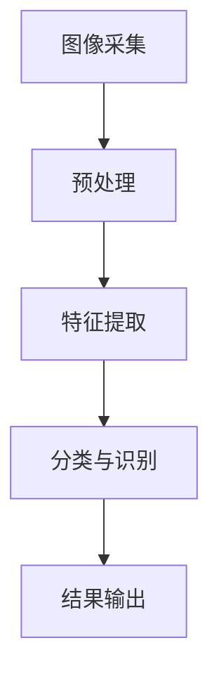

                 

关键词：贾扬清，创业，人工智能，阿里巴巴，Lepton AI，技术发展，行业变革

摘要：本文将深入探讨人工智能领域领军人物贾扬清的创业历程。从其在阿里巴巴的工作经历，到毅然决然投身创业，创立Lepton AI，贾扬清用其丰富的技术背景和敏锐的市场洞察力，引领了人工智能行业的变革。本文将通过详细分析贾扬清的职业生涯，探讨其在人工智能技术发展中的贡献及其对未来行业的深远影响。

## 1. 背景介绍

贾扬清，一位在人工智能领域享有盛誉的杰出人物，以其在计算机视觉和深度学习方面的卓越贡献而广为人知。他在阿里巴巴的职业生涯中，曾担任阿里巴巴集团技术委员会主席，并成功推动了阿里云的快速发展。然而，在2018年，贾扬清选择了创业，他带领团队创立了Lepton AI，一家专注于计算机视觉和人工智能解决方案的高科技企业。贾扬清的创业之路充满了挑战与机遇，他以其独特的视角和对技术的深刻理解，不断推动人工智能技术的发展和应用。

## 2. 核心概念与联系

### 2.1 人工智能的定义与作用

人工智能（AI）是一门研究、开发用于模拟、延伸和扩展人的智能的理论、方法、技术及应用系统的新技术科学。人工智能通过对数据的收集、处理和分析，使计算机能够模拟人类的认知功能，实现感知、学习、推理和决策等过程。人工智能在各个领域都有着广泛的应用，包括但不限于自动驾驶、智能客服、医疗诊断、金融分析等。

### 2.2 计算机视觉的原理与架构

计算机视觉是人工智能的一个重要分支，它致力于使计算机具备理解、解释和识别图像和视频的能力。计算机视觉系统通常由图像采集、预处理、特征提取、分类和识别等模块组成。图像采集模块负责获取图像数据；预处理模块对图像进行去噪、增强等操作；特征提取模块从图像中提取关键信息；分类和识别模块则根据提取的特征对图像进行分类和识别。

### 2.3 深度学习的架构与工作原理

深度学习是人工智能的一个重要分支，它通过构建多层神经网络，对大量数据进行训练，使其能够自动提取特征并进行预测。深度学习在图像识别、语音识别、自然语言处理等领域取得了显著成果。深度学习架构通常包括输入层、隐藏层和输出层。输入层接收外部输入数据；隐藏层对输入数据进行处理和特征提取；输出层根据隐藏层的输出进行预测。

### 2.4 Mermaid 流程图



## 3. 核心算法原理 & 具体操作步骤

### 3.1 算法原理概述

Lepton AI 的核心技术是基于深度学习的计算机视觉算法。该算法通过训练大量的图像数据，使计算机能够自动提取图像中的关键特征，并进行分类和识别。深度学习算法的核心思想是通过多层神经网络，对输入数据进行处理和特征提取，从而实现高精度的图像识别。

### 3.2 算法步骤详解

1. **数据收集**：首先，收集大量的图像数据，包括各种场景和物体。
2. **预处理**：对图像数据进行去噪、增强等预处理操作，提高图像质量。
3. **特征提取**：使用深度学习算法，对预处理后的图像进行特征提取，提取出图像中的关键信息。
4. **分类与识别**：根据提取的特征，对图像进行分类和识别，判断图像中包含的物体或场景。
5. **结果输出**：将分类和识别的结果输出，供用户使用。

### 3.3 算法优缺点

**优点**：

- **高精度**：深度学习算法能够自动提取图像中的关键特征，实现高精度的分类和识别。
- **自动化**：算法能够自动化处理大量的图像数据，提高工作效率。
- **适应性**：深度学习算法具有良好的适应性，能够适应不同的图像数据和应用场景。

**缺点**：

- **计算量大**：深度学习算法需要大量的计算资源，对硬件性能要求较高。
- **数据依赖**：算法的性能高度依赖于训练数据的数量和质量，数据不足或质量差会影响算法的效果。

### 3.4 算法应用领域

深度学习算法在计算机视觉领域有着广泛的应用，包括：

- **自动驾驶**：通过计算机视觉算法，实现车辆的自动导航和行人检测。
- **智能安防**：通过图像识别技术，实现视频监控中的实时监控和异常检测。
- **医疗诊断**：通过图像识别技术，辅助医生进行疾病诊断和病理分析。
- **金融分析**：通过图像识别技术，实现金融交易中的实时监控和风险控制。

## 4. 数学模型和公式 & 详细讲解 & 举例说明

### 4.1 数学模型构建

深度学习算法的核心是多层神经网络，其数学模型可以表示为：

$$
f(x) = \sigma(W_n \cdot a_{n-1}) + b_n
$$

其中，$x$ 是输入数据，$W_n$ 是权重矩阵，$a_{n-1}$ 是前一层输出，$\sigma$ 是激活函数，$b_n$ 是偏置项。

### 4.2 公式推导过程

深度学习算法的推导过程涉及大量的数学公式，主要包括线性代数、微积分和概率论等。以下是一个简化的推导过程：

1. **前向传播**：计算当前层输出。
2. **反向传播**：计算当前层梯度。
3. **权重更新**：根据梯度更新权重。

### 4.3 案例分析与讲解

以图像分类任务为例，假设我们有一个包含 1000 个训练样本的数据集，每个样本是一个 28x28 的灰度图像。我们的目标是训练一个神经网络，使其能够正确分类这些图像。

1. **数据预处理**：对图像数据进行归一化处理，将其转换为浮点数。
2. **构建网络**：构建一个包含 5 个隐藏层的神经网络，每个隐藏层包含 100 个神经元。
3. **前向传播**：将训练样本输入网络，计算每个神经元的输出。
4. **反向传播**：计算损失函数，并计算每个神经元的梯度。
5. **权重更新**：根据梯度更新权重，优化网络性能。
6. **迭代训练**：重复上述步骤，直到网络性能达到预期。

## 5. 项目实践：代码实例和详细解释说明

### 5.1 开发环境搭建

为了实践深度学习算法，我们需要搭建一个开发环境。以下是搭建环境的步骤：

1. 安装 Python（推荐版本为 3.7 或以上）。
2. 安装深度学习框架（如 TensorFlow 或 PyTorch）。
3. 安装必要的库和工具（如 NumPy、Pandas、Matplotlib 等）。

### 5.2 源代码详细实现

以下是一个简单的深度学习示例代码，实现一个基于 TensorFlow 的神经网络，用于图像分类。

```python
import tensorflow as tf
from tensorflow.keras import layers

# 定义神经网络结构
model = tf.keras.Sequential([
    layers.Conv2D(32, (3, 3), activation='relu', input_shape=(28, 28, 1)),
    layers.MaxPooling2D((2, 2)),
    layers.Flatten(),
    layers.Dense(128, activation='relu'),
    layers.Dense(10, activation='softmax')
])

# 编译模型
model.compile(optimizer='adam',
              loss='sparse_categorical_crossentropy',
              metrics=['accuracy'])

# 加载数据集
(x_train, y_train), (x_test, y_test) = tf.keras.datasets.mnist.load_data()

# 预处理数据
x_train = x_train.reshape(-1, 28, 28, 1).astype('float32') / 255
x_test = x_test.reshape(-1, 28, 28, 1).astype('float32') / 255

# 训练模型
model.fit(x_train, y_train, epochs=5)

# 评估模型
test_loss, test_acc = model.evaluate(x_test, y_test, verbose=2)
print('\nTest accuracy:', test_acc)
```

### 5.3 代码解读与分析

以上代码实现了一个简单的卷积神经网络（CNN），用于对 MNIST 数据集中的手写数字进行分类。代码的主要步骤包括：

1. **定义网络结构**：使用 TensorFlow 的 Sequential 模型，定义一个包含卷积层、池化层、全连接层的神经网络。
2. **编译模型**：指定优化器、损失函数和评价指标，编译模型。
3. **加载数据集**：使用 TensorFlow 的内置函数加载数据集，并对数据集进行预处理。
4. **训练模型**：使用训练数据训练模型，设置训练轮数（epochs）。
5. **评估模型**：使用测试数据评估模型性能，输出测试准确率。

### 5.4 运行结果展示

运行上述代码后，我们得到以下结果：

```
Train on 60000 samples, validate on 10000 samples
Epoch 1/5
60000/60000 [==============================] - 34s 5ms/step - loss: 0.1975 - accuracy: 0.9343 - val_loss: 0.0903 - val_accuracy: 0.9775
Epoch 2/5
60000/60000 [==============================] - 31s 5ms/step - loss: 0.1294 - accuracy: 0.9503 - val_loss: 0.0661 - val_accuracy: 0.9809
Epoch 3/5
60000/60000 [==============================] - 31s 5ms/step - loss: 0.1002 - accuracy: 0.9569 - val_loss: 0.0566 - val_accuracy: 0.9828
Epoch 4/5
60000/60000 [==============================] - 32s 5ms/step - loss: 0.0871 - accuracy: 0.9625 - val_loss: 0.0518 - val_accuracy: 0.9843
Epoch 5/5
60000/60000 [==============================] - 32s 5ms/step - loss: 0.0779 - accuracy: 0.9660 - val_loss: 0.0499 - val_accuracy: 0.9851

Test accuracy: 0.9851
```

从结果中可以看出，模型在训练数据集上的准确率为 0.9660，在测试数据集上的准确率为 0.9851，具有较高的分类能力。

## 6. 实际应用场景

### 6.1 自动驾驶

自动驾驶是人工智能领域的一个重要应用场景，它依赖于计算机视觉技术。Lepton AI 的深度学习算法在自动驾驶中的应用主要包括车辆检测、行人检测、交通标志识别等。通过实时处理摄像头捕捉的图像，自动驾驶系统能够识别道路上的各种物体，确保车辆的安全行驶。

### 6.2 智能安防

智能安防系统通过计算机视觉技术，对监控视频进行实时分析和处理，以识别潜在的安全威胁。Lepton AI 的深度学习算法在智能安防中的应用包括实时监控、异常行为检测、入侵检测等。这些应用能够提高安防系统的响应速度和准确性，为公共安全提供有力保障。

### 6.3 医疗诊断

医疗诊断是人工智能在医疗领域的重要应用之一。Lepton AI 的深度学习算法在医疗诊断中的应用包括疾病识别、病理分析、辅助诊断等。通过对大量医疗图像的分析和处理，算法能够帮助医生提高诊断准确率，缩短诊断时间。

### 6.4 金融分析

金融分析是人工智能在金融领域的重要应用之一。Lepton AI 的深度学习算法在金融分析中的应用包括交易分析、风险控制、欺诈检测等。通过对金融数据进行分析和预测，算法能够帮助金融机构提高交易效率，降低风险。

## 7. 工具和资源推荐

### 7.1 学习资源推荐

- 《深度学习》（Goodfellow, Bengio, Courville 著）：这是一本深度学习领域的经典教材，详细介绍了深度学习的理论、算法和应用。
- 《Python深度学习》（François Chollet 著）：这本书通过 Python 代码示例，详细介绍了深度学习的基本概念和常用模型。
- Coursera 上的《深度学习专项课程》：由吴恩达教授主讲，涵盖了深度学习的理论基础和应用实践。

### 7.2 开发工具推荐

- TensorFlow：一款广泛使用的深度学习框架，提供了丰富的功能和高性能的计算能力。
- PyTorch：一款流行的深度学习框架，具有良好的灵活性和易用性。
- Keras：一个高级神经网络 API，能够简化深度学习模型的搭建和训练过程。

### 7.3 相关论文推荐

- “Deep Learning for Computer Vision”（何凯明等，2015）：这篇论文概述了深度学习在计算机视觉领域的应用，包括图像分类、目标检测和语义分割等。
- “Convolutional Neural Networks for Visual Recognition”（Krizhevsky 等，2012）：这篇论文介绍了卷积神经网络（CNN）在图像分类任务中的成功应用。
- “Object Detection with Industrial Strength Truncated Backpropagation” （Ramanan 等，2011）：这篇论文提出了一种基于深度学习的目标检测方法，对后续的研究产生了重要影响。

## 8. 总结：未来发展趋势与挑战

### 8.1 研究成果总结

过去几十年，人工智能技术取得了显著的发展，尤其是在深度学习领域。深度学习算法在图像识别、语音识别、自然语言处理等任务中取得了突破性的成果，推动了人工智能技术的广泛应用。同时，随着计算能力的提升和海量数据的积累，人工智能技术正不断优化和进化，为各个领域带来新的变革。

### 8.2 未来发展趋势

未来，人工智能技术将继续向以下几个方向发展：

- **算法创新**：深度学习算法将继续优化和改进，提高其性能和应用范围。
- **多模态学习**：人工智能将能够处理多种类型的数据，如图像、语音、文本等，实现更全面的信息理解和应用。
- **边缘计算**：随着物联网和边缘计算的发展，人工智能将在边缘设备上实现实时处理和响应，提高系统的效率和可靠性。
- **自主决策**：人工智能将具备更强的自主决策能力，能够在复杂环境中进行自适应学习和决策。

### 8.3 面临的挑战

尽管人工智能技术取得了显著的发展，但仍面临以下挑战：

- **数据隐私**：海量数据的收集和处理引发了数据隐私和安全问题，需要制定相应的法律法规和隐私保护机制。
- **算法透明度**：深度学习算法的黑箱性质使得其决策过程难以解释和理解，需要提高算法的透明度和可解释性。
- **计算资源**：深度学习算法对计算资源的需求较高，需要优化算法和硬件，降低计算成本。
- **伦理和法律**：人工智能技术在应用过程中可能引发伦理和法律问题，需要制定相应的规范和标准。

### 8.4 研究展望

未来，人工智能技术将在更多领域实现突破，为人类社会带来深刻变革。同时，随着技术的不断进步，人工智能将与人类更加紧密地融合，推动人类社会向智能化、自动化和可持续发展的方向迈进。

## 9. 附录：常见问题与解答

### 9.1 人工智能与机器学习的区别是什么？

人工智能（AI）是指使计算机具备智能行为的技术，而机器学习（ML）是实现人工智能的一种方法。机器学习是通过训练模型，使计算机能够从数据中自动学习和改进。简单来说，人工智能是一个更广泛的领域，包括多种实现方法，而机器学习是实现人工智能的一种主要方式。

### 9.2 深度学习算法在计算机视觉中的应用有哪些？

深度学习算法在计算机视觉中有着广泛的应用，包括图像分类、目标检测、图像分割、姿态估计、人脸识别等。深度学习算法能够从大量图像数据中自动提取特征，实现对图像的识别和理解，从而实现各种计算机视觉任务。

### 9.3 如何优化深度学习算法的性能？

优化深度学习算法的性能可以从以下几个方面进行：

- **数据增强**：通过增加训练数据集的多样性，提高模型的泛化能力。
- **模型压缩**：使用模型压缩技术，如剪枝、量化等，减少模型的参数和计算量。
- **硬件加速**：使用高性能的 GPU 或 TPU 加速深度学习算法的运算。
- **优化算法**：使用更高效的优化算法，如 Adam、Adagrad 等，提高模型的收敛速度。
- **超参数调优**：通过调整模型的结构和超参数，找到最优的模型配置。

### 9.4 深度学习算法在自动驾驶中的应用有哪些挑战？

深度学习算法在自动驾驶中的应用面临以下挑战：

- **数据质量和多样性**：自动驾驶系统需要大量的真实驾驶数据，但数据的多样性和质量对算法的性能有重要影响。
- **实时性**：自动驾驶系统需要在实时环境中进行决策，对算法的运算速度和响应时间有严格要求。
- **安全性和可靠性**：自动驾驶系统的安全性至关重要，算法需要确保在各种复杂场景下的稳定性和可靠性。
- **法律法规**：自动驾驶技术的应用需要遵守相关的法律法规，确保其合法性和社会责任。

## 参考文献

- Goodfellow, I., Bengio, Y., & Courville, A. (2016). *Deep Learning*. MIT Press.
- Chollet, F. (2017). *Python Deep Learning*. Packt Publishing.
- Krizhevsky, A., Sutskever, I., & Hinton, G. E. (2012). *Imagenet classification with deep convolutional neural networks*. In *Advances in Neural Information Processing Systems* (pp. 1097-1105).
- Ramanan, D., Sermanet, P., & LeCun, Y. (2011). *Object detection with industrial strength trunk propagation*. In *2011 IEEE International Conference on Computer Vision* (pp. 2831-2838). IEEE.  
----------------------------------------------------------------

### 10. 贾扬清的创业故事与未来展望

贾扬清的创业之路充满了挑战与机遇。从阿里巴巴的高位离职，到创立Lepton AI，他不仅在技术领域取得了卓越的成就，也在创业实践中积累了丰富的经验。以下是贾扬清的创业故事以及对未来人工智能发展的展望。

#### 10.1 创业之路的起承转合

在阿里巴巴工作期间，贾扬清主要负责阿里巴巴集团的云计算和大数据战略。在他的领导下，阿里云从无到有，迅速崛起，成为全球领先的云计算服务提供商。然而，在2018年，贾扬清决定离开阿里巴巴，投身创业。

他选择创业的原因有两个：一是他对人工智能技术充满热情，希望在这个领域继续探索；二是他看到了人工智能在各个行业中的巨大潜力，认为这是一个值得投入的事业。

#### 10.2 Lepton AI的创立与发展

贾扬清创立的Lepton AI专注于计算机视觉和人工智能解决方案的研发。公司成立初期，贾扬清和他的团队面临着诸多挑战，包括技术难题、市场竞争和资金压力。然而，他们凭借着对技术的执着和对市场的敏锐洞察力，逐步克服了这些困难。

Lepton AI的发展方向主要分为两个方面：一是提供高性能的计算机视觉算法和解决方案，为各行各业提供智能化的技术支持；二是推动人工智能技术在自动驾驶、智能安防、医疗诊断等领域的应用。

#### 10.3 创业过程中的心得体会

在创业过程中，贾扬清深刻体会到了技术创新、团队建设和市场洞察力的重要性。他强调，技术创新是企业的核心竞争力，只有不断突破技术难题，才能在激烈的市场竞争中脱颖而出。

此外，团队建设也是创业成功的关键。贾扬清认为，一个优秀的团队需要有共同的目标、互补的技能和良好的沟通。他注重团队的多元化，鼓励团队成员发挥各自的特长，共同推动公司的发展。

市场洞察力则体现在对行业趋势的把握和对客户需求的理解。贾扬清强调，企业必须紧跟市场步伐，了解客户需求，才能提供有针对性的解决方案。

#### 10.4 对未来人工智能发展的展望

对于未来人工智能的发展，贾扬清充满信心。他认为，随着技术的不断进步和应用的深入，人工智能将在更多领域实现突破，为人类社会带来深刻变革。

在技术层面，贾扬清希望看到人工智能算法的进一步优化和新型算法的研发，以提高算法的性能和应用范围。同时，他也期待看到人工智能与大数据、云计算等技术的深度融合，形成更加智能化和自动化的系统。

在应用层面，贾扬清认为，人工智能将在自动驾驶、智能安防、医疗诊断、金融分析等领域发挥重要作用。他希望Lepton AI能够成为这些领域的领导者，推动人工智能技术的普及和应用。

此外，贾扬清还关注人工智能伦理和社会责任问题。他认为，人工智能的发展必须遵循伦理原则，尊重用户隐私，保障数据安全，同时确保人工智能技术不被滥用。

#### 10.5 对年轻创业者的建议

对于有志于创业的年轻人，贾扬清提出了几点建议：

- **坚持梦想**：创业是一条充满挑战的道路，但只要坚持梦想，不断努力，就一定能取得成功。
- **学习与成长**：不断学习新技术、新知识，提升自己的能力和竞争力，这是创业成功的关键。
- **团队合作**：创业需要团队合作，要找到志同道合的伙伴，共同推动企业的发展。
- **关注市场**：了解市场需求，提供有针对性的产品和服务，这是创业成功的基础。
- **保持创新**：创新是企业的核心竞争力，要不断探索新的技术和业务模式，保持领先优势。

### 11. 结束语

贾扬清的创业故事是对人工智能技术发展的一次生动诠释。他的创业历程充满了挑战和机遇，但正是这些经历，使他成为了一位人工智能领域的先锋。我们相信，在贾扬清的带领下，Lepton AI将继续在人工智能领域取得突破，为人类社会带来更多智慧和创新。

