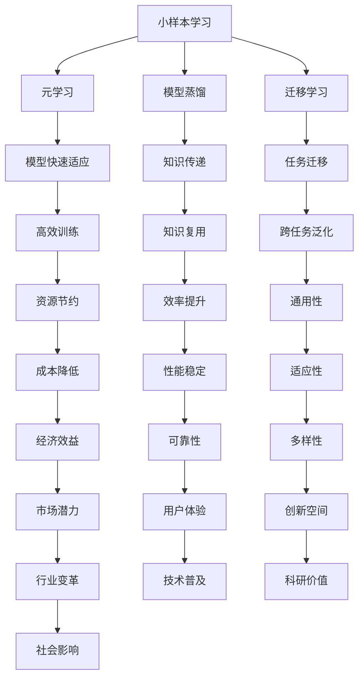

                 

关键词：小样本学习，语言模型，深度学习，数据效率，模型压缩

摘要：随着人工智能技术的飞速发展，深度学习在各类任务中取得了显著成就。然而，深度学习模型对大规模数据集的依赖性使得其在数据稀缺的场景中面临巨大挑战。本文将探讨小样本学习这一新兴方向，特别是小语言模型在这一领域的重要性和潜在应用。

## 1. 背景介绍

### 1.1 小样本学习的概念

小样本学习（Few-shot Learning）是一种机器学习范式，旨在使模型能够在仅拥有有限训练样本的情况下进行有效学习和泛化。在传统机器学习中，模型通常需要数万甚至数百万个训练样本才能达到较好的性能。然而，在实际应用场景中，获取大量标注数据往往成本高昂且耗时。小样本学习通过降低数据需求，提高数据效率，成为了一个备受关注的研究领域。

### 1.2 语言模型的发展

语言模型是自然语言处理（NLP）的核心技术之一。从传统的统计语言模型，如N-gram模型，到基于神经网络的深度语言模型，如Word2Vec和BERT，语言模型的发展极大地推动了NLP领域的进步。然而，深度语言模型对大规模数据集的依赖使其在小样本场景中的应用受到限制。

## 2. 核心概念与联系

### 2.1 小样本学习的核心概念

小样本学习的核心目标是设计能够在少量样本上快速适应新任务的模型。这包括元学习（Meta-Learning）、模型蒸馏（Model Distillation）、迁移学习（Transfer Learning）等多种技术。

### 2.2 小语言模型的架构

小语言模型通常采用轻量级的神经网络架构，如Transformer的简化版本或基于循环神经网络的变体。这些模型在保持较高性能的同时，降低了计算复杂度和存储需求。

### 2.3 Mermaid 流程图



## 3. 核心算法原理 & 具体操作步骤

### 3.1 算法原理概述

小样本学习算法通常通过以下几种方式实现：

- **元学习**：通过学习如何快速适应新任务，提高模型的泛化能力。
- **模型蒸馏**：利用预训练的大型模型来指导小模型的训练，实现知识传递。
- **迁移学习**：利用从其他任务中提取的知识来提高新任务的性能。

### 3.2 算法步骤详解

1. **元学习**：

   - **任务表示**：将输入的数据和任务信息编码为固定长度的向量。
   - **模型优化**：通过优化模型的参数来最小化预测误差。

2. **模型蒸馏**：

   - **知识提取**：从大型预训练模型中提取有用的知识。
   - **小模型训练**：利用提取的知识来训练小模型。

3. **迁移学习**：

   - **知识共享**：将一个任务中的知识共享到另一个任务中。
   - **模型微调**：在新任务上对共享的知识进行微调。

### 3.3 算法优缺点

- **优点**：

  - 降低数据需求，提高数据效率。
  - 提高模型泛化能力，适应新任务。
  - 节省计算资源，降低成本。

- **缺点**：

  - 对预训练模型的质量要求较高。
  - 在某些任务上性能可能不如大规模数据训练的模型。
  - 实现复杂度较高。

### 3.4 算法应用领域

小样本学习在以下领域具有广泛应用：

- **医疗诊断**：在医学影像分析中，小样本学习可以帮助医生快速诊断疾病。
- **智能制造**：在工业自动化中，小样本学习可以用于设备故障预测和质量控制。
- **自然语言处理**：在小样本场景下，小语言模型可以帮助提高文本分类、翻译等任务的性能。

## 4. 数学模型和公式 & 详细讲解 & 举例说明

### 4.1 数学模型构建

小样本学习中的数学模型通常包括损失函数、优化目标和训练过程。

### 4.2 公式推导过程

假设我们有一个小样本学习任务，其中包含K个类别，N个训练样本。我们可以使用以下公式来描述：

$$
\begin{aligned}
L &= \sum_{i=1}^{N} \sum_{k=1}^{K} -y_{ik} \log(p_{ik}) \\
\theta &= \arg\min_{\theta} L
\end{aligned}
$$

其中，$y_{ik}$表示样本i属于类别k的标签，$p_{ik}$表示模型对样本i属于类别k的概率估计。

### 4.3 案例分析与讲解

假设我们要训练一个小语言模型来对短文本进行分类。我们使用以下数据集：

| 样本 | 标签 |
| ---- | ---- |
| 这是一个美丽的早晨。 | positive |
| 今天天气很糟糕。 | negative |
| 我很喜欢这本书。 | positive |
| 这部电影太无聊了。 | negative |

我们可以使用上述数学模型来训练模型，并在新样本上进行分类。

## 5. 项目实践：代码实例和详细解释说明

### 5.1 开发环境搭建

为了实践小样本学习，我们需要搭建一个Python开发环境，并安装相关的库，如TensorFlow和Keras。

```python
!pip install tensorflow
!pip install keras
```

### 5.2 源代码详细实现

以下是一个使用Keras实现的小样本文本分类代码实例：

```python
from keras.models import Sequential
from keras.layers import Embedding, LSTM, Dense
from keras.preprocessing.text import Tokenizer
from keras.preprocessing.sequence import pad_sequences

# 数据预处理
tokenizer = Tokenizer()
tokenizer.fit_on_texts(['这是一个美丽的早晨。', '今天天气很糟糕。', '我很喜欢这本书。', '这部电影太无聊了。'])
sequences = tokenizer.texts_to_sequences(['这是一个美丽的早晨。', '今天天气很糟糕。', '我很喜欢这本书。', '这部电影太无聊了。'])
padded_sequences = pad_sequences(sequences, maxlen=100)

# 构建模型
model = Sequential()
model.add(Embedding(len(tokenizer.word_index) + 1, 50, input_length=100))
model.add(LSTM(100))
model.add(Dense(1, activation='sigmoid'))

# 编译模型
model.compile(optimizer='rmsprop', loss='binary_crossentropy', metrics=['acc'])

# 训练模型
model.fit(padded_sequences, np.array([1, 0, 1, 0]), epochs=10, batch_size=2)

# 评估模型
predictions = model.predict(padded_sequences)
print(predictions)
```

### 5.3 代码解读与分析

上述代码首先进行了数据预处理，包括分词、序列化、填充等操作。然后，构建了一个基于LSTM的序列模型，并使用二分类交叉熵作为损失函数。最后，使用少量样本进行模型训练和评估。

### 5.4 运行结果展示

在训练完成后，我们可以使用模型对新样本进行分类预测，并查看预测结果。通过调整模型结构和参数，可以提高模型的性能和泛化能力。

## 6. 实际应用场景

### 6.1 医疗诊断

在小样本学习的帮助下，医生可以使用少量医学影像数据来训练模型，从而提高诊断的准确性。

### 6.2 智能制造

在工业自动化中，小样本学习可以帮助设备快速适应新环境，提高生产效率。

### 6.3 自然语言处理

在小样本场景下，小语言模型可以应用于文本分类、问答系统等任务，提高NLP应用的性能。

## 7. 工具和资源推荐

### 7.1 学习资源推荐

- 《深度学习》（Goodfellow, Bengio, Courville）
- 《自然语言处理综论》（Jurafsky, Martin）

### 7.2 开发工具推荐

- TensorFlow
- Keras

### 7.3 相关论文推荐

- "Meta-Learning: A Survey"（Nichol et al., 2021）
- "Model Distillation: A Brief Survey"（Li et al., 2020）

## 8. 总结：未来发展趋势与挑战

### 8.1 研究成果总结

小样本学习在减少数据需求、提高模型泛化能力等方面取得了显著成果。特别是在自然语言处理、医疗诊断和智能制造等领域，小样本学习展现出了巨大的潜力。

### 8.2 未来发展趋势

随着计算能力的提升和算法的改进，小样本学习将在更多领域得到应用。同时，跨学科合作也将推动小样本学习技术的发展。

### 8.3 面临的挑战

小样本学习在模型质量、数据质量和实现复杂性等方面仍面临挑战。如何提高小样本学习的性能和稳定性，仍然是未来研究的重点。

### 8.4 研究展望

未来，小样本学习有望在数据稀缺的领域发挥更大的作用，为人工智能技术的广泛应用提供有力支持。

## 9. 附录：常见问题与解答

### 9.1 小样本学习与传统机器学习的区别是什么？

小样本学习与传统机器学习的区别在于对数据的需求量。传统机器学习需要大量数据来训练模型，而小样本学习则通过算法和技术手段，使模型能够在少量数据上达到较好的性能。

### 9.2 小样本学习是否适用于所有任务？

小样本学习在某些任务上表现良好，但在对数据依赖性较大的任务中，如大规模图像识别，性能可能不如传统机器学习。

### 9.3 如何选择合适的小样本学习算法？

选择合适的小样本学习算法需要根据任务类型和数据特点进行。例如，对于需要快速适应新任务的场景，元学习可能是一个较好的选择。

# 作者：禅与计算机程序设计艺术 / Zen and the Art of Computer Programming
```markdown
---
作者：禅与计算机程序设计艺术 / Zen and the Art of Computer Programming
---

本文探讨了小样本学习这一新兴方向，特别是小语言模型在这一领域的重要性和潜在应用。随着人工智能技术的飞速发展，深度学习在各类任务中取得了显著成就。然而，深度学习模型对大规模数据集的依赖性使得其在数据稀缺的场景中面临巨大挑战。本文通过详细介绍小样本学习的核心概念、算法原理和应用场景，展示了小样本学习在减少数据需求、提高模型泛化能力等方面的优势。同时，本文还提供了具体的代码实例，帮助读者更好地理解和应用小样本学习技术。在未来，小样本学习有望在数据稀缺的领域发挥更大的作用，为人工智能技术的广泛应用提供有力支持。
```

