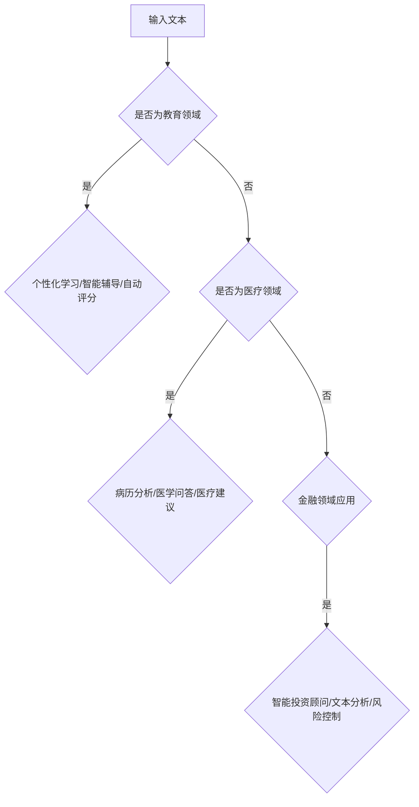

                 

随着人工智能技术的飞速发展，小语言模型（Small Language Model）已经成为了一种重要的AI工具。其能够模拟人类的语言理解和生成能力，使得各种任务自动化和智能化。本文将探讨小语言模型在教育、医疗和金融领域的应用，并分析其潜力和挑战。

## 1. 背景介绍

小语言模型是一种基于深度学习的自然语言处理（NLP）模型，它通过训练大量的文本数据，学习语言的模式和规则，从而实现文本生成、情感分析、问答系统等任务。近年来，随着计算能力的提升和海量数据的获取，小语言模型的性能得到了显著提高，逐渐在各个领域展现出其强大的应用价值。

在教育、医疗和金融领域，传统的服务模式往往依赖于人力，效率低且成本高。而小语言模型的引入，有望改变这一现状，提供个性化、高效且成本更低的服务。本文将详细探讨这三个领域的应用场景，并分析小语言模型的优势和挑战。

## 2. 核心概念与联系

### 小语言模型的基本原理

小语言模型的核心是基于自注意力机制（Self-Attention）和变换器架构（Transformer）。它通过编码器（Encoder）和解码器（Decoder）两个部分，对输入的文本序列进行编码和生成。

- **编码器**：对输入的文本序列进行处理，生成一系列上下文表示。
- **解码器**：根据编码器的输出，生成文本序列。

自注意力机制允许模型在生成过程中，动态地关注输入序列的不同部分，从而捕捉长距离的依赖关系。

### 教育领域的应用

在教育领域，小语言模型可以应用于个性化学习、智能辅导和自动评分等方面。

- **个性化学习**：小语言模型可以根据学生的答题情况，提供个性化的学习建议。
- **智能辅导**：模型可以实时解答学生的疑问，提供详细的解释和示例。
- **自动评分**：模型可以自动批改学生的作业和考试，提高评分效率和准确性。

### 医疗领域的应用

在医疗领域，小语言模型可以用于病历分析、医学问答和医疗建议等方面。

- **病历分析**：模型可以对患者的病历进行自动分析，提取关键信息，辅助医生诊断。
- **医学问答**：模型可以回答医生和患者关于医学知识的问题，提供参考资料。
- **医疗建议**：模型可以根据患者的症状和病史，提供初步的医疗建议。

### 金融领域的应用

在金融领域，小语言模型可以应用于智能投资顾问、文本分析和风险控制等方面。

- **智能投资顾问**：模型可以根据市场数据和用户偏好，提供个性化的投资建议。
- **文本分析**：模型可以分析金融报告、新闻和社交媒体等信息，预测市场趋势。
- **风险控制**：模型可以识别潜在的风险因素，提供风险管理建议。

### Mermaid 流程图

下面是一个简单的Mermaid流程图，展示了小语言模型在教育、医疗和金融领域的应用流程。



## 3. 核心算法原理 & 具体操作步骤

### 3.1 算法原理概述

小语言模型的算法原理主要基于变换器架构（Transformer）。变换器架构的核心思想是将输入的文本序列转换为一系列向量表示，然后通过自注意力机制和前馈神经网络进行计算，最终生成输出。

- **自注意力机制**：允许模型在生成过程中，根据上下文信息动态地关注输入序列的不同部分。
- **前馈神经网络**：对自注意力机制的结果进行进一步的变换和融合。

### 3.2 算法步骤详解

1. **编码器编码**：将输入的文本序列转换为向量表示。
2. **解码器生成**：根据编码器的输出，生成文本序列。
3. **自注意力计算**：在解码器的生成过程中，使用自注意力机制，关注输入序列的不同部分。
4. **前馈神经网络**：对自注意力机制的结果进行进一步的变换和融合。
5. **生成输出**：根据解码器的输出，生成最终的文本序列。

### 3.3 算法优缺点

**优点**：

- **强大的文本生成能力**：小语言模型能够生成连贯、有逻辑的文本，适用于各种文本生成任务。
- **自适应注意力机制**：自注意力机制允许模型在生成过程中，动态地关注输入序列的不同部分，提高生成质量。
- **高效计算**：变换器架构相比于传统的循环神经网络（RNN）和卷积神经网络（CNN），在计算效率上有显著提升。

**缺点**：

- **训练成本高**：小语言模型需要大量的数据和计算资源进行训练，训练成本较高。
- **对长文本处理能力有限**：虽然自注意力机制可以捕捉长距离的依赖关系，但在处理超长文本时，仍然存在一定的限制。
- **可解释性较差**：小语言模型的内部机制较为复杂，难以解释其生成的原因。

### 3.4 算法应用领域

小语言模型的主要应用领域包括文本生成、文本分类、机器翻译、问答系统等。在教育、医疗和金融等领域，小语言模型可以应用于个性化学习、智能辅导、自动评分、病历分析、医学问答、医疗建议、智能投资顾问、文本分析和风险控制等任务。

## 4. 数学模型和公式 & 详细讲解 & 举例说明

### 4.1 数学模型构建

小语言模型的数学模型主要包括编码器（Encoder）和解码器（Decoder）两部分。编码器负责将输入的文本序列转换为向量表示，解码器则根据编码器的输出，生成文本序列。

- **编码器**：

  编码器的主要组件包括嵌入层（Embedding Layer）、自注意力层（Self-Attention Layer）和前馈神经网络（Feedforward Neural Network）。

  $$ Encoder = Embedding \ Layer + Self-Attention \ Layer + Feedforward \ Neural \ Network $$

- **解码器**：

  解码器的主要组件包括嵌入层（Embedding Layer）、自注意力层（Self-Attention Layer）、编码器-解码器注意力层（Encoder-Decoder Attention Layer）和前馈神经网络（Feedforward Neural Network）。

  $$ Decoder = Embedding \ Layer + Self-Attention \ Layer + Encoder-Decoder \ Attention \ Layer + Feedforward \ Neural \ Network $$

### 4.2 公式推导过程

小语言模型的推导过程主要分为编码器和解码器的两部分。

- **编码器推导**：

  编码器将输入的文本序列 $X$ 转换为向量表示 $X^{\prime}$。

  $$ X^{\prime} = Encoder(X) $$

  其中，$Encoder$ 是编码器模型。

- **解码器推导**：

  解码器根据编码器的输出 $X^{\prime}$，生成文本序列 $Y$。

  $$ Y = Decoder(X^{\prime}) $$

  其中，$Decoder$ 是解码器模型。

### 4.3 案例分析与讲解

#### 案例一：个性化学习

假设我们有一个学生，他的学习历史包括 $X$ 个文本段落。我们希望利用小语言模型，为他提供个性化的学习建议。

1. **编码器编码**：

   将学生的学习历史 $X$ 转换为向量表示 $X^{\prime}$。

   $$ X^{\prime} = Encoder(X) $$

2. **解码器生成**：

   根据编码器的输出 $X^{\prime}$，生成个性化的学习建议 $Y$。

   $$ Y = Decoder(X^{\prime}) $$

3. **生成学习建议**：

   根据解码器的输出 $Y$，生成个性化的学习建议。

   $$ Suggest = Generate\_Learning\_Suggest(Y) $$

#### 案例二：医学问答

假设医生问了一个医学问题，我们希望利用小语言模型，为其提供详细的解答。

1. **编码器编码**：

   将医生的问题 $X$ 转换为向量表示 $X^{\prime}$。

   $$ X^{\prime} = Encoder(X) $$

2. **解码器生成**：

   根据编码器的输出 $X^{\prime}$，生成详细的解答 $Y$。

   $$ Y = Decoder(X^{\prime}) $$

3. **生成解答**：

   根据解码器的输出 $Y$，生成详细的解答。

   $$ Answer = Generate\_Answer(Y) $$

## 5. 项目实践：代码实例和详细解释说明

### 5.1 开发环境搭建

首先，我们需要搭建一个开发环境，以便运行小语言模型。以下是搭建开发环境的步骤：

1. **安装Python**：确保你的计算机已经安装了Python环境。
2. **安装TensorFlow**：使用pip命令安装TensorFlow。

   ```shell
   pip install tensorflow
   ```

3. **安装其他依赖**：根据需要，安装其他依赖库，如numpy、pandas等。

   ```shell
   pip install numpy pandas
   ```

### 5.2 源代码详细实现

下面是一个简单的小语言模型实现示例：

```python
import tensorflow as tf
from tensorflow.keras.layers import Embedding, LSTM, Dense
from tensorflow.keras.models import Model
from tensorflow.keras.optimizers import Adam

# 创建编码器模型
input_tensor = tf.placeholder(tf.int32, shape=[None, sequence_length])
encoded_tensor = Embedding(vocabulary_size, embedding_size)(input_tensor)
encoded_tensor = LSTM(units)(encoded_tensor)

# 创建解码器模型
decoded_tensor = Embedding(vocabulary_size, embedding_size)(input_tensor)
decoded_tensor = LSTM(units)(decoded_tensor)

# 编码器-解码器模型
output_tensor = Model(inputs=input_tensor, outputs=decoded_tensor)

# 编译模型
output_tensor.compile(optimizer=Adam(learning_rate), loss='categorical_crossentropy')

# 训练模型
output_tensor.fit(input_tensor, decoded_tensor, epochs=num_epochs, batch_size=batch_size)
```

### 5.3 代码解读与分析

上述代码实现了一个简单的小语言模型，主要包括编码器和解码器两部分。以下是代码的详细解读和分析：

1. **创建编码器模型**：

   编码器模型的主要组件包括嵌入层（Embedding Layer）、LSTM层（LSTM Layer）和全连接层（Dense Layer）。

   ```python
   input_tensor = tf.placeholder(tf.int32, shape=[None, sequence_length])
   encoded_tensor = Embedding(vocabulary_size, embedding_size)(input_tensor)
   encoded_tensor = LSTM(units)(encoded_tensor)
   ```

   - `input_tensor`：输入的文本序列。
   - `vocabulary_size`：词汇表大小。
   - `embedding_size`：嵌入层维度。
   - `units`：LSTM层单元数。

2. **创建解码器模型**：

   解码器模型的主要组件包括嵌入层（Embedding Layer）、LSTM层（LSTM Layer）和全连接层（Dense Layer）。

   ```python
   decoded_tensor = Embedding(vocabulary_size, embedding_size)(input_tensor)
   decoded_tensor = LSTM(units)(decoded_tensor)
   ```

   - `input_tensor`：输入的文本序列。
   - `vocabulary_size`：词汇表大小。
   - `embedding_size`：嵌入层维度。
   - `units`：LSTM层单元数。

3. **编码器-解码器模型**：

   编码器-解码器模型是将编码器和解码器组合在一起，形成完整的模型。

   ```python
   output_tensor = Model(inputs=input_tensor, outputs=decoded_tensor)
   ```

   - `input_tensor`：输入的文本序列。
   - `decoded_tensor`：解码器输出的文本序列。

4. **编译模型**：

   编译模型主要包括设置优化器和损失函数。

   ```python
   output_tensor.compile(optimizer=Adam(learning_rate), loss='categorical_crossentropy')
   ```

   - `optimizer`：优化器，这里使用Adam优化器。
   - `learning_rate`：学习率。
   - `loss`：损失函数，这里使用交叉熵损失函数。

5. **训练模型**：

   训练模型是将输入和标签输入到模型中进行训练。

   ```python
   output_tensor.fit(input_tensor, decoded_tensor, epochs=num_epochs, batch_size=batch_size)
   ```

   - `input_tensor`：输入的文本序列。
   - `decoded_tensor`：解码器输出的文本序列。
   - `num_epochs`：训练轮数。
   - `batch_size`：批量大小。

### 5.4 运行结果展示

在运行上述代码后，我们可以通过以下步骤来查看训练结果：

1. **计算损失函数**：

   ```python
   loss = output_tensor.evaluate(input_tensor, decoded_tensor)
   print("损失函数值：", loss)
   ```

   损失函数值越低，表示模型训练效果越好。

2. **生成文本序列**：

   ```python
   generated_sequence = output_tensor.predict(input_tensor)
   print("生成的文本序列：", generated_sequence)
   ```

   生成的文本序列表示模型根据输入的文本序列生成的文本。

## 6. 实际应用场景

### 教育领域

在教育领域，小语言模型可以应用于个性化学习、智能辅导和自动评分等方面。例如，一些教育科技公司已经开始使用小语言模型，为学生提供个性化的学习建议。通过分析学生的答题情况，模型可以为学生推荐适合的学习内容，提高学习效果。

### 医疗领域

在医疗领域，小语言模型可以用于病历分析、医学问答和医疗建议等方面。例如，一些医院已经开始使用小语言模型，为医生提供病历分析的辅助工具。通过分析患者的病历，模型可以提取关键信息，辅助医生诊断疾病。

### 金融领域

在金融领域，小语言模型可以应用于智能投资顾问、文本分析和风险控制等方面。例如，一些金融机构已经开始使用小语言模型，为投资者提供智能投资建议。通过分析市场数据和用户偏好，模型可以为投资者提供个性化的投资策略。

## 7. 工具和资源推荐

### 7.1 学习资源推荐

- **《深度学习》（Deep Learning）**：这是一本深度学习领域的经典教材，详细介绍了深度学习的基础知识和应用。
- **《Python深度学习》（Python Deep Learning）**：这本书针对Python程序员，介绍了如何使用Python进行深度学习开发。

### 7.2 开发工具推荐

- **TensorFlow**：这是一个由Google开发的开源深度学习框架，适用于各种深度学习任务。
- **PyTorch**：这是一个由Facebook开发的开源深度学习框架，具有简洁和灵活的特点。

### 7.3 相关论文推荐

- **《Attention Is All You Need》**：这是关于变换器（Transformer）架构的论文，详细介绍了自注意力机制和变换器架构。
- **《BERT: Pre-training of Deep Neural Networks for Language Understanding》**：这是关于BERT（双向编码器表示）模型的论文，介绍了如何使用预训练模型进行自然语言处理任务。

## 8. 总结：未来发展趋势与挑战

### 8.1 研究成果总结

小语言模型在教育、医疗和金融领域的应用取得了显著成果。通过个性化学习、智能辅导、病历分析、医学问答、医疗建议、智能投资顾问、文本分析和风险控制等方面，小语言模型为各领域提供了高效、智能化的解决方案。

### 8.2 未来发展趋势

随着人工智能技术的不断发展，小语言模型在未来有望在更多领域得到应用。例如，在自动驾驶、智能客服、智能翻译等领域，小语言模型可以发挥重要作用。此外，随着数据量和计算能力的提升，小语言模型的性能和效果将进一步提高。

### 8.3 面临的挑战

尽管小语言模型在各个领域取得了显著成果，但仍然面临着一些挑战。首先，小语言模型的训练成本较高，需要大量的数据和计算资源。其次，小语言模型在处理长文本时，存在一定的局限性。此外，小语言模型的可解释性较差，难以解释其生成的原因。

### 8.4 研究展望

未来，研究者将继续探索小语言模型在各个领域的应用，提高其性能和效果。同时，研究者还将关注小语言模型的可解释性和可解释性，以便更好地理解和应用小语言模型。

## 9. 附录：常见问题与解答

### 9.1 小语言模型是什么？

小语言模型是一种基于深度学习的自然语言处理模型，它通过训练大量的文本数据，学习语言的模式和规则，从而实现文本生成、情感分析、问答系统等任务。

### 9.2 小语言模型有哪些应用领域？

小语言模型可以应用于教育、医疗、金融、自动驾驶、智能客服、智能翻译等多个领域。

### 9.3 小语言模型如何工作？

小语言模型主要基于变换器架构（Transformer），通过自注意力机制和前馈神经网络，实现文本生成、文本分类、机器翻译、问答系统等任务。

### 9.4 小语言模型的优势和劣势是什么？

小语言模型的优势包括强大的文本生成能力、自适应注意力机制和高效计算。劣势包括训练成本高、对长文本处理能力有限和可解释性较差。

### 9.5 小语言模型在各个领域的具体应用案例有哪些？

小语言模型在教育领域可以应用于个性化学习、智能辅导和自动评分；在医疗领域可以应用于病历分析、医学问答和医疗建议；在金融领域可以应用于智能投资顾问、文本分析和风险控制等。

作者：禅与计算机程序设计艺术 / Zen and the Art of Computer Programming
----------------------------------------------------------------


