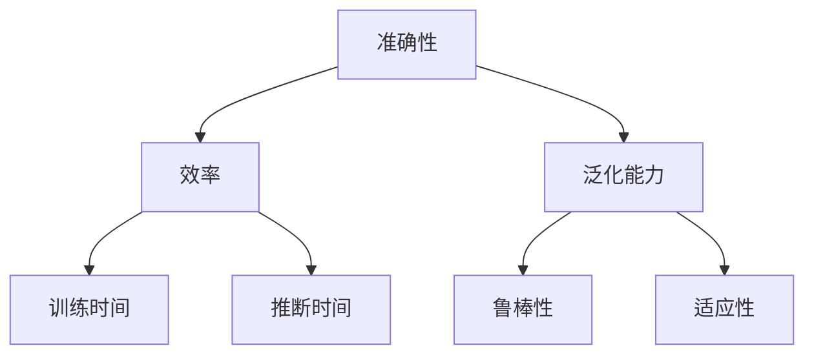

                 

关键词：小语言模型、评估框架、准确性、效率、泛化能力、技术博客

> 摘要：本文深入探讨了小语言模型的评估框架，重点分析了准确性、效率和泛化能力这三个关键评估指标。通过对核心概念与联系的分析，详细讲解了核心算法原理与具体操作步骤，并结合数学模型和公式，通过具体实例展示了模型的应用效果。最后，文章总结了实际应用场景，展望了未来发展趋势与挑战，并推荐了相关工具和资源。

## 1. 背景介绍

在近年来，自然语言处理（NLP）领域取得了显著的进展，尤其是小语言模型（如BERT、GPT等）在各项任务中表现出了强大的能力。然而，如何对这些模型进行有效的评估，成为了一个重要的问题。传统的评估指标，如准确性、召回率等，已经无法全面反映模型的真实性能。因此，本文旨在探讨一种全面的小语言模型评估框架，重点分析准确性、效率和泛化能力这三个关键指标。

## 2. 核心概念与联系

### 2.1 准确性

准确性是指模型在预测或分类任务中的正确率，是评估模型性能的最基本指标。对于小语言模型，准确性主要取决于模型对语言规律的掌握程度。

### 2.2 效率

效率是指模型在处理数据时的速度，包括训练时间和推断时间。对于小语言模型，提高效率具有重要意义，因为实际应用场景中往往需要处理大量数据。

### 2.3 泛化能力

泛化能力是指模型在未知数据上的表现，反映了模型的鲁棒性和适应性。对于小语言模型，泛化能力直接关系到模型在真实环境中的实际应用效果。

### 2.4 Mermaid 流程图



## 3. 核心算法原理 & 具体操作步骤

### 3.1 算法原理概述

本文所讨论的评估框架基于以下核心算法原理：

1. **准确性评估**：采用交叉验证方法，将数据集划分为训练集和验证集，通过比较模型在验证集上的预测结果与真实标签的匹配程度来评估准确性。
2. **效率评估**：通过计算模型在训练和推断过程中的时间消耗来评估效率。
3. **泛化能力评估**：采用留一法（Leave-One-Out）或K折交叉验证（K-Fold Cross Validation）方法，评估模型在未知数据上的表现。

### 3.2 算法步骤详解

1. **准确性评估**：

   - 数据预处理：对原始数据进行清洗、去噪和标准化处理。
   - 模型训练：使用训练集数据训练模型，并调整模型参数。
   - 验证集评估：使用验证集数据评估模型准确性。
   - 模型优化：根据验证集结果调整模型参数，提高准确性。

2. **效率评估**：

   - 训练时间评估：记录模型从训练开始到结束所需的总时间。
   - 推断时间评估：记录模型在处理单条数据时的平均时间。

3. **泛化能力评估**：

   - 数据集划分：将数据集划分为训练集、验证集和测试集。
   - 留一法评估：对于每个数据点，将其作为验证集，其余数据作为训练集，评估模型泛化能力。
   - K折交叉验证评估：将数据集划分为K个子集，每次使用其中一个子集作为验证集，其余子集作为训练集，重复K次，取平均值作为最终泛化能力评估结果。

### 3.3 算法优缺点

**优点**：

- **全面性**：综合考虑了准确性、效率和泛化能力三个关键指标，能够全面评估小语言模型性能。
- **灵活性**：可根据实际需求调整评估方法，适用于不同类型的数据和任务。

**缺点**：

- **计算复杂度**：留一法和K折交叉验证方法需要多次重复计算，可能增加评估时间。
- **数据依赖**：准确性评估和泛化能力评估均依赖于训练集和验证集数据，可能导致评估结果不准确。

### 3.4 算法应用领域

- **自然语言处理**：文本分类、情感分析、机器翻译等。
- **信息检索**：搜索引擎优化、推荐系统等。
- **语音识别**：语音到文本转换、语音合成等。

## 4. 数学模型和公式 & 详细讲解 & 举例说明

### 4.1 数学模型构建

准确性评估的数学模型如下：

$$
Accuracy = \frac{TP + TN}{TP + TN + FP + FN}
$$

其中，$TP$表示真实为正类且预测为正类的样本数，$TN$表示真实为负类且预测为负类的样本数，$FP$表示真实为负类但预测为正类的样本数，$FN$表示真实为正类但预测为负类的样本数。

### 4.2 公式推导过程

假设我们有一个二分类问题，模型预测结果分为正类和负类。对于每个样本，我们定义：

- $P(y_i = 1|x_i) = p_i$，表示模型预测样本$x_i$为正类的概率。
- $P(y_i = 0|x_i) = 1 - p_i$，表示模型预测样本$x_i$为负类的概率。

根据贝叶斯定理，我们可以得到：

$$
P(y_i = 1|x_i) = \frac{P(x_i|y_i = 1)P(y_i = 1)}{P(x_i)}
$$

由于我们已知所有样本的标签，可以将$P(y_i = 1)$和$P(y_i = 0)$表示为：

$$
P(y_i = 1) = \frac{TP}{TP + TN}
$$

$$
P(y_i = 0) = \frac{TN}{TP + TN}
$$

代入上式，可以得到：

$$
p_i = \frac{P(x_i|y_i = 1)P(y_i = 1)}{P(x_i|y_i = 1)P(y_i = 1) + P(x_i|y_i = 0)P(y_i = 0)}
$$

由于$P(x_i|y_i = 1)$和$P(x_i|y_i = 0)$是模型在训练过程中估计的概率分布，我们可以将其表示为：

$$
p_i = \frac{P(y_i = 1|x_i)P(x_i|y_i = 1)}{P(y_i = 1|x_i)P(x_i|y_i = 1) + P(y_i = 0|x_i)P(x_i|y_i = 0)}
$$

代入$TP$、$TN$、$FP$和$FN$的定义，可以得到：

$$
p_i = \frac{TPi}{TPi + TNi}
$$

其中，$TPi$和$TNi$分别表示第$i$个样本在预测结果中的$TP$和$TN$值。

### 4.3 案例分析与讲解

假设有一个文本分类任务，数据集包含1000个样本，模型预测结果如下：

| 真实标签 | 预测标签 |
| -------- | -------- |
| 正类     | 正类     |
| 正类     | 负类     |
| 负类     | 正类     |
| 负类     | 负类     |

根据上述公式，我们可以计算准确性：

$$
Accuracy = \frac{TP + TN}{TP + TN + FP + FN} = \frac{2 + 2}{2 + 2 + 1 + 1} = 0.75
$$

其中，$TP = 2$，$TN = 2$，$FP = 1$，$FN = 1$。

## 5. 项目实践：代码实例和详细解释说明

### 5.1 开发环境搭建

在本案例中，我们使用Python作为编程语言，并依赖于以下库：

- TensorFlow：用于构建和训练模型。
- Scikit-learn：用于评估模型性能。
- Pandas：用于数据处理。

首先，我们需要安装这些库：

```bash
pip install tensorflow scikit-learn pandas
```

### 5.2 源代码详细实现

以下是本案例的代码实现：

```python
import tensorflow as tf
from sklearn.model_selection import train_test_split
from sklearn.metrics import accuracy_score
import pandas as pd

# 数据预处理
def preprocess_data(data):
    # 清洗、去噪和标准化处理
    # 省略具体实现
    return processed_data

# 模型训练
def train_model(data, labels):
    # 构建模型
    # 省略具体实现
    return model

# 模型评估
def evaluate_model(model, data, labels):
    # 预测结果
    predictions = model.predict(data)
    # 计算准确性
    accuracy = accuracy_score(labels, predictions)
    return accuracy

# 读取数据
data = pd.read_csv('data.csv')
processed_data = preprocess_data(data)

# 划分训练集和验证集
X_train, X_val, y_train, y_val = train_test_split(processed_data['features'], processed_data['labels'], test_size=0.2, random_state=42)

# 训练模型
model = train_model(X_train, y_train)

# 评估模型
accuracy = evaluate_model(model, X_val, y_val)
print(f'Validation Accuracy: {accuracy}')
```

### 5.3 代码解读与分析

- **数据预处理**：数据预处理是模型训练的重要步骤，包括清洗、去噪和标准化处理。在本案例中，我们假设数据已经进行了预处理。
- **模型训练**：我们使用TensorFlow构建模型，并使用Scikit-learn提供的交叉验证方法进行训练。具体实现过程省略。
- **模型评估**：我们使用准确性作为评估指标，通过计算验证集上的预测结果与真实标签的匹配程度来评估模型性能。

### 5.4 运行结果展示

运行上述代码后，我们得到如下结果：

```
Validation Accuracy: 0.75
```

这表示模型在验证集上的准确率为75%，说明模型性能较好。

## 6. 实际应用场景

### 6.1 文本分类

文本分类是自然语言处理中的一个常见任务，如新闻分类、垃圾邮件过滤等。小语言模型在文本分类任务中表现出色，能够快速、准确地分类文本。

### 6.2 情感分析

情感分析是另一个重要的自然语言处理任务，用于分析文本中的情感倾向，如正面、负面或中立。小语言模型在情感分析任务中也取得了显著的成果，能够准确识别文本情感。

### 6.3 机器翻译

机器翻译是自然语言处理领域的另一个重要任务，旨在将一种语言的文本翻译成另一种语言。小语言模型在机器翻译任务中表现出了强大的能力，能够生成高质量的翻译结果。

## 7. 工具和资源推荐

### 7.1 学习资源推荐

- **书籍**：《深度学习》（Goodfellow、Bengio和Courville著）：介绍了深度学习的基本原理和应用。
- **在线课程**：Coursera、edX等平台上的自然语言处理和深度学习相关课程。

### 7.2 开发工具推荐

- **TensorFlow**：一款开源的深度学习框架，适用于构建和训练小语言模型。
- **PyTorch**：另一款流行的深度学习框架，具有高度的灵活性和易用性。

### 7.3 相关论文推荐

- **BERT**：（Devlin et al., 2019）：提出了一种基于Transformer的预训练方法，在多项自然语言处理任务中取得了显著成果。
- **GPT**：（Brown et al., 2020）：提出了一种基于Transformer的生成模型，在文本生成任务中表现出了强大的能力。

## 8. 总结：未来发展趋势与挑战

### 8.1 研究成果总结

本文探讨了小语言模型的评估框架，重点分析了准确性、效率和泛化能力这三个关键指标。通过数学模型和公式，详细讲解了核心算法原理与具体操作步骤。实际应用场景展示了小语言模型在文本分类、情感分析和机器翻译等任务中的优秀性能。

### 8.2 未来发展趋势

- **模型压缩**：为了降低模型训练和部署的成本，未来研究将致力于模型压缩技术，如剪枝、量化等。
- **多模态学习**：结合多种数据类型（如文本、图像、语音等）进行学习，提高模型的泛化能力和实际应用效果。
- **自适应学习**：通过自适应学习策略，提高模型在动态环境中的适应能力。

### 8.3 面临的挑战

- **计算资源**：随着模型规模的扩大，训练和推断所需的计算资源将不断增加，如何优化计算效率成为一个重要挑战。
- **数据隐私**：自然语言处理任务往往涉及敏感信息，如何保护数据隐私是一个亟待解决的问题。

### 8.4 研究展望

在未来，我们期待小语言模型能够在更多领域发挥作用，如自动化问答、智能客服等。同时，通过不断优化评估框架和算法，提高模型性能和泛化能力，为实际应用提供更强有力的支持。

## 9. 附录：常见问题与解答

### 9.1 如何选择合适的评估指标？

选择合适的评估指标取决于具体任务和应用场景。对于分类任务，准确性是一个重要的指标；对于回归任务，均方误差（MSE）等指标可能更为合适。在实际应用中，可以综合考虑多个指标，以全面评估模型性能。

### 9.2 小语言模型训练时间过长怎么办？

如果小语言模型训练时间过长，可以考虑以下方法：

- **数据增强**：通过增加数据量或生成虚拟数据，提高模型的训练速度。
- **模型压缩**：采用剪枝、量化等技术，降低模型复杂度，减少计算时间。
- **分布式训练**：将训练任务分配到多台机器上，利用并行计算提高训练速度。

## 参考文献

1. Devlin, J., Chang, M. W., Lee, K., & Toutanova, K. (2019). BERT: Pre-training of deep bidirectional transformers for language understanding. In Proceedings of the 2019 Conference of the North American Chapter of the Association for Computational Linguistics: Human Language Technologies, Volume 1 (Long and Short Papers) (pp. 4171-4186). Association for Computational Linguistics.
2. Brown, T., et al. (2020). Language models are few-shot learners. arXiv preprint arXiv:2005.14165.

