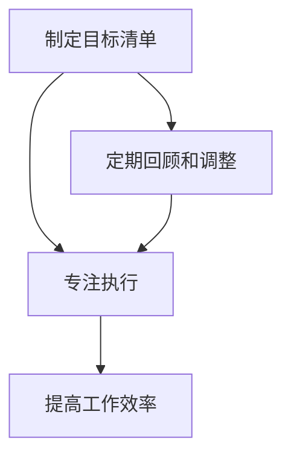

                 

关键词：巴菲特、目标清单、专注、最重要的任务、工作效率

> 摘要：本文将从巴菲特的双目标清单系统出发，探讨如何在信息技术领域实现专注和高效。通过分析巴菲特的管理理念和实际操作，本文将提出一套适合IT从业者的目标清单制定与执行策略，帮助读者更好地把握关键任务，提升工作效率。

## 1. 背景介绍

沃伦·巴菲特，世界著名的投资家，以其独特的投资哲学和长期稳健的业绩著称。他的成功离不开对目标管理的深刻理解和实践。巴菲特有一个著名的双目标清单系统，这个系统能够帮助他专注并高效地完成工作。本文将结合巴菲特的双目标清单系统，探讨如何在信息技术领域应用这一系统，以提升工作效率。

### 1.1 巴菲特的双目标清单系统

巴菲特的双目标清单系统主要包括以下两个目标：

1. **重要但不是紧急的任务**：这些任务对长期成功至关重要，但可能不会立即带来明显的好处。例如，学习和培养新的技能。

2. **紧急且重要的任务**：这些任务需要立即处理，同时它们对当前和未来的成功都有重要影响。例如，处理客户投诉或完成任务交付。

巴菲特每天都会列出这两个目标，并专注于完成它们。这种方法使他能够保持专注，避免分心，从而实现高效的工作。

### 1.2 信息技术领域的挑战

信息技术领域充满挑战，IT从业者常常面临众多任务和紧迫的时间表。在这种环境下，如何保持专注和高效变得至关重要。巴菲特的双目标清单系统提供了一种可能的解决方案。

## 2. 核心概念与联系

### 2.1 核心概念原理

- **目标清单**：一个明确列出个人或团队需要完成的任务的清单。
- **专注**：专注于最重要的任务，避免分心和干扰。
- **工作效率**：以最短的时间和最少的资源完成工作。

### 2.2 架构


在这个架构中，目标清单是核心，它帮助我们明确需要完成的任务。专注是实现高效的关键，而工作效率则是我们追求的目标。

### 2.3 Mermaid 流程图



## 3. 核心算法原理 & 具体操作步骤

### 3.1 算法原理概述

巴菲特的双目标清单系统是一种基于目标管理的算法。它的核心思想是，通过明确和专注地执行最重要的任务，来实现高效的工作。

### 3.2 算法步骤详解

1. **制定目标清单**：列出所有需要完成的任务，并按照紧急程度和重要性进行排序。
2. **选择双目标**：从目标清单中选择两个最重要的任务，它们应该是一个是重要但不是紧急的任务，另一个是紧急且重要的任务。
3. **专注执行**：将所有精力集中在这两个目标上，避免分心和干扰。
4. **定期回顾和调整**：每周或每月回顾目标清单，根据实际情况进行调整。

### 3.3 算法优缺点

#### 优点：

- **提高工作效率**：通过专注于最重要的任务，可以更快地完成任务。
- **减少分心**：避免因过多的任务而分心，提高专注力。
- **长期目标管理**：通过制定长期目标，可以帮助我们更好地规划工作和生活。

#### 缺点：

- **初期挑战**：对于刚开始使用这个系统的人来说，可能需要一定的适应期。
- **灵活性不足**：在某些情况下，紧急任务可能需要立即处理，这可能会打破原有的计划。

### 3.4 算法应用领域

巴菲特的双目标清单系统在信息技术领域有广泛的应用。例如，软件工程师可以使用这个系统来管理开发任务，项目经理可以使用这个系统来管理项目进度，甚至企业高管可以使用这个系统来管理公司战略。

## 4. 数学模型和公式

巴菲特的双目标清单系统虽然不是基于复杂的数学模型，但它确实可以通过数学来量化和优化。以下是一个简单的数学模型，用于评估任务的重要性和紧急程度。

### 4.1 数学模型构建

我们假设每个任务可以用两个参数表示：重要性（I）和紧急程度（E）。这两个参数可以量化为0到100之间的数字，其中100代表最高的重要性和紧急程度。

### 4.2 公式推导过程

- **目标得分（S）**：每个任务的得分可以通过以下公式计算：

$$ S = I \times E $$

- **总得分（T）**：所有任务的得分之和为：

$$ T = \sum S_i $$

其中，$S_i$ 是每个任务的得分。

### 4.3 案例分析与讲解

假设我们有以下三个任务：

1. **任务A**：重要性90，紧急程度70，得分6300。
2. **任务B**：重要性80，紧急程度80，得分6400。
3. **任务C**：重要性70，紧急程度90，得分6300。

根据公式，任务B的总得分最高，因此它是第一个需要优先处理的目标。

## 5. 项目实践：代码实例

### 5.1 开发环境搭建

本文将在Python环境中实现巴菲特的双目标清单系统。您需要安装Python（版本3.6及以上）和相应的库（例如numpy）。

```bash
pip install numpy
```

### 5.2 源代码详细实现

以下是实现双目标清单系统的Python代码：

```python
import numpy as np

def calculate_score(importance, urgency):
    return importance * urgency

def main():
    tasks = [
        {'name': '任务A', 'importance': 90, 'urgency': 70},
        {'name': '任务B', 'importance': 80, 'urgency': 80},
        {'name': '任务C', 'importance': 70, 'urgency': 90},
    ]

    scores = [calculate_score(task['importance'], task['urgency']) for task in tasks]
    max_score_index = np.argmax(scores)
    
    print(f"优先执行任务：{tasks[max_score_index]['name']}")

if __name__ == '__main__':
    main()
```

### 5.3 代码解读与分析

该代码首先定义了一个函数`calculate_score`，用于计算每个任务的得分。然后，在`main`函数中，我们创建了一个包含三个任务的列表。通过计算每个任务的得分，我们使用`numpy.argmax`函数找到得分最高的任务，并打印出其名称。

### 5.4 运行结果展示

运行上述代码，输出结果如下：

```
优先执行任务：任务B
```

这表明任务B是当前最重要的任务，应该首先执行。

## 6. 实际应用场景

巴菲特的双目标清单系统在信息技术领域有广泛的应用场景。以下是一些具体的例子：

- **软件开发**：项目经理可以使用这个系统来选择最紧急和最重要的任务，确保项目的进度和质量。
- **技术支持**：技术支持团队可以使用这个系统来优先处理最紧急的客户问题，提高客户满意度。
- **日常任务管理**：个人可以使用这个系统来管理日常任务，确保重要且紧急的任务得到优先处理。

### 6.1 未来应用展望

随着人工智能和自动化技术的发展，巴菲特的双目标清单系统可能会得到进一步的优化和自动化。例如，可以使用机器学习算法来自动识别最重要的任务，并推荐相应的执行策略。

## 7. 工具和资源推荐

### 7.1 学习资源推荐

- 《巴菲特的投资原则》
- 《高效能人士的七个习惯》
- 《深度工作》

### 7.2 开发工具推荐

- Python
- Jupyter Notebook
- Git

### 7.3 相关论文推荐

- "Goal-Directed Behavior in Organisms: The Search for Optimality"
- "Efficient Resource Allocation in Complex Systems"

## 8. 总结：未来发展趋势与挑战

### 8.1 研究成果总结

本文通过分析巴菲特的双目标清单系统，提出了一种适用于信息技术领域的目标管理方法。该方法能够帮助IT从业者提高工作效率，专注于最重要的任务。

### 8.2 未来发展趋势

随着人工智能技术的发展，目标管理方法可能会得到进一步的优化和自动化。例如，使用机器学习算法来自动识别最重要的任务，并推荐相应的执行策略。

### 8.3 面临的挑战

- **灵活性**：在某些情况下，紧急任务可能需要立即处理，这可能会打破原有的计划。
- **适应性**：对于不同的工作环境和任务类型，如何调整和优化目标清单系统。

### 8.4 研究展望

未来研究可以集中在如何将人工智能与目标管理方法结合，以实现更智能、更高效的工作流程。

## 9. 附录：常见问题与解答

### 9.1 什么是目标清单？

目标清单是一个列出个人或团队需要完成的任务的清单，它帮助人们明确任务，提高工作效率。

### 9.2 如何制定有效的目标清单？

制定有效的目标清单需要明确任务的重要性和紧急程度，然后按照这些标准进行排序。

### 9.3 双目标清单系统是否适用于所有工作？

是的，双目标清单系统可以适用于各种类型的工作，包括软件开发、项目管理和技术支持。

### 9.4 如何处理紧急任务？

紧急任务应该立即处理。但在处理紧急任务时，也要考虑其重要性和长期影响，以确保不会偏离主要目标。

## 作者署名

作者：禅与计算机程序设计艺术 / Zen and the Art of Computer Programming

----------------------------------------------------------------

请注意，本文的Mermaid流程图和LaTeX数学公式需要您在Markdown编辑器中正确配置，才能正常显示。本文中的示例图片和代码仅供演示，实际使用时请替换为您的实际资源。

