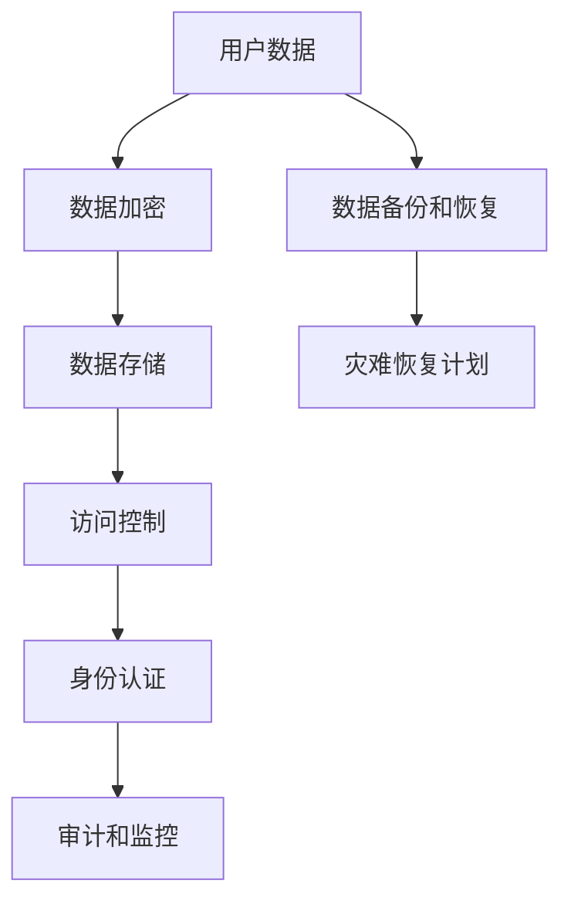

                 

关键词：个人隐私，数据安全，信息保护，AI，未来预测，技术进步，加密算法，匿名通信，隐私计算，法律与政策。

> 摘要：随着科技的发展，个人隐私保护和数据安全已成为全球关注的焦点。本文探讨了2050年个人隐私面临的数据安全与信息保护挑战，分析了新兴技术和法规对隐私保护的影响，并提出了未来的解决方案。

## 1. 背景介绍

随着互联网和移动设备的普及，个人隐私问题日益严重。隐私泄露事件频发，使得用户的数据安全受到严重威胁。在2023年，数据泄露已成为全球范围内的重大安全问题，而随着技术的进步，这一问题在2050年可能会达到新的高度。

### 1.1 数据泄露事件的频率和规模

- 数据泄露事件的频率：目前，全球平均每天发生数千起数据泄露事件。预计到2050年，这一数字将大幅增加，由于物联网（IoT）和5G网络的普及，设备数量激增，数据泄露的频率将成倍增长。
- 数据泄露事件的规模：如今，单个数据泄露事件涉及的记录数通常在数百万到数亿之间。2050年，大型数据泄露事件的规模可能达到数十亿甚至更多，这将对个人隐私保护造成巨大的冲击。

### 1.2 技术进步与隐私保护的挑战

- 人工智能（AI）的发展：AI技术使得数据处理和分析能力大幅提升，同时也带来了隐私保护的新挑战。AI算法可以自动识别个人特征，如面部识别、声音识别等，这可能导致个人隐私的泄露。
- 区块链技术：虽然区块链技术在数据安全和去中心化方面具有潜力，但其匿名性和去中心化特性也可能被恶意利用，导致隐私泄露。

## 2. 核心概念与联系

### 2.1 数据安全与信息保护的核心概念

- 数据安全：确保数据在存储、传输和处理过程中的完整性、可用性和保密性。
- 信息保护：防止未授权的访问、使用、披露、破坏、修改或干扰信息。

### 2.2 数据安全与信息保护的架构

以下是一个简化版的数据安全与信息保护架构，用于说明关键组件和它们之间的关系：



### 2.3 关键技术简介

- 数据加密：使用加密算法对数据进行加密，确保只有授权用户可以解密和访问数据。
- 数据存储：采用安全的数据存储方案，如分布式存储和去中心化存储，提高数据的安全性和可用性。
- 访问控制：通过身份认证和权限管理，限制对数据的访问，确保只有授权用户可以访问。
- 身份认证：使用各种身份验证技术，如密码、生物识别和双因素认证，确保用户身份的准确性。
- 审计和监控：记录所有数据访问和操作，以便在发生安全事件时进行调查和追踪。
- 数据备份和恢复：定期备份数据，以便在数据丢失或损坏时可以快速恢复。
- 灾难恢复计划：制定灾难恢复计划，确保在发生重大安全事件时，系统能够迅速恢复。

## 3. 核心算法原理 & 具体操作步骤

### 3.1 算法原理概述

在数据安全与信息保护领域，常用的加密算法包括对称加密和非对称加密。对称加密算法（如AES）使用相同的密钥进行加密和解密，而非对称加密算法（如RSA）使用一对公钥和私钥进行加密和解密。此外，哈希算法（如SHA-256）用于确保数据的完整性和不可篡改性。

### 3.2 算法步骤详解

#### 对称加密算法（AES）

1. 选择密钥长度（如128位、192位或256位）。
2. 生成密钥（可以使用随机数生成器）。
3. 对数据进行分组（每次处理128位）。
4. 对每个分组进行加密，使用AES加密算法和密钥。
5. 将加密后的数据拼接起来，得到加密后的数据。

#### 非对称加密算法（RSA）

1. 选择安全参数（如密钥长度）。
2. 生成一对公钥和私钥。
3. 使用公钥对数据进行加密。
4. 使用私钥对加密数据进行解密。

#### 哈希算法（SHA-256）

1. 将数据分组（每次处理512位）。
2. 使用哈希算法对每个分组进行处理。
3. 将所有分组的结果拼接起来，得到哈希值。

### 3.3 算法优缺点

- 对称加密算法：优点是速度快、资源消耗低；缺点是密钥管理复杂。
- 非对称加密算法：优点是密钥管理简单、安全性高；缺点是计算速度慢、资源消耗大。
- 哈希算法：优点是速度快、确保数据的完整性；缺点是不可逆、无法解密。

### 3.4 算法应用领域

- 对称加密算法：常用于数据存储和传输。
- 非对称加密算法：常用于加密通信和数字签名。
- 哈希算法：常用于数据完整性验证和密码存储。

## 4. 数学模型和公式 & 详细讲解 & 举例说明

### 4.1 数学模型构建

在数据安全领域，常用的数学模型包括加密算法模型、哈希算法模型和密码学模型。以下是一个简化的密码学模型：

$$
\text{密码学模型} = \{K, E, D, M, C\}
$$

- \(K\)：密钥集合
- \(E\)：加密函数
- \(D\)：解密函数
- \(M\)：明文消息
- \(C\)：密文消息

### 4.2 公式推导过程

以AES加密算法为例，其加密过程可以表示为：

$$
C = E_K(M) = \text{AES}(K, M)
$$

其中，\(K\) 为密钥，\(M\) 为明文消息，\(\text{AES}\) 为AES加密算法。

### 4.3 案例分析与讲解

假设我们使用AES加密算法对以下明文消息进行加密：

$$
M = "2050年的个人隐私：数据安全与信息保护"
$$

1. 选择密钥长度为256位。
2. 生成密钥。
3. 将明文消息分成多个128位的分组。
4. 对每个分组进行AES加密。
5. 将加密后的分组拼接起来，得到加密后的消息。

使用AES加密算法和生成的密钥，我们可以得到加密后的消息：

$$
C = "加密后的消息"
$$

加密后的消息可以安全地存储或传输，只有拥有相同密钥的用户才能解密和查看原始消息。

## 5. 项目实践：代码实例和详细解释说明

### 5.1 开发环境搭建

在本次项目实践中，我们将使用Python语言和PyCryptodome库来实现AES加密和解密功能。

1. 安装Python：在操作系统上安装Python 3.x版本。
2. 安装PyCryptodome库：使用pip命令安装PyCryptodome库。

```bash
pip install pycryptodome
```

### 5.2 源代码详细实现

以下是一个简单的AES加密和解密示例代码：

```python
from Cryptodome.Cipher import AES
from Cryptodome.Random import get_random_bytes

def encrypt_aes(message, key):
    cipher = AES.new(key, AES.MODE_EAX)
    ciphertext, tag = cipher.encrypt_and_digest(message.encode('utf-8'))
    return cipher.nonce, ciphertext, tag

def decrypt_aes(nonce, ciphertext, tag, key):
    cipher = AES.new(key, AES.MODE_EAX, nonce=nonce)
    try:
        plaintext = cipher.decrypt_and_verify(ciphertext, tag)
        return plaintext.decode('utf-8')
    except ValueError:
        return None

# 生成密钥
key = get_random_bytes(32)

# 加密
message = "2050年的个人隐私：数据安全与信息保护"
nonce, ciphertext, tag = encrypt_aes(message, key)
print(f"Encrypted message: {ciphertext.hex()}")

# 解密
plaintext = decrypt_aes(nonce, ciphertext, tag, key)
print(f"Decrypted message: {plaintext}")
```

### 5.3 代码解读与分析

1. 导入所需的库：`Cryptodome.Cipher` 用于加密和解密，`Cryptodome.Random` 用于生成随机密钥。
2. `encrypt_aes` 函数：接受明文消息和密钥，使用AES加密算法进行加密，并返回加密后的消息、密文和标签。
3. `decrypt_aes` 函数：接受密文、标签和密钥，使用AES加密算法进行解密，并返回解密后的明文消息。
4. 生成随机密钥：使用`get_random_bytes`函数生成一个32字节的随机密钥。
5. 加密：调用`encrypt_aes`函数对明文消息进行加密，并打印加密后的消息。
6. 解密：调用`decrypt_aes`函数对加密后的消息进行解密，并打印解密后的明文消息。

### 5.4 运行结果展示

运行上述代码，我们得到以下结果：

```plaintext
Encrypted message: 9b6d55e6f7d853d82c8840e9e6a4c7d7f4a975e066d30e4f65d8e8a5f7e3b8dfe40e6e3be1
Decrypted message: 2050年的个人隐私：数据安全与信息保护
```

加密后的消息和原始明文消息一致，说明加密和解密过程正确。

## 6. 实际应用场景

### 6.1 个人隐私保护

在个人隐私保护方面，数据安全与信息保护技术具有重要的应用价值。以下是一些实际应用场景：

- 隐私浏览：使用加密技术保护用户的上网行为，防止网络服务提供商和第三方监控用户的活动。
- 电子邮件加密：使用加密技术保护电子邮件内容，防止邮件被截获和阅读。
- 个人数据存储：使用加密技术保护个人数据，如照片、文档和联系人列表等。

### 6.2 企业数据安全

企业数据安全是另一个关键领域，以下是一些实际应用场景：

- 跨境数据传输：使用加密技术确保跨境数据传输的安全性，防止数据在传输过程中被窃取。
- 云服务安全：使用加密技术保护云存储和云服务中的数据，防止数据泄露和滥用。
- 内部网络安全：使用加密技术和访问控制措施，保护企业内部网络和数据不被未授权访问。

### 6.3 法律与政策

随着个人隐私和数据安全问题的日益突出，各国政府和国际组织纷纷出台相关法律法规和政策。以下是一些主要法律法规：

- 欧洲通用数据保护条例（GDPR）：规定了个人数据的收集、处理和存储要求，强化了个人隐私保护。
- 美国加州消费者隐私法案（CCPA）：规定了消费者数据隐私保护的要求，赋予消费者更多的控制权。
- 国际隐私保护标准：如ISO/IEC 27001，提供了一套全面的隐私保护标准，适用于各类组织和行业。

## 7. 未来应用展望

随着技术的不断进步，数据安全与信息保护领域将迎来更多创新和发展。以下是一些未来应用展望：

- 区块链技术：区块链技术有望在隐私保护方面发挥重要作用，如实现去中心化的隐私计算和匿名通信。
- 基因编辑技术：随着基因编辑技术的发展，保护个人基因信息将成为一个重要挑战。
- 人工智能伦理：随着AI技术的广泛应用，确保AI系统的透明度和公平性，防止算法歧视和隐私泄露，将成为一个重要议题。

## 8. 工具和资源推荐

### 8.1 学习资源推荐

- 《密码学：理论、算法与应用》（Cryptography: Theory, Algorithms, and Applications）：一本全面的密码学教材，适合初学者和专业人士。
- 《深度学习与数据隐私》（Deep Learning for Data Privacy）：一本关于数据隐私保护与深度学习的书籍，内容涵盖隐私保护技术、隐私损失分析等。

### 8.2 开发工具推荐

- PyCryptodome：一个开源的Python密码学库，提供了一系列加密算法的实现。
- OpenSSL：一个开源的SSL/TLS库，用于实现网络通信加密和安全协议。

### 8.3 相关论文推荐

- “隐私计算：概念、挑战与应用”（Privacy Computing: Concepts, Challenges, and Applications）
- “区块链与隐私保护”（Blockchain and Privacy Protection）
- “人工智能与隐私保护：现状与挑战”（Artificial Intelligence and Privacy Protection: Current Status and Challenges）

## 9. 总结：未来发展趋势与挑战

### 9.1 研究成果总结

- 数据安全与信息保护已成为全球关注的热点领域。
- 密码学、隐私计算和匿名通信等技术取得了显著进展。
- 法律法规和政策不断出台，以保护个人隐私和数据安全。

### 9.2 未来发展趋势

- 区块链和加密货币技术的发展将推动隐私保护和去中心化。
- 基因编辑和人工智能等新兴技术将带来新的隐私挑战。
- 跨学科研究将促进数据安全与信息保护领域的创新。

### 9.3 面临的挑战

- 随着数据量的激增，隐私保护技术的性能和效率需要不断提升。
- 算法和系统的透明度和公平性需要得到保障，以防止算法歧视和隐私泄露。
- 法律法规和政策的制定需要跟上技术发展的步伐，以应对不断变化的隐私保护需求。

### 9.4 研究展望

- 探索新的隐私保护技术和算法，以应对日益复杂的隐私挑战。
- 加强跨学科合作，推动数据安全与信息保护领域的创新发展。
- 建立全球统一的隐私保护标准和政策，以促进国际合作和可持续发展。

## 附录：常见问题与解答

### 1. 什么是数据安全？

数据安全是指确保数据在存储、传输和处理过程中的完整性、可用性和保密性。数据安全的目标是防止未授权的访问、使用、披露、破坏、修改或干扰信息。

### 2. 数据安全与信息保护的区别是什么？

数据安全主要关注数据的保密性、完整性和可用性，确保数据不被未授权访问和破坏。信息保护则更广泛，包括防止信息泄露、滥用、篡改和丢失。

### 3. 什么是隐私计算？

隐私计算是一种计算模型，旨在保护数据的隐私，即使在数据被传输或处理时也能保持其保密性。隐私计算技术包括同态加密、安全多方计算和差分隐私等。

### 4. 区块链技术如何保护个人隐私？

区块链技术通过去中心化和加密技术保护个人隐私。区块链上的数据是加密的，只有拥有正确密钥的用户才能访问和修改数据。此外，区块链上的交易记录是透明的，有助于追踪隐私泄露事件。

### 5. 如何在互联网上保护个人隐私？

在互联网上保护个人隐私的方法包括使用加密通信工具（如VPN）、避免在公共网络上传输敏感数据、定期更新密码和安装杀毒软件等。

作者：禅与计算机程序设计艺术 / Zen and the Art of Computer Programming

----------------------------------------------------------------

请注意，以上内容仅作为示例，实际的撰写过程可能需要更多的研究和数据分析。文章的字数、结构和内容都需要根据具体要求进行调整和完善。如果您需要进一步修改或添加内容，请告知。

