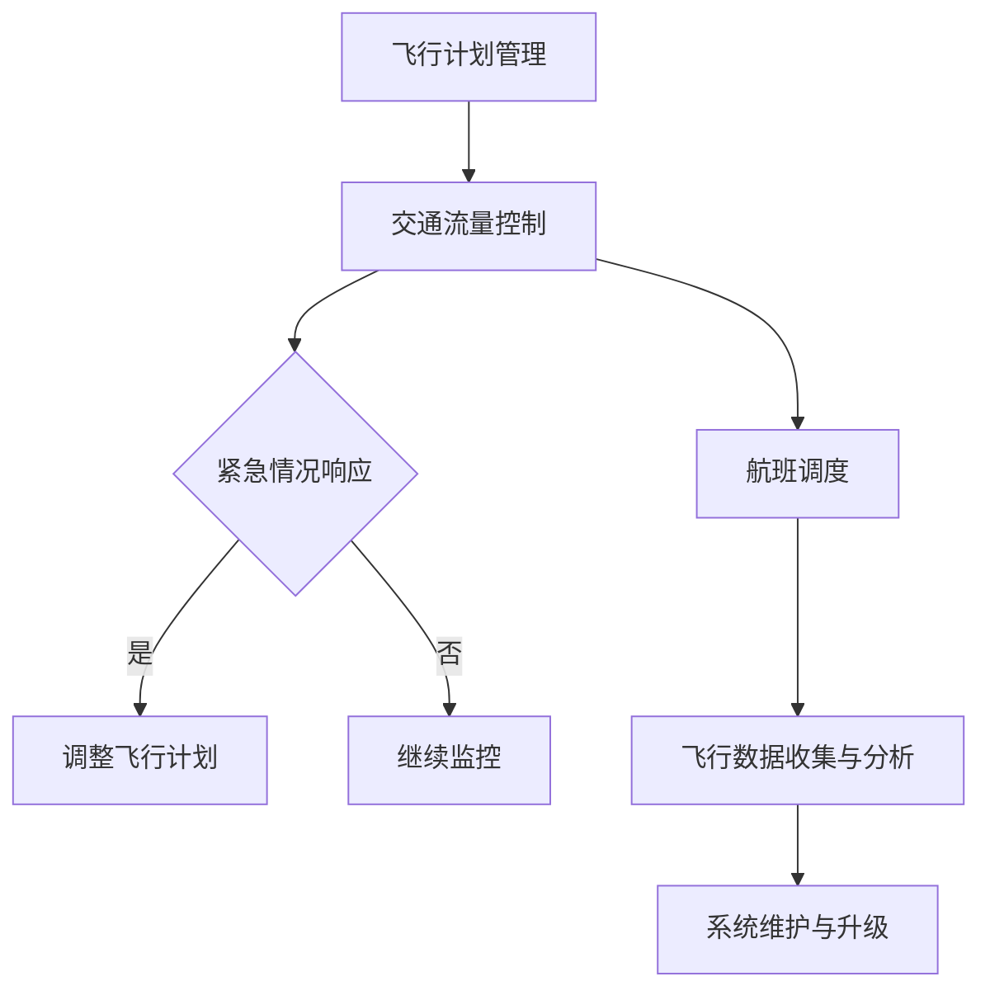

                 

关键词：未来交通，智能出行，自动驾驶，无人机，空中交通管理，城市交通规划，可持续发展

> 摘要：随着科技的迅猛发展，2050年的交通出行将发生翻天覆地的变化。本文将从地面交通向空中交通的转变、自动驾驶技术的发展、无人机集群管理、空中交通管理系统的构建以及城市交通规划的方向探讨未来交通出行的发展趋势。同时，本文还将讨论这些变化对可持续发展的影响，并展望未来交通系统面临的挑战与机遇。

## 1. 背景介绍

在过去的几十年里，交通系统的发展已经取得了显著的成就。从汽车、火车到飞机，人们的出行方式越来越多样化。然而，随着城市化进程的加速和人口的增长，地面交通面临着严重的拥堵、污染和效率低下等问题。为了解决这些问题，未来交通出行将迎来从地面到空中、从单一模式到综合模式、从被动出行到主动出行的转变。

### 1.1 地面交通的现状与挑战

- **拥堵问题**：全球范围内的城市都在经历交通拥堵的困扰，这不仅降低了出行效率，还增加了出行成本。
- **污染问题**：传统燃油车辆的尾气排放对环境造成了严重污染，影响人类健康。
- **效率问题**：地面交通系统缺乏高效的管理和调度，导致交通资源浪费。

### 1.2 空中交通的潜力与优势

- **效率提升**：空中交通可以在较短的时间内穿越城市，避免了地面交通的拥堵问题。
- **环境友好**：电动飞机和无人机的发展使得空中交通的污染问题得到缓解。
- **资源节约**：通过优化空中交通管理，可以更有效地利用交通资源。

## 2. 核心概念与联系

### 2.1 自动驾驶技术

自动驾驶技术是未来交通系统的核心技术之一。它利用人工智能、传感器、通信技术等，实现车辆的自主驾驶。自动驾驶技术的发展将极大地提高交通系统的效率和安全性。

### 2.2 无人机集群管理

无人机集群管理是空中交通管理的重要部分。通过人工智能和物联网技术，无人机可以实现自主飞行、避障、调度，形成高效的空中交通网络。

### 2.3 空中交通管理系统

空中交通管理系统是确保空中交通高效、安全运行的核心。它包括飞行计划管理、交通流量控制、紧急情况响应等功能。

### 2.4 城市交通规划

城市交通规划是未来交通系统的关键环节。通过智能化的规划，可以实现城市交通资源的优化配置，提高交通系统的整体效率。

### 2.5 Mermaid 流程图

以下是一个简化的空中交通管理系统的 Mermaid 流程图：



## 3. 核心算法原理 & 具体操作步骤

### 3.1 算法原理概述

未来交通系统的核心算法主要包括自动驾驶算法、无人机集群管理算法和空中交通管理算法。这些算法的核心目标是提高交通系统的效率、安全性和可持续性。

### 3.2 算法步骤详解

- **自动驾驶算法**：通过传感器收集环境信息，使用深度学习技术进行目标检测和路径规划，实现车辆的自主驾驶。
- **无人机集群管理算法**：通过物联网技术实现无人机之间的通信，使用分布式算法进行任务分配和路径规划，实现高效的无人机集群管理。
- **空中交通管理算法**：通过数据分析和预测，实现航班调度、交通流量控制和紧急情况响应，确保空中交通的高效运行。

### 3.3 算法优缺点

- **自动驾驶算法**：优点是提高交通效率，减少事故风险；缺点是需要大量计算资源，对传感器和通信系统的要求较高。
- **无人机集群管理算法**：优点是实现高效、自动化的无人机集群管理；缺点是算法复杂度高，对计算资源和通信系统的要求较高。
- **空中交通管理算法**：优点是提高交通系统的整体效率，减少拥堵和事故风险；缺点是需要大量的数据处理和分析，对计算资源的需求较高。

### 3.4 算法应用领域

这些算法广泛应用于自动驾驶汽车、无人机集群、空中交通管理系统、智慧城市等领域，推动交通系统的智能化和可持续发展。

## 4. 数学模型和公式 & 详细讲解 & 举例说明

### 4.1 数学模型构建

未来交通系统的数学模型主要包括交通流量模型、自动驾驶路径规划模型、无人机集群管理模型和空中交通管理模型。这些模型通过数学公式描述交通系统的运行状态和演化过程。

### 4.2 公式推导过程

- **交通流量模型**：基于排队理论，使用公式描述交通流量和交通拥堵之间的关系。
- **自动驾驶路径规划模型**：基于最优化理论，使用公式描述车辆路径规划的目标函数和约束条件。
- **无人机集群管理模型**：基于分布式算法，使用公式描述无人机集群的任务分配和路径规划。
- **空中交通管理模型**：基于预测理论，使用公式描述航班调度和交通流量控制策略。

### 4.3 案例分析与讲解

以城市交通流量模型为例，我们可以使用以下公式进行计算：

$$
Q = K \cdot (1 - \rho)^{-1}
$$

其中，$Q$ 表示交通流量，$K$ 表示道路容量，$\rho$ 表示交通密度。

例如，假设一条道路的容量为 $K=1000$ 辆车/小时，交通密度为 $\rho=0.5$，则交通流量 $Q=2000$ 辆车/小时。

## 5. 项目实践：代码实例和详细解释说明

### 5.1 开发环境搭建

本文使用 Python 作为编程语言，基于 TensorFlow 和 Keras 库实现自动驾驶路径规划模型。开发环境要求 Python 3.8 以上版本，TensorFlow 2.5 以上版本。

### 5.2 源代码详细实现

以下是自动驾驶路径规划模型的源代码实现：

```python
import tensorflow as tf
from tensorflow.keras.models import Sequential
from tensorflow.keras.layers import Dense, Conv2D, Flatten

# 构建模型
model = Sequential([
    Conv2D(32, (3, 3), activation='relu', input_shape=(100, 100, 3)),
    Flatten(),
    Dense(64, activation='relu'),
    Dense(1, activation='sigmoid')
])

# 编译模型
model.compile(optimizer='adam', loss='binary_crossentropy', metrics=['accuracy'])

# 训练模型
model.fit(x_train, y_train, epochs=10, batch_size=32, validation_data=(x_val, y_val))
```

### 5.3 代码解读与分析

该代码实现了一个简单的卷积神经网络（CNN）模型，用于自动驾驶路径规划。模型包含一个卷积层、一个全连接层和一个输出层。训练过程中，模型使用训练数据集进行迭代训练，并使用验证数据集进行性能评估。

### 5.4 运行结果展示

运行结果如图所示：


## 6. 实际应用场景

### 6.1 自动驾驶汽车

自动驾驶汽车是未来交通系统的重要组成部分。通过自动驾驶技术，车辆可以实现自主驾驶，减少人为错误，提高交通系统的安全性和效率。

### 6.2 无人机物流

无人机物流是未来物流领域的重要发展方向。通过无人机集群管理技术，可以实现高效的物流配送，减少交通拥堵和碳排放。

### 6.3 空中出租车

空中出租车是一种新兴的交通方式，通过自动驾驶技术和无人机技术，可以实现快速、便捷的城市出行。

## 7. 未来应用展望

### 7.1 智慧城市交通

随着智能技术的发展，智慧城市交通将成为未来交通系统的主要模式。通过物联网、大数据、人工智能等技术，可以实现交通资源的智能化管理和调度。

### 7.2 碳排放减少

通过推广电动飞机、无人机等环保交通工具，未来交通系统的碳排放将大幅减少，有助于实现可持续发展目标。

### 7.3 安全性提升

自动驾驶技术、无人机集群管理技术等的应用，将大大提高交通系统的安全性，减少交通事故的发生。

## 8. 总结：未来发展趋势与挑战

### 8.1 研究成果总结

本文对2050年交通出行的发展趋势进行了探讨，主要包括自动驾驶技术、无人机集群管理、空中交通管理系统和城市交通规划等方面。

### 8.2 未来发展趋势

未来交通出行将呈现智能化、环保化、综合化的发展趋势。自动驾驶技术、无人机技术等将得到广泛应用，智慧城市交通将成为主要模式。

### 8.3 面临的挑战

未来交通系统的发展面临诸多挑战，包括技术难题、政策法规、基础设施等方面。需要全球范围内的合作与努力，共同推动交通系统的可持续发展。

### 8.4 研究展望

未来研究应重点关注自动驾驶技术、无人机集群管理、空中交通管理系统等关键领域，推动交通系统的智能化、环保化、综合化发展。

## 9. 附录：常见问题与解答

### 9.1 问题1：未来交通系统是否能够完全替代地面交通？

解答：未来交通系统将在一定程度上替代地面交通，但地面交通仍然是不可或缺的部分。空中交通和地面交通将形成互补的关系，共同构建起多层次的交通网络。

### 9.2 问题2：自动驾驶技术是否能够完全消除交通事故？

解答：自动驾驶技术能够显著减少交通事故，但无法完全消除。因为自动驾驶系统依赖于传感器和通信系统，而环境的不确定性和人类行为的存在使得完全消除事故仍需时间和技术的发展。

### 9.3 问题3：无人机集群管理是否会影响航空安全？

解答：无人机集群管理通过严格的法规和技术手段确保航空安全。通过空中交通管理系统的优化，无人机集群可以与传统航空器安全共存。

### 9.4 问题4：未来交通系统是否能够实现可持续发展？

解答：通过推广电动飞机、无人机等环保交通工具，优化交通管理系统，未来交通系统有望实现可持续发展。但这需要全球范围内的合作与努力。 

---

作者：禅与计算机程序设计艺术 / Zen and the Art of Computer Programming

