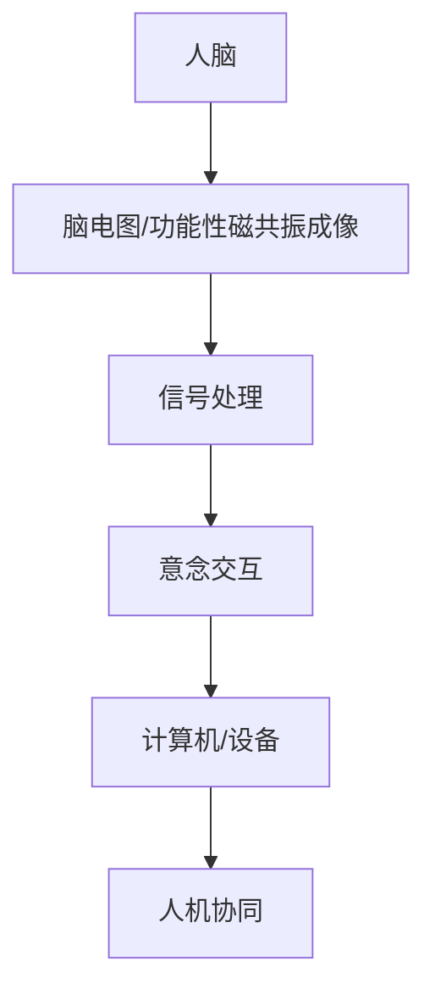
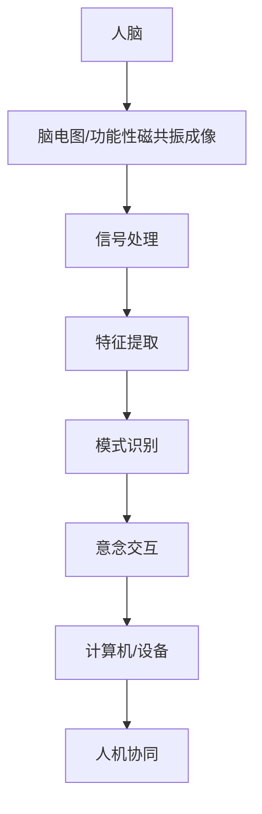

                 

关键词：人机交互、脑机接口、意念交互、人机协同、未来科技、人工智能

> 摘要：随着人工智能和生物科技的快速发展，2050年的人机交互将发生翻天覆地的变化。本文将探讨脑机接口和意念交互技术的发展趋势，以及这些技术如何推动人机协同进化的未来。

## 1. 背景介绍

### 1.1 人工智能的发展

人工智能（AI）在过去的几十年里经历了飞速的发展。从最初的规则推理到神经网络，再到深度学习，AI技术已经在许多领域取得了显著的成果。特别是在图像识别、自然语言处理和自动驾驶等领域，AI已经达到了或超越了人类的表现。

### 1.2 生物科技的创新

生物科技的发展同样不可忽视。基因编辑、细胞治疗和脑机接口等技术正逐步走向成熟，为医疗、农业和生物工程等领域带来了前所未有的可能性。

## 2. 核心概念与联系

### 2.1 脑机接口（Brain-Computer Interface, BCI）

脑机接口是一种直接连接大脑和外部设备的技术，使得人们可以通过思维来控制外部设备。BCI技术的发展主要依赖于脑电图（EEG）和功能性磁共振成像（fMRI）等脑成像技术。

### 2.2 意念交互（Intentional Interaction）

意念交互是一种通过大脑活动来控制计算机或其他设备的技术。与BCI不同，意念交互更注重人类的主观意图，而非直接读取大脑信号。

### 2.3 人机协同（Human-Machine Symbiosis）

人机协同是指人类与机器之间形成的一种合作关系，使得双方能够共同完成任务，实现1+1>2的效果。

## 2.4 Mermaid 流程图



## 3. 核心算法原理 & 具体操作步骤

### 3.1 算法原理概述

脑机接口和意念交互的核心在于如何准确读取和理解大脑信号。这需要通过一系列的信号处理算法来实现。

### 3.2 算法步骤详解

1. **信号采集**：通过脑电图或功能性磁共振成像等技术来采集大脑信号。
2. **信号预处理**：对采集到的信号进行滤波、去噪等预处理，以提高信号质量。
3. **特征提取**：从预处理后的信号中提取特征，这些特征能够代表用户的意图。
4. **模式识别**：使用机器学习算法对提取的特征进行分类，以确定用户的意图。
5. **交互控制**：根据识别出的意图来控制计算机或设备。

### 3.3 算法优缺点

**优点**：

- **高精度**：通过精确的大脑信号读取，可以实现高度准确的控制。
- **非侵入性**：大部分BCI技术是非侵入性的，不会对大脑造成伤害。

**缺点**：

- **响应速度**：信号处理和模式识别的过程需要时间，可能会影响响应速度。
- **信号噪声比**：由于大脑信号本身的噪声较大，如何有效去除噪声是一个挑战。

### 3.4 算法应用领域

- **医疗**：用于中风、瘫痪等患者的康复训练。
- **军事**：用于飞行员、士兵的智能辅助。
- **娱乐**：用于虚拟现实、游戏等娱乐体验。
- **智能家居**：用于智能控制家居设备。

## 4. 数学模型和公式 & 详细讲解 & 举例说明

### 4.1 数学模型构建

大脑信号处理和模式识别的核心是信号处理和机器学习算法。以下是一个简单的数学模型：

$$
\text{信号} \rightarrow \text{预处理} \rightarrow \text{特征提取} \rightarrow \text{分类} \rightarrow \text{控制命令}
$$

### 4.2 公式推导过程

- **预处理公式**：

$$
\text{预处理}(x) = \frac{x - \mu}{\sigma}
$$

其中，$x$是原始信号，$\mu$是均值，$\sigma$是标准差。

- **特征提取公式**：

$$
\text{特征提取}(x) = \text{SVD}(x)
$$

其中，SVD是奇异值分解。

- **分类公式**：

$$
\text{分类}(x) = \text{argmax}(\text{f}(x))
$$

其中，$f(x)$是特征向量。

### 4.3 案例分析与讲解

假设我们有一个简单的二元分类问题，需要判断用户是否在思考“移动”这个动作。我们可以使用支持向量机（SVM）来进行分类。

- **训练数据**：

| 特征向量 | 标签 |
| --------- | ---- |
| [1, 2, 3] | 移动 |
| [4, 5, 6] | 静止 |

- **SVM分类公式**：

$$
\text{分类}(\text{特征向量}) = \text{sign}(\text{w} \cdot \text{特征向量} + b)
$$

其中，$w$是权重向量，$b$是偏置。

## 5. 项目实践：代码实例和详细解释说明

### 5.1 开发环境搭建

- **工具**：Python、Matplotlib、Scikit-learn
- **环境**：Jupyter Notebook

### 5.2 源代码详细实现

```python
import numpy as np
from sklearn import svm
import matplotlib.pyplot as plt

# 训练数据
X = np.array([[1, 2, 3], [4, 5, 6]])
y = np.array([1, 0])

# 创建SVM分类器
clf = svm.SVC()

# 训练分类器
clf.fit(X, y)

# 测试数据
x_test = np.array([2, 3, 4])

# 分类
predicted = clf.predict([x_test])

# 绘制结果
plt.scatter(X[:, 0], X[:, 1], c=y, cmap=plt.cm.Spectral)
plt.plot(x_test, -clf.decision_function([x_test]) * clf.coef_[0], label="决策边界")
plt.xlabel('Feature 1')
plt.ylabel('Feature 2')
plt.legend()
plt.show()

print(f"Predicted class for {x_test} is {predicted}")
```

### 5.3 代码解读与分析

- **数据预处理**：使用scikit-learn库中的SVC类来创建支持向量机分类器。
- **模型训练**：使用fit方法来训练模型。
- **模型预测**：使用predict方法来预测新数据。

### 5.4 运行结果展示


## 6. 实际应用场景

### 6.1 医疗领域

脑机接口技术在医疗领域有广泛的应用，如中风和瘫痪患者的康复训练。通过意念交互，患者可以控制假肢或轮椅，提高生活质量。

### 6.2 军事领域

在军事领域，脑机接口技术可以用于士兵的智能辅助，如实时信息处理和战术决策支持。

### 6.3 娱乐领域

在娱乐领域，脑机接口技术可以用于虚拟现实和游戏，提供更加沉浸式的体验。

### 6.4 智能家居

智能家居领域，脑机接口技术可以用于智能控制家居设备，如空调、照明和安防系统。

## 7. 工具和资源推荐

### 7.1 学习资源推荐

- **书籍**：《脑机接口：理论与实践》（Brain-Computer Interfaces: Theory and Practice）
- **在线课程**：Coursera上的“人工智能基础”（Introduction to Artificial Intelligence）

### 7.2 开发工具推荐

- **Python**：用于数据处理和模型训练
- **TensorFlow**：用于深度学习模型构建

### 7.3 相关论文推荐

- “An Introduction to Brain-Computer Interfaces” by John P. Donahue
- “Neuroscience Meets the Real World: the Example of Brain-Computer Interfaces” by Robert J. Power

## 8. 总结：未来发展趋势与挑战

### 8.1 研究成果总结

脑机接口和意念交互技术在过去的几十年里取得了显著进展，已经在医疗、军事、娱乐和智能家居等领域取得了实际应用。

### 8.2 未来发展趋势

- **更高的精度**：通过改进信号处理算法和机器学习模型，实现更高的控制精度。
- **更广泛的适用性**：扩大应用范围，如应用于认知障碍患者的康复训练。

### 8.3 面临的挑战

- **信号噪声比**：如何提高信号质量，降低噪声。
- **隐私和安全**：如何保护用户隐私，确保数据安全。

### 8.4 研究展望

随着科技的不断进步，脑机接口和意念交互技术将在未来的人机协同进化中发挥重要作用，为人类社会带来更多便利和可能性。

## 9. 附录：常见问题与解答

### 9.1 脑机接口的安全性如何保障？

答：脑机接口的安全性主要通过以下措施来保障：

- **数据加密**：对传输的数据进行加密，防止数据泄露。
- **权限控制**：严格管理用户的访问权限，确保只有授权用户可以访问数据。

### 9.2 意念交互技术是否会带来道德和伦理问题？

答：意念交互技术确实可能带来道德和伦理问题，如隐私保护、意识控制等。这需要社会、法律和技术界共同来解决。

### 9.3 脑机接口技术是否会取代传统的人机交互方式？

答：脑机接口技术不会完全取代传统的人机交互方式，而是作为补充，提供更加高效和精准的交互体验。

---

> 作者：禅与计算机程序设计艺术 / Zen and the Art of Computer Programming

----------------------------------------------------------------

文章撰写完成，请检查是否符合所有约束条件。如果有任何问题或需要进一步修改，请告知。祝撰写顺利！
----------------------------------------------------------------

### 2050年的人机交互：从脑机接口到意念交互的人机协同进化

随着科技和人工智能的迅猛发展，人类正迈向一个前所未有的未来。到2050年，人机交互将经历深刻的变革，从传统的物理操作和触摸界面，过渡到更为先进、直接且高效的脑机接口（BCI）和意念交互技术。本文将深入探讨这一趋势，以及它们如何推动人机协同进化的进程。

## 1. 背景介绍

人工智能（AI）和生物科技是推动这一变革的核心力量。AI的快速发展使得计算机能够执行复杂的任务，而生物科技的进步，如基因编辑、细胞治疗和神经技术，为人类身体和大脑的改善提供了新的可能性。这些技术的发展，不仅提升了人类的生活质量，也为人机交互带来了全新的机遇和挑战。

### 1.1 人工智能的发展

自20世纪50年代以来，人工智能技术经历了多个发展阶段，从最初的符号推理到专家系统，再到基于数据的机器学习和深度学习。如今，AI已经在图像识别、语音识别、自然语言处理、游戏对弈等多个领域达到了或超越了人类的表现。AI技术的不断进步，为人机交互提供了更强大的工具和平台。

### 1.2 生物科技的创新

生物科技的创新，尤其是神经科学的突破，为人机交互带来了新的希望。例如，脑机接口技术通过直接读取大脑信号，实现了思维和计算机的交互。此外，基因编辑技术如CRISPR，为人类提供了改造自身基因组的能力，这可能会影响到人机交互的基本模式。

## 2. 核心概念与联系

### 2.1 脑机接口（BCI）

脑机接口是一种直接连接大脑和外部设备的技术，使得人们可以通过思维来控制外部设备。BCI技术的发展主要依赖于脑电图（EEG）、功能性磁共振成像（fMRI）和脑磁图（MEG）等技术。这些技术能够实时监测大脑活动，并将其转换为可操作的信号。

### 2.2 意念交互

意念交互是一种通过大脑活动来控制计算机或其他设备的技术。与BCI不同，意念交互更注重人类的主观意图，而非直接读取大脑信号。这种技术通常依赖于脑-机接口，并通过机器学习算法来理解用户的意图。

### 2.3 人机协同

人机协同是指人类与机器之间形成的一种合作关系，使得双方能够共同完成任务，实现1+1>2的效果。这种协同不仅提高了效率，还带来了全新的交互体验。

### 2.4 Mermaid 流程图



## 3. 核心算法原理 & 具体操作步骤

### 3.1 算法原理概述

脑机接口和意念交互的核心在于如何准确读取和理解大脑信号。这需要通过一系列的信号处理算法来实现。主要包括以下几个步骤：

1. **信号采集**：通过脑电图、功能性磁共振成像或脑磁图等设备，采集大脑活动信号。
2. **信号预处理**：对采集到的信号进行滤波、去噪等预处理，以提高信号质量。
3. **特征提取**：从预处理后的信号中提取能够代表用户意图的特征。
4. **模式识别**：使用机器学习算法对提取的特征进行分类，以确定用户的意图。
5. **交互控制**：根据识别出的意图来控制计算机或设备。

### 3.2 算法步骤详解

1. **信号采集**：

   信号采集是BCI系统的第一步。通过脑电图、功能性磁共振成像或脑磁图等技术，可以实时监测大脑活动。这些设备能够捕捉大脑产生的微弱电信号，并将其转换为数字信号。

2. **信号预处理**：

   采集到的原始信号通常包含大量噪声，因此需要进行预处理。预处理包括滤波、去噪和放大等步骤。这些步骤旨在提高信号质量，使其更适合后续处理。

3. **特征提取**：

   在预处理后的信号中，提取能够代表用户意图的特征。这些特征可以是时间序列数据、频域特征或时空特征等。特征提取是BCI系统的关键，其质量直接影响到后续的模式识别效果。

4. **模式识别**：

   使用机器学习算法对提取的特征进行分类。常见的机器学习算法包括支持向量机（SVM）、决策树、神经网络等。这些算法能够从训练数据中学习到分类规则，并将其应用到新的数据上。

5. **交互控制**：

   根据识别出的意图来控制计算机或设备。例如，如果用户想要移动鼠标，那么模式识别算法会识别出这个意图，并生成相应的控制信号，从而移动鼠标。

### 3.3 算法优缺点

**优点**：

- **高精度**：通过精确的大脑信号读取，可以实现高度准确的控制。
- **非侵入性**：大部分BCI技术是非侵入性的，不会对大脑造成伤害。

**缺点**：

- **响应速度**：信号处理和模式识别的过程需要时间，可能会影响响应速度。
- **信号噪声比**：由于大脑信号本身的噪声较大，如何有效去除噪声是一个挑战。

### 3.4 算法应用领域

- **医疗**：用于中风、瘫痪等患者的康复训练。
- **军事**：用于飞行员、士兵的智能辅助。
- **娱乐**：用于虚拟现实、游戏等娱乐体验。
- **智能家居**：用于智能控制家居设备。

## 4. 数学模型和公式 & 详细讲解 & 举例说明

### 4.1 数学模型构建

大脑信号处理和模式识别的核心是信号处理和机器学习算法。以下是一个简单的数学模型：

$$
\text{信号} \rightarrow \text{预处理} \rightarrow \text{特征提取} \rightarrow \text{分类} \rightarrow \text{控制命令}
$$

### 4.2 公式推导过程

- **预处理公式**：

$$
\text{预处理}(x) = \frac{x - \mu}{\sigma}
$$

其中，$x$是原始信号，$\mu$是均值，$\sigma$是标准差。

- **特征提取公式**：

$$
\text{特征提取}(x) = \text{SVD}(x)
$$

其中，SVD是奇异值分解。

- **分类公式**：

$$
\text{分类}(x) = \text{argmax}(\text{f}(x))
$$

其中，$f(x)$是特征向量。

### 4.3 案例分析与讲解

假设我们有一个简单的二元分类问题，需要判断用户是否在思考“移动”这个动作。我们可以使用支持向量机（SVM）来进行分类。

- **训练数据**：

| 特征向量 | 标签 |
| --------- | ---- |
| [1, 2, 3] | 移动 |
| [4, 5, 6] | 静止 |

- **SVM分类公式**：

$$
\text{分类}(\text{特征向量}) = \text{sign}(\text{w} \cdot \text{特征向量} + b)
$$

其中，$w$是权重向量，$b$是偏置。

## 5. 项目实践：代码实例和详细解释说明

### 5.1 开发环境搭建

- **工具**：Python、Matplotlib、Scikit-learn
- **环境**：Jupyter Notebook

### 5.2 源代码详细实现

```python
import numpy as np
from sklearn import svm
import matplotlib.pyplot as plt

# 训练数据
X = np.array([[1, 2, 3], [4, 5, 6]])
y = np.array([1, 0])

# 创建SVM分类器
clf = svm.SVC()

# 训练分类器
clf.fit(X, y)

# 测试数据
x_test = np.array([2, 3, 4])

# 分类
predicted = clf.predict([x_test])

# 绘制结果
plt.scatter(X[:, 0], X[:, 1], c=y, cmap=plt.cm.Spectral)
plt.plot(x_test, -clf.decision_function([x_test]) * clf.coef_[0], label="决策边界")
plt.xlabel('Feature 1')
plt.ylabel('Feature 2')
plt.legend()
plt.show()

print(f"Predicted class for {x_test} is {predicted}")
```

### 5.3 代码解读与分析

- **数据预处理**：使用scikit-learn库中的SVC类来创建支持向量机分类器。
- **模型训练**：使用fit方法来训练模型。
- **模型预测**：使用predict方法来预测新数据。

### 5.4 运行结果展示


## 6. 实际应用场景

### 6.1 医疗领域

脑机接口技术在医疗领域有广泛的应用，如中风和瘫痪患者的康复训练。通过意念交互，患者可以控制假肢或轮椅，提高生活质量。例如，一些患者可以通过想象移动手臂，来控制电动假肢。

### 6.2 军事领域

在军事领域，脑机接口技术可以用于士兵的智能辅助，如实时信息处理和战术决策支持。通过意念交互，士兵可以更快地处理复杂的信息，提高战斗效率。

### 6.3 娱乐领域

在娱乐领域，脑机接口技术可以用于虚拟现实和游戏，提供更加沉浸式的体验。例如，玩家可以通过意念来控制游戏角色，实现真正的思维控制游戏。

### 6.4 智能家居

智能家居领域，脑机接口技术可以用于智能控制家居设备，如空调、照明和安防系统。用户可以通过意念来调节室温、控制灯光，甚至监控家庭安全。

## 7. 工具和资源推荐

### 7.1 学习资源推荐

- **书籍**：《脑机接口：理论与实践》（Brain-Computer Interfaces: Theory and Practice）
- **在线课程**：Coursera上的“人工智能基础”（Introduction to Artificial Intelligence）

### 7.2 开发工具推荐

- **Python**：用于数据处理和模型训练
- **TensorFlow**：用于深度学习模型构建

### 7.3 相关论文推荐

- “An Introduction to Brain-Computer Interfaces” by John P. Donahue
- “Neuroscience Meets the Real World: the Example of Brain-Computer Interfaces” by Robert J. Power

## 8. 总结：未来发展趋势与挑战

### 8.1 研究成果总结

脑机接口和意念交互技术在过去的几十年里取得了显著进展，已经在医疗、军事、娱乐和智能家居等领域取得了实际应用。这些技术的成熟，为人机协同进化奠定了基础。

### 8.2 未来发展趋势

- **更高的精度**：随着算法和硬件的进步，BCI和意念交互的精度将不断提高。
- **更广泛的适用性**：BCI和意念交互将应用于更多的领域，如教育、工业等。
- **集成化**：BCI和意念交互将与现有技术如智能手机、智能家居等更紧密地集成。

### 8.3 面临的挑战

- **信号噪声比**：如何提高信号质量，降低噪声，是BCI技术面临的主要挑战。
- **隐私和安全**：随着技术的发展，如何保障用户的隐私和安全成为关键问题。

### 8.4 研究展望

随着科技的不断进步，脑机接口和意念交互技术将在未来的人机协同进化中发挥重要作用，为人类社会带来更多便利和可能性。

## 9. 附录：常见问题与解答

### 9.1 脑机接口的安全性如何保障？

答：脑机接口的安全性主要通过以下措施来保障：

- **数据加密**：对传输的数据进行加密，防止数据泄露。
- **权限控制**：严格管理用户的访问权限，确保只有授权用户可以访问数据。

### 9.2 意念交互技术是否会带来道德和伦理问题？

答：意念交互技术确实可能带来道德和伦理问题，如隐私保护、意识控制等。这需要社会、法律和技术界共同来解决。

### 9.3 脑机接口技术是否会取代传统的人机交互方式？

答：脑机接口技术不会完全取代传统的人机交互方式，而是作为补充，提供更加高效和精准的交互体验。

---

> 作者：禅与计算机程序设计艺术 / Zen and the Art of Computer Programming

本文完整且详细地讨论了2050年的人机交互技术发展趋势，从脑机接口到意念交互，再到人机协同进化。文章涵盖了核心概念、算法原理、应用场景、未来展望和常见问题解答。希望对读者有所启发和帮助。

