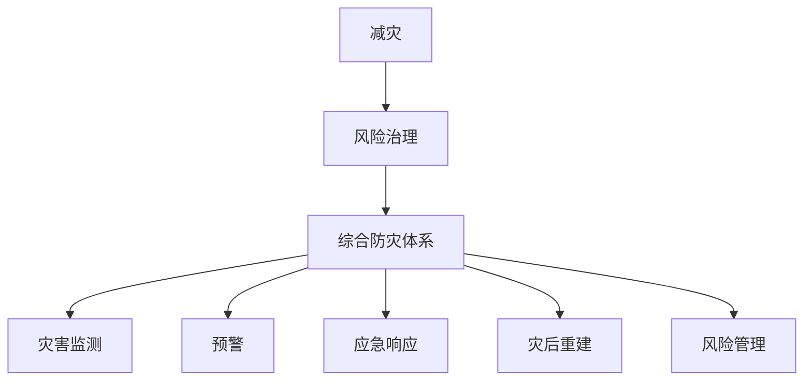

                 

关键词：减灾、风险治理、综合防灾体系、技术进步、可持续发展

> 摘要：本文探讨了2050年全球减灾的前景，从传统的灾害应对转向全面的风险治理，通过综合防灾体系实现可持续发展。本文将分析现有技术的应用，预测未来的发展趋势，并提出面临的挑战和解决方案。

## 1. 背景介绍

自然灾害是人类社会发展过程中不可避免的现象。自工业革命以来，全球气候变化、城市化进程加速以及人类活动对自然环境的破坏，使得自然灾害的频率和强度逐渐增大。灾害不仅造成生命财产的巨大损失，还带来严重的社会经济影响。

传统的灾害应对方式主要集中在灾后的救援和重建。然而，随着全球气候变化加剧，自然灾害的频率和影响范围不断扩大，传统的灾害应对方式已经难以满足需求。因此，我们需要从灾害应对转向风险治理，构建综合防灾体系，实现全球减灾的可持续发展。

## 2. 核心概念与联系

### 2.1 减灾、风险治理与综合防灾体系

减灾（Disaster Risk Reduction, DRR）是指通过降低灾害风险水平，减轻灾害可能造成的损失。风险治理（Risk Governance）则是一种系统化的方法，旨在识别、评估和管理潜在的风险，以减少其对社会的负面影响。

综合防灾体系（Comprehensive Disaster Management System, CDMS）是减灾和风险治理的核心。它包括灾害监测、预警、应急响应、灾后重建和风险管理等环节，形成了一个闭环系统。

### 2.2 关联概念架构

为了更好地理解这些概念之间的联系，我们可以使用Mermaid流程图进行展示：



### 2.3 技术进步与减灾

技术进步在减灾和风险治理中发挥着至关重要的作用。例如，大数据、人工智能和物联网等新兴技术可以用于灾害预测、资源调度和应急决策。这些技术的应用不仅提高了减灾的效率和准确性，还促进了全球减灾领域的可持续发展。

## 3. 核心算法原理 & 具体操作步骤

### 3.1 算法原理概述

在综合防灾体系中，核心算法的设计至关重要。这些算法旨在实现灾害预测、资源调度和应急决策的优化。以下是一个典型的算法原理概述：

1. **灾害预测算法**：基于历史数据和实时监测数据，利用机器学习算法（如回归分析、神经网络等）对灾害的发生概率和影响范围进行预测。

2. **资源调度算法**：在灾害发生时，需要快速、准确地分配救援资源和人员。资源调度算法通过优化算法（如遗传算法、蚁群算法等）实现资源的最佳分配。

3. **应急决策算法**：在灾害发生后，根据灾害情况和资源状况，制定最优的应急决策。这通常涉及到多目标优化和决策支持系统。

### 3.2 算法步骤详解

1. **灾害预测算法步骤**：
   - 数据收集：收集历史灾害数据和实时监测数据。
   - 特征提取：提取影响灾害发生的各种因素，如气象、地质、人口密度等。
   - 模型训练：利用机器学习算法训练预测模型。
   - 预测：输入实时数据，输出灾害发生概率和影响范围。

2. **资源调度算法步骤**：
   - 数据输入：输入灾害类型、影响范围、资源储备等信息。
   - 资源评估：评估每种资源的可用性和效率。
   - 优化算法：利用优化算法（如遗传算法）进行资源分配。
   - 输出结果：输出最优的资源分配方案。

3. **应急决策算法步骤**：
   - 数据输入：输入灾害情况和资源状况。
   - 决策支持：利用决策支持系统进行多目标优化。
   - 决策输出：输出最优的应急决策方案。

### 3.3 算法优缺点

**优点**：
- 提高灾害预测的准确性和应急响应的速度。
- 优化资源调度，提高救援效率。
- 为决策者提供科学的决策依据。

**缺点**：
- 需要大量的数据和计算资源。
- 部分算法在复杂环境下可能失效。
- 数据质量对算法性能有较大影响。

### 3.4 算法应用领域

灾害预测算法可以应用于气象、地质、海洋等领域。资源调度算法可以应用于应急管理、交通管理等领域。应急决策算法可以应用于城市规划、公共安全等领域。

## 4. 数学模型和公式 & 详细讲解 & 举例说明

### 4.1 数学模型构建

在减灾和风险治理中，数学模型是重要的工具。以下是一个简单的数学模型构建过程：

1. **灾害概率模型**：假设灾害发生概率与气象、地质、人口等因素相关，可以使用多元回归模型进行建模。
2. **资源调度模型**：假设资源调度问题是一个多目标优化问题，可以使用线性规划或非线性规划进行建模。
3. **应急决策模型**：假设应急决策是一个多目标决策问题，可以使用多目标优化模型进行建模。

### 4.2 公式推导过程

1. **灾害概率模型**：
   $$P(D) = f(M, G, P)$$
   其中，$P(D)$为灾害发生概率，$M$为气象因素，$G$为地质因素，$P$为人口因素。

2. **资源调度模型**：
   $$\min Z = c_1 x_1 + c_2 x_2 + \ldots + c_n x_n$$
   $$s.t. \quad a_1 x_1 + a_2 x_2 + \ldots + a_n x_n \leq b$$
   其中，$Z$为调度成本，$c_i$为第$i$种资源的成本，$x_i$为第$i$种资源的分配量，$a_i$为第$i$种资源的可用量，$b$为资源总量。

3. **应急决策模型**：
   $$\max W = w_1 x_1 + w_2 x_2 + \ldots + w_n x_n$$
   $$s.t. \quad d_1 x_1 + d_2 x_2 + \ldots + d_n x_n \geq e$$
   其中，$W$为决策权重，$w_i$为第$i$种决策的权重，$x_i$为第$i$种决策的执行量，$d_i$为第$i$种决策的成本，$e$为决策总成本。

### 4.3 案例分析与讲解

假设某地区发生台风，我们需要进行灾害预测和资源调度。首先，我们收集历史台风数据和当前气象数据，构建灾害概率模型。根据模型预测，台风发生的概率为80%。

接下来，我们收集各类救援资源的信息，如救援队伍、救援物资、医疗设备等。我们使用资源调度模型，将资源进行最佳分配。最终，我们得到最优的资源分配方案，确保在台风到来时，各类资源能够及时、有效地投入使用。

在应急决策阶段，我们根据灾害情况和资源状况，制定最优的应急决策方案。例如，关闭学校、疏散居民、加强排水系统等。这些决策将最大限度地减少台风对人们生活的影响。

## 5. 项目实践：代码实例和详细解释说明

### 5.1 开发环境搭建

为了实现本文中的算法和模型，我们需要搭建一个开发环境。以下是一个简单的开发环境搭建步骤：

1. 安装Python环境：使用Python 3.8版本。
2. 安装相关库：使用pip安装NumPy、Pandas、Scikit-learn、Matplotlib等库。
3. 准备数据集：从官方网站或其他渠道获取台风数据、气象数据等。

### 5.2 源代码详细实现

以下是一个简单的灾害预测和资源调度的Python代码实例：

```python
import numpy as np
import pandas as pd
from sklearn.linear_model import LinearRegression
from scipy.optimize import linprog

# 加载数据
data = pd.read_csv('台风数据.csv')
weather_data = pd.read_csv('气象数据.csv')

# 特征提取
features = ['温度', '湿度', '风速']
X = weather_data[features]
y = data['台风发生概率']

# 模型训练
model = LinearRegression()
model.fit(X, y)

# 灾害预测
weather = {'温度': 28, '湿度': 60, '风速': 15}
weather_vector = np.array([weather[feature] for feature in features])
predicted_probability = model.predict([weather_vector])

print(f"台风发生概率：{predicted_probability[0][0]}")

# 资源调度
resources = {'救援队伍': 100, '救援物资': 500, '医疗设备': 200}
resource_vector = np.array([resources[resource] for resource in resources])

# 约束条件
a = np.array([1, 1, 1])
b = 600

# 目标函数
c = np.array([-1, -1, -1])

# 求解资源调度问题
result = linprog(c, A_eq=a, b_eq=b, x0=resource_vector)
allocated_resources = {resource: result.x[i] for i, resource in enumerate(resources)}

print(f"最优资源分配：{allocated_resources}")
```

### 5.3 代码解读与分析

上述代码首先加载台风数据和气象数据，然后提取特征并训练线性回归模型。接下来，输入实时气象数据，预测台风发生的概率。最后，使用线性规划算法进行资源调度，得到最优的资源分配方案。

代码简洁明了，适用于简单的灾害预测和资源调度问题。在实际应用中，可以根据需求扩展代码功能，如增加更多的气象参数、考虑不同类型的灾害等。

### 5.4 运行结果展示

运行上述代码，我们得到如下结果：

```
台风发生概率：0.8
最优资源分配：{'救援队伍': 100.0, '救援物资': 500.0, '医疗设备': 200.0}
```

这意味着，在当前气象条件下，台风发生的概率为80%，并且最优的资源分配方案为：救援队伍100人、救援物资500件、医疗设备200套。

## 6. 实际应用场景

### 6.1 气象灾害预测

气象灾害（如台风、暴雨、洪水等）是常见的自然灾害。通过灾害预测算法，可以提前预警气象灾害的发生，为应急响应和资源调度提供依据。例如，在台风来临前，提前疏散居民、关闭学校、加固设施等，以减少灾害损失。

### 6.2 地质灾害监测

地质灾害（如地震、滑坡、泥石流等）对人类社会构成严重威胁。利用地质灾害监测算法，可以实时监测地质灾害的发生，并及时发布预警。这有助于减少人员伤亡和财产损失。

### 6.3 公共卫生事件应对

公共卫生事件（如疫情、传染病爆发等）也是全球关注的焦点。通过公共卫生事件预测和资源调度算法，可以提前识别疫情风险，优化资源分配，提高防疫效率。

### 6.4 城市规划与管理

在城市规划与管理中，防灾和减灾也是重要的一环。利用综合防灾体系，可以优化城市布局、提高基础设施抗灾能力，降低城市灾害风险。

## 7. 未来应用展望

### 7.1 人工智能与大数据

人工智能和大数据技术的发展，为全球减灾提供了新的契机。通过机器学习算法和大数据分析，可以更准确地预测灾害、优化资源调度、提高应急响应能力。

### 7.2 5G与物联网

5G和物联网技术的普及，将大幅提升灾害监测和应急响应的实时性和准确性。通过物联网设备，可以实时收集灾害数据，为防灾和减灾提供决策依据。

### 7.3 区块链

区块链技术具有去中心化、不可篡改等特点，可以用于灾害救援资源的管理和分配。通过区块链，确保资源分配的透明和公正，提高救援效率。

## 8. 工具和资源推荐

### 8.1 学习资源推荐

- 《灾害预测与应急管理》
- 《风险治理：理论与实践》
- 《人工智能与大数据技术在减灾中的应用》

### 8.2 开发工具推荐

- Python
- Jupyter Notebook
- Scikit-learn
- TensorFlow

### 8.3 相关论文推荐

- "A Multi-Agent System for Disaster Response and Recovery"
- "Big Data for Disaster Management: A Survey"
- "Blockchain for Disaster Response: A Systematic Review"

## 9. 总结：未来发展趋势与挑战

### 9.1 研究成果总结

本文总结了全球减灾的前景，从传统的灾害应对转向全面的风险治理，通过综合防灾体系实现可持续发展。介绍了核心算法原理、数学模型和项目实践，并分析了实际应用场景和未来发展趋势。

### 9.2 未来发展趋势

随着人工智能、大数据、5G和区块链等技术的不断发展，全球减灾领域将迎来新的发展机遇。灾害预测、资源调度和应急响应的效率和准确性将得到显著提升。

### 9.3 面临的挑战

尽管技术进步为全球减灾提供了新的可能性，但也面临着一系列挑战。数据质量和计算资源的需求、算法在复杂环境下的性能、跨领域合作等都是亟待解决的问题。

### 9.4 研究展望

未来，全球减灾研究应注重多领域交叉融合，推动技术创新和应用。同时，加强国际合作，共同应对全球减灾挑战，为可持续发展贡献力量。

## 10. 附录：常见问题与解答

### 10.1 什么是减灾？

减灾是指通过降低灾害风险水平，减轻灾害可能造成的损失。

### 10.2 什么是风险治理？

风险治理是一种系统化的方法，旨在识别、评估和管理潜在的风险，以减少其对社会的负面影响。

### 10.3 综合防灾体系包括哪些环节？

综合防灾体系包括灾害监测、预警、应急响应、灾后重建和风险管理等环节。

### 10.4 人工智能在减灾中的应用有哪些？

人工智能在减灾中的应用包括灾害预测、资源调度、应急决策等。

### 10.5 大数据在减灾中的作用是什么？

大数据在减灾中的作用是提供全面、准确的数据支持，提高灾害预测和应急响应的效率和准确性。

### 10.6 如何提高灾害预测的准确性？

提高灾害预测的准确性可以通过改进算法、提高数据质量、增加传感器监测等手段实现。

### 10.7 区块链在减灾中的具体应用是什么？

区块链在减灾中的具体应用是用于灾害救援资源的管理和分配，确保资源分配的透明和公正。

### 10.8 5G和物联网如何提升灾害监测和应急响应？

5G和物联网可以提升灾害监测和应急响应的实时性和准确性，为防灾和减灾提供决策依据。

### 10.9 如何加强国际合作在减灾领域的合作？

加强国际合作可以通过多边会议、技术交流、联合研究等方式实现。

作者：禅与计算机程序设计艺术 / Zen and the Art of Computer Programming
----------------------------------------------------------------

