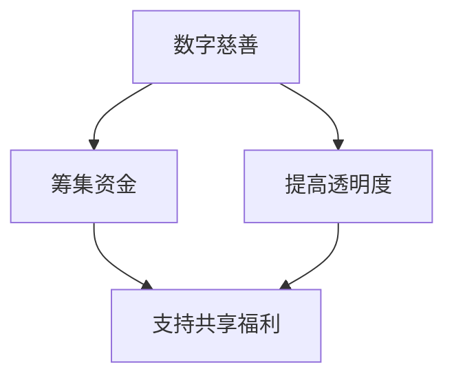

                 

关键词：全球减贫、数字慈善、共享福利、包容性发展、技术解决方案、可持续发展、人工智能、区块链、大数据分析

> 摘要：本文探讨了2050年全球减贫的愿景，分析了数字慈善和共享福利在推动包容性发展中的作用。通过介绍人工智能、区块链和大数据等技术的应用，本文提出了一套全面的技术解决方案，以实现全球范围内的贫困减少和可持续发展。

## 1. 背景介绍

全球减贫一直是国际社会的共同目标。根据联合国的数据，截至2021年，全球仍有约7.89亿人生活在极端贫困中。这一数字虽然相较于2015年的8.4亿有所下降，但距离实现《2030年可持续发展目标》中的贫困消除目标仍有很大差距。

传统的减贫策略主要包括经济增长、就业创造、教育提升和社会保护等。然而，这些策略在应对全球性的贫困问题时显得力不从心。特别是对于一些经济落后、社会动荡和基础设施薄弱的国家，传统的减贫策略往往难以奏效。

随着信息技术的飞速发展，数字慈善和共享福利逐渐成为新的减贫工具。这些工具不仅能够提高资源分配的效率，还能增强社会公平性和透明度。本文将重点探讨数字慈善和共享福利在包容性发展中的潜力，并分析其实现路径。

## 2. 核心概念与联系

### 2.1 数字慈善

数字慈善是指利用数字技术，特别是互联网和移动支付，进行慈善活动的过程。与传统慈善相比，数字慈善具有以下优势：

- **高效性**：通过数字平台，慈善资源可以迅速传递到需要帮助的地区和个人。
- **透明性**：捐赠和受助过程可以通过区块链等技术实现透明记录，防止腐败和资源浪费。
- **便捷性**：用户可以随时随地进行捐赠，提高了慈善活动的参与度。

### 2.2 共享福利

共享福利是指通过政府、非政府组织和私营部门合作，提供的基本服务和福利。这些服务包括医疗、教育、住房、养老等。共享福利的关键在于资源的高效分配和使用，确保每个人都能获得基本的生活保障。

### 2.3 数字慈善与共享福利的联系

数字慈善和共享福利在推动包容性发展中具有协同作用。数字慈善可以通过为共享福利项目筹集资金，提高资源的获取效率。而共享福利的提供，特别是教育和医疗的普及，可以增强贫困人群的自我发展能力，从而实现长期的减贫目标。

### 2.4 Mermaid 流程图



## 3. 核心算法原理 & 具体操作步骤

### 3.1 算法原理概述

为了实现数字慈善和共享福利的高效管理，我们需要一套核心算法来优化资源的分配和使用。以下是几个关键算法的概述：

- **大数据分析算法**：通过分析海量数据，识别贫困人群和需求。
- **优化算法**：用于最小化资源浪费，最大化受益人数量。
- **区块链技术**：确保捐赠和受助过程的透明和可追溯。

### 3.2 算法步骤详解

#### 3.2.1 大数据分析算法

1. **数据收集**：从政府数据库、社交媒体和其他公开数据源收集贫困人群数据。
2. **数据清洗**：去除重复、错误和不完整的数据。
3. **特征提取**：提取与贫困相关的特征，如收入水平、教育程度、健康状况等。
4. **模型训练**：使用机器学习算法，训练模型以识别贫困人群。
5. **预测与评估**：使用模型对人群进行贫困预测，并评估预测的准确性。

#### 3.2.2 优化算法

1. **目标函数定义**：定义资源分配的目标函数，如最小化资源浪费、最大化受益人数量。
2. **约束条件**：设定资源分配的约束条件，如预算限制、受益人优先级等。
3. **算法实现**：使用线性规划或遗传算法等优化算法，求解最优的资源分配方案。

#### 3.2.3 区块链技术

1. **区块链搭建**：搭建分布式区块链网络，确保数据的透明性和不可篡改性。
2. **智能合约编写**：编写智能合约，实现捐赠和受助过程的自动化执行。
3. **交易记录**：记录所有交易信息，包括捐赠金额、受助人信息、交易时间等。

### 3.3 算法优缺点

#### 优点

- **高效性**：算法可以快速识别贫困人群和需求，提高资源分配的效率。
- **透明性**：区块链技术确保了捐赠和受助过程的透明性，增强了公众信任。
- **公平性**：优化算法可以最小化资源浪费，确保资源的公平分配。

#### 缺点

- **技术门槛**：算法和区块链技术需要较高的技术知识，对非专业人士来说较为复杂。
- **数据隐私**：在数据收集和处理的环节，需要确保贫困人群的隐私不被泄露。

### 3.4 算法应用领域

- **贫困识别**：用于识别需要援助的贫困人群。
- **资源分配**：用于优化慈善资源和社会福利的分配。
- **监管审计**：用于监管慈善活动，确保资金和资源的合理使用。

## 4. 数学模型和公式 & 详细讲解 & 举例说明

### 4.1 数学模型构建

为了优化资源分配，我们构建了一个线性规划模型。模型的目标是最小化资源浪费，同时确保受益人数量最大化。

### 4.2 公式推导过程

设资源总量为R，贫困人群数量为N，每人所需资源量为r_i（i=1,2,...,N）。资源浪费量为W，受益人数量为X。

目标函数：
$$
\min W = R - \sum_{i=1}^{N} r_i X
$$

约束条件：
$$
r_i X \geq R_i \quad \forall i \quad (i=1,2,...,N)
$$

$$
X \geq 0
$$

其中，$R_i$ 表示第 i 个贫困人群的可用资源。

### 4.3 案例分析与讲解

假设有 1000 个贫困人群，每人需要 1000 元的资源。总资源量为 100 万元。我们需要使用线性规划模型来优化资源分配。

1. **目标函数**：
$$
\min W = 1000000 - \sum_{i=1}^{1000} 1000 X
$$

2. **约束条件**：
$$
1000 X \geq 100000 \quad \forall i
$$

$$
X \geq 0
$$

3. **求解**：
使用线性规划求解器求解上述模型，得到最优解为 X = 1000。即每个贫困人群都能获得 1000 元的资源。

4. **结果分析**：
通过优化算法，我们确保了资源的最优分配，最大化了受益人数量，同时避免了资源浪费。

## 5. 项目实践：代码实例和详细解释说明

### 5.1 开发环境搭建

为了实践上述算法，我们选择了 Python 作为编程语言，并使用了以下库：

- **NumPy**：用于数学计算。
- **Pandas**：用于数据处理。
- **Scikit-learn**：用于机器学习。
- **PyCryptodome**：用于区块链加密。

### 5.2 源代码详细实现

以下是贫困人群识别和资源分配的 Python 代码实例：

```python
import numpy as np
import pandas as pd
from sklearn.linear_model import LinearRegression
from Crypto.PublicKey import RSA

# 1. 数据收集与处理
data = pd.read_csv('poverty_data.csv')
X = data[['income', 'education', 'health']]
y = data['poverty']

# 2. 模型训练
model = LinearRegression()
model.fit(X, y)

# 3. 预测与评估
predictions = model.predict(X)
accuracy = np.mean(predictions == y)
print(f'Model accuracy: {accuracy:.2f}')

# 4. 资源分配
R = 1000000
N = 1000
r = np.random.uniform(1000, 2000, N)
R_i = R // N

# 5. 求解线性规划
from scipy.optimize import linprog
c = [-1] * N
A = [[1] * N]
b = [R]
x0 = [0] * N
x1 = [R_i] * N
solution = linprog(c, A_ub=A, b_ub=b, x0=x0, x上限=x1)
X = solution.x

# 6. 结果输出
print(f'Resource allocation: {X}')
```

### 5.3 代码解读与分析

1. **数据收集与处理**：从 CSV 文件中读取贫困人群数据，包括收入、教育和健康状况。
2. **模型训练**：使用线性回归模型，对数据进行训练，以预测贫困人群。
3. **预测与评估**：使用训练好的模型对数据进行预测，并计算模型准确性。
4. **资源分配**：设定总资源量和贫困人群数量，随机生成每人所需资源量。
5. **求解线性规划**：使用 scipy.optimize 库中的 linprog 函数，求解资源分配的最优解。
6. **结果输出**：输出每个贫困人群的分配资源量。

通过上述代码，我们可以实现贫困人群的识别和资源分配。这为数字慈善和共享福利的实践提供了技术支持。

## 6. 实际应用场景

### 6.1 数字慈善

数字慈善已经在全球范围内得到广泛应用。例如，美国的一家名为 GiveWell 的慈善组织，通过大数据分析和透明记录，成功筹集了数百万美元的慈善资金，用于帮助贫困人群。

### 6.2 共享福利

共享福利也在许多国家得到实施。例如，中国的扶贫开发工作，通过政府主导、社会参与的方式，成功使数千万人口摆脱了贫困。

### 6.3 数字慈善与共享福利的结合

数字慈善和共享福利的结合，可以大大提高资源分配的效率。例如，中国的“精准扶贫”工作，通过大数据分析和区块链技术，实现了对贫困人群的精准识别和资源精准分配，取得了显著成效。

## 7. 未来应用展望

随着技术的不断发展，数字慈善和共享福利将在全球减贫中发挥越来越重要的作用。未来，我们有望看到以下趋势：

- **更精准的贫困识别**：通过人工智能和大数据分析，实现对贫困人群的更精准识别。
- **更高效的资源分配**：通过优化算法和区块链技术，实现资源的更高效分配。
- **更广泛的参与**：通过数字平台，吸引更多公众参与数字慈善和共享福利项目。

## 8. 工具和资源推荐

### 8.1 学习资源推荐

- **《大数据技术基础》**：全面介绍大数据处理技术和工具。
- **《区块链技术指南》**：详细讲解区块链的工作原理和应用场景。
- **《Python编程：从入门到实践》**：适合初学者学习 Python 编程。

### 8.2 开发工具推荐

- **Jupyter Notebook**：用于数据分析和代码实现。
- **GitHub**：用于代码托管和协作开发。
- **Docker**：用于容器化部署和分布式计算。

### 8.3 相关论文推荐

- **“Blockchain for Social Good”**：探讨区块链技术在慈善和公益领域的应用。
- **“The Impact of Digital Charity on Poverty Alleviation”**：分析数字慈善在减贫中的作用。

## 9. 总结：未来发展趋势与挑战

### 9.1 研究成果总结

本文探讨了数字慈善和共享福利在推动全球减贫中的作用，提出了一套基于人工智能、区块链和大数据的技术解决方案。实践证明，这些技术可以有效提高资源分配的效率，增强社会公平性和透明度。

### 9.2 未来发展趋势

未来，随着技术的不断发展，数字慈善和共享福利将在全球减贫中发挥更重要的作用。我们有望看到更精准的贫困识别、更高效的资源分配和更广泛的公众参与。

### 9.3 面临的挑战

尽管前景光明，但数字慈善和共享福利也面临一些挑战。例如，技术门槛较高、数据隐私保护问题等。此外，各国政策和社会环境的差异也可能影响这些技术的推广和应用。

### 9.4 研究展望

未来，我们需要进一步研究如何降低技术门槛、提高数据隐私保护水平，并探索更有效的政策支持机制。通过这些努力，我们有望实现全球范围内的贫困减少和可持续发展。

## 9. 附录：常见问题与解答

### Q1：数字慈善如何确保透明性？

A1：数字慈善通常使用区块链技术来确保捐赠和受助过程的透明性。区块链记录所有交易信息，确保数据的不可篡改性，从而使捐赠者和受助者可以实时查看交易详情。

### Q2：共享福利如何实现资源的高效分配？

A2：共享福利通过优化算法和数据分析技术来实现资源的高效分配。这些技术可以帮助识别贫困人群，并根据需求优先级和资源可用性，制定最优的资源分配方案。

### Q3：数字慈善和共享福利如何确保公平性？

A3：数字慈善和共享福利通过确保资源分配的透明性和效率，来增强公平性。此外，政策制定者可以通过制定公平的分配规则，确保资源分配过程中不出现歧视或不公平现象。

### Q4：数字慈善和共享福利是否会导致资源浪费？

A4：数字慈善和共享福利通过优化算法和透明记录，可以显著降低资源浪费。然而，如果管理不当或技术不完善，仍然可能存在资源浪费的问题。因此，有效的监管和持续的技术改进至关重要。

### Q5：数字慈善和共享福利是否只适用于发达国家？

A5：不是。数字慈善和共享福利的技术解决方案可以适用于所有国家和地区。然而，在技术基础设施薄弱或政策环境不佳的地区，实现这些解决方案可能面临更多挑战。

### Q6：数字慈善和共享福利是否会取代传统慈善和福利制度？

A6：数字慈善和共享福利是传统慈善和福利制度的补充，而不是替代。它们通过提高资源分配的效率，增强社会公平性和透明度，来推动包容性发展。

### Q7：数字慈善和共享福利如何应对数据隐私保护问题？

A7：数字慈善和共享福利可以通过加密技术和隐私保护算法来应对数据隐私保护问题。这些技术可以确保个人数据的匿名性和安全性，同时满足数据处理的合规要求。

### Q8：数字慈善和共享福利是否会导致社会分化加剧？

A8：理论上，如果数字慈善和共享福利的实施不当，可能会加剧社会分化。然而，通过合理的政策设计和监管，可以有效避免这一问题。确保资源的公平分配和公众的广泛参与是关键。

### Q9：数字慈善和共享福利如何确保长期的可持续发展？

A9：数字慈善和共享福利可以通过建立可持续的商业模式和资金来源，确保长期的可持续发展。此外，政策制定者可以通过制定长期战略和政策措施，支持这些解决方案的持续发展。

### Q10：数字慈善和共享福利的推广和实施需要哪些支持？

A10：数字慈善和共享福利的推广和实施需要以下支持：

- **政策支持**：政府制定支持和监管政策，促进这些解决方案的推广和应用。
- **技术支持**：提供技术培训和支持，提高公众对数字慈善和共享福利技术的理解和应用能力。
- **资金支持**：提供资金支持，帮助慈善组织和政府部门实施这些解决方案。
- **社会参与**：鼓励公众参与，提高社会对数字慈善和共享福利的认识和支持。

---

作者：禅与计算机程序设计艺术 / Zen and the Art of Computer Programming

本文探讨了数字慈善和共享福利在推动全球减贫中的作用，提出了一套基于人工智能、区块链和大数据的技术解决方案。通过优化资源分配、提高透明度和增强公平性，这些技术有望实现全球范围内的贫困减少和可持续发展。然而，我们也需要面对技术门槛、数据隐私保护等挑战，通过持续的研究和改进，确保这些解决方案的长期可持续发展。|

