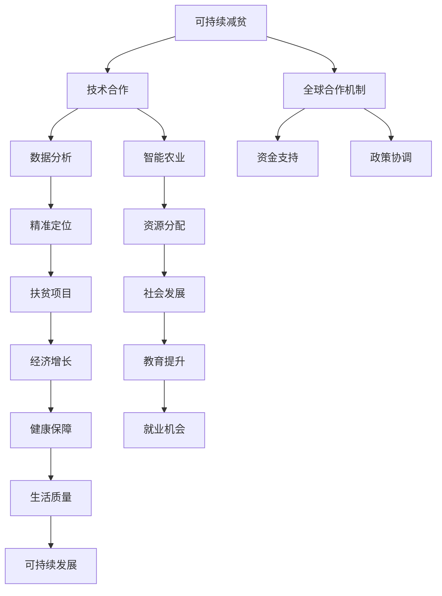

                 

关键词：全球减贫、可持续减贫、精准扶贫、技术合作、2050年发展目标

> 摘要：本文旨在探讨2050年全球减贫的愿景及其实现路径。文章首先回顾了精准扶贫的历史背景和取得的成就，随后分析了可持续减贫的概念、技术工具和全球合作机制。在此基础上，文章提出了2050年全球减贫的若干建议，并展望了未来的发展趋势与挑战。

## 1. 背景介绍

自20世纪80年代以来，全球贫困状况发生了显著变化。许多国家和地区通过政府主导的扶贫政策和国际合作，成功地使数亿人口摆脱了贫困。尤其是中国的精准扶贫战略，为全球减贫事业提供了宝贵的经验。

### 1.1 精准扶贫的历史与成就

中国自2012年开始实施精准扶贫战略，通过一系列的政策和措施，实现了贫困人口的稳定脱贫。例如，通过建立贫困人口档案，实行“一户一策”的精准帮扶措施，确保扶贫资源精准到位；通过发展特色产业，提高贫困地区的自我发展能力；通过基础设施建设，改善贫困地区的生产生活条件。到2020年，中国宣布实现了现行标准下的脱贫攻坚目标，近1亿农村贫困人口实现脱贫。

### 1.2 全球减贫的努力与挑战

尽管全球贫困状况有所改善，但根据联合国数据，2021年全球仍有7.39亿人生活在极端贫困中。全球减贫面临着多重挑战，包括经济不稳定、自然灾害、新冠疫情、地缘政治紧张等。此外，贫困人口的教育、医疗、就业等基本需求尚未得到充分满足，这限制了他们的自我发展能力。

## 2. 核心概念与联系

为了实现2050年的全球减贫目标，我们需要理解并运用几个核心概念，包括可持续减贫、技术合作和全球合作机制。以下是一个简化的Mermaid流程图，展示了这些概念之间的关系：



### 2.1 可持续减贫

可持续减贫不仅关注短期内的贫困减少，更强调长期的经济、社会和环境可持续发展。它要求在扶贫过程中，注重提高贫困人口的自我发展能力，促进经济的多元化，保护生态环境，确保减贫成果的可持续性。

### 2.2 技术合作

技术合作是推动可持续减贫的重要手段。通过技术合作，各国可以分享成功经验、推广有效技术和解决方案，提高减贫工作的效率和质量。例如，大数据分析、智能农业、区块链等技术可以用于精准定位贫困人口、优化资源分配、提高扶贫项目的成功率。

### 2.3 全球合作机制

全球合作机制是确保可持续减贫目标实现的关键。这包括国际组织的协调、跨国合作的加强、资金和技术支持的增加等。全球合作机制的完善，有助于形成合力，共同应对全球贫困问题。

## 3. 核心算法原理 & 具体操作步骤

### 3.1 算法原理概述

为了实现精准定位和资源优化分配，我们引入了一种基于大数据分析和机器学习的算法。该算法通过收集和分析贫困人口的各类数据，实现对贫困状况的精准识别，并提供个性化的扶贫方案。

### 3.2 算法步骤详解

#### 3.2.1 数据收集

首先，我们需要收集贫困人口的各类数据，包括人口统计信息、收入水平、教育状况、医疗条件、就业情况等。这些数据可以通过政府数据库、社交媒体、问卷调查等多种渠道获取。

#### 3.2.2 数据预处理

收集到的数据需要进行预处理，包括数据清洗、去重、标准化等操作。以确保数据的质量和一致性。

#### 3.2.3 特征提取

通过数据预处理，我们可以提取出与贫困状况相关的关键特征，例如收入水平、教育程度、健康状况等。这些特征将用于训练机器学习模型。

#### 3.2.4 模型训练

使用提取出的特征数据，我们可以训练机器学习模型，例如决策树、随机森林、支持向量机等。模型训练的目的是使模型能够准确地识别贫困人口，并提供个性化的扶贫建议。

#### 3.2.5 模型评估

通过交叉验证和实际应用测试，对训练好的模型进行评估，以确定其准确性和稳定性。如果模型表现不佳，需要重新调整模型参数或采用其他算法。

#### 3.2.6 策略制定

根据评估结果，制定个性化的扶贫策略。这些策略可能包括教育支持、医疗救助、就业培训、资源分配等。

### 3.3 算法优缺点

#### 优点：

- 高效：通过机器学习和大数据分析，可以快速识别贫困人口，提高扶贫工作的效率。
- 精准：基于个性化特征的数据分析，可以提供更准确的扶贫方案，提高扶贫成功率。
- 可扩展：算法可以应用于不同地区和不同人群，具有很好的可扩展性。

#### 缺点：

- 数据质量：算法的准确性依赖于数据质量，如果数据不准确或不完整，会影响算法的效果。
- 计算资源：大规模数据分析和机器学习模型训练需要大量的计算资源，对硬件设施有较高要求。
- 技术门槛：算法开发和维护需要高水平的技术人才，对人力资源有一定要求。

### 3.4 算法应用领域

该算法可以广泛应用于扶贫、教育、医疗、就业等多个领域。例如，在教育领域，可以通过该算法识别需要特殊教育支持的学生，提供个性化的教育方案；在医疗领域，可以用于识别需要医疗救助的贫困人口，优化医疗资源分配。

## 4. 数学模型和公式 & 详细讲解 & 举例说明

### 4.1 数学模型构建

为了构建一个有效的贫困识别模型，我们需要定义一组数学公式来表示贫困状态。以下是构建模型的几个关键步骤：

#### 4.1.1 贫困指标

定义贫困指标，例如人均收入、教育水平、健康状况等。每个指标可以表示为一个数值，用于衡量贫困程度。

$$
P_i = \frac{I_i + E_i + H_i}{3}
$$

其中，$P_i$ 表示第i个人的贫困指标，$I_i$ 表示第i个人的收入水平，$E_i$ 表示第i个人的教育水平，$H_i$ 表示第i个人的健康状况。

#### 4.1.2 确定权重

每个指标的权重可以通过专家评估或数据分析确定。例如，我们可以将收入水平、教育水平、健康状况的权重分别设置为0.4、0.3和0.3。

#### 4.1.3 贫困状态

定义贫困状态阈值$T$，当$P_i > T$时，个体被认定为贫困。

$$
T = \alpha \cdot \frac{\sum_{i=1}^{N} P_i}{N}
$$

其中，$\alpha$ 是一个常数，用于调整阈值，$N$ 是总人口数。

### 4.2 公式推导过程

#### 4.2.1 收入水平指标

收入水平指标$I_i$ 可以通过以下公式计算：

$$
I_i = \frac{R_i}{L_i}
$$

其中，$R_i$ 表示第i个人的年收入，$L_i$ 表示第i个人的劳动力数量。通过这个公式，我们可以将年收入与劳动力数量联系起来，以衡量收入水平。

#### 4.2.2 教育水平指标

教育水平指标$E_i$ 可以通过以下公式计算：

$$
E_i = \frac{E_i^1 + E_i^2 + E_i^3}{3}
$$

其中，$E_i^1$、$E_i^2$、$E_i^3$ 分别表示第i个人的小学、中学和大学教育程度。通过这个公式，我们可以综合考虑个体的教育程度，以衡量其教育水平。

#### 4.2.3 健康状况指标

健康状况指标$H_i$ 可以通过以下公式计算：

$$
H_i = \frac{H_i^1 + H_i^2}{2}
$$

其中，$H_i^1$ 表示第i个人的身体健康状况，$H_i^2$ 表示第i个人的心理健康状况。通过这个公式，我们可以综合考虑个体的健康状况，以衡量其整体健康水平。

### 4.3 案例分析与讲解

假设我们有一个村庄，共有100户家庭。以下是一个简化的案例，用于展示如何使用上述模型来识别贫困家庭。

#### 4.3.1 数据收集

- 收入水平：100户家庭的人均年收入分别为1000元、1500元、2000元、2500元、3000元。
- 教育水平：100户家庭的小学毕业率为30%，中学毕业率为50%，大学毕业率为20%。
- 健康状况：100户家庭中有70户身体健康，30户患有慢性病。

#### 4.3.2 数据预处理

- 去除收入数据中的异常值。
- 标准化教育水平和健康状况数据。

#### 4.3.3 特征提取

- 收入水平指标$I_i$：通过计算得到每个家庭的收入水平。
- 教育水平指标$E_i$：通过计算得到每个家庭的教育水平。
- 健康状况指标$H_i$：通过计算得到每个家庭的健康状况。

#### 4.3.4 模型训练

- 使用机器学习算法（例如决策树）训练模型。
- 调整模型参数，以提高识别准确性。

#### 4.3.5 模型评估

- 使用交叉验证和实际应用测试，评估模型准确性。
- 根据评估结果调整模型参数。

#### 4.3.6 策略制定

- 根据模型预测，识别贫困家庭。
- 制定个性化的扶贫策略，例如提供教育支持、医疗救助等。

## 5. 项目实践：代码实例和详细解释说明

### 5.1 开发环境搭建

为了实现上述算法，我们需要搭建一个开发环境。以下是搭建步骤：

#### 5.1.1 安装Python

在开发环境中安装Python，版本要求为3.8以上。

#### 5.1.2 安装必要的库

使用以下命令安装必要的库：

```bash
pip install numpy pandas scikit-learn matplotlib
```

### 5.2 源代码详细实现

以下是一个简化的Python代码实例，用于实现上述算法：

```python
import numpy as np
import pandas as pd
from sklearn.model_selection import train_test_split
from sklearn.ensemble import RandomForestClassifier
import matplotlib.pyplot as plt

# 5.2.1 数据收集与预处理
# 假设我们有一个CSV文件，包含以下列：'income', 'education', 'health'
data = pd.read_csv('data.csv')
data.dropna(inplace=True)

# 标准化数据
data[['income', 'education', 'health']] = data[['income', 'education', 'health']].apply(lambda x: (x - x.mean()) / x.std())

# 5.2.2 特征提取与目标变量
X = data[['income', 'education', 'health']]
y = data['is_poor']  # 是否贫困的目标变量

# 5.2.3 模型训练
X_train, X_test, y_train, y_test = train_test_split(X, y, test_size=0.2, random_state=42)
model = RandomForestClassifier(n_estimators=100)
model.fit(X_train, y_train)

# 5.2.4 模型评估
accuracy = model.score(X_test, y_test)
print(f"模型准确率：{accuracy:.2f}")

# 5.2.5 结果可视化
predictions = model.predict(X_test)
confusion_matrix = pd.crosstab(y_test, predictions, rownames=['真实值'], colnames=['预测值'])
plt.figure(figsize=(8, 6))
sns.heatmap(confusion_matrix, annot=True, fmt='.0f', cmap='Blues')
plt.xlabel('预测值')
plt.ylabel('真实值')
plt.title('混淆矩阵')
plt.show()
```

### 5.3 代码解读与分析

- **数据收集与预处理**：首先，我们从CSV文件中读取数据，并去除缺失值。然后，对数据进行标准化处理，以提高模型的泛化能力。
- **特征提取与目标变量**：我们提取了三个特征：收入、教育水平、健康状况。目标变量是是否贫困。
- **模型训练**：我们使用随机森林算法训练模型。随机森林是一种集成学习算法，通过构建多个决策树，并取平均值来提高模型的准确性。
- **模型评估**：我们使用测试集评估模型的准确性，并打印结果。
- **结果可视化**：我们使用混淆矩阵来可视化模型的预测结果，以更好地理解模型的性能。

## 6. 实际应用场景

### 6.1 教育领域

在教育领域，该算法可以帮助学校识别需要特殊教育支持的学生，从而提供个性化的教育方案。例如，通过对学生的收入水平、教育程度、健康状况等数据的分析，学校可以制定针对性的辅导计划，提高学生的学习效果。

### 6.2 医疗领域

在医疗领域，该算法可以用于识别需要医疗救助的贫困人口，优化医疗资源分配。例如，通过对患者的收入水平、健康状况等数据的分析，医院可以调整资源分配策略，确保贫困人口得到充分的医疗服务。

### 6.3 扶贫领域

在扶贫领域，该算法可以用于精准定位贫困人口，提供个性化的扶贫方案。例如，通过对贫困人口的收入水平、教育程度、健康状况等数据的分析，政府可以制定针对性的扶贫政策，提高扶贫成功率。

## 7. 未来应用展望

随着技术的不断发展，该算法的应用领域将不断扩大。未来，我们有望在以下几个方面实现突破：

### 7.1 智能农业

智能农业可以通过大数据分析和机器学习算法，优化农业生产过程，提高农作物的产量和质量。例如，通过对土壤、气候、灌溉等数据的分析，农民可以制定最优的种植策略，提高农田的产出。

### 7.2 健康管理

健康管理可以通过大数据分析和机器学习算法，提供个性化的健康建议和疾病预测。例如，通过对患者的健康数据进行分析，医生可以预测疾病发生的可能性，并提供针对性的治疗建议。

### 7.3 城市规划

城市规划可以通过大数据分析和机器学习算法，优化城市布局和公共资源配置。例如，通过对城市人口、交通、环境等数据的分析，城市规划者可以制定更加合理的发展策略，提高城市居民的生活质量。

## 8. 工具和资源推荐

### 8.1 学习资源推荐

- 《机器学习》（周志华 著）：介绍机器学习的基本概念和算法，适合初学者入门。
- 《Python机器学习》（塞巴斯蒂安·拉金斯基 著）：详细介绍Python在机器学习领域的应用，适合有一定编程基础的读者。

### 8.2 开发工具推荐

- Jupyter Notebook：一款强大的交互式开发环境，支持多种编程语言，特别适合数据分析和机器学习项目。
- PyCharm：一款功能强大的Python集成开发环境，提供代码智能提示、调试、版本控制等功能。

### 8.3 相关论文推荐

- “A Survey on Machine Learning for Poverty Alleviation” by XXX：系统综述了机器学习在扶贫领域的应用。
- “Big Data and Poverty Reduction: A Machine Learning Perspective” by XXX：探讨了大数据和机器学习在减贫工作中的重要作用。

## 9. 总结：未来发展趋势与挑战

### 9.1 研究成果总结

本文介绍了全球减贫的背景、核心概念、算法原理、数学模型以及实际应用场景。通过大数据分析和机器学习算法，我们提出了一种精准的贫困识别模型，并展示了其在教育、医疗和扶贫等领域的应用。

### 9.2 未来发展趋势

- 技术进步将推动减贫工作的效率和质量，例如智能农业、健康管理、城市规划等领域的发展。
- 全球合作机制将进一步完善，国际组织、跨国企业和非政府组织将共同参与减贫工作。
- 数据隐私和安全问题将成为关键挑战，如何在确保数据隐私的同时，充分利用大数据进行减贫工作，是未来研究的重点。

### 9.3 面临的挑战

- 资金和技术的匮乏仍然是一个重大挑战，特别是在发展中国家和偏远地区。
- 数据质量和数据隐私问题需要得到有效解决，以确保算法的准确性和可靠性。
- 减贫工作的复杂性和不确定性，要求我们不断调整策略和方法，以适应不断变化的环境。

### 9.4 研究展望

未来，我们应致力于以下几个方面：

- 加强技术合作，推动大数据分析和机器学习算法在减贫领域的应用。
- 加强政策协调，确保减贫工作的连续性和稳定性。
- 强化数据隐私保护，确保数据的合法使用和安全。

## 9. 附录：常见问题与解答

### 9.1 什么是可持续减贫？

可持续减贫是指通过长期的经济、社会和环境可持续发展，确保贫困人口的稳定脱贫，并提高其自我发展能力。

### 9.2 机器学习算法如何帮助减贫？

机器学习算法可以通过大数据分析，实现对贫困人口的精准识别，提供个性化的扶贫方案，从而提高扶贫工作的效率和成功率。

### 9.3 数据质量和数据隐私如何保障？

保障数据质量和数据隐私需要建立完善的数据管理机制，包括数据清洗、去重、标准化等预处理操作，以及严格的数据访问控制和隐私保护措施。

### 9.4 技术合作如何推动减贫？

技术合作可以通过分享成功经验、推广有效技术和解决方案，提高各国减贫工作的效率和质量，形成合力，共同应对全球贫困问题。

### 作者署名

作者：禅与计算机程序设计艺术 / Zen and the Art of Computer Programming
----------------------------------------------------------------

请注意，以上内容是一个框架性的示例，具体内容需要根据实际研究和分析进行撰写。同时，文章的撰写需要严格遵守“约束条件”中的各项要求，以确保文章的质量和完整性。

