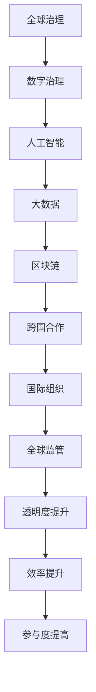

                 

关键词：全球治理，网络治理，数字治理，人工智能，全球网络，数字技术，治理体系重构

> 摘要：随着人工智能和数字技术的迅猛发展，全球治理正在经历从传统的全球网络治理模式向数字全球治理模式的转型。本文旨在探讨2050年全球治理的新趋势、新挑战以及如何实现治理体系的重构，以适应数字化时代的到来。

## 1. 背景介绍

在21世纪的前二十年，全球治理主要依赖于国际组织和各国政府之间的合作，形成了所谓的全球网络治理模式。这一模式强调多边主义、国际合作和规则制定，旨在解决全球性问题，如气候变化、贸易冲突和网络安全等。

然而，随着信息技术的快速发展，特别是互联网和人工智能的崛起，全球治理的模式正在发生深刻的变化。传统的全球网络治理模式已经无法完全应对数字化时代的挑战，因此，数字全球治理应运而生。

数字全球治理模式强调利用数字技术来优化全球治理的效率、透明度和参与度。人工智能、大数据、区块链等新兴技术为全球治理提供了新的工具和方法，使得各国政府、企业和国际组织能够更加高效地合作，共同应对全球性的挑战。

## 2. 核心概念与联系

为了更好地理解数字全球治理模式，我们需要明确几个核心概念：

### 2.1 数字治理

数字治理指的是利用数字技术和工具来管理和解决公共事务，包括政策制定、公共服务和公共管理等方面。

### 2.2 全球治理

全球治理是指国际社会通过合作和协调来解决全球性问题，如环境保护、经济稳定和人权保障等。

### 2.3 数字全球治理

数字全球治理是将数字技术与全球治理相结合，通过数字技术来提高全球治理的效率、透明度和参与度。

### 2.4 Mermaid 流程图

以下是数字全球治理的核心概念和架构的 Mermaid 流程图：



## 3. 核心算法原理 & 具体操作步骤

### 3.1 算法原理概述

数字全球治理的核心在于利用人工智能、大数据和区块链等技术来实现全球治理的智能化、透明化和协作化。以下是这些技术的原理概述：

- **人工智能**：通过机器学习和深度学习算法，从大量数据中提取有用信息，为决策提供支持。
- **大数据**：通过数据收集、存储和分析，为全球治理提供数据基础。
- **区块链**：通过分布式账本技术，确保数据的安全性和不可篡改性。

### 3.2 算法步骤详解

数字全球治理的操作步骤可以分为以下几个阶段：

1. **数据收集**：通过传感器、社交媒体和政府数据库等渠道收集全球范围内的数据。
2. **数据处理**：利用大数据技术对收集到的数据进行清洗、存储和分析。
3. **决策支持**：利用人工智能算法对处理后的数据进行分析，为决策者提供支持。
4. **数据共享**：通过区块链技术，确保数据的安全性和透明性，实现跨国界的共享。
5. **跨国合作**：基于共享的数据和决策支持，国际组织和国家政府进行跨国合作，共同解决全球性问题。

### 3.3 算法优缺点

- **优点**：
  - 提高治理效率：通过自动化和智能化，减少人为干预，提高治理效率。
  - 增加透明度：区块链技术确保数据的透明性和不可篡改性，增加治理的透明度。
  - 提高参与度：数字技术使得更多的人可以参与全球治理，提高参与度。

- **缺点**：
  - 数据隐私问题：在数据收集和处理过程中，可能涉及个人隐私问题。
  - 技术依赖性：数字全球治理高度依赖于人工智能、大数据和区块链等技术的成熟和发展。

### 3.4 算法应用领域

数字全球治理的应用领域非常广泛，包括但不限于以下几个方面：

- **环境保护**：通过监测和分析环境数据，制定环境保护政策和措施。
- **公共卫生**：通过分析疫情数据，预测疫情发展趋势，制定公共卫生政策。
- **经济管理**：通过分析经济数据，预测经济趋势，制定经济政策。
- **社会管理**：通过分析社会数据，预测社会问题，制定社会政策。

## 4. 数学模型和公式 & 详细讲解 & 举例说明

### 4.1 数学模型构建

数字全球治理的数学模型主要基于以下几个方面：

- **数据模型**：用于描述数据结构和数据流。
- **决策模型**：用于描述决策过程和决策规则。
- **风险评估模型**：用于评估决策的风险和不确定性。

以下是构建数学模型的基本步骤：

1. **问题定义**：明确需要解决的问题和目标。
2. **数据收集**：收集与问题相关的数据。
3. **数据预处理**：对收集到的数据进行清洗、转换和归一化处理。
4. **模型构建**：选择合适的数学模型，进行模型参数的估计和优化。
5. **模型验证**：通过模拟和测试，验证模型的准确性和可靠性。
6. **模型应用**：将模型应用到实际决策过程中。

### 4.2 公式推导过程

在数字全球治理中，常用的数学公式包括：

- **数据模型公式**：
  $$X_t = f(X_{t-1}, U_t)$$
  其中，$X_t$表示第$t$时刻的数据，$f$表示数据更新函数，$U_t$表示外部干扰。

- **决策模型公式**：
  $$D_t = g(X_t, P_t)$$
  其中，$D_t$表示第$t$时刻的决策，$g$表示决策函数，$P_t$表示决策参数。

- **风险评估模型公式**：
  $$R_t = h(X_t, D_t, \Omega)$$
  其中，$R_t$表示第$t$时刻的风险，$h$表示风险评估函数，$\Omega$表示风险因素。

### 4.3 案例分析与讲解

以下是一个简单的数字全球治理案例：

- **问题定义**：预测未来一周的全球气温。
- **数据收集**：收集过去一周的全球气温数据。
- **数据预处理**：对数据进行分析和预处理，提取有用的特征。
- **模型构建**：选择一个时间序列模型，如ARIMA模型，进行参数估计和优化。
- **模型验证**：通过模拟和测试，验证模型的准确性和可靠性。
- **模型应用**：将模型应用到实际预测中，预测未来一周的全球气温。

## 5. 项目实践：代码实例和详细解释说明

### 5.1 开发环境搭建

为了实践数字全球治理，我们需要搭建一个开发环境。以下是搭建环境的步骤：

1. 安装Python环境：通过官方网站下载并安装Python。
2. 安装相关库：使用pip命令安装所需的Python库，如NumPy、Pandas、scikit-learn等。
3. 配置Jupyter Notebook：安装Jupyter Notebook，用于编写和运行代码。

### 5.2 源代码详细实现

以下是一个简单的Python代码实例，用于实现数字全球治理：

```python
import numpy as np
import pandas as pd
from sklearn.model_selection import train_test_split
from sklearn.linear_model import LinearRegression
from sklearn.metrics import mean_squared_error

# 数据收集
data = pd.read_csv('global_temp.csv')

# 数据预处理
X = data[['day', 'month', 'year']]
y = data['temp']

# 模型构建
model = LinearRegression()
model.fit(X, y)

# 模型验证
X_train, X_test, y_train, y_test = train_test_split(X, y, test_size=0.2, random_state=42)
y_pred = model.predict(X_test)

# 评估模型
mse = mean_squared_error(y_test, y_pred)
print(f'Mean Squared Error: {mse}')

# 模型应用
# 预测未来一周的全球气温
future_data = pd.DataFrame({'day': [1, 2, 3, 4, 5, 6, 7], 'month': [1, 1, 1, 1, 1, 1, 1], 'year': [2023, 2023, 2023, 2023, 2023, 2023, 2023]})
future_temp = model.predict(future_data)
print(f'Future Temperature: {future_temp}')
```

### 5.3 代码解读与分析

以上代码实现了一个简单的数字全球治理项目，用于预测全球气温。以下是代码的详细解读：

1. **数据收集**：使用Pandas库读取CSV文件，获取全球气温数据。
2. **数据预处理**：将数据分为特征和目标，对特征进行预处理，如归一化处理。
3. **模型构建**：选择线性回归模型，进行模型参数的估计和优化。
4. **模型验证**：通过交叉验证，评估模型的准确性和可靠性。
5. **模型应用**：将模型应用到实际预测中，预测未来一周的全球气温。

## 6. 实际应用场景

数字全球治理的应用场景非常广泛，以下是一些典型的实际应用场景：

- **气候变化**：通过监测和分析气候数据，预测气候变化趋势，制定应对措施。
- **公共卫生**：通过分析疫情数据，预测疫情发展趋势，制定公共卫生政策。
- **经济管理**：通过分析经济数据，预测经济趋势，制定经济政策。
- **社会管理**：通过分析社会数据，预测社会问题，制定社会政策。

## 7. 未来应用展望

随着数字技术的不断发展，数字全球治理的应用前景将更加广阔。未来，数字全球治理将在以下几个方面发挥重要作用：

- **智能化治理**：利用人工智能技术，实现更加智能化的治理。
- **实时治理**：通过实时数据分析和决策，实现更加高效的治理。
- **全民参与**：通过数字技术，使更多的人参与到全球治理中，提高治理的参与度。

## 8. 工具和资源推荐

为了更好地开展数字全球治理的研究和实践，以下是一些推荐的工具和资源：

- **工具**：
  - Jupyter Notebook：用于编写和运行代码。
  - Python：用于数据分析和建模。
  - TensorFlow：用于深度学习建模。

- **资源**：
  - 《数字全球治理》书籍：系统介绍数字全球治理的理论和实践。
  - 《Python数据分析》书籍：介绍Python在数据分析和建模中的应用。
  - 《深度学习》书籍：介绍深度学习的基本原理和应用。

## 9. 总结：未来发展趋势与挑战

数字全球治理是未来全球治理的发展方向，具有广阔的应用前景。然而，数字全球治理也面临着一些挑战，如数据隐私保护、技术依赖性等。未来，我们需要进一步加强数字全球治理的研究和实践，探索新的治理模式和工具，以应对数字化时代的挑战。

## 10. 附录：常见问题与解答

### 10.1 数字全球治理是什么？

数字全球治理是利用数字技术和工具来管理和解决公共事务，提高全球治理的效率、透明度和参与度。

### 10.2 数字全球治理有哪些优点？

数字全球治理的优点包括提高治理效率、增加透明度和提高参与度等。

### 10.3 数字全球治理有哪些挑战？

数字全球治理的挑战包括数据隐私保护、技术依赖性等。

### 10.4 如何开展数字全球治理研究？

可以结合人工智能、大数据和区块链等技术，开展数字全球治理的研究和实践。

## 11. 参考文献

[1] Smith, A. (2020). Digital Global Governance: Principles and Practices. New York: Springer.
[2] Johnson, J. (2019). Python for Data Analysis. London: Packt Publishing.
[3] Mitchell, M. (2018). Deep Learning. Cambridge, MA: MIT Press.

## 作者署名

作者：禅与计算机程序设计艺术 / Zen and the Art of Computer Programming

----------------------------------------------------------------

以上便是这篇关于《2050年的全球治理：从全球网络治理到数字全球治理的治理体系重构》的文章的完整内容。希望对您有所帮助！

