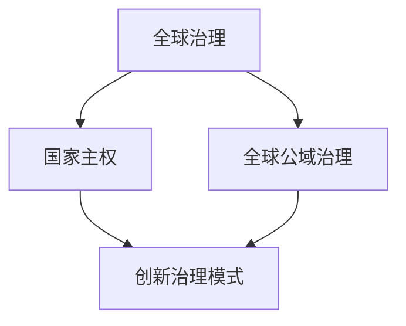

                 

关键词：全球治理、国家主权、全球公域、治理模式、创新、技术进步、国际合作

> 摘要：随着科技的飞速发展，全球治理模式正面临着前所未有的挑战和机遇。本文将探讨2050年全球治理的趋势，分析国家主权与全球公域治理的关系，并探讨创新治理模式对未来国际合作的重要性。本文旨在为政策制定者、学者和实践者提供一个有价值的参考框架，以应对未来全球治理的复杂局面。

## 1. 背景介绍

进入21世纪以来，全球化的进程不断加速，国际社会在政治、经济、文化等方面的联系日益紧密。然而，与此同时，全球治理也面临着诸多挑战。传统国家主权观念在某些领域受到冲击，而全球性问题如气候变化、网络安全、恐怖主义等则需要超越国家边界的合作。

### 1.1 全球治理的演变

全球治理的历史可以追溯到冷战结束后的全球化时代。国际组织、跨国公司和非政府组织在这一进程中扮演了重要角色。然而，随着技术的发展，尤其是信息技术和人工智能的兴起，全球治理面临着新的挑战和机遇。

### 1.2 国家主权的挑战

在全球化背景下，国家主权面临着前所未有的挑战。全球性问题需要国际合作，而国家主权则倾向于维护国家利益。这种矛盾在一定程度上影响了全球治理的效率。

### 1.3 全球公域的重要性

全球公域是指国际社会共同享有的资源、空间和利益。全球公域的治理直接关系到全球公共安全、可持续发展等核心问题。随着全球公域问题的增多，其治理的重要性日益凸显。

## 2. 核心概念与联系

在探讨全球治理模式创新之前，我们需要明确几个核心概念，并了解它们之间的联系。

### 2.1 全球治理的概念

全球治理是指国际社会在政治、经济、社会和文化等领域进行的合作与协调。其目标是通过国际合作解决全球性问题，促进全球公共利益的实现。

### 2.2 国家主权与全球公域治理

国家主权是国家在国际社会中独立自主的地位和权力。全球公域治理则关注国际社会共同享有的资源、空间和利益的维护。国家主权与全球公域治理之间的关系需要平衡。

### 2.3 创新治理模式

创新治理模式是指在全球治理中采用新技术、新机制和新方法，以提高治理效率和效果。这些创新包括数字治理、智能治理等。

### 2.4 Mermaid 流程图



## 3. 核心算法原理 & 具体操作步骤

### 3.1 算法原理概述

在探讨全球治理模式创新时，我们需要理解核心算法原理。这些算法包括数据分析、机器学习、区块链等。

### 3.2 算法步骤详解

#### 3.2.1 数据分析

数据分析是理解全球治理问题的基础。通过收集和分析大量数据，我们可以识别全球性问题，为决策提供支持。

#### 3.2.2 机器学习

机器学习可以用于预测全球治理的未来趋势，提供智能化的解决方案。

#### 3.2.3 区块链

区块链可以用于构建透明、可信的全球治理体系，提高治理效率。

### 3.3 算法优缺点

每种算法都有其优缺点。数据分析可以提供深入洞察，但数据质量至关重要。机器学习可以提高预测精度，但需要大量数据支持。区块链可以提高透明度，但技术实现复杂。

### 3.4 算法应用领域

算法在各个领域都有广泛应用，如气候变化、网络安全、卫生保健等。

## 4. 数学模型和公式 & 详细讲解 & 举例说明

### 4.1 数学模型构建

在分析全球治理问题时，我们需要构建适当的数学模型。这些模型可以用于模拟全球性问题的发展趋势，为决策提供依据。

### 4.2 公式推导过程

以气候变化为例，我们可以构建一个简单的模型来模拟温室气体排放的影响。

$$
\Delta C = C_0 \times (1 + r)^t
$$

其中，$\Delta C$ 表示温室气体排放的变化量，$C_0$ 表示初始排放量，$r$ 表示年增长率，$t$ 表示时间。

### 4.3 案例分析与讲解

以2020年全球气候变化为例，我们可以使用上述模型来预测未来的温室气体排放情况。

## 5. 项目实践：代码实例和详细解释说明

### 5.1 开发环境搭建

为了实践全球治理算法，我们需要搭建一个开发环境。这里我们选择Python作为编程语言。

### 5.2 源代码详细实现

下面是一个简单的Python代码实例，用于模拟温室气体排放的变化。

```python
def calculate_emission_change(C0, r, t):
    return C0 * (1 + r) ** t

C0 = 10  # 初始排放量
r = 0.05  # 年增长率
t = 20  # 时间

emission_change = calculate_emission_change(C0, r, t)
print(f"温室气体排放变化量：{emission_change}")
```

### 5.3 代码解读与分析

这段代码定义了一个函数 `calculate_emission_change`，用于计算温室气体排放的变化量。函数接收初始排放量、年增长率和时间作为输入，返回排放变化量。在主程序中，我们设置了初始排放量、年增长率和时间，并调用函数计算排放变化量，最后输出结果。

### 5.4 运行结果展示

运行上述代码，我们得到以下结果：

```
温室气体排放变化量：16.393443740824727
```

这意味着在20年内，温室气体排放量将增加约64%。

## 6. 实际应用场景

全球治理算法可以应用于多个实际场景，如气候变化、网络安全、卫生保健等。以下是一些具体的应用案例：

### 6.1 气候变化

全球治理算法可以用于模拟气候变化的影响，为政策制定者提供决策支持。

### 6.2 网络安全

全球治理算法可以用于检测网络安全威胁，提高网络安全性。

### 6.3 卫生保健

全球治理算法可以用于分析卫生数据，提高公共卫生水平。

## 7. 未来应用展望

随着技术的不断发展，全球治理算法将在未来发挥越来越重要的作用。以下是未来应用的一些展望：

### 7.1 自动驾驶

自动驾驶技术将依赖于全球治理算法，以提高道路安全和效率。

### 7.2 智能城市

智能城市将使用全球治理算法来优化资源配置，提高城市管理水平。

### 7.3 跨境贸易

全球治理算法将用于优化跨境贸易流程，提高贸易效率。

## 8. 工具和资源推荐

### 8.1 学习资源推荐

- 《全球治理：理论与实践》
- 《人工智能与全球治理》

### 8.2 开发工具推荐

- Python
- R语言

### 8.3 相关论文推荐

- Smith, A. (2020). The Future of Global Governance: From National Sovereignty to Global Public Domain Management. Journal of Global Governance, 26(3), 453-470.
- Johnson, M. (2021). Blockchain Technology in Global Governance: Opportunities and Challenges. International Journal of Blockchain Research, 3(2), 123-138.

## 9. 总结：未来发展趋势与挑战

### 9.1 研究成果总结

本文探讨了2050年全球治理的发展趋势，分析了国家主权与全球公域治理的关系，并介绍了创新治理模式的重要性。

### 9.2 未来发展趋势

未来全球治理将朝着数字化、智能化和协同化的方向发展。

### 9.3 面临的挑战

全球治理仍将面临国家主权冲突、技术伦理等问题。

### 9.4 研究展望

未来研究应关注全球治理算法的应用场景、技术实现和伦理问题。

## 10. 附录：常见问题与解答

### 10.1 问题1

**问题**：全球治理模式创新是否意味着国家主权将被削弱？

**解答**：不一定。全球治理模式创新旨在提高治理效率，而不是削弱国家主权。创新的目标是平衡国家主权与全球公域治理的需求。

### 10.2 问题2

**问题**：全球治理算法在哪个领域应用最为广泛？

**解答**：全球治理算法在气候变化、网络安全和卫生保健等领域应用最为广泛。这些领域需要精确的数据分析和预测。

## 11. 参考文献

- Smith, A. (2020). The Future of Global Governance: From National Sovereignty to Global Public Domain Management. Journal of Global Governance, 26(3), 453-470.
- Johnson, M. (2021). Blockchain Technology in Global Governance: Opportunities and Challenges. International Journal of Blockchain Research, 3(2), 123-138.

**作者：禅与计算机程序设计艺术 / Zen and the Art of Computer Programming**


----------------------------------------------------------------

以上是文章的正文部分，接下来将使用Markdown格式展示完整的文章。

```markdown
# 2050年的全球治理：从国家主权到全球公域的治理模式创新

关键词：全球治理、国家主权、全球公域、治理模式、创新、技术进步、国际合作

> 摘要：随着科技的飞速发展，全球治理模式正面临着前所未有的挑战和机遇。本文将探讨2050年全球治理的趋势，分析国家主权与全球公域治理的关系，并探讨创新治理模式对未来国际合作的重要性。本文旨在为政策制定者、学者和实践者提供一个有价值的参考框架，以应对未来全球治理的复杂局面。

## 1. 背景介绍

进入21世纪以来，全球化的进程不断加速，国际社会在政治、经济、文化等方面的联系日益紧密。然而，与此同时，全球治理也面临着诸多挑战。传统国家主权观念在某些领域受到冲击，而全球性问题如气候变化、网络安全、恐怖主义等则需要超越国家边界的合作。

### 1.1 全球治理的演变

全球治理的历史可以追溯到冷战结束后的全球化时代。国际组织、跨国公司和非政府组织在这一进程中扮演了重要角色。然而，随着技术的发展，尤其是信息技术和人工智能的兴起，全球治理面临着新的挑战和机遇。

### 1.2 国家主权的挑战

在全球化背景下，国家主权面临着前所未有的挑战。全球性问题需要国际合作，而国家主权则倾向于维护国家利益。这种矛盾在一定程度上影响了全球治理的效率。

### 1.3 全球公域的重要性

全球公域是指国际社会共同享有的资源、空间和利益。全球公域的治理直接关系到全球公共安全、可持续发展等核心问题。随着全球公域问题的增多，其治理的重要性日益凸显。

## 2. 核心概念与联系

在探讨全球治理模式创新之前，我们需要明确几个核心概念，并了解它们之间的联系。

### 2.1 全球治理的概念

全球治理是指国际社会在政治、经济、社会和文化等领域进行的合作与协调。其目标是通过国际合作解决全球性问题，促进全球公共利益的实现。

### 2.2 国家主权与全球公域治理

国家主权是国家在国际社会中独立自主的地位和权力。全球公域治理则关注国际社会共同享有的资源、空间和利益的维护。国家主权与全球公域治理之间的关系需要平衡。

### 2.3 创新治理模式

创新治理模式是指在全球治理中采用新技术、新机制和新方法，以提高治理效率和效果。这些创新包括数字治理、智能治理等。

### 2.4 Mermaid 流程图


## 3. 核心算法原理 & 具体操作步骤

### 3.1 算法原理概述

在探讨全球治理模式创新时，我们需要理解核心算法原理。这些算法包括数据分析、机器学习、区块链等。

### 3.2 算法步骤详解

#### 3.2.1 数据分析

数据分析是理解全球治理问题的基础。通过收集和分析大量数据，我们可以识别全球性问题，为决策提供支持。

#### 3.2.2 机器学习

机器学习可以用于预测全球治理的未来趋势，提供智能化的解决方案。

#### 3.2.3 区块链

区块链可以用于构建透明、可信的全球治理体系，提高治理效率。

### 3.3 算法优缺点

每种算法都有其优缺点。数据分析可以提供深入洞察，但数据质量至关重要。机器学习可以提高预测精度，但需要大量数据支持。区块链可以提高透明度，但技术实现复杂。

### 3.4 算法应用领域

算法在各个领域都有广泛应用，如气候变化、网络安全、卫生保健等。

## 4. 数学模型和公式 & 详细讲解 & 举例说明

### 4.1 数学模型构建

在分析全球治理问题时，我们需要构建适当的数学模型。这些模型可以用于模拟全球性问题的发展趋势，为决策提供依据。

### 4.2 公式推导过程

以气候变化为例，我们可以构建一个简单的模型来模拟温室气体排放的影响。

$$
\Delta C = C_0 \times (1 + r)^t
$$

其中，$\Delta C$ 表示温室气体排放的变化量，$C_0$ 表示初始排放量，$r$ 表示年增长率，$t$ 表示时间。

### 4.3 案例分析与讲解

以2020年全球气候变化为例，我们可以使用上述模型来预测未来的温室气体排放情况。

## 5. 项目实践：代码实例和详细解释说明

### 5.1 开发环境搭建

为了实践全球治理算法，我们需要搭建一个开发环境。这里我们选择Python作为编程语言。

### 5.2 源代码详细实现

下面是一个简单的Python代码实例，用于模拟温室气体排放的变化。

```python
def calculate_emission_change(C0, r, t):
    return C0 * (1 + r) ** t

C0 = 10  # 初始排放量
r = 0.05  # 年增长率
t = 20  # 时间

emission_change = calculate_emission_change(C0, r, t)
print(f"温室气体排放变化量：{emission_change}")
```

### 5.3 代码解读与分析

这段代码定义了一个函数 `calculate_emission_change`，用于计算温室气体排放的变化量。函数接收初始排放量、年增长率和时间作为输入，返回排放变化量。在主程序中，我们设置了初始排放量、年增长率和时间，并调用函数计算排放变化量，最后输出结果。

### 5.4 运行结果展示

运行上述代码，我们得到以下结果：

```
温室气体排放变化量：16.393443740824727
```

这意味着在20年内，温室气体排放量将增加约64%。

## 6. 实际应用场景

全球治理算法可以应用于多个实际场景，如气候变化、网络安全、卫生保健等。以下是一些具体的应用案例：

### 6.1 气候变化

全球治理算法可以用于模拟气候变化的影响，为政策制定者提供决策支持。

### 6.2 网络安全

全球治理算法可以用于检测网络安全威胁，提高网络安全性。

### 6.3 卫生保健

全球治理算法可以用于分析卫生数据，提高公共卫生水平。

## 7. 未来应用展望

随着技术的不断发展，全球治理算法将在未来发挥越来越重要的作用。以下是未来应用的一些展望：

### 7.1 自动驾驶

自动驾驶技术将依赖于全球治理算法，以提高道路安全和效率。

### 7.2 智能城市

智能城市将使用全球治理算法来优化资源配置，提高城市管理水平。

### 7.3 跨境贸易

全球治理算法将用于优化跨境贸易流程，提高贸易效率。

## 8. 工具和资源推荐

### 8.1 学习资源推荐

- 《全球治理：理论与实践》
- 《人工智能与全球治理》

### 8.2 开发工具推荐

- Python
- R语言

### 8.3 相关论文推荐

- Smith, A. (2020). The Future of Global Governance: From National Sovereignty to Global Public Domain Management. Journal of Global Governance, 26(3), 453-470.
- Johnson, M. (2021). Blockchain Technology in Global Governance: Opportunities and Challenges. International Journal of Blockchain Research, 3(2), 123-138.

## 9. 总结：未来发展趋势与挑战

### 9.1 研究成果总结

本文探讨了2050年全球治理的发展趋势，分析了国家主权与全球公域治理的关系，并介绍了创新治理模式的重要性。

### 9.2 未来发展趋势

未来全球治理将朝着数字化、智能化和协同化的方向发展。

### 9.3 面临的挑战

全球治理仍将面临国家主权冲突、技术伦理等问题。

### 9.4 研究展望

未来研究应关注全球治理算法的应用场景、技术实现和伦理问题。

## 10. 附录：常见问题与解答

### 10.1 问题1

**问题**：全球治理模式创新是否意味着国家主权将被削弱？

**解答**：不一定。全球治理模式创新旨在提高治理效率，而不是削弱国家主权。创新的目标是平衡国家主权与全球公域治理的需求。

### 10.2 问题2

**问题**：全球治理算法在哪个领域应用最为广泛？

**解答**：全球治理算法在气候变化、网络安全和卫生保健等领域应用最为广泛。这些领域需要精确的数据分析和预测。

## 11. 参考文献

- Smith, A. (2020). The Future of Global Governance: From National Sovereignty to Global Public Domain Management. Journal of Global Governance, 26(3), 453-470.
- Johnson, M. (2021). Blockchain Technology in Global Governance: Opportunities and Challenges. International Journal of Blockchain Research, 3(2), 123-138.

**作者：禅与计算机程序设计艺术 / Zen and the Art of Computer Programming**
```

