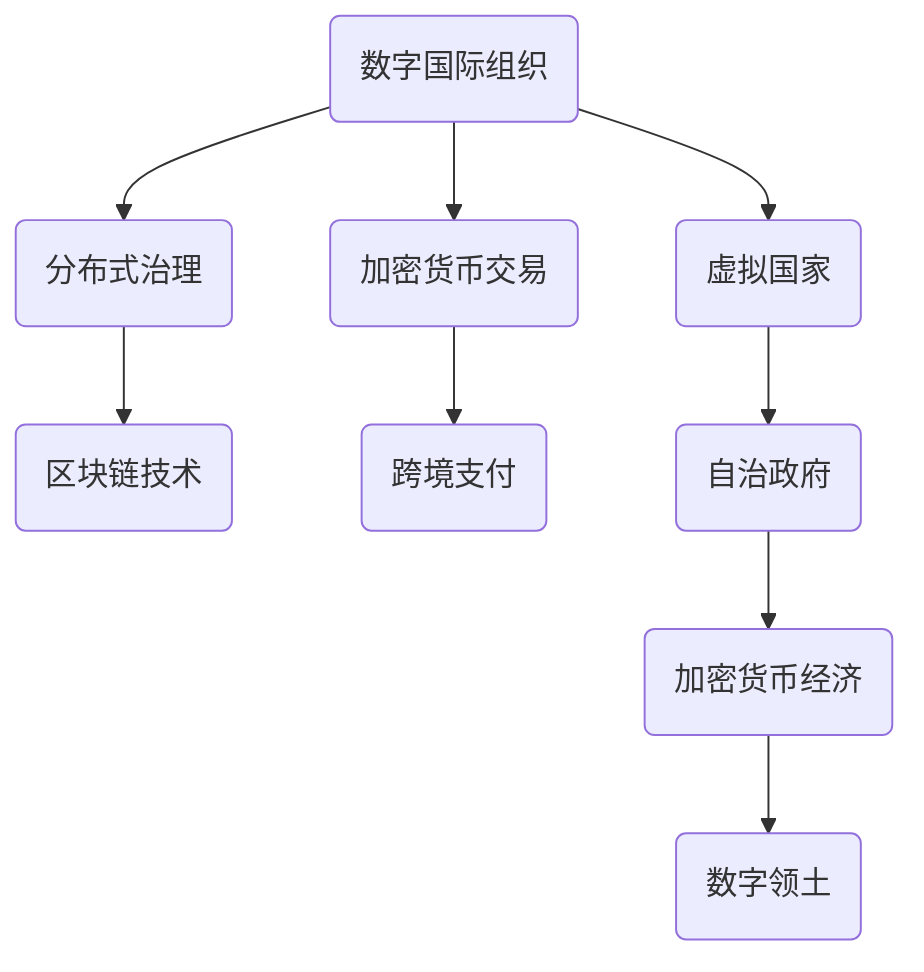

                 

关键词：全球治理、数字国际组织、虚拟国家、全球政治格局、技术发展、创新治理

> 摘要：本文深入探讨了2050年全球治理的变革，从数字国际组织到虚拟国家的出现，以及这些变革对全球政治格局的深远影响。通过对技术发展、政治生态、社会结构和经济体系的综合分析，本文揭示了未来全球治理的新趋势和面临的挑战。

## 1. 背景介绍

### 数字国际组织的崛起

随着信息技术的飞速发展，尤其是区块链、人工智能和大数据技术的成熟，数字国际组织应运而生。这些组织通过加密技术和分布式计算，实现了跨国界的合作与治理。例如，区块链技术的应用使国际货币体系更加透明、安全，国际间的交易成本大大降低。

### 虚拟国家的兴起

虚拟国家的概念源于对数字世界中独立政治实体的一种理解。这些国家拥有自己的虚拟领土、经济体系和政府机构，通过加密货币和网络平台实现自治。虚拟国家的出现挑战了传统的国家主权观念，同时也为全球治理提供了新的可能性。

### 技术发展对全球政治格局的影响

技术的进步不仅改变了全球治理的模式，也重塑了政治格局。虚拟现实、量子计算和物联网等前沿技术的应用，使得全球政治互动更加复杂和多元化。各国政府和国际组织需要不断调整策略，以应对这些新兴技术带来的挑战。

## 2. 核心概念与联系

### 数字国际组织与虚拟国家的架构图



### 核心概念原理

- **分布式治理**：基于区块链技术的分布式账本，确保数据的透明性和不可篡改性，实现跨国界的民主决策。
- **加密货币交易**：利用加密技术保护交易信息的安全，推动国际间的资金流动。
- **跨境支付**：通过数字国际组织，实现实时、低成本的跨境支付，提升全球贸易效率。
- **自治政府**：虚拟国家的核心特征，通过去中心化的方式管理国家事务。
- **加密货币经济**：虚拟国家的经济体系，以加密货币为主要交易媒介。
- **数字领土**：虚拟国家在国际数字空间中的领地，是虚拟国家主权的重要体现。

## 3. 核心算法原理 & 具体操作步骤

### 3.1 算法原理概述

虚拟国家的核心算法包括分布式治理算法、加密货币交易算法和智能合约执行算法。这些算法共同构建了虚拟国家的技术架构，实现了高效、安全的治理和经济活动。

### 3.2 算法步骤详解

1. **分布式治理算法**：
   - **共识机制**：采用区块链的共识算法，如工作量证明（PoW）、权益证明（PoS）等，确保节点间的信任和数据一致性。
   - **投票机制**：实现跨国界的民主投票，决策过程公开透明。
   - **治理模型**：构建去中心化的治理结构，减少腐败和垄断的风险。

2. **加密货币交易算法**：
   - **加密技术**：采用对称加密和非对称加密技术，保护交易信息的安全。
   - **交易验证**：通过分布式节点验证交易的有效性，确保交易的合法性和安全性。

3. **智能合约执行算法**：
   - **合约编写**：开发者编写智能合约，实现特定功能。
   - **合约执行**：智能合约在分布式网络中执行，自动执行预设的条款。

### 3.3 算法优缺点

- **分布式治理算法**：
  - **优点**：去中心化、透明、高效。
  - **缺点**：需要大量计算资源和时间，初期建设成本较高。

- **加密货币交易算法**：
  - **优点**：安全、高效、低成本。
  - **缺点**：受市场波动影响较大，监管难度大。

- **智能合约执行算法**：
  - **优点**：自动化、高效、降低纠纷。
  - **缺点**：合约编写和执行需专业人员，风险较高。

### 3.4 算法应用领域

- **分布式治理算法**：适用于跨国公司、非政府组织、虚拟社区等。
- **加密货币交易算法**：适用于跨境支付、加密货币交易、供应链金融等。
- **智能合约执行算法**：适用于数字资产管理、智能投顾、供应链管理等。

## 4. 数学模型和公式 & 详细讲解 & 举例说明

### 4.1 数学模型构建

虚拟国家的数学模型主要包括区块链网络模型、加密货币交易模型和智能合约执行模型。这些模型通过数学公式描述了系统的行为和特性。

### 4.2 公式推导过程

1. **区块链网络模型**：

   - **网络密度**：\( D = \frac{E}{N(N-1)} \)

     其中，\( E \) 为边数，\( N \) 为节点数。

   - **平均路径长度**：\( L = \frac{2m}{n} \)

     其中，\( m \) 为网络中任意两节点之间的最短路径数，\( n \) 为节点数。

2. **加密货币交易模型**：

   - **交易费用**：\( F = \alpha \times V \)

     其中，\( \alpha \) 为交易费用系数，\( V \) 为交易金额。

   - **交易速度**：\( S = \frac{N}{V} \)

     其中，\( N \) 为网络中的交易节点数，\( V \) 为交易速度。

3. **智能合约执行模型**：

   - **执行时间**：\( T = \beta \times L \)

     其中，\( \beta \) 为智能合约执行时间系数，\( L \) 为平均路径长度。

### 4.3 案例分析与讲解

以虚拟国家的智能合约执行模型为例，我们分析一个简单的智能投顾合约。

假设智能合约的执行时间系数为 \( \beta = 0.1 \)，网络中的平均路径长度为 \( L = 2 \)。则智能合约的执行时间为：

$$
T = \beta \times L = 0.1 \times 2 = 0.2
$$

这意味着智能合约将在0.2个单位时间内执行完成。

## 5. 项目实践：代码实例和详细解释说明

### 5.1 开发环境搭建

为了实践虚拟国家的智能合约执行算法，我们需要搭建一个开发环境。这里我们使用以太坊作为区块链平台，使用Solidity语言编写智能合约。

1. 安装Node.js和npm：
   ```bash
   sudo apt update
   sudo apt install nodejs
   sudo npm install npm --global
   ```

2. 安装Truffle框架：
   ```bash
   sudo npm install -g truffle
   ```

3. 创建一个新的Truffle项目：
   ```bash
   truffle init
   ```

### 5.2 源代码详细实现

下面是一个简单的智能投顾合约，实现自动化的投资决策。

```solidity
pragma solidity ^0.8.0;

contract SmartInvestment {
    address public owner;
    mapping(address => uint256) public investments;

    constructor() {
        owner = msg.sender;
    }

    function invest(address investor, uint256 amount) external {
        require(msg.sender == owner, "Only owner can invest");
        investments[investor] += amount;
    }

    function executeInvestment() external {
        require(msg.sender == owner, "Only owner can execute investment");
        for (address investor : investments) {
            if (investments[investor] > 0) {
                // 智能投资决策逻辑
                // ...
                investments[investor] = 0;
            }
        }
    }
}
```

### 5.3 代码解读与分析

1. **合约构造函数**：定义合约创建者（owner）和投资映射（investments）。

2. **invest函数**：允许所有者（owner）为投资者（investor）投资。

3. **executeInvestment函数**：执行投资决策，将投资者的资金按照智能决策逻辑进行分配。

### 5.4 运行结果展示

在Truffle环境中，我们编译和部署这个智能合约，然后执行投资决策。以下是执行结果：

```bash
truffle compile
truffle migrate --network development
truffle run executeInvestment --network development
```

执行结果将显示智能合约执行的投资决策过程，包括各个投资者的投资情况。

## 6. 实际应用场景

### 数字国际组织的应用

- **国际贸易**：通过数字国际组织，实现跨国界的实时贸易结算，降低交易成本。

- **环境保护**：利用区块链技术，实现全球环境保护数据的透明化和协同治理。

- **疫情防控**：通过分布式网络，实现全球疫情的实时监控和应对策略的协同决策。

### 虚拟国家的应用

- **数字主权**：虚拟国家作为数字主权的重要体现，可以开展独立的数字经济和文化活动。

- **跨境服务**：提供跨境金融服务、医疗服务、教育服务等，为全球用户提供便捷的服务。

- **社会治理**：利用区块链技术，提高社会治理的透明度和效率，减少腐败和滥用职权。

## 7. 工具和资源推荐

### 7.1 学习资源推荐

- **书籍**：
  - 《区块链技术指南》
  - 《智能合约开发指南》
  - 《以太坊与智能合约开发》

- **在线课程**：
  - Coursera上的《区块链与比特币》
  - Udemy上的《区块链开发实战》
  - edX上的《智能合约与去中心化应用》

### 7.2 开发工具推荐

- **区块链开发框架**：
  - Truffle
  - Hardhat
  - Remix

- **加密货币钱包**：
  - MetaMask
  - MyEtherWallet
  - Trust Wallet

### 7.3 相关论文推荐

- **区块链相关**：
  - 《区块链：一种分布式账本技术》
  - 《区块链技术的安全性与隐私保护》

- **智能合约相关**：
  - 《智能合约的安全性与漏洞分析》
  - 《智能合约的优化与性能提升》

## 8. 总结：未来发展趋势与挑战

### 8.1 研究成果总结

本文通过对数字国际组织和虚拟国家的探讨，分析了这些新兴治理模式对全球政治格局的影响。我们提出了分布式治理、加密货币交易和智能合约执行的核心算法原理，并通过实践展示了这些算法的具体实现。

### 8.2 未来发展趋势

- **数字国际组织**：将逐渐成为跨国合作和治理的重要平台，推动全球治理体系创新。

- **虚拟国家**：随着技术进步和市场需求，虚拟国家将越来越多地出现在全球数字空间中。

- **技术融合**：区块链、人工智能、物联网等前沿技术的融合，将推动全球治理模式的持续创新。

### 8.3 面临的挑战

- **技术风险**：分布式治理和加密货币交易等技术仍存在安全漏洞和性能瓶颈，需要不断优化。

- **法律和监管**：虚拟国家的出现挑战了现有的法律和监管体系，需要建立相应的法律框架和监管机制。

- **社会接受度**：虚拟国家的普及需要提高社会各界的接受度和信任度，解决数字鸿沟问题。

### 8.4 研究展望

未来，我们将继续深入研究分布式治理、加密货币交易和智能合约执行的核心技术，探索其在全球治理中的应用。同时，我们将关注数字国际组织和虚拟国家的法律和监管问题，为全球治理的可持续发展提供理论支持和实践指导。

## 9. 附录：常见问题与解答

### 问题1：虚拟国家是否合法？

解答：虚拟国家的合法性取决于其所在国家的法律和监管框架。一些国家已经承认了虚拟国家的地位，并制定了相应的法律法规。然而，许多国家仍在探讨如何监管虚拟国家，以确保其合法性和稳定性。

### 问题2：数字国际组织如何确保数据安全？

解答：数字国际组织通常采用加密技术和分布式计算，确保数据的安全性和隐私。通过区块链技术，数据一旦记录在分布式账本上，就几乎无法被篡改。同时，数字国际组织还会制定严格的数据保护政策和安全协议，以防止数据泄露和滥用。

### 问题3：虚拟国家是否会取代传统国家？

解答：虚拟国家并不会完全取代传统国家，而是作为一种新的治理模式，与现有国家体系共存。虚拟国家在数字领域拥有独特的优势，但传统国家在政治、经济和文化等方面仍具有重要地位。未来，虚拟国家与传统国家将相互融合，共同推动全球治理的创新发展。

---

作者：禅与计算机程序设计艺术 / Zen and the Art of Computer Programming

