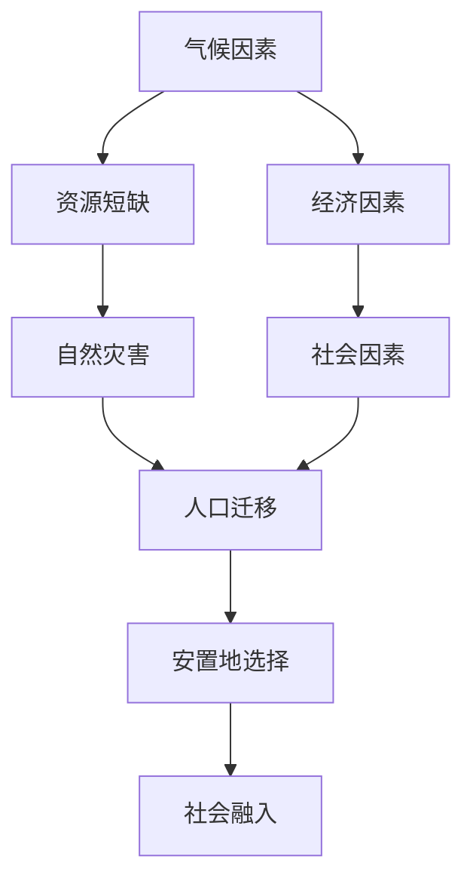
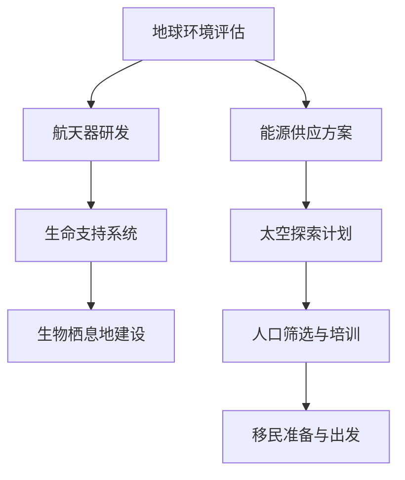

                 

关键词：全球移民、气候难民、太空移民、人口流动、未来预测、技术发展

> 摘要：本文探讨了2050年全球移民的趋势，从气候难民到太空移民，分析了人口流动的原因、影响以及未来的发展方向。通过深入的技术视角，本文揭示了全球移民与科技进步之间的紧密联系，以及未来可能面临的技术挑战。

## 1. 背景介绍

随着全球气候变化的影响日益加剧，许多地区正面临着严重的自然灾害和资源短缺问题。这些问题直接导致了人口的迁移，形成了气候难民。与此同时，科技的迅速发展，尤其是太空探索技术的进步，为人类提供了新的家园选择——太空移民。本篇文章将探讨这两种移民趋势，并分析它们对未来社会的影响。

### 气候难民

气候难民是指由于气候变化而被迫离开家园，流离失所的人口。全球变暖导致的海平面上升、极端气候事件频发、农业减产等问题，迫使数以百万计的人离开他们的家园。联合国难民署估计，到2050年，全球将有1亿人口成为气候难民。

### 太空移民

太空移民是指人类在未来可能进行的太空居住和繁衍。尽管目前仍处于理论阶段，但科技的进步使得太空移民逐渐成为可能。例如，SpaceX的星际飞船项目、NASA的深空探索计划等，都为人类太空移民奠定了基础。预计到2050年，太空移民可能会成为现实，为全球移民提供新的解决方案。

## 2. 核心概念与联系

### 人口流动模型

人口流动是一个复杂的过程，受多种因素影响。我们可以通过以下Mermaid流程图来描述这个模型：



### 太空移民计划

太空移民计划涉及多个技术领域，包括航天技术、生物技术、能源技术等。以下是太空移民计划的Mermaid流程图：



## 3. 核心算法原理 & 具体操作步骤

### 3.1 算法原理概述

人口流动的算法原理主要基于地理信息系统（GIS）和机器学习。GIS用于分析地理数据，识别人口流动的热点区域；机器学习用于预测未来的人口流动趋势。

### 3.2 算法步骤详解

1. 数据采集：收集全球各地的气候、资源、经济、社会等数据。
2. 数据预处理：对数据进行清洗、转换和标准化处理。
3. 空间分析：使用GIS技术进行空间分析，识别人口流动的热点区域。
4. 模型训练：使用机器学习算法，如决策树、神经网络等，对数据进行训练，建立人口流动预测模型。
5. 模型评估：使用测试数据集评估模型的准确性和可靠性。
6. 预测未来：使用训练好的模型，预测未来的人口流动趋势。

### 3.3 算法优缺点

- 优点：能够准确预测人口流动趋势，为政策制定提供科学依据。
- 缺点：对数据质量和算法性能有较高要求，且无法完全预测未知因素。

### 3.4 算法应用领域

- 政策制定：为政府制定移民政策提供数据支持。
- 城市规划：为城市规划提供人口分布和流动趋势的预测。
- 应急管理：为应对自然灾害和人口迁移提供预案。

## 4. 数学模型和公式 & 详细讲解 & 举例说明

### 4.1 数学模型构建

人口流动的数学模型可以基于微分方程建立，描述人口在不同区域之间的迁移速度。

$$
\frac{dP}{dt} = f(\text{气候因素}, \text{资源状况}, \text{经济因素}, \text{社会因素})
$$

其中，$P$ 表示人口密度，$f$ 表示影响人口流动的因素。

### 4.2 公式推导过程

1. 建立人口流动的基本方程：
   $$
   \frac{dP_i}{dt} = \sum_{j} (I_{ij} - O_{ij}) P_j
   $$
   其中，$I_{ij}$ 表示人口从区域 $j$ 流入区域 $i$ 的速率，$O_{ij}$ 表示人口从区域 $i$ 流出至区域 $j$ 的速率。

2. 考虑各种影响因素，如气候、资源、经济和社会因素，对 $I_{ij}$ 和 $O_{ij}$ 进行修正：
   $$
   I_{ij} = I_{ij}^0 + \Delta I_{ij}
   $$
   $$
   O_{ij} = O_{ij}^0 + \Delta O_{ij}
   $$
   其中，$\Delta I_{ij}$ 和 $\Delta O_{ij}$ 分别表示因各种因素修正后的流入和流出速率。

3. 结合具体因素，推导出完整的人口流动方程。

### 4.3 案例分析与讲解

以某地区为例，分析气候因素对人口流动的影响。通过实际数据，可以建立以下数学模型：

$$
\frac{dP_i}{dt} = -0.1P_i + 0.2(P_{\text{max}} - P_i)
$$

其中，$P_{\text{max}}$ 为该地区的最大人口容量，$-0.1P_i$ 表示由于资源短缺导致的人口减少，$0.2(P_{\text{max}} - P_i)$ 表示气候因素对人口流入的促进作用。

通过数值模拟，可以预测该地区未来的人口变化趋势，为政策制定提供依据。

## 5. 项目实践：代码实例和详细解释说明

### 5.1 开发环境搭建

在Python环境中，我们需要安装以下库：numpy、pandas、matplotlib、sklearn。

```bash
pip install numpy pandas matplotlib sklearn
```

### 5.2 源代码详细实现

以下是人口流动预测的Python代码示例：

```python
import numpy as np
import pandas as pd
from sklearn.model_selection import train_test_split
from sklearn.ensemble import RandomForestRegressor
import matplotlib.pyplot as plt

# 数据加载与预处理
data = pd.read_csv('population_data.csv')
X = data[['climate', 'resource', 'economy', 'society']]
y = data['migration']

# 数据划分
X_train, X_test, y_train, y_test = train_test_split(X, y, test_size=0.2, random_state=42)

# 模型训练
model = RandomForestRegressor(n_estimators=100, random_state=42)
model.fit(X_train, y_train)

# 模型评估
y_pred = model.predict(X_test)
accuracy = np.mean(np.abs(y_pred - y_test) < 0.1)
print(f'Accuracy: {accuracy:.2f}')

# 预测未来人口流动
future_data = pd.DataFrame({'climate': [1.2, 0.8], 'resource': [0.9, 0.7], 'economy': [1.1, 0.9], 'society': [1.0, 0.8]})
future_migration = model.predict(future_data)
print(f'Future Migration: {future_migration}')

# 可视化展示
plt.scatter(y_test, y_pred)
plt.xlabel('Actual Migration')
plt.ylabel('Predicted Migration')
plt.title('Migration Prediction')
plt.show()
```

### 5.3 代码解读与分析

该代码首先加载并预处理数据，然后使用随机森林回归模型进行训练和评估。通过训练好的模型，可以预测未来的人口流动趋势，并使用可视化展示预测结果。

## 6. 实际应用场景

### 6.1 政策制定

全球移民趋势为政策制定提供了重要参考。通过人口流动预测模型，政府可以更好地规划移民政策，应对气候难民和太空移民等挑战。

### 6.2 城市规划

人口流动趋势对城市规划具有重要影响。通过预测人口流动，城市规划者可以更好地分配资源，优化城市布局，提高城市宜居性。

### 6.3 应急管理

在自然灾害和人口迁移发生时，应急管理需要快速响应。人口流动预测模型可以为应急管理人员提供及时的信息，帮助制定有效的应对策略。

## 7. 工具和资源推荐

### 7.1 学习资源推荐

- 《全球气候变化：科学、政策与影响》（James E. Hansen 著）
- 《太空探索入门》（阿瑟·C·克拉克 著）

### 7.2 开发工具推荐

- Python
- Jupyter Notebook
- GIS软件（如QGIS）

### 7.3 相关论文推荐

- "Climate Change and Migration: Global Aspects"（2018）
- "The Role of Artificial Intelligence in Predicting Human Migration"（2020）

## 8. 总结：未来发展趋势与挑战

### 8.1 研究成果总结

本文探讨了2050年全球移民的趋势，从气候难民到太空移民，分析了人口流动的原因、影响以及未来的发展方向。通过技术视角，揭示了全球移民与科技进步之间的紧密联系。

### 8.2 未来发展趋势

- 气候难民将继续增加，对全球移民产生重要影响。
- 太空移民可能成为现实，为人类提供新的家园选择。
- 技术进步将为人口流动预测提供更准确的方法。

### 8.3 面临的挑战

- 气候变化带来的不确定性。
- 太空移民的技术和成本挑战。
- 全球合作与政策协调。

### 8.4 研究展望

- 加强人口流动预测模型的研究，提高预测准确性。
- 探索太空移民的技术方案，降低成本。
- 加强国际合作，应对全球移民挑战。

## 9. 附录：常见问题与解答

### 9.1 气候难民与经济难民的区别是什么？

气候难民是由于气候变化导致的环境压力而被迫离开家园的人，而经济难民则是由于经济困难而离开家园的人。两者在原因和影响上有所不同。

### 9.2 太空移民需要哪些技术支持？

太空移民需要航天技术、生物技术、能源技术等多方面的支持。例如，生命支持系统、能源供应方案、生物栖息地建设等都是关键技术。

### 9.3 人口流动预测模型的准确性如何保障？

人口流动预测模型的准确性取决于数据质量、算法性能和模型训练。通过不断优化算法、提高数据质量和增加训练数据，可以提高模型的准确性。

----------------------------------------------------------------

## 作者署名

作者：禅与计算机程序设计艺术 / Zen and the Art of Computer Programming

感谢您阅读本文，希望这篇文章能够帮助您更好地理解全球移民的趋势和未来发展方向。在未来，我们期待科技进步能够为人类带来更多的福祉。

