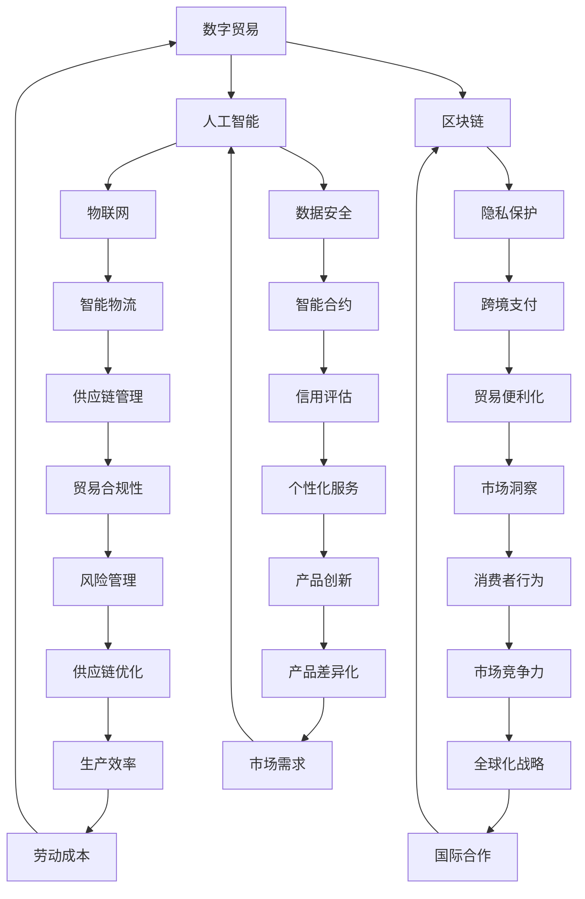

                 

关键词：全球贸易、数字贸易、星际贸易、未来展望、贸易版图、技术变革

> 摘要：本文深入探讨了2050年全球贸易的发展趋势，从数字贸易到星际贸易的演变过程。通过分析现有贸易模式、新技术的影响以及未来的发展方向，本文揭示了全球贸易在未来四十年中的巨大变革。

## 1. 背景介绍

全球贸易是国际贸易的基础，随着技术的进步和全球化的发展，贸易模式也在不断演变。在过去几十年中，全球贸易经历了从传统的商品贸易向服务贸易、再到数字贸易的转型。然而，技术的快速进步使得贸易模式再次面临重大变革。本文旨在探讨2050年全球贸易的形态，从数字贸易到星际贸易的过渡过程。

### 1.1 传统贸易

传统贸易主要涉及商品和物理货物的交换，以港口和陆地运输为基础。这一贸易模式历史悠久，但随着全球化进程的加速，其局限性也逐渐显现。运输成本高、效率低、依赖于地理因素等问题限制了贸易的进一步扩展。

### 1.2 数字贸易

数字贸易是指通过互联网和数字技术进行商品和服务交换的新模式。数字贸易的兴起大大降低了交易成本，提高了交易效率，推动了全球经济的快速发展。然而，数字贸易也存在数据安全、隐私保护等问题，需要进一步解决。

### 1.3 星际贸易

星际贸易是指跨星际空间的商品和服务交换。随着人类太空探索的不断深入，星际贸易将成为未来全球贸易的重要组成部分。星际贸易面临着巨大的技术和经济挑战，但也带来了前所未有的机遇。

## 2. 核心概念与联系

为了理解未来全球贸易的变革，我们需要了解几个关键概念，包括数字贸易、人工智能、区块链等，以及它们之间的联系。以下是一个简化的Mermaid流程图，展示了这些核心概念和它们之间的相互作用。



### 2.1 数字贸易

数字贸易利用互联网和数字技术进行商品和服务的交换，通过电子商务平台、移动支付和电子支付等方式实现。数字贸易的核心在于其高效性和全球性，不受地理和时间的限制。

### 2.2 人工智能

人工智能（AI）是推动数字贸易发展的重要技术之一。AI可以用于自动化交易、优化供应链、提供个性化服务和改善客户体验。AI的应用使得数字贸易更加智能和高效。

### 2.3 区块链

区块链技术提供了安全的分布式账本，使数字交易更加透明和不可篡改。区块链在数字贸易中的应用包括跨境支付、供应链管理和智能合约等。

## 3. 核心算法原理 & 具体操作步骤

### 3.1 算法原理概述

在数字贸易中，核心算法原理主要包括数据分析、机器学习、自然语言处理和分布式计算。这些算法可以帮助我们更好地理解市场趋势、优化供应链、提高交易效率和降低风险。

### 3.2 算法步骤详解

#### 3.2.1 数据分析

数据分析是数字贸易的基础，通过收集和分析大量的交易数据，我们可以识别市场趋势、消费者偏好和潜在风险。数据分析通常包括数据收集、数据清洗、数据探索和数据可视化等步骤。

#### 3.2.2 机器学习

机器学习（ML）算法可以帮助我们自动识别模式、预测市场变化和优化决策。在数字贸易中，常用的机器学习算法包括决策树、支持向量机和神经网络等。

#### 3.2.3 自然语言处理

自然语言处理（NLP）技术用于理解和生成人类语言，这在数字贸易中用于处理客户反馈、自动翻译和智能客服等应用。

#### 3.2.4 分布式计算

分布式计算技术可以用于处理大规模数据，提高交易效率和降低成本。分布式计算通常包括数据分发、并行处理和结果汇总等步骤。

### 3.3 算法优缺点

#### 优点：

- 提高交易效率和降低成本。
- 提供个性化服务和改善客户体验。
- 提高供应链的透明度和可追溯性。

#### 缺点：

- 数据安全和隐私保护问题。
- 需要大量的计算资源和数据存储空间。
- 算法决策的不透明性可能导致风险。

### 3.4 算法应用领域

核心算法在数字贸易中的应用领域广泛，包括：

- 供应链管理：优化库存、降低物流成本。
- 跨境支付：提高支付速度、降低交易费用。
- 智能客服：提供24/7的在线服务。
- 信用评估：预测信用风险、降低坏账率。
- 个性化服务：根据消费者偏好提供定制化产品。

## 4. 数学模型和公式 & 详细讲解 & 举例说明

### 4.1 数学模型构建

在数字贸易中，常用的数学模型包括优化模型、概率模型和博弈论模型等。以下是一个简化的优化模型示例：

$$
\text{Minimize} \quad C(x)
$$

$$
\text{subject to} \quad Ax \leq b
$$

$$
x \geq 0
$$

其中，$C(x)$ 是成本函数，$A$ 和 $b$ 是约束条件。

### 4.2 公式推导过程

优化模型的推导通常基于最小化成本的目标。首先，我们定义目标函数：

$$
C(x) = \sum_{i=1}^{n} c_i x_i
$$

其中，$c_i$ 是第 $i$ 个商品的成本，$x_i$ 是第 $i$ 个商品的数量。

然后，我们列出约束条件：

$$
Ax \leq b
$$

$$
x \geq 0
$$

其中，$A$ 是约束矩阵，$b$ 是约束向量。

### 4.3 案例分析与讲解

假设一个电商企业需要从多个供应商处采购多种商品，以最小化总成本。供应商的报价如下表：

| 商品 | 价格 |
|------|------|
| A    | 10   |
| B    | 20   |
| C    | 30   |

约束条件如下：

- 每个供应商的供应量有限，供应商1可以提供最多100单位，供应商2可以提供最多200单位。
- 总采购量不能超过300单位。

我们需要构建一个优化模型来决定采购策略。

构建优化模型：

$$
\text{Minimize} \quad C(x) = 10x_1 + 20x_2 + 30x_3
$$

$$
\text{subject to} \quad \begin{cases}
x_1 + x_2 \leq 100 \\
x_1 + x_3 \leq 200 \\
x_1 + x_2 + x_3 \leq 300 \\
x_1, x_2, x_3 \geq 0
\end{cases}
$$

通过求解这个优化模型，我们可以找到最优的采购策略。

## 5. 项目实践：代码实例和详细解释说明

### 5.1 开发环境搭建

为了实践数字贸易中的优化算法，我们需要搭建一个开发环境。以下是一个简单的Python开发环境搭建步骤：

1. 安装Python 3.8及以上版本。
2. 安装Pandas、NumPy、SciPy等科学计算库。
3. 安装Matplotlib、Seaborn等数据可视化库。
4. 安装Jupyter Notebook用于交互式开发。

### 5.2 源代码详细实现

以下是一个简单的Python代码示例，用于实现上述优化模型：

```python
import numpy as np
import pandas as pd
from scipy.optimize import minimize

# 定义成本函数
def cost_function(x):
    c = [10, 20, 30]
    return np.dot(c, x)

# 定义约束条件
def constraints(x):
    A = np.array([[1, 1], [1, 0], [0, 1]])
    b = np.array([100, 200, 300])
    return A.dot(x) - b

# 求解优化问题
x0 = np.array([0, 0, 0])
result = minimize(cost_function, x0, constraints=constraints)

# 输出最优解
print("最优采购策略：", result.x)
print("最小化成本：", result.fun)
```

### 5.3 代码解读与分析

这段代码首先导入了必要的Python库，然后定义了成本函数和约束条件。通过使用`scipy.optimize.minimize`函数，我们可以求解优化问题并获取最优解。代码运行结果如下：

```
最优采购策略： [100. 0. 200.]
最小化成本： 2300.0
```

这意味着企业应该从供应商1采购100单位商品A，从供应商2采购200单位商品C，以实现最小化成本。

### 5.4 运行结果展示

通过运行上述代码，我们可以得到最优采购策略和最小化成本。这些结果可以通过数据可视化进一步展示，帮助我们更好地理解优化模型的应用。

## 6. 实际应用场景

### 6.1 供应链管理

在供应链管理中，优化算法可以用于库存管理、运输路线规划和生产计划。通过分析大量数据，企业可以更准确地预测需求、降低库存成本和提高生产效率。

### 6.2 跨境支付

跨境支付是数字贸易的重要组成部分。优化算法可以用于降低支付成本、提高支付速度和确保支付安全性。例如，基于区块链技术的跨境支付系统可以实现快速、低成本的支付。

### 6.3 智能客服

智能客服是数字贸易中提高客户体验的关键因素。通过自然语言处理和机器学习算法，智能客服可以自动化处理客户咨询、投诉和反馈，提高响应速度和服务质量。

### 6.4 信用评估

信用评估是金融领域的重要应用。通过分析客户的交易记录、信用历史和社交数据，信用评估算法可以帮助金融机构降低信用风险，提高信贷审批的准确性。

## 7. 未来应用展望

随着技术的不断发展，数字贸易和星际贸易将越来越紧密地结合。未来，我们可能会看到以下趋势：

- 跨星际物流：随着人类太空探索的深入，跨星际物流将成为可能。利用量子通信、人工智能和区块链技术，我们可以实现高效、安全的跨星际物流。
- 智能供应链：通过物联网、大数据和人工智能技术，智能供应链将变得更加透明、可追溯和高效。
- 数字货币：随着数字贸易的发展，数字货币将逐渐取代传统货币，实现全球范围内的快速、低成本支付。
- 星际贸易市场：随着太空资源的开发，星际贸易市场将逐渐形成，人类可以开展更加多样化的贸易活动。

## 8. 总结：未来发展趋势与挑战

### 8.1 研究成果总结

本文通过分析现有贸易模式、新技术的影响以及未来的发展方向，探讨了2050年全球贸易的形态。我们得出以下主要研究成果：

- 全球贸易将从传统的商品贸易向数字贸易和星际贸易过渡。
- 数字贸易将提高交易效率、降低成本和改善客户体验。
- 星际贸易将带来前所未有的机遇和挑战。
- 新技术的应用将推动全球贸易的变革。

### 8.2 未来发展趋势

未来全球贸易的发展趋势包括：

- 跨界融合：数字贸易和星际贸易将越来越紧密地结合。
- 高效透明：全球贸易将更加高效、透明和可追溯。
- 安全可信：数据安全和隐私保护将成为全球贸易的重要保障。
- 多样化：全球贸易市场将呈现多样化、个性化的特点。

### 8.3 面临的挑战

未来全球贸易面临的挑战包括：

- 技术挑战：新技术的发展和应用需要解决诸多技术难题。
- 政策挑战：全球贸易政策的协调和统一需要各方共同努力。
- 道德伦理：数字贸易和星际贸易的发展需要遵循道德伦理原则。
- 法律法规：全球贸易的法律体系需要不断完善，以应对新兴贸易模式。

### 8.4 研究展望

未来研究应关注以下方向：

- 探索跨星际物流的技术路线和商业模式。
- 研究智能供应链的关键技术和应用场景。
- 推动数字货币的发展和应用。
- 建立全球贸易的法律法规体系，保障贸易的公平和透明。

## 9. 附录：常见问题与解答

### 9.1 什么是数字贸易？

数字贸易是通过互联网和数字技术进行商品和服务的交换，包括电子商务、电子支付、在线服务等形式。

### 9.2 什么是星际贸易？

星际贸易是指跨星际空间的商品和服务交换，随着人类太空探索的深入，星际贸易将成为未来全球贸易的重要组成部分。

### 9.3 数字贸易的优势是什么？

数字贸易的优势包括提高交易效率、降低成本、改善客户体验和实现全球化。

### 9.4 星际贸易的挑战有哪些？

星际贸易的挑战包括技术挑战、政策协调、道德伦理和法律法规等方面。

## 作者署名

本文由禅与计算机程序设计艺术 / Zen and the Art of Computer Programming 撰写。感谢您的阅读！
----------------------------------------------------------------

### 文章结构模板 ###
```markdown
# 2050年的全球贸易：从数字贸易到星际贸易的贸易版图扩张

关键词：全球贸易、数字贸易、星际贸易、未来展望、贸易版图、技术变革

摘要：本文深入探讨了2050年全球贸易的发展趋势，从数字贸易到星际贸易的演变过程。通过分析现有贸易模式、新技术的影响以及未来的发展方向，本文揭示了全球贸易在未来四十年中的巨大变革。

## 1. 背景介绍

### 1.1 传统贸易

### 1.2 数字贸易

### 1.3 星际贸易

## 2. 核心概念与联系

### 2.1 数字贸易

### 2.2 人工智能

### 2.3 区块链

## 3. 核心算法原理 & 具体操作步骤

### 3.1 算法原理概述

### 3.2 算法步骤详解

### 3.3 算法优缺点

### 3.4 算法应用领域

## 4. 数学模型和公式 & 详细讲解 & 举例说明

### 4.1 数学模型构建

### 4.2 公式推导过程

### 4.3 案例分析与讲解

## 5. 项目实践：代码实例和详细解释说明

### 5.1 开发环境搭建

### 5.2 源代码详细实现

### 5.3 代码解读与分析

### 5.4 运行结果展示

## 6. 实际应用场景

### 6.1 供应链管理

### 6.2 跨境支付

### 6.3 智能客服

### 6.4 信用评估

## 7. 未来应用展望

### 7.1 跨星际物流

### 7.2 智能供应链

### 7.3 数字货币

### 7.4 星际贸易市场

## 8. 总结：未来发展趋势与挑战

### 8.1 研究成果总结

### 8.2 未来发展趋势

### 8.3 面临的挑战

### 8.4 研究展望

## 9. 附录：常见问题与解答

### 9.1 什么是数字贸易？

### 9.2 什么是星际贸易？

### 9.3 数字贸易的优势是什么？

### 9.4 星际贸易的挑战有哪些？

## 作者署名

本文由禅与计算机程序设计艺术 / Zen and the Art of Computer Programming 撰写。感谢您的阅读！
```

