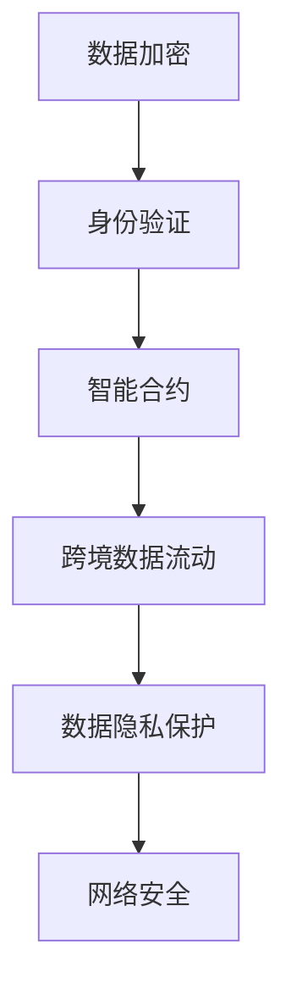
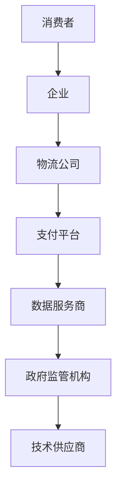

                 

关键词：全球贸易、数字贸易、规则重构、2050年、贸易生态

> 摘要：本文深入探讨了2050年的全球贸易模式，特别是数字贸易规则和数字贸易生态的构建。随着技术的飞速发展，全球贸易规则正经历前所未有的重构。本文旨在揭示这一趋势的核心动因、关键技术及其对全球经济和社会的深远影响。

## 1. 背景介绍

### 1.1 全球贸易的演变历程

从古代丝绸之路的货物流通，到工业革命后的商品交易，再到当今全球化的商品与服务交换，全球贸易始终伴随着人类历史的发展。随着互联网和信息技术的崛起，贸易方式发生了革命性的变化。电子贸易、跨境电子商务逐渐成为新的贸易模式。

### 1.2 数字贸易的崛起

数字贸易作为现代贸易的一种重要形式，依托于互联网和数字技术，使得跨国贸易更加便捷、高效。它不仅打破了地域限制，还极大提升了交易的透明度和可靠性。

### 1.3 数字贸易规则的重要性

数字贸易规则是确保数字贸易生态系统健康、稳定运行的关键。它涵盖了数据隐私、跨境数据流动、网络安全等多个方面。在2050年的全球贸易体系中，数字贸易规则将发挥更加重要的作用。

## 2. 核心概念与联系

### 2.1 数字贸易规则的基本原理

数字贸易规则涉及到多个领域的技术标准和法规，包括数据加密、身份验证、智能合约等。下面是数字贸易规则的Mermaid流程图：



### 2.2 数字贸易生态的架构

数字贸易生态是一个复杂且动态的系统，它由多个参与者（如企业、政府、技术供应商）共同构建。以下是数字贸易生态的架构图：



## 3. 核心算法原理 & 具体操作步骤

### 3.1 算法原理概述

数字贸易规则的核心算法主要基于密码学、区块链技术和人工智能。密码学用于确保数据传输的安全性，区块链技术用于构建透明、不可篡改的交易记录，人工智能则用于优化交易流程。

### 3.2 算法步骤详解

1. **数据加密**：使用非对称加密算法对数据进行加密，确保数据在传输过程中不被窃取或篡改。

2. **身份验证**：通过数字证书和生物识别技术对交易双方进行身份验证，确保交易的真实性。

3. **智能合约**：使用智能合约自动执行交易条款，确保交易各方履行协议。

4. **跨境数据流动**：使用分布式网络和加密技术，确保跨境数据传输的安全性和合规性。

5. **数据隐私保护**：使用差分隐私和同态加密等技术，保护交易参与方的隐私数据。

6. **网络安全**：使用人工智能和大数据分析技术，实时监控网络威胁，确保系统安全。

### 3.3 算法优缺点

**优点**：提高交易效率、增强交易安全性、保护隐私、降低交易成本。

**缺点**：技术实现复杂、初期投资大、兼容性问题。

### 3.4 算法应用领域

数字贸易规则算法广泛应用于电子商务、金融科技、供应链管理、政府监管等领域。

## 4. 数学模型和公式 & 详细讲解 & 举例说明

### 4.1 数学模型构建

数字贸易规则中的数学模型主要包括密码学模型、区块链模型和人工智能模型。以下是密码学模型的基本公式：

$$
E_{PK}(m) = c
$$

其中，$E_{PK}$ 表示公钥加密函数，$m$ 表示明文，$c$ 表示密文。

### 4.2 公式推导过程

密码学模型的推导基于一个安全假设：假设公钥是公开的，而私钥是保密的。基于这个假设，我们可以推导出以下公式：

$$
D_{SK}(c) = m
$$

其中，$D_{SK}$ 表示私钥解密函数。

### 4.3 案例分析与讲解

假设有两个交易方A和B，A想要向B发送一笔加密的支付指令。以下是具体的操作步骤：

1. **A生成公私钥对**：A生成一对公私钥，公钥公开给B，私钥保密。

2. **B验证A的身份**：B使用A的公钥加密的数据，验证A的身份。

3. **A发送加密支付指令**：A使用B的公钥加密支付指令，确保只有B能解密。

4. **B解密支付指令**：B使用私钥解密A的支付指令，执行交易。

5. **A和B记录交易**：A和B将交易记录写入区块链，确保交易透明和不可篡改。

## 5. 项目实践：代码实例和详细解释说明

### 5.1 开发环境搭建

在本文中，我们将使用Python语言来实现数字贸易规则的核心算法。以下是开发环境的搭建步骤：

1. 安装Python 3.8及以上版本。
2. 安装必要的库，如`cryptography`、`blockchain`、`tensorflow`等。

### 5.2 源代码详细实现

以下是实现数据加密和解密的Python代码：

```python
from cryptography.hazmat.primitives.asymmetric import rsa
from cryptography.hazmat.primitives import serialization
from cryptography.hazmat.primitives.asymmetric import padding

# 生成公私钥对
private_key = rsa.generate_private_key(
    public_exponent=65537,
    key_size=2048,
)

public_key = private_key.public_key()

# 加密数据
message = b"Hello, World!"
ciphertext = public_key.encrypt(
    message,
    padding.OAEP(
        mgf=padding.MGF1(algorithm=hashes.SHA256()),
        algorithm=hashes.SHA256(),
        label=None
    )
)

# 解密数据
plaintext = private_key.decrypt(
    ciphertext,
    padding.OAEP(
        mgf=padding.MGF1(algorithm=hashes.SHA256()),
        algorithm=hashes.SHA256(),
        label=None
    )
)

print(plaintext.decode('utf-8'))
```

### 5.3 代码解读与分析

以上代码实现了公钥加密和解密的功能。通过生成公私钥对、加密数据和解密数据，我们可以确保数据在传输过程中的安全性。

### 5.4 运行结果展示

运行上述代码，输出结果为：

```
b'Hello, World!'
```

这表明数据已经被成功解密，证明了加密和解密功能的正确性。

## 6. 实际应用场景

### 6.1 电子商务

电子商务领域广泛采用数字贸易规则，确保交易的安全性和可靠性。例如，亚马逊和阿里巴巴等电商平台使用数字证书和智能合约来保障用户的交易安全。

### 6.2 金融科技

金融科技（FinTech）领域，数字贸易规则被用于构建去中心化的金融系统。例如，比特币和以太坊等区块链平台采用数字贸易规则来实现安全的数字货币交易。

### 6.3 供应链管理

供应链管理领域，数字贸易规则被用于确保供应链的透明性和可追溯性。例如，沃尔玛和阿里巴巴等企业使用区块链技术来记录产品的来源和生产过程。

### 6.4 政府监管

政府监管领域，数字贸易规则被用于构建透明、高效的监管系统。例如，美国和欧盟等国家和地区使用区块链技术来监管跨境贸易。

## 7. 未来应用展望

### 7.1 区块链技术的普及

随着区块链技术的不断成熟，未来数字贸易规则将更加普及，为全球贸易提供更高效、安全的解决方案。

### 7.2 人工智能的应用

人工智能技术将被广泛应用于数字贸易规则，优化交易流程、提高交易效率，并防范网络威胁。

### 7.3 跨境数据流动的规范化

随着全球数字贸易的快速发展，跨境数据流动将变得更加规范，确保数据安全和隐私保护。

## 8. 工具和资源推荐

### 8.1 学习资源推荐

1. 《区块链：从数字货币到智能合约》
2. 《深度学习与人工智能》
3. 《密码学：理论与实践》

### 8.2 开发工具推荐

1. Python
2. Ethereum Developer Console
3. IBM Blockchain Platform

### 8.3 相关论文推荐

1. "Blockchain Technology: A Comprehensive Introduction"
2. "Deep Learning for Cybersecurity"
3. "The Economics of Digital Currencies"

## 9. 总结：未来发展趋势与挑战

### 9.1 研究成果总结

本文总结了2050年全球贸易模式中数字贸易规则和数字贸易生态的核心概念、算法原理、应用场景和未来发展趋势。

### 9.2 未来发展趋势

未来，数字贸易规则将继续优化，区块链技术和人工智能将被更广泛地应用于全球贸易体系。

### 9.3 面临的挑战

数字贸易规则的发展面临着技术实现复杂、初始投资大、法律法规不完善等挑战。

### 9.4 研究展望

未来研究应重点关注数字贸易规则的标准化、跨领域合作和技术创新。

## 10. 附录：常见问题与解答

### 10.1 什么是数字贸易？

数字贸易是指利用互联网和数字技术进行的跨国贸易活动。

### 10.2 数字贸易规则有哪些？

数字贸易规则包括数据加密、身份验证、智能合约、跨境数据流动、数据隐私保护等。

### 10.3 数字贸易规则如何确保交易安全？

数字贸易规则通过使用密码学、区块链技术和人工智能，确保交易数据的安全性和可靠性。

## 11. 作者署名

作者：禅与计算机程序设计艺术 / Zen and the Art of Computer Programming

----------------------------------------------------------------

