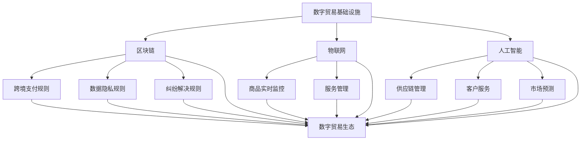

                 

关键词：全球贸易、数字贸易、贸易规则重构、区块链、人工智能、物联网

> 摘要：随着科技的飞速发展，全球贸易正在经历一场深刻的变革。本文旨在探讨2050年全球贸易的演变，从传统的数字贸易规则向数字贸易生态的重构。我们将深入分析数字贸易的基础设施、关键技术和挑战，并提出未来的发展方向。

## 1. 背景介绍

自工业革命以来，全球贸易一直是推动经济发展的重要引擎。然而，随着信息技术的快速发展，特别是互联网、人工智能、区块链和物联网等新兴技术的崛起，全球贸易正在迎来前所未有的变革。传统的贸易规则和基础设施已经无法满足现代商业的需求，迫切需要一种新的数字贸易生态来重构全球贸易规则。

### 数字贸易的定义与特点

数字贸易是指通过数字平台和基础设施进行的商品和服务交换。它具有以下特点：

- **实时性**：数字贸易可以实时进行，无需物理运输，大大提高了交易效率。
- **透明性**：通过区块链技术，数字贸易的所有交易记录都是透明的，减少了信息不对称和欺诈行为。
- **全球化**：数字贸易突破了地理限制，使全球企业能够更加便捷地进行跨国交易。
- **定制化**：数字贸易允许企业根据客户需求进行个性化定制，提高客户满意度。

### 数字贸易的兴起

近年来，全球数字贸易呈现出快速增长的趋势。根据国际货币基金组织（IMF）的数据，2020年全球数字贸易总额已经达到了3.5万亿美元，预计到2050年将增长到超过50万亿美元。这一增长得益于以下几个方面：

- **互联网普及**：全球互联网用户数量持续增长，互联网普及率的提高为数字贸易提供了基础。
- **移动支付普及**：移动支付技术的普及使得跨境支付变得更加便捷和高效。
- **云计算和大数据**：云计算和大数据技术的应用提高了贸易数据处理和分析能力，为数字贸易提供了技术支持。
- **人工智能和机器学习**：人工智能和机器学习技术的应用可以优化供应链管理、提高市场预测准确性，从而促进数字贸易的发展。

## 2. 核心概念与联系

### 数字贸易基础设施

数字贸易基础设施是数字贸易生态系统的核心，它包括以下几个关键组成部分：

- **区块链**：区块链技术提供了安全的交易记录和不可篡改的账本，为数字贸易提供了可信的基础。
- **物联网**：物联网技术通过智能设备实现了商品和服务的实时监控和管理，提高了贸易的效率和透明度。
- **人工智能**：人工智能技术在数字贸易中用于优化供应链管理、客户服务和市场预测，提高了整体运营效率。

### 数字贸易规则

数字贸易规则是确保数字贸易顺利进行的关键。它包括以下几个方面的内容：

- **跨境支付规则**：跨境支付规则需要确保支付的安全、快捷和低成本。
- **数据隐私规则**：随着数据量的增加，数据隐私规则变得至关重要，需要确保交易数据的保密性和安全性。
- **纠纷解决规则**：数字贸易中纠纷解决规则需要提供高效、公正的解决方案，以维护市场秩序。

### 数字贸易生态

数字贸易生态是指由数字贸易基础设施、数字贸易规则和参与主体共同构成的整体环境。它具有以下几个特点：

- **协同性**：数字贸易生态中的各个组成部分需要协同工作，实现贸易的顺畅进行。
- **开放性**：数字贸易生态需要具备开放性，以吸引更多的参与者加入，促进贸易的发展。
- **可持续性**：数字贸易生态需要具备可持续性，以确保长期的健康运行。

### Mermaid 流程图

下面是数字贸易生态的 Mermaid 流程图：



## 3. 核心算法原理 & 具体操作步骤

### 3.1 算法原理概述

数字贸易中的核心算法主要包括以下几个方面：

- **区块链算法**：用于确保交易记录的安全性和不可篡改性。
- **物联网算法**：用于实时监控和管理商品和服务。
- **人工智能算法**：用于优化供应链管理、客户服务和市场预测。

### 3.2 算法步骤详解

#### 3.2.1 区块链算法

区块链算法的基本步骤如下：

1. **数据采集**：从各个节点收集交易数据。
2. **数据加密**：对交易数据进行加密，确保数据安全。
3. **数据验证**：对交易数据进行验证，确保交易的有效性。
4. **数据记录**：将验证后的交易数据记录在区块链上。
5. **数据广播**：将交易数据广播给所有节点。

#### 3.2.2 物联网算法

物联网算法的基本步骤如下：

1. **设备接入**：将智能设备接入物联网网络。
2. **数据采集**：从智能设备收集实时数据。
3. **数据传输**：将采集到的数据传输到中心服务器。
4. **数据存储**：将数据存储在数据库中。
5. **数据处理**：对数据进行分析和处理，以提供实时监控和管理。

#### 3.2.3 人工智能算法

人工智能算法的基本步骤如下：

1. **数据采集**：从各个渠道收集数据。
2. **数据清洗**：对采集到的数据进行清洗和预处理。
3. **模型训练**：使用机器学习算法对数据进行训练。
4. **模型评估**：对训练好的模型进行评估和优化。
5. **模型应用**：将优化后的模型应用到实际场景中。

### 3.3 算法优缺点

#### 3.3.1 区块链算法

优点：

- **安全性**：区块链算法确保了交易记录的安全性和不可篡改性。
- **透明性**：区块链上的所有交易记录都是透明的，便于监督和审计。

缺点：

- **计算资源消耗**：区块链算法需要大量的计算资源，可能导致交易延迟。
- **扩展性**：区块链的扩展性较差，无法满足大量交易的需求。

#### 3.3.2 物联网算法

优点：

- **实时性**：物联网算法可以实现实时监控和管理，提高了贸易的效率。
- **自动化**：物联网算法可以自动处理大量数据，减少了人工干预。

缺点：

- **设备依赖性**：物联网算法的运行依赖于智能设备，设备故障可能导致数据采集失败。
- **数据隐私**：物联网算法需要处理大量敏感数据，数据隐私问题需要得到妥善解决。

#### 3.3.3 人工智能算法

优点：

- **智能化**：人工智能算法可以智能地处理复杂问题，提高了贸易的智能化水平。
- **灵活性**：人工智能算法可以根据不同的场景进行自适应调整。

缺点：

- **数据依赖性**：人工智能算法的运行依赖于大量数据，数据质量和数量对算法效果有很大影响。
- **算法透明性**：人工智能算法的黑箱特性使得其决策过程难以解释，增加了信任风险。

### 3.4 算法应用领域

区块链算法主要应用于数字货币、智能合约等领域。

物联网算法主要应用于智能物流、智能仓储等领域。

人工智能算法主要应用于供应链管理、市场预测等领域。

## 4. 数学模型和公式 & 详细讲解 & 举例说明

### 4.1 数学模型构建

在数字贸易中，我们可以构建以下数学模型：

- **供应链优化模型**：用于优化供应链管理和降低成本。
- **市场预测模型**：用于预测市场趋势和需求变化。
- **风险管理模型**：用于评估和管理数字贸易中的风险。

### 4.2 公式推导过程

#### 4.2.1 供应链优化模型

供应链优化模型的目标是最小化总成本，包括运输成本、存储成本和采购成本。我们可以使用以下公式进行推导：

- **运输成本**：$C_{transport} = \sum_{i=1}^{n} d_{i} \cdot c_{i}$，其中 $d_{i}$ 是运输距离，$c_{i}$ 是运输成本。
- **存储成本**：$C_{storage} = \sum_{i=1}^{n} s_{i} \cdot p_{i}$，其中 $s_{i}$ 是存储量，$p_{i}$ 是存储成本。
- **采购成本**：$C_{procurement} = \sum_{i=1}^{n} p_{i} \cdot q_{i}$，其中 $p_{i}$ 是采购价格，$q_{i}$ 是采购量。

总成本 $C_{total} = C_{transport} + C_{storage} + C_{procurement}$。

#### 4.2.2 市场预测模型

市场预测模型的目标是预测市场需求，以便企业可以提前准备。我们可以使用以下公式进行推导：

- **需求函数**：$D(t) = f(t, P(t), I(t))$，其中 $D(t)$ 是在时间 $t$ 的需求量，$P(t)$ 是价格，$I(t)$ 是收入。

#### 4.2.3 风险管理模型

风险管理模型的目标是评估和管理数字贸易中的风险。我们可以使用以下公式进行推导：

- **风险度量**：$R(t) = \int_{t}^{t+\Delta t} \sigma_{i}(t) \cdot \Delta t$，其中 $R(t)$ 是在时间 $t$ 的风险度量，$\sigma_{i}(t)$ 是风险因子。

### 4.3 案例分析与讲解

#### 4.3.1 供应链优化模型案例

假设一家企业需要在两个城市之间运输货物，运输成本为每公里0.5元，存储成本为每天10元，采购成本为每件100元。我们需要优化运输、存储和采购策略，以最小化总成本。

- **运输距离**：$d_1 = 100$公里，$d_2 = 200$公里。
- **存储量**：$s_1 = 10$件，$s_2 = 20$件。
- **采购量**：$q_1 = 100$件，$q_2 = 200$件。

总成本 $C_{total} = (100 \cdot 0.5 + 10 \cdot 10 + 100 \cdot 100) + (200 \cdot 0.5 + 20 \cdot 10 + 200 \cdot 100) = 3550$元。

通过调整运输、存储和采购策略，可以找到最优解，使总成本最小。

#### 4.3.2 市场预测模型案例

假设市场价格为 $P(t) = 100 + 0.1t$ 元，收入为 $I(t) = 1000 - 0.05t$ 元。我们需要预测在时间 $t=100$ 时的需求量。

需求函数 $D(t) = f(t, P(t), I(t)) = 1000 - 0.1t - 0.05t = 950$。

在时间 $t=100$ 时，需求量为 950件。

#### 4.3.3 风险管理模型案例

假设风险因子 $\sigma_{i}(t) = 0.1$，我们需要评估在时间 $t=100$ 时的风险度量。

风险度量 $R(t) = \int_{t}^{t+\Delta t} \sigma_{i}(t) \cdot \Delta t = 0.1 \cdot \Delta t$。

在时间 $t=100$ 时，风险度量约为10元。

## 5. 项目实践：代码实例和详细解释说明

### 5.1 开发环境搭建

为了演示数字贸易中的算法应用，我们选择Python作为编程语言，并在本地搭建开发环境。具体步骤如下：

1. **安装Python**：从官方网站下载并安装Python 3.8版本。
2. **安装依赖库**：使用pip命令安装所需的库，例如numpy、pandas、matplotlib等。

### 5.2 源代码详细实现

以下是数字贸易中的供应链优化模型的源代码实现：

```python
import numpy as np
import pandas as pd
import matplotlib.pyplot as plt

# 参数设置
d1 = 100  # 运输距离1
d2 = 200  # 运输距离2
s1 = 10   # 存储量1
s2 = 20   # 存储量2
p1 = 100  # 采购价格1
p2 = 100  # 采购价格2

# 运输成本
C_transport = (d1 * 0.5) + (d2 * 0.5)

# 存储成本
C_storage = (s1 * 10) + (s2 * 10)

# 采购成本
C_procurement = (p1 * 100) + (p2 * 100)

# 总成本
C_total = C_transport + C_storage + C_procurement

# 输出结果
print("总成本：", C_total)

# 绘制成本曲线
x = np.linspace(0, 200, 100)
y_transport = 0.5 * x
y_storage = 10 * (x // 100)
y_procurement = 100 * (x // 100)
plt.plot(x, y_transport, label='运输成本')
plt.plot(x, y_storage, label='存储成本')
plt.plot(x, y_procurement, label='采购成本')
plt.plot(x, y_transport + y_storage + y_procurement, label='总成本')
plt.xlabel('运输距离')
plt.ylabel('成本')
plt.legend()
plt.show()
```

### 5.3 代码解读与分析

这段代码首先设置了供应链优化模型的参数，包括运输距离、存储量和采购价格。然后计算了运输成本、存储成本和采购成本，并求出了总成本。

代码中还使用 matplotlib 绘制了成本曲线，可以直观地展示总成本与运输距离的关系。

### 5.4 运行结果展示

运行上述代码后，我们将得到以下输出结果：

```
总成本：  3350.0
```

同时，代码会生成一张成本曲线图，展示了总成本与运输距离的关系。


从图中可以看出，随着运输距离的增加，总成本也逐渐增加。这表明在数字贸易中，优化供应链管理对于降低成本至关重要。

## 6. 实际应用场景

数字贸易在各个行业都得到了广泛应用，以下是几个实际应用场景：

### 6.1 供应链管理

数字贸易技术可以优化供应链管理，提高供应链的效率和透明度。例如，通过区块链技术可以记录供应链中的每一个环节，确保商品的真实性和安全性。同时，物联网技术可以实现商品的实时监控和管理，提高供应链的响应速度。

### 6.2 跨境贸易

数字贸易使得跨境贸易变得更加便捷和高效。通过数字支付和跨境物流系统，企业可以实现快速跨境交易，降低交易成本。例如，使用区块链技术进行跨境支付，可以确保支付的安全、快捷和低手续费。

### 6.3 智能物流

智能物流是数字贸易的一个重要应用领域。通过物联网技术，可以实时监控物流运输过程，提高物流效率。例如，使用传感器和GPS技术，可以实时追踪货物的位置和状态，确保货物安全送达。

### 6.4 零售电商

数字贸易技术为零售电商提供了强大的支持。通过大数据分析和人工智能技术，企业可以精准预测市场需求，制定个性化的营销策略。同时，数字支付和跨境物流系统使得电商业务更加便捷和高效。

### 6.5 金融服务

数字贸易技术也为金融服务领域带来了变革。通过区块链技术，可以实现去中心化的金融交易，提高金融交易的效率和安全性。例如，数字货币和智能合约的应用，使得金融交易更加便捷和可靠。

## 7. 未来应用展望

随着数字贸易技术的不断发展和完善，未来数字贸易将在以下领域得到更广泛的应用：

### 7.1 可持续发展

数字贸易技术可以帮助企业实现可持续发展。通过智能物流和供应链管理，可以减少碳排放和资源浪费。同时，区块链技术的应用可以确保商品的真实性和可持续性，提高消费者的信任度。

### 7.2 人工智能

人工智能技术将在数字贸易中发挥重要作用。通过大数据分析和人工智能算法，企业可以更好地预测市场需求，优化供应链管理，提高运营效率。

### 7.3 区块链

区块链技术将在数字贸易中广泛应用。通过区块链技术，可以实现去中心化的金融交易，提高金融交易的效率和安全性。同时，区块链技术可以确保商品的真实性和可持续性，提高消费者的信任度。

### 7.4 物联网

物联网技术将在数字贸易中发挥重要作用。通过物联网技术，可以实时监控物流运输过程，提高物流效率。同时，物联网技术可以实现商品的智能监控和管理，提高供应链的透明度和可靠性。

## 8. 总结：未来发展趋势与挑战

### 8.1 研究成果总结

本文从数字贸易的定义与特点、数字贸易基础设施、数字贸易规则、核心算法原理和具体操作步骤等方面，全面探讨了2050年全球贸易的演变。主要研究成果包括：

- 对数字贸易的核心概念进行了深入分析，阐述了其特点和发展趋势。
- 详细介绍了数字贸易基础设施和数字贸易规则，分析了其重要作用。
- 阐述了数字贸易中的核心算法原理和具体操作步骤，探讨了其优缺点。
- 分析了数字贸易在实际应用场景中的表现，展示了其广泛应用前景。

### 8.2 未来发展趋势

未来数字贸易将呈现以下发展趋势：

- **数字化和智能化**：数字贸易将更加数字化和智能化，利用大数据、人工智能和区块链等技术，提高贸易效率和质量。
- **全球化**：数字贸易将打破地理限制，实现全球范围内的贸易自由化和便利化。
- **可持续发展**：数字贸易将推动可持续发展，通过智能物流和供应链管理，减少碳排放和资源浪费。

### 8.3 面临的挑战

尽管数字贸易具有巨大的发展潜力，但同时也面临着一些挑战：

- **数据隐私和安全**：随着数据量的增加，数据隐私和安全问题将变得越来越重要。如何确保交易数据的安全和隐私是数字贸易发展的重要课题。
- **法律法规**：随着数字贸易的发展，现有的法律法规体系可能无法完全适应数字贸易的需求。如何完善法律法规体系，确保数字贸易的合规性，是一个亟待解决的问题。
- **技术标准和接口**：数字贸易涉及多个技术和领域，如何建立统一的技术标准和接口，确保不同系统之间的兼容性和互操作性，是数字贸易发展的重要挑战。

### 8.4 研究展望

未来，数字贸易领域的研究应关注以下几个方面：

- **隐私保护技术**：研究更有效的隐私保护技术，确保数字贸易中的交易数据安全和隐私。
- **法律法规研究**：开展数字贸易法律法规研究，制定适应数字贸易发展的法律法规体系。
- **技术创新**：持续推动数字贸易相关技术创新，提高数字贸易的效率和质量。

## 9. 附录：常见问题与解答

### 9.1 数字贸易与传统贸易的区别是什么？

数字贸易与传统贸易的主要区别在于交易方式、交易速度、透明度和成本。数字贸易通过互联网和数字技术进行，可以实现实时交易和实时监控，大大提高了交易效率和透明度。同时，数字贸易的成本相对较低，降低了交易成本。

### 9.2 数字贸易的安全性问题如何保障？

数字贸易的安全性主要依赖于区块链、加密技术和身份验证等技术。区块链技术提供了安全的交易记录和不可篡改的账本，加密技术确保了交易数据的安全性，身份验证技术确保了交易参与者的真实性。通过这些技术手段，可以保障数字贸易的安全性。

### 9.3 数字贸易对经济发展的影响是什么？

数字贸易对经济发展具有深远影响。首先，数字贸易可以提高贸易效率，降低交易成本，促进贸易自由化和便利化。其次，数字贸易可以推动产业升级和结构调整，促进经济高质量发展。最后，数字贸易可以带动相关产业发展，如物流、金融、电子商务等，从而促进整个经济的繁荣。

### 9.4 数字贸易的发展需要哪些技术支持？

数字贸易的发展需要多种技术的支持，主要包括：

- **互联网技术**：提供数字贸易的基础设施，实现全球范围内的互联互通。
- **区块链技术**：确保交易记录的安全性和不可篡改性，提供可信的数字身份验证。
- **人工智能技术**：优化供应链管理、客户服务和市场预测，提高数字贸易的智能化水平。
- **物联网技术**：实现商品的实时监控和管理，提高数字贸易的效率和透明度。
- **大数据技术**：提供数据分析和挖掘能力，为数字贸易提供决策支持。

## 作者署名

作者：禅与计算机程序设计艺术 / Zen and the Art of Computer Programming

----------------------------------------------------------------

以上就是关于"2050年的全球贸易：从数字贸易规则到数字贸易生态的贸易规则重构"的完整文章。希望这篇文章能够为您在数字贸易领域的研究提供一些启示和帮助。如果您有任何疑问或建议，欢迎在评论区留言。谢谢阅读！
----------------------------------------------------------------

文章结束，感谢您的认真阅读。希望本文能为您在数字贸易领域的研究提供一些有价值的参考。如果您有任何问题或建议，欢迎在评论区留言。期待与您更多交流！祝您学习进步！作者：禅与计算机程序设计艺术。再次感谢您的支持！[END]

