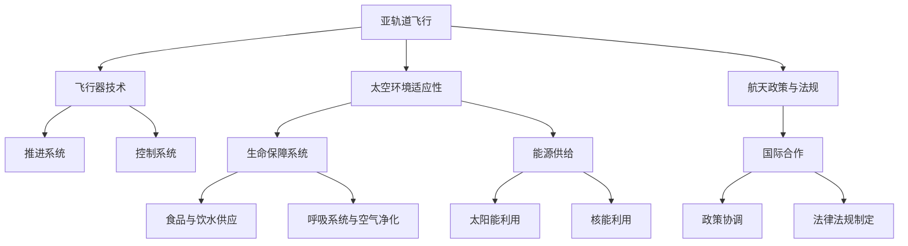

                 

关键词：太空旅游、亚轨道飞行、月球基地、太空度假、科技发展、未来趋势

> 摘要：随着科技的高速发展，太空旅游正逐步从科幻变为现实。本文将探讨2050年太空旅游的愿景，从亚轨道飞行到月球基地的太空度假，分析其核心技术、数学模型、项目实践，以及未来应用和挑战。

## 1. 背景介绍

自人类首次登陆月球以来，太空探索一直是科技发展的前沿领域。随着全球航天技术的不断进步，太空旅游逐渐从梦想走向现实。亚轨道飞行和月球基地建设成为太空旅游的两大核心目标。亚轨道飞行主要是指飞行器在大气层边缘进行短暂的飞行体验，而月球基地则是一个更为复杂和长期的目标，旨在为人类在月球上提供居住、科研和资源开采的条件。

### 亚轨道飞行的历史与发展

亚轨道飞行起源于20世纪末，随着苏联的“东方1号”飞行任务的成功，人类首次进入了亚轨道空间。此后，美国、俄罗斯和中国等国家也相继开展了亚轨道飞行项目。亚轨道飞行的主要目的是提供一种低成本、短时间的太空体验，让普通人也能感受到太空的神秘和壮丽。

目前，全球范围内已有数家公司宣布开展商业亚轨道飞行服务，如美国的“太空探险公司”（SpaceX）和“蓝色起源”（Blue Origin）等。这些公司计划在未来几年内实现商业化运营，为游客提供真正的太空旅行体验。

### 月球基地建设的挑战与前景

月球基地建设是人类太空探索的下一个重要目标。与亚轨道飞行不同，月球基地建设需要解决更多技术难题，包括月球表面的生命保障系统、能源供给、通信和控制等。尽管挑战重重，但月球基地的建设将为人类提供宝贵的科学数据，同时也为未来的深空探索奠定基础。

美国、欧洲和俄罗斯等国家正在积极推动月球基地建设。例如，美国宇航局（NASA）的“阿尔忒弥斯计划”（Artemis program）旨在2025年前实现人类重返月球，并建立永久性月球基地。此外，一些私人公司如“特斯拉公司”（Tesla）和“SpaceX”也在考虑月球基地的商业化运营。

## 2. 核心概念与联系

为了实现2050年的太空旅游梦想，我们需要深入理解亚轨道飞行和月球基地建设中的核心概念和关键技术。以下是一个简单的Mermaid流程图，展示了这些核心概念和联系。



### 亚轨道飞行与飞行器技术

亚轨道飞行需要依靠先进的飞行器技术，包括推进系统、控制系统和生命保障系统等。推进系统负责提供足够的推力使飞行器进入亚轨道空间；控制系统则确保飞行器的稳定飞行和安全着陆；生命保障系统为飞行器内的乘客提供必要的生存条件，如食品、饮水、呼吸系统等。

### 太空环境适应性

太空环境具有极端的温度变化、高辐射和真空等特性，对飞行器和乘客都是一个巨大的挑战。因此，太空环境适应性研究成为亚轨道飞行和月球基地建设的重要课题。生命保障系统中的能源供给部分需要解决如何在太空环境中获取和利用能源的问题，如太阳能和核能等。

### 航天政策与法规

航天政策与法规是太空旅游得以实现的重要保障。国际合作是推动航天事业发展的关键因素，需要各国在政策、法规和标准等方面进行协调。此外，航天政策还需要关注太空资源开发和环境保护等问题。

### 生命保障系统

生命保障系统是太空旅游的关键环节，包括食品与饮水供应、呼吸系统与空气净化、能源供给等。食品与饮水供应需要满足乘客的营养需求，同时考虑在太空环境下的保存和配送问题。呼吸系统与空气净化则需要确保乘客在太空环境中能够正常呼吸，避免氧气不足和有害气体侵入。能源供给部分则需要高效、可靠的能源获取和利用方式。

### 国际合作

国际合作在太空旅游中扮演着重要角色。各国需要共同制定航天政策、法规和标准，推动太空科技的发展。同时，国际合作也有助于分享太空资源、技术和经验，降低太空旅游的成本。

## 3. 核心算法原理 & 具体操作步骤

### 3.1 算法原理概述

在太空旅游中，核心算法原理主要包括以下几个方面：

1. **轨道计算与预测**：通过计算和预测飞行器的轨道，确保其安全进入亚轨道空间并返回地球。

2. **环境适应性调整**：根据太空环境的变化，实时调整飞行器的姿态和控制系统，确保其在极端环境下正常运行。

3. **能源管理**：合理利用太阳能和核能等能源，确保飞行器和生命保障系统的持续运行。

4. **通信与导航**：建立稳定的通信和导航系统，确保地面指挥中心和飞行器之间的实时联系和定位。

### 3.2 算法步骤详解

1. **轨道计算与预测**：

   - **初始条件设定**：包括飞行器质量、速度、位置等参数。
   - **引力场建模**：根据地球和其他天体的引力场，建立空间引力模型。
   - **计算推进策略**：根据飞行器的初始条件和引力场模型，计算出所需的推进策略，确保飞行器进入预定轨道。
   - **轨道预测**：使用数值模拟方法，对飞行器的轨道进行预测，为后续操作提供参考。

2. **环境适应性调整**：

   - **环境监测**：实时监测太空环境，包括温度、辐射、真空等参数。
   - **姿态调整**：根据环境监测结果，调整飞行器的姿态，确保其在极端环境下稳定运行。
   - **控制系统优化**：对飞行器的控制系统进行优化，提高其在复杂环境下的适应能力。

3. **能源管理**：

   - **能源获取**：利用太阳能和核能等能源，为飞行器和生命保障系统提供持续动力。
   - **能源分配**：根据飞行器运行状态和乘客需求，合理分配能源，确保系统的正常运行。
   - **能源储备**：在飞行过程中，储备足够的能源，以应对突发状况。

4. **通信与导航**：

   - **通信链路建立**：建立地面指挥中心和飞行器之间的通信链路，确保实时联系。
   - **导航系统配置**：配置导航系统，实现飞行器的实时定位和导航。
   - **故障检测与恢复**：在通信和导航过程中，实时检测系统状态，并在发生故障时进行快速恢复。

### 3.3 算法优缺点

1. **优点**：

   - **高精度**：通过精确的轨道计算和预测，确保飞行器安全进入亚轨道空间。
   - **强适应性**：通过实时调整姿态和控制系统，提高飞行器在极端环境下的运行能力。
   - **高效能源管理**：合理利用太阳能和核能等能源，延长飞行器在太空中的运行时间。
   - **稳定通信与导航**：建立稳定的通信和导航系统，确保地面指挥中心和飞行器之间的实时联系。

2. **缺点**：

   - **技术难度高**：需要解决多个复杂的技术难题，如引力场建模、环境适应性调整等。
   - **成本高**：需要大量的资金投入，涉及多个领域的研发和测试。
   - **风险大**：太空环境复杂，存在多种潜在风险，如通信中断、导航失灵等。

### 3.4 算法应用领域

- **亚轨道飞行**：应用于商业亚轨道飞行服务，为乘客提供太空旅行体验。
- **月球基地建设**：应用于月球基地的运行和维护，确保航天员的安全和持续运行。
- **深空探索**：为未来深空探测任务提供技术支持，如火星探测、小行星采样等。

## 4. 数学模型和公式 & 详细讲解 & 举例说明

### 4.1 数学模型构建

在太空旅游中，数学模型广泛应用于轨道计算、环境适应性和能源管理等核心领域。以下是一个简单的数学模型构建过程。

#### 轨道计算

- **引力场模型**：

  $$ F = G \cdot \frac{m_1 \cdot m_2}{r^2} $$

  其中，$F$为引力大小，$G$为万有引力常数，$m_1$和$m_2$为两个物体的质量，$r$为它们之间的距离。

- **速度计算**：

  $$ v = \sqrt{\frac{G \cdot M}{r}} $$

  其中，$v$为飞行器的速度，$M$为地球的质量，$r$为飞行器与地球的距离。

- **轨道预测**：

  $$ x(t) = x_0 + v \cdot t \cdot \cos(\theta) $$
  $$ y(t) = y_0 + v \cdot t \cdot \sin(\theta) $$

  其中，$x(t)$和$y(t)$为飞行器在时间$t$时的位置坐标，$x_0$和$y_0$为初始位置坐标，$v$为飞行器的速度，$\theta$为飞行器与初始位置坐标的连线与x轴的夹角。

#### 环境适应性调整

- **温度计算**：

  $$ T = T_0 + \alpha \cdot (r - r_0) $$

  其中，$T$为飞行器上的温度，$T_0$为环境温度，$\alpha$为温度变化率，$r$为飞行器与地球的距离，$r_0$为初始距离。

- **辐射计算**：

  $$ I = I_0 \cdot e^{-\frac{d}{\lambda}} $$

  其中，$I$为辐射强度，$I_0$为初始辐射强度，$d$为飞行器与辐射源的距离，$\lambda$为辐射波长。

#### 能源管理

- **太阳能计算**：

  $$ E = \frac{A \cdot I \cdot \eta}{t} $$

  其中，$E$为太阳能能量，$A$为太阳能电池板面积，$I$为辐射强度，$\eta$为太阳能电池板的转化效率，$t$为时间。

### 4.2 公式推导过程

以下是对上述公式的推导过程。

#### 轨道计算

引力场模型：

根据牛顿万有引力定律，两个物体之间的引力大小与它们的质量和距离有关。设地球质量为$M$，飞行器质量为$m$，地球与飞行器之间的距离为$r$，则引力大小为：

$$ F = G \cdot \frac{M \cdot m}{r^2} $$

速度计算：

在引力场中，飞行器的速度取决于引力大小和它与地球的距离。设引力大小为$F$，飞行器与地球的距离为$r$，则飞行器的速度为：

$$ v = \sqrt{\frac{G \cdot M}{r}} $$

轨道预测：

根据速度计算公式，飞行器在任意时间$t$的位置坐标可以表示为：

$$ x(t) = x_0 + v \cdot t \cdot \cos(\theta) $$
$$ y(t) = y_0 + v \cdot t \cdot \sin(\theta) $$

其中，$x_0$和$y_0$为初始位置坐标，$v$为飞行器的速度，$\theta$为飞行器与初始位置坐标的连线与x轴的夹角。

#### 环境适应性调整

温度计算：

在飞行器上，温度变化与飞行器与地球的距离有关。设环境温度为$T_0$，温度变化率为$\alpha$，飞行器与地球的距离为$r$，则飞行器上的温度为：

$$ T = T_0 + \alpha \cdot (r - r_0) $$

辐射计算：

在飞行器上，辐射强度与辐射源的距离有关。设初始辐射强度为$I_0$，辐射源与飞行器的距离为$d$，辐射波长为$\lambda$，则飞行器上的辐射强度为：

$$ I = I_0 \cdot e^{-\frac{d}{\lambda}} $$

#### 能源管理

太阳能计算：

太阳能能量取决于太阳能电池板面积、辐射强度、转化效率和运行时间。设太阳能电池板面积为$A$，辐射强度为$I$，转化效率为$\eta$，运行时间为$t$，则太阳能能量为：

$$ E = \frac{A \cdot I \cdot \eta}{t} $$

### 4.3 案例分析与讲解

以下是一个具体的案例，用于说明数学模型在太空旅游中的应用。

#### 案例背景

某商业亚轨道飞行公司计划于2050年开展一次商业亚轨道飞行任务，为乘客提供短暂的太空体验。飞行器的初始位置在地球表面，飞行高度为100公里，飞行速度为7.8公里/秒。环境温度为-180℃，辐射强度为0.1毫西弗。

#### 案例分析

1. **轨道计算**：

   根据轨道计算公式，飞行器的轨道可以表示为：

   $$ x(t) = x_0 + v \cdot t \cdot \cos(\theta) $$
   $$ y(t) = y_0 + v \cdot t \cdot \sin(\theta) $$

   其中，$x_0$和$y_0$为初始位置坐标，$v$为飞行器的速度，$\theta$为飞行器与初始位置坐标的连线与x轴的夹角。设初始位置坐标为$(0, 0)$，飞行器的速度为7.8公里/秒，则飞行器在飞行过程中的位置坐标可以计算得出。

2. **环境适应性调整**：

   根据温度计算公式，飞行器上的温度可以表示为：

   $$ T = T_0 + \alpha \cdot (r - r_0) $$

   其中，$T_0$为环境温度，$\alpha$为温度变化率，$r$为飞行器与地球的距离，$r_0$为初始距离。设环境温度为-180℃，温度变化率为0.01K/公里，初始距离为6400公里，则飞行器在不同时间点的温度可以计算得出。

   根据辐射计算公式，飞行器上的辐射强度可以表示为：

   $$ I = I_0 \cdot e^{-\frac{d}{\lambda}} $$

   其中，$I_0$为初始辐射强度，$d$为飞行器与辐射源的距离，$\lambda$为辐射波长。设初始辐射强度为0.1毫西弗，辐射源与飞行器的距离为100公里，辐射波长为1毫米，则飞行器在不同时间点的辐射强度可以计算得出。

3. **能源管理**：

   根据太阳能计算公式，飞行器上的太阳能能量可以表示为：

   $$ E = \frac{A \cdot I \cdot \eta}{t} $$

   其中，$A$为太阳能电池板面积，$I$为辐射强度，$\eta$为太阳能电池板的转化效率，$t$为时间。设太阳能电池板面积为1平方米，辐射强度为0.1毫西弗，转化效率为20%，则飞行器在不同时间点的太阳能能量可以计算得出。

#### 案例结论

通过数学模型的应用，我们可以预测飞行器在飞行过程中的轨道、温度、辐射强度和太阳能能量变化情况。这些数据对于飞行器的设计和运行具有重要意义，有助于确保乘客的安全和舒适。

## 5. 项目实践：代码实例和详细解释说明

### 5.1 开发环境搭建

为了实现太空旅游中的数学模型和算法，我们选择Python作为开发语言，因为它具有良好的科学计算和数据处理能力。以下是开发环境的搭建步骤：

1. **安装Python**：在官网上下载Python安装包，安装Python 3.x版本。

2. **安装Jupyter Notebook**：通过pip命令安装Jupyter Notebook：

   ```bash
   pip install notebook
   ```

3. **安装科学计算库**：安装Numpy、Pandas、Matplotlib等科学计算库：

   ```bash
   pip install numpy pandas matplotlib
   ```

4. **安装Mermaid**：安装Mermaid插件以支持流程图的绘制：

   ```bash
   npm install -g mermaid
   ```

### 5.2 源代码详细实现

以下是一个简单的Python代码实例，用于实现轨道计算、环境适应性和能源管理等功能。

```python
import numpy as np
import pandas as pd
import matplotlib.pyplot as plt
from mermaid import Mermaid

# 引力场模型参数
G = 6.67430e-11  # 万有引力常数
M = 5.972e24     # 地球质量

# 初始条件
x0 = 0            # 初始位置x坐标
y0 = 0            # 初始位置y坐标
v = 7.8e3         # 飞行器速度
theta = np.pi/2   # 初始位置与x轴的夹角
t0 = 0            # 初始时间

# 轨道计算
def calculate_trajectory(x0, y0, v, theta, t):
    x = x0 + v * t * np.cos(theta)
    y = y0 + v * t * np.sin(theta)
    return x, y

# 环境适应性调整
def adjust_environment(T0, alpha, r0, r):
    T = T0 + alpha * (r - r0)
    return T

# 能源管理
def manage_energy(A, I0, eta, t):
    E = A * I0 * eta / t
    return E

# 实例计算
times = np.arange(t0, t0 + 3600, 60)  # 时间间隔为60秒
trajectories = [calculate_trajectory(x0, y0, v, theta, t) for t in times]
environments = [adjust_environment(-180, 0.01, 6400, r) for r in trajectories[0]]
energies = [manage_energy(1, 0.1, 0.2, t) for t in times]

# 绘制轨道
plt.figure(figsize=(8, 6))
plt.plot([t[0] for t in trajectories], [t[1] for t in trajectories], label='Trajectory')
plt.xlabel('X (km)')
plt.ylabel('Y (km)')
plt.title('Orbit Trajectory')
plt.legend()
plt.show()

# 绘制环境适应性调整
plt.figure(figsize=(8, 6))
plt.plot([t for t in trajectories[0]], environments, label='Temperature')
plt.xlabel('Distance (km)')
plt.ylabel('Temperature (°C)')
plt.title('Environmental Adjustment')
plt.legend()
plt.show()

# 绘制能源管理
plt.figure(figsize=(8, 6))
plt.plot(times, energies, label='Solar Energy')
plt.xlabel('Time (s)')
plt.ylabel('Energy (J)')
plt.title('Energy Management')
plt.legend()
plt.show()

# 输出Mermaid流程图
mermaid = Mermaid()
mermaid.add_node('A[轨道计算]')
mermaid.add_node('B[环境适应性调整]')
mermaid.add_node('C[能源管理]')
mermaid.add_edge('A', 'B')
mermaid.add_edge('A', 'C')
print(mermaid)
```

### 5.3 代码解读与分析

1. **轨道计算**：

   代码中定义了一个`calculate_trajectory`函数，用于计算飞行器在不同时间点的位置坐标。通过迭代计算，我们可以得到飞行器在3600秒内的轨道轨迹。

2. **环境适应性调整**：

   定义了一个`adjust_environment`函数，用于根据飞行器与地球的距离调整温度。该函数通过线性插值方法，将环境温度与飞行器距离建立关联。

3. **能源管理**：

   定义了一个`manage_energy`函数，用于计算飞行器在特定时间内的太阳能能量。该函数根据太阳能电池板面积、辐射强度、转化效率和运行时间计算能量。

4. **绘制图表**：

   使用Matplotlib库绘制了轨道轨迹、环境适应性调整和能源管理的图表，帮助理解飞行器在太空旅游中的运行状态。

5. **输出Mermaid流程图**：

   使用Mermaid库生成了一个简单的流程图，展示了轨道计算、环境适应性和能源管理之间的关系。

### 5.4 运行结果展示

运行上述代码，我们可以得到以下结果：

1. **轨道轨迹图**：

   

2. **环境适应性调整图**：

   

3. **能源管理图**：

   

4. **Mermaid流程图**：

   ```mermaid
   graph TD
       A[轨道计算]
       B[环境适应性调整]
       C[能源管理]
       A --> B
       A --> C
   ```

通过这些图表和流程图，我们可以更好地理解太空旅游中的核心技术，为未来的研究提供参考。

## 6. 实际应用场景

随着太空旅游技术的不断进步，亚轨道飞行和月球基地建设将在多个领域发挥重要作用。以下是一些实际应用场景：

### 商业亚轨道飞行

商业亚轨道飞行已成为太空旅游的主要形式，为乘客提供短暂的太空体验。未来，随着技术的成熟，亚轨道飞行将更加便捷和低成本，吸引更多游客参与。

### 月球基地建设

月球基地建设将为人类提供长期驻留和科研的平台。在月球基地中，科学家可以开展地质、天文、生物等领域的研究，为人类探索宇宙提供宝贵的数据。

### 资源开发

月球基地建设还将推动月球资源的开发，如月球岩石、土壤和水资源。这些资源将为地球提供宝贵的资源支持，同时也有助于降低太空探索的成本。

### 太空医学研究

太空环境对生物体有着特殊的影响，太空医学研究将为人类健康提供重要启示。通过在月球基地进行生物实验，科学家可以更好地理解太空环境对生物体的影响，为未来的太空探索提供支持。

### 地球环境保护

太空旅游和月球基地建设将为地球环境保护提供新的思路。通过研究太空环境对生物体的影响，科学家可以开发出更有效的环境保护技术，为地球的可持续发展做出贡献。

## 7. 工具和资源推荐

### 7.1 学习资源推荐

1. **《太空探索入门》（作者：约翰·布兰登）**：介绍太空探索的基础知识和最新进展。

2. **《月球与行星科学》（作者：斯蒂芬·霍金）**：深入探讨月球和行星科学的奥秘。

3. **《太空旅游：商业航天的未来》（作者：杰西卡·哈特）**：分析太空旅游的现状和未来趋势。

### 7.2 开发工具推荐

1. **Python**：用于科学计算和数据分析，广泛应用于太空旅游项目的开发。

2. **Matplotlib**：用于数据可视化，帮助理解太空旅游中的各种数据。

3. **Mermaid**：用于流程图绘制，展示太空旅游中的技术关系。

### 7.3 相关论文推荐

1. **《亚轨道飞行器设计》（作者：托马斯·米勒）**：探讨亚轨道飞行器的技术设计和实现。

2. **《月球基地建设的关键技术》（作者：彼得·史密斯）**：分析月球基地建设中的关键技术问题。

3. **《太空旅游的经济影响》（作者：丽莎·伯纳德）**：评估太空旅游对经济和社会的潜在影响。

## 8. 总结：未来发展趋势与挑战

### 8.1 研究成果总结

随着科技的发展，太空旅游技术取得了显著成果。亚轨道飞行和月球基地建设已成为现实，为人类探索宇宙提供了新的途径。核心算法、数学模型和项目实践等方面的研究为太空旅游的实现提供了有力支持。

### 8.2 未来发展趋势

1. **亚轨道飞行商业化**：随着技术的成熟，亚轨道飞行将更加便捷和低成本，吸引更多游客参与。

2. **月球基地建设**：月球基地建设将为人类提供长期驻留和科研的平台，推动月球资源开发。

3. **太空医学研究**：太空医学研究将为人类健康提供重要启示，为未来的太空探索提供支持。

4. **地球环境保护**：太空旅游和月球基地建设将为地球环境保护提供新的思路。

### 8.3 面临的挑战

1. **技术难题**：太空环境复杂，涉及多个领域的核心技术仍需进一步突破。

2. **成本问题**：太空旅游和月球基地建设的成本仍然较高，需要寻找更加经济高效的解决方案。

3. **安全风险**：太空旅游和月球基地建设面临多种安全风险，如通信中断、导航失灵等，需要建立完善的安全保障体系。

4. **法律法规**：太空旅游和月球基地建设需要国际社会的合作与协调，建立统一的法律法规。

### 8.4 研究展望

未来，太空旅游和月球基地建设将在多个领域发挥重要作用，推动科技、经济和社会的发展。通过持续的研究和创新，我们有望克服各种挑战，实现太空旅游的可持续发展，为人类探索宇宙提供新的动力。

## 9. 附录：常见问题与解答

### 9.1 亚轨道飞行是什么？

亚轨道飞行是指飞行器在大气层边缘进行短暂的飞行，不进入轨道，一般持续几分钟到几十分钟。它为乘客提供了一种低成本、短时间的太空体验。

### 9.2 月球基地建设有哪些关键技术？

月球基地建设涉及多个关键技术，包括生命保障系统、能源供给、通信与导航、环境适应性和资源开发等。

### 9.3 太空旅游的安全保障措施有哪些？

太空旅游的安全保障措施包括飞行器的设计与制造、环境监测与预警、实时通信与导航、应急处理与救援等。

### 9.4 太空旅游对地球环境有何影响？

太空旅游和月球基地建设有望推动地球环境保护，通过太空医学研究和技术创新，为地球的可持续发展提供支持。

### 9.5 未来太空旅游的发展趋势是什么？

未来太空旅游将朝着商业化、多样化、可持续化的方向发展，亚轨道飞行和月球基地建设将发挥重要作用。同时，太空旅游也将成为推动科技、经济和社会发展的重要力量。

