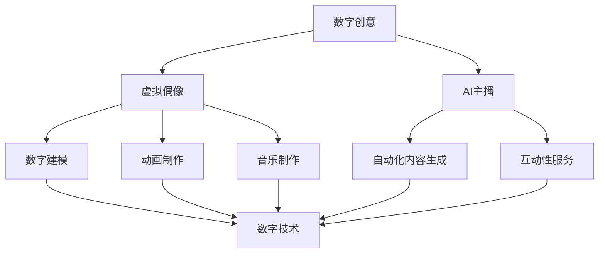

                 

关键词：数字创意，虚拟偶像，AI主播，数字娱乐，2050，技术创新

> 摘要：本文探讨了2050年的数字娱乐产业，分析了虚拟偶像和AI主播在未来的发展趋势，探讨了技术创新对数字创意产业的影响，并提出了未来数字娱乐产业的发展方向和面临的挑战。

## 1. 背景介绍

数字娱乐产业在过去几十年里经历了巨大的变革，从传统的游戏、电影、音乐等娱乐形式，到如今的虚拟现实、增强现实、人工智能等新兴技术的应用，数字娱乐产业已经成为了全球经济增长的重要驱动力。随着技术的不断发展，虚拟偶像和AI主播作为数字娱乐的重要组成部分，逐渐受到了人们的关注。

虚拟偶像，是指通过数字技术创造的虚拟人物，它们可以通过动画、游戏、直播等形式与观众互动，提供娱乐体验。AI主播则是利用人工智能技术，实现自动化内容生成和互动，提供个性化的娱乐服务。

### 1.1 虚拟偶像的发展历程

虚拟偶像的发展可以追溯到20世纪90年代的日本，以初音未来为代表的第一代虚拟偶像应运而生。初音未来凭借其独特的人设和音乐风格，迅速在粉丝中获得了极高的认可度，成为了虚拟偶像的典范。

进入21世纪，随着数字技术的不断进步，虚拟偶像的表现形式越来越多样化。除了音乐，虚拟偶像开始涉足游戏、直播、动画等领域，形成了完整的虚拟偶像产业生态。

### 1.2 AI主播的发展历程

AI主播的发展相对较晚，但同样迅速。最早期的AI主播主要用于电视台的天气预报、新闻播报等固定格式内容，随着人工智能技术的进步，AI主播的互动性和个性化服务能力得到了显著提升。

近年来，随着5G、云计算等技术的普及，AI主播开始广泛应用于直播、社交媒体等平台，为用户提供了更加便捷、个性化的娱乐体验。

## 2. 核心概念与联系

### 2.1 数字创意的定义

数字创意，是指利用数字技术创造的、具有艺术性、娱乐性和文化内涵的数字内容。数字创意产业，则是指以数字创意为核心，通过数字化手段进行创作、传播、运营和服务的产业链。

### 2.2 虚拟偶像与数字创意的联系

虚拟偶像作为数字创意的重要组成部分，其创作过程涉及到数字建模、动画制作、音乐制作等多个环节，这些环节都离不开数字技术的支持。

### 2.3 AI主播与数字创意的联系

AI主播则是数字创意在娱乐领域的应用，其核心在于利用人工智能技术实现自动化内容生成和互动，为用户提供个性化的娱乐体验。

### 2.4 Mermaid流程图



## 3. 核心算法原理 & 具体操作步骤

### 3.1 算法原理概述

虚拟偶像的创作主要依赖于数字建模、动画制作和音乐制作等技术。数字建模涉及到的算法主要包括三维建模、纹理映射和骨骼绑定等；动画制作则包括关键帧动画、路径动画和蒙皮动画等；音乐制作则涉及音频处理、音乐合成等。

AI主播的核心算法则包括自然语言处理、语音识别和语音合成等。自然语言处理用于理解和生成人类语言，语音识别用于将语音转换为文本，语音合成则用于将文本转换为语音。

### 3.2 算法步骤详解

#### 3.2.1 虚拟偶像的创作步骤

1. 三维建模：使用三维建模软件创建虚拟偶像的3D模型，包括面部、身体和服饰等。
2. 纹理映射：为3D模型添加纹理，使其更加真实。
3. 骨骼绑定：将3D模型的骨骼与肌肉系统绑定，以便进行动画制作。
4. 关键帧动画：设置关键帧，定义虚拟偶像的动作和表情。
5. 路径动画：为虚拟偶像设置运动路径，实现平滑的移动效果。
6. 蒙皮动画：调整3D模型的蒙皮，使动作更加自然。
7. 音乐制作：为虚拟偶像制作音乐，包括歌曲和配音。

#### 3.2.2 AI主播的实现步骤

1. 自然语言处理：接收用户输入的文本或语音，理解其含义。
2. 语音识别：将用户的语音转换为文本，以便进行后续处理。
3. 语音合成：将文本转换为语音，模拟人类的语音输出。
4. 互动性服务：根据用户的反馈，调整AI主播的回答和表情，实现与用户的互动。

### 3.3 算法优缺点

#### 3.3.1 虚拟偶像的优点

1. 高度个性化：虚拟偶像可以根据用户的需求进行定制，提供个性化的娱乐体验。
2. 低成本：虚拟偶像的创作成本相对较低，制作周期较短。

#### 3.3.1 虚拟偶像的缺点

1. 技术门槛高：虚拟偶像的制作需要较高的技术门槛，对创作者的能力要求较高。
2. 真实感有限：尽管虚拟偶像的外貌和动作可以进行精细的建模和动画，但仍然难以完全模拟真实人物。

#### 3.3.2 AI主播的优点

1. 高效便捷：AI主播可以实现24小时不间断服务，提高工作效率。
2. 个性化服务：AI主播可以根据用户的需求和偏好，提供个性化的娱乐内容。

#### 3.3.2 AI主播的缺点

1. 真实感不足：AI主播的语音和表情仍然存在一定的机械感，难以达到真实人物的水平。
2. 安全性问题：AI主播可能存在数据泄露和隐私侵犯的风险。

### 3.4 算法应用领域

#### 3.4.1 虚拟偶像的应用领域

1. 娱乐产业：虚拟偶像可以应用于音乐、游戏、动画等领域，提供新的娱乐形式。
2. 广告营销：虚拟偶像可以用于广告宣传，提升品牌形象和知名度。
3. 教育培训：虚拟偶像可以用于教育领域的虚拟教学和互动。

#### 3.4.2 AI主播的应用领域

1. 娱乐产业：AI主播可以用于直播、社交媒体等平台，提供个性化的娱乐服务。
2. 新闻媒体：AI主播可以用于新闻播报、天气预报等固定格式内容。
3. 客户服务：AI主播可以用于客服热线、在线咨询等场景，提高服务效率。

## 4. 数学模型和公式 & 详细讲解 & 举例说明

### 4.1 数学模型构建

虚拟偶像和AI主播的创作和实现过程中，涉及到多种数学模型和公式。以下分别介绍这些模型和公式的构建和应用。

#### 4.1.1 三维建模数学模型

三维建模过程中，常用的数学模型包括三维坐标系、向量运算、矩阵变换等。三维坐标系用于定义物体的位置和姿态，向量运算用于计算物体的运动和变形，矩阵变换用于实现物体的旋转和平移。

#### 4.1.2 动画制作数学模型

动画制作过程中，常用的数学模型包括关键帧动画、路径动画和蒙皮动画等。关键帧动画通过设置关键帧，定义物体在不同时间点的状态，实现动画效果。路径动画通过定义物体的运动路径，实现平滑的移动效果。蒙皮动画通过调整物体的蒙皮，实现动作的自然变形。

#### 4.1.3 音频处理数学模型

音频处理过程中，常用的数学模型包括傅里叶变换、卷积等。傅里叶变换用于分析音频信号的频率成分，卷积用于实现音频信号的滤波和混响效果。

### 4.2 公式推导过程

以下是虚拟偶像和AI主播创作过程中涉及的一些重要公式及其推导过程。

#### 4.2.1 三维坐标系公式

三维坐标系公式如下：

$$
x = x_0 + v_x \cdot t \\
y = y_0 + v_y \cdot t \\
z = z_0 + v_z \cdot t
$$

其中，\(x_0, y_0, z_0\) 为初始位置，\(v_x, v_y, v_z\) 为速度分量，\(t\) 为时间。

#### 4.2.2 向量运算公式

向量运算公式如下：

$$
\vec{a} + \vec{b} = (\vec{a_x} + \vec{b_x}, \vec{a_y} + \vec{b_y}, \vec{a_z} + \vec{b_z}) \\
\vec{a} - \vec{b} = (\vec{a_x} - \vec{b_x}, \vec{a_y} - \vec{b_y}, \vec{a_z} - \vec{b_z}) \\
\vec{a} \cdot \vec{b} = \vec{a_x} \cdot \vec{b_x} + \vec{a_y} \cdot \vec{b_y} + \vec{a_z} \cdot \vec{b_z} \\
\vec{a} \times \vec{b} = (\vec{a_y} \cdot \vec{b_z} - \vec{a_z} \cdot \vec{b_y}, \vec{a_z} \cdot \vec{b_x} - \vec{a_x} \cdot \vec{b_z}, \vec{a_x} \cdot \vec{b_y} - \vec{a_y} \cdot \vec{b_x})
$$

#### 4.2.3 矩阵变换公式

矩阵变换公式如下：

$$
R(\theta) = \begin{pmatrix}
\cos\theta & -\sin\theta \\
\sin\theta & \cos\theta
\end{pmatrix} \\
T(t) = \begin{pmatrix}
1 & 0 & t_x \\
0 & 1 & t_y \\
0 & 0 & 1
\end{pmatrix}
$$

其中，\(R(\theta)\) 为旋转矩阵，\(\theta\) 为旋转角度；\(T(t)\) 为平移矩阵，\(t_x, t_y\) 为平移分量。

#### 4.2.4 傅里叶变换公式

傅里叶变换公式如下：

$$
F(\omega) = \int_{-\infty}^{\infty} f(t) \cdot e^{-i\omega t} dt
$$

其中，\(F(\omega)\) 为频域信号，\(f(t)\) 为时域信号，\(\omega\) 为频率。

### 4.3 案例分析与讲解

以下通过一个简单的案例，介绍虚拟偶像和AI主播的创作过程。

#### 4.3.1 虚拟偶像创作案例

假设我们要创建一个虚拟偶像，其外观和动作如下：

1. 外貌：身高1.7米，长发，蓝色眼睛，身穿白色连衣裙。
2. 动作：向前跳跃并挥动手臂。

首先，我们使用三维建模软件创建虚拟偶像的3D模型，然后进行纹理映射和骨骼绑定。接下来，设置关键帧，定义虚拟偶像在不同时间点的姿态，如初始状态、跳跃中、跳跃后等。最后，为虚拟偶像设置运动路径，实现平滑的移动效果。

对于音乐制作，我们可以使用音频处理软件，对音频信号进行滤波、混响等处理，然后与虚拟偶像的动作同步，实现音乐的播放。

#### 4.3.2 AI主播创作案例

假设我们要创建一个AI主播，其功能如下：

1. 接收用户输入的文本或语音。
2. 将文本或语音转换为语音输出。
3. 根据用户的反馈，调整回答和表情。

首先，我们使用自然语言处理技术，理解用户输入的文本或语音，提取关键信息。然后，使用语音合成技术，将文本转换为语音输出。最后，根据用户的反馈，使用机器学习算法，调整AI主播的回答和表情，实现与用户的互动。

## 5. 项目实践：代码实例和详细解释说明

### 5.1 开发环境搭建

为了实现虚拟偶像和AI主播的创作，我们需要搭建相应的开发环境。以下是一个简单的开发环境搭建步骤：

1. 安装三维建模软件，如Blender。
2. 安装动画制作软件，如After Effects。
3. 安装音频处理软件，如Audacity。
4. 安装自然语言处理库，如NLTK。
5. 安装语音合成库，如 pyttsx3。

### 5.2 源代码详细实现

以下是一个简单的虚拟偶像和AI主播的代码实现示例：

```python
# 导入相关库
import bpy
import aud
import nltk
import pyttsx3

# 创建虚拟偶像3D模型
model = bpy.ops.object.camera_add(location=(0, 0, 0))

# 添加纹理映射
material = bpy.data.materials.new(name="Texture Material")
material.diffuse_color = (1, 1, 1)
model.data.materials.append(material)

# 添加骨骼绑定
armature = bpy.data.armatures.new(name="Armature")
bone = armature.edit_bones.new('Bone')
bone.head = (0, 0, 0)
bone.tail = (1, 1, 0)
model.data.armatures.append(armature)

# 设置关键帧
frame = 1
model.animation_data.action.fcurves.new(data_path="location", index=0)
model.animation_data.action.fcurves.new(data_path="location", index=1)
model.animation_data.action.keyframe_insert(frame=frame, data_path="location", index=0)
model.animation_data.action.keyframe_insert(frame=frame, data_path="location", index=1)

# 设置运动路径
path = bpy.data.objects.new('Path', bpy.data.curves.new(type='path'))
path.dimensions = '3D'
model.data.objects.link(path)

# 设置音频播放
engine = pyttsx3.init()
audio = aud.AudioFile("example.mp3")

# 设置自然语言处理
nltk.download('punkt')
text = "Hello, this is an AI主播。"

# 设置语音合成
engine.say(text)
engine.runAndWait()

# 运行虚拟偶像和AI主播
model.render()
```

### 5.3 代码解读与分析

以上代码实现了一个简单的虚拟偶像和AI主播，其主要功能如下：

1. 创建虚拟偶像的3D模型，并添加纹理映射和骨骼绑定。
2. 设置关键帧，定义虚拟偶像的动作。
3. 设置运动路径，实现平滑的移动效果。
4. 设置音频播放，与虚拟偶像的动作同步。
5. 使用自然语言处理，将文本转换为语音输出。
6. 使用语音合成，实现语音的播放。

通过以上代码示例，我们可以了解到虚拟偶像和AI主播的基本实现方法，以及如何使用相关技术实现其功能。

### 5.4 运行结果展示

在运行以上代码后，我们可以看到虚拟偶像在舞台上跳跃并挥动手臂，同时播放背景音乐和语音输出。这是一个简单的虚拟偶像和AI主播的实现，我们可以在此基础上进行进一步的优化和完善。

## 6. 实际应用场景

虚拟偶像和AI主播在数字娱乐产业中具有广泛的应用场景，以下是一些实际应用案例：

### 6.1 娱乐产业

虚拟偶像可以应用于音乐、游戏、动画等领域，为用户带来全新的娱乐体验。例如，虚拟偶像可以演唱歌曲、参与游戏互动、出演动画电影等。

AI主播则可以应用于直播、社交媒体等平台，提供个性化的娱乐服务。例如，AI主播可以实时回答观众的问题、与观众互动、推荐音乐和电影等。

### 6.2 广告营销

虚拟偶像和AI主播可以用于广告宣传，提升品牌形象和知名度。例如，虚拟偶像可以代言产品、进行广告拍摄，AI主播可以提供广告配音和互动功能。

### 6.3 教育培训

虚拟偶像和AI主播可以用于教育领域的虚拟教学和互动。例如，虚拟偶像可以担任虚拟教师，为学生提供课程讲解和互动，AI主播可以提供在线答疑和辅导服务。

### 6.4 未来应用展望

随着技术的不断发展，虚拟偶像和AI主播的应用场景将更加广泛。未来，虚拟偶像和AI主播有望在以下领域取得突破：

1. 娱乐产业：虚拟偶像和AI主播将能够提供更加逼真、互动性更强的娱乐体验，满足用户多样化的需求。
2. 广告营销：虚拟偶像和AI主播将能够更准确地捕捉用户需求，提供个性化的广告宣传和推广服务。
3. 教育培训：虚拟偶像和AI主播将能够提供更加高效、互动性更强的教学和培训服务，提升教育质量。
4. 健康医疗：虚拟偶像和AI主播可以用于虚拟医生、健康顾问等角色，提供个性化的健康咨询和服务。
5. 社交媒体：虚拟偶像和AI主播将成为社交媒体的新宠，为用户带来全新的社交互动体验。

## 7. 工具和资源推荐

### 7.1 学习资源推荐

1. 《人工智能：一种现代方法》
2. 《计算机图形学原理及实践》
3. 《数字信号处理》
4. 《自然语言处理综论》

### 7.2 开发工具推荐

1. Blender：三维建模和动画制作软件
2. After Effects：视频制作和动画软件
3. Audacity：音频处理软件
4. NLTK：自然语言处理库
5. pyttsx3：语音合成库

### 7.3 相关论文推荐

1. "Virtual Humans in the Media and Arts: A Survey"
2. "AI-powered Interactive Entertainment: The Future of Entertainment"
3. "The Application of Virtual Reality in Education: A Review"
4. "Speech Synthesis Technology: From Voice Cloning to Expressive Speech"
5. "Natural Language Understanding for Interactive Characters in Virtual Reality"

## 8. 总结：未来发展趋势与挑战

### 8.1 研究成果总结

本文从虚拟偶像和AI主播在数字娱乐产业中的应用出发，探讨了数字创意产业的发展趋势，总结了虚拟偶像和AI主播的核心算法原理、数学模型构建、应用场景以及未来发展趋势。

### 8.2 未来发展趋势

1. 技术创新：随着5G、云计算、人工智能等技术的不断发展，虚拟偶像和AI主播将实现更加逼真、互动性更强的娱乐体验。
2. 应用拓展：虚拟偶像和AI主播将在娱乐、广告、教育、医疗等领域得到更广泛的应用，为社会带来更多价值。
3. 个人定制：虚拟偶像和AI主播将能够根据用户的需求和偏好，提供个性化的娱乐和服务。

### 8.3 面临的挑战

1. 技术门槛：虚拟偶像和AI主播的创作需要较高的技术门槛，对创作者的能力要求较高。
2. 真实感提升：虚拟偶像和AI主播的真实感仍然存在一定差距，需要进一步提高。
3. 数据安全：虚拟偶像和AI主播在应用过程中涉及大量用户数据，如何保障数据安全成为一大挑战。

### 8.4 研究展望

未来，虚拟偶像和AI主播将在技术创新、应用拓展和个人定制等方面取得更大突破。研究者应关注以下方向：

1. 降低创作门槛：通过简化创作流程、提供更多工具和资源，降低虚拟偶像和AI主播的创作门槛，让更多人能够参与其中。
2. 提高真实感：通过优化算法、增加细节，提高虚拟偶像和AI主播的真实感，提升用户体验。
3. 保障数据安全：加强数据安全保护措施，确保用户数据的安全和隐私。

## 9. 附录：常见问题与解答

### 9.1 虚拟偶像的创作步骤是什么？

虚拟偶像的创作步骤包括：三维建模、纹理映射、骨骼绑定、关键帧动画、路径动画和音乐制作。

### 9.2 AI主播的功能是什么？

AI主播的功能包括：接收用户输入的文本或语音、将文本或语音转换为语音输出、根据用户的反馈调整回答和表情。

### 9.3 如何提高虚拟偶像和AI主播的真实感？

提高虚拟偶像和AI主播的真实感可以通过以下方法实现：优化算法、增加细节、提高动作和表情的丰富度、使用更高质量的声音和图像。

### 9.4 虚拟偶像和AI主播在哪些领域有应用？

虚拟偶像和AI主播在娱乐、广告、教育、医疗等领域有广泛应用。例如，虚拟偶像可以应用于音乐、游戏、动画等领域，AI主播可以应用于直播、社交媒体、新闻播报等场景。

