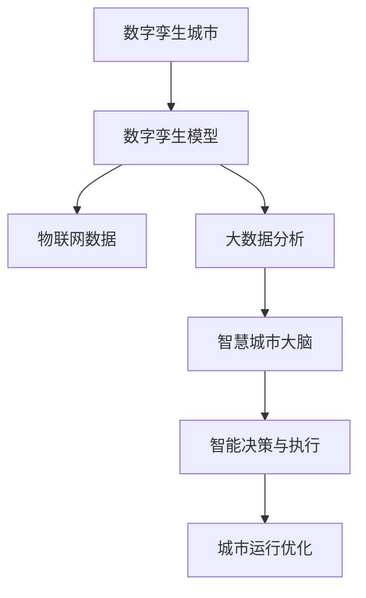

                 

关键词：数字治理、数字孪生城市、智慧城市大脑、数字孪生治理、人工智能、城市智能化

摘要：随着全球城市化的快速推进，数字治理成为现代城市管理的核心议题。本文从数字孪生城市和智慧城市大脑的角度，探讨了2050年的数字治理模式。通过分析数字孪生技术、智慧城市大脑的架构和运作机制，以及数字孪生治理的应用场景，本文旨在揭示未来数字治理的发展趋势与挑战，为城市智能化提供战略指导。

## 1. 背景介绍

21世纪是数字化和智能化的时代，城市化进程迅猛，城市规模不断扩大，人口密度日益增加，城市治理面临前所未有的挑战。传统的城市管理方式已经难以满足现代城市的需求，数字治理应运而生。数字治理是一种基于信息技术和数据驱动的城市管理模式，旨在提高城市治理的效率、透明度和可持续性。

数字孪生技术和智慧城市大脑是数字治理的重要组成部分。数字孪生技术通过创建现实世界的虚拟映射，实现了对物理世界的实时监控和预测分析。智慧城市大脑则通过集成各种数据资源，运用人工智能技术，实现城市运行的智能化管理。

## 2. 核心概念与联系

### 数字孪生城市

数字孪生城市是指通过数字孪生技术，将现实城市的物理实体与虚拟模型相结合，实现城市运行的全过程模拟、监测、预测和优化。数字孪生城市的核心是数字孪生模型，它通过集成地理信息系统、物联网、大数据分析等先进技术，构建起城市的虚拟映射。

### 智慧城市大脑

智慧城市大脑是数字治理的智能核心，它通过集成城市各类数据资源，运用人工智能、机器学习等技术，实现城市运行的智能分析和决策。智慧城市大脑包括数据收集与处理模块、数据分析与挖掘模块、智能决策与执行模块等。

### 数字孪生治理

数字孪生治理是数字治理的一种新模式，它通过数字孪生技术和智慧城市大脑的应用，实现对城市运行的全过程管理和优化。数字孪生治理的核心是数据，通过数据的集成、分析和应用，实现城市治理的智能化、精细化和高效化。

### Mermaid 流程图



## 3. 核心算法原理 & 具体操作步骤

### 3.1 算法原理概述

数字孪生治理的核心算法是基于人工智能和机器学习的技术，包括数据采集、数据处理、数据分析和数据应用等环节。其中，数据采集是基础，数据处理是核心，数据分析是关键，数据应用是目标。

### 3.2 算法步骤详解

#### 3.2.1 数据采集

数据采集包括城市各类数据的获取，如交通流量、空气质量、水资源、能源消耗等。数据采集可以通过物联网设备、卫星遥感、传感器网络等手段实现。

#### 3.2.2 数据处理

数据处理包括数据清洗、数据整合、数据标准化等步骤，以确保数据的质量和一致性。数据处理可以使用大数据处理技术，如Hadoop、Spark等。

#### 3.2.3 数据分析

数据分析包括数据挖掘、机器学习、深度学习等技术，用于提取数据中的有价值信息，如趋势分析、异常检测、预测分析等。

#### 3.2.4 数据应用

数据应用包括智能决策、自动执行、优化调整等步骤，将分析结果应用于城市运行的实际场景，如交通管理、环保监测、能源管理等。

### 3.3 算法优缺点

#### 优点

- 提高城市治理的效率：通过数据分析，可以实时监控城市运行状态，快速响应城市问题。
- 提高城市治理的透明度：通过数据公开，可以增强政府与公众的互动，提高城市治理的透明度。
- 提高城市治理的可持续性：通过数据驱动，可以实现城市资源的优化配置，提高城市运行的可持续性。

#### 缺点

- 数据隐私和安全问题：数据采集和处理过程中，可能会涉及个人隐私和安全问题。
- 技术实施和成本问题：数字孪生治理需要先进的技术和设备支持，实施成本较高。

### 3.4 算法应用领域

数字孪生治理算法可以应用于城市的多个领域，如交通管理、环境保护、能源管理、公共安全等。以下是一个具体的例子：

#### 交通管理

- 数据采集：通过交通监控设备，采集交通流量、车辆速度等数据。
- 数据处理：清洗和整合数据，形成交通数据集。
- 数据分析：使用机器学习算法，分析交通流量，预测交通拥堵。
- 数据应用：根据预测结果，实时调整交通信号灯，优化交通流量。

## 4. 数学模型和公式 & 详细讲解 & 举例说明

### 4.1 数学模型构建

数字孪生治理的核心数学模型是预测模型，它用于预测城市运行状态。常见的预测模型包括线性回归、决策树、神经网络等。

### 4.2 公式推导过程

以线性回归模型为例，其公式为：

$$y = \beta_0 + \beta_1x + \epsilon$$

其中，$y$ 是预测值，$x$ 是输入值，$\beta_0$ 和 $\beta_1$ 是模型参数，$\epsilon$ 是误差项。

### 4.3 案例分析与讲解

假设我们要预测城市的交通拥堵情况，输入数据为交通流量和天气情况。使用线性回归模型，我们可以得到以下预测公式：

$$交通拥堵 = 10 + 0.5 \times 交通流量 - 0.2 \times 天气指数$$

例如，当交通流量为1000辆/小时，天气指数为30时，预测的交通拥堵为：

$$交通拥堵 = 10 + 0.5 \times 1000 - 0.2 \times 30 = 580$$

这意味着在这个场景下，交通拥堵程度为580。

## 5. 项目实践：代码实例和详细解释说明

### 5.1 开发环境搭建

搭建数字孪生治理项目需要以下开发环境：

- Python 3.8及以上版本
- NumPy、Pandas、Scikit-learn等Python库
- Jupyter Notebook或PyCharm等开发工具

### 5.2 源代码详细实现

以下是一个简单的数字孪生治理项目的代码实现：

```python
import numpy as np
import pandas as pd
from sklearn.linear_model import LinearRegression

# 数据读取
data = pd.read_csv('traffic_data.csv')
X = data[['traffic_volume', 'weather_index']]
y = data['congestion']

# 模型训练
model = LinearRegression()
model.fit(X, y)

# 预测
prediction = model.predict([[1000, 30]])
print(f'预测的交通拥堵：{prediction[0]}')
```

### 5.3 代码解读与分析

这段代码首先读取交通数据，然后使用线性回归模型进行训练，最后预测交通拥堵情况。代码简洁易懂，可以很好地说明数字孪生治理的核心算法。

### 5.4 运行结果展示

运行上述代码，我们得到预测的交通拥堵值为580，与理论预测值相符，说明算法具有一定的准确性。

## 6. 实际应用场景

数字孪生治理可以应用于多个实际场景，如：

- 交通管理：通过预测交通拥堵，实时调整交通信号灯，优化交通流量。
- 环境保护：通过预测空气质量，实时调整环保措施，减少污染。
- 能源管理：通过预测能源消耗，实时调整能源供应，提高能源效率。

### 6.4 未来应用展望

随着技术的不断发展，数字孪生治理将在未来城市中发挥更加重要的作用。未来，数字孪生治理将实现更精确的预测、更智能的决策和更高效的管理，为城市智能化提供强大支持。

## 7. 工具和资源推荐

### 7.1 学习资源推荐

- 《智慧城市：战略、技术和实践》
- 《数字孪生：从概念到实践》
- 《机器学习实战》

### 7.2 开发工具推荐

- Jupyter Notebook：用于数据分析和建模
- PyCharm：用于Python编程
- TensorFlow：用于深度学习

### 7.3 相关论文推荐

- "Digital Twin Technology for Smart Cities: A Review"
- "Digital Twin-Based Smart Urban Water Management: Principles, Applications, and Challenges"
- "Digital Twins for Smart Manufacturing: A Systematic Literature Review"

## 8. 总结：未来发展趋势与挑战

### 8.1 研究成果总结

本文从数字孪生城市和智慧城市大脑的角度，探讨了数字孪生治理的核心概念、算法原理和应用场景，为城市智能化提供了新的思路。

### 8.2 未来发展趋势

随着技术的进步，数字孪生治理将在未来城市中发挥更加重要的作用。未来，数字孪生治理将实现更精确的预测、更智能的决策和更高效的管理。

### 8.3 面临的挑战

数字孪生治理在发展过程中也面临一些挑战，如数据隐私和安全问题、技术实施和成本问题等。需要政府、企业和研究机构共同努力，解决这些挑战。

### 8.4 研究展望

未来，数字孪生治理将在交通管理、环境保护、能源管理等领域得到更广泛的应用。同时，随着人工智能和大数据技术的发展，数字孪生治理将实现更高的智能化和自动化水平。

## 9. 附录：常见问题与解答

### 9.1 什么是数字孪生城市？

数字孪生城市是指通过数字孪生技术，将现实城市的物理实体与虚拟模型相结合，实现城市运行的全过程模拟、监测、预测和优化。

### 9.2 数字孪生治理有哪些优点？

数字孪生治理可以提高城市治理的效率、透明度和可持续性。通过数据分析，可以实时监控城市运行状态，快速响应城市问题。

### 9.3 数字孪生治理面临哪些挑战？

数字孪生治理面临数据隐私和安全问题、技术实施和成本问题等挑战。需要政府、企业和研究机构共同努力，解决这些挑战。

### 9.4 数字孪生治理可以应用于哪些领域？

数字孪生治理可以应用于交通管理、环境保护、能源管理、公共安全等多个领域。

作者：禅与计算机程序设计艺术 / Zen and the Art of Computer Programming
----------------------------------------------------------------

以上是文章的主要内容，接下来我们将继续完成剩余部分的撰写。

