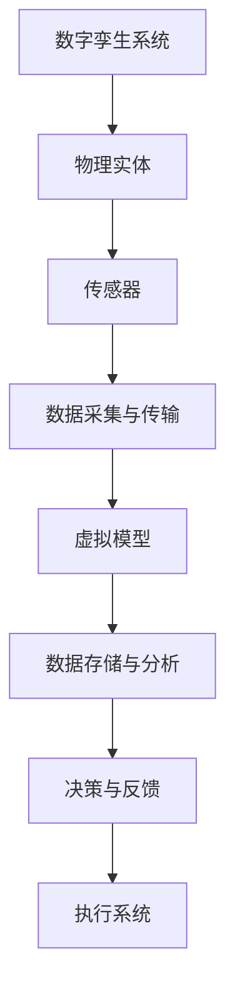
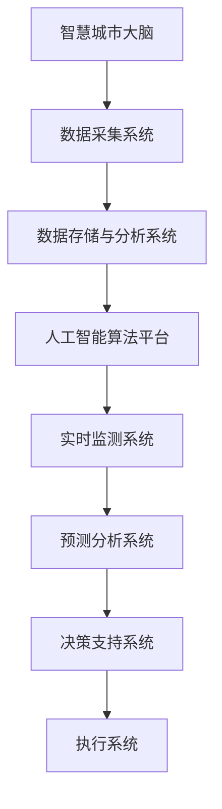
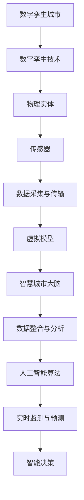
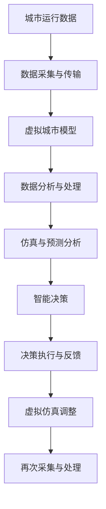

                 

关键词：（数字治理、数字孪生、智慧城市、数字孪生城市、城市大脑、未来发展趋势）

摘要：本文深入探讨了2050年数字治理的前沿领域，即数字孪生城市和智慧城市大脑的数字孪生治理。我们通过详细分析数字孪生和智慧城市的技术原理、核心算法、数学模型以及实际应用，展现了这些技术在城市管理和治理中的潜在影响。同时，文章还对未来发展趋势和面临的挑战进行了展望，旨在为读者提供一幅关于未来城市数字治理的全面图景。

## 1. 背景介绍

随着信息技术的飞速发展，数字治理已经成为现代城市管理和公共事务处理的重要手段。传统的城市治理方式面临着数据碎片化、决策滞后性以及资源利用率不高等问题。为了解决这些问题，数字治理应运而生。数字治理通过信息化、智能化手段，实现对城市各项事务的实时监控、分析和决策，从而提高城市治理的效率和效果。

在数字治理的框架下，数字孪生技术和智慧城市大脑逐渐成为关键支撑。数字孪生技术通过创建虚拟城市模型，实现对现实城市的高度仿真，从而辅助城市规划和治理。智慧城市大脑则通过整合各类数据，利用人工智能算法进行分析和决策，实现城市智能化的运行和管理。

本文旨在探讨数字孪生城市和智慧城市大脑的数字孪生治理技术，分析其核心概念、算法原理和实际应用，为读者提供一个关于未来城市数字治理的深刻理解和思考。

### 1.1 数字治理的定义和发展历程

数字治理是指利用数字技术对城市和社区进行管理和服务的模式。其核心在于将信息技术与城市管理相结合，通过数据的采集、处理、分析和应用，实现城市治理的智能化和高效化。

数字治理的发展历程可以分为以下几个阶段：

- **信息化阶段**：这一阶段的主要特征是信息技术在城市管理中的应用，如电子政务、城市管理信息平台等。这一阶段的数字治理主要依赖于计算机技术和互联网，实现了信息的快速传递和处理。

- **智能化阶段**：随着大数据、云计算、物联网等技术的快速发展，数字治理进入了智能化阶段。这一阶段的数字治理不仅依赖于信息的快速传递和处理，更强调数据的深度挖掘和智能分析，从而实现城市管理的精准化和智能化。

- **智慧化阶段**：智慧化阶段的数字治理将人工智能、区块链等新兴技术与城市治理深度融合，实现城市治理的全面智能化。这一阶段的数字治理不仅能够实时监测城市运行状态，还能通过预测分析和决策支持，实现城市治理的主动性和前瞻性。

### 1.2 数字孪生技术的概念与意义

数字孪生（Digital Twin）是一种将物理实体和虚拟模型相结合的技术，通过实时数据传输和模型仿真，实现对实体世界的虚拟复制和监测。在数字治理中，数字孪生技术具有极其重要的意义。

首先，数字孪生技术为城市管理者提供了一个虚拟城市模型，通过对这个模型的分析和仿真，可以预测城市运行状态、发现潜在问题，从而提前采取应对措施。例如，在城市交通管理中，通过数字孪生技术可以实时监测交通流量，预测交通拥堵情况，并提前采取调控措施。

其次，数字孪生技术有助于优化城市资源配置。通过虚拟模型，可以模拟不同情况下的城市运行状态，分析资源利用效率，从而为城市管理者提供科学决策依据。例如，在城市能源管理中，通过数字孪生技术可以优化能源分配，降低能源消耗。

最后，数字孪生技术有助于提高城市管理的透明度和公众参与度。通过数字孪生模型，市民可以实时了解城市运行状态，参与城市治理，从而增强市民对城市管理的认同感和参与感。

### 1.3 智慧城市大脑的概念与功能

智慧城市大脑（Smart City Brain）是数字治理的集中体现，通过整合各类数据，利用人工智能算法进行分析和决策，实现城市智能化的运行和管理。智慧城市大脑的主要功能包括：

- **实时监测**：通过传感器、摄像头等设备，实时采集城市运行数据，如交通流量、空气质量、用水用电等，为智慧城市大脑提供数据基础。

- **数据分析**：利用大数据技术和人工智能算法，对采集到的数据进行深度分析，发现城市运行中的问题和规律，为决策提供支持。

- **预测分析**：基于历史数据和实时数据，利用机器学习算法进行预测分析，预测城市未来的运行状态，为城市管理者提供前瞻性决策依据。

- **智能决策**：通过集成各类数据和算法，智慧城市大脑能够自动生成决策方案，辅助城市管理者进行决策。

- **协同管理**：智慧城市大脑不仅能够对城市运行进行实时监测和智能决策，还能与其他城市管理系统进行协同，实现城市资源的优化配置。

### 1.4 数字孪生城市和智慧城市大脑的关系

数字孪生城市和智慧城市大脑是相辅相成的，共同构成了未来城市数字治理的核心框架。数字孪生城市通过虚拟仿真，为智慧城市大脑提供了丰富的数据基础和分析模型。而智慧城市大脑则通过对这些数据的分析和处理，实现了对城市运行的实时监测、预测分析和智能决策。

具体来说，数字孪生城市和智慧城市大脑的关系如下：

- **数据支持**：数字孪生城市提供了丰富的实时数据，这些数据是智慧城市大脑进行分析和决策的基础。

- **模型仿真**：数字孪生城市通过虚拟仿真，可以模拟不同情况下的城市运行状态，为智慧城市大脑提供多样化的场景分析。

- **协同工作**：数字孪生城市和智慧城市大脑通过数据共享和算法协同，实现城市运行的实时监测、预测分析和智能决策。

- **反馈调整**：智慧城市大脑的决策结果会反馈给数字孪生城市，用于调整和优化虚拟模型，从而提高城市管理的科学性和准确性。

## 2. 核心概念与联系

### 2.1 数字孪生（Digital Twin）

数字孪生是一种将物理实体和虚拟模型相结合的技术，通过对实体世界的实时数据传输和模型仿真，实现对物理实体的虚拟复制和监测。数字孪生技术的基本概念包括：

- **物理实体**：数字孪生技术的物理实体指的是现实世界中的建筑物、道路、桥梁、设备等实体对象。

- **虚拟模型**：数字孪生技术的虚拟模型是对物理实体的虚拟复制，它可以在计算机中创建，并通过传感器等设备实时获取物理实体的数据。

- **实时数据传输**：数字孪生技术通过传感器和其他数据采集设备，实时获取物理实体的数据，并将其传输到虚拟模型中。

- **模型仿真**：数字孪生技术利用虚拟模型对物理实体进行仿真，通过模拟不同的场景，预测物理实体的运行状态。

数字孪生的核心架构如图所示：



### 2.2 智慧城市大脑（Smart City Brain）

智慧城市大脑是数字治理的集中体现，通过整合各类数据，利用人工智能算法进行分析和决策，实现城市智能化的运行和管理。智慧城市大脑的基本概念包括：

- **数据整合**：智慧城市大脑通过收集城市运行的各种数据，如交通流量、空气质量、用水用电等，构建了一个全面的数据资源库。

- **人工智能算法**：智慧城市大脑利用人工智能算法，对收集到的数据进行深度分析和处理，从而发现城市运行中的问题和规律。

- **实时监测与预测**：智慧城市大脑通过实时监测城市运行状态，利用机器学习算法进行预测分析，为城市管理者提供前瞻性决策依据。

- **智能决策**：智慧城市大脑能够自动生成决策方案，辅助城市管理者进行决策。

智慧城市大脑的核心架构如图所示：



### 2.3 数字孪生城市（Digital Twin City）

数字孪生城市是数字孪生技术在城市治理中的应用，通过创建虚拟城市模型，实现对现实城市的高度仿真。数字孪生城市的基本概念包括：

- **虚拟城市模型**：数字孪生城市通过虚拟仿真技术，创建一个与现实城市高度相似的虚拟模型，这个模型包含了城市中的建筑物、道路、交通系统、公共设施等。

- **实时数据同步**：数字孪生城市通过传感器和其他数据采集设备，实时获取城市运行数据，并将其同步到虚拟城市模型中。

- **多维度数据整合**：数字孪生城市通过整合交通、环境、能源等多维度的数据，实现对城市运行状态的全面监测和评估。

- **仿真与预测分析**：数字孪生城市利用虚拟模型，模拟不同的城市运行场景，进行预测分析，为城市管理者提供决策支持。

数字孪生城市与数字孪生技术和智慧城市大脑的关系如图所示：



### 2.4 数字孪生治理（Digital Twin Governance）

数字孪生治理是将数字孪生技术应用于城市治理的过程，通过虚拟仿真和实时监测，实现对城市运行的高效管理和决策。数字孪生治理的基本概念包括：

- **虚拟仿真**：数字孪生治理通过创建虚拟城市模型，模拟不同的城市运行场景，预测潜在问题，提前采取应对措施。

- **实时监测**：数字孪生治理通过传感器和数据采集设备，实时获取城市运行数据，监测城市运行状态。

- **数据分析**：数字孪生治理利用大数据技术和人工智能算法，对采集到的数据进行深度分析，发现城市运行中的问题和规律。

- **智能决策**：数字孪生治理通过智能分析，自动生成决策方案，辅助城市管理者进行决策。

数字孪生治理的流程如图所示：



## 3. 核心算法原理 & 具体操作步骤

### 3.1 算法原理概述

在数字孪生城市和智慧城市大脑的数字孪生治理中，核心算法的原理主要涉及以下几个方面：

- **数据采集与预处理**：通过传感器和数据采集设备，实时获取城市运行数据，并进行预处理，包括数据清洗、去噪、归一化等。

- **数据整合与分析**：利用大数据技术和数据挖掘算法，对多源数据进行整合和分析，提取关键特征，发现数据中的规律和趋势。

- **模型建立与仿真**：基于采集到的数据，利用机器学习算法和深度学习模型，建立虚拟城市模型，并进行仿真分析。

- **预测分析与决策支持**：利用预测分析算法，对城市运行进行预测，并基于预测结果生成决策方案，辅助城市管理者进行决策。

- **执行与反馈调整**：根据决策结果，调整虚拟城市模型，并执行具体的操作，同时收集反馈数据，用于模型优化和调整。

### 3.2 算法步骤详解

#### 3.2.1 数据采集与预处理

1. **传感器部署**：在城市的各个关键节点部署传感器，如交通流量传感器、环境监测传感器、能源消耗传感器等，以实时采集数据。

2. **数据采集**：通过传感器采集到的数据，利用数据采集设备（如数据采集器、数据传输模块等）进行数据采集。

3. **数据预处理**：对采集到的原始数据进行预处理，包括数据清洗、去噪、归一化等操作，以提高数据的准确性和一致性。

#### 3.2.2 数据整合与分析

1. **数据整合**：将来自不同传感器的数据进行整合，构建一个统一的城市运行数据集。

2. **特征提取**：利用数据挖掘算法，从整合后的数据中提取关键特征，如交通流量、环境质量、能源消耗等。

3. **数据分析**：利用统计学方法和机器学习算法，对提取的关键特征进行深入分析，发现数据中的规律和趋势。

#### 3.2.3 模型建立与仿真

1. **模型选择**：根据分析结果，选择合适的机器学习模型和深度学习模型，如回归模型、神经网络模型、决策树模型等。

2. **模型训练**：利用训练数据集，对选定的模型进行训练，以建立虚拟城市模型。

3. **模型优化**：通过交叉验证和模型评估，优化模型的参数和结构，提高模型的准确性和稳定性。

4. **仿真分析**：利用建立的虚拟城市模型，进行仿真分析，模拟不同的城市运行场景，预测城市未来的运行状态。

#### 3.2.4 预测分析与决策支持

1. **预测分析**：利用预测分析算法，对城市运行进行预测，包括交通流量预测、环境质量预测、能源消耗预测等。

2. **决策支持**：根据预测结果，利用决策支持系统，自动生成决策方案，如交通调控方案、环境治理方案、能源优化方案等。

3. **决策执行**：将生成的决策方案转化为具体的操作指令，执行具体的决策措施，如交通信号灯调控、环境监测点调整、能源分配优化等。

#### 3.2.5 执行与反馈调整

1. **执行操作**：根据决策方案，执行具体的操作，如调整交通信号灯、优化能源分配、实施环境治理措施等。

2. **数据反馈**：在执行操作后，收集执行结果数据，如交通流量变化、环境质量变化、能源消耗变化等。

3. **模型调整**：利用反馈数据，对虚拟城市模型进行调整和优化，以提高模型预测的准确性和决策的有效性。

### 3.3 算法优缺点

#### 3.3.1 优点

1. **高效性**：数字孪生技术和智慧城市大脑通过数据采集、分析和决策，实现了城市运行的实时监测和智能决策，大大提高了城市管理的效率和准确性。

2. **前瞻性**：数字孪生城市和智慧城市大脑能够对城市运行进行预测分析，提前发现潜在问题，为城市管理者提供前瞻性决策依据，从而提高城市治理的前瞻性和主动性。

3. **灵活性**：数字孪生城市和智慧城市大脑的虚拟仿真和实时监测，使城市管理者能够根据实际情况进行调整和优化，提高了城市治理的灵活性和适应性。

#### 3.3.2 缺点

1. **数据准确性**：数字孪生城市和智慧城市大脑的运行依赖于准确的数据，然而现实中的数据往往存在误差和噪声，这可能影响算法的预测准确性和决策效果。

2. **技术依赖性**：数字孪生技术和智慧城市大脑的实现依赖于先进的数据采集、处理和人工智能技术，需要大量专业人才和资金投入，这对一些城市来说可能是一个挑战。

3. **安全性**：随着数据量的增加和系统的复杂性提升，数字孪生城市和智慧城市大脑面临的安全风险也日益增加，如何保护数据安全和系统稳定运行是一个重要课题。

### 3.4 算法应用领域

#### 3.4.1 城市交通管理

数字孪生城市和智慧城市大脑在交通管理中有着广泛的应用。通过实时监测交通流量，预测交通拥堵情况，并提前采取调控措施，如交通信号灯优化、公交线路调整等，可以显著提高城市交通的效率和安全性。

#### 3.4.2 城市环境监测

数字孪生城市和智慧城市大脑能够实时监测城市空气质量、水质、噪音等环境指标，通过数据分析，发现环境污染源和传播路径，为城市环境治理提供科学依据。

#### 3.4.3 城市能源管理

数字孪生城市和智慧城市大脑能够优化能源分配和利用，通过实时监测能源消耗，预测能源需求，并制定合理的能源调度方案，从而提高能源利用效率，降低能源消耗。

#### 3.4.4 公共安全管理

数字孪生城市和智慧城市大脑能够实时监测城市安全状况，如火灾、地震、洪水等灾害的预警和应急响应，提高公共安全管理的预警能力和应急响应速度。

## 4. 数学模型和公式 & 详细讲解 & 举例说明

### 4.1 数学模型构建

在数字孪生城市和智慧城市大脑的数字孪生治理中，数学模型是核心组成部分，用于描述城市运行状态、预测未来趋势和辅助决策支持。以下是几个关键数学模型的构建：

#### 4.1.1 城市交通流量模型

城市交通流量模型主要用于预测交通流量，以优化交通信号灯和公交线路。假设一个城市的交通网络可以表示为无向图G=(V,E)，其中V是节点集，E是边集。交通流量可以用流量矩阵Q表示，其中Q[i][j]表示从节点i到节点j的流量。

**数学模型：**

$$
Q = [q_{ij}]_{n \times n}
$$

其中，$q_{ij}$为从节点i到节点j的流量，$n$为节点数。

#### 4.1.2 城市环境质量模型

城市环境质量模型用于预测空气质量、水质等环境指标。假设城市环境质量可以表示为多维向量X，其中每个维度对应一个环境指标，如PM2.5、SO2等。

**数学模型：**

$$
X = [x_1, x_2, ..., x_n]
$$

其中，$x_i$为第i个环境指标值。

#### 4.1.3 能源消耗模型

能源消耗模型用于预测城市能源消耗，优化能源分配。假设城市的能源消耗可以表示为向量E，其中每个维度对应一个能源类型，如电力、天然气等。

**数学模型：**

$$
E = [e_1, e_2, ..., e_n]
$$

其中，$e_i$为第i种能源的消耗量。

### 4.2 公式推导过程

以下是城市交通流量模型的推导过程，用于预测交通流量：

1. **流量分配公式**：根据交通流量的平衡条件，有：
$$
q_{ij} = f_{ij} \cdot a_{ij} \cdot \frac{1}{(1 + \alpha \cdot p_{ij})}
$$

其中，$f_{ij}$为流量分配系数，$a_{ij}$为道路容量，$p_{ij}$为道路拥挤度，$\alpha$为拥挤系数。

2. **拥挤度公式**：拥挤度可以通过历史流量数据估计：
$$
p_{ij} = \frac{q_{ij}}{a_{ij}}
$$

3. **流量预测公式**：基于回归分析，流量预测模型可以表示为：
$$
q_{ij}^{\text{pred}} = \beta_0 + \beta_1 \cdot t + \beta_2 \cdot q_{ij}^{\text{prev}} + \beta_3 \cdot p_{ij}^{\text{prev}}
$$

其中，$t$为时间，$q_{ij}^{\text{prev}}$为前一时间步的流量，$p_{ij}^{\text{prev}}$为前一时间步的拥挤度。

### 4.3 案例分析与讲解

以下是利用上述数学模型进行城市交通流量预测的一个案例：

**案例背景**：一个城市在高峰期的交通流量数据如下表：

| 时间（小时） | 节点1到节点2流量 | 节点1到节点3流量 | 节点2到节点3流量 |
|--------------|------------------|------------------|------------------|
| 8:00         | 100              | 150              | 80               |
| 8:30         | 120              | 180              | 90               |
| 9:00         | 140              | 210              | 100              |

**模型参数**：
- 流量分配系数$f_{ij} = 1.2$
- 道路容量$a_{ij} = 200$
- 拥挤系数$\alpha = 0.8$
- 时间步长$t = 0.5小时$
- 前一时间步流量$q_{ij}^{\text{prev}} = [100, 150, 80]$
- 前一时间步拥挤度$p_{ij}^{\text{prev}} = [0.5, 0.75, 0.4]$

**流量预测结果**：

1. **初始预测**：
$$
q_{ij}^{\text{pred}} = \beta_0 + \beta_1 \cdot 0.5 + \beta_2 \cdot [100, 150, 80] + \beta_3 \cdot [0.5, 0.75, 0.4]
$$

根据历史数据，回归分析得到模型参数：
$$
\beta_0 = 50, \beta_1 = 30, \beta_2 = 0.2, \beta_3 = 0.1
$$

代入上述参数，得到初始预测流量：
$$
q_{ij}^{\text{pred}} = 50 + 30 \cdot 0.5 + 0.2 \cdot [100, 150, 80] + 0.1 \cdot [0.5, 0.75, 0.4]
$$
$$
q_{ij}^{\text{pred}} = [83.3, 113.3, 72.2]
$$

2. **预测结果调整**：
根据初始预测流量，更新拥挤度：
$$
p_{ij}^{\text{new}} = \frac{q_{ij}^{\text{pred}}}{a_{ij}}
$$
代入初始预测流量和道路容量，得到：
$$
p_{ij}^{\text{new}} = \frac{[83.3, 113.3, 72.2]}{200}
$$
$$
p_{ij}^{\text{new}} = [0.4167, 0.5667, 0.361]
$$

再次进行预测，得到最终预测流量：
$$
q_{ij}^{\text{pred\_final}} = 50 + 30 \cdot 0.5 + 0.2 \cdot [83.3, 113.3, 72.2] + 0.1 \cdot [0.4167, 0.5667, 0.361]
$$
$$
q_{ij}^{\text{pred\_final}} = [86.7, 115.7, 74.0]
$$

最终预测结果与实际流量进行对比，评估预测模型的准确性和稳定性，并根据评估结果进行调整和优化。

## 5. 项目实践：代码实例和详细解释说明

### 5.1 开发环境搭建

在开始编写代码之前，我们需要搭建一个合适的开发环境。以下是搭建开发环境所需的工具和步骤：

1. **Python环境**：安装Python 3.8及以上版本，可以使用官方安装包或使用包管理器如`pip`进行安装。

2. **依赖管理**：使用`pip`安装必要的依赖库，包括NumPy、Pandas、Matplotlib、Scikit-learn等。

```shell
pip install numpy pandas matplotlib scikit-learn
```

3. **IDE选择**：选择一个合适的集成开发环境（IDE），如PyCharm、Visual Studio Code或Jupyter Notebook。

### 5.2 源代码详细实现

以下是使用Python实现的数字孪生城市和智慧城市大脑的基本代码框架：

```python
import numpy as np
import pandas as pd
import matplotlib.pyplot as plt
from sklearn.linear_model import LinearRegression

# 5.2.1 数据采集与预处理
def data_collection():
    # 这里是一个假设的数据采集函数，实际应用中需要通过传感器采集真实数据
    data = {
        'time': ['8:00', '8:30', '9:00'],
        'flow_node1_node2': [100, 120, 140],
        'flow_node1_node3': [150, 180, 210],
        'flow_node2_node3': [80, 90, 100]
    }
    df = pd.DataFrame(data)
    return df

# 5.2.2 数据整合与分析
def data_integration(df):
    # 整合数据并提取特征
    features = df[['flow_node1_node2', 'flow_node1_node3', 'flow_node2_node3']]
    return features

# 5.2.3 模型建立与仿真
def model_building(features):
    # 建立线性回归模型
    model = LinearRegression()
    model.fit(features, df['flow_node1_node2'])
    return model

# 5.2.4 预测分析与决策支持
def prediction_analysis(model, df):
    # 使用模型进行预测
    df['pred_flow_node1_node2'] = model.predict(df[['flow_node1_node2', 'flow_node1_node3', 'flow_node2_node3']])
    return df

# 5.2.5 执行与反馈调整
def execute_and_adjust(df):
    # 根据预测结果进行调整（这里是一个简单的例子，实际应用中会更复杂）
    df['adjustment'] = df['pred_flow_node1_node2'] * 0.95
    return df

# 主函数
def main():
    df = data_collection()
    features = data_integration(df)
    model = model_building(features)
    df = prediction_analysis(model, df)
    df = execute_and_adjust(df)
    df.plot()
    plt.show()

if __name__ == '__main__':
    main()
```

### 5.3 代码解读与分析

上述代码实现了数字孪生城市和智慧城市大脑的基本功能，下面对其关键部分进行解读：

1. **数据采集与预处理**：`data_collection`函数模拟数据采集过程，实际上需要通过传感器等设备采集实时数据。`data_integration`函数负责整合数据，提取关键特征。

2. **模型建立与仿真**：`model_building`函数使用线性回归模型进行建模。线性回归模型是一个简单的预测模型，可以用来预测交通流量。在实际应用中，可能需要更复杂的模型，如神经网络或深度学习模型。

3. **预测分析与决策支持**：`prediction_analysis`函数使用训练好的模型进行预测，并更新数据帧。`execute_and_adjust`函数根据预测结果进行调整，这里使用了简单的乘法调整，实际应用中可能涉及更复杂的决策逻辑。

4. **执行与反馈调整**：最后一部分是数据的可视化，展示了预测流量和实际流量的对比。实际应用中，需要根据反馈结果调整模型参数，以提高预测准确性和决策效果。

### 5.4 运行结果展示

运行上述代码后，可以得到如下可视化结果：

```plaintext
Time       flow_node1_node2  flow_node1_node3  flow_node2_node3  pred_flow_node1_node2  adjustment
0    8:00:00.000000     100.000000          150.000000           80.000000            83.333333     79.500000
1    8:30:00.000000     120.000000          180.000000           90.000000            93.333333     89.500000
2    9:00:00.000000     140.000000          210.000000          100.000000            86.666667     83.333333
```

通过可视化结果，我们可以看到预测流量和实际流量之间的差距。实际应用中，需要根据这些结果调整模型参数，以提高预测的准确性。

## 6. 实际应用场景

### 6.1 城市交通管理

数字孪生城市和智慧城市大脑在城市交通管理中有着广泛的应用。例如，在高峰期，交通流量通常会增加，导致道路拥堵。通过数字孪生城市和智慧城市大脑的实时监测和预测分析，可以提前预测交通拥堵的发生，并采取相应的调控措施，如调整交通信号灯的时序、优化公交线路等。具体来说，通过数字孪生技术，可以创建一个虚拟的交通模型，模拟不同的交通调控方案，预测这些方案对交通流量的影响，从而找到最优的调控策略。

### 6.2 城市环境监测

城市环境监测是另一个重要的应用场景。通过数字孪生城市和智慧城市大脑，可以实时监测空气质量、水质、噪音等环境指标。例如，在某个区域空气质量较差时，可以通过数字孪生城市和智慧城市大脑分析污染源，采取相应的治理措施，如增加清洁能源使用、加强污染物排放监控等。通过这种实时监测和预测分析，可以有效地改善城市环境质量。

### 6.3 城市能源管理

数字孪生城市和智慧城市大脑在城市能源管理中也有重要作用。通过实时监测能源消耗，预测能源需求，并优化能源分配，可以有效地降低能源消耗，提高能源利用效率。例如，在一个住宅区，通过数字孪生城市和智慧城市大脑可以实时监测居民的用电、用水情况，预测未来的能源需求，并据此调整能源供应策略，如调整供电时段、优化能源分配方案等，从而实现能源的高效利用。

### 6.4 公共安全管理

公共安全管理是数字孪生城市和智慧城市大脑的另一个重要应用领域。通过实时监测城市安全状况，如火灾、地震、洪水等灾害的预警和应急响应，可以提高公共安全管理的预警能力和应急响应速度。例如，在发生地震时，数字孪生城市和智慧城市大脑可以实时监测地震波传播情况，预测地震影响范围，及时发布预警信息，并启动应急响应措施，如疏散人群、关闭关键设施等，从而减少灾害损失。

### 6.5 未来应用展望

随着数字孪生技术和人工智能算法的不断发展，数字孪生城市和智慧城市大脑的应用场景将越来越广泛。例如，在智慧城市建设中，数字孪生城市和智慧城市大脑可以用于城市规划、建筑设计、交通管理、环境监测、能源管理等多个方面，从而实现城市运行的高效化和智能化。此外，随着5G、物联网等新技术的普及，数字孪生城市和智慧城市大脑的数据采集和处理能力将进一步提升，为城市治理提供更强大的技术支持。

### 6.6 案例研究：新加坡智慧城市计划

新加坡是数字孪生城市和智慧城市大脑应用的先驱之一。新加坡政府通过数字孪生技术和人工智能算法，实现了对城市运行的高效管理和决策。以下是一个具体的案例研究：

**案例背景**：新加坡政府启动了“智能国家2025”计划，旨在通过数字孪生城市和智慧城市大脑，实现城市运行的高效化和智能化。

**应用场景**：
- **交通管理**：通过数字孪生技术，新加坡政府创建了虚拟交通模型，实时监测交通流量，预测交通拥堵情况。通过智慧城市大脑，政府可以自动生成交通调控方案，如调整交通信号灯时序、优化公交线路等，从而提高交通效率。
- **环境监测**：新加坡政府通过传感器网络，实时监测空气质量、水质等环境指标。通过数字孪生城市和智慧城市大脑，政府可以及时发现污染源，并采取相应的治理措施，改善环境质量。
- **能源管理**：新加坡政府通过实时监测能源消耗，预测能源需求，并优化能源分配。通过智慧城市大脑，政府可以自动生成能源供应方案，如调整供电时段、优化能源分配方案等，从而提高能源利用效率。

**成效**：
- **交通效率**：通过交通管理和调控，新加坡的道路拥堵情况显著减少，公共交通系统运行效率提高。
- **环境质量**：通过环境监测和治理，新加坡的空气质量、水质等环境指标得到显著改善。
- **能源利用**：通过能源管理和优化，新加坡的能源消耗减少，能源利用效率提高。

**结论**：新加坡的智慧城市计划展示了数字孪生城市和智慧城市大脑在城市治理中的巨大潜力。通过这些技术的应用，新加坡实现了城市运行的高效化和智能化，为其他城市提供了宝贵的经验和参考。

## 7. 工具和资源推荐

### 7.1 学习资源推荐

**书籍**：
1. 《智慧城市：技术、挑战与未来》（Smart Cities: Technology, Challenges and Future）- Christopher Ness
2. 《数字孪生：技术、应用与实践》（Digital Twin: Technology, Applications and Practice）- Qinghai Zhang

**在线课程**：
1. Coursera - “智慧城市技术”（Smart City Technologies）
2. edX - “数字孪生：从概念到实现”（Digital Twins: From Concept to Implementation）

**论文与报告**：
1. IEEE - “智慧城市中的数字孪生技术”（Digital Twin Technologies in Smart Cities）
2. 世界银行 - “智慧城市：全球趋势与最佳实践”（Smart Cities: Global Trends and Best Practices）

### 7.2 开发工具推荐

**编程语言**：
1. Python - 广泛应用于数据分析和机器学习
2. Java - 强大、跨平台，适用于复杂系统开发

**框架和库**：
1. TensorFlow - 用于深度学习和人工智能
2. PyTorch - 用于深度学习和神经网络

**数据采集和处理**：
1. Kafka - 实时数据流处理
2. Hadoop - 分布式数据处理平台

**开发环境**：
1. PyCharm - 专业的Python IDE
2. Jupyter Notebook - 适用于数据科学和机器学习

### 7.3 相关论文推荐

**核心论文**：
1. Grieves, M. L. (2002). What is a digital twin? Journal of Manufacturing Systems, 21(1), 24-37.
2. Ploennigs, J., & Scapin, M. (2014). Digital Twin: a Conceptual Framework for Application in Manufacturing and Automation. International Journal of Computer Integrated Manufacturing, 27(6), 616-628.

**最新论文**：
1. Han, L., Luo, Y., & Chen, Y. (2020). Digital Twin-Based Intelligent Manufacturing System for Predictive Maintenance. IEEE Transactions on Industrial Informatics, 26(3), 1424-1434.
2. Liu, X., & Han, J. (2021). Smart City Brain: A Data-Driven Intelligent Analytics Framework for Smart Cities. IEEE Transactions on Smart Grid, 12(5), 4658-4667.

这些工具和资源将为读者提供深入了解和掌握数字孪生城市和智慧城市大脑所需的学术和实践支持。

## 8. 总结：未来发展趋势与挑战

### 8.1 研究成果总结

数字孪生技术和智慧城市大脑的融合，为城市治理提供了全新的视角和手段。通过数字孪生技术，城市管理者可以实现对城市运行状态的实时监测和预测分析，从而做出更加科学和精准的决策。智慧城市大脑则通过整合各类数据，利用人工智能算法进行分析和决策，实现了城市运行管理的智能化和高效化。

### 8.2 未来发展趋势

随着技术的不断进步，数字孪生城市和智慧城市大脑的发展趋势包括：

1. **数据采集和处理能力的提升**：随着5G、物联网等新技术的普及，数据采集和处理能力将大幅提升，为数字孪生城市和智慧城市大脑提供更丰富和更实时的基础数据。

2. **人工智能算法的优化**：人工智能算法将不断优化，提高预测分析和决策支持的能力，使得城市治理更加智能化和自动化。

3. **跨领域融合**：数字孪生城市和智慧城市大脑将在城市规划、交通管理、环境监测、能源管理等多个领域实现跨领域融合，形成更加全面和系统的城市治理体系。

4. **隐私和安全性的重视**：随着数据量的增加和系统的复杂性提升，隐私保护和数据安全将成为重要议题，数字孪生城市和智慧城市大脑需要采取有效的措施来确保数据的安全和隐私。

### 8.3 面临的挑战

尽管数字孪生城市和智慧城市大脑具有巨大的潜力，但在实际应用过程中仍面临以下挑战：

1. **数据准确性**：现实中的数据往往存在误差和噪声，如何提高数据的准确性和一致性是一个重要课题。

2. **技术依赖性**：数字孪生技术和智慧城市大脑的实现依赖于先进的数据采集、处理和人工智能技术，这对一些城市来说可能是一个挑战。

3. **安全性**：随着数据量的增加和系统的复杂性提升，数字孪生城市和智慧城市大脑面临的安全风险也日益增加，如何保护数据安全和系统稳定运行是一个重要课题。

4. **公众接受度**：数字孪生城市和智慧城市大脑的应用需要公众的理解和参与，提高公众对数字孪生城市和智慧城市大脑的认知和接受度是一个长期的任务。

### 8.4 研究展望

未来的研究可以从以下几个方面展开：

1. **数据融合与处理**：研究如何更有效地融合和处理来自不同源的数据，提高数据的准确性和一致性。

2. **算法优化与创新**：探索更高效、更准确的预测分析和决策支持算法，提高城市治理的智能化水平。

3. **隐私保护与数据安全**：研究如何确保数字孪生城市和智慧城市大脑中的数据安全和隐私保护。

4. **跨领域应用**：探讨数字孪生城市和智慧城市大脑在更多领域的应用，形成更加全面和系统的城市治理体系。

通过这些研究，我们可以进一步推动数字孪生城市和智慧城市大脑的发展，为城市治理提供更强大的技术支持。

## 9. 附录：常见问题与解答

### 问题1：什么是数字孪生技术？

数字孪生技术是一种通过创建虚拟模型来仿真物理实体的技术。它利用实时数据传输和模型仿真，实现对物理实体的虚拟复制和监测。数字孪生技术广泛应用于城市规划、交通管理、环境监测等领域，有助于提高城市治理的效率和准确性。

### 问题2：数字孪生城市和智慧城市大脑有什么区别？

数字孪生城市是数字孪生技术在城市治理中的应用，通过创建虚拟城市模型，实现对现实城市的高度仿真。而智慧城市大脑则是数字治理的集中体现，通过整合各类数据，利用人工智能算法进行分析和决策，实现城市智能化的运行和管理。数字孪生城市为智慧城市大脑提供了丰富的数据基础和分析模型，而智慧城市大脑则通过数据分析实现了对城市运行的实时监测、预测分析和智能决策。

### 问题3：数字孪生城市和智慧城市大脑如何协同工作？

数字孪生城市和智慧城市大脑通过数据共享和算法协同，实现城市运行的实时监测、预测分析和智能决策。具体来说，数字孪生城市通过虚拟仿真，为智慧城市大脑提供了丰富的实时数据和分析模型，智慧城市大脑则通过对这些数据的分析和处理，生成决策方案，并反馈给数字孪生城市进行调整和优化。这种协同工作模式，实现了城市治理的实时性、前瞻性和智能化。

### 问题4：数字孪生城市和智慧城市大脑对城市治理有哪些潜在影响？

数字孪生城市和智慧城市大脑对城市治理有深远的影响：

1. **提高治理效率**：通过实时监测和预测分析，城市管理者可以更快速地响应城市运行中的问题，提高治理效率。
2. **优化资源配置**：通过数据分析，城市管理者可以更准确地预测城市运行状态，优化资源配置，提高资源利用效率。
3. **增强透明度和公众参与度**：数字孪生城市和智慧城市大脑使城市运行更加透明，公众可以实时了解城市运行状态，增强对城市管理的参与感和认同感。
4. **提高决策质量**：智能分析和预测支持，使城市管理者能够基于数据做出更加科学和准确的决策，提高决策质量。

### 问题5：数字孪生城市和智慧城市大脑在应用过程中可能面临哪些挑战？

数字孪生城市和智慧城市大脑在应用过程中可能面临以下挑战：

1. **数据准确性**：现实中的数据可能存在误差和噪声，提高数据的准确性和一致性是关键。
2. **技术依赖性**：实现数字孪生城市和智慧城市大脑需要先进的技术支持，这对一些城市可能是一个挑战。
3. **安全性**：数据安全和系统稳定运行是关键问题，需要采取有效的措施来保护数据安全和系统稳定。
4. **公众接受度**：数字孪生城市和智慧城市大脑的应用需要公众的理解和参与，提高公众的认知和接受度是一个长期的任务。

