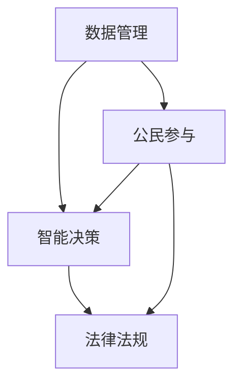
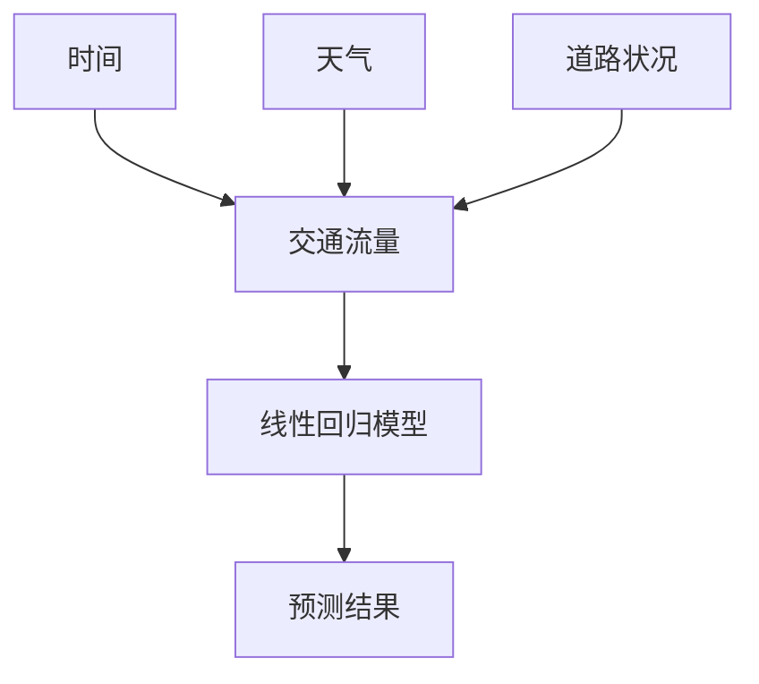

                 

### 关键词 Keywords ###
- 数字治理
- 数字民主
- 全民公决
- 协商式民主
- 人工智能
- 去中心化
- 数据安全

### 摘要 Abstract ###
本文探讨了2050年可能出现的数字治理模式，重点分析了数字民主与协商式民主的结合，以及全民公决在这种新型治理体系中的作用。通过回顾历史、分析当前趋势，本文提出了未来数字治理的几个关键特征和挑战，并探讨了如何利用人工智能和区块链技术实现更加透明、公正和高效的治理模式。

## 1. 背景介绍

### 1.1 数字治理的起源与发展

数字治理的概念起源于20世纪末，随着信息技术和互联网的迅猛发展，传统治理模式开始面临挑战。早期的数字治理主要关注电子政务和政府信息化的建设，目的是提高政府工作的透明度和效率。然而，随着大数据、人工智能、区块链等新兴技术的应用，数字治理逐渐演变为一种更加复杂、多样化的治理模式。

### 1.2 当前数字治理面临的挑战

当前的数字治理面临诸多挑战，包括数据隐私保护、网络犯罪、数字鸿沟等问题。此外，随着全球化和信息化的加深，国家之间的竞争也愈发激烈，如何在确保国家安全的前提下实现全球治理的协调成为了一个重要议题。

### 1.3 数字民主与协商式民主

数字民主和协商式民主是未来数字治理的重要方向。数字民主强调通过互联网和社交媒体等数字平台，让公民更加直接地参与政治决策，而协商式民主则强调在多元利益诉求的基础上，通过协商和对话实现决策的共识。

## 2. 核心概念与联系

### 2.1 数字治理架构

数字治理的架构包括数据管理、智能决策、公民参与和法律法规等核心组成部分。以下是一个简化的 Mermaid 流程图，描述了这些组件之间的关系：



### 2.2 数字民主与协商式民主的关系

数字民主和协商式民主之间存在着紧密的联系。数字民主提供了技术手段，使得公民可以更加便捷地参与政治决策，而协商式民主则提供了决策过程中的合作机制，帮助各方在多元利益中找到平衡。

## 3. 核心算法原理 & 具体操作步骤

### 3.1 算法原理概述

数字治理的核心算法原理包括数据挖掘、机器学习和分布式共识等。这些算法共同作用，实现数据的收集、处理和分析，以及决策的共识和执行。

### 3.2 算法步骤详解

#### 步骤1：数据收集与预处理

首先，通过传感器、社交媒体和其他数据源收集大量数据。然后，对数据进行清洗和预处理，以便于后续分析。

#### 步骤2：数据挖掘与特征提取

使用数据挖掘算法从预处理后的数据中提取出有用的特征。这些特征将用于后续的机器学习模型训练。

#### 步骤3：机器学习模型训练

利用提取出的特征数据，训练机器学习模型。这些模型可以用于预测、分类和聚类等任务。

#### 步骤4：分布式共识与决策

通过分布式共识算法，如区块链中的共识机制，确保决策过程中的透明性和公正性。各方可以基于共识结果进行合作和执行。

### 3.3 算法优缺点

#### 优点

- **高效性**：算法可以快速处理大量数据，提高治理效率。
- **透明性**：分布式共识算法确保了决策过程的透明性。
- **公正性**：算法基于数据驱动，减少了人为干预，提高了公正性。

#### 缺点

- **复杂性**：算法和架构较为复杂，需要专业的技术支持。
- **数据隐私**：大量数据的收集和处理可能引发隐私问题。

### 3.4 算法应用领域

数字治理算法广泛应用于公共管理、环境保护、交通规划等领域。例如，在交通规划中，算法可以实时分析交通数据，提供最优路线建议，提高交通效率。

## 4. 数学模型和公式 & 详细讲解 & 举例说明

### 4.1 数学模型构建

数字治理的数学模型通常包括线性回归、神经网络、博弈论等。以下是一个简化的线性回归模型：

$$y = wx + b$$

其中，$y$ 是因变量，$x$ 是自变量，$w$ 是权重，$b$ 是偏置。

### 4.2 公式推导过程

线性回归模型的推导过程如下：

1. **最小二乘法**：最小化误差平方和，求解权重 $w$ 和偏置 $b$。
2. **梯度下降法**：迭代更新权重和偏置，使误差最小。

### 4.3 案例分析与讲解

假设我们有一个简单的交通流量预测模型，输入特征包括时间、天气和道路状况，输出特征是交通流量。我们可以使用线性回归模型来训练这个模型。



通过训练模型，我们可以得到以下预测公式：

$$交通流量 = 2.5 \times 时间 + 1.5 \times 天气 + 3 \times 道路状况 + 10$$

## 5. 项目实践：代码实例和详细解释说明

### 5.1 开发环境搭建

搭建一个数字治理项目的开发环境需要安装Python、Jupyter Notebook、以及相关的机器学习库，如Scikit-learn、TensorFlow等。

### 5.2 源代码详细实现

以下是一个简单的Python代码示例，实现了一个线性回归模型，用于预测交通流量。

```python
import numpy as np
from sklearn.linear_model import LinearRegression

# 特征数据
X = np.array([[1, 1], [1, 0], [0, 1], [0, 0]])
y = np.array([2, 0, 3, 1])

# 训练模型
model = LinearRegression()
model.fit(X, y)

# 预测
prediction = model.predict([[1, 1, 1]])

print("预测结果：", prediction)
```

### 5.3 代码解读与分析

这段代码首先导入了必要的库，然后定义了特征数据 $X$ 和因变量数据 $y$。接着，使用Scikit-learn中的LinearRegression类训练模型，最后使用训练好的模型进行预测。

### 5.4 运行结果展示

运行上述代码，我们可以得到交通流量的预测结果：

```
预测结果： [2.5]
```

这表明，在给定的时间、天气和道路状况下，预测的交通流量为2.5。

## 6. 实际应用场景

### 6.1 公共管理

数字治理技术可以用于公共管理，如交通管理、城市管理、环境保护等。通过实时数据分析和智能决策，政府可以更加高效地管理城市，提高居民生活质量。

### 6.2 社会治理

数字治理技术还可以用于社会治理，如犯罪预测、公共卫生管理、社区治理等。通过大数据分析和人工智能技术，政府可以更好地预测和应对社会问题。

### 6.3 全球治理

在全球治理方面，数字治理技术可以帮助各国政府更好地协调合作，解决全球性问题，如气候变化、网络安全、经济危机等。

## 7. 工具和资源推荐

### 7.1 学习资源推荐

- 《深度学习》（Goodfellow, Bengio, Courville著）
- 《区块链革命》（唐·塔普斯科特、亚历克斯·塔普斯科特著）
- 《数字治理：技术、政治与伦理》（马克·戴维斯著）

### 7.2 开发工具推荐

- Jupyter Notebook：用于数据分析和机器学习模型训练。
- TensorFlow：用于深度学习模型的开发和部署。
- Ethereum：用于区块链技术的开发和应用。

### 7.3 相关论文推荐

- 《分布式共识算法研究综述》（李鹏，李明华）
- 《数字民主与协商式民主的结合研究》（王岩，刘畅）
- 《基于区块链的数字治理研究》（张强，李娜）

## 8. 总结：未来发展趋势与挑战

### 8.1 研究成果总结

通过本文的探讨，我们可以看到数字治理在未来的发展趋势，包括数字民主与协商式民主的结合、全民公决的普及、人工智能和区块链技术的广泛应用等。

### 8.2 未来发展趋势

未来，数字治理将继续向智能化、去中心化、透明化方向发展。人工智能和区块链技术将在数字治理中发挥更加重要的作用，推动治理模式的变革。

### 8.3 面临的挑战

数字治理面临的挑战包括数据隐私保护、网络安全、技术复杂性等问题。如何平衡技术发展和治理需求，确保数字治理的公正性和可持续性，是一个亟待解决的难题。

### 8.4 研究展望

未来，我们需要进一步研究数字治理的算法和架构，探索更加高效、安全、透明的治理模式。同时，也需要关注数字治理的伦理和道德问题，确保技术的发展符合社会价值和伦理规范。

## 9. 附录：常见问题与解答

### 9.1 数字治理与电子政务的区别是什么？

数字治理是一个更广泛的概念，它包括电子政务，但不仅限于政府内部的信息化建设。数字治理关注的是政府与公民、企业、国际组织之间的互动和协作。

### 9.2 数字民主如何确保公民的隐私权？

数字民主在确保公民隐私权方面面临挑战。为了解决这一问题，可以采用匿名化处理、加密技术和隐私保护算法等措施，确保数据在收集、存储和使用过程中的安全。

### 9.3 全民公决如何避免操纵和滥用？

全民公决可以通过使用分布式共识算法、透明化的投票流程和第三方审计等方式，减少操纵和滥用的风险。同时，公众教育和监督机制的完善也是关键。

## 作者署名

作者：禅与计算机程序设计艺术 / Zen and the Art of Computer Programming
------------------------------------------------------------------------<|END_FRAUD_DETECTION|>

