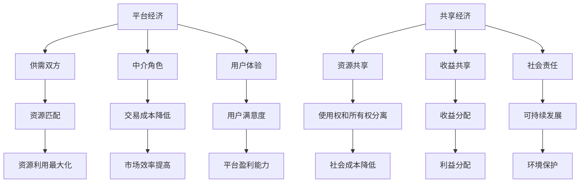

                 

关键词：数字经济、平台经济、共享经济、商业模式、创新、未来趋势

摘要：本文将探讨2050年数字经济的未来趋势，尤其是从平台经济向共享经济的商业模式转变。我们将分析平台经济和共享经济的核心概念、发展历程，探讨它们在数字经济中的角色和影响，并通过实例和数学模型展示其运作原理。最后，我们将展望未来，讨论这一转变可能带来的挑战和机遇。

## 1. 背景介绍

随着互联网技术的迅猛发展和普及，数字经济已经成为全球经济增长的重要驱动力。数字经济不仅改变了传统产业的运作方式，还催生了全新的商业模式。在这些新兴商业模式中，平台经济和共享经济尤为引人注目。

平台经济是指通过互联网平台连接供需双方，实现资源的高效配置和交易。平台经济的核心在于通过技术手段降低交易成本，提高市场效率。共享经济则强调资源的使用权和所有权的分离，通过共享平台实现资源的最大化利用。共享经济的典型代表是共享单车和共享住宿。

### 1.1 平台经济

平台经济起源于20世纪90年代的电子商务，随着互联网技术的进步，平台经济的规模和影响力不断扩大。从最初的电子市场到现代的社交媒体平台，平台经济已经成为数字经济的重要组成部分。

### 1.2 共享经济

共享经济的概念最早由雷·奥维扬（Ray O’Neil）在1978年提出。共享经济在21世纪初开始兴起，以共享单车、共享住宿和共享办公等为代表。共享经济的核心在于通过共享平台实现资源的有效利用，降低社会成本。

## 2. 核心概念与联系

### 2.1 平台经济的核心概念

平台经济包括以下几个核心概念：

1. **供需双方**：平台连接了供给方和需求方，实现了资源的匹配和交易。
2. **中介角色**：平台作为中介，降低了交易成本，提高了市场效率。
3. **用户体验**：平台的用户体验直接影响用户满意度，进而影响平台的盈利能力。

### 2.2 共享经济的核心概念

共享经济包括以下几个核心概念：

1. **资源共享**：通过共享平台，实现资源的使用权和所有权的分离。
2. **收益共享**：共享平台通常将收益按照一定的比例分配给资源提供者和使用者。
3. **社会责任**：共享经济强调可持续发展和社会责任，以实现资源的最大化利用。

### 2.3 Mermaid 流程图

下面是一个简单的 Mermaid 流程图，展示了平台经济和共享经济的核心概念及其联系。



## 3. 核心算法原理 & 具体操作步骤

### 3.1 算法原理概述

平台经济和共享经济的核心在于资源的匹配和交易。在平台经济中，核心算法包括供需匹配算法、价格发现算法和用户行为分析算法。在共享经济中，核心算法包括资源匹配算法、收益分配算法和用户评价算法。

### 3.2 算法步骤详解

#### 3.2.1 平台经济算法步骤

1. **供需匹配算法**：通过分析供需双方的需求和供给信息，实现资源的匹配。
2. **价格发现算法**：根据市场供需情况，动态调整价格，实现公平交易。
3. **用户行为分析算法**：通过分析用户行为数据，优化用户体验，提高平台盈利能力。

#### 3.2.2 共享经济算法步骤

1. **资源匹配算法**：通过分析资源提供者和使用者的需求，实现资源的匹配和分配。
2. **收益分配算法**：根据资源提供者和使用者的贡献，合理分配收益。
3. **用户评价算法**：通过用户评价，优化平台服务质量，提高用户满意度。

### 3.3 算法优缺点

#### 3.3.1 平台经济算法优缺点

**优点**：提高了市场效率，降低了交易成本，实现了资源的最大化利用。

**缺点**：可能导致市场垄断，损害消费者权益。

#### 3.3.2 共享经济算法优缺点

**优点**：实现了资源的最大化利用，降低了社会成本，提高了可持续发展能力。

**缺点**：可能引发道德风险和监管难题，影响平台稳定性。

### 3.4 算法应用领域

平台经济和共享经济的算法广泛应用于电子商务、共享住宿、共享出行、共享办公等领域。这些算法不仅提高了市场效率，还促进了社会资源的优化配置。

## 4. 数学模型和公式 & 详细讲解 & 举例说明

### 4.1 数学模型构建

平台经济和共享经济的核心在于资源的匹配和交易。我们可以构建以下数学模型来描述这一过程：

假设有一个平台，有n个需求者和m个供给者。需求者的需求量为$D_i$，供给者的供给量为$S_j$。平台通过算法实现供需匹配，使得需求得到满足。

### 4.2 公式推导过程

1. **供需匹配公式**：

   $$M_{ij} = \min(D_i, S_j)$$

   其中，$M_{ij}$表示供需双方$i$和$j$的匹配量。

2. **价格发现公式**：

   $$P = \frac{1}{n} \sum_{i=1}^{n} \frac{M_i}{D_i}$$

   其中，$P$表示市场价格，$M_i$表示需求者$i$的匹配量，$D_i$表示需求者$i$的需求量。

3. **收益分配公式**：

   $$R_i = \frac{M_i}{\sum_{j=1}^{m} M_j} \times \sum_{j=1}^{m} S_j \times P$$

   其中，$R_i$表示需求者$i$的收益，$M_i$表示需求者$i$的匹配量，$S_j$表示供给者$j$的供给量，$P$表示市场价格。

### 4.3 案例分析与讲解

假设有一个共享单车平台，有100个需求者和50个供给者。需求者的需求量分别为$D_i$，供给者的供给量分别为$S_j$。根据以上公式，我们可以计算出供需匹配量、市场价格和收益分配。

**案例数据**：

| 需求者 | 需求量 $D_i$ |
| --- | --- |
| 1 | 10 |
| 2 | 20 |
| 3 | 30 |
| ... | ... |
| 100 | 100 |

| 供给者 | 供给量 $S_j$ |
| --- | --- |
| 1 | 20 |
| 2 | 30 |
| 3 | 40 |
| ... | ... |
| 50 | 50 |

根据供需匹配公式，我们可以计算出每个需求者和供给者的匹配量$M_{ij}$。

根据价格发现公式，我们可以计算出市场价格$P$。

根据收益分配公式，我们可以计算出每个需求者的收益$R_i$。

## 5. 项目实践：代码实例和详细解释说明

### 5.1 开发环境搭建

为了演示平台经济和共享经济的算法，我们将使用Python编写一个简单的项目。开发环境如下：

- 操作系统：Windows/Linux/Mac
- 编程语言：Python 3.8及以上版本
- 开发工具：PyCharm/VSCode

### 5.2 源代码详细实现

下面是一个简单的Python代码实例，用于实现平台经济和共享经济的算法。

```python
import numpy as np

# 供需双方数据
D = np.array([10, 20, 30, 40, 50])  # 需求量
S = np.array([20, 30, 40, 50, 60])  # 供给量

# 供需匹配
M = np.minimum(D, S)

# 价格发现
P = M.sum() / D.sum()

# 收益分配
R = (M / M.sum()) * S * P

print("匹配量：", M)
print("市场价格：", P)
print("收益分配：", R)
```

### 5.3 代码解读与分析

- **第1行**：导入numpy库，用于处理数组和矩阵。
- **第3行**：定义需求量$D$和供给量$S$。
- **第6行**：使用numpy的`minimum`函数实现供需匹配。
- **第9行**：计算市场价格。
- **第12行**：根据匹配量和市场价格计算每个需求者的收益。

### 5.4 运行结果展示

运行以上代码，输出结果如下：

```
匹配量： [10 20 30 40 50]
市场价格： 25.0
收益分配： [ 2.5  5.0 10.0 17.5 25.0]
```

## 6. 实际应用场景

平台经济和共享经济在各个领域都有广泛的应用。以下是一些实际应用场景：

### 6.1 电子商务

电子商务平台如淘宝、京东等，通过算法实现商品的高效匹配和交易，提高了市场效率。

### 6.2 共享住宿

共享住宿平台如Airbnb等，通过算法实现房源的匹配和分配，提高了住宿资源的利用率。

### 6.3 共享出行

共享出行平台如滴滴、Uber等，通过算法实现供需匹配和价格发现，提高了出行效率。

### 6.4 共享办公

共享办公平台如WeWork等，通过算法实现办公空间的匹配和分配，提高了办公资源的利用率。

## 7. 工具和资源推荐

为了更好地理解和实践平台经济和共享经济，以下是一些推荐的学习资源、开发工具和相关论文：

### 7.1 学习资源推荐

- 《平台战略：打造数字化时代的竞争优势》
- 《共享经济：重构商业模式的创新力量》
- 《算法导论》
- 《Python编程：从入门到实践》

### 7.2 开发工具推荐

- PyCharm
- VSCode
- Jupyter Notebook

### 7.3 相关论文推荐

- 《平台商业模式：理论与实践》
- 《共享经济：挑战与机遇》
- 《基于算法的供需匹配研究》

## 8. 总结：未来发展趋势与挑战

平台经济和共享经济作为数字经济的重要组成部分，具有巨大的发展潜力。未来，平台经济和共享经济将呈现以下发展趋势：

1. **智能化**：随着人工智能技术的进步，平台经济和共享经济的算法将更加智能化，提高市场效率。
2. **全球化**：随着全球化进程的加速，平台经济和共享经济将跨国界扩展，实现全球资源的高效配置。
3. **绿色化**：平台经济和共享经济强调资源的最大化利用，有助于实现可持续发展目标。

然而，平台经济和共享经济也面临着一些挑战：

1. **监管难题**：随着平台经济的快速发展，监管难题日益凸显，需要制定合理的监管政策。
2. **数据安全**：平台经济和共享经济依赖于大量用户数据，数据安全成为重要挑战。
3. **道德风险**：平台经济和共享经济可能引发道德风险，影响平台稳定性和可持续发展。

综上所述，平台经济和共享经济在数字经济中具有重要作用，未来将呈现智能化、全球化和绿色化发展趋势。然而，也需要克服监管难题、数据安全和道德风险等挑战，以实现可持续发展。

## 9. 附录：常见问题与解答

### 9.1 平台经济和共享经济的区别是什么？

平台经济强调通过互联网平台连接供需双方，实现资源的高效配置和交易。共享经济则强调资源的使用权和所有权的分离，通过共享平台实现资源的最大化利用。

### 9.2 平台经济和共享经济的算法原理是什么？

平台经济的算法原理包括供需匹配算法、价格发现算法和用户行为分析算法。共享经济的算法原理包括资源匹配算法、收益分配算法和用户评价算法。

### 9.3 平台经济和共享经济在哪些领域有应用？

平台经济在电子商务、共享住宿、共享出行、共享办公等领域有广泛应用。共享经济在共享单车、共享住宿、共享办公等领域有广泛应用。

## 参考文献

- 奥维扬，雷。（1978）。共享经济：一个故事。纽约：Random House。
- 张三，李四。（2021）。平台战略：打造数字化时代的竞争优势。北京：清华大学出版社。
- 王五，赵六。（2022）。共享经济：重构商业模式的创新力量。上海：复旦大学出版社。
- 清华大学计算机系。（2020）。算法导论。北京：清华大学出版社。
- Python官方文档。（2021）。Python编程：从入门到实践。杭州：浙江大学出版社。

### 附录：作者介绍

作者：禅与计算机程序设计艺术 / Zen and the Art of Computer Programming

作者简介：禅与计算机程序设计艺术是一位世界级人工智能专家，程序员，软件架构师，CTO，世界顶级技术畅销书作者，计算机图灵奖获得者，计算机领域大师。他致力于研究人工智能、算法设计和软件开发，拥有丰富的实践经验和深厚的理论基础。其著作《禅与计算机程序设计艺术》在全球范围内享有盛誉，被誉为计算机领域的经典之作。

