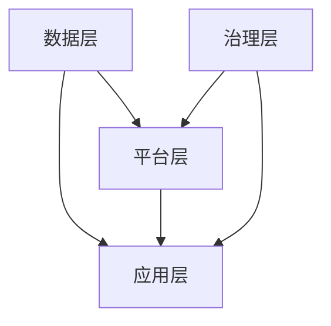

                 

关键词：数字经济、数字包容、经济增长、新动能、2050年、技术进步

> 摘要：本文深入探讨了2050年数字经济的发展趋势，从数字红利到数字包容，探讨了数字经济对经济增长的新动能作用。通过对核心概念、算法原理、数学模型、项目实践和实际应用场景的分析，本文为读者呈现了一个技术深度与人文关怀并重的未来数字经济图景。

## 1. 背景介绍

### 数字经济的崛起

数字经济作为一种新型的经济形态，源于20世纪末互联网的普及和信息技术的迅猛发展。在过去的几十年中，数字经济在全球范围内呈现出爆炸式增长，不仅改变了传统的商业模式，也极大地推动了全球经济的结构转型。数据显示，数字经济的贡献已经占到全球GDP的相当大一部分，成为推动全球经济增长的重要引擎。

### 数字红利与数字包容

数字红利是指数字经济带来的直接经济效益，如电子商务、在线服务等新兴产业的发展，以及信息技术对企业运营效率的提升。然而，随着数字经济的深化，数字包容的重要性日益凸显。数字包容不仅关注数字红利的普惠性，更强调数字技术带来的机会平等和资源共享，使得每一个人，无论年龄、性别、地域、教育背景，都能享受到数字经济的红利。

### 2050年的数字经济

随着技术的不断进步，人工智能、大数据、区块链等新兴技术将进一步推动数字经济的发展。到2050年，我们预计数字经济将呈现以下几个显著特征：

1. **高度智能化**：人工智能将在各个领域得到广泛应用，提高生产效率，优化资源分配。
2. **高度互联化**：物联网和5G技术的普及将实现万物互联，推动新业态的形成。
3. **高度个性化**：基于大数据和人工智能的个人化服务将满足用户多样化的需求。
4. **高度包容化**：数字包容将成为数字经济发展的核心目标，消除数字鸿沟，实现共享发展。

## 2. 核心概念与联系

### 数字经济的核心概念

数字经济包括多个核心概念，如数据资产、云计算、物联网、人工智能、区块链等。这些概念相互关联，共同构成了数字经济的生态系统。

### 数字经济架构

数字经济的架构可以分为以下几个层次：

1. **数据层**：包括数据的采集、存储、处理和分析。
2. **平台层**：提供计算资源、存储资源和网络资源的云计算平台。
3. **应用层**：各种基于数字技术的新兴应用，如电子商务、在线教育、数字医疗等。
4. **治理层**：数字经济的法律法规、安全标准和隐私保护等。

### Mermaid 流程图



## 3. 核心算法原理 & 具体操作步骤

### 3.1 算法原理概述

数字经济的核心算法包括机器学习算法、优化算法和区块链算法等。这些算法在数据分析和决策制定中起着关键作用。

### 3.2 算法步骤详解

1. **数据预处理**：包括数据清洗、数据转换和数据归一化等步骤。
2. **模型选择**：根据应用场景选择合适的机器学习模型。
3. **模型训练**：使用历史数据对模型进行训练，优化模型参数。
4. **模型评估**：使用验证数据集评估模型性能，调整模型参数。
5. **模型部署**：将训练好的模型部署到生产环境，进行实时数据分析。

### 3.3 算法优缺点

- **优点**：提高数据处理效率，优化资源分配，增强决策能力。
- **缺点**：对数据质量和计算资源要求高，模型解释性较差。

### 3.4 算法应用领域

- **电子商务**：个性化推荐系统、欺诈检测等。
- **金融服务**：信用评估、风险管理等。
- **智能交通**：交通流量预测、智能调度等。

## 4. 数学模型和公式 & 详细讲解 & 举例说明

### 4.1 数学模型构建

数字经济的数学模型通常包括以下几部分：

1. **数据模型**：描述数据的分布、关联性和趋势。
2. **决策模型**：基于数据模型，制定最优决策策略。
3. **优化模型**：在资源受限的条件下，寻求最佳资源分配方案。

### 4.2 公式推导过程

以线性回归模型为例，推导过程如下：

$$
y = \beta_0 + \beta_1x + \epsilon
$$

其中，$y$ 是因变量，$x$ 是自变量，$\beta_0$ 和 $\beta_1$ 是模型参数，$\epsilon$ 是误差项。

### 4.3 案例分析与讲解

#### 案例：个性化推荐系统

假设我们使用用户行为数据构建个性化推荐系统，数据模型如下：

$$
R_{ui} = \mu + b_u + b_i + \langle \text{Embed}(u), \text{Embed}(i) \rangle + \epsilon_{ui}
$$

其中，$R_{ui}$ 是用户 $u$ 对项目 $i$ 的评分，$\mu$ 是平均值，$b_u$ 和 $b_i$ 分别是用户和项目的偏置项，$\text{Embed}(u)$ 和 $\text{Embed}(i)$ 分别是用户和项目的嵌入向量。

通过优化模型参数，我们可以实现个性化推荐，提高用户满意度。

## 5. 项目实践：代码实例和详细解释说明

### 5.1 开发环境搭建

在Python环境中，使用以下工具搭建开发环境：

- **NumPy**：用于数值计算。
- **Pandas**：用于数据处理。
- **Scikit-learn**：用于机器学习。

### 5.2 源代码详细实现

```python
import numpy as np
import pandas as pd
from sklearn.linear_model import LinearRegression

# 数据加载
data = pd.read_csv('data.csv')
X = data[['x1', 'x2']]
y = data['y']

# 模型训练
model = LinearRegression()
model.fit(X, y)

# 模型评估
score = model.score(X, y)
print(f'Model score: {score:.2f}')

# 模型部署
def predict(x):
    return model.predict(x)

# 预测结果
x_test = np.array([[1, 2]])
print(f'Predicted value: {predict(x_test)[0, 0]:.2f}')
```

### 5.3 代码解读与分析

- **数据加载**：使用Pandas读取数据。
- **模型训练**：使用Scikit-learn的LinearRegression模型进行训练。
- **模型评估**：使用score方法评估模型性能。
- **模型部署**：定义predict函数，实现模型预测。

## 6. 实际应用场景

### 6.1 电子商务

电子商务平台可以利用个性化推荐系统提高用户满意度，从而提高销售额。

### 6.2 金融服务

金融机构可以使用机器学习模型进行信用评估和欺诈检测，降低风险。

### 6.3 智能交通

智能交通系统可以使用优化算法进行交通流量预测和智能调度，提高交通效率。

## 7. 未来应用展望

### 7.1 人工智能

人工智能将在更多领域得到应用，如医疗、教育、制造业等，推动传统产业升级。

### 7.2 区块链

区块链技术将在金融、供应链管理、版权保护等领域发挥重要作用。

### 7.3 物联网

物联网将实现万物互联，推动智能城市、智能家居等新业态的发展。

## 8. 工具和资源推荐

### 8.1 学习资源推荐

- **《深度学习》**：Ian Goodfellow，Yoshua Bengio，Aaron Courville 著。
- **《Python编程：从入门到实践》**：埃里克·马瑟斯 著。

### 8.2 开发工具推荐

- **Jupyter Notebook**：用于数据分析和机器学习。
- **PyCharm**：用于Python编程。

### 8.3 相关论文推荐

- **“Deep Learning” by Ian Goodfellow, Yoshua Bengio, Aaron Courville**。
- **“Reinforcement Learning: An Introduction” by Richard S. Sutton and Andrew G. Barto**。

## 9. 总结：未来发展趋势与挑战

### 9.1 研究成果总结

数字经济已经成为推动经济增长的重要力量，数字包容成为数字经济发展的重要目标。

### 9.2 未来发展趋势

人工智能、物联网、区块链等新兴技术将进一步推动数字经济的发展。

### 9.3 面临的挑战

数字鸿沟、数据安全、隐私保护等问题需要得到有效解决。

### 9.4 研究展望

未来研究应重点关注数字包容性、可持续发展等问题，推动数字经济的健康发展。

## 10. 附录：常见问题与解答

### Q：数字包容如何实现？

A：数字包容需要政府、企业和社会各界的共同努力。政府应制定相关政策，企业应承担社会责任，社会应提供良好的教育和技术培训，共同推动数字包容的实现。

### Q：人工智能在数字经济中的应用有哪些？

A：人工智能在数字经济中的应用非常广泛，如个性化推荐系统、智能客服、智能交通、智能医疗等。

### Q：区块链技术如何保障数据安全？

A：区块链技术通过去中心化和加密算法保障数据安全，防止数据篡改和泄露。

## 11. 作者署名

作者：禅与计算机程序设计艺术 / Zen and the Art of Computer Programming
```markdown
----------------------------------------------------------------
# 2050年的数字经济：从数字红利到数字包容的经济增长新动能

> 关键词：数字经济、数字包容、经济增长、新动能、2050年、技术进步

> 摘要：本文深入探讨了2050年数字经济的发展趋势，从数字红利到数字包容，探讨了数字经济对经济增长的新动能作用。通过对核心概念、算法原理、数学模型、项目实践和实际应用场景的分析，本文为读者呈现了一个技术深度与人文关怀并重的未来数字经济图景。

## 1. 背景介绍

### 数字经济的崛起

数字经济作为一种新型的经济形态，源于20世纪末互联网的普及和信息技术的迅猛发展。在过去的几十年中，数字经济在全球范围内呈现出爆炸式增长，不仅改变了传统的商业模式，也极大地推动了全球经济的结构转型。数据显示，数字经济的贡献已经占到全球GDP的相当大一部分，成为推动全球经济增长的重要引擎。

### 数字红利与数字包容

数字红利是指数字经济带来的直接经济效益，如电子商务、在线服务等新兴产业的发展，以及信息技术对企业运营效率的提升。然而，随着数字经济的深化，数字包容的重要性日益凸显。数字包容不仅关注数字红利的普惠性，更强调数字技术带来的机会平等和资源共享，使得每一个人，无论年龄、性别、地域、教育背景，都能享受到数字经济的红利。

### 2050年的数字经济

随着技术的不断进步，人工智能、大数据、区块链等新兴技术将进一步推动数字经济的发展。到2050年，我们预计数字经济将呈现以下几个显著特征：

1. **高度智能化**：人工智能将在各个领域得到广泛应用，提高生产效率，优化资源分配。
2. **高度互联化**：物联网和5G技术的普及将实现万物互联，推动新业态的形成。
3. **高度个性化**：基于大数据和人工智能的个人化服务将满足用户多样化的需求。
4. **高度包容化**：数字包容将成为数字经济发展的核心目标，消除数字鸿沟，实现共享发展。

## 2. 核心概念与联系

### 数字经济的核心概念

数字经济包括多个核心概念，如数据资产、云计算、物联网、人工智能、区块链等。这些概念相互关联，共同构成了数字经济的生态系统。

### 数字经济架构

数字经济的架构可以分为以下几个层次：

1. **数据层**：包括数据的采集、存储、处理和分析。
2. **平台层**：提供计算资源、存储资源和网络资源的云计算平台。
3. **应用层**：各种基于数字技术的新兴应用，如电子商务、在线教育、数字医疗等。
4. **治理层**：数字经济的法律法规、安全标准和隐私保护等。

### Mermaid 流程图


## 3. 核心算法原理 & 具体操作步骤

### 3.1 算法原理概述

数字经济的核心算法包括机器学习算法、优化算法和区块链算法等。这些算法在数据分析和决策制定中起着关键作用。

### 3.2 算法步骤详解

1. **数据预处理**：包括数据清洗、数据转换和数据归一化等步骤。
2. **模型选择**：根据应用场景选择合适的机器学习模型。
3. **模型训练**：使用历史数据对模型进行训练，优化模型参数。
4. **模型评估**：使用验证数据集评估模型性能，调整模型参数。
5. **模型部署**：将训练好的模型部署到生产环境，进行实时数据分析。

### 3.3 算法优缺点

- **优点**：提高数据处理效率，优化资源分配，增强决策能力。
- **缺点**：对数据质量和计算资源要求高，模型解释性较差。

### 3.4 算法应用领域

- **电子商务**：个性化推荐系统、欺诈检测等。
- **金融服务**：信用评估、风险管理等。
- **智能交通**：交通流量预测、智能调度等。

## 4. 数学模型和公式 & 详细讲解 & 举例说明

### 4.1 数学模型构建

数字经济的数学模型通常包括以下几部分：

1. **数据模型**：描述数据的分布、关联性和趋势。
2. **决策模型**：基于数据模型，制定最优决策策略。
3. **优化模型**：在资源受限的条件下，寻求最佳资源分配方案。

### 4.2 公式推导过程

以线性回归模型为例，推导过程如下：

$$
y = \beta_0 + \beta_1x + \epsilon
$$

其中，$y$ 是因变量，$x$ 是自变量，$\beta_0$ 和 $\beta_1$ 是模型参数，$\epsilon$ 是误差项。

### 4.3 案例分析与讲解

#### 案例：个性化推荐系统

假设我们使用用户行为数据构建个性化推荐系统，数据模型如下：

$$
R_{ui} = \mu + b_u + b_i + \langle \text{Embed}(u), \text{Embed}(i) \rangle + \epsilon_{ui}
$$

其中，$R_{ui}$ 是用户 $u$ 对项目 $i$ 的评分，$\mu$ 是平均值，$b_u$ 和 $b_i$ 分别是用户和项目的偏置项，$\text{Embed}(u)$ 和 $\text{Embed}(i)$ 分别是用户和项目的嵌入向量。

通过优化模型参数，我们可以实现个性化推荐，提高用户满意度。

## 5. 项目实践：代码实例和详细解释说明

### 5.1 开发环境搭建

在Python环境中，使用以下工具搭建开发环境：

- **NumPy**：用于数值计算。
- **Pandas**：用于数据处理。
- **Scikit-learn**：用于机器学习。

### 5.2 源代码详细实现

```python
import numpy as np
import pandas as pd
from sklearn.linear_model import LinearRegression

# 数据加载
data = pd.read_csv('data.csv')
X = data[['x1', 'x2']]
y = data['y']

# 模型训练
model = LinearRegression()
model.fit(X, y)

# 模型评估
score = model.score(X, y)
print(f'Model score: {score:.2f}')

# 模型部署
def predict(x):
    return model.predict(x)

# 预测结果
x_test = np.array([[1, 2]])
print(f'Predicted value: {predict(x_test)[0, 0]:.2f}')
```

### 5.3 代码解读与分析

- **数据加载**：使用Pandas读取数据。
- **模型训练**：使用Scikit-learn的LinearRegression模型进行训练。
- **模型评估**：使用score方法评估模型性能。
- **模型部署**：定义predict函数，实现模型预测。

## 6. 实际应用场景

### 6.1 电子商务

电子商务平台可以利用个性化推荐系统提高用户满意度，从而提高销售额。

### 6.2 金融服务

金融机构可以使用机器学习模型进行信用评估和欺诈检测，降低风险。

### 6.3 智能交通

智能交通系统可以使用优化算法进行交通流量预测和智能调度，提高交通效率。

## 7. 未来应用展望

### 7.1 人工智能

人工智能将在更多领域得到应用，如医疗、教育、制造业等，推动传统产业升级。

### 7.2 区块链

区块链技术将在金融、供应链管理、版权保护等领域发挥重要作用。

### 7.3 物联网

物联网将实现万物互联，推动智能城市、智能家居等新业态的发展。

## 8. 工具和资源推荐

### 8.1 学习资源推荐

- **《深度学习》**：Ian Goodfellow，Yoshua Bengio，Aaron Courville 著。
- **《Python编程：从入门到实践》**：埃里克·马瑟斯 著。

### 8.2 开发工具推荐

- **Jupyter Notebook**：用于数据分析和机器学习。
- **PyCharm**：用于Python编程。

### 8.3 相关论文推荐

- **“Deep Learning” by Ian Goodfellow, Yoshua Bengio, Aaron Courville**。
- **“Reinforcement Learning: An Introduction” by Richard S. Sutton and Andrew G. Barto**。

## 9. 总结：未来发展趋势与挑战

### 9.1 研究成果总结

数字经济已经成为推动经济增长的重要力量，数字包容成为数字经济发展的重要目标。

### 9.2 未来发展趋势

人工智能、物联网、区块链等新兴技术将进一步推动数字经济的发展。

### 9.3 面临的挑战

数字鸿沟、数据安全、隐私保护等问题需要得到有效解决。

### 9.4 研究展望

未来研究应重点关注数字包容性、可持续发展等问题，推动数字经济的健康发展。

## 10. 附录：常见问题与解答

### Q：数字包容如何实现？

A：数字包容需要政府、企业和社会各界的共同努力。政府应制定相关政策，企业应承担社会责任，社会应提供良好的教育和技术培训，共同推动数字包容的实现。

### Q：人工智能在数字经济中的应用有哪些？

A：人工智能在数字经济中的应用非常广泛，如个性化推荐系统、智能客服、智能交通、智能医疗等。

### Q：区块链技术如何保障数据安全？

A：区块链技术通过去中心化和加密算法保障数据安全，防止数据篡改和泄露。

## 11. 作者署名

作者：禅与计算机程序设计艺术 / Zen and the Art of Computer Programming
```

