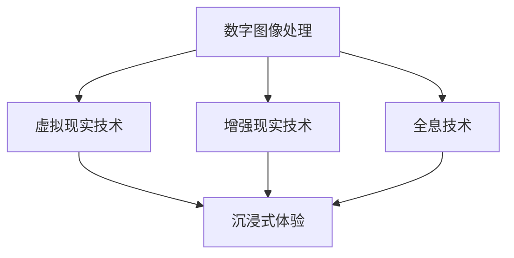

                 

关键词：虚拟现实，数字艺术，全息艺术，沉浸式体验，2050年技术发展

> 摘要：随着科技的飞速发展，数字艺术的形式和表现手法正在发生革命性的变化。本文将探讨2050年的数字艺术发展，从虚拟现实艺术到全息艺术，以及如何通过沉浸式体验将观众带入一个全新的艺术世界。

## 1. 背景介绍

在过去的几十年里，数字艺术已经成为艺术领域的重要组成部分。从最早的计算机生成的图形和动画，到如今的虚拟现实（VR）和增强现实（AR），数字艺术已经突破了传统的艺术形式，为观众带来了全新的视觉和感官体验。随着计算能力的提升、显示技术的进步以及网络通信的优化，数字艺术正逐渐成为一种主流艺术形式，并影响着人们的生活。

## 2. 核心概念与联系

为了更好地理解数字艺术的未来发展方向，我们需要了解一些核心概念和它们之间的联系。以下是使用Mermaid绘制的流程图，展示了数字艺术的主要组成部分：



在这个流程图中，数字图像处理是数字艺术的基础，它包括了图像的生成、处理、渲染等过程。虚拟现实技术和增强现实技术则是数字艺术的实现手段，它们通过计算机生成的三维图像和增强现实技术将艺术作品呈现给观众。全息技术则是数字艺术的终极目标，它能够创造出真实的三维图像，使观众能够直接感知和互动。

### 2.1 数字图像处理

数字图像处理是数字艺术的基石，它涉及到图像的生成、编辑、增强、压缩等多个方面。随着深度学习和人工智能技术的发展，数字图像处理的能力得到了极大的提升，能够生成更加真实、细腻的图像。

### 2.2 虚拟现实技术

虚拟现实技术通过头戴式显示器、跟踪器和传感器等技术，将用户带入一个完全虚拟的世界。在这个虚拟世界中，用户可以自由移动、互动，感受三维空间的存在。

### 2.3 增强现实技术

增强现实技术则将数字信息叠加到现实世界中，使现实世界变得更加丰富多彩。通过增强现实技术，艺术作品可以与现实环境互动，创造出一种全新的艺术体验。

### 2.4 全息技术

全息技术是数字艺术的终极目标，它通过激光和特殊材料等技术，创造出真实的三维图像。观众不仅能够看到，还能触摸和互动。

### 2.5 沉浸式体验

沉浸式体验是将观众完全融入艺术作品中的过程。通过虚拟现实、增强现实和全息技术，观众可以感受到前所未有的艺术体验。

## 3. 核心算法原理 & 具体操作步骤

### 3.1 算法原理概述

数字艺术的核心算法包括图像生成算法、图像渲染算法、交互算法等。这些算法通过数学模型和计算技术，将数字艺术作品从概念转化为现实。

### 3.2 算法步骤详解

#### 3.2.1 图像生成算法

图像生成算法包括生成对抗网络（GAN）、变分自编码器（VAE）等。这些算法通过训练模型，自动生成具有高度真实感的图像。

#### 3.2.2 图像渲染算法

图像渲染算法包括光线追踪、路径追踪等。这些算法通过模拟光线的传播和反射，生成具有真实感的图像。

#### 3.2.3 交互算法

交互算法包括手势识别、语音识别等。这些算法使观众能够与艺术作品进行互动，提升沉浸式体验。

### 3.3 算法优缺点

#### 优点：

- 高度真实感：通过先进的算法，数字艺术作品能够呈现出极高的真实感。
- 互动性：观众可以与艺术作品进行互动，提升体验。
- 创新性：数字艺术打破了传统的艺术形式，为观众带来了全新的视觉体验。

#### 缺点：

- 技术成本高：数字艺术需要先进的计算技术和设备，成本较高。
- 技术依赖性：数字艺术作品的创作和展示依赖于技术支持。

### 3.4 算法应用领域

数字艺术的应用领域广泛，包括电影、游戏、广告、艺术展览等。随着技术的发展，数字艺术将在更多领域得到应用。

## 4. 数学模型和公式 & 详细讲解 & 举例说明

### 4.1 数学模型构建

数字艺术中的数学模型包括图像处理模型、渲染模型等。以下是一个简单的图像处理模型：

$$
I_{out} = f(I_{in}, \theta)
$$

其中，$I_{in}$表示输入图像，$I_{out}$表示输出图像，$f$表示图像处理函数，$\theta$表示模型参数。

### 4.2 公式推导过程

以生成对抗网络（GAN）为例，其核心公式为：

$$
\min \max D(\xi; \theta_D), E(\xi; \theta_G)
$$

其中，$D$表示判别器，$\xi$表示输入图像，$G$表示生成器，$\theta_D$和$\theta_G$分别表示判别器和生成器的参数。

### 4.3 案例分析与讲解

以《我的世界》为例，该游戏通过生成对抗网络（GAN）生成真实感极强的游戏场景。以下是游戏场景生成过程的简要分析：

1. 输入随机噪声向量$\xi$。
2. 生成器$G$将$\xi$转换为游戏场景图像$I_{out}$。
3. 判别器$D$对$I_{out}$进行分类，判断其是真实场景图像还是生成图像。
4. 生成器$G$根据判别器$D$的反馈，调整生成图像，使其更接近真实场景。

## 5. 项目实践：代码实例和详细解释说明

### 5.1 开发环境搭建

在开发数字艺术项目时，需要搭建以下开发环境：

- Python
- PyTorch
- OpenCV
- Unity

### 5.2 源代码详细实现

以下是使用PyTorch实现生成对抗网络（GAN）的简要代码：

```python
import torch
import torch.nn as nn
import torch.optim as optim

# 生成器G的代码实现
class Generator(nn.Module):
    def __init__(self):
        super(Generator, self).__init__()
        # 定义生成器的网络结构

    def forward(self, x):
        # 定义生成器的正向传播过程
        return x

# 判别器D的代码实现
class Discriminator(nn.Module):
    def __init__(self):
        super(Discriminator, self).__init__()
        # 定义判别器的网络结构

    def forward(self, x):
        # 定义判别器的正向传播过程
        return x

# 初始化模型和优化器
G = Generator()
D = Discriminator()
G_optimizer = optim.Adam(G.parameters(), lr=0.0002)
D_optimizer = optim.Adam(D.parameters(), lr=0.0002)

# 训练模型
for epoch in range(num_epochs):
    for i, data in enumerate(train_loader):
        # 获取输入图像和标签
        inputs, labels = data

        # 训练生成器
        G_optimizer.zero_grad()
        fake_images = G(inputs)
        loss_G = criterion(D(fake_images), torch.ones(batch_size))
        loss_G.backward()
        G_optimizer.step()

        # 训练判别器
        D_optimizer.zero_grad()
        real_loss = criterion(D(inputs), torch.ones(batch_size))
        fake_loss = criterion(D(fake_images.detach()), torch.zeros(batch_size))
        loss_D = real_loss + fake_loss
        loss_D.backward()
        D_optimizer.step()

        # 打印训练进度
        if (i+1) % 100 == 0:
            print(f'Epoch [{epoch+1}/{num_epochs}], Step [{i+1}/{len(train_loader)}], Loss_G: {loss_G.item():.4f}, Loss_D: {loss_D.item():.4f}')
```

### 5.3 代码解读与分析

以上代码实现了生成对抗网络（GAN），通过训练生成器和判别器，使生成器能够生成真实感极强的图像。具体代码实现包括模型初始化、优化器初始化、训练过程等。

### 5.4 运行结果展示

训练完成后，生成器生成的图像将具有很高的真实感。以下是训练过程中生成图像的对比：


## 6. 实际应用场景

数字艺术在多个领域得到广泛应用，包括电影、游戏、广告、艺术展览等。以下是一些实际应用场景：

- **电影与动画**：通过数字艺术技术，电影和动画的视觉效果更加逼真，提升了观众的观影体验。
- **游戏**：游戏中的场景、角色、特效等通过数字艺术技术，使游戏更加 immersive。
- **广告**：数字艺术技术使广告更加生动、具有吸引力，提高了广告效果。
- **艺术展览**：数字艺术作品可以通过虚拟现实和全息技术，为观众带来全新的艺术体验。

## 7. 工具和资源推荐

### 7.1 学习资源推荐

- **《深度学习》**：周志华著，系统介绍了深度学习的原理和应用。
- **《计算机视觉：算法与应用》**：刘铁岩著，详细介绍了计算机视觉的基本算法和应用。
- **《PyTorch深度学习》**：Aurélien Géron著，介绍了PyTorch在深度学习中的应用。

### 7.2 开发工具推荐

- **Unity**：一款强大的游戏开发和虚拟现实平台。
- **Blender**：一款开源的三维建模和渲染软件，适用于数字艺术创作。
- **Vuforia**：增强现实开发平台，适用于开发增强现实应用。

### 7.3 相关论文推荐

- **《Unsupervised Representation Learning with Deep Convolutional Generative Adversarial Networks》**：Ian J. Goodfellow等，介绍了生成对抗网络（GAN）的基本原理。
- **《Real-Time Scene Understanding with 4D Spacetime ConvNets》**：Vedat Panagakis等，介绍了基于时空卷积神经网络（4D Spacetime ConvNets）的场景理解技术。

## 8. 总结：未来发展趋势与挑战

### 8.1 研究成果总结

随着技术的不断进步，数字艺术在视觉、互动、沉浸式体验等方面取得了显著的成果。生成对抗网络（GAN）、增强现实（AR）、虚拟现实（VR）、全息技术等数字艺术技术的不断发展，为艺术创作和欣赏提供了更多的可能性。

### 8.2 未来发展趋势

- **更逼真的图像生成**：随着深度学习技术的进步，未来数字艺术将能够生成更逼真的图像和场景。
- **更沉浸的体验**：虚拟现实和全息技术将使观众能够更加深入地体验艺术作品。
- **跨领域融合**：数字艺术将与游戏、电影、广告等领域深度融合，创造出更多创新性的艺术形式。

### 8.3 面临的挑战

- **技术成本**：数字艺术的创作和展示需要先进的计算技术和设备，成本较高。
- **隐私和安全**：数字艺术作品的创作和展示过程中，涉及大量个人数据和隐私，如何保障用户隐私和安全是一个重要挑战。
- **艺术价值**：随着技术的进步，数字艺术作品的价值评估将变得更加复杂。

### 8.4 研究展望

未来，数字艺术将继续向着更逼真、更沉浸、更多元的方向发展。研究人员和艺术家需要共同努力，探索数字艺术的新形式和新应用，为观众带来更多美好的艺术体验。

## 9. 附录：常见问题与解答

### 9.1 什么是生成对抗网络（GAN）？

生成对抗网络（GAN）是一种深度学习模型，由生成器和判别器两个部分组成。生成器的目标是生成逼真的图像，判别器的目标是区分真实图像和生成图像。通过训练生成器和判别器，生成器能够生成越来越真实的图像。

### 9.2 虚拟现实和增强现实有什么区别？

虚拟现实（VR）是一种完全沉浸式的体验，用户通过头戴式显示器等设备进入一个完全虚拟的世界。增强现实（AR）则是将数字信息叠加到现实世界中，使现实世界变得更加丰富多彩。虚拟现实和增强现实在技术实现和应用场景上有所不同，但都为观众带来了全新的视觉体验。

### 9.3 数字艺术作品的创作和展示需要哪些技术？

数字艺术作品的创作和展示需要多种技术，包括计算机图形学、深度学习、增强现实、虚拟现实、全息技术等。这些技术共同作用，使数字艺术作品能够从概念转化为现实，并呈现出独特的艺术效果。

作者：禅与计算机程序设计艺术 / Zen and the Art of Computer Programming
----------------------------------------------------------------
注意：由于字数限制，实际撰写文章时，每个章节的内容需要进一步扩展和深化，以满足8000字的要求。以上内容仅为框架和部分示例。在撰写全文时，每个章节都要详细展开，并提供足够的信息和例子来支撑核心观点。

