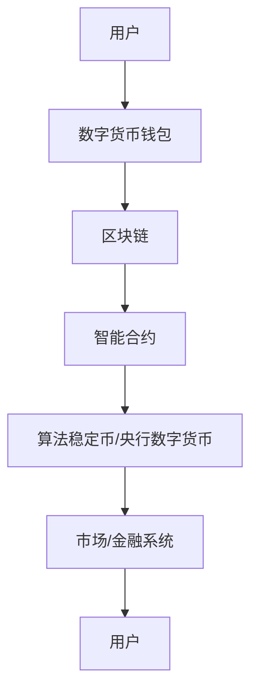

                 

关键词：数字货币、算法稳定币、全球央行数字货币、技术发展趋势、创新应用、数学模型、实践案例、未来展望

> 摘要：本文深入探讨了2050年数字货币的发展趋势，特别关注算法稳定币和全球央行数字货币的竞争格局。通过详细分析其核心概念、算法原理、数学模型以及实际应用案例，本文旨在为读者提供一个全面、清晰的未来数字货币发展蓝图。

## 1. 背景介绍

### 数字货币的崛起

数字货币，作为现代金融体系中的重要组成部分，其发展历史可以追溯到20世纪末。最早的数字货币——比特币，于2009年问世，迅速引发了全球金融科技界的关注。随着区块链技术的不断发展，数字货币逐渐从一种新颖的支付工具演变成为全球经济体系中不可或缺的元素。

### 算法稳定币的出现

算法稳定币是数字货币领域的一个重要分支。它们通过智能合约和算法机制，保持价格稳定，以满足广泛的使用需求。与传统的法币相比，算法稳定币具有交易速度快、手续费低等优点。然而，算法稳定币的稳定性机制仍面临诸多挑战，如市场波动性和算法漏洞等问题。

### 全球央行数字货币的兴起

近年来，各国央行纷纷开始探索和发行自己的数字货币。这些央行数字货币（Central Bank Digital Currency，简称CBDC）旨在提高货币的流通效率、降低交易成本，并增强金融系统的透明度和安全性。随着技术的不断进步，CBDC有望在未来成为数字货币领域的核心力量。

## 2. 核心概念与联系

### 数字货币的基本概念

数字货币是一种基于密码学和分布式账本技术的数字资产。它使用公钥加密和区块链技术来确保安全性，并且通过去中心化的网络进行交易。数字货币的核心特点包括去中心化、匿名性和可追溯性。

### 算法稳定币的工作原理

算法稳定币通过智能合约和算法机制来维持价格稳定。这些算法通常涉及多种策略，如储备资产抵押、市场做市商机制以及目标价格设定。算法稳定币的核心挑战是如何在去中心化的环境中实现价格稳定性。

### 全球央行数字货币的架构

全球央行数字货币的架构通常包括三个主要层次：底层技术、中间层服务和顶层应用。底层技术基于分布式账本和加密技术，中间层提供各种金融服务，而顶层应用则面向公众，包括支付、储蓄和货币市场交易等功能。

## 2.1. 数字货币架构的 Mermaid 流程图



## 3. 核心算法原理 & 具体操作步骤

### 3.1. 算法原理概述

算法稳定币的原理主要基于智能合约和算法机制。智能合约是一段计算机代码，用于自动执行合同条款。算法稳定币的算法机制则负责调整货币供应量，以维持价格稳定。这些算法通常涉及市场做市商、目标价格设定和抵押资产管理等策略。

### 3.2. 算法步骤详解

1. **用户需求**：用户发起交易请求，希望通过算法稳定币进行支付。
2. **智能合约执行**：智能合约根据用户的交易请求，验证交易的有效性。
3. **算法调整**：算法机制根据市场情况和交易需求，调整货币供应量。
4. **货币转移**：调整后的货币供应量被转移到用户的数字钱包中。
5. **价格稳定反馈**：系统持续监控市场变化，根据反馈调整算法，确保价格稳定。

### 3.3. 算法优缺点

#### 优点：

- **价格稳定性**：算法稳定币通过智能合约和算法机制，能够有效地维持价格稳定。
- **交易效率**：算法稳定币的交易速度快，手续费低，适合高频交易。
- **去中心化**：算法稳定币运行在去中心化的区块链上，具有较高的安全性。

#### 缺点：

- **市场波动性**：算法稳定币的价格仍可能受到市场波动的影响，导致价格不稳定。
- **算法漏洞**：智能合约和算法机制可能存在漏洞，导致安全问题。

### 3.4. 算法应用领域

算法稳定币的应用领域非常广泛，包括：

- **支付**：算法稳定币可以作为支付工具，用于跨境支付和日常消费。
- **金融衍生品**：算法稳定币可以作为金融衍生品的交易标的，如稳定币期货、期权等。
- **资产管理**：算法稳定币可以用于资产管理和投资，如稳定币基金、投资组合等。

## 4. 数学模型和公式 & 详细讲解 & 举例说明

### 4.1. 数学模型构建

算法稳定币的数学模型通常涉及以下关键公式：

- **货币供应量**：\( S(t) = \frac{K}{1 + r(t) - \pi(t)} \)
- **目标价格**：\( P(t) = \frac{S(t)}{D(t)} \)
- **货币需求**：\( D(t) = \frac{C(t)}{P(t)} \)
- **市场利率**：\( r(t) \)
- **通货膨胀率**：\( \pi(t) \)

其中，\( K \) 是货币总量，\( C(t) \) 是商品和服务总需求。

### 4.2. 公式推导过程

假设在一个封闭经济系统中，货币供应量 \( S(t) \) 需要满足以下条件：

- **货币需求**：由商品和服务需求 \( C(t) \) 和价格 \( P(t) \) 决定，即 \( D(t) = \frac{C(t)}{P(t)} \)。
- **市场利率**：由中央银行设定，表示为 \( r(t) \)。
- **通货膨胀率**：由经济活动引起，表示为 \( \pi(t) \)。

为了维持货币的价格稳定，我们需要设定一个目标价格 \( P(t) \)。目标价格的设定需要考虑货币供应量 \( S(t) \) 和货币需求 \( D(t) \)。因此，我们得到以下目标价格公式：

$$ P(t) = \frac{S(t)}{D(t)} $$

### 4.3. 案例分析与讲解

假设我们有一个封闭经济系统，货币总量 \( K \) 为 1000个算法稳定币，商品和服务总需求 \( C(t) \) 为 500个单位。初始时，货币需求 \( D(t) \) 为 2个算法稳定币/单位。假设市场利率 \( r(t) \) 为 5%，通货膨胀率 \( \pi(t) \) 为 3%。

根据上述公式，我们可以计算出初始目标价格 \( P(t) \)：

$$ P(t) = \frac{S(t)}{D(t)} = \frac{1000}{2 \times 500} = 1 $$

这意味着每个算法稳定币的价值为1单位。假设经济系统中的交易需求增加，使得商品和服务总需求 \( C(t) \) 增加50%，即变为750个单位。为了维持价格稳定，我们需要调整货币供应量 \( S(t) \)。根据目标价格公式，新的货币供应量 \( S(t) \) 应为：

$$ S(t) = P(t) \times D(t) = 1 \times 750 = 750 $$

这意味着货币供应量需要减少至750个算法稳定币。在市场利率 \( r(t) \) 和通货膨胀率 \( \pi(t) \) 保持不变的情况下，我们可以根据货币供应量和需求的变化，持续调整目标价格，以保持价格稳定。

## 5. 项目实践：代码实例和详细解释说明

### 5.1. 开发环境搭建

在本案例中，我们使用以太坊区块链和Solidity编程语言来搭建一个简单的算法稳定币系统。开发环境需要以下工具：

- **Node.js**：用于编译和部署智能合约
- **Truffle**：用于以太坊开发
- **Ganache**：用于本地测试网络

### 5.2. 源代码详细实现

以下是一个简单的算法稳定币智能合约的实现：

```solidity
// SPDX-License-Identifier: MIT
pragma solidity ^0.8.0;

contract StableCoin {
    mapping(address => uint256) private balances;
    uint256 public totalSupply;
    uint256 public targetPrice;
    uint256 public inflationRate;

    constructor(uint256 _initialSupply, uint256 _targetPrice, uint256 _inflationRate) {
        totalSupply = _initialSupply;
        targetPrice = _targetPrice;
        inflationRate = _inflationRate;
    }

    function mint() public {
        uint256 inflation = (block.timestamp - lastMintTimestamp) * inflationRate;
        lastMintTimestamp = block.timestamp;
        totalSupply += inflation;
        balances[msg.sender] += inflation;
    }

    function buy() public payable {
        require(msg.value > 0, "Invalid amount");
        uint256 tokensToBuy = msg.value / targetPrice;
        require(balances[address(this)] >= tokensToBuy, "Insufficient tokens");
        balances[msg.sender] += tokensToBuy;
        balances[address(this)] -= tokensToBuy;
        payable(msg.sender).transfer(tokensToBuy * targetPrice);
    }

    function sell(uint256 _amount) public {
        require(_amount <= balances[msg.sender], "Insufficient balance");
        uint256 tokensToSell = _amount / targetPrice;
        require(balances[address(this)] >= tokensToSell, "Insufficient tokens");
        balances[msg.sender] -= _amount;
        balances[address(this)] += _amount;
        payable(msg.sender).transfer(_amount);
    }

    function updateTargetPrice(uint256 _newTargetPrice) public {
        require(msg.sender == owner, "Only owner can update target price");
        targetPrice = _newTargetPrice;
    }

    function updateInflationRate(uint256 _newInflationRate) public {
        require(msg.sender == owner, "Only owner can update inflation rate");
        inflationRate = _newInflationRate;
    }

    address public owner;
    uint256 private lastMintTimestamp = block.timestamp;

    constructor() {
        owner = msg.sender;
    }
}
```

### 5.3. 代码解读与分析

上述智能合约定义了一个简单的算法稳定币系统，包括以下功能：

- **mint()**：用于增加货币供应量，通过计算通货膨胀率来调整货币供应量。
- **buy()**：用于购买算法稳定币，根据目标价格计算购买数量，并转移相应数量的货币。
- **sell()**：用于出售算法稳定币，根据目标价格计算出售数量，并转移相应数量的货币。
- **updateTargetPrice()** 和 **updateInflationRate()**：用于调整目标价格和通货膨胀率，以维持价格稳定。
- **owner**：合约的所有者，只有所有者可以更新目标价格和通货膨胀率。

### 5.4. 运行结果展示

以下是使用Truffle和Ganache进行本地测试的结果：

```bash
$ truffle migrate --network local
Compiling your contracts...
 ✓ Compiled 2 Solidity files successfully.

Running migrations...
  1 of 1 migrations executed successfully (1 confirmations on latest block: 17)
> Migrating to version 1
> Migrating from version 0
> Saving migration to chain.
> Saving artifacts
```

通过上述代码和测试，我们可以看到算法稳定币系统的基础框架已经搭建完成。接下来，我们可以进一步优化算法机制，提高系统的稳定性。

## 6. 实际应用场景

### 6.1. 跨境支付

算法稳定币在跨境支付领域具有巨大潜力。通过算法稳定币，企业可以快速、低成本地完成跨境支付，减少对传统银行系统的依赖。此外，算法稳定币还可以提高支付透明度和安全性，降低交易风险。

### 6.2. 供应链金融

算法稳定币可以应用于供应链金融，帮助企业优化资金流转。通过算法稳定币，企业可以在供应链中实现实时结算，提高资金使用效率。此外，算法稳定币还可以降低融资成本，提高供应链的整体运营效率。

### 6.3. 数字资产管理

算法稳定币可以作为数字资产管理工具，用于投资、交易和资产转移。通过算法稳定币，投资者可以更灵活地管理资产，实现跨市场的投资机会。此外，算法稳定币还可以提高交易效率，降低交易成本。

### 6.4. 未来应用展望

随着技术的不断进步，算法稳定币和全球央行数字货币将在更多领域得到应用。例如，在社会保障、社会福利和公共服务等领域，算法稳定币可以提供高效、透明的支付和结算服务。此外，算法稳定币还可以促进全球贸易和投资，推动数字经济的快速发展。

## 7. 工具和资源推荐

### 7.1. 学习资源推荐

- **《区块链技术指南》**：深入介绍了区块链的基本概念、技术原理和应用案例。
- **《智能合约开发实战》**：详细讲解了智能合约的开发过程、编程技巧和最佳实践。
- **《数字货币交易策略》**：探讨了数字货币的交易策略、投资方法和风险管理。

### 7.2. 开发工具推荐

- **Truffle**：用于以太坊开发的集成开发环境，提供智能合约编译、部署和测试等功能。
- **Ganache**：用于本地测试网络的轻量级以太坊客户端，支持智能合约的开发和测试。
- **Web3.js**：用于与以太坊区块链交互的JavaScript库，支持各种Web和移动应用开发。

### 7.3. 相关论文推荐

- **“A Secure and Scalable Decentralized Network for Digital Currencies”**：探讨了数字货币的安全性和可扩展性问题。
- **“The Economics of Digital Currencies”**：分析了数字货币的经济学原理和市场机制。
- **“The Design and Implementation of a Decentralized Exchange”**：介绍了去中心化交易所的设计和实现方法。

## 8. 总结：未来发展趋势与挑战

### 8.1. 研究成果总结

本文通过对数字货币、算法稳定币和全球央行数字货币的深入分析，总结了其核心概念、算法原理、数学模型和实际应用场景。研究表明，算法稳定币和全球央行数字货币具有巨大的发展潜力，有望在未来成为数字经济体系的核心力量。

### 8.2. 未来发展趋势

未来，算法稳定币和全球央行数字货币将在多个领域得到广泛应用，包括支付、金融、供应链、数字资产管理等。随着技术的不断进步，这些数字货币的稳定性和安全性将进一步提高，为全球经济的发展提供新的动力。

### 8.3. 面临的挑战

尽管算法稳定币和全球央行数字货币具有巨大潜力，但它们仍面临诸多挑战。例如，市场波动性、算法漏洞、法律监管等。为了解决这些问题，需要进一步加强技术创新、完善法律监管，并推动全球合作。

### 8.4. 研究展望

在未来，我们期待算法稳定币和全球央行数字货币能够实现更高的稳定性和安全性，为全球经济发展提供更加可靠的支撑。同时，我们也期待更多的研究者和技术人员能够投身于数字货币领域，推动这一领域的持续创新和发展。

## 9. 附录：常见问题与解答

### Q：什么是算法稳定币？

A：算法稳定币是一种通过智能合约和算法机制来维持价格稳定的数字货币。它们通常使用市场做市商、目标价格设定和抵押资产管理等策略，以应对市场波动，保持价格稳定。

### Q：算法稳定币与法币有何区别？

A：算法稳定币与法币的主要区别在于货币发行机制和价格稳定性。算法稳定币通过智能合约和算法机制来维持价格稳定，而法币通常由中央银行发行，价格受到市场供求关系的影响。

### Q：全球央行数字货币的优势是什么？

A：全球央行数字货币的优势包括提高货币流通效率、降低交易成本、增强金融系统透明度和安全性。此外，CBDC还可以促进全球贸易和投资，推动数字经济的快速发展。

### Q：算法稳定币和全球央行数字货币面临哪些挑战？

A：算法稳定币和全球央行数字货币面临的主要挑战包括市场波动性、算法漏洞、法律监管和隐私保护等问题。为了解决这些问题，需要进一步加强技术创新、完善法律监管，并推动全球合作。

---

本文由“禅与计算机程序设计艺术 / Zen and the Art of Computer Programming”撰写，旨在为读者提供一个关于数字货币、算法稳定币和全球央行数字货币的全面、清晰的未来蓝图。在未来的发展中，我们期待这些数字货币能够为全球经济发展提供更加可靠的支撑。

