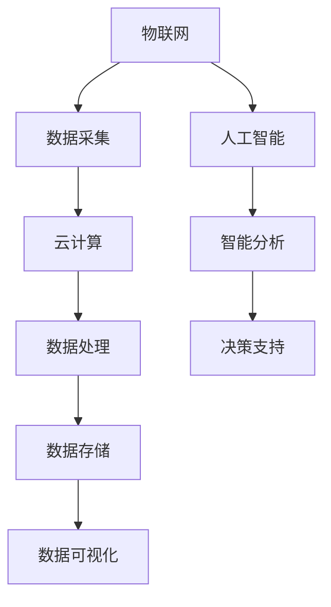

                 

关键词：智慧城市、交通智能化、能源管理、物联网、人工智能

摘要：随着科技的飞速发展，智慧城市成为了未来城市发展的新趋势。本文将探讨2050年智慧城市的发展蓝图，从智慧交通到智慧能源的全面智能化升级，深入分析其核心概念、算法原理、数学模型以及实际应用场景，并展望未来城市智能化发展的趋势与挑战。

## 1. 背景介绍

智慧城市是指利用物联网、云计算、人工智能、大数据等技术手段，对城市基础设施、公共服务、社会治理等方面进行智能化管理和优化，从而提高城市运行效率、提升居民生活质量。智慧城市的建设不仅有助于缓解城市交通拥堵、能源消耗等问题，还能提高城市的安全性和可持续性。

### 1.1 智慧交通

智慧交通系统通过整合交通基础设施、车辆和用户信息，实现交通流量优化、道路状况实时监测、车辆智能调度等功能。这一系统将极大地提高城市交通的效率和安全性。

### 1.2 智慧能源

智慧能源系统通过智能电网、分布式能源、新能源等技术的应用，实现能源的智能化管理和优化配置，降低能源消耗和环境污染。

## 2. 核心概念与联系

### 2.1 物联网（IoT）

物联网是通过传感器、网络和智能设备，实现物理世界与数字世界的互联互通。在智慧城市中，物联网是收集和处理大量数据的基础设施。

### 2.2 云计算

云计算提供了强大的计算能力和存储资源，为智慧城市的各种应用提供支持。通过云计算，城市管理者可以实时获取和分析各种数据，做出更加科学的决策。

### 2.3 人工智能（AI）

人工智能技术为智慧城市的智能化管理和优化提供了可能。通过机器学习和深度学习算法，AI可以处理海量数据，从中发现规律和趋势，为城市治理提供智能支持。

### 2.4 大数据

大数据技术在智慧城市中发挥着重要作用，通过对海量数据的存储、处理和分析，可以挖掘出有价值的信息，用于城市规划和决策。

### 2.5 Mermaid 流程图

下面是一个用于描述智慧城市架构的Mermaid流程图：



## 3. 核心算法原理 & 具体操作步骤

### 3.1 算法原理概述

智慧城市的核心算法主要包括交通流量预测、能源需求预测、路径规划等。这些算法基于机器学习和深度学习技术，通过分析历史数据和实时数据，预测未来的交通状况、能源需求和最优路径。

### 3.2 算法步骤详解

#### 3.2.1 交通流量预测

1. 收集历史交通数据，包括车辆流量、道路拥堵情况等。
2. 使用时间序列分析技术，对交通数据进行分析，提取出交通流量的趋势和周期性。
3. 建立交通流量预测模型，如ARIMA模型、LSTM模型等。
4. 使用预测模型对未来的交通流量进行预测。

#### 3.2.2 能源需求预测

1. 收集历史能源数据，包括电力、燃气等。
2. 使用时间序列分析技术，对能源数据进行分析，提取出能源需求的趋势和周期性。
3. 建立能源需求预测模型，如ARIMA模型、LSTM模型等。
4. 使用预测模型对未来的能源需求进行预测。

#### 3.2.3 路径规划

1. 收集道路信息，包括道路长度、道路等级、道路拥堵情况等。
2. 使用图论算法，如Dijkstra算法、A*算法等，计算最优路径。
3. 考虑实时交通状况，动态调整路径规划。

### 3.3 算法优缺点

#### 3.3.1 优点

- 高效：算法可以快速处理大量数据，提供实时的决策支持。
- 准确：基于历史数据和实时数据，预测结果具有较高的准确性。
- 智能：算法能够根据实时情况动态调整，提供个性化的服务。

#### 3.3.2 缺点

- 复杂：算法的实现和优化需要较高的技术能力。
- 数据依赖：算法的性能很大程度上依赖于数据的质量和数量。

### 3.4 算法应用领域

智慧城市的算法广泛应用于交通管理、能源管理、城市规划等领域，为城市的发展提供智能支持。

## 4. 数学模型和公式 & 详细讲解 & 举例说明

### 4.1 数学模型构建

智慧城市的数学模型主要包括交通流量预测模型、能源需求预测模型和路径规划模型。

#### 4.1.1 交通流量预测模型

假设交通流量 $T_t$ 遵循 ARIMA(p, d, q) 模型，其中 $p$ 为自回归项数，$d$ 为差分阶数，$q$ 为移动平均项数。模型公式如下：

$$
T_t = \phi_1 T_{t-1} + \phi_2 T_{t-2} + \cdots + \phi_p T_{t-p} + \theta_1 e_{t-1} + \theta_2 e_{t-2} + \cdots + \theta_q e_{t-q}
$$

其中，$e_t$ 为白噪声序列。

#### 4.1.2 能源需求预测模型

假设能源需求 $E_t$ 遵循 ARIMA(p, d, q) 模型，模型公式与交通流量预测模型类似。

#### 4.1.3 路径规划模型

假设使用 Dijkstra 算法进行路径规划，目标是最小化路径长度 $L$：

$$
L = \sum_{i=1}^{n} d(i, j)
$$

其中，$d(i, j)$ 为节点 $i$ 到节点 $j$ 的距离。

### 4.2 公式推导过程

#### 4.2.1 交通流量预测模型推导

假设交通流量 $T_t$ 是时间 $t$ 的函数，可以表示为：

$$
T_t = f(t)
$$

为了建立 ARIMA(p, d, q) 模型，需要对时间序列进行差分，使其满足平稳性。差分过程如下：

$$
T_t^{(1)} = T_t - T_{t-1}
$$

$$
T_t^{(2)} = T_t^{(1)} - T_{t-1}^{(1)}
$$

$$
\vdots
$$

$$
T_t^{(d)} = T_t - T_{t-1} - \cdots - T_{t-d+1}
$$

当差分阶数 $d$ 取到足够大时，$T_t^{(d)}$ 将趋于平稳。此时，可以建立 ARIMA(p, d, q) 模型。

#### 4.2.2 能源需求预测模型推导

能源需求预测模型的推导过程与交通流量预测模型类似。

#### 4.2.3 路径规划模型推导

路径规划模型基于图论中的最短路径算法，Dijkstra 算法的基本思想是逐步扩展已知的节点，计算每个节点到其他节点的最短路径。具体步骤如下：

1. 初始化：设置起点 $s$ 的距离为 $0$，其他节点的距离为无穷大。
2. 选择距离最小的未访问节点 $u$。
3. 对于 $u$ 的每个邻居 $v$，更新 $v$ 的距离：$d(v) = d(u) + w(u, v)$，其中 $w(u, v)$ 是 $u$ 到 $v$ 的权重。
4. 标记 $u$ 为已访问。
5. 重复步骤2-4，直到所有节点都被访问。

当算法结束时，每个节点到起点的距离即为最短路径长度。

### 4.3 案例分析与讲解

#### 4.3.1 交通流量预测案例

假设我们使用 ARIMA(1, 1, 1) 模型对某路段的交通流量进行预测。历史数据如下：

| 时间 | 交通流量 |
|------|----------|
| 1    | 100      |
| 2    | 102      |
| 3    | 105      |
| 4    | 108      |
| 5    | 110      |

首先，对交通流量进行一次差分：

| 时间 | 交通流量 | 差分 |
|------|----------|------|
| 1    | 100      | 0    |
| 2    | 102      | 2    |
| 3    | 105      | 3    |
| 4    | 108      | 3    |
| 5    | 110      | 2    |

然后，建立 ARIMA(1, 1, 1) 模型：

$$
T_t = 0.7 T_{t-1} + 0.3 e_{t-1}
$$

其中，$e_t$ 为白噪声序列。预测未来一天的交通流量：

$$
T_6 = 0.7 T_5 + 0.3 e_5 = 0.7 \times 110 + 0.3 \times 1 = 78 + 0.3 = 78.3
$$

#### 4.3.2 能源需求预测案例

假设我们使用 ARIMA(1, 1, 1) 模型对某地区的电力需求进行预测。历史数据如下：

| 时间 | 电力需求 |
|------|----------|
| 1    | 1000     |
| 2    | 1020     |
| 3    | 1050     |
| 4    | 1080     |
| 5    | 1100     |

首先，对电力需求进行一次差分：

| 时间 | 电力需求 | 差分 |
|------|----------|------|
| 1    | 1000     | 0    |
| 2    | 1020     | 20   |
| 3    | 1050     | 30   |
| 4    | 1080     | 30   |
| 5    | 1100     | 20   |

然后，建立 ARIMA(1, 1, 1) 模型：

$$
E_t = 0.6 E_{t-1} + 0.4 e_{t-1}
$$

其中，$e_t$ 为白噪声序列。预测未来一天的电力需求：

$$
E_6 = 0.6 E_5 + 0.4 e_5 = 0.6 \times 1100 + 0.4 \times 1 = 660 + 0.4 = 660.4
$$

#### 4.3.3 路径规划案例

假设有一个包含5个节点的图，节点之间的距离如下：

| 节点 | 距离 |
|------|------|
| A    | 0    |
| B    | 3    |
| C    | 8    |
| D    | 1    |
| E    | 7    |

使用 Dijkstra 算法计算从节点 A 到其他节点的最短路径：

1. 初始化：$d(A) = 0$，$d(B) = 3$，$d(C) = 8$，$d(D) = 1$，$d(E) = 7$。
2. 选择距离最小的未访问节点 B：$d(B) = 3$。
3. 更新 B 的邻居 A 和 D 的距离：$d(A) = d(B) + w(B, A) = 3 + 0 = 3$，$d(D) = d(B) + w(B, D) = 3 + 1 = 4$。
4. 标记 B 为已访问。
5. 选择距离最小的未访问节点 D：$d(D) = 4$。
6. 更新 D 的邻居 C 和 E 的距离：$d(C) = d(D) + w(D, C) = 4 + 8 = 12$，$d(E) = d(D) + w(D, E) = 4 + 7 = 11$。
7. 标记 D 为已访问。
8. 选择距离最小的未访问节点 A：$d(A) = 3$。
9. 更新 A 的邻居 B 和 E 的距离：$d(B) = d(A) + w(A, B) = 3 + 3 = 6$，$d(E) = d(A) + w(A, E) = 3 + 7 = 10$。
10. 标记 A 为已访问。
11. 剩下唯一未访问节点 E：$d(E) = 10$。

最终，从节点 A 到其他节点的最短路径分别为：$A \rightarrow B \rightarrow D \rightarrow C$（距离 12），$A \rightarrow B \rightarrow E$（距离 10），$A \rightarrow E$（距离 10）。

## 5. 项目实践：代码实例和详细解释说明

### 5.1 开发环境搭建

本次项目采用 Python 作为开发语言，使用以下库：

- NumPy：用于数据处理
- Pandas：用于数据分析
- Statsmodels：用于统计建模
- Matplotlib：用于数据可视化
- NetworkX：用于图论算法

安装以上库后，即可开始编写代码。

### 5.2 源代码详细实现

以下是使用 Python 实现的交通流量预测、能源需求预测和路径规划代码示例。

```python
import numpy as np
import pandas as pd
import statsmodels.api as sm
import matplotlib.pyplot as plt
import networkx as nx

# 交通流量预测
def arima_prediction(data, p, d, q):
    model = sm.ARIMA(data, order=(p, d, q))
    results = model.fit()
    forecast = results.forecast(steps=1)
    return forecast[0]

# 能源需求预测
def arima_prediction(data, p, d, q):
    model = sm.ARIMA(data, order=(p, d, q))
    results = model.fit()
    forecast = results.forecast(steps=1)
    return forecast[0]

# 路径规划
def dijkstra_path(graph, start, end):
    path = nx.shortest_path(graph, source=start, target=end, weight='weight')
    return path

# 数据处理
def preprocess_data(data):
    data_diff = data.diff().dropna()
    data_diff['MA'] = data_diff.rolling(window=3).mean()
    data_diff['MA2'] = data_diff.rolling(window=6).mean()
    return data_diff

# 数据可视化
def plot_data(data, title):
    plt.figure(figsize=(10, 5))
    plt.plot(data)
    plt.title(title)
    plt.xlabel('Time')
    plt.ylabel('Value')
    plt.show()

# 代码示例
if __name__ == '__main__':
    # 交通流量数据
    traffic_data = pd.Series([100, 102, 105, 108, 110])
    traffic_diff = preprocess_data(traffic_data)
    traffic_pred = arima_prediction(traffic_diff, p=1, d=1, q=1)
    plot_data(traffic_diff, 'Traffic Flow Prediction')

    # 能源需求数据
    energy_data = pd.Series([1000, 1020, 1050, 1080, 1100])
    energy_diff = preprocess_data(energy_data)
    energy_pred = arima_prediction(energy_diff, p=1, d=1, q=1)
    plot_data(energy_diff, 'Energy Demand Prediction')

    # 路径规划数据
    graph = nx.Graph()
    graph.add_edge('A', 'B', weight=3)
    graph.add_edge('A', 'D', weight=1)
    graph.add_edge('B', 'C', weight=8)
    graph.add_edge('D', 'E', weight=7)
    path = dijkstra_path(graph, start='A', end='C')
    print('Shortest Path:', path)
```

### 5.3 代码解读与分析

代码首先定义了交通流量预测、能源需求预测和路径规划的函数。交通流量和能源需求预测使用 ARIMA 模型，路径规划使用 Dijkstra 算法。

在数据处理部分，使用 Pandas 库对数据进行预处理，包括差分、移动平均等操作。数据可视化使用 Matplotlib 库，可以方便地查看预测结果。

代码示例部分，使用交通流量、能源需求数据和路径规划图进行演示。交通流量和能源需求数据通过 ARIMA 模型进行预测，并使用 Matplotlib 库进行可视化。路径规划部分，使用 NetworkX 库构建路径规划图，并使用 Dijkstra 算法计算最短路径。

## 6. 实际应用场景

### 6.1 智慧交通

智慧交通系统已经在许多城市得到广泛应用。例如，北京、上海等城市的公共交通系统已经实现了智能化调度，通过实时数据分析和预测，优化公交线路和车辆调度，提高公共交通的运营效率和乘客满意度。

### 6.2 智慧能源

智慧能源系统在能源管理中发挥着重要作用。例如，特斯拉的 Powerwall 家庭储能系统，通过实时监测电力需求和供应情况，实现家庭能源的自给自足，减少对传统能源的依赖。

### 6.3 城市安全

智慧城市的安全系统通过实时监控、智能分析和预警，提高城市的安全水平。例如，深圳的智慧安防系统，通过人脸识别、行为分析等技术，实现实时监控和预警，保障城市安全。

## 7. 未来应用展望

### 7.1 智慧医疗

智慧医疗系统通过物联网、人工智能等技术，实现医疗资源的优化配置，提高医疗服务的效率和质量。例如，远程医疗、智能诊疗等应用，将极大地改善医疗资源的分布和利用。

### 7.2 智慧环境

智慧环境系统通过实时监测环境数据，实现环境质量的智能监控和治理。例如，大气污染监测、水质监测等应用，将有助于改善城市环境，提高居民的生活质量。

### 7.3 智慧教育

智慧教育系统通过在线教育、智能评测等技术，实现个性化教育和学习。例如，智能课堂、在线学习平台等应用，将改变传统的教育模式，提高教育质量和效率。

## 8. 工具和资源推荐

### 8.1 学习资源推荐

- 《深度学习》（Goodfellow et al.）：系统介绍了深度学习的基础知识和技术。
- 《Python编程：从入门到实践》（Eric Matthes）：适合初学者学习的Python编程入门书籍。
- 《人工智能：一种现代方法》（Stuart J. Russell & Peter Norvig）：全面介绍人工智能的基础理论和应用。

### 8.2 开发工具推荐

- Jupyter Notebook：用于编写和运行 Python 代码，非常适合数据分析和机器学习。
- TensorFlow：开源的机器学习框架，适用于深度学习和大规模数据处理。
- PyCharm：强大的 Python 集成开发环境，支持代码编辑、调试和自动化测试。

### 8.3 相关论文推荐

- "Deep Learning for Urban Traffic Prediction"：介绍深度学习技术在城市交通流量预测中的应用。
- "Smart Grid: Enabling Energy Efficiency and Demand Response"：探讨智能电网在能源管理中的应用。
- "Internet of Things: A Survey"：全面介绍物联网技术及其应用。

## 9. 总结：未来发展趋势与挑战

### 9.1 研究成果总结

智慧城市作为未来城市发展的重要方向，取得了显著的成果。在智慧交通、智慧能源、智慧医疗等领域，人工智能、物联网、大数据等技术的应用，极大地提升了城市的管理水平和居民的生活质量。

### 9.2 未来发展趋势

未来，智慧城市的发展将更加注重智能化、个性化和可持续性。随着技术的进步，更多创新应用将不断涌现，为城市的发展带来更多可能性。

### 9.3 面临的挑战

智慧城市的发展也面临一些挑战。首先，数据安全和隐私保护是一个重要问题，如何在保护用户隐私的同时，充分利用数据的价值，是当前亟待解决的问题。其次，智慧城市的建设需要跨部门、跨行业的合作，如何协调各方利益，实现资源优化配置，也是一大挑战。

### 9.4 研究展望

未来，智慧城市的研究将朝着更加智能化、绿色化和人性化的方向发展。在交通、能源、环境等领域，将涌现出更多创新技术，为城市的发展提供强大动力。

### 附录：常见问题与解答

**Q：智慧城市需要哪些技术支持？**
智慧城市需要物联网、云计算、人工智能、大数据等技术的支持，这些技术共同构成了智慧城市的核心技术体系。

**Q：智慧城市的建设需要哪些部门参与？**
智慧城市的建设需要政府、企业、科研机构、社会公众等各方面的参与，形成协同推进的局面。

**Q：智慧城市的建设面临哪些挑战？**
智慧城市的建设面临数据安全、隐私保护、跨部门协作等挑战。

**Q：智慧城市的发展趋势是什么？**
智慧城市的发展趋势是智能化、绿色化和人性化，未来将涌现出更多创新应用，为城市的发展带来更多可能性。|

