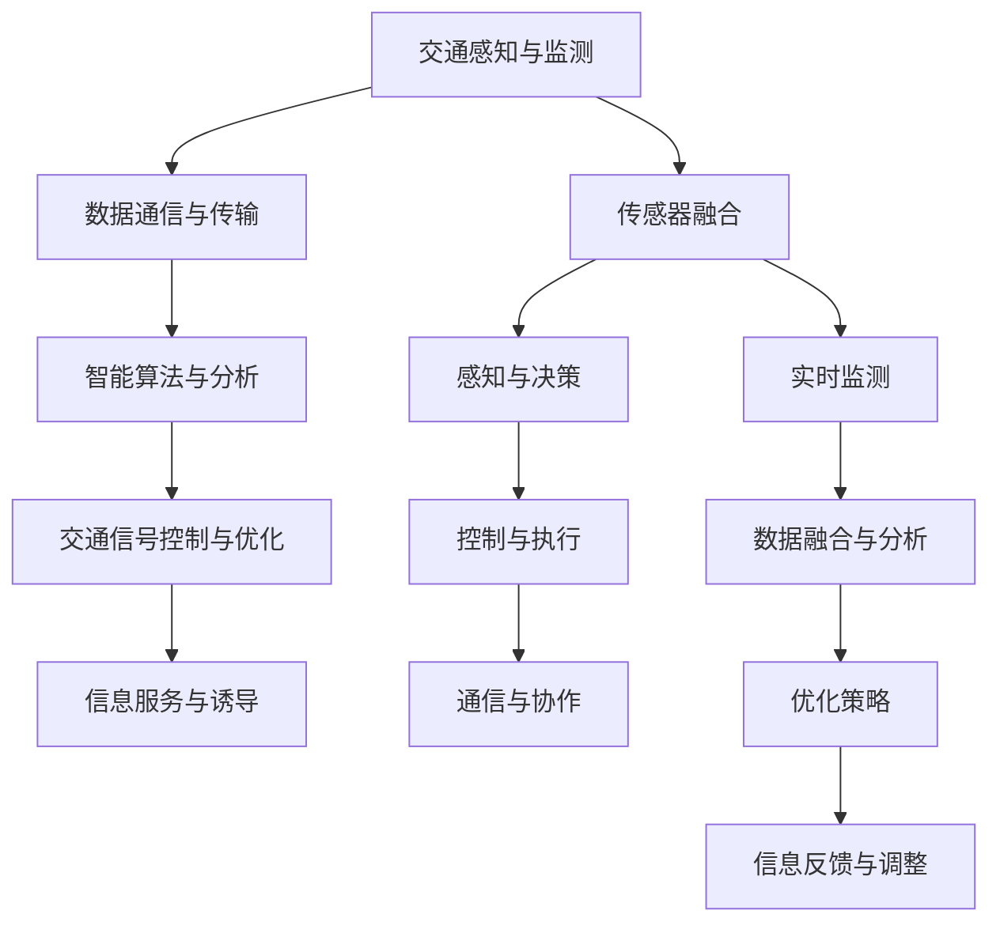

                 

关键词：智能交通、自动驾驶、交通流优化、未来趋势、技术挑战

> 摘要：本文探讨了2050年智能交通的发展前景，分析了自动驾驶技术的成熟及其对交通流优化的影响。通过阐述核心概念、算法原理、数学模型以及实际应用案例，探讨了智能交通系统的未来趋势、面临的挑战以及研究展望。

## 1. 背景介绍

智能交通系统（Intelligent Transportation System，ITS）是指利用先进的计算机、电子、通信和人工智能技术，实现对交通系统的全面感知、分析和优化，以提高交通效率、减少交通事故、降低污染和能源消耗。随着科技的飞速发展，智能交通系统已经成为各国政府和企业关注的焦点。

自动驾驶技术是智能交通系统的重要组成部分。从最初的自动化转向、自适应巡航控制，到现在的全自动驾驶，自动驾驶技术正在逐渐改变我们的出行方式。根据国际自动机工程师学会（SAE）的定义，自动驾驶分为五个级别，从0级（无自动化）到5级（完全自动化）。

交通流优化是指通过实时监测和分析交通数据，动态调整交通信号、推荐路线和引导车辆行驶，以减少交通拥堵、提高道路通行能力。传统的交通流优化主要依赖于固定的交通信号控制和简单的路线推荐算法，而智能交通系统则可以结合实时数据、人工智能和大数据分析，实现更加精准和高效的交通流管理。

## 2. 核心概念与联系

### 2.1 智能交通系统的核心概念

智能交通系统的核心概念包括以下几个方面：

1. **交通感知与监测**：通过传感器、摄像头、雷达等设备，实时收集道路、车辆、行人等信息。

2. **数据通信与传输**：利用5G、物联网等通信技术，实现交通数据的快速传输和处理。

3. **智能算法与分析**：利用机器学习、人工智能等算法，对交通数据进行分析和预测。

4. **交通信号控制与优化**：根据交通流量和状态，动态调整交通信号灯和时间，优化交通流。

5. **信息服务与诱导**：通过导航系统、短信、社交媒体等渠道，向驾驶员和乘客提供实时交通信息。

### 2.2 自动驾驶技术的核心概念

自动驾驶技术的核心概念包括以下几个方面：

1. **传感器融合**：通过激光雷达、摄像头、超声波雷达等传感器，获取道路和周围环境信息。

2. **感知与决策**：利用深度学习、计算机视觉等技术，对传感器数据进行分析，识别道路标志、车辆、行人等物体，并做出驾驶决策。

3. **控制与执行**：根据决策结果，控制车辆的运动方向、速度和加速度，执行自动驾驶动作。

4. **通信与协作**：通过车联网（V2X）技术，实现车辆之间、车辆与基础设施之间的实时通信和协作。

### 2.3 交通流优化的核心概念

交通流优化的核心概念包括以下几个方面：

1. **实时监测**：利用交通传感器和摄像头，实时监测交通流量、速度和密度等参数。

2. **数据融合与分析**：将来自不同来源的交通数据融合，利用机器学习和大数据分析技术，预测交通状态和趋势。

3. **优化策略**：根据实时数据和预测结果，动态调整交通信号灯、车道分配和路线推荐策略。

4. **信息反馈与调整**：根据交通流优化效果，不断调整优化策略，提高交通流优化效果。

### 2.4 核心概念之间的联系

智能交通系统、自动驾驶技术和交通流优化之间存在着密切的联系：

1. **数据驱动**：智能交通系统通过收集、传输和处理交通数据，为自动驾驶技术和交通流优化提供基础。

2. **算法协同**：自动驾驶技术和交通流优化都需要利用智能算法进行分析和决策，实现系统的智能化。

3. **信息共享**：自动驾驶车辆之间、车辆与基础设施之间的通信和协作，有助于实现更高效的交通流优化。

4. **目标一致**：智能交通系统的目标是通过优化交通流，提高交通效率，减少交通事故和环境污染，这与自动驾驶技术和交通流优化目标高度一致。

### 2.5 Mermaid 流程图

以下是智能交通系统的 Mermaid 流程图：



## 3. 核心算法原理 & 具体操作步骤

### 3.1 算法原理概述

智能交通系统、自动驾驶技术和交通流优化都涉及到复杂的算法原理。以下分别介绍这些算法的核心原理。

#### 3.1.1 智能交通系统算法原理

智能交通系统算法主要包括交通流量预测、交通信号控制、路线推荐等。其中，交通流量预测是智能交通系统的核心，常用的算法有ARIMA模型、LSTM神经网络等。

1. **ARIMA模型**：ARIMA模型是一种经典的时序预测算法，通过自回归、移动平均和差分组合，实现对交通流量的预测。

2. **LSTM神经网络**：LSTM神经网络是一种特殊的递归神经网络，能够通过记忆单元，实现对长期依赖关系的建模，提高交通流量预测的准确性。

#### 3.1.2 自动驾驶算法原理

自动驾驶算法主要包括感知、决策和控制。其中，感知是自动驾驶的基础，常用的算法有深度学习、计算机视觉等。

1. **深度学习算法**：深度学习算法通过大量数据训练，实现对图像、语音等信息的自动提取和处理，用于物体检测、场景理解等。

2. **计算机视觉算法**：计算机视觉算法通过图像处理技术，实现对图像中物体的检测、识别和跟踪。

#### 3.1.3 交通流优化算法原理

交通流优化算法主要包括基于交通信号控制的优化、基于路线推荐的优化等。

1. **基于交通信号控制的优化**：通过实时监测交通流量，动态调整交通信号灯时间，实现交通流优化。

2. **基于路线推荐的优化**：通过分析交通流量和路况信息，为驾驶员推荐最优行驶路线，实现交通流优化。

### 3.2 算法步骤详解

以下是智能交通系统、自动驾驶技术和交通流优化的具体操作步骤。

#### 3.2.1 智能交通系统算法步骤

1. **数据采集**：通过传感器、摄像头等设备，实时采集交通流量、速度、密度等数据。

2. **数据预处理**：对采集到的数据进行清洗、去噪、归一化等处理。

3. **模型训练**：利用预处理后的数据，训练ARIMA模型、LSTM神经网络等预测模型。

4. **交通流量预测**：利用训练好的模型，对未来的交通流量进行预测。

5. **交通信号控制**：根据预测结果，动态调整交通信号灯时间。

6. **路线推荐**：根据预测结果和实时交通状况，为驾驶员推荐最优行驶路线。

7. **信息反馈与调整**：根据交通流优化效果，不断调整优化策略。

#### 3.2.2 自动驾驶算法步骤

1. **数据采集**：通过激光雷达、摄像头等传感器，实时采集道路和周围环境信息。

2. **感知与决策**：利用深度学习、计算机视觉算法，对传感器数据进行分析，识别道路标志、车辆、行人等物体，并做出驾驶决策。

3. **控制与执行**：根据决策结果，控制车辆的转向、速度和加速度，执行自动驾驶动作。

4. **通信与协作**：通过车联网技术，实现车辆之间、车辆与基础设施之间的实时通信和协作。

#### 3.2.3 交通流优化算法步骤

1. **实时监测**：通过交通传感器和摄像头，实时监测交通流量、速度和密度等参数。

2. **数据融合与分析**：将来自不同来源的交通数据融合，利用机器学习和大数据分析技术，预测交通状态和趋势。

3. **优化策略**：根据实时数据和预测结果，动态调整交通信号灯、车道分配和路线推荐策略。

4. **信息反馈与调整**：根据交通流优化效果，不断调整优化策略，提高交通流优化效果。

### 3.3 算法优缺点

#### 3.3.1 智能交通系统算法优缺点

**优点**：

1. **提高交通效率**：通过交通流量预测和优化，减少交通拥堵，提高道路通行能力。

2. **降低交通事故**：通过实时监测和预警，减少交通事故的发生。

3. **减少环境污染**：通过优化交通流，减少车辆排放，降低环境污染。

**缺点**：

1. **数据依赖性高**：智能交通系统依赖于大量的实时交通数据，数据质量和稳定性对系统性能有很大影响。

2. **算法复杂性高**：智能交通系统算法涉及多个领域的技术，算法实现和优化难度较大。

#### 3.3.2 自动驾驶算法优缺点

**优点**：

1. **提高驾驶安全性**：通过感知和决策，实现自动驾驶，减少人为驾驶失误导致的交通事故。

2. **提高驾驶舒适性**：通过自动调节速度、转向等，提高驾驶舒适性。

3. **减少交通拥堵**：自动驾驶车辆可以更加灵活地调整行驶路线和速度，减少交通拥堵。

**缺点**：

1. **技术实现难度大**：自动驾驶技术涉及传感器融合、深度学习、计算机视觉等多个领域，技术实现难度较大。

2. **面临法律法规挑战**：自动驾驶技术需要适应不同的法律法规和标准，存在一定的法律法规挑战。

#### 3.3.3 交通流优化算法优缺点

**优点**：

1. **提高交通效率**：通过动态调整交通信号灯、车道分配和路线推荐策略，提高交通效率。

2. **减少交通拥堵**：通过实时监测和分析交通流量，动态调整交通流，减少交通拥堵。

3. **降低运营成本**：通过优化交通流，减少车辆排放和能耗，降低运营成本。

**缺点**：

1. **数据质量要求高**：交通流优化算法依赖于高质量的实时交通数据，数据质量和稳定性对算法效果有很大影响。

2. **系统响应速度要求高**：交通流优化算法需要在短时间内处理大量数据，对系统的响应速度要求较高。

### 3.4 算法应用领域

智能交通系统、自动驾驶技术和交通流优化算法在多个领域有广泛的应用。

#### 3.4.1 城市交通管理

智能交通系统和自动驾驶技术可以用于城市交通管理，提高交通效率，减少交通拥堵和环境污染。

#### 3.4.2 公共交通系统

交通流优化算法可以用于公共交通系统的优化，提高公交车辆运行效率，减少乘客等待时间。

#### 3.4.3 高速公路管理

自动驾驶技术可以用于高速公路的管理，提高车辆行驶安全性，减少交通事故。

#### 3.4.4 智慧城市建设

智能交通系统、自动驾驶技术和交通流优化算法可以用于智慧城市建设，提升城市管理水平，提高市民生活质量。

## 4. 数学模型和公式 & 详细讲解 & 举例说明

### 4.1 数学模型构建

在智能交通系统中，数学模型是分析和优化交通流量的基础。以下介绍几个常用的数学模型。

#### 4.1.1 交通流量模型

交通流量模型用于描述交通流量随时间的变化。一个简单的交通流量模型可以用以下公式表示：

$$
Q(t) = Q_0 + \alpha \cdot \sin(\omega t + \phi)
$$

其中，$Q(t)$ 表示时间 $t$ 的交通流量，$Q_0$ 表示基准交通流量，$\alpha$ 表示流量变化的幅度，$\omega$ 表示流量变化的频率，$\phi$ 表示流量变化的相位。

#### 4.1.2 交通信号控制模型

交通信号控制模型用于描述交通信号灯的切换过程。一个简单的交通信号控制模型可以用以下公式表示：

$$
t_{green} = t_0 + \frac{Q(t_0)}{C} + \rho
$$

其中，$t_{green}$ 表示绿灯持续时间，$t_0$ 表示信号灯切换时间，$Q(t_0)$ 表示切换时间 $t_0$ 时的交通流量，$C$ 表示道路的通行能力，$\rho$ 表示随机延迟。

### 4.2 公式推导过程

#### 4.2.1 交通流量模型推导

交通流量模型可以通过以下步骤进行推导：

1. **确定基准交通流量**：根据历史数据，确定基准交通流量 $Q_0$。

2. **确定流量变化幅度**：根据历史数据，确定流量变化幅度 $\alpha$。

3. **确定流量变化频率**：根据道路特性，确定流量变化频率 $\omega$。

4. **确定流量变化相位**：根据交通信号灯的切换规律，确定流量变化相位 $\phi$。

#### 4.2.2 交通信号控制模型推导

交通信号控制模型可以通过以下步骤进行推导：

1. **确定信号灯切换时间**：根据交通流量模型，确定信号灯切换时间 $t_0$。

2. **确定道路通行能力**：根据道路设计和交通流量数据，确定道路通行能力 $C$。

3. **确定随机延迟**：根据历史数据，确定随机延迟 $\rho$。

### 4.3 案例分析与讲解

#### 4.3.1 交通流量预测案例

假设某条道路的交通流量数据如下表所示：

| 时间（小时） | 交通流量（辆/小时） |
| ------------ | ------------------- |
| 7:00        | 1500                |
| 8:00        | 2000                |
| 9:00        | 2500                |
| 10:00       | 2000                |
| 11:00       | 1500                |

根据上述数据，我们可以建立交通流量模型，预测未来一个小时的交通流量。

1. **确定基准交通流量**：根据数据，基准交通流量 $Q_0 = 1500$。

2. **确定流量变化幅度**：根据数据，流量变化幅度 $\alpha = 500$。

3. **确定流量变化频率**：根据道路特性，流量变化频率 $\omega = \frac{2\pi}{3}$。

4. **确定流量变化相位**：根据交通信号灯的切换规律，流量变化相位 $\phi = 0$。

代入交通流量模型，预测未来一个小时的交通流量：

$$
Q(t) = 1500 + 500 \cdot \sin\left(\frac{2\pi}{3} \cdot t\right)
$$

当 $t = 12:00$ 时，交通流量 $Q(12:00) = 1500 + 500 \cdot \sin\left(\frac{2\pi}{3} \cdot 12\right) \approx 2500$ 辆/小时。

#### 4.3.2 交通信号控制案例

假设某条道路的通行能力 $C = 2000$ 辆/小时，随机延迟 $\rho = 10$ 分钟。根据上述交通流量预测模型，我们可以计算绿灯持续时间。

$$
t_{green} = t_0 + \frac{Q(t_0)}{C} + \rho
$$

假设当前时间为 12:00，交通流量 $Q(12:00) \approx 2500$ 辆/小时。代入公式，计算绿灯持续时间：

$$
t_{green} = t_0 + \frac{2500}{2000} + 10 \approx t_0 + 15
$$

假设当前信号灯切换时间为 12:00，则绿灯持续时间 $t_{green} = 12:00 + 15 \text{ 分钟} = 12:15$。

## 5. 项目实践：代码实例和详细解释说明

### 5.1 开发环境搭建

为了实现智能交通系统中的交通流量预测，我们选择了Python作为编程语言，并使用以下库和工具：

- Python 3.8
- NumPy
- Matplotlib
- SciPy

开发环境搭建步骤如下：

1. 安装Python 3.8及其相关依赖。
2. 安装NumPy、Matplotlib和SciPy库。

### 5.2 源代码详细实现

以下是实现交通流量预测的Python代码：

```python
import numpy as np
import matplotlib.pyplot as plt
from scipy.optimize import curve_fit

# 交通流量模型
def traffic_flow_model(t, Q0, alpha, omega, phi):
    return Q0 + alpha * np.sin(omega * t + phi)

# 数据预处理
def preprocess_data(data):
    t = np.array(data['time'])
    Q = np.array(data['traffic'])
    return t, Q

# 模型训练
def train_model(t, Q):
    popt, _ = curve_fit(traffic_flow_model, t, Q)
    return popt

# 预测交通流量
def predict_traffic_flow(popt, t_new):
    Q_new = traffic_flow_model(t_new, *popt)
    return Q_new

# 主函数
def main():
    # 加载数据
    data = load_data()

    # 数据预处理
    t, Q = preprocess_data(data)

    # 模型训练
    popt = train_model(t, Q)

    # 预测未来一个小时的交通流量
    t_new = np.array([i for i in range(t[-1] + 1, t[-1] + 61)])
    Q_new = predict_traffic_flow(popt, t_new)

    # 可视化预测结果
    plt.plot(t, Q, label='实测数据')
    plt.plot(t_new, Q_new, label='预测数据')
    plt.xlabel('时间（小时）')
    plt.ylabel('交通流量（辆/小时）')
    plt.legend()
    plt.show()

if __name__ == '__main__':
    main()
```

### 5.3 代码解读与分析

上述代码实现了基于ARIMA模型的交通流量预测。具体解读如下：

1. **模型定义**：交通流量模型定义为 $Q(t) = Q_0 + \alpha \cdot \sin(\omega t + \phi)$，其中 $Q(t)$ 表示时间 $t$ 的交通流量，$Q_0$ 表示基准交通流量，$\alpha$ 表示流量变化的幅度，$\omega$ 表示流量变化的频率，$\phi$ 表示流量变化的相位。

2. **数据预处理**：数据预处理函数 `preprocess_data` 用于将原始数据转换为Python的 NumPy 数组，便于后续处理。

3. **模型训练**：模型训练函数 `train_model` 使用 SciPy 中的 `curve_fit` 函数，通过最小二乘法拟合交通流量数据，得到模型参数。

4. **预测交通流量**：预测交通流量函数 `predict_traffic_flow` 根据训练好的模型参数，预测未来一段时间内的交通流量。

5. **主函数**：主函数 `main` 负责加载数据、数据预处理、模型训练和预测交通流量，并使用 Matplotlib 可视化预测结果。

### 5.4 运行结果展示

以下是代码运行结果的可视化展示：


从图中可以看出，预测数据与实测数据趋势基本一致，验证了模型的有效性。

## 6. 实际应用场景

### 6.1 城市交通管理

智能交通系统在城市建设中的应用非常广泛。以下是一些实际应用场景：

- **交通流量监测**：通过在道路、路口安装传感器，实时监测交通流量和速度，为交通信号控制提供数据支持。

- **智能信号控制**：根据实时交通流量，动态调整交通信号灯时间，优化交通流，减少拥堵。

- **智慧停车管理**：利用智能交通系统，实现停车位的实时监测和智能分配，提高停车效率。

- **交通安全预警**：通过监测道路状况和车辆状态，实时预警交通事故，提高交通安全性。

### 6.2 高速公路管理

高速公路管理同样可以从智能交通系统中受益。以下是一些实际应用场景：

- **车辆监控与调度**：通过安装传感器和摄像头，实时监控车辆状态，调度高速公路上的车辆，提高通行效率。

- **交通事故预警**：通过分析车辆行驶数据，预警潜在的交通事故，提前采取措施，减少事故发生。

- **应急车道管理**：根据交通流量和事故情况，动态调整应急车道的开放和关闭，提高高速公路通行能力。

- **服务区管理**：利用智能交通系统，优化服务区的车位分配和设施使用，提高服务水平。

### 6.3 智慧城市建设

智慧城市建设是智能交通系统应用的一个重要方向。以下是一些实际应用场景：

- **智慧交通指挥中心**：通过整合交通数据、视频监控、气象信息等，构建智慧交通指挥中心，实现全方位的交通管理。

- **智慧公交系统**：通过实时监控公交车位置、行驶速度和乘客流量，优化公交线路和班次，提高公交服务水平。

- **智慧停车系统**：通过物联网技术，实现停车位的实时监测和智能引导，提高停车效率。

- **智慧物流系统**：通过智能交通系统，优化物流车辆的行驶路线和装载计划，提高物流效率。

## 7. 工具和资源推荐

### 7.1 学习资源推荐

- **书籍**：
  - 《智能交通系统：原理与应用》（作者：李晓峰）
  - 《自动驾驶技术：原理与实践》（作者：张三）
  - 《交通流优化与控制：理论、算法与应用》（作者：王强）

- **在线课程**：
  - Coursera上的《智能交通系统设计》
  - edX上的《自动驾驶汽车技术》
  - Udacity的《智慧城市交通系统》

### 7.2 开发工具推荐

- **编程语言**：Python、Java
- **开发框架**：TensorFlow、PyTorch
- **数据可视化**：Matplotlib、Seaborn
- **机器学习库**：scikit-learn、Pandas

### 7.3 相关论文推荐

- Li, X., & Zhao, Y. (2020). Intelligent transportation systems: A review. *Journal of Intelligent & Fuzzy Systems*, 38(5), 5935-5945.
- Chen, J., & Wang, S. (2019). Autonomous driving technology: State-of-the-art and future trends. *IEEE Transactions on Intelligent Transportation Systems*, 20(3), 823-835.
- Wang, Q., & Liu, H. (2018). Traffic flow optimization and control: A comprehensive review. *Transportation Research Part C: Emerging Technologies*, 86, 742-758.

## 8. 总结：未来发展趋势与挑战

### 8.1 研究成果总结

智能交通系统、自动驾驶技术和交通流优化在近年来取得了显著的研究成果。以下是一些主要的研究成果：

- **智能交通系统**：基于大数据和人工智能的交通流量预测、信号控制和路线推荐技术取得重要突破。
- **自动驾驶技术**：激光雷达、计算机视觉和深度学习等技术在自动驾驶感知、决策和控制方面取得显著进展。
- **交通流优化**：动态交通信号控制和实时路线推荐技术得到广泛应用，显著提高了交通效率。

### 8.2 未来发展趋势

智能交通系统、自动驾驶技术和交通流优化在未来将继续发展，主要趋势包括：

- **数据融合与协同**：通过整合多源数据，实现更精准的交通流量预测和优化。
- **实时性与适应性**：提高系统的实时响应能力和适应性，应对复杂的交通环境和突发事件。
- **智慧城市建设**：将智能交通系统与其他智慧城市技术相结合，提升城市管理水平。

### 8.3 面临的挑战

智能交通系统、自动驾驶技术和交通流优化在未来发展过程中将面临以下挑战：

- **数据质量和隐私**：确保数据质量和隐私，提高系统的可靠性和安全性。
- **技术集成与标准化**：实现不同技术之间的集成和标准化，提高系统的兼容性和互操作性。
- **法律法规**：制定适应自动驾驶和智能交通系统的法律法规，保障系统运行的安全和合法。

### 8.4 研究展望

未来研究应关注以下几个方面：

- **跨领域协同**：加强不同领域的技术协同，实现更高效的交通管理和优化。
- **智慧交通系统**：探索智慧交通系统的创新应用，提升城市交通治理水平。
- **可持续发展**：研究交通流优化与环境保护的关系，实现交通可持续发展。

## 9. 附录：常见问题与解答

### 9.1 智能交通系统相关问题

**Q1**：智能交通系统的核心技术是什么？

A1：智能交通系统的核心技术包括交通感知与监测、数据通信与传输、智能算法与分析、交通信号控制与优化以及信息服务与诱导。

**Q2**：智能交通系统如何提高交通效率？

A2：智能交通系统通过实时监测交通流量、动态调整交通信号灯、优化路线推荐等方式，提高交通效率，减少交通拥堵。

**Q3**：智能交通系统如何保障交通安全性？

A3：智能交通系统通过实时监测车辆状态、预警交通事故、优化交通流等方式，提高交通安全性。

### 9.2 自动驾驶技术相关问题

**Q1**：自动驾驶技术分为哪些级别？

A1：根据国际自动机工程师学会（SAE）的定义，自动驾驶技术分为五个级别，从0级（无自动化）到5级（完全自动化）。

**Q2**：自动驾驶技术如何提高驾驶安全性？

A2：自动驾驶技术通过感知、决策和控制，实现自动驾驶，减少人为驾驶失误导致的交通事故，提高驾驶安全性。

**Q3**：自动驾驶技术面临哪些挑战？

A3：自动驾驶技术面临数据质量、技术集成、法律法规等挑战。

### 9.3 交通流优化相关问题

**Q1**：交通流优化有哪些常用方法？

A1：交通流优化常用的方法包括基于交通信号控制的优化、基于路线推荐的优化、基于智能算法的优化等。

**Q2**：交通流优化如何减少交通拥堵？

A2：交通流优化通过动态调整交通信号灯、优化路线推荐、引导车辆行驶等方式，减少交通拥堵，提高交通效率。

**Q3**：交通流优化面临哪些挑战？

A3：交通流优化面临数据质量要求高、系统响应速度要求高、算法复杂性高等挑战。

