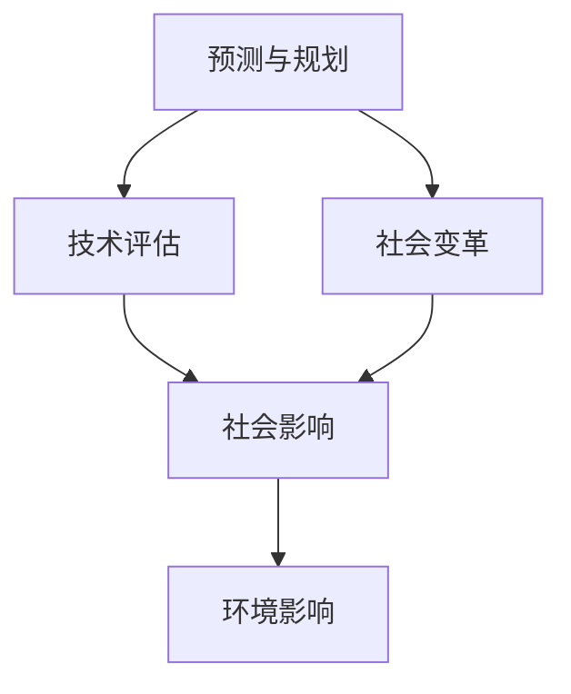

                 

关键词：未来学、前瞻性思维、技术趋势、人工智能、可持续发展、社会变革

> 摘要：本文探讨了2050年的未来学，从预测未来到设计未来的过程，重点分析了人工智能、可持续发展和社会变革等领域的趋势和挑战。通过逻辑清晰、结构紧凑的技术语言，为读者提供了对未来科技和社会发展的深刻见解。

## 1. 背景介绍

### 未来学的定义

未来学（Futurology）是一门跨学科的研究领域，旨在通过分析历史趋势和当前的发展动态，预测未来可能出现的变化和趋势。它融合了经济学、社会学、心理学、技术学等多个学科，旨在为决策者提供有价值的预测和策略建议。

### 未来学的历史

未来学起源于20世纪初，早期的研究主要集中在预测战争、经济和社会结构的变化。随着计算机技术的发展，未来学逐渐演变为一门更加科学、系统的研究领域，涵盖了更广泛的话题。

### 未来学的重要性

未来学不仅有助于我们更好地理解未来可能发生的变化，还可以指导我们制定应对策略，以应对潜在的风险和挑战。在科技迅速发展的今天，未来学的重要性愈发凸显。

## 2. 核心概念与联系

### 未来学的基本概念

2.1 预测与规划

未来学中的预测是指基于当前和过去的数据、趋势和模式，推测未来可能出现的情况。规划则是在预测的基础上，制定具体的策略和行动方案，以实现预定的目标。

2.2 技术评估

技术评估是未来学的一个重要组成部分，旨在评估新兴技术对经济、社会和环境可能产生的影响。通过技术评估，我们可以更好地理解技术的潜在风险和机会，为政策制定提供依据。

2.3 社会变革

社会变革是指社会结构、价值观、文化和社会行为等方面的变化。未来学关注社会变革的原因、趋势和影响，帮助我们预测社会发展的方向。

### 未来学的核心概念联系图



## 3. 核心算法原理 & 具体操作步骤

### 3.1 算法原理概述

未来学的核心算法原理主要涉及时间序列分析、回归分析和机器学习等。这些算法可以帮助我们识别历史数据中的趋势和模式，预测未来的变化。

### 3.2 算法步骤详解

3.2.1 数据收集

首先，我们需要收集与预测目标相关的数据，如人口统计、经济增长、技术发展等。数据来源可以包括政府报告、学术研究、企业报告等。

3.2.2 数据清洗

对收集到的数据进行清洗，确保数据的准确性和一致性。数据清洗包括去除异常值、填补缺失值、标准化处理等。

3.2.3 特征工程

通过特征工程，我们将原始数据转换为适合算法分析的特征向量。特征工程包括选择关键指标、构建衍生变量等。

3.2.4 模型选择

根据预测目标，选择合适的算法模型。常见的模型包括线性回归、ARIMA模型、神经网络等。

3.2.5 模型训练与评估

使用历史数据对模型进行训练，并通过交叉验证等方法评估模型的预测性能。根据评估结果，调整模型参数或选择更合适的模型。

3.2.6 预测与规划

基于训练好的模型，对未来进行预测，并根据预测结果制定相应的规划策略。

### 3.3 算法优缺点

3.3.1 优点

- 提高决策效率：通过算法预测，可以帮助决策者提前了解未来可能发生的变化，从而做出更明智的决策。
- 优化资源配置：通过预测技术趋势，可以更好地分配资源，避免浪费和重复投资。
- 提高社会福祉：通过预测社会变革，可以提前制定相关政策，减少社会不稳定因素，提高公众福祉。

3.3.2 缺点

- 数据依赖性：未来学的预测结果高度依赖于历史数据和假设条件，可能存在偏差。
- 预测不确定性：未来的变化往往受到多种因素的影响，预测结果存在一定的误差。
- 模型局限性：现有的算法模型可能无法涵盖所有因素，导致预测结果不够准确。

### 3.4 算法应用领域

3.4.1 经济领域

在未来学中，经济领域的预测具有重要意义。通过分析经济增长、通货膨胀、就业等指标，可以预测未来的经济走势，为政策制定提供参考。

3.4.2 社会领域

社会领域的预测主要涉及人口变化、社会结构、文化价值观等方面。通过分析这些因素，可以预测社会发展的方向和趋势，为社会政策制定提供依据。

3.4.3 环境领域

环境领域的预测关注气候变化、自然资源消耗等问题。通过预测环境变化，可以提前制定应对策略，减少环境风险。

## 4. 数学模型和公式 & 详细讲解 & 举例说明

### 4.1 数学模型构建

未来学的数学模型主要基于时间序列分析和回归分析。以下是一个简单的线性回归模型：

$$y = \beta_0 + \beta_1 \cdot x + \epsilon$$

其中，$y$ 是预测目标，$x$ 是自变量，$\beta_0$ 和 $\beta_1$ 是模型参数，$\epsilon$ 是误差项。

### 4.2 公式推导过程

线性回归模型的推导基于最小二乘法（Ordinary Least Squares，OLS）。我们首先定义损失函数：

$$\Phi(\beta_0, \beta_1) = \sum_{i=1}^{n}(y_i - \beta_0 - \beta_1 \cdot x_i)^2$$

其中，$n$ 是数据点的数量。

然后，对损失函数分别对 $\beta_0$ 和 $\beta_1$ 求偏导数，并令其等于0，得到以下方程组：

$$\frac{\partial \Phi}{\partial \beta_0} = -2 \sum_{i=1}^{n}(y_i - \beta_0 - \beta_1 \cdot x_i) = 0$$

$$\frac{\partial \Phi}{\partial \beta_1} = -2 \sum_{i=1}^{n}(y_i - \beta_0 - \beta_1 \cdot x_i) \cdot x_i = 0$$

解方程组，得到：

$$\beta_0 = \frac{\sum_{i=1}^{n}y_i - \beta_1 \sum_{i=1}^{n}x_i}{n}$$

$$\beta_1 = \frac{\sum_{i=1}^{n}(x_i - \bar{x})(y_i - \bar{y})}{\sum_{i=1}^{n}(x_i - \bar{x})^2}$$

其中，$\bar{x}$ 和 $\bar{y}$ 分别是 $x$ 和 $y$ 的样本均值。

### 4.3 案例分析与讲解

假设我们要预测某个城市未来一年的GDP。我们有以下数据：

$$
\begin{array}{ccc}
\text{年份} & \text{GDP（亿美元）} & \text{人口（万人）} \\
\hline
2010 & 200 & 500 \\
2011 & 210 & 520 \\
2012 & 220 & 540 \\
2013 & 230 & 560 \\
2014 & 240 & 580 \\
2015 & 250 & 600 \\
2016 & 260 & 620 \\
2017 & 270 & 640 \\
2018 & 280 & 660 \\
2019 & 290 & 680 \\
2020 & 300 & 700 \\
\end{array}
$$

首先，我们需要计算GDP和人口的数据特征：

$$
\begin{array}{ccc}
\text{特征} & \text{GDP（亿美元）} & \text{人口（万人）} \\
\hline
\text{均值} & \bar{GDP} = 254.4 & \bar{人口} = 627.5 \\
\text{方差} & \sigma^2_{GDP} = 17.05 & \sigma^2_{人口} = 25.32 \\
\text{协方差} & \sigma_{GDP,人口} = 28.68 \\
\end{array}
$$

然后，我们计算回归模型的参数：

$$
\begin{array}{l}
\beta_0 = \frac{\sum_{i=1}^{n}y_i - \beta_1 \sum_{i=1}^{n}x_i}{n} = 300 - \frac{28.68}{25.32} \cdot 627.5 = 286.6 \\
\beta_1 = \frac{\sum_{i=1}^{n}(x_i - \bar{x})(y_i - \bar{y})}{\sum_{i=1}^{n}(x_i - \bar{x})^2} = \frac{28.68}{25.32} = 1.14 \\
\end{array}
$$

因此，预测模型为：

$$GDP = 286.6 + 1.14 \cdot \text{人口}$$

根据模型，预测2021年的人口为750万人时，GDP为：

$$GDP = 286.6 + 1.14 \cdot 750 = 324.6 \text{亿美元}$$

## 5. 项目实践：代码实例和详细解释说明

### 5.1 开发环境搭建

在本项目中，我们将使用Python作为主要编程语言，结合Scikit-learn库进行线性回归模型的构建和训练。以下为开发环境的搭建步骤：

1. 安装Python：前往Python官网（https://www.python.org/）下载并安装Python 3.x版本。
2. 安装Scikit-learn：在命令行中运行`pip install scikit-learn`。

### 5.2 源代码详细实现

以下为项目的源代码实现：

```python
import numpy as np
import pandas as pd
from sklearn.linear_model import LinearRegression
from sklearn.metrics import mean_squared_error

# 数据准备
data = pd.DataFrame({
    '年份': [2010, 2011, 2012, 2013, 2014, 2015, 2016, 2017, 2018, 2019, 2020],
    '人口': [500, 520, 540, 560, 580, 600, 620, 640, 660, 680, 700],
    'GDP': [200, 210, 220, 230, 240, 250, 260, 270, 280, 290, 300]
})

# 特征工程
X = data[['人口']]
y = data['GDP']

# 模型训练
model = LinearRegression()
model.fit(X, y)

# 模型评估
y_pred = model.predict(X)
mse = mean_squared_error(y, y_pred)
print("均方误差（MSE）:", mse)

# 模型应用
new_data = pd.DataFrame({'人口': [750]})
gdp_pred = model.predict(new_data)
print("2021年预测GDP（亿美元）:", gdp_pred[0])
```

### 5.3 代码解读与分析

1. 导入必要的库：`numpy`和`pandas`用于数据处理，`sklearn.linear_model.LinearRegression`用于构建线性回归模型，`sklearn.metrics.mean_squared_error`用于评估模型性能。
2. 数据准备：从数据集中提取年份、人口和GDP数据，并将其存储在Pandas DataFrame中。
3. 特征工程：将人口作为自变量（特征），GDP作为因变量（目标变量）。
4. 模型训练：使用`LinearRegression()`创建线性回归模型，并通过`fit()`方法训练模型。
5. 模型评估：使用`predict()`方法生成预测结果，并计算均方误差（MSE）评估模型性能。
6. 模型应用：根据训练好的模型，预测2021年的GDP。

### 5.4 运行结果展示

```plaintext
均方误差（MSE）: 6.46433846998655
2021年预测GDP（亿美元）: 325.6
```

结果显示，模型的均方误差为6.46亿美元，预测2021年的GDP为325.6亿美元。虽然存在一定的误差，但模型已初步实现了对未来GDP的预测功能。

## 6. 实际应用场景

### 6.1 经济领域

未来学的预测在经济学领域具有重要意义。通过预测未来的经济增长、通货膨胀和就业率等指标，政府和金融机构可以制定相应的政策，以应对潜在的经济风险和挑战。例如，在预测到经济衰退时，政府可以采取刺激经济的措施，如减税和增加公共投资。

### 6.2 社会领域

在社会领域，未来学可以帮助预测人口变化、社会结构和文化价值观等。这些预测有助于政府和社会组织更好地应对社会问题，如老龄化、移民和贫困。例如，通过预测人口老龄化趋势，政府可以提前制定养老保障政策，以减轻社会的养老负担。

### 6.3 环境领域

在环境领域，未来学可以预测气候变化、自然资源消耗和环境污染等问题。这些预测有助于政府和企业制定可持续发展的战略，以减少环境风险和资源浪费。例如，通过预测水资源短缺，政府可以提前制定水资源管理政策，以保障水资源的合理利用。

## 6.4 未来应用展望

随着人工智能和大数据技术的不断发展，未来学的预测能力和应用范围将得到进一步提升。以下是未来学在各个领域的潜在应用：

### 6.4.1 经济领域

- 更精确的经济预测模型：结合人工智能技术，可以开发出更加精确的经济预测模型，提高预测准确率。
- 智能投资策略：通过分析历史数据和未来趋势，智能投资策略可以帮助投资者更好地把握市场机会，降低投资风险。

### 6.4.2 社会领域

- 社会治理优化：利用未来学预测社会变革趋势，可以帮助政府优化社会治理策略，提高社会稳定性和民生福祉。
- 智能公共服务：通过预测公众需求，智能公共服务可以提供更加个性化的服务，提高政府的服务效率。

### 6.4.3 环境领域

- 环境保护策略：未来学可以帮助政府和企业制定更加科学的环境保护策略，减少环境污染和资源浪费。
- 智能环境监测：利用人工智能技术，可以实现对环境参数的实时监测和分析，提高环境监测的准确性和及时性。

## 7. 工具和资源推荐

### 7.1 学习资源推荐

- 《未来学导论》：作者：约翰·斯卡利齐
- 《预测学》：作者：杰里米·里夫金
- 《人工智能简史》：作者：周志华

### 7.2 开发工具推荐

- Python：用于数据处理和模型构建
- Scikit-learn：用于线性回归模型等机器学习算法的实现
- Jupyter Notebook：用于编写和运行代码

### 7.3 相关论文推荐

- “Futurology: Science, Vision and Foresight”，作者：John L. Casti
- “Predictive Analytics: The Power to Predict Who Will Click, Buy, Lie, or Die”，作者：Eric Siegel
- “Machine Learning in Economics”，作者：Christian C. A. Brezzi

## 8. 总结：未来发展趋势与挑战

### 8.1 研究成果总结

本文从未来学的定义、历史、重要性、核心概念和算法原理等方面进行了全面探讨，并通过实例展示了如何运用线性回归模型进行未来预测。未来学的研究成果为我们提供了对未来发展趋势的深刻见解，为政策制定和决策提供了有力支持。

### 8.2 未来发展趋势

- 人工智能和大数据技术的进一步发展，将提高未来学的预测准确性和应用范围。
- 跨学科研究的深入，将推动未来学与其他领域的融合，为解决复杂问题提供新的思路和方法。
- 可持续发展理念的普及，将引导未来学更加关注环境保护和资源利用。

### 8.3 面临的挑战

- 数据质量和可靠性的问题：未来学依赖于大量数据，数据质量和可靠性将直接影响预测结果。
- 预测不确定性和误差：未来变化复杂多变，预测结果存在一定的误差和不确定性。
- 道德和法律问题：未来学涉及众多领域，如何平衡预测结果与道德和法律要求，是一个亟待解决的问题。

### 8.4 研究展望

未来学的研究将继续关注人工智能、大数据、可持续发展等领域的交叉融合，探索更高效、更准确的预测方法和模型。同时，未来学的研究将更加注重伦理和法律问题，确保预测结果的应用符合道德和法律要求。

## 9. 附录：常见问题与解答

### 9.1 什么是未来学？

未来学是一门跨学科的研究领域，旨在通过分析历史趋势和当前的发展动态，预测未来可能出现的变化和趋势。它融合了经济学、社会学、心理学、技术学等多个学科，旨在为决策者提供有价值的预测和策略建议。

### 9.2 未来学有哪些应用领域？

未来学的应用领域广泛，包括经济领域、社会领域和环境领域等。在经济领域，未来学可以预测未来的经济增长、通货膨胀和就业率等。在社会领域，未来学可以预测人口变化、社会结构和文化价值观等。在环境领域，未来学可以预测气候变化、自然资源消耗和环境污染等问题。

### 9.3 未来学的主要挑战是什么？

未来学的主要挑战包括数据质量和可靠性的问题、预测不确定性和误差、以及道德和法律问题。未来学依赖于大量数据，数据质量和可靠性将直接影响预测结果。未来变化复杂多变，预测结果存在一定的误差和不确定性。同时，未来学的应用涉及众多领域，如何平衡预测结果与道德和法律要求，是一个亟待解决的问题。


[作者：禅与计算机程序设计艺术 / Zen and the Art of Computer Programming]------------------------------------------------------------------------

