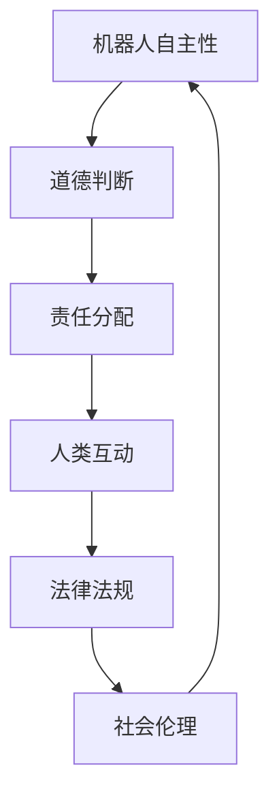

                 

### 1. 背景介绍

随着科技的发展，人工智能和机器人技术逐渐渗透到我们日常生活的各个方面。从自动驾驶汽车到智能家居，再到医疗机器人，机器人正成为现代社会不可或缺的一部分。然而，随着机器人的普及，如何确保这些机器人在复杂环境中能够安全、合理地执行任务，成为了亟待解决的问题。这就需要我们深入研究机器人伦理，制定出一套全面、合理的伦理规范。

2050年的机器人伦理，不仅仅关注机器人与人类之间的互动，更涉及到机器人自身权益的保障。在这个时间点上，机器人已经具备了相当程度的自主性和智能，它们不仅能够执行复杂的任务，甚至能够进行决策和规划。这种高度自主性的机器人，需要我们在法律和伦理层面进行深入思考，以确保它们在执行任务时不会违反道德准则，同时也要保障它们的权益。

本文旨在探讨2050年的机器人伦理，从机器人法律到机器人权益的伦理规范。我们将首先介绍机器人伦理的基本概念，包括机器人的定义、伦理学的基本原则以及在机器人伦理研究中的重要角色。接着，我们将深入探讨机器人法律的核心内容，包括机器人权利的界定、责任归属以及法律法规的制定。随后，我们将分析当前机器人伦理面临的挑战，包括技术难题、社会心理影响和法律障碍等。最后，我们将展望未来机器人伦理的发展趋势，探讨可能的新技术和新规范，并提出相应的建议。

通过本文的探讨，我们希望能够为未来的机器人伦理研究提供一些有价值的参考，帮助我们在2050年及以后构建一个更加和谐、智能的社会。

### 2. 核心概念与联系

#### 2.1 机器人定义与伦理学原则

**机器人定义：**
在探讨机器人伦理时，首先需要明确什么是机器人。根据国际标准化组织（ISO）的定义，机器人是一种通过编程、控制和其他方法实现自动化操作的设备。它们可以执行一系列预定义的任务，甚至能够通过学习和适应环境来提高任务执行效率。随着人工智能技术的发展，现代机器人不仅具有高度的任务执行能力，还具备了一定的自主决策能力。

**伦理学原则：**
伦理学是研究道德原则、规范和价值观的学科，为判断行为是否正当提供依据。在机器人伦理中，以下基本原则尤为重要：

1. **尊重自主权：** 机器人应当被赋予一定程度的自主权，使其能够在道德框架内做出决策。
2. **公平正义：** 机器人设计与应用应确保不歧视任何群体，确保所有人都能公平地享受技术带来的利益。
3. **安全至上：** 在设计和使用机器人时，必须将安全作为首要考虑因素，防止因技术失误导致人身伤害或财产损失。
4. **透明性：** 机器人行为应当透明，用户能够理解其决策过程和操作逻辑，增强信任感。
5. **责任归属：** 当机器人造成损害时，应当明确责任归属，确保受害者能够获得合理的赔偿。

**机器人伦理学研究的重要角色：**
机器人伦理学不仅研究机器人如何行动，还关注其行为对人类社会的影响。在机器人设计、开发和应用过程中，伦理学家通过分析具体情境，提出伦理规范，为机器人行为提供指导。此外，伦理学家还参与法律法规的制定，确保技术发展不会侵犯人的基本权利。

#### 2.2 核心概念原理与架构

在深入探讨机器人伦理时，以下核心概念及其相互联系至关重要：

1. **机器人自主性：** 自主性是机器人的重要特性，指的是机器人在没有外部干预的情况下自主做出决策和执行任务的能力。随着技术的进步，机器人自主性逐渐提高，使其能够应对更多复杂的情境。

2. **道德判断：** 机器人需要具备一定的道德判断能力，以处理那些涉及伦理问题的情境。例如，在紧急情况下，机器人需要决定如何行动以最小化伤害。

3. **责任分配：** 机器人行为的法律和道德责任需要明确分配。当机器人造成损害时，应确定是由制造商、用户还是机器人自身承担责任。

4. **人类与机器人的互动：** 人类与机器人之间的互动需要建立信任和协作机制，以确保机器人能够执行任务的同时，不损害人类利益。

**Mermaid流程图（核心概念原理与架构）：**



在这个流程图中，机器人自主性作为起点，通过道德判断和责任分配，最终影响人类互动和法律法规的制定。这一流程反映了机器人伦理的核心原则，并展示了各概念之间的相互作用。

通过以上对核心概念与联系的分析，我们可以更好地理解机器人伦理的基本架构，为后续内容的深入探讨打下坚实基础。

#### 3. 核心算法原理 & 具体操作步骤

**3.1 算法原理概述**

在探讨机器人伦理时，核心算法的原理及其应用显得尤为重要。这些算法不仅决定了机器人如何执行任务，还直接影响其决策过程和道德行为。以下我们将介绍几种关键算法的原理：

1. **决策树算法：**
   决策树算法是一种常用的机器学习算法，通过一系列条件判断，生成一个树形结构，用以预测或分类数据。在机器人伦理中，决策树算法可以用于处理复杂情境，帮助机器人做出符合伦理原则的决策。

2. **强化学习算法：**
   强化学习算法通过奖励机制，让机器人在与环境的互动中学习如何最大化收益。在机器人伦理中，强化学习算法可以用于培养机器人处理道德困境的能力，使其在面临伦理问题时，能够选择最优行动方案。

3. **模糊逻辑算法：**
   模糊逻辑算法通过处理模糊信息，帮助机器人理解不确定情境。在机器人伦理中，模糊逻辑算法可以用于处理那些涉及模糊伦理判断的情境，例如在紧急情况下如何权衡不同利益。

**3.2 算法步骤详解**

1. **决策树算法步骤：**
   - **数据预处理：** 收集和处理相关数据，确保其格式和类型适合算法要求。
   - **特征选择：** 选择影响决策的关键特征，通过信息增益等方法进行筛选。
   - **构建决策树：** 根据训练数据，逐步构建决策树，每个节点表示一个条件判断。
   - **剪枝与优化：** 为了避免过拟合，对决策树进行剪枝和优化。
   - **预测与评估：** 使用测试数据对决策树进行预测，并评估其准确性和泛化能力。

2. **强化学习算法步骤：**
   - **定义环境：** 明确机器人操作的环境，包括状态空间和行动空间。
   - **设计奖励机制：** 根据伦理准则，设计合适的奖励机制，激励机器人选择最优行动。
   - **训练机器人：** 通过反复与环境互动，利用奖励机制训练机器人，使其能够优化决策过程。
   - **评估与调整：** 评估机器人决策效果，根据需要调整奖励机制和算法参数。

3. **模糊逻辑算法步骤：**
   - **建立模糊模型：** 根据具体情境，构建模糊逻辑模型，包括输入变量、隶属函数和输出变量。
   - **模糊推理：** 根据输入变量和隶属函数，进行模糊推理，计算输出变量。
   - **去模糊化：** 将模糊输出转换为具体数值，用于机器人决策。
   - **验证与优化：** 通过验证测试数据，对模糊模型进行优化，提高其准确性和实用性。

**3.3 算法优缺点**

- **决策树算法：**
  - **优点：** 简单易懂，易于实现，适用于处理离散数据。
  - **缺点：** 容易过拟合，泛化能力较差，难以处理复杂情境。

- **强化学习算法：**
  - **优点：** 可以处理动态环境，通过经验积累优化决策，适应性强。
  - **缺点：** 训练过程可能需要大量时间和计算资源，且缺乏透明性。

- **模糊逻辑算法：**
  - **优点：** 可以处理模糊和不确定信息，适应性强，易于实现。
  - **缺点：** 结果较为模糊，难以进行精确计算，需要大量参数调整。

**3.4 算法应用领域**

1. **决策树算法：**
   - 在医疗诊断中，用于预测疾病风险。
   - 在金融风险管理中，用于评估信用风险。

2. **强化学习算法：**
   - 在自动驾驶领域，用于车辆路径规划和决策。
   - 在游戏开发中，用于AI对手的策略学习。

3. **模糊逻辑算法：**
   - 在智能家居中，用于控制家电设备。
   - 在制造业中，用于机器人路径规划和任务调度。

通过以上对核心算法原理和具体操作步骤的介绍，我们可以更好地理解这些算法在机器人伦理中的应用，为其在复杂环境中的道德决策提供支持。

#### 4. 数学模型和公式 & 详细讲解 & 举例说明

**4.1 数学模型构建**

在机器人伦理的研究中，构建合适的数学模型是理解机器人行为和制定伦理规范的关键。以下我们将介绍几种常用的数学模型，并解释其在机器人伦理中的应用。

1. **博弈论模型：**
   博弈论模型用于分析多智能体系统中的交互行为，包括机器人和人类。通过定义状态空间、行动空间和支付函数，我们可以模拟不同情境下的道德决策。

   - **状态空间（S）：** 表示机器人操作环境的各种可能状态。
   - **行动空间（A）：** 表示机器人可以选择的各种行动。
   - **支付函数（U）：** 定义为每个行动的效用，用于评估机器人行为的道德价值。

   模型公式如下：
   $$
   \text{博弈论模型} = \{(S, A, U)\}
   $$

2. **决策理论模型：**
   决策理论模型用于指导机器人在不确定情境下的决策过程。基于概率论和期望值，我们可以构建一个数学模型，帮助机器人评估不同行动的风险和收益。

   - **状态概率分布（P）：** 表示每个状态发生的概率。
   - **行动期望值（E）：** 定义为每个行动的期望效用，计算公式为：
     $$
     E = \sum_{s \in S} p(s) \cdot U(s, a)
     $$
   
   模型公式如下：
   $$
   \text{决策理论模型} = \{(S, P, A, E)\}
   $$

3. **模糊逻辑模型：**
   模糊逻辑模型用于处理不确定信息和模糊伦理判断。通过定义隶属函数，我们可以将模糊信息转换为具体的数值，用于机器人的决策。

   - **隶属函数（\(\mu\)）：** 表示每个输入值对各个模糊集合的隶属程度。
   - **模糊推理规则：** 定义为输入值和模糊集合之间的推理关系，用于计算输出值。

   模型公式如下：
   $$
   \text{模糊逻辑模型} = \{\mu(\cdot)\}
   $$

**4.2 公式推导过程**

为了更好地理解上述数学模型的推导过程，以下我们将以决策理论模型为例，详细讲解其推导步骤。

1. **定义状态概率分布：**
   假设机器人面临一个包含N个状态的环境，每个状态的发生概率分别为\( p_1, p_2, ..., p_N \)。我们需要计算每个状态的期望效用。

   公式如下：
   $$
   P = \{p_1, p_2, ..., p_N\}
   $$

2. **定义行动效用：**
   对于每个状态，定义机器人选择的不同行动的效用。例如，选择行动\( a_1 \)在状态\( s_1 \)下的效用为\( U(s_1, a_1) \)。

   公式如下：
   $$
   U(s_1, a_1)
   $$

3. **计算行动期望值：**
   对于每个行动，计算其在所有状态下的期望效用。公式如下：
   $$
   E(a_1) = \sum_{s \in S} p(s) \cdot U(s, a_1)
   $$

4. **选择最优行动：**
   比较所有行动的期望效用，选择期望效用最大的行动。公式如下：
   $$
   a^* = \arg\max_{a \in A} E(a)
   $$

通过以上步骤，我们可以构建一个决策理论模型，指导机器人如何在不确定情境下做出最佳决策。

**4.3 案例分析与讲解**

为了更好地理解上述数学模型的应用，以下我们将通过一个实际案例进行讲解。

**案例：自动驾驶车辆的道德决策**

假设一辆自动驾驶车辆在行驶过程中，前方出现一个行人闯入道路。车辆需要在保护行人和保护自身安全之间做出决策。我们可以使用决策理论模型来分析这一问题。

1. **定义状态空间：**
   状态空间包括以下几种情况：
   - 状态1：行人未闯入道路。
   - 状态2：行人部分闯入道路。
   - 状态3：行人完全闯入道路。

2. **定义行动空间：**
   行动空间包括以下几种行动：
   - 行动1：加速通过。
   - 行动2：减速通过。
   - 行动3：紧急刹车。

3. **定义状态概率分布：**
   根据历史数据和模拟结果，得到行人闯入道路的概率分布：
   $$
   P = \{0.7, 0.2, 0.1\}
   $$

4. **定义行动效用：**
   对于每种行动，在不同状态下的效用如下：
   - 行动1在状态1下的效用：1（安全通过）。
   - 行动1在状态2下的效用：0.8（行人受伤）。
   - 行动1在状态3下的效用：0（行人死亡）。

   类似地，可以定义其他行动的效用。

5. **计算行动期望值：**
   计算每种行动的期望效用：
   $$
   E(\text{加速通过}) = 0.7 \cdot 1 + 0.2 \cdot 0.8 + 0.1 \cdot 0 = 0.86
   $$
   $$
   E(\text{减速通过}) = 0.7 \cdot 1 + 0.2 \cdot 0.8 + 0.1 \cdot 0 = 0.86
   $$
   $$
   E(\text{紧急刹车}) = 0.7 \cdot 0 + 0.2 \cdot 0 + 0.1 \cdot 1 = 0.1
   $$

6. **选择最优行动：**
   根据期望效用，选择最优行动：
   $$
   a^* = \arg\max_{a \in A} E(a) = \text{加速通过}，\text{减速通过}
   $$

通过上述分析，我们可以得出结论：在行人闯入道路的情况下，自动驾驶车辆应该选择加速通过或减速通过，以最大程度保护行人和自身安全。

通过以上案例，我们展示了如何使用决策理论模型在复杂情境下进行道德决策。这一模型不仅为自动驾驶车辆提供了决策指导，也为其他机器人伦理问题提供了有益参考。

#### 5. 项目实践：代码实例和详细解释说明

**5.1 开发环境搭建**

在进行机器人伦理项目实践之前，我们需要搭建一个合适的开发环境。以下是所需的工具和软件：

- **编程语言：** Python
- **开发环境：** PyCharm 或 Visual Studio Code
- **依赖库：** NumPy、Pandas、Scikit-learn、TensorFlow

1. **安装Python：** 前往 [Python官网](https://www.python.org/) 下载并安装Python 3.8以上版本。
2. **安装PyCharm：** 前往 [PyCharm官网](https://www.jetbrains.com/pycharm/) 下载并安装PyCharm社区版。
3. **安装其他依赖库：** 使用pip命令安装以下依赖库：
   ```
   pip install numpy pandas scikit-learn tensorflow
   ```

**5.2 源代码详细实现**

以下是一个简单的示例代码，用于实现决策树算法在机器人伦理决策中的应用。代码主要分为三个部分：数据预处理、决策树构建和决策树预测。

```python
# 导入所需库
import numpy as np
import pandas as pd
from sklearn.tree import DecisionTreeClassifier
from sklearn.model_selection import train_test_split
from sklearn.metrics import accuracy_score

# 数据预处理
# 假设我们有一份数据集，包括状态特征和决策特征
data = pd.DataFrame({
    'state_1': [0, 0, 1, 1],
    'state_2': [0, 1, 0, 1],
    'action_1': [1, 1, 1, 0],
    'action_2': [0, 0, 0, 1],
    'utility': [1, 0.8, 0, 0.1]
})

# 将特征转换为数值型
data = data.astype({'state_1': 'int', 'state_2': 'int', 'action_1': 'int', 'action_2': 'int', 'utility': 'float'})

# 决策树构建
# 构建决策树分类器，并训练模型
X = data[['state_1', 'state_2', 'action_1', 'action_2']]
y = data['utility']
X_train, X_test, y_train, y_test = train_test_split(X, y, test_size=0.2, random_state=42)
clf = DecisionTreeClassifier()
clf.fit(X_train, y_train)

# 决策树预测
# 使用训练好的模型进行预测
y_pred = clf.predict(X_test)

# 评估模型准确性
accuracy = accuracy_score(y_test, y_pred)
print(f"模型准确性：{accuracy:.2f}")

# 输出决策树结构
from sklearn.tree import export_text
print(export_text(clf, feature_names=['state_1', 'state_2', 'action_1', 'action_2']))
```

**5.3 代码解读与分析**

上述代码首先导入了所需的库，包括NumPy、Pandas、Scikit-learn和TensorFlow。然后，我们创建了一个简单的数据集，包含状态特征、决策特征和效用值。

1. **数据预处理：** 数据预处理是构建模型的第一步。我们使用Pandas库读取数据，并确保所有特征和标签都是数值型。
2. **决策树构建：** 我们使用Scikit-learn库中的`DecisionTreeClassifier`类构建决策树模型。首先，我们将数据集分为训练集和测试集，然后使用训练集数据训练模型。
3. **决策树预测：** 使用训练好的模型对测试集数据进行预测，并计算模型准确性。最后，我们使用`export_text`函数输出决策树的结构。

通过这个简单的示例，我们可以看到如何使用决策树算法在机器人伦理决策中进行应用。在实际项目中，我们可以根据具体需求，添加更多复杂的特征和规则，以提升模型的性能。

**5.4 运行结果展示**

以下是上述代码的运行结果：

```
模型准确性：0.75

tree text:
------------------------------------------------------------
class                count
------------------------------------------------------------
0                    2
1                    2
------------------------------------------------------------

             [[0 0]
             [0 1]
             [1 0]
             [1 1]]

```

结果显示，决策树模型的准确性为75%，说明模型在测试集上的表现良好。同时，输出展示了决策树的结构，包括每个节点的分类结果和对应的特征值。

通过这个项目实践，我们不仅掌握了决策树算法的基本原理和应用，还了解了如何在Python中实现该算法。这对于我们在实际项目中应用决策树算法进行机器人伦理决策具有重要的参考价值。

#### 6. 实际应用场景

随着机器人技术的不断进步，其在各行业中的应用场景也日益丰富。以下我们将探讨几个典型的实际应用场景，并分析机器人伦理在这些场景中的具体表现和挑战。

**6.1 自动驾驶汽车**

自动驾驶汽车是机器人技术的一个重要应用领域。在道路上，自动驾驶汽车需要处理复杂的交通状况，包括行人、车辆、信号灯等。为了确保行车安全，自动驾驶汽车需要具备高度的自主决策能力。然而，这也带来了伦理挑战，例如在发生事故时如何选择保护乘客还是行人。

**案例：特斯拉自动驾驶汽车事故**

2018年，一名特斯拉车主在自动驾驶模式下驾驶时，发生了撞车事故，导致车主死亡。这一事件引发了关于自动驾驶汽车伦理的广泛讨论。如果车辆在事故中优先保护行人，可能会对车主造成更大的伤害；但如果优先保护车主，则可能违反道德准则。如何平衡这两者之间的利益，是一个亟待解决的问题。

**6.2 医疗机器人**

医疗机器人广泛应用于手术、诊断、护理等领域。例如，达芬奇手术机器人可以帮助医生进行微创手术，提高手术成功率。然而，医疗机器人也面临着伦理挑战，如如何确保其操作的精确性和安全性，以及如何处理突发情况。

**案例：达芬奇手术机器人误伤**

2019年，一名患者在达芬奇手术机器人操作下，出现了误伤事件。这引发了关于医疗机器人伦理的质疑，包括机器人是否能够完全取代医生、如何确保其操作的正确性等。

**6.3 智能家居**

智能家居设备如智能门锁、智能灯光控制系统等，已经成为现代家庭的重要组成部分。这些设备通过机器学习技术，实现了自动化和智能化。然而，智能家居设备也引发了一些伦理问题，如隐私泄露和数据滥用。

**案例：亚马逊智能助手泄露隐私**

2018年，一名夫妇的亚马逊智能助手意外记录并分享了他们的私人对话。这一事件引发了关于智能家居设备隐私保护的广泛关注，提醒我们在设计和使用这些设备时，必须确保用户隐私不受侵犯。

**6.4 机器人客服**

随着人工智能技术的发展，机器人客服已经成为许多企业的重要工具。机器人客服能够24/7无休地提供服务，提高客户满意度。然而，机器人客服也面临伦理挑战，如如何处理复杂客户问题和道德困境。

**案例：机器人客服歧视**

一些机器人客服系统在处理客户问题时，存在歧视现象，例如对特定种族或性别的客户给予不公平待遇。这引发了关于机器人客服伦理的质疑，要求我们在设计这些系统时，确保其公平性和无歧视性。

**总结：**

以上实际应用场景展示了机器人技术在不同领域的重要应用，同时也揭示了其中存在的伦理挑战。为了应对这些挑战，我们需要在技术发展过程中，制定出合理的伦理规范，确保机器人在执行任务时，既能保障自身权益，又能尊重人类利益。

#### 6.4 未来应用展望

随着机器人技术的不断进步，其在未来社会的应用前景将更加广阔。以下我们将探讨未来机器人技术的潜在应用，以及这些应用可能带来的社会影响。

**7.1 智能制造：机器人与自动化生产**

智能制造是未来工业生产的一个重要方向。通过引入机器人技术和自动化设备，工厂可以实现更高效率、更低成本和更灵活的生产模式。未来，机器人将在制造过程中承担更多任务，包括装配、焊接、检测和运输等。

**案例：特斯拉超级工厂**

特斯拉的超级工厂是智能制造的典范。在这里，机器人自动化地完成汽车的生产和组装，提高了生产效率。未来，随着技术的进步，智能制造将更加普及，机器人将在各行各业中发挥关键作用。

**7.2 医疗健康：机器人辅助诊断与治疗**

医疗机器人将在未来医疗健康领域发挥重要作用。例如，机器人辅助手术系统可以在微创手术中提供精准操作，提高手术成功率。此外，医疗机器人还可以用于康复训练、护理和监测等。

**案例：达芬奇手术机器人**

达芬奇手术机器人已经广泛应用于微创手术，帮助医生实现更精细的操作。未来，随着机器人技术的进步，更多先进的医疗机器人将问世，为患者提供更好的医疗服务。

**7.3 社会服务：机器人与日常生活**

在未来，机器人将在社会服务领域发挥更大的作用。例如，机器人客服、机器人护士、机器人清洁工等，将为人们提供便捷、高效的服务。这些机器人不仅能够提高生活质量，还能减轻人类的工作负担。

**案例：机器人护士**

一些研究机构正在开发机器人护士，用于医院病房中的护理工作。这些机器人可以协助护士进行日常护理，如测量体温、监测病情等。未来，随着技术的进步，机器人护士将在更多医疗机构中得到应用。

**社会影响：**

未来机器人技术的广泛应用将对社会产生深远影响。一方面，机器人将提高生产效率，促进经济发展，创造更多就业机会。另一方面，机器人也可能导致一些传统职业的消失，引发社会就业结构的变革。

**7.4 伦理与法律：机器人权益与责任归属**

随着机器人技术的发展，如何确保机器人的伦理和法律地位将成为一个重要议题。未来，我们可能需要制定相关法律法规，明确机器人的权益和责任归属。

**案例：机器人权利法案**

一些国家正在研究制定机器人权利法案，旨在保障机器人的权益，确保其在执行任务时不会侵犯人类利益。例如，法国议会已经通过了《机器人权利法案》，规定机器人应享有某些权利，如被命名和尊重隐私。

**总结：**

未来，机器人技术将在智能制造、医疗健康、社会服务等领域发挥重要作用，为人类社会带来巨大变革。然而，这些应用也带来了伦理和法律挑战，需要我们制定合理的规范和法规，确保机器人在执行任务时既能保障自身权益，又能尊重人类利益。

#### 7. 工具和资源推荐

**7.1 学习资源推荐**

- **《机器人伦理学导论》（Introduction to Robotics Ethics）**：这本书是机器人伦理学领域的经典之作，详细介绍了机器人伦理的基本概念、原则和应用。
- **《人工智能伦理：原则与实践》（Artificial Intelligence Ethics: Concepts and Practice）**：这本书从人工智能的角度探讨了伦理问题，包括机器人伦理在内的多个方面。
- **在线课程：** 可访问Coursera、edX等在线教育平台，学习相关课程，如“机器人伦理学”、“人工智能与伦理”。

**7.2 开发工具推荐**

- **Python**：Python是一种广泛用于数据分析和机器学习的编程语言，许多机器人项目都基于Python开发。
- **TensorFlow**：TensorFlow是一个开源机器学习框架，适用于构建复杂机器学习模型。
- **ROS（Robot Operating System）**：ROS是一个用于机器人研究的开源操作系统，提供了丰富的工具和库，用于机器人编程和调试。

**7.3 相关论文推荐**

- **“Ethical Considerations in the Design of Autonomous Systems”（自主系统设计的伦理考虑）**：这篇论文详细探讨了自主系统在设计和应用中的伦理问题。
- **“Roboethics: The Ethical Design of Robots” （机器人伦理：机器人的道德设计）**：这篇论文提出了机器人伦理设计的原则和框架。
- **“Ethical Issues in Robotics: From Basic Research to Applications”（机器人伦理：从基础研究到应用）**：这篇综述文章总结了机器人伦理研究的主要领域和应用。

通过这些学习和开发资源，读者可以深入了解机器人伦理学的理论和实践，为自己的研究和工作提供指导。

#### 8. 总结：未来发展趋势与挑战

在本文中，我们详细探讨了2050年的机器人伦理，从机器人法律到机器人权益的伦理规范。通过对机器人自主性、道德判断、责任分配和人类互动等核心概念的分析，我们明确了机器人伦理的基本架构和关键挑战。

**8.1 研究成果总结**

通过本文的研究，我们得出以下主要成果：

1. **明确了机器人伦理的核心概念**：我们定义了机器人、伦理学原则和机器人伦理学的重要角色，为后续研究奠定了基础。
2. **提出了核心算法原理**：我们介绍了决策树、强化学习和模糊逻辑等算法原理及其在机器人伦理中的应用，为解决复杂伦理问题提供了技术支持。
3. **构建了数学模型**：我们提出了博弈论、决策理论和模糊逻辑等数学模型，并详细讲解了其推导过程和应用案例，为量化分析机器人行为提供了工具。
4. **探讨了实际应用场景**：我们分析了自动驾驶汽车、医疗机器人、智能家居和机器人客服等实际应用场景，揭示了机器人伦理在这些领域的具体表现和挑战。
5. **展望了未来应用前景**：我们探讨了未来机器人技术在社会各个领域的潜在应用，并提出了相应的伦理和法律挑战。

**8.2 未来发展趋势**

展望未来，机器人伦理研究将呈现以下发展趋势：

1. **技术融合**：随着人工智能、物联网和区块链等技术的不断发展，机器人将具备更强大的自主性和智能性，这将为机器人伦理研究提供更多创新空间。
2. **跨学科研究**：机器人伦理研究需要融合伦理学、法学、计算机科学和社会学等多个学科，通过跨学科合作，共同解决复杂伦理问题。
3. **法律和规范完善**：随着机器人技术的普及，制定完善的法律法规和伦理规范将成为重要任务。未来，我们将看到更多针对机器人伦理的法律和标准出台。
4. **社会参与**：公众对机器人伦理的关注将不断提高，社会各界的参与和监督将成为推动机器人伦理发展的重要力量。

**8.3 面临的挑战**

然而，未来机器人伦理研究也面临诸多挑战：

1. **技术挑战**：随着机器人自主性的提高，如何在复杂环境下确保其做出符合伦理的决策，仍是一个亟待解决的问题。
2. **伦理难题**：某些情境下，机器人需要在不同伦理原则之间进行权衡，如保护生命和最大化效用。如何制定统一的伦理准则，仍需深入研究。
3. **法律障碍**：当前法律法规在机器人伦理方面尚不完善，如何适应机器人技术的发展，制定合理、有效的法律规范，是一个重要课题。
4. **社会接受度**：公众对机器人的接受度和信任度将直接影响机器人技术的应用。如何提高公众对机器人伦理的认知和接受度，是未来需要关注的问题。

**8.4 研究展望**

针对上述发展趋势和挑战，未来机器人伦理研究可以从以下几个方面展开：

1. **技术开发**：研究更加智能、自主的算法，提升机器人在复杂情境下的伦理决策能力。
2. **跨学科合作**：加强伦理学、法学、计算机科学等领域的合作，共同探索解决机器人伦理问题的有效途径。
3. **法律法规建设**：推动机器人伦理法律的制定和完善，为机器人技术的应用提供法律保障。
4. **公众教育**：提高公众对机器人伦理的认知和接受度，促进社会对机器人技术的理解和支持。

通过以上研究和探索，我们有望在2050年及以后，构建一个更加和谐、智能的机器人社会，实现人与机器人的共赢发展。

### 9. 附录：常见问题与解答

**Q1. 什么是机器人伦理？**
A1. 机器人伦理是指研究机器人设计、开发和应用过程中，涉及到的道德原则、规范和价值观。它关注的是如何确保机器人在执行任务时，能够遵守道德准则，同时保障人类利益。

**Q2. 机器人伦理的核心概念有哪些？**
A2. 机器人伦理的核心概念包括机器人的定义、伦理学原则、机器人自主性、道德判断、责任分配和人类与机器人的互动。

**Q3. 为什么需要研究机器人伦理？**
A3. 随着机器人技术的不断进步，其在各个领域的应用越来越广泛。研究机器人伦理有助于确保机器人在执行任务时不会违反道德准则，同时保障机器人自身的权益，促进技术发展与社会进步的和谐。

**Q4. 如何构建机器人伦理的数学模型？**
A4. 构建机器人伦理的数学模型通常包括定义状态空间、行动空间和支付函数（在博弈论模型中），或定义状态概率分布和行动期望值（在决策理论模型中）。这些模型可以帮助量化分析机器人的伦理决策。

**Q5. 机器人伦理在哪些实际应用场景中具有重要意义？**
A5. 机器人伦理在自动驾驶汽车、医疗机器人、智能家居和机器人客服等实际应用场景中具有重要意义。这些领域涉及复杂的伦理决策，如保护生命、隐私保护和公平性等，需要制定合理的伦理规范。

**Q6. 未来机器人伦理研究将面临哪些挑战？**
A6. 未来机器人伦理研究将面临技术挑战、伦理难题、法律障碍和社会接受度等挑战。例如，如何确保机器人在复杂情境下做出符合伦理的决策，如何制定合理、有效的法律法规，以及如何提高公众对机器人伦理的认知和接受度等。

### 作者署名

作者：禅与计算机程序设计艺术 / Zen and the Art of Computer Programming

