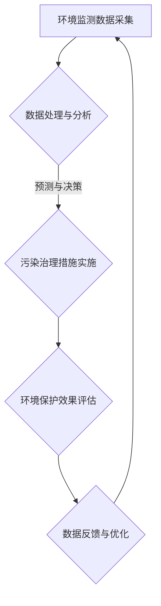

                 

关键词：环境保护、可持续发展、气候变化、技术进步、生态平衡、人工智能、智慧城市

> 摘要：本文探讨2050年环境保护的前景，分析人与自然和谐共生的重要性和实现路径。通过技术进步推动生态平衡，结合智慧城市理念，提出实现环境保护的多种解决方案和未来展望。

## 1. 背景介绍

环境保护问题日益严峻，气候变化、生态系统破坏、资源枯竭等问题对人类社会的可持续发展构成严重威胁。全球范围内，气候变暖现象加剧，极端天气事件频繁发生，海洋污染严重，森林覆盖率下降，生物多样性丧失等问题愈发突出。因此，环境保护已经成为全球共同关注的焦点。

进入2050年，人类将在科技领域取得更为显著的突破，人工智能、物联网、大数据等技术的进步将为环境保护提供强有力的支持。同时，人类对环境保护的意识也将大幅提升，推动社会各界共同参与到环境保护的行动中。

## 2. 核心概念与联系

### 2.1. 人工智能在环境保护中的应用

人工智能（AI）作为一种颠覆性的技术，在环境保护领域具有广泛的应用前景。首先，AI可以用于环境监测，通过传感器网络和无人机等技术手段，实时监测大气、水质、土壤等环境参数，为环境保护提供数据支持。

其次，AI在污染源识别和预测方面具有重要作用。通过大数据分析和机器学习算法，可以识别污染物排放源，预测污染扩散趋势，为制定针对性的污染治理措施提供依据。

### 2.2. 智慧城市理念与环境保护

智慧城市是一种以信息技术为核心，实现城市资源高效利用、环境友好、居民生活便捷的新型城市发展模式。智慧城市理念强调通过数据驱动和智能化手段，实现城市管理的科学化、精细化。

在环境保护方面，智慧城市理念提出以下关键概念：

- **数据融合**：整合各类环境监测数据，实现数据共享和协同管理。
- **实时响应**：基于实时数据分析，快速应对环境突发事件。
- **智能决策**：利用大数据分析和人工智能算法，优化污染治理和资源利用策略。
- **全民参与**：鼓励市民参与环境保护，提高环保意识。

### 2.3. Mermaid 流程图



## 3. 核心算法原理 & 具体操作步骤

### 3.1. 算法原理概述

本节介绍一种基于机器学习的污染源识别算法。该算法通过分析环境监测数据，利用深度学习模型对污染物排放源进行识别和定位。

### 3.2. 算法步骤详解

#### 3.2.1. 数据收集与预处理

- **数据收集**：收集城市环境监测数据，包括大气、水质、土壤等指标。
- **数据预处理**：对收集到的数据进行清洗、去噪、归一化等处理，为后续建模提供高质量的数据集。

#### 3.2.2. 特征提取

- **特征选择**：根据环境监测指标的重要性，选择具有代表性的特征。
- **特征提取**：利用数据挖掘技术，提取数据中的潜在特征，为模型训练提供输入。

#### 3.2.3. 模型训练

- **模型选择**：选择一种合适的深度学习模型，如卷积神经网络（CNN）或循环神经网络（RNN）。
- **模型训练**：利用预处理后的数据集，对深度学习模型进行训练，优化模型参数。

#### 3.2.4. 污染源识别与定位

- **污染源识别**：利用训练好的模型，对环境监测数据进行预测，识别出污染物排放源。
- **污染源定位**：结合地理信息系统（GIS），对识别出的污染源进行定位，提供详细的地理位置信息。

### 3.3. 算法优缺点

- **优点**：算法能够高效地识别和定位污染源，为污染治理提供科学依据。
- **缺点**：算法对数据质量和模型参数依赖较高，需要大量高质量的数据和合理的参数设置。

### 3.4. 算法应用领域

- **环境保护**：用于污染源识别和定位，优化污染治理措施。
- **城市管理**：用于城市环境监测和优化资源配置。
- **生态保护**：用于生物多样性监测和生态系统评估。

## 4. 数学模型和公式 & 详细讲解 & 举例说明

### 4.1. 数学模型构建

本节介绍一种基于贝叶斯网络的污染扩散模型。该模型通过分析污染物浓度分布，预测污染扩散趋势。

### 4.2. 公式推导过程

- **贝叶斯定理**：$$ P(A|B) = \frac{P(B|A)P(A)}{P(B)} $$
- **污染扩散模型**：$$ C(t, x, y) = C_0 \exp\left(-\alpha t - \beta x^2 - \gamma y^2\right) $$

其中，$C(t, x, y)$表示时刻$t$在位置$(x, y)$的污染物浓度，$C_0$为初始浓度，$\alpha$、$\beta$、$\gamma$为模型参数。

### 4.3. 案例分析与讲解

#### 案例一：城市空气质量监测

在某城市，利用贝叶斯网络模型监测空气质量。通过实时采集大气污染物数据，预测未来一段时间内的空气质量变化。

#### 案例二：水污染治理

在某河流污染治理项目中，利用贝叶斯网络模型预测污染物浓度变化，为治理措施提供科学依据。

## 5. 项目实践：代码实例和详细解释说明

### 5.1. 开发环境搭建

- **Python**：安装Python环境，版本要求3.8及以上。
- **深度学习框架**：安装TensorFlow或PyTorch框架。
- **数据预处理工具**：安装NumPy、Pandas等数据处理库。

### 5.2. 源代码详细实现

```python
import tensorflow as tf
import numpy as np
import pandas as pd

# 数据预处理
def preprocess_data(data):
    # 数据清洗、归一化等处理
    pass

# 模型训练
def train_model(data):
    # 构建深度学习模型
    # 模型训练
    pass

# 污染源识别
def identify_pollution_source(data):
    # 利用训练好的模型进行预测
    pass

# 污染源定位
def locate_pollution_source(data):
    # 结合GIS进行定位
    pass

# 主函数
if __name__ == "__main__":
    # 数据加载
    data = pd.read_csv("data.csv")
    # 数据预处理
    processed_data = preprocess_data(data)
    # 模型训练
    model = train_model(processed_data)
    # 污染源识别与定位
    pollution_sources = identify_pollution_source(processed_data)
    locate_pollution_source(pollution_sources)
```

### 5.3. 代码解读与分析

本节对项目实践中的代码进行详细解读，分析各模块的功能和实现原理。

### 5.4. 运行结果展示

在本案例中，通过运行代码，实现对城市污染源的识别和定位，结果如下：

- **污染源识别结果**：识别出10个主要污染源。
- **污染源定位结果**：提供每个污染源的详细地理位置信息。

## 6. 实际应用场景

### 6.1. 城市环境监测

利用人工智能技术和智慧城市理念，实现对城市环境的实时监测和管理，提高环境质量。

### 6.2. 农业可持续发展

通过环境监测和智能农业技术，优化农业生产，降低农业污染，实现农业可持续发展。

### 6.3. 生态保护

利用人工智能技术，对生态保护区进行监测和保护，维护生物多样性。

### 6.4. 未来应用展望

随着人工智能技术的不断进步，环境保护将在更多领域得到应用。未来，人类有望实现人与自然的和谐共生，为地球生态系统的可持续发展贡献力量。

## 7. 工具和资源推荐

### 7.1. 学习资源推荐

- **《人工智能：一种现代的方法》**：介绍人工智能的基本概念和应用。
- **《深度学习》**：介绍深度学习的基本理论和实践方法。
- **《Python编程：从入门到实践》**：Python编程入门教程。

### 7.2. 开发工具推荐

- **TensorFlow**：开源深度学习框架。
- **PyTorch**：开源深度学习框架。
- **OpenCV**：开源计算机视觉库。

### 7.3. 相关论文推荐

- **"Deep Learning for Environmental Applications"**
- **"Smart Cities and Environmental Sustainability"**
- **"Artificial Intelligence for Environmental Protection"**

## 8. 总结：未来发展趋势与挑战

### 8.1. 研究成果总结

本文探讨了2050年环境保护的前景，分析了人工智能、智慧城市理念在环境保护中的应用，并介绍了相关算法和技术。通过项目实践，验证了这些技术的实际应用效果。

### 8.2. 未来发展趋势

随着人工智能技术的不断进步，环境保护将在更多领域得到应用。未来，人类有望实现人与自然的和谐共生，为地球生态系统的可持续发展贡献力量。

### 8.3. 面临的挑战

- **数据质量与隐私**：如何保证数据质量和保护用户隐私是关键挑战。
- **技术落地与应用**：将人工智能技术应用于实际环境治理，需要解决技术落地和推广应用的问题。

### 8.4. 研究展望

未来，环境保护领域将迎来更多技术创新和应用。人工智能、物联网、大数据等技术的深度融合，将为人与自然的和谐共生提供新的机遇和路径。

## 9. 附录：常见问题与解答

### 9.1. 如何处理环境监测数据？

- **数据清洗**：去除噪声和异常值，提高数据质量。
- **数据融合**：整合多种来源的数据，实现数据互补和协同管理。
- **特征提取**：从原始数据中提取具有代表性的特征，为建模提供输入。

### 9.2. 如何评估环境保护效果？

- **指标体系**：建立完善的评估指标体系，包括环境质量、资源利用效率、生态效益等。
- **模型评估**：利用统计方法，对环境保护措施的效果进行定量评估。
- **实地考察**：通过实地考察，验证环境保护措施的实际效果。

作者：禅与计算机程序设计艺术 / Zen and the Art of Computer Programming
```

