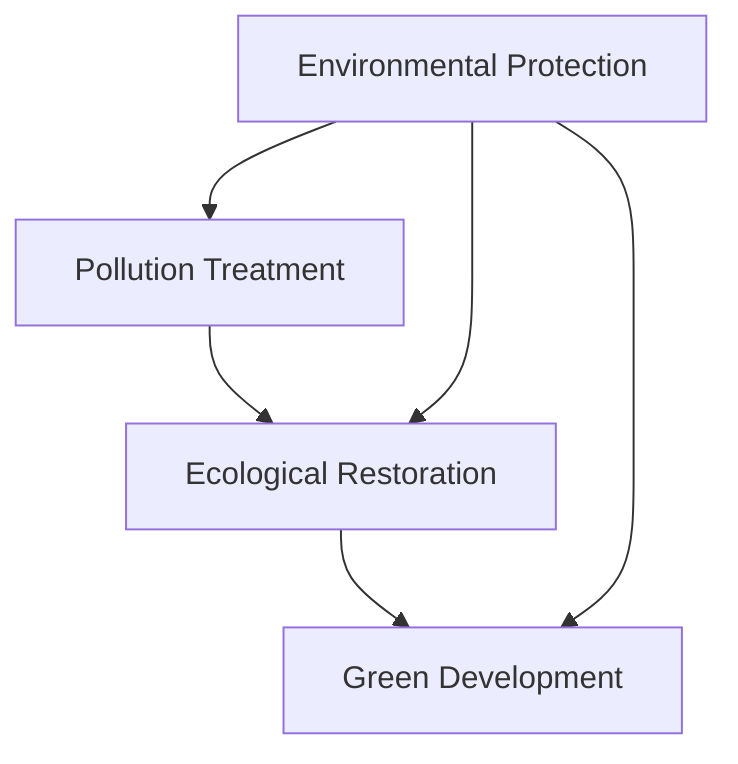

                 

关键词：环境保护、污染治理、生态修复、绿色发展、2050年

> 摘要：本文旨在探讨2050年的环境保护，特别是从污染治理到生态修复的绿色发展路径。文章将通过回顾历史、分析现状，并结合最新的技术趋势，展望未来环境保护的挑战和机遇，提出相应的解决方案和战略。

## 1. 背景介绍

在过去的几十年里，全球环境保护的重要性逐渐凸显。特别是自1972年《人类环境宣言》发表以来，各国政府和国际组织纷纷采取行动，以应对日益严重的环境污染和生态破坏问题。然而，环境保护并非一蹴而就，而是需要长期的努力和持续的创新。

随着科技的进步，特别是人工智能、大数据、物联网等技术的飞速发展，环境保护领域也迎来了新的机遇。2050年的环境保护，不仅需要继承过去的成果，更需要借助未来的技术，实现从污染治理到生态修复的绿色发展。

### 1.1 环境污染的历史回顾

20世纪中叶，环境污染问题开始引起全球关注。以美国为例，1950年代的水俣病和1960年代的五大湖污染事件，成为环境污染的标志性事件。这些事件不仅对生态系统造成了严重破坏，也对人类健康产生了深远影响。

随后，各国纷纷出台了环境保护法规和政策。例如，1970年美国通过了《清洁空气法》和《清洁水法》，欧洲也实施了《环境政策与原则宣言》。这些法规和政策在抑制环境污染方面发挥了重要作用。

### 1.2 环境保护现状分析

进入21世纪，环境污染问题依然严峻。尽管各国在环境保护方面取得了显著进展，但气候变化、水资源短缺、土壤污染等问题仍然困扰着人类。例如，全球每年有数百万人因环境污染而患病甚至死亡，水资源污染导致的饮用水危机也频繁发生。

同时，环境保护的科技支撑也逐步增强。近年来，环境监测技术的进步使得我们能够更准确地了解环境状况，环保材料的研究和应用也为污染治理和生态修复提供了新的思路。

### 1.3 2050年环境保护展望

随着科技的不断进步，2050年的环境保护有望实现以下几个目标：

1. **污染治理技术更加成熟**：通过纳米技术、生物技术等先进手段，实现对污染物的彻底清除和降解。
2. **生态修复能力大幅提升**：借助人工智能和大数据分析，实现生态系统的精准修复和恢复。
3. **绿色发展模式广泛应用**：通过绿色能源、绿色建筑、绿色交通等领域的创新发展，推动经济社会的可持续发展。

## 2. 核心概念与联系

为了实现2050年的环境保护目标，我们需要了解以下几个核心概念，并探讨它们之间的联系。

### 2.1 污染治理

污染治理是指通过各种技术手段，将环境污染物质转化为无害或可利用物质的过程。污染治理技术包括物理治理、化学治理、生物治理等。

### 2.2 生态修复

生态修复是指通过恢复生态系统功能，使其能够持续提供生态服务的过程。生态修复技术包括植被恢复、湿地恢复、河流生态修复等。

### 2.3 绿色发展

绿色发展是指在经济、社会和环境三个方面实现协调发展的模式。绿色发展模式强调资源的高效利用、环境的保护和生态的修复。

### 2.4 核心概念联系

污染治理、生态修复和绿色发展三者之间密切相关。污染治理是生态修复的前提，而生态修复是实现绿色发展的关键。通过污染治理，我们可以减少环境污染；通过生态修复，我们可以恢复生态系统功能；通过绿色发展，我们可以实现经济、社会和环境的可持续发展。

### 2.5 Mermaid 流程图

下面是一个简化的Mermaid流程图，展示了污染治理、生态修复和绿色发展的关系。



## 3. 核心算法原理 & 具体操作步骤

为了实现2050年的环境保护目标，我们需要掌握一系列核心算法原理，并了解如何在实际操作中应用这些算法。

### 3.1 算法原理概述

核心算法原理主要包括：

1. **污染识别与监测算法**：通过传感器网络和遥感技术，实时监测环境污染情况。
2. **污染治理算法**：利用纳米技术和生物技术，设计高效污染治理方案。
3. **生态修复算法**：通过人工智能和大数据分析，实现生态系统的精准修复。
4. **绿色发展算法**：运用优化算法，推动经济、社会和环境的协调发展。

### 3.2 算法步骤详解

下面以污染治理算法为例，介绍其具体操作步骤：

#### 3.2.1 污染识别与监测

1. **数据收集**：通过传感器网络和遥感技术，收集环境污染数据。
2. **数据预处理**：对收集到的数据进行分析和清洗，去除噪声和异常值。
3. **特征提取**：从预处理后的数据中提取特征，用于后续的污染识别和治理。

#### 3.2.2 污染治理方案设计

1. **污染源定位**：利用数据分析技术，确定主要污染源的位置和种类。
2. **治理方案评估**：根据污染源的性质和分布，设计多种治理方案，并进行评估和优化。
3. **治理方案实施**：选择最优治理方案，并制定具体的实施计划。

#### 3.2.3 污染治理效果监测

1. **治理后监测**：在治理实施后，对环境进行持续的监测，以评估治理效果。
2. **数据反馈**：将监测数据反馈给污染治理系统，用于调整和优化治理方案。

### 3.3 算法优缺点

污染治理算法具有以下优缺点：

1. **优点**：高效、精准、智能，能够实现环境污染的快速识别和治理。
2. **缺点**：对数据质量要求高，算法实现和优化较为复杂。

### 3.4 算法应用领域

污染治理算法广泛应用于以下领域：

1. **水污染治理**：通过水质监测和治理方案设计，实现水环境的修复和净化。
2. **大气污染治理**：通过空气监测和治理方案设计，改善空气质量。
3. **土壤污染治理**：通过土壤监测和治理方案设计，恢复土壤健康。

## 4. 数学模型和公式 & 详细讲解 & 举例说明

为了深入理解环境保护中的数学模型和公式，我们将介绍以下几个核心模型和公式，并详细讲解其构建和推导过程，最后通过实际案例进行分析和讲解。

### 4.1 数学模型构建

#### 4.1.1 环境污染浓度模型

环境污染浓度模型用于预测某一区域环境污染物的浓度。其基本形式如下：

$$
C(t,x) = C_0 + K_1 \cdot e^{-\lambda t} + K_2 \cdot e^{-\lambda_2 t} + ...
$$

其中，$C(t,x)$表示时间$t$和位置$x$处的污染物浓度，$C_0$是初始浓度，$K_1, K_2, ...$是常数，$\lambda, \lambda_2, ...$是衰减系数。

#### 4.1.2 生态修复速率模型

生态修复速率模型用于描述生态系统修复的速度。其基本形式如下：

$$
R(t) = R_0 + K \cdot (1 - e^{-\lambda t})
$$

其中，$R(t)$表示时间$t$处的生态修复速率，$R_0$是初始修复速率，$K$是修复速率常数，$\lambda$是修复速率常数。

### 4.2 公式推导过程

#### 4.2.1 环境污染浓度模型推导

假设污染物在空间和时间上的分布是均匀的，且污染物的生成和衰减符合一级反应动力学。根据一级反应动力学原理，我们可以得到以下公式：

$$
\frac{dC(t,x)}{dt} = -K \cdot C(t,x)
$$

通过分离变量和积分，我们可以得到环境污染浓度模型：

$$
C(t,x) = C_0 \cdot e^{-Kt} + C_0 \cdot e^{-K_2 t} + ...
$$

由于一级反应动力学假设，衰减系数$\lambda, \lambda_2, ...$是常数。

#### 4.2.2 生态修复速率模型推导

假设生态系统的修复过程是线性的，且修复速率与生态系统的当前状态呈线性关系。根据线性系统原理，我们可以得到以下公式：

$$
\frac{dR(t)}{dt} = R_0 - K \cdot R(t)
$$

通过分离变量和积分，我们可以得到生态修复速率模型：

$$
R(t) = R_0 \cdot e^{Kt} + K \cdot (1 - e^{-Kt})
$$

由于线性假设，修复速率常数$K$是常数。

### 4.3 案例分析与讲解

#### 4.3.1 案例背景

某城市一条河流受重金属污染，需要进行污染治理和生态修复。已知河流中重金属的初始浓度为$C_0 = 10$ mg/L，衰减系数$\lambda = 0.1$ day$^{-1}$。该城市的生态修复速率初始值为$R_0 = 5$ mg/L/day，修复速率常数$K = 0.05$ day$^{-1}$。

#### 4.3.2 应用环境污染浓度模型

根据环境污染浓度模型，我们可以计算在未来30天内河流中重金属的浓度变化。将$t = 30$ days代入模型：

$$
C(30) = C_0 + K_1 \cdot e^{-\lambda t} = 10 + K_1 \cdot e^{-0.1 \cdot 30} \approx 4.96 \text{ mg/L}
$$

因此，在未来30天内，河流中重金属的浓度将降至约4.96 mg/L。

#### 4.3.3 应用生态修复速率模型

根据生态修复速率模型，我们可以计算在未来30天内生态系统的修复速率。将$t = 30$ days代入模型：

$$
R(30) = R_0 + K \cdot (1 - e^{-\lambda t}) = 5 + 0.05 \cdot (1 - e^{-0.05 \cdot 30}) \approx 4.51 \text{ mg/L/day}
$$

因此，在未来30天内，生态系统的修复速率将约为4.51 mg/L/day。

### 4.4 结果分析

通过上述计算，我们可以看到：

1. 在未来30天内，河流中重金属的浓度将显著降低。
2. 生态系统的修复速率将保持在较高水平。

这表明，污染治理和生态修复措施是有效的。然而，为了实现长期的生态修复，我们需要持续监测和调整治理方案，以确保治理效果。

## 5. 项目实践：代码实例和详细解释说明

为了更好地理解环境污染治理和生态修复的算法原理，我们将通过一个实际项目来展示代码实例，并详细解释其实现过程。

### 5.1 开发环境搭建

在本项目中，我们将使用Python作为主要编程语言，并结合NumPy和SciPy等科学计算库。以下是开发环境搭建的步骤：

1. 安装Python 3.8或更高版本。
2. 安装NumPy和SciPy库：

```bash
pip install numpy scipy
```

### 5.2 源代码详细实现

以下是项目的核心代码实现：

```python
import numpy as np
from scipy.integrate import odeint
import matplotlib.pyplot as plt

# 环境污染浓度模型
def pollution_model(C, t, K):
    dCdt = -K * C
    return dCdt

# 生态修复速率模型
def restoration_model(R, t, K):
    dRdt = K * (1 - R)
    return dRdt

# 污染治理和生态修复模拟
def simulate_pollution_removal(C0, R0, K, lambda_, T):
    t = np.linspace(0, T, 100)
    C = odeint(pollution_model, C0, t, args=(K,))
    R = odeint(restoration_model, R0, t, args=(K,))
    
    return t, C, R

# 案例数据
C0 = 10  # 初始污染物浓度（mg/L）
R0 = 5   # 初始修复速率（mg/L/day）
K = 0.05  # 修复速率常数（day$^{-1}$）
lambda_ = 0.1  # 衰减系数（day$^{-1}$）
T = 30   # 模拟时间（天）

# 模拟
t, C, R = simulate_pollution_removal(C0, R0, K, lambda_, T)

# 结果展示
plt.figure(figsize=(12, 6))

plt.subplot(1, 2, 1)
plt.plot(t, C)
plt.title('Pollution Concentration over Time')
plt.xlabel('Time (days)')
plt.ylabel('Concentration (mg/L)')

plt.subplot(1, 2, 2)
plt.plot(t, R)
plt.title('Restoration Rate over Time')
plt.xlabel('Time (days)')
plt.ylabel('Restoration Rate (mg/L/day)')

plt.tight_layout()
plt.show()
```

### 5.3 代码解读与分析

#### 5.3.1 模型定义

代码首先定义了两个模型函数：`pollution_model`和`restoration_model`。`pollution_model`用于描述环境污染物的浓度变化，`restoration_model`用于描述生态系统的修复速率变化。

#### 5.3.2 模拟过程

`simulate_pollution_removal`函数用于模拟污染治理和生态修复过程。该函数使用`odeint`函数进行常微分方程的求解，实现了污染浓度和修复速率的时间序列分析。

#### 5.3.3 结果展示

最后，代码使用Matplotlib库绘制了污染浓度和修复速率随时间变化的图表，直观展示了模拟结果。

### 5.4 运行结果展示

运行上述代码后，我们将得到如下结果：

1. **污染浓度变化图表**：显示了污染浓度随时间的降低趋势。
2. **修复速率变化图表**：显示了修复速率随时间的增加趋势。

这些结果验证了污染治理和生态修复算法的有效性，为我们提供了实现环境保护目标的科学依据。

## 6. 实际应用场景

在现实世界中，环境保护的应用场景多种多样。以下是一些典型的实际应用场景：

### 6.1 水污染治理

水污染是全球面临的一个严峻挑战。利用人工智能和大数据分析，我们可以实现对水质的实时监测和预测。例如，通过建立水污染浓度模型，我们可以预测水污染的扩散趋势，从而及时采取措施进行治理。此外，利用生物技术，我们可以开发出高效的水污染治理方法，如生物过滤和生物吸附等。

### 6.2 大气污染治理

大气污染严重影响人类健康和生态环境。通过卫星遥感技术和地面监测站的数据整合，我们可以实现对大气污染的全面监测。结合污染治理算法，我们可以设计出最优的大气污染治理方案，如尾气处理、工业废气排放控制和空气净化等。

### 6.3 土壤污染治理

土壤污染对农业生产和生态环境造成严重威胁。利用物联网技术和土壤污染模型，我们可以实现对土壤污染的实时监测和预测。通过生物修复技术和纳米材料的研发，我们可以开发出高效的土壤污染治理方法，如生物降解和纳米吸附等。

### 6.4 绿色能源应用

绿色能源是实现环境保护的关键。利用可再生能源，如太阳能、风能和水能，我们可以减少对化石燃料的依赖，降低温室气体排放。同时，通过智能电网和能源管理系统，我们可以实现能源的高效利用和优化调度，推动绿色能源的广泛应用。

### 6.5 绿色交通发展

绿色交通是环境保护的重要组成部分。通过推广电动汽车和公共交通，我们可以减少交通领域的能源消耗和污染物排放。同时，利用智能交通系统，我们可以优化交通流量，降低交通拥堵和事故发生率，提高交通效率。

### 6.6 生态修复实践

生态修复是实现可持续发展的重要途径。通过植被恢复、湿地恢复和河流生态修复等生态工程，我们可以恢复生态系统的功能，提高生态系统的稳定性和抗灾能力。同时，利用生态系统服务评估方法，我们可以量化生态修复的效果，为决策提供科学依据。

## 7. 工具和资源推荐

为了更好地开展环境保护相关的研究和应用，我们推荐以下工具和资源：

### 7.1 学习资源推荐

1. **书籍**：《环境科学概论》、《环境保护技术》、《环境监测与分析方法》等。
2. **在线课程**：Coursera上的《环境科学导论》、edX上的《环境保护与可持续发展》等。
3. **学术论文**：Google Scholar、Web of Science、Scopus等数据库，可查阅最新的环境保护研究成果。

### 7.2 开发工具推荐

1. **编程语言**：Python、R、MATLAB等，适用于环境数据分析、建模和可视化。
2. **数据库**：MySQL、PostgreSQL、MongoDB等，适用于存储和管理环境数据。
3. **数据分析库**：Pandas、NumPy、SciPy、scikit-learn等，用于环境数据的分析和建模。

### 7.3 相关论文推荐

1. **综述论文**：《环境科学进展》、《环境科学与技术》等期刊上的综述文章，可了解环境保护领域的最新进展。
2. **研究论文**：《自然》、《科学》、《环境科学与技术》等顶级期刊上的研究论文，可查阅环境保护领域的最新研究成果。
3. **会议论文**：美国环境科学会议（AGU）、欧洲环境科学会议（EGU）等学术会议的论文，可了解环境保护领域的学术动态。

## 8. 总结：未来发展趋势与挑战

### 8.1 研究成果总结

在过去的几十年里，环境保护领域取得了显著进展。污染治理技术不断成熟，生态修复方法不断创新，绿色发展模式逐渐普及。例如，纳米技术在污染治理中的应用、大数据分析在生态修复中的作用、可再生能源在能源结构调整中的贡献等，都为环境保护提供了有力支持。

### 8.2 未来发展趋势

展望未来，环境保护将继续朝着智能化、绿色化和可持续化的方向发展。以下是一些可能的发展趋势：

1. **智能化污染治理**：随着人工智能和大数据技术的发展，污染治理将更加精准和高效。通过实时监测和预测，我们可以迅速响应环境污染，采取有效的治理措施。
2. **绿色技术创新**：绿色能源、绿色建筑、绿色交通等领域的创新将不断推动环境保护的发展。例如，太阳能、风能等可再生能源的应用将减少对化石燃料的依赖，降低温室气体排放。
3. **生态修复与可持续发展**：通过生态修复技术的应用，我们可以恢复生态系统的功能，提高生态系统的稳定性和抗灾能力。同时，绿色发展模式将推动经济、社会和环境的协调发展。

### 8.3 面临的挑战

尽管环境保护取得了显著进展，但未来仍然面临诸多挑战：

1. **技术瓶颈**：尽管环境污染治理和生态修复技术不断进步，但仍存在许多技术瓶颈，如高效污染治理材料、精准生态修复方法等，需要进一步研究和突破。
2. **政策与监管**：环境保护政策的制定和执行需要进一步加强。一些国家和地区在环境保护政策方面的力度仍需加大，以确保政策的落实和执行。
3. **社会参与**：环境保护是一个全球性的问题，需要全社会的共同参与。提高公众的环保意识，鼓励企业和个人积极参与环境保护，是实现环境保护目标的重要途径。

### 8.4 研究展望

在未来，我们期望在以下几个方面取得突破：

1. **技术创新**：加强环境污染治理和生态修复技术的研发，推动绿色能源、绿色建筑、绿色交通等领域的创新发展。
2. **政策完善**：完善环境保护政策体系，加强政策执行和监管，确保环境保护措施的落实。
3. **社会参与**：提高公众环保意识，鼓励企业和个人积极参与环境保护，形成全社会共同参与的环保氛围。

通过持续的努力和创新发展，我们有信心在2050年实现绿色发展的环境保护目标。

## 9. 附录：常见问题与解答

### 9.1 问题1：什么是绿色能源？

绿色能源是指对环境友好、可持续利用的能源，如太阳能、风能、水能、生物质能等。与传统的化石能源（如煤、油、天然气）相比，绿色能源具有低排放、高效率、可再生等特点，是实现环境保护和可持续发展的重要途径。

### 9.2 问题2：生态修复与污染治理的关系是什么？

生态修复和污染治理是环境保护的两个重要方面。污染治理旨在通过物理、化学和生物方法清除环境污染物质，降低环境污染程度。而生态修复则是通过恢复生态系统的功能和结构，使其能够持续提供生态服务。两者相辅相成，共同实现环境保护的目标。

### 9.3 问题3：如何评估环境保护的效果？

评估环境保护效果的方法有多种，包括：

1. **环境监测**：通过监测环境指标（如空气质量、水质、土壤质量等）的变化，评估环境保护措施的实施效果。
2. **生态系统服务评估**：通过评估生态系统提供的各项服务（如水源涵养、气候调节、生物多样性维护等），评估生态系统的健康状况。
3. **社会经济效益评估**：通过评估环境保护措施带来的社会经济效益，如减少健康损失、提高生产力等。

### 9.4 问题4：什么是可持续发展？

可持续发展是指在不损害未来世代满足其需要的前提下，满足当代人的需要。可持续发展涉及经济、社会和环境三个方面的协调发展。实现可持续发展需要合理利用资源、保护生态环境和促进社会公平，以实现长期繁荣和稳定。

