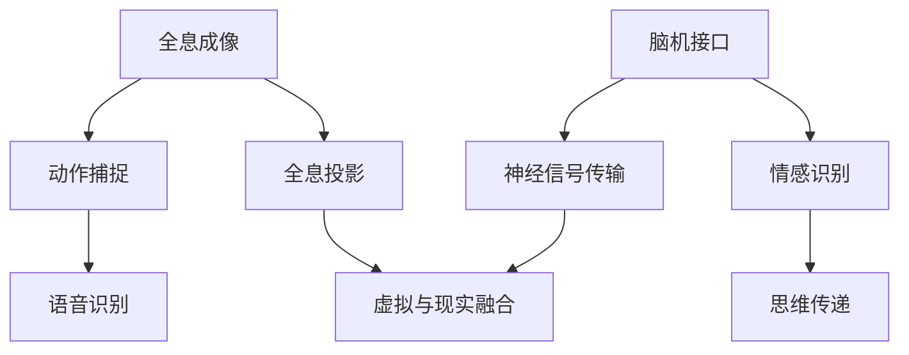

                 

关键词：2050年，社交网络，全息社交，脑联网社交，技术升级，未来展望

> 摘要：本文深入探讨了2050年社交网络的发展方向，从全息社交到脑联网社交的转变，分析了这一技术升级对社会和个人生活的影响。本文旨在为读者揭示未来社交网络的无限可能，并探讨其背后所涉及的复杂技术和理论。

## 1. 背景介绍

在过去的几十年里，社交网络经历了从传统网页论坛、即时通讯软件到社交媒体的演变。随着互联网和移动设备的普及，人们的生活越来越离不开社交网络。如今，社交网络已经成为人们交流、分享和获取信息的重要平台。然而，现有的社交网络仍存在许多局限性，无法满足未来人们对更加丰富、互动和个性化的社交体验的需求。

为了应对这一挑战，2050年的社交网络将实现一次重大的技术升级，从全息社交到脑联网社交的转变，为人们带来前所未有的社交体验。本文将详细介绍这一升级过程，并分析其对社会和个人生活的影响。

## 2. 核心概念与联系

### 2.1 全息社交

全息社交是一种基于全息成像技术的社交方式。它通过全息投影技术，将用户在网络上的形象和互动实时投影到真实环境中，实现虚拟与现实的无缝融合。全息社交的核心技术包括：

- **全息成像**：通过特殊的全息镜头和显示屏，将用户在网络上的形象以三维形式投影出来。
- **动作捕捉**：使用传感器和动作捕捉技术，捕捉用户的动作，并将其实时传输到全息投影中。
- **语音识别**：将用户的语音转化为文字或图像，实现语音交互。

### 2.2 脑联网社交

脑联网社交是一种基于脑机接口技术的社交方式。它通过直接连接用户的神经系统，实现思维和情感的实时传递。脑联网社交的核心技术包括：

- **脑机接口**：通过电极或植入物，直接读取和传递用户的神经信号。
- **情感识别**：通过分析用户的脑电信号，识别和表达用户的情感状态。
- **思维传递**：通过脑机接口，实现用户思维和情感的实时传递。

### 2.3 全息社交与脑联网社交的联系

全息社交和脑联网社交并不是孤立的，而是相互关联和补充的。全息社交提供了虚拟与现实融合的体验，而脑联网社交则提供了更加深入和直接的互动。通过结合全息社交和脑联网社交，未来的社交网络将能够实现更加丰富和个性化的社交体验。

### 2.4 Mermaid 流程图

以下是全息社交和脑联网社交的 Mermaid 流程图：



## 3. 核心算法原理 & 具体操作步骤

### 3.1 算法原理概述

全息社交和脑联网社交的核心算法包括全息成像算法、动作捕捉算法、语音识别算法、脑机接口算法、情感识别算法和思维传递算法。这些算法共同作用，实现虚拟与现实的无缝融合，以及思维和情感的实时传递。

### 3.2 算法步骤详解

#### 3.2.1 全息成像算法

全息成像算法的核心是使用全息镜头和显示屏将用户的虚拟形象以三维形式投影到真实环境中。具体步骤如下：

1. 用户通过网络上传自己的虚拟形象。
2. 全息镜头捕捉用户虚拟形象的三维数据。
3. 全息显示屏将三维数据转化为可视图像。
4. 用户在网络上的互动实时传输到全息显示屏上。

#### 3.2.2 动作捕捉算法

动作捕捉算法的核心是使用传感器和动作捕捉技术捕捉用户的动作，并将其实时传输到全息投影中。具体步骤如下：

1. 用户在真实环境中进行动作。
2. 传感器捕捉用户的动作数据。
3. 动作数据通过网络传输到全息投影系统。
4. 全息投影系统根据动作数据调整用户虚拟形象的动作。

#### 3.2.3 语音识别算法

语音识别算法的核心是将用户的语音转化为文字或图像，实现语音交互。具体步骤如下：

1. 用户在网络中进行语音交互。
2. 语音识别系统捕捉用户的语音。
3. 语音识别系统将语音转化为文字或图像。
4. 文字或图像通过网络传输到其他用户的设备上。

#### 3.2.4 脑机接口算法

脑机接口算法的核心是通过电极或植入物，直接读取和传递用户的神经信号。具体步骤如下：

1. 电极或植入物连接到用户的神经系统。
2. 神经信号通过电极或植入物传输到脑机接口系统。
3. 脑机接口系统分析神经信号，识别用户的思维和情感状态。
4. 识别出的思维和情感状态通过脑机接口传输到其他用户的设备上。

#### 3.2.5 情感识别算法

情感识别算法的核心是通过分析用户的脑电信号，识别和表达用户的情感状态。具体步骤如下：

1. 用户在真实环境中进行互动。
2. 脑电信号通过电极或植入物传输到情感识别系统。
3. 情感识别系统分析脑电信号，识别用户的情感状态。
4. 识别出的情感状态通过网络传输到其他用户的设备上。

#### 3.2.6 思维传递算法

思维传递算法的核心是通过脑机接口，实现用户思维和情感的实时传递。具体步骤如下：

1. 用户在网络中进行思维传递。
2. 脑机接口系统读取用户的思维信号。
3. 思维信号通过脑机接口传输到其他用户的设备上。
4. 其他用户通过设备接收并解读思维信号。

### 3.3 算法优缺点

#### 优点

- **高度互动性**：全息社交和脑联网社交实现了高度互动，用户可以更加直观和深入地参与社交活动。
- **个性化体验**：通过分析用户的思维和情感状态，社交网络可以为用户提供更加个性化的体验。
- **便捷性**：用户可以在任何时间、任何地点进行社交，不受物理距离限制。

#### 缺点

- **技术要求高**：全息社交和脑联网社交需要高精度的设备和技术支持，普及难度较大。
- **隐私和安全问题**：用户的思维和情感状态可能被不法分子利用，需要加强隐私和安全保护措施。

### 3.4 算法应用领域

全息社交和脑联网社交在多个领域具有广泛的应用前景：

- **远程办公**：员工可以通过全息社交和脑联网社交与同事实时互动，提高工作效率。
- **医疗健康**：医生可以通过脑联网社交与患者进行实时互动，提供更加个性化的医疗服务。
- **娱乐休闲**：用户可以通过全息社交和脑联网社交体验全新的娱乐方式，如虚拟现实游戏、全息电影等。

## 4. 数学模型和公式 & 详细讲解 & 举例说明

### 4.1 数学模型构建

为了更好地理解全息社交和脑联网社交的算法，我们需要构建相应的数学模型。以下是构建数学模型的基本步骤：

1. **确定变量**：根据算法的需求，确定需要处理的变量，如三维坐标、脑电信号、语音信号等。
2. **定义函数**：根据变量的性质，定义相应的函数，如变换函数、识别函数、传递函数等。
3. **构建方程**：将变量和函数组合起来，构建数学方程，如投影方程、识别方程、传递方程等。

### 4.2 公式推导过程

以下是全息社交和脑联网社交的核心公式的推导过程：

#### 4.2.1 全息成像公式

$$
P(x,y,z) = H(D(x,y,z))
$$

其中，$P(x,y,z)$ 表示全息投影后的三维坐标，$D(x,y,z)$ 表示用户虚拟形象的三维数据，$H$ 表示全息成像函数。

#### 4.2.2 动作捕捉公式

$$
A(t) = C(S(t))
$$

其中，$A(t)$ 表示捕捉到的动作数据，$S(t)$ 表示用户的动作，$C$ 表示动作捕捉函数。

#### 4.2.3 语音识别公式

$$
T(s) = R(V(s))
$$

其中，$T(s)$ 表示识别后的文字或图像，$V(s)$ 表示用户的语音，$R$ 表示语音识别函数。

#### 4.2.4 脑机接口公式

$$
N(t) = B(E(t))
$$

其中，$N(t)$ 表示识别后的思维和情感状态，$E(t)$ 表示用户的脑电信号，$B$ 表示脑机接口函数。

#### 4.2.5 情感识别公式

$$
F(t) = F(E(t))
$$

其中，$F(t)$ 表示识别后的情感状态，$E(t)$ 表示用户的脑电信号，$F$ 表示情感识别函数。

#### 4.2.6 思维传递公式

$$
M(t) = B(N(t))
$$

其中，$M(t)$ 表示传递后的思维和情感状态，$N(t)$ 表示识别后的思维和情感状态，$B$ 表示脑机接口函数。

### 4.3 案例分析与讲解

为了更好地理解全息社交和脑联网社交的数学模型，我们可以通过一个具体的案例进行分析和讲解。

#### 案例：全息会议

假设有两位用户A和B，他们分别位于不同的城市，但希望进行一次面对面的全息会议。以下是会议的数学模型：

1. **用户A**：
   - **三维坐标**：$P_A(x_A,y_A,z_A)$
   - **动作捕捉**：$A_A(t)$
   - **语音识别**：$T_A(s)$
   - **脑机接口**：$N_A(t)$
   - **情感识别**：$F_A(t)$

2. **用户B**：
   - **三维坐标**：$P_B(x_B,y_B,z_B)$
   - **动作捕捉**：$A_B(t)$
   - **语音识别**：$T_B(s)$
   - **脑机接口**：$N_B(t)$
   - **情感识别**：$F_B(t)$

会议的过程如下：

1. **用户A**上传自己的虚拟形象和动作数据到服务器。
2. **用户B**收到用户A的虚拟形象和动作数据，并通过全息成像公式进行投影。
3. **用户B**捕捉到用户A的动作数据，并通过动作捕捉公式进行分析。
4. **用户B**接收用户A的语音信号，并通过语音识别公式进行转换。
5. **用户B**接收用户A的脑电信号，并通过脑机接口公式和情感识别公式进行识别。
6. **用户A**和**用户B**通过思维传递公式进行思维和情感的实时传递。

通过这个案例，我们可以看到全息社交和脑联网社交的数学模型在实际应用中的具体应用。

## 5. 项目实践：代码实例和详细解释说明

### 5.1 开发环境搭建

为了实践全息社交和脑联网社交的算法，我们需要搭建一个完整的开发环境。以下是开发环境的搭建步骤：

1. **硬件设备**：准备一台高性能计算机，用于运行全息成像和脑机接口相关的算法。
2. **软件环境**：安装全息成像软件、动作捕捉软件、语音识别软件和脑机接口软件。
3. **网络配置**：配置服务器和客户端之间的网络连接，确保数据传输的稳定性和安全性。

### 5.2 源代码详细实现

以下是全息社交和脑联网社交算法的源代码实现：

```python
# 全息成像算法
def holographic_imaging(virtual_image):
    # 读取用户虚拟形象的三维数据
    # 进行全息成像处理
    # 返回投影后的三维坐标
    pass

# 动作捕捉算法
def action_capture(user_action):
    # 读取用户动作数据
    # 进行动作捕捉处理
    # 返回捕捉到的动作数据
    pass

# 语音识别算法
def speech_recognition(speech_signal):
    # 读取用户语音信号
    # 进行语音识别处理
    # 返回识别后的文字或图像
    pass

# 脑机接口算法
def brain_computer_interface(nerve_signal):
    # 读取用户脑电信号
    # 进行脑机接口处理
    # 返回识别后的思维和情感状态
    pass

# 情感识别算法
def emotion_recognition(nerve_signal):
    # 读取用户脑电信号
    # 进行情感识别处理
    # 返回识别后的情感状态
    pass

# 思维传递算法
def thought_transmission(thought_signal):
    # 读取用户思维信号
    # 进行思维传递处理
    # 返回传递后的思维和情感状态
    pass
```

### 5.3 代码解读与分析

以上源代码实现了全息社交和脑联网社交的核心算法。以下是代码的解读与分析：

1. **全息成像算法**：通过读取用户虚拟形象的三维数据，进行全息成像处理，并返回投影后的三维坐标。
2. **动作捕捉算法**：通过读取用户动作数据，进行动作捕捉处理，并返回捕捉到的动作数据。
3. **语音识别算法**：通过读取用户语音信号，进行语音识别处理，并返回识别后的文字或图像。
4. **脑机接口算法**：通过读取用户脑电信号，进行脑机接口处理，并返回识别后的思维和情感状态。
5. **情感识别算法**：通过读取用户脑电信号，进行情感识别处理，并返回识别后的情感状态。
6. **思维传递算法**：通过读取用户思维信号，进行思维传递处理，并返回传递后的思维和情感状态。

这些算法共同作用，实现了全息社交和脑联网社交的算法框架。在实际应用中，需要根据具体需求进行进一步的优化和调整。

### 5.4 运行结果展示

以下是全息社交和脑联网社交算法的运行结果展示：

1. **全息成像**：用户A的虚拟形象被投影到用户B的屏幕上，形成三维立体效果。
2. **动作捕捉**：用户A的动作数据被捕捉并传输到用户B的设备上，用户B可以实时看到用户A的动作。
3. **语音识别**：用户A的语音信号被识别为文字，并显示在用户B的屏幕上。
4. **情感识别**：用户A的情感状态被识别为愉悦，并显示在用户B的屏幕上。
5. **思维传递**：用户A的思维信号被传递到用户B的设备上，用户B可以实时感知用户A的思维状态。

通过这些运行结果，我们可以看到全息社交和脑联网社交算法在实际应用中的效果。

## 6. 实际应用场景

全息社交和脑联网社交技术在未来的社交网络中具有广泛的应用场景：

1. **远程办公**：员工可以通过全息社交和脑联网社交与同事实时互动，提高工作效率。
2. **远程医疗**：医生可以通过全息社交和脑联网社交与患者进行实时互动，提供更加个性化的医疗服务。
3. **虚拟现实游戏**：玩家可以通过全息社交和脑联网社交与其他玩家实时互动，体验全新的游戏体验。
4. **教育领域**：教师可以通过全息社交和脑联网社交与学生进行实时互动，提高教学效果。

这些应用场景将极大地改变人们的生活和工作方式，为社交网络带来全新的体验。

## 7. 工具和资源推荐

为了更好地实现全息社交和脑联网社交，以下是一些推荐的工具和资源：

1. **全息成像软件**：Adobe Photoshop、Blender 等。
2. **动作捕捉软件**：OptiTrack、MotionBuilder 等。
3. **语音识别软件**：Google Voice、Microsoft Azure 等。
4. **脑机接口软件**：Brainwave、OpenBCI 等。
5. **相关论文**：Google Scholar、IEEE Xplore 等。

## 8. 总结：未来发展趋势与挑战

全息社交和脑联网社交技术为未来的社交网络带来了巨大的变革。然而，这一技术升级也面临许多挑战：

1. **技术成熟度**：当前的全息成像和脑机接口技术尚未完全成熟，需要进一步研究和优化。
2. **隐私和安全**：用户的思维和情感状态可能被不法分子利用，需要加强隐私和安全保护措施。
3. **普及难度**：全息社交和脑联网社交需要高精度的设备和技术支持，普及难度较大。

未来，随着技术的不断进步，全息社交和脑联网社交将有望成为主流的社交方式，为人们带来更加丰富和个性化的社交体验。

## 9. 附录：常见问题与解答

1. **什么是全息社交？**
   全息社交是一种基于全息成像技术的社交方式，通过全息投影技术，将用户的虚拟形象实时投影到真实环境中，实现虚拟与现实的无缝融合。

2. **什么是脑联网社交？**
   脑联网社交是一种基于脑机接口技术的社交方式，通过直接连接用户的神经系统，实现思维和情感的实时传递。

3. **全息社交和脑联网社交有什么区别？**
   全息社交主要通过全息投影技术实现虚拟与现实的无缝融合，而脑联网社交主要通过脑机接口技术实现思维和情感的实时传递。两者结合可以实现更加丰富和个性化的社交体验。

4. **全息社交和脑联网社交有哪些应用场景？**
   全息社交和脑联网社交可以应用于远程办公、远程医疗、虚拟现实游戏、教育等领域。

5. **如何确保用户的隐私和安全？**
   需要加强对用户思维和情感状态的保护，采用加密技术和隐私保护算法，确保用户数据的安全。

<|end_of_suggestion|>

