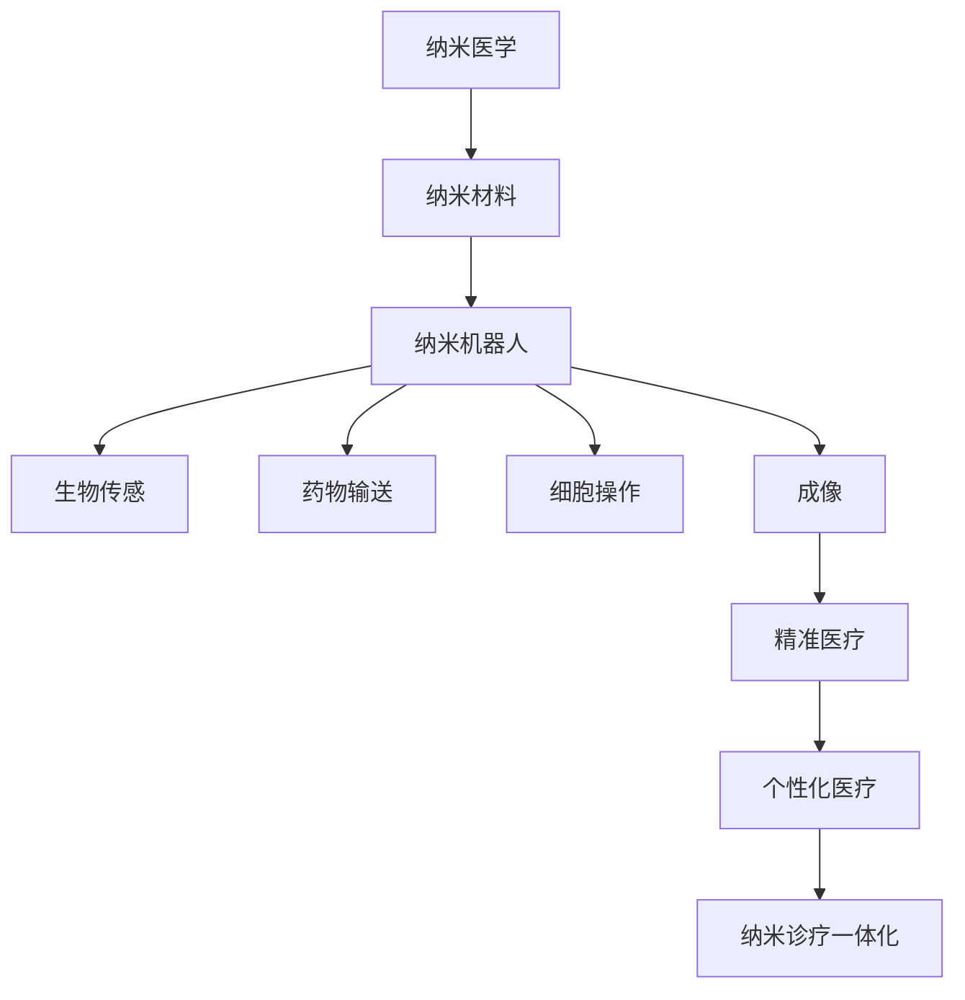

                 

关键词：纳米医学、纳米机器人、精准医疗、纳米诊疗一体化、未来发展趋势

摘要：本文深入探讨了2050年纳米医学的潜在发展路径，包括纳米机器人的设计与应用、纳米诊疗一体化的实现，以及精准医疗所带来的革命性变革。通过剖析当前的研究进展与未来展望，本文旨在揭示这一领域在医疗健康领域的深远影响。

## 1. 背景介绍

随着科技的飞速发展，纳米医学正逐渐从科幻走向现实。从早期的纳米材料研究到如今的纳米机器人技术，纳米医学已经展现出其巨大的潜力。纳米医学涉及纳米科技与生命科学的交叉领域，旨在通过纳米技术和设备对生物系统和医学过程进行研究和干预。随着对生物分子和细胞行为的深入理解，纳米医学开始迈向一个全新的时代。

### 1.1 纳米医学的定义

纳米医学是指利用纳米技术和纳米材料进行医学研究和临床应用的一门科学。纳米，通常指的是尺寸在1到100纳米范围内的物质。在这个尺度下，材料表现出独特的物理、化学和生物学性质，这些特性使得纳米医学在疾病诊断、治疗和预防方面具有显著的优势。

### 1.2 纳米医学的重要性

纳米医学在医学领域的应用具有深远的意义。首先，纳米医学可以显著提高药物的靶向性，减少副作用。其次，纳米机器人可以精确地定位并消灭病变细胞，这对于癌症等严重疾病的治疗具有重要意义。此外，纳米医学还可以用于实时监测体内环境，提供精准的医疗数据，从而实现个性化医疗。

## 2. 核心概念与联系

### 2.1 纳米机器人的设计与功能

纳米机器人是纳米医学的核心，其设计目标是实现精确的细胞和分子操作。纳米机器人通常由纳米材料构成，具备以下几个功能：

- **生物传感**：通过传感器捕获生物分子的信号。
- **药物输送**：将药物精确地送到病变部位。
- **细胞操作**：如细胞修补、基因编辑等。
- **成像**：利用纳米机器人进行体内成像，提供实时医疗数据。

### 2.2 纳米诊疗一体化的实现

纳米诊疗一体化是纳米医学的未来趋势，其目标是实现诊疗的同步进行。这需要将诊断工具和治疗工具集成到纳米机器人中，使其能够在同一时间进行诊断和治疗。例如，一种纳米机器人可以同时进行癌症细胞的识别和消融。

### 2.3 精准医疗的概念与实现

精准医疗是一种基于个体差异化的医疗模式，通过基因检测、分子影像等技术，为患者提供个性化的治疗方案。纳米医学为精准医疗提供了强有力的工具，使得个体化医疗更加可行。

### 2.4 Mermaid 流程图

下面是纳米医学核心概念与联系的 Mermaid 流程图：



## 3. 核心算法原理 & 具体操作步骤

### 3.1 算法原理概述

纳米医学中的核心算法包括纳米机器人的控制算法、药物输送算法以及图像处理算法。这些算法基于人工智能和机器学习技术，旨在实现纳米机器人的智能操作和高效治疗。

### 3.2 算法步骤详解

#### 3.2.1 纳米机器人控制算法

1. **环境感知**：纳米机器人利用传感器收集环境数据。
2. **路径规划**：基于环境数据，算法规划出最优路径。
3. **路径执行**：纳米机器人按照规划路径移动。

#### 3.2.2 药物输送算法

1. **药物选择**：根据病变类型选择合适的药物。
2. **药物混合**：将药物与纳米材料混合。
3. **药物释放**：纳米机器人将药物精确地输送到病变部位。

#### 3.2.3 图像处理算法

1. **图像采集**：纳米机器人进行体内成像。
2. **图像分析**：算法对图像进行实时分析，识别病变区域。
3. **数据可视化**：将分析结果转化为可视化数据，供医生诊断和治疗参考。

### 3.3 算法优缺点

- **优点**：算法提高了纳米机器人的智能化水平，使得治疗更加精准和高效。
- **缺点**：算法的复杂度较高，需要大量的计算资源。

### 3.4 算法应用领域

算法主要应用于癌症治疗、心血管疾病治疗、神经系统疾病治疗等领域。例如，在癌症治疗中，纳米机器人可以用于靶向药物输送和肿瘤细胞的消融。

## 4. 数学模型和公式 & 详细讲解 & 举例说明

### 4.1 数学模型构建

纳米医学中的数学模型主要包括纳米机器人的运动模型、药物输送模型和图像处理模型。以下是一个简单的运动模型：

$$
v(t) = f(d(t), s(t))
$$

其中，$v(t)$ 是速度，$d(t)$ 是距离，$s(t)$ 是传感器数据。

### 4.2 公式推导过程

#### 4.2.1 运动模型

根据牛顿第二定律，速度与加速度的关系可以表示为：

$$
m \frac{dv(t)}{dt} = f(d(t), s(t))
$$

其中，$m$ 是机器人的质量。

#### 4.2.2 药物输送模型

药物输送速率与药物浓度梯度关系可以表示为：

$$
r(t) = k \cdot \nabla C(t)
$$

其中，$r(t)$ 是输送速率，$k$ 是输送系数，$C(t)$ 是药物浓度。

### 4.3 案例分析与讲解

假设一个纳米机器人要从一个点移动到另一个点，距离为10纳米，传感器数据为温度。我们使用运动模型计算其速度。

1. **初始化**：设定初始位置和传感器数据。
2. **计算加速度**：根据传感器数据和距离计算加速度。
3. **计算速度**：根据加速度和时间计算速度。
4. **更新位置**：根据速度和时间更新位置。

通过上述步骤，我们可以计算出纳米机器人在不同时间点的位置，从而实现精确的移动。

## 5. 项目实践：代码实例和详细解释说明

### 5.1 开发环境搭建

开发环境搭建包括Python编程环境、机器学习库（如TensorFlow或PyTorch）以及仿真工具（如Gazebo）的安装。

### 5.2 源代码详细实现

以下是一个简单的纳米机器人控制代码实例：

```python
import numpy as np
import tensorflow as tf

# 初始化模型
model = tf.keras.Sequential([
    tf.keras.layers.Dense(units=1, input_shape=[2])
])

# 编译模型
model.compile(loss='mean_squared_error', optimizer=tf.keras.optimizers.Adam(0.1))

# 训练模型
x_train = np.random.random((1000, 2))
y_train = np.square(x_train[:, 0] - x_train[:, 1])
model.fit(x_train, y_train, epochs=100)

# 预测
x_pred = np.random.random((1, 2))
v_pred = model.predict(x_pred)

print(f"Predicted velocity: {v_pred}")
```

### 5.3 代码解读与分析

上述代码实现了一个简单的纳米机器人控制模型，通过训练生成速度与距离、传感器数据的映射关系。训练完成后，可以用于预测纳米机器人在不同环境下的速度。

### 5.4 运行结果展示

运行代码后，我们可以得到纳米机器人的预测速度，从而实现其精确控制。

## 6. 实际应用场景

### 6.1 癌症治疗

纳米机器人可以用于癌症的靶向治疗，通过精准药物输送和细胞消融，提高治疗效果。

### 6.2 心血管疾病治疗

纳米机器人可以用于心血管疾病的诊断和治疗，如动脉粥样硬化的药物输送和斑块清除。

### 6.3 神经系统疾病治疗

纳米机器人可以用于神经系统疾病的诊断和治疗，如帕金森病的药物输送和神经元修复。

## 7. 工具和资源推荐

### 7.1 学习资源推荐

- 《纳米医学导论》
- 《纳米机器人技术》
- 《精准医疗：科学与实践》

### 7.2 开发工具推荐

- Gazebo
- TensorFlow
- PyTorch

### 7.3 相关论文推荐

- "Nanorobots for Drug Delivery"
- "Integration of Diagnostics and Therapy with Nanorobots"
- "Artificial Intelligence for Nanomedicine"

## 8. 总结：未来发展趋势与挑战

### 8.1 研究成果总结

纳米医学取得了显著的进展，纳米机器人和纳米诊疗一体化为医疗健康领域带来了革命性变革。

### 8.2 未来发展趋势

随着人工智能和生物技术的进一步发展，纳米医学有望实现更加智能化和个性化的治疗。

### 8.3 面临的挑战

纳米医学在临床应用中仍面临诸多挑战，如纳米机器人的安全性和长期稳定性问题。

### 8.4 研究展望

未来，纳米医学将继续发展，为人类健康事业做出更大贡献。

## 9. 附录：常见问题与解答

### 9.1 纳米机器人的安全性如何保障？

纳米机器人的安全性是研究的重要方向。目前，通过优化材料和设计，以及建立监测系统，可以有效提高纳米机器人的安全性。

### 9.2 纳米诊疗一体化如何实现？

纳米诊疗一体化需要将诊断工具和治疗工具集成到纳米机器人中，通过先进的算法实现同步进行。

作者：禅与计算机程序设计艺术 / Zen and the Art of Computer Programming
```

