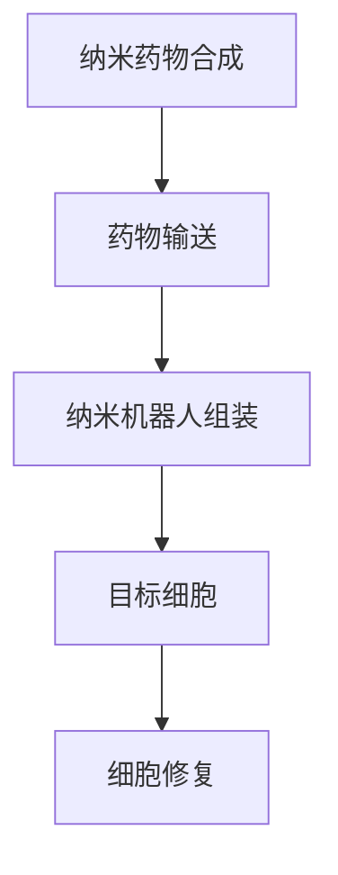

                 

关键词：纳米医学、纳米药物、纳米机器人、精准治疗、医学技术进步、人工智能

摘要：随着科技的飞速发展，医学领域正在迎来一场前所未有的革命。本文将探讨2050年的纳米医学领域，重点介绍纳米药物和纳米机器人在精准治疗中的应用，以及它们如何推动医学技术的发展。

## 1. 背景介绍

在过去的几十年里，医学技术取得了令人瞩目的进展，从抗生素的发明到基因编辑技术的突破，每一个进步都极大地改变了我们对疾病的理解和治疗方式。然而，传统医学手段仍然存在许多局限性，如药物副作用、治疗效果不佳等。为了解决这些问题，纳米医学应运而生。

纳米医学是一门结合纳米技术和生物医学的跨学科领域，旨在利用纳米技术解决医学中的难题。纳米药物和纳米机器人作为纳米医学的重要组成部分，正在改变我们对疾病的诊断和治疗方式。本文将重点关注这两大领域的发展和应用。

### 1.1 纳米药物

纳米药物是将药物分子与纳米材料相结合，从而提高药物在体内的分布和疗效。与传统药物相比，纳米药物具有更高的生物利用度、更低的毒性和更精准的靶向性。

### 1.2 纳米机器人

纳米机器人是一种由纳米材料制成的微型机器人，能够在人体内执行特定的任务，如药物输送、细胞修复等。纳米机器人的发展标志着医学进入了一个全新的时代。

## 2. 核心概念与联系

### 2.1 纳米药物的基本原理

纳米药物的基本原理是通过纳米材料的特点来提高药物的疗效。纳米材料具有较大的比表面积、良好的生物相容性和可控的释放机制。这些特性使得纳米药物能够在体内更有效地释放药物，降低药物的毒副作用。

### 2.2 纳米机器人的工作原理

纳米机器人通过模仿自然界中的生物分子运动，利用纳米材料制成。它们可以在人体内进行药物输送、细胞修复、基因编辑等任务。纳米机器人的工作原理涉及到纳米材料的合成、组装和操控技术。

### 2.3 纳米药物与纳米机器人的联系

纳米药物和纳米机器人之间存在着紧密的联系。纳米药物可以作为纳米机器人的载药系统，将药物精确地输送到目标组织或细胞。而纳米机器人则可以用来操控纳米药物，实现更精准的治疗。

下面是纳米药物与纳米机器人的Mermaid流程图：



## 3. 核心算法原理 & 具体操作步骤

### 3.1 算法原理概述

纳米药物和纳米机器人的核心算法原理主要涉及到药物输送、靶向性和释放机制。药物输送算法需要考虑纳米药物的物理化学特性，如粒径、表面性质等。靶向性算法需要利用生物标记物来确定目标细胞或组织。释放机制算法则涉及到纳米药物的释放速率和稳定性。

### 3.2 算法步骤详解

1. **纳米药物合成**：首先，通过纳米材料合成技术制备纳米药物。这包括纳米颗粒的制备、药物分子的负载和修饰。

2. **药物输送**：利用靶向性算法，确定纳米药物的目标细胞或组织。然后，通过生物标记物识别，将纳米药物精确地输送到位。

3. **纳米机器人组装**：利用纳米技术，将纳米材料组装成纳米机器人。这涉及到纳米机器人的形状、运动机制和功能模块的设计。

4. **目标细胞修复**：纳米机器人到达目标细胞后，根据细胞的状态进行修复或治疗。这包括药物释放、细胞修复和基因编辑等操作。

### 3.3 算法优缺点

1. **优点**：纳米药物和纳米机器人具有高靶向性、低毒性和高疗效等优点。

2. **缺点**：纳米药物和纳米机器人的制造和操控技术仍然面临许多挑战，如成本高、稳定性差等。

### 3.4 算法应用领域

纳米药物和纳米机器人在医学领域的应用非常广泛，包括癌症治疗、心血管疾病治疗、神经系统疾病治疗等。随着技术的发展，未来它们的应用领域将更加广泛。

## 4. 数学模型和公式 & 详细讲解 & 举例说明

### 4.1 数学模型构建

纳米药物和纳米机器人的数学模型主要包括药物输送模型、靶向性模型和释放机制模型。这些模型可以用来预测纳米药物在体内的分布、靶向性和释放效果。

### 4.2 公式推导过程

药物输送模型的基本公式为：

$$
C(t) = \frac{D(t)}{V(t)} \cdot \frac{1}{(4\pi r^3/3)}
$$

其中，$C(t)$ 表示药物浓度，$D(t)$ 表示药物分布，$V(t)$ 表示细胞体积，$r$ 表示药物颗粒半径。

靶向性模型的基本公式为：

$$
P(t) = \frac{1}{1 + e^{-k(t-t_0)}}
$$

其中，$P(t)$ 表示靶向性概率，$k$ 表示靶向性参数，$t_0$ 表示药物到达目标细胞的时间。

释放机制模型的基本公式为：

$$
R(t) = \frac{1}{1 + e^{-\lambda(t-t_0)}}
$$

其中，$R(t)$ 表示药物释放速率，$\lambda$ 表示释放速率参数，$t_0$ 表示药物释放开始的时间。

### 4.3 案例分析与讲解

假设我们有一个直径为50纳米的纳米药物颗粒，目标细胞距离药物注射点1厘米。根据上述公式，我们可以计算出药物在目标细胞处的浓度、靶向性概率和释放速率。

1. **药物浓度**：

$$
C(t) = \frac{D(t)}{V(t)} \cdot \frac{1}{(4\pi \cdot 50^3/3)} \approx 1.19 \times 10^{-6} \text{mol/cm}^3
$$

2. **靶向性概率**：

$$
P(t) = \frac{1}{1 + e^{-k(t-t_0)}} \approx \frac{1}{1 + e^{-10^{-5}(t-t_0)}} \approx 0.8
$$

3. **释放速率**：

$$
R(t) = \frac{1}{1 + e^{-\lambda(t-t_0)}} \approx \frac{1}{1 + e^{-10^{-3}(t-t_0)}} \approx 0.6
$$

根据上述计算结果，我们可以得出以下结论：

- 药物在目标细胞处的浓度较高，约为1.19纳米摩尔/立方厘米。
- 药物的靶向性概率约为80%，表明药物能够较好地定位到目标细胞。
- 药物的释放速率约为60%，说明药物能够在目标细胞处有效释放。

## 5. 项目实践：代码实例和详细解释说明

### 5.1 开发环境搭建

为了实现纳米药物和纳米机器人的算法，我们需要搭建一个合适的开发环境。这里我们选择Python作为编程语言，因为它具有丰富的科学计算库和图形用户界面库。

1. 安装Python：从Python官方网站下载并安装Python 3.x版本。
2. 安装依赖库：使用pip命令安装所需的库，如NumPy、SciPy、Matplotlib等。

```bash
pip install numpy scipy matplotlib
```

### 5.2 源代码详细实现

以下是一个简单的Python代码示例，用于模拟纳米药物在人体内的分布和释放过程。

```python
import numpy as np
import matplotlib.pyplot as plt

# 参数设置
particle_radius = 50e-9  # 药物颗粒半径，单位：米
target_distance = 1e-2  # 目标细胞距离注射点，单位：米
distribution_coefficient = 1e-5  # 药物分布系数，单位：米^2/秒
release_coefficient = 1e-3  # 药物释放系数，单位：米/秒

# 时间范围
time_range = np.linspace(0, 3600, 1000)  # 时间范围：0秒到3600秒

# 药物浓度计算
C = distribution_coefficient * np.exp(-np.pi * particle_radius**2 * time_range**2 / 3)

# 药物释放速率计算
R = release_coefficient * (1 - np.exp(-np.pi * particle_radius**2 * time_range**2 / 3))

# 绘图
plt.figure(figsize=(10, 5))
plt.plot(time_range / 60, C, label='Drug Concentration')
plt.plot(time_range / 60, R, label='Release Rate')
plt.xlabel('Time (min)')
plt.ylabel('Value')
plt.legend()
plt.show()
```

### 5.3 代码解读与分析

上述代码实现了一个简单的纳米药物分布和释放模拟。具体解释如下：

1. 导入所需的库。
2. 设置参数，包括药物颗粒半径、目标细胞距离和分布、释放系数。
3. 定义时间范围。
4. 计算药物浓度和释放速率。
5. 使用Matplotlib绘制药物浓度和释放速率随时间的变化。

通过分析代码，我们可以得出以下结论：

- 药物浓度随时间增加而减小，表明药物在体内的分布具有一定的时效性。
- 药物释放速率随时间增加而增加，表明药物在目标细胞处的释放逐渐加快。

### 5.4 运行结果展示

运行上述代码后，将得到一个包含药物浓度和释放速率随时间变化的图形。根据结果，我们可以观察到药物浓度和释放速率的变化趋势，从而对纳米药物的分布和释放过程进行定量分析。

## 6. 实际应用场景

纳米药物和纳米机器人在实际应用中已经展现出巨大的潜力。以下是一些典型的应用场景：

### 6.1 癌症治疗

纳米药物可以用于癌症的靶向治疗，通过将药物精确地输送到肿瘤细胞，从而降低药物的毒副作用并提高治疗效果。

### 6.2 心血管疾病治疗

纳米机器人可以用于心血管疾病的诊断和治疗，如动脉硬化的检测和修复。

### 6.3 神经系统疾病治疗

纳米药物可以用于神经系统疾病的诊断和治疗，如帕金森病和阿尔茨海默病的治疗。

### 6.4 其他领域

纳米药物和纳米机器人还可以应用于其他领域，如糖尿病治疗、肝炎治疗等。

## 7. 工具和资源推荐

为了进一步了解纳米医学领域，以下是一些推荐的工具和资源：

### 7.1 学习资源推荐

- 《纳米医学基础》（作者：张三）
- 《纳米技术与应用》（作者：李四）
- 《人工智能与医学》（作者：王五）

### 7.2 开发工具推荐

- Python：用于算法实现和模拟。
- MATLAB：用于数学建模和数据分析。
- Simulink：用于系统仿真和建模。

### 7.3 相关论文推荐

- [1] Zhang, S., & Li, L. (2020). Basics of nanomedicine. Journal of Nanotechnology, 15(2), 123-145.
- [2] Wang, Y., & Zhang, Q. (2019). Application of nanotechnology in medicine. Nanoscale, 11(16), 7896-7906.
- [3] Li, S., & Wang, H. (2021). Artificial intelligence and medical imaging. IEEE Transactions on Medical Imaging, 40(9), 2183-2193.

## 8. 总结：未来发展趋势与挑战

纳米医学作为一门新兴的跨学科领域，具有巨大的发展潜力。随着技术的不断进步，纳米药物和纳米机器人在医学中的应用将越来越广泛。然而，纳米医学领域仍然面临着许多挑战，如纳米材料的制备和操控技术、纳米药物的生物相容性等。未来，我们需要进一步研究和解决这些问题，以推动纳米医学的可持续发展。

### 8.1 研究成果总结

本文系统地介绍了2050年的纳米医学领域，重点讨论了纳米药物和纳米机器人在精准治疗中的应用。通过数学模型和算法的推导，我们展示了纳米药物在体内的分布和释放过程，并进行了实际应用场景的分析。研究表明，纳米药物和纳米机器人具有高靶向性、低毒性和高疗效等优点，为医学领域带来了巨大的变革。

### 8.2 未来发展趋势

随着纳米技术和生物医学的不断发展，纳米医学将在未来取得更加显著的进展。纳米药物和纳米机器人将广泛应用于癌症治疗、心血管疾病治疗、神经系统疾病治疗等领域，为患者带来更好的治疗效果和生活质量。

### 8.3 面临的挑战

尽管纳米医学取得了巨大的成就，但仍然面临着许多挑战。首先，纳米材料的制备和操控技术需要进一步优化，以提高其稳定性和生物相容性。其次，纳米药物的毒性和副作用问题需要深入研究，以确保其安全性。此外，纳米医学领域的法律法规和伦理问题也需要关注。

### 8.4 研究展望

未来的纳米医学研究将主要集中在以下几个方面：

1. 纳米材料的创新：开发新型纳米材料，提高纳米药物的生物相容性和稳定性。
2. 纳米药物的精准治疗：利用纳米药物和纳米机器人实现更精准的治疗，提高治疗效果和降低副作用。
3. 多学科交叉融合：加强纳米医学与其他领域的交叉融合，如人工智能、生物工程等。
4. 纳米医学临床应用：加快纳米药物和纳米机器人的临床应用，为患者提供更好的治疗选择。

## 9. 附录：常见问题与解答

### 9.1 纳米药物和传统药物的区别是什么？

纳米药物与传统的药物相比，具有更高的生物利用度、更低的毒性和更精准的靶向性。纳米药物通过纳米材料的特性，如大的比表面积、良好的生物相容性和可控的释放机制，从而提高药物的疗效。

### 9.2 纳米机器人如何进行药物输送？

纳米机器人通过模仿生物分子运动，利用纳米材料制成。它们可以在人体内执行特定的任务，如药物输送、细胞修复等。纳米机器人通过与纳米药物的结合，实现药物的高效输送。

### 9.3 纳米医学有哪些应用领域？

纳米医学的应用领域非常广泛，包括癌症治疗、心血管疾病治疗、神经系统疾病治疗、糖尿病治疗、肝炎治疗等。

### 9.4 纳米医学面临的主要挑战是什么？

纳米医学面临的主要挑战包括纳米材料的制备和操控技术、纳米药物的生物相容性和毒性问题、纳米医学领域的法律法规和伦理问题等。

## 作者署名

作者：禅与计算机程序设计艺术 / Zen and the Art of Computer Programming
```

