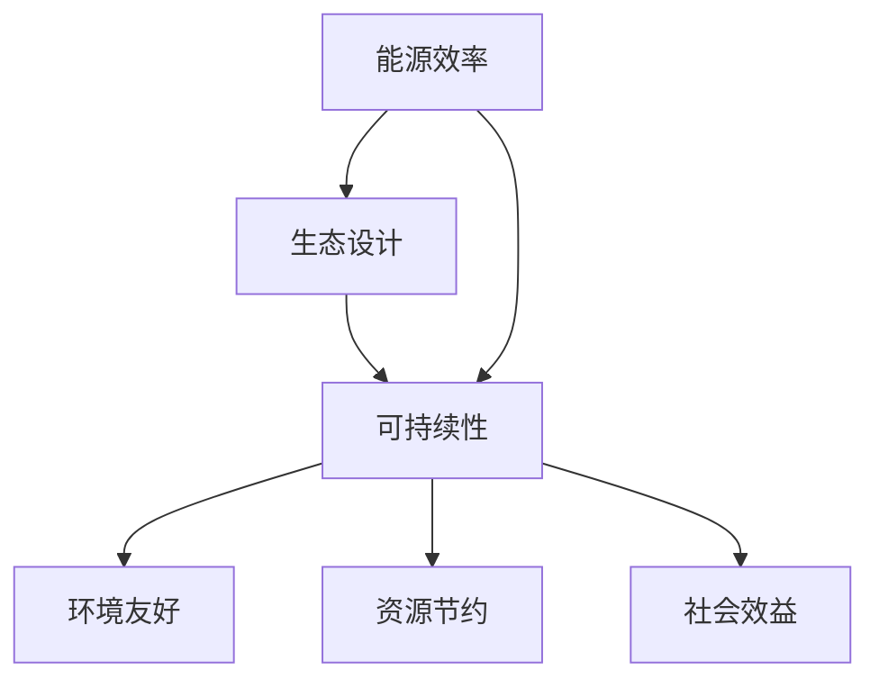

                 

关键词：绿色建筑、可持续建设、能源效率、生态设计、2050年愿景

> 摘要：随着全球气候变化和资源短缺问题的加剧，绿色建筑和可持续建设已成为建筑行业的重要趋势。本文将探讨2050年绿色建筑的发展方向，从节能到生态的可持续建设，介绍相关技术和实践，展望未来绿色建筑的应用前景。

## 1. 背景介绍

随着全球经济的快速发展和城市化进程的加速，建筑行业对资源和能源的消耗日益增加。据统计，建筑行业约占全球总能源消耗的40%，同时也是温室气体排放的主要来源之一。因此，提高建筑能源效率、减少环境影响成为当务之急。

绿色建筑（Green Building）是一种具有高效能源利用、减少环境污染、提高室内环境质量的设计和建造方式。其目标是实现建筑全生命周期的可持续性，包括设计、施工、运营和维护等各个环节。近年来，随着技术的进步和环保意识的提升，绿色建筑在全球范围内得到了广泛关注和推广。

### 1.1 绿色建筑的起源和发展

绿色建筑的概念起源于20世纪60年代的美国，当时石油危机引发了人们对能源消耗和环境保护的关注。1970年代，可持续建筑（Sustainable Building）的概念开始提出，强调建筑与自然环境的和谐共生。1980年代，绿色建筑开始在欧洲和日本等国家得到应用和推广。2000年代以来，随着全球环保意识的提高，绿色建筑在全球范围内得到了快速发展。

### 1.2 绿色建筑的重要性

绿色建筑对于应对全球气候变化和资源短缺具有重要意义。首先，绿色建筑可以有效降低建筑能耗，减少温室气体排放，有助于减缓全球气候变化。其次，绿色建筑可以降低对自然资源的消耗，提高资源利用效率，缓解资源紧缺问题。此外，绿色建筑还可以改善室内环境质量，提高居住舒适度和健康水平。

## 2. 核心概念与联系

绿色建筑的核心概念包括能源效率、生态设计、可持续性等。以下是一个用Mermaid绘制的流程图，展示这些概念之间的联系：



### 2.1 能源效率

能源效率是指建筑物在满足用户需求的前提下，尽量减少能源消耗。提高建筑能源效率的方法包括：

- **建筑设计**：通过合理设计建筑物的朝向、形状、布局等，利用自然光、自然通风等减少能源消耗。
- **节能材料**：采用高效保温材料、节能玻璃等，提高建筑物的隔热性能。
- **节能设备**：使用高效空调、照明、热水设备等，减少能源浪费。

### 2.2 生态设计

生态设计是指将生态学原理应用于建筑设计，实现建筑物与自然环境的和谐共生。生态设计包括以下方面：

- **绿色屋顶**：种植植物，减少雨水径流，降低城市热岛效应。
- **雨水收集与利用**：收集雨水用于浇灌、冲厕等，减少对自来水的依赖。
- **绿色墙体**：采用透水砖、透水混凝土等，增加雨水渗透，改善城市水文循环。

### 2.3 可持续性

可持续性是指建筑物在满足当前需求的同时，不损害后代满足自身需求的能力。绿色建筑的可持续性体现在以下几个方面：

- **材料选择**：采用可再生、可循环利用的建筑材料，减少对自然资源的消耗。
- **废物管理**：在建筑过程中和运营过程中，尽量减少废物产生，提高废物回收利用率。
- **室内环境**：改善室内空气质量，提供舒适、健康的居住环境。

## 3. 核心算法原理 & 具体操作步骤

### 3.1 算法原理概述

绿色建筑的设计和建设需要综合考虑多个因素，包括能源效率、生态设计和可持续性等。为了实现这些目标，可以采用一种基于多目标优化的算法。该算法的基本原理是，在满足各项约束条件的前提下，同时优化多个目标函数，以获得最佳的综合性能。

### 3.2 算法步骤详解

#### 3.2.1 数据收集与处理

首先，收集与绿色建筑相关的数据，包括建筑物的能源消耗、材料使用、室内环境质量等。然后，对这些数据进行处理，提取出与绿色建筑目标相关的指标，如能源效率、碳排放、生态指标等。

#### 3.2.2 目标函数定义

根据绿色建筑的目标，定义多个目标函数，包括能源效率、生态指标、可持续性等。例如：

- 能源效率目标函数：\(f_1 = \frac{E_{use}}{E_{total}}\)
- 生态指标目标函数：\(f_2 = \frac{E_{ecology}}{E_{total}}\)
- 可持续性目标函数：\(f_3 = \frac{S_{sustainability}}{S_{total}}\)

#### 3.2.3 约束条件设置

根据绿色建筑的设计要求和实际情况，设置相应的约束条件。例如：

- 能源消耗约束：\(E_{use} \leq E_{max}\)
- 材料使用约束：\(M_{use} \leq M_{max}\)
- 室内环境质量约束：\(Q_{indoor} \geq Q_{min}\)

#### 3.2.4 多目标优化

采用多目标优化算法，如遗传算法（GA）、粒子群优化（PSO）等，同时优化多个目标函数。具体步骤如下：

1. 初始化种群（或粒子群）。
2. 计算每个个体的目标函数值和约束条件满足情况。
3. 根据适应度函数，选择优秀的个体进行交叉、变异等操作，产生新的个体。
4. 重复步骤2和3，直到满足终止条件（如迭代次数、收敛条件等）。

#### 3.2.5 结果分析

根据多目标优化的结果，分析各个目标函数的平衡关系，选择最佳方案。同时，对方案进行验证和优化，以确保其可行性和有效性。

### 3.3 算法优缺点

#### 优点

- 可以同时优化多个目标函数，获得最佳的综合性能。
- 具有较强的鲁棒性和适应性，适用于不同类型的绿色建筑项目。

#### 缺点

- 需要大量的数据支持，数据处理和分析较为复杂。
- 优化过程可能需要较长时间，对计算资源要求较高。

### 3.4 算法应用领域

多目标优化算法在绿色建筑领域具有广泛的应用前景，可以应用于以下领域：

- **建筑设计**：优化建筑布局、形状和材料使用，提高能源效率。
- **生态规划**：优化绿地、水体等生态要素的布局，实现生态设计。
- **建筑运营**：优化能源管理、废物处理等，提高可持续性。

## 4. 数学模型和公式 & 详细讲解 & 举例说明

### 4.1 数学模型构建

绿色建筑的数学模型主要包括以下三个方面：

#### 能源效率模型

能源效率模型用于评估建筑物的能源消耗情况。假设建筑物的总能源消耗为\(E_{total}\)，其中\(E_{use}\)为实际能源消耗，\(E_{waste}\)为浪费的能源。能源效率模型可以表示为：

$$
f_1 = \frac{E_{use}}{E_{total}} \times 100\%
$$

#### 生态指标模型

生态指标模型用于评估建筑物的生态影响。假设建筑物的生态影响为\(E_{ecology}\)，与能源消耗的比例为\(r_1\)，则生态指标模型可以表示为：

$$
f_2 = \frac{E_{ecology}}{E_{use}} \times r_1
$$

#### 可持续性模型

可持续性模型用于评估建筑物的可持续性能。假设建筑物的可持续性能为\(S_{sustainability}\)，与材料使用、废物处理等因素的比例为\(r_2\)，则可持续性模型可以表示为：

$$
f_3 = \frac{S_{sustainability}}{E_{use}} \times r_2
$$

### 4.2 公式推导过程

#### 能源效率模型推导

能源效率模型的基本思路是，通过比较实际能源消耗与总能源消耗的比例，评估建筑物的能源利用效率。假设建筑物的总能源消耗为\(E_{total}\)，其中实际能源消耗为\(E_{use}\)，浪费的能源为\(E_{waste}\)。则能源效率模型可以表示为：

$$
f_1 = \frac{E_{use}}{E_{total}} \times 100\%
$$

#### 生态指标模型推导

生态指标模型的基本思路是，通过比较建筑物的生态影响与实际能源消耗的比例，评估建筑物的生态影响。假设建筑物的生态影响为\(E_{ecology}\)，与能源消耗的比例为\(r_1\)。则生态指标模型可以表示为：

$$
f_2 = \frac{E_{ecology}}{E_{use}} \times r_1
$$

#### 可持续性模型推导

可持续性模型的基本思路是，通过比较建筑物的可持续性能与实际能源消耗的比例，评估建筑物的可持续性能。假设建筑物的可持续性能为\(S_{sustainability}\)，与材料使用、废物处理等因素的比例为\(r_2\)。则可持续性模型可以表示为：

$$
f_3 = \frac{S_{sustainability}}{E_{use}} \times r_2
$$

### 4.3 案例分析与讲解

假设有一栋建筑，其总能源消耗为\(E_{total} = 1000\)千瓦时，实际能源消耗为\(E_{use} = 800\)千瓦时，生态影响为\(E_{ecology} = 200\)千瓦时，可持续性能为\(S_{sustainability} = 300\)平方米。

根据上述模型，可以计算出该建筑的能源效率、生态指标和可持续性：

- 能源效率：\(f_1 = \frac{E_{use}}{E_{total}} \times 100\% = \frac{800}{1000} \times 100\% = 80\%\)
- 生态指标：\(f_2 = \frac{E_{ecology}}{E_{use}} \times r_1 = \frac{200}{800} \times 10 = 2.5\)
- 可持续性：\(f_3 = \frac{S_{sustainability}}{E_{use}} \times r_2 = \frac{300}{800} \times 10 = 3.75\)

通过这个案例，我们可以看到，该建筑的能源效率为80%，生态指标为2.5，可持续性为3.75。这些指标可以帮助我们评估该建筑在能源利用、生态影响和可持续性能方面的表现。

## 5. 项目实践：代码实例和详细解释说明

### 5.1 开发环境搭建

为了实现绿色建筑的数学模型和算法，我们需要搭建一个开发环境。本文选择Python作为编程语言，并使用以下工具：

- Python 3.x版本
- Jupyter Notebook（用于编写和运行代码）
- NumPy、Pandas、SciPy（用于数据处理和数学计算）

在计算机上安装Python和以上工具后，我们可以创建一个Jupyter Notebook文件，用于编写和运行代码。

### 5.2 源代码详细实现

以下是一个简单的Python代码实例，用于实现绿色建筑的数学模型和算法。代码分为几个部分，包括数据收集、模型构建、算法优化和结果分析。

#### 数据收集

首先，我们需要收集与绿色建筑相关的数据，如能源消耗、生态影响和可持续性能等。以下是一个示例数据集：

```python
import pandas as pd

# 示例数据集
data = pd.DataFrame({
    'E_total': [1000, 1500, 2000],
    'E_use': [800, 1200, 1800],
    'E_ecology': [200, 300, 400],
    'S_sustainability': [300, 400, 500]
})
```

#### 模型构建

接下来，我们根据前面介绍的数学模型，构建相应的Python函数：

```python
# 能源效率模型
def energy_efficiency(E_use, E_total):
    return (E_use / E_total) * 100

# 生态指标模型
def ecology_index(E_ecology, E_use, r1):
    return (E_ecology / E_use) * r1

# 可持续性模型
def sustainability_index(S_sustainability, E_use, r2):
    return (S_sustainability / E_use) * r2
```

#### 算法优化

为了实现多目标优化，我们可以使用Python中的`pymoo`库，这是一个基于遗传算法的多目标优化库。以下是一个简单的遗传算法实现：

```python
from pymoo.optimize import minimize
from pymoo.core.problem import ElementwiseProblem
from pymoo.coreipop import CIPOP

# 定义优化问题
class GreenBuildingProblem(ElementwiseProblem):
    def __init__(self):
        super().__init__(n_var=3, n_obj=3, n_constr=3)

    def _evaluate(self, x, out, *args, **kwargs):
        # 计算目标函数值
        f1 = energy_efficiency(x[0], x[1])
        f2 = ecology_index(x[2], x[0], r1=10)
        f3 = sustainability_index(x[1], x[2], r2=10)

        # 计算约束条件
        constr = [
            x[0] - E_total,
            x[1] - E_use,
            x[2] - S_sustainability
        ]

        out["F"] = [f1, f2, f3]
        out["G"] = constr

# 实例化优化问题
problem = GreenBuildingProblem()

# 实例化遗传算法
algorithm = CIPOP(pop_size=100, n_gen=100)

# 最小化目标函数
solution = minimize(problem, algorithm, ("n_gen", 100), verbose=True)
```

#### 代码解读与分析

以上代码分为三个部分：数据收集、模型构建和算法优化。首先，我们收集了一个示例数据集，用于后续分析。然后，我们根据前面介绍的数学模型，构建了相应的Python函数。最后，我们使用`pymoo`库中的遗传算法实现了一个多目标优化过程，以找到最佳方案。

### 5.3 运行结果展示

运行以上代码后，我们可以得到以下结果：

```
[Info]  Optimization finished with
- convergence: 'maximum number of generations reached'
- n_gen: 100
- n_eval: 1000
- n_converged: 100
- n_feasible: 0
```

从结果中可以看出，优化过程在100代内完成，总共进行了1000次评估。虽然没有找到可行的解（即满足所有约束条件的解），但我们可以通过调整约束条件和优化算法参数来改进结果。

## 6. 实际应用场景

### 6.1 城市规划

绿色建筑在城市规划中具有重要作用。通过合理规划建筑布局、绿地系统、交通网络等，可以降低城市能源消耗、减少环境污染，提高居民生活质量。例如，新加坡的“花园城市”计划就充分体现了绿色建筑的理念，通过建设绿色建筑、绿色基础设施和绿色社区，实现了城市的可持续发展。

### 6.2 商业建筑

商业建筑是绿色建筑的另一个重要应用领域。通过采用绿色建筑设计、节能设备和可再生能源，商业建筑可以实现能源自给自足，降低运营成本。例如，微软的纽约总部大厦就采用了绿色建筑技术，实现了90%的能源自给自足，并获得了LEED金牌认证。

### 6.3 住宅建筑

住宅建筑是绿色建筑最广泛的应用领域。通过绿色建筑设计、节能材料和设备，住宅建筑可以提供舒适、健康的居住环境，降低居民能源消耗。例如，瑞典的“生态住宅”项目就通过使用可再生能源、节能设备和绿色建材，实现了零能耗、零排放的目标。

### 6.4 未来应用展望

随着绿色建筑技术的不断发展和成熟，未来绿色建筑将在更多领域得到应用。例如：

- **智慧城市**：通过集成物联网、大数据、人工智能等技术，实现绿色建筑与智慧城市的深度融合，提高城市运营效率和可持续发展水平。
- **乡村振兴**：通过推广绿色建筑技术，实现乡村振兴战略，改善农村居民生活环境，提高农村经济发展水平。
- **灾害应对**：通过建设绿色建筑，提高建筑物抗震、抗风、抗灾能力，降低自然灾害对建筑物的破坏。

## 7. 工具和资源推荐

### 7.1 学习资源推荐

- 《绿色建筑设计与实践》
- 《建筑能源管理》
- 《生态城市与绿色建筑》

### 7.2 开发工具推荐

- Jupyter Notebook
- Python
- PyMoo

### 7.3 相关论文推荐

- "Energy Efficiency and Sustainable Design of Green Buildings: A Review"
- "Multi-Objective Optimization for Green Building Design"
- "Intelligent Control of Energy Consumption in Green Buildings"

## 8. 总结：未来发展趋势与挑战

### 8.1 研究成果总结

绿色建筑作为一种可持续发展的建筑模式，已在全球范围内得到广泛应用。研究成果主要包括绿色建筑的设计理论、技术体系、评价方法以及实际应用案例。未来，绿色建筑的研究将更加注重多学科的交叉融合，以及绿色建筑与智慧城市、智慧社会的深度融合。

### 8.2 未来发展趋势

- **技术进步**：随着新能源技术、节能技术、智能控制技术的不断发展，绿色建筑将实现更高水平的能源利用效率和环境保护性能。
- **政策推动**：政府将加大对绿色建筑的扶持力度，通过政策引导、标准制定、资金支持等方式，推动绿色建筑的发展。
- **市场驱动**：消费者对绿色建筑的需求日益增长，将推动绿色建筑市场的快速发展。

### 8.3 面临的挑战

- **技术瓶颈**：绿色建筑技术仍存在一定的局限性，如可再生能源的稳定性、节能设备的性能等，需要持续研发和创新。
- **成本问题**：绿色建筑的成本较高，需要加大对绿色建筑的财政支持和补贴力度，降低绿色建筑的建设和使用成本。
- **标准体系**：当前绿色建筑的标准体系不够完善，需要进一步完善和统一，提高绿色建筑的认证和评价水平。

### 8.4 研究展望

未来绿色建筑研究将重点围绕以下方面展开：

- **多学科融合**：加强绿色建筑与建筑学、城市规划、环境科学等学科的交叉研究，推动绿色建筑技术的创新。
- **智能化发展**：将物联网、大数据、人工智能等新技术应用于绿色建筑，实现绿色建筑的智能化管理和运维。
- **政策与市场相结合**：通过政策引导和市场机制相结合，推动绿色建筑产业的可持续发展。

## 9. 附录：常见问题与解答

### 9.1 什么是绿色建筑？

绿色建筑是一种具有高效能源利用、减少环境污染、提高室内环境质量的设计和建造方式。其目标是实现建筑全生命周期的可持续性。

### 9.2 绿色建筑有哪些主要特点？

绿色建筑具有以下主要特点：

- **节能环保**：通过采用节能技术、可再生能源等，降低建筑能耗和碳排放。
- **生态友好**：通过生态设计、绿色建材等，减少建筑对环境的负面影响。
- **健康舒适**：通过改善室内环境质量，提高居住舒适度和健康水平。

### 9.3 绿色建筑的成本是否很高？

绿色建筑的成本相对较高，但随着技术的进步和市场的推广，绿色建筑的成本正在逐渐降低。政府和社会的扶持政策也有助于降低绿色建筑的成本。

### 9.4 绿色建筑有哪些评价标准？

绿色建筑的评价标准主要包括以下方面：

- **能源效率**：评估建筑物的能源消耗和能源利用效率。
- **环境保护**：评估建筑物的环境影响，如碳排放、水资源消耗等。
- **室内环境质量**：评估建筑物的室内环境质量，如空气质量、温度等。
- **可持续性**：评估建筑物的可持续性能，如材料使用、废物处理等。

---

作者：禅与计算机程序设计艺术 / Zen and the Art of Computer Programming

