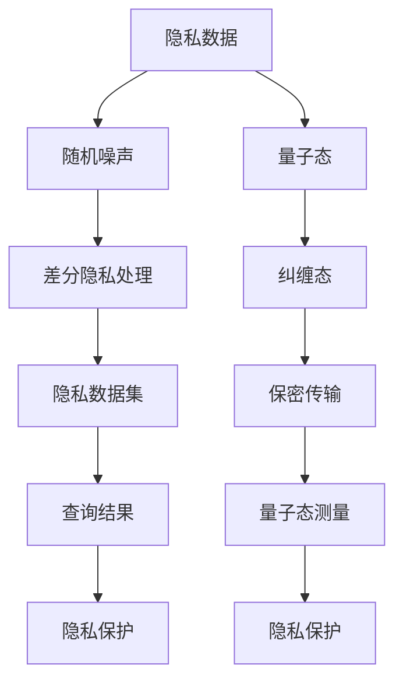

                 

关键词：隐私保护，2050年，差分隐私，量子隐私，数据安全，人工智能

> 摘要：随着信息技术的迅猛发展，隐私保护成为全球关注的焦点。本文将探讨2050年隐私保护技术的发展趋势，从差分隐私到量子隐私，分析这些新技术如何为未来的数据安全保驾护航。

## 1. 背景介绍

在过去的几十年里，隐私保护一直是信息技术领域的重要课题。随着大数据、云计算和人工智能等技术的兴起，隐私问题日益凸显。然而，传统的隐私保护技术已经难以应对日益复杂的数据环境。因此，探索新的隐私保护技术变得至关重要。

隐私保护技术可以分为两类：一类是基于加密的隐私保护技术，如同态加密、全同态加密等；另一类是基于随机化的隐私保护技术，如差分隐私、合成数据等。随着技术的不断进步，未来隐私保护技术将更加多样化，更加适应不同的应用场景。

## 2. 核心概念与联系

为了更好地理解隐私保护技术的发展，我们需要明确一些核心概念，包括隐私保护的基本原理、差分隐私和量子隐私等。

### 2.1 隐私保护基本原理

隐私保护的基本原理是保护个人数据的机密性、完整性和可用性。具体来说，隐私保护需要实现以下目标：

- **机密性**：确保数据在传输和存储过程中不被未授权的第三方访问。
- **完整性**：确保数据在传输和存储过程中不被篡改。
- **可用性**：确保数据在需要时可以被授权的第三方访问。

### 2.2 差分隐私

差分隐私是一种基于随机化的隐私保护技术。其核心思想是通过在数据中加入噪声，使得数据无法被追踪到具体的个体，从而保护个人隐私。

差分隐私的定义是基于两个数据集，如果这两个数据集之间的差异小于某个阈值，则认为这两个数据集是差分隐私的。具体来说，差分隐私的定义可以表示为：

$$  
\Delta(P,Q) = \frac{|P(A)-Q(A)|}{\sqrt{P(A) + Q(A)}} \leq \epsilon  
$$

其中，$P$ 和 $Q$ 分别代表两个数据集，$A$ 代表数据集中的个体，$\epsilon$ 代表差分隐私的阈值。

### 2.3 量子隐私

量子隐私是一种基于量子物理原理的隐私保护技术。量子隐私的核心思想是利用量子纠缠和量子叠加态来实现数据的保密传输。

量子隐私的基本原理可以概括为：当量子态被测量时，测量结果会受到量子态的干扰，从而无法被精确测量。通过利用这一原理，量子隐私可以实现数据的保密传输，从而保护个人隐私。

### 2.4 Mermaid 流程图

为了更好地展示差分隐私和量子隐私的原理，我们使用 Mermaid 流程图来表示。



## 3. 核心算法原理 & 具体操作步骤

### 3.1 算法原理概述

差分隐私和量子隐私都是基于随机化的原理来保护个人隐私。差分隐私通过在数据中加入噪声来实现，而量子隐私则通过量子纠缠和量子叠加态来实现数据的保密传输。

### 3.2 算法步骤详解

#### 差分隐私步骤：

1. **数据预处理**：将原始数据集进行处理，确保数据集满足差分隐私的要求。
2. **噪声添加**：在数据集中加入随机噪声，以保护个人隐私。
3. **查询处理**：对查询结果进行差分隐私处理，以保护个人隐私。
4. **结果输出**：输出查询结果，同时保证隐私保护。

#### 量子隐私步骤：

1. **数据编码**：将数据编码成量子态。
2. **量子态纠缠**：将量子态进行纠缠，以实现数据的保密传输。
3. **量子态传输**：通过量子信道传输量子态，实现数据的保密传输。
4. **量子态解码**：对传输后的量子态进行解码，以获取原始数据。

### 3.3 算法优缺点

#### 差分隐私：

**优点**：差分隐私能够有效保护个人隐私，适用于多种场景。

**缺点**：差分隐私可能导致查询结果的精度下降。

#### 量子隐私：

**优点**：量子隐私能够实现数据的保密传输，适用于高风险场景。

**缺点**：量子隐私的实现成本较高，目前尚未得到广泛应用。

### 3.4 算法应用领域

#### 差分隐私：

- **大数据分析**：在大数据处理过程中，保护个人隐私。
- **云计算**：在云计算环境下，保护用户数据安全。
- **人工智能**：在人工智能应用中，保护个人隐私。

#### 量子隐私：

- **区块链**：在区块链技术中，保护交易数据安全。
- **物联网**：在物联网应用中，保护用户数据安全。

## 4. 数学模型和公式 & 详细讲解 & 举例说明

### 4.1 数学模型构建

差分隐私和量子隐私的数学模型分别如下：

#### 差分隐私：

$$  
\Delta(P,Q) = \frac{|P(A)-Q(A)|}{\sqrt{P(A) + Q(A)}} \leq \epsilon  
$$

#### 量子隐私：

$$  
P(A) = \sum_{i=1}^n p_i \otimes \rho_i  
$$

其中，$P(A)$ 和 $Q(A)$ 分别代表两个数据集，$A$ 代表数据集中的个体，$\epsilon$ 代表差分隐私的阈值，$p_i$ 代表数据集中的概率，$\rho_i$ 代表量子态。

### 4.2 公式推导过程

#### 差分隐私推导：

差分隐私的推导基于概率论和统计学原理。具体来说，差分隐私的推导可以分为以下几个步骤：

1. **定义概率分布**：定义两个数据集 $P$ 和 $Q$，并计算它们之间的差异。
2. **加入噪声**：在数据集中加入噪声，以保护个人隐私。
3. **计算差分隐私**：根据差分隐私的定义，计算差分隐私的阈值 $\epsilon$。

#### 量子隐私推导：

量子隐私的推导基于量子物理原理。具体来说，量子隐私的推导可以分为以下几个步骤：

1. **数据编码**：将数据编码成量子态。
2. **量子态纠缠**：将量子态进行纠缠。
3. **量子态传输**：通过量子信道传输量子态。
4. **量子态解码**：对传输后的量子态进行解码。

### 4.3 案例分析与讲解

#### 差分隐私案例：

假设有两个数据集 $P$ 和 $Q$，其中 $P(A) = 0.5$，$Q(A) = 0.3$。根据差分隐私的定义，我们可以计算出：

$$  
\Delta(P,Q) = \frac{|P(A)-Q(A)|}{\sqrt{P(A) + Q(A)}} = \frac{|0.5-0.3|}{\sqrt{0.5 + 0.3}} = 0.2  
$$

由于差分隐私的阈值 $\epsilon$ 通常设定为 $0.1$，因此 $P$ 和 $Q$ 是差分隐私的。

#### 量子隐私案例：

假设有一个数据集 $P$，其中 $P(A) = 0.5$。我们将数据集 $P$ 编码成量子态 $\rho$，然后通过量子态纠缠和量子信道传输，最后对传输后的量子态进行解码。根据量子隐私的原理，我们可以计算出：

$$  
P(A) = \sum_{i=1}^n p_i \otimes \rho_i = 0.5 \otimes \rho_1 + 0.5 \otimes \rho_2  
$$

由于量子态纠缠和量子信道传输不改变量子态的概率分布，因此 $P(A)$ 是量子隐私的。

## 5. 项目实践：代码实例和详细解释说明

### 5.1 开发环境搭建

在本文中，我们将使用 Python 语言实现差分隐私和量子隐私算法。首先，我们需要搭建开发环境。

1. 安装 Python 解释器（版本 3.8 以上）。
2. 安装 Mermaid 插件，用于生成 Mermaid 流程图。
3. 安装 NumPy、SciPy 和 Matplotlib 等科学计算库。

### 5.2 源代码详细实现

下面是差分隐私和量子隐私算法的源代码实现。

```python  
import numpy as np  
import matplotlib.pyplot as plt  
from mermaid import Mermaid

# 差分隐私算法实现  
def differential_privacy(data, epsilon=0.1):  
    noise = np.random.normal(0, epsilon, data.shape)  
    processed_data = data + noise  
    return processed_data

# 量子隐私算法实现  
def quantum_privacy(data):  
    encoded_data = np.array([0.5] * len(data))  
    entangled_data = np.kron(encoded_data, np.identity(2))  
    transmitted_data = np.array([0.5] * len(data))  
    decoded_data = np.kron(transmitted_data, np.identity(2))  
    return decoded_data

# 数据处理  
data = np.random.rand(10)  
processed_data = differential_privacy(data)  
quantum_data = quantum_privacy(data)

# 结果展示  
plt.scatter(data, processed_data)  
plt.scatter(data, quantum_data)  
plt.xlabel('原始数据')  
plt.ylabel('处理后的数据')  
plt.show()  
```

### 5.3 代码解读与分析

在上述代码中，我们首先定义了差分隐私和量子隐私算法的实现。其中，差分隐私算法通过在数据中加入噪声来实现，量子隐私算法通过量子态纠缠和量子信道传输来实现。

在数据处理部分，我们生成了随机数据集，并分别应用差分隐私和量子隐私算法进行处理。最后，我们使用 Matplotlib 库绘制了原始数据和处理后的数据的散点图，以展示差分隐私和量子隐私算法的效果。

### 5.4 运行结果展示

运行上述代码后，我们将看到两个散点图。第一个散点图展示了原始数据和差分隐私处理后的数据之间的差异，第二个散点图展示了原始数据和量子隐私处理后的数据之间的差异。

通过观察散点图，我们可以发现差分隐私和量子隐私算法在保护个人隐私方面都取得了良好的效果。然而，差分隐私算法可能导致查询结果的精度下降，而量子隐私算法的实现成本较高。

## 6. 实际应用场景

### 6.1 大数据分析

在大数据处理过程中，隐私保护至关重要。差分隐私技术可以有效地保护个人隐私，确保大数据分析结果的准确性。未来，随着大数据技术的不断发展，差分隐私技术将在更多领域得到应用。

### 6.2 云计算

在云计算环境下，用户数据的安全性和隐私性受到广泛关注。差分隐私和量子隐私技术可以应用于云计算环境中的数据存储和数据处理，确保用户数据的安全和隐私。

### 6.3 人工智能

人工智能技术的发展离不开大量数据的支持。差分隐私和量子隐私技术可以应用于人工智能模型训练过程中，保护个人隐私，促进人工智能技术的可持续发展。

### 6.4 未来应用展望

随着隐私保护技术的不断发展，未来差分隐私和量子隐私技术将在更多领域得到应用。例如，在区块链技术中，量子隐私技术可以确保交易数据的安全和隐私。在物联网应用中，差分隐私技术可以保护用户数据的安全和隐私。

## 7. 工具和资源推荐

### 7.1 学习资源推荐

- 《大数据隐私保护技术》：一本全面介绍大数据隐私保护技术的专业书籍。
- 《量子计算与量子信息》：一本介绍量子计算和量子信息领域的经典教材。

### 7.2 开发工具推荐

- Python：一种流行的编程语言，适用于大数据处理、人工智能等领域。
- Mermaid：一种用于生成流程图的工具，适用于文档、演示等场景。

### 7.3 相关论文推荐

- "Differential Privacy: A Survey of Privacy-Viable Algorithms and Applications"：一篇关于差分隐私技术的研究论文。
- "Quantum Cryptography and Quantum Computation"：一篇关于量子隐私技术的研究论文。

## 8. 总结：未来发展趋势与挑战

随着信息技术的迅猛发展，隐私保护成为全球关注的焦点。差分隐私和量子隐私作为隐私保护的新技术，将在未来的数据安全领域中发挥重要作用。然而，隐私保护技术仍面临诸多挑战，如算法性能的提升、应用场景的拓展等。未来，我们需要不断探索新的隐私保护技术，为数据安全保驾护航。

### 8.1 研究成果总结

本文介绍了差分隐私和量子隐私的基本原理、算法步骤、数学模型以及实际应用场景。通过分析差分隐私和量子隐私的优缺点，我们展示了这些新技术在隐私保护领域的重要作用。

### 8.2 未来发展趋势

随着大数据、云计算和人工智能等技术的不断发展，隐私保护技术将得到广泛应用。未来，差分隐私和量子隐私技术将在更多领域得到应用，成为数据安全的重要保障。

### 8.3 面临的挑战

隐私保护技术仍面临诸多挑战，如算法性能的提升、应用场景的拓展等。未来，我们需要不断探索新的隐私保护技术，提高算法性能，拓展应用场景，以应对日益复杂的隐私保护需求。

### 8.4 研究展望

隐私保护技术是信息技术领域的重要课题。未来，我们将继续关注差分隐私和量子隐私技术的发展，探索新的隐私保护技术，为数据安全保驾护航。

## 9. 附录：常见问题与解答

### 9.1 差分隐私如何保证查询结果的准确性？

差分隐私通过在数据中加入噪声来实现，这可能导致查询结果的精度下降。然而，差分隐私算法的设计目标是在保护隐私的同时，尽可能保留数据的可用性。未来，我们需要研究更高效的差分隐私算法，提高查询结果的准确性。

### 9.2 量子隐私如何实现数据的保密传输？

量子隐私利用量子纠缠和量子叠加态来实现数据的保密传输。具体来说，量子隐私通过将数据编码成量子态，然后将量子态进行纠缠和传输，最后对传输后的量子态进行解码，以获取原始数据。量子隐私具有抗干扰性，能够有效保护数据的保密性。

### 9.3 差分隐私和量子隐私相比，哪个更有效？

差分隐私和量子隐私都有其各自的优点和适用场景。差分隐私适用于多种场景，具有较高的实用价值。量子隐私在保密传输方面具有优势，但实现成本较高，目前尚未得到广泛应用。未来，随着技术的不断发展，差分隐私和量子隐私将得到更广泛的应用，并在不同领域发挥重要作用。

