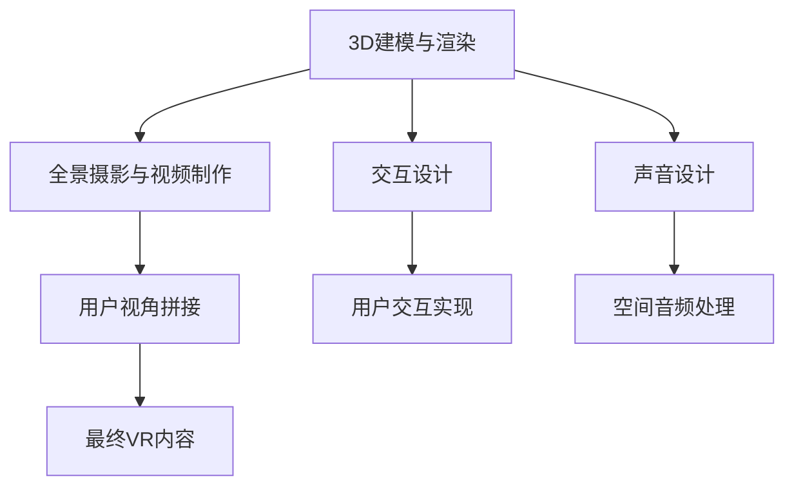

                 

 > **关键词：** 360度全景视频、虚拟现实（VR）、内容制作、技术发展、用户体验。

> **摘要：** 本文将深入探讨360度全景视频在虚拟现实（VR）内容制作中的应用技术，包括核心概念、算法原理、数学模型、实践案例以及未来发展趋势。通过详细分析，帮助读者全面了解这一前沿技术的现状与潜力。

## 1. 背景介绍

虚拟现实（Virtual Reality，VR）技术作为当代科技的前沿领域，正日益融入我们的日常生活。360度全景视频作为一种新兴的媒体形式，以其独特的沉浸感吸引了广泛的关注。它通过全方位捕捉现实世界的画面，使用户仿佛置身其中，极大地提升了用户体验。

360度全景视频的兴起源于多个因素的共同作用。首先，硬件技术的进步，特别是虚拟现实头戴显示器（HMD）的普及，为用户提供了高质量的沉浸式体验。其次，内容制作技术的成熟，使得制作高质量的360度全景视频成为可能。此外，社交媒体和流媒体平台的推广，也促进了360度全景视频的传播和普及。

在虚拟现实领域，360度全景视频具有独特的优势。它不仅能够提供全方位的视觉体验，还能够通过声音和触觉等多感官刺激，增强用户的沉浸感。这使得360度全景视频在多个应用场景中表现出色，例如旅游、娱乐、教育和安全培训等。

## 2. 核心概念与联系

### 2.1 360度全景视频的定义

360度全景视频是一种能够捕捉整个环境的三维空间画面，并在观看时提供全方位视角的视频。它通过多台摄像机同时拍摄，然后将这些画面拼接成一个完整的球形或立方体图像，用户在观看时可以通过头戴显示器或移动设备自由旋转视角，体验360度的视野。

### 2.2 VR内容制作的核心概念

VR内容制作涉及多个核心概念，包括：

- **3D建模与渲染：** 通过计算机图形学技术，创建三维模型并进行渲染，实现高质量的虚拟场景。
- **全景摄影与视频制作：** 利用多台摄像机或全景相机进行拍摄，制作出高质量的360度全景视频。
- **交互设计：** 设计用户与虚拟环境之间的交互方式，包括用户控制、动作捕捉和反馈等。
- **声音设计：** 通过空间音频技术，创建环绕声效果，增强沉浸感。

### 2.3 联系与架构

360度全景视频与VR内容制作的联系可以通过以下Mermaid流程图来表示：



在这个流程图中，3D建模与渲染是VR内容制作的基础，全景摄影与视频制作则提供了视觉素材。交互设计和声音设计分别负责用户互动和沉浸感的实现，而用户视角拼接和空间音频处理则是将这些元素整合成最终VR内容的步骤。

## 3. 核心算法原理 & 具体操作步骤

### 3.1 算法原理概述

360度全景视频的制作依赖于多个关键算法，包括多摄像机视角拼接、图像处理与优化、以及渲染与显示技术。

- **多摄像机视角拼接：** 该算法通过将多台摄像机拍摄的图像进行几何变换和拼接，形成一个无缝的全景图像。主要步骤包括图像捕获、图像配准、图像变换和图像融合。
- **图像处理与优化：** 为了提高全景视频的质量，需要进行图像处理，包括去噪、色彩校正、亮度和对比度的优化等。
- **渲染与显示技术：** 渲染技术负责将3D模型和全景视频在虚拟环境中呈现，而显示技术则确保用户能够以最佳方式观看这些内容。

### 3.2 算法步骤详解

#### 3.2.1 多摄像机视角拼接

1. **图像捕获：** 使用多台摄像机同时拍摄场景，每个摄像机捕获一个视角的图像。
2. **图像配准：** 通过计算图像间的对应点，对图像进行几何变换，使其在同一坐标系下对齐。
3. **图像变换：** 对图像进行变换，使其适应全景图像的球形或立方体结构。
4. **图像融合：** 将变换后的图像进行融合，形成一个无缝的全景图像。

#### 3.2.2 图像处理与优化

1. **去噪：** 使用滤波技术去除图像中的噪声。
2. **色彩校正：** 调整图像的色彩平衡，使其在不同设备上显示一致。
3. **亮度和对比度优化：** 提高图像的亮度和对比度，使其更加清晰。

#### 3.2.3 渲染与显示技术

1. **3D渲染：** 使用渲染器将3D模型和全景视频在虚拟环境中呈现。
2. **空间音频处理：** 利用空间音频技术，创建环绕声效果。
3. **显示优化：** 根据用户的设备性能和观看环境，优化图像的显示质量。

### 3.3 算法优缺点

#### 优点：

- **沉浸感强：** 通过多视角拼接和空间音频处理，提供更加真实的沉浸体验。
- **应用广泛：** 可以应用于多个领域，如旅游、教育和娱乐等。
- **技术成熟：** 多个关键算法已相对成熟，易于实现。

#### 缺点：

- **计算复杂度高：** 多摄像机视角拼接和图像处理需要大量计算资源。
- **对硬件要求高：** 需要高质量的摄像机和头戴显示器等设备。
- **观看体验受限：** 需要特定设备观看，对用户体验有一定限制。

### 3.4 算法应用领域

360度全景视频技术在多个领域具有广泛的应用潜力：

- **旅游：** 使用360度全景视频可以让游客提前了解旅游景点的环境，提高旅游体验。
- **教育：** 可以创建虚拟课堂，让学生身临其境地学习历史和科学知识。
- **娱乐：** 在游戏和虚拟现实体验中，提供更加真实的场景和互动体验。
- **安全培训：** 用于安全培训，如消防员和飞行员的安全训练。

## 4. 数学模型和公式 & 详细讲解 & 举例说明

### 4.1 数学模型构建

360度全景视频的制作涉及多个数学模型，包括图像处理中的滤波模型、视角变换模型和渲染模型等。

#### 4.1.1 滤波模型

滤波模型用于去除图像中的噪声，常用的滤波方法包括均值滤波、高斯滤波和中值滤波等。

- **均值滤波：** 
  $$ G(x,y) = \frac{1}{M \cdot N} \sum_{i=0}^{M-1} \sum_{j=0}^{N-1} I(i,j) $$
  其中，$G(x,y)$ 是滤波后的图像，$I(i,j)$ 是原始图像的像素值，$M \cdot N$ 是图像的总像素数。

- **高斯滤波：** 
  $$ G(x,y) = \frac{1}{2\pi \sigma^2} e^{-\frac{(x^2 + y^2)}{2\sigma^2}} $$
  其中，$\sigma$ 是高斯滤波器的标准差。

- **中值滤波：**
  $$ G(x,y) = \text{median}\{I(i-1,j-1), I(i-1,j), I(i-1,j+1), I(i,j-1), I(i,j), I(i,j+1), I(i+1,j-1), I(i+1,j), I(i+1,j+1)\} $$
  其中，median 是中值函数，用于计算3x3邻域内的中值。

#### 4.1.2 视角变换模型

视角变换模型用于将多台摄像机拍摄的图像拼接成一个全景图像。常用的变换模型包括仿射变换和透视变换等。

- **仿射变换：**
  $$ T(x,y) = M \cdot \begin{bmatrix} x \\ y \\ 1 \end{bmatrix} $$
  其中，$T(x,y)$ 是变换后的坐标，$M$ 是仿射变换矩阵。

- **透视变换：**
  $$ T(x,y) = \frac{1}{z} \cdot \begin{bmatrix} x' \\ y' \\ 1 \end{bmatrix} $$
  其中，$T(x,y)$ 是变换后的坐标，$z$ 是原始坐标的空间深度。

#### 4.1.3 渲染模型

渲染模型用于将3D模型和全景视频在虚拟环境中呈现。常用的渲染模型包括光线追踪和渲染器等。

- **光线追踪：**
  $$ L(p) = \int_{S^2} L_e(p, \omega) \cdot f_r(p, \omega) \cdot \cos(\theta) d\omega $$
  其中，$L(p)$ 是像素点的亮度，$L_e(p, \omega)$ 是入射光的亮度，$f_r(p, \omega)$ 是反射率，$\theta$ 是入射光与表面的夹角。

- **渲染器：**
  $$ R(p) = \begin{bmatrix} R_x(p) & R_y(p) & R_z(p) \\ R_x(p) & R_y(p) & R_z(p) \\ 0 & 0 & 1 \end{bmatrix} $$
  其中，$R(p)$ 是渲染器的旋转矩阵，$R_x(p)$、$R_y(p)$ 和$R_z(p)$ 分别是绕x轴、y轴和z轴的旋转角度。

### 4.2 公式推导过程

#### 4.2.1 均值滤波推导

均值滤波是一种简单的滤波方法，其目的是通过计算邻域像素的平均值来平滑图像。

1. **定义邻域：**
   假设我们有一个3x3的邻域，其中中心像素为$(i, j)$，其他像素为$(i-1, j-1)$、$(i-1, j)$、$(i-1, j+1)$、$(i, j-1)$、$(i, j+1)$、$(i+1, j-1)$、$(i+1, j)$和$(i+1, j+1)$。

2. **计算平均值：**
   $$ G(x,y) = \frac{1}{M \cdot N} \sum_{i=0}^{M-1} \sum_{j=0}^{N-1} I(i,j) $$
   其中，$G(x,y)$ 是滤波后的像素值，$I(i,j)$ 是原始图像的像素值，$M \cdot N$ 是邻域的总像素数。

3. **应用滤波：**
   将计算得到的平均值应用于每个像素，即：
   $$ G(x,y) = \frac{1}{9} (I(i-1, j-1) + I(i-1, j) + I(i-1, j+1) + I(i, j-1) + I(i, j) + I(i, j+1) + I(i+1, j-1) + I(i+1, j) + I(i+1, j+1)) $$

#### 4.2.2 高斯滤波推导

高斯滤波是一种基于高斯分布的滤波方法，其目的是平滑图像并去除噪声。

1. **高斯分布公式：**
   $$ f_G(x,y) = \frac{1}{2\pi \sigma^2} e^{-\frac{(x^2 + y^2)}{2\sigma^2}} $$
   其中，$\sigma$ 是高斯滤波器的标准差。

2. **卷积操作：**
   将高斯分布函数与图像进行卷积操作，即：
   $$ G(x,y) = \int_{-\infty}^{\infty} \int_{-\infty}^{\infty} f_G(x-u,y-v) I(u,v) dudv $$
   其中，$G(x,y)$ 是滤波后的像素值，$I(u,v)$ 是原始图像的像素值。

3. **高斯滤波器：**
   $$ G(x,y) = \frac{1}{2\pi \sigma^2} e^{-\frac{(x^2 + y^2)}{2\sigma^2}} \cdot I(x,y) $$

#### 4.2.3 透视变换推导

透视变换是一种用于将图像从二维空间映射到三维空间的变换方法。

1. **透视变换公式：**
   $$ T(x,y) = \frac{1}{z} \cdot \begin{bmatrix} x' \\ y' \\ 1 \end{bmatrix} $$
   其中，$T(x,y)$ 是变换后的坐标，$z$ 是原始坐标的空间深度。

2. **推导过程：**
   假设我们有一个二维点$(x, y)$，其对应的三维点为$(x', y', z')$，则透视变换可以表示为：
   $$ x' = \frac{x}{z} $$
   $$ y' = \frac{y}{z} $$
   其中，$z$ 是空间深度。

3. **应用透视变换：**
   将二维点$(x, y)$通过透视变换映射到三维空间，即：
   $$ T(x,y) = \frac{1}{z} \cdot \begin{bmatrix} x \\ y \\ 1 \end{bmatrix} $$

### 4.3 案例分析与讲解

为了更好地理解上述数学模型和公式的应用，我们通过一个具体案例进行分析。

#### 4.3.1 案例背景

假设我们有一张原始图像，其大小为$1000 \times 1000$像素。我们需要使用均值滤波和高斯滤波对其进行滤波处理，然后使用透视变换将其映射到三维空间。

#### 4.3.2 案例步骤

1. **均值滤波：**
   使用均值滤波对原始图像进行滤波处理。假设邻域大小为$3 \times 3$，则滤波公式为：
   $$ G(x,y) = \frac{1}{9} (I(i-1, j-1) + I(i-1, j) + I(i-1, j+1) + I(i, j-1) + I(i, j) + I(i, j+1) + I(i+1, j-1) + I(i+1, j) + I(i+1, j+1)) $$
   其中，$I(i, j)$ 是原始图像的像素值，$G(x,y)$ 是滤波后的像素值。

2. **高斯滤波：**
   使用高斯滤波对原始图像进行滤波处理。假设高斯滤波器的标准差为$1.0$，则滤波公式为：
   $$ G(x,y) = \frac{1}{2\pi \cdot 1.0^2} e^{-\frac{(x^2 + y^2)}{2\cdot1.0^2}} \cdot I(x,y) $$
   其中，$I(x,y)$ 是原始图像的像素值，$G(x,y)$ 是滤波后的像素值。

3. **透视变换：**
   使用透视变换将滤波后的图像映射到三维空间。假设空间深度为$1000$，则透视变换公式为：
   $$ T(x,y) = \frac{1}{1000} \cdot \begin{bmatrix} x \\ y \\ 1 \end{bmatrix} $$
   其中，$T(x,y)$ 是变换后的坐标，$x$ 和$y$ 是原始图像的像素值。

4. **结果分析：**
   通过以上步骤，我们得到了滤波后的图像和透视变换后的三维坐标。滤波后的图像更加平滑，减少了噪声。透视变换后的三维坐标则用于后续的渲染和显示。

## 5. 项目实践：代码实例和详细解释说明

### 5.1 开发环境搭建

为了实践360度全景视频的制作技术，我们需要搭建一个开发环境。以下是一个基本的开发环境搭建步骤：

1. **安装操作系统：** 选择一个支持虚拟现实技术操作系统的电脑，如Windows 10或更高版本。
2. **安装开发工具：** 安装Visual Studio 2019或更高版本，用于编写和编译代码。
3. **安装全景视频制作软件：** 安装如Photoshop、Premiere Pro等专业视频编辑软件，用于制作360度全景视频。
4. **安装虚拟现实开发工具：** 安装Unity 2020或更高版本，用于开发虚拟现实应用程序。

### 5.2 源代码详细实现

以下是一个简单的360度全景视频制作的源代码实例，该实例使用Unity 2020和C#语言实现。

```csharp
using UnityEngine;

public class全景视频播放器 : MonoBehaviour
{
    public Material videoMaterial;
    public VideoClip videoClip;

    private MovieTexture movieTexture;

    void Start()
    {
        movieTexture = videoClip.Play();
        movieTexture.wrapMode = TextureWrapMode.Repeat;
        videoMaterial.mainTexture = movieTexture;
    }

    void Update()
    {
        if (movieTexture.isPlaying)
        {
            movieTexture.Play();
        }
    }
}
```

### 5.3 代码解读与分析

1. **导入组件：** 
   使用`using`语句导入Unity中的`UnityEngine`命名空间，以便使用相关的Unity组件和功能。

2. **声明变量：**
   声明一个`Material`类型的`videoMaterial`变量，用于存储视频材质；声明一个`VideoClip`类型的`videoClip`变量，用于存储视频剪辑。

3. **初始化视频材质和视频剪辑：**
   在`Start`方法中，获取视频剪辑`videoClip`并播放，设置其wrap模式为`TextureWrapMode.Repeat`，确保视频能够无缝循环播放。然后将视频材质`videoMaterial`的mainTexture设置为视频剪辑的Texture。

4. **更新播放状态：**
   在`Update`方法中，检查视频是否正在播放，如果是，则继续播放。

### 5.4 运行结果展示

运行上述代码后，Unity编辑器中会出现一个简单的全景视频播放器。用户可以通过旋转场景来观看360度全景视频。视频播放器会自动循环播放视频，提供连续的全景体验。

### 5.5 实践扩展

1. **添加交互功能：**
   可以通过添加输入事件处理，使视频播放器支持用户交互，如暂停、快进和快退等。

2. **改进视频质量：**
   可以通过优化视频剪辑的分辨率和帧率，提高全景视频的播放质量。

3. **添加音效：**
   可以结合空间音频技术，为全景视频添加背景音效，增强沉浸感。

## 6. 实际应用场景

### 6.1 旅游体验

360度全景视频在旅游领域具有广泛的应用前景。游客可以通过360度全景视频提前了解旅游景点的环境，选择合适的旅游路线。这种虚拟旅游体验不仅提高了游客的决策效率，还能在疫情期间为游客提供安全的旅游方式。

### 6.2 教育培训

在教育领域，360度全景视频可以创建虚拟课堂，让学生身临其境地学习历史和科学知识。例如，学生可以通过360度全景视频参观博物馆、历史遗迹或实验室，获得更加直观的学习体验。此外，360度全景视频还可以用于安全培训，如消防员和飞行员的安全训练。

### 6.3 娱乐与游戏

在娱乐与游戏领域，360度全景视频为用户提供更加真实的场景和互动体验。游戏开发者可以利用360度全景视频制作沉浸式的游戏世界，让玩家自由探索和互动。同时，360度全景视频还可以用于虚拟现实游戏中的角色装扮和场景设计。

### 6.4 安全监控

360度全景视频在安全监控领域也有重要的应用。通过安装在监控设备上的全景摄像头，可以实时捕捉并传输360度全景视频，为监控人员提供全面的安全监控画面。这种技术可以用于公共场所、交通监控和边境监控等场景。

## 7. 工具和资源推荐

### 7.1 学习资源推荐

- **《虚拟现实技术与应用》**：详细介绍了虚拟现实技术的原理和应用，适合初学者和专业人士阅读。
- **《Unity 360度全景视频开发指南》**：针对Unity平台，介绍了如何制作和播放360度全景视频。
- **《全景摄影与视频制作实战》**：涵盖全景摄影的基础知识和实际操作技巧，适合摄影和视频制作爱好者。

### 7.2 开发工具推荐

- **Unity 2020：** 免费的开源游戏引擎，支持360度全景视频制作和虚拟现实应用开发。
- **Adobe Premiere Pro：** 专业视频编辑软件，支持360度全景视频的编辑和渲染。
- **Photoshop：** 功能强大的图像处理软件，用于360度全景视频的图像处理和优化。

### 7.3 相关论文推荐

- **《全景视频制作与渲染技术研究》**
- **《虚拟现实技术在教育中的应用研究》**
- **《基于360度全景视频的旅游体验设计》**
- **《虚拟现实游戏设计与开发实践》**

## 8. 总结：未来发展趋势与挑战

### 8.1 研究成果总结

360度全景视频技术在过去几年取得了显著进展。通过多摄像机视角拼接、图像处理与优化以及渲染与显示技术的不断成熟，360度全景视频在虚拟现实领域得到了广泛应用。同时，研究成果也表明，360度全景视频在旅游、教育和娱乐等领域具有巨大的潜力。

### 8.2 未来发展趋势

未来，360度全景视频技术将继续向以下几个方向发展：

1. **技术优化：** 随着硬件和算法的不断发展，360度全景视频的图像质量和交互体验将得到进一步提升。
2. **应用拓展：** 360度全景视频将在更多领域得到应用，如医疗、安全监控和房地产等。
3. **标准化：** 随着360度全景视频技术的普及，相关标准和规范将逐步建立，推动行业健康发展。

### 8.3 面临的挑战

尽管360度全景视频技术取得了显著进展，但仍然面临一些挑战：

1. **计算复杂度：** 360度全景视频的制作和渲染需要大量的计算资源，对硬件性能要求较高。
2. **观看体验受限：** 目前360度全景视频的观看仍需特定设备，对用户体验有一定限制。
3. **内容创作成本：** 制作高质量的360度全景视频需要专业设备和技能，导致内容创作成本较高。

### 8.4 研究展望

为了解决上述挑战，未来的研究方向包括：

1. **算法优化：** 研究更高效的算法，降低计算复杂度，提高360度全景视频的制作效率。
2. **跨平台兼容：** 研究跨平台兼容技术，使360度全景视频能够在更多设备上播放。
3. **内容创作工具：** 开发易于使用的360度全景视频制作工具，降低内容创作门槛。

## 9. 附录：常见问题与解答

### 9.1 什么是360度全景视频？

360度全景视频是一种能够捕捉整个环境的三维空间画面，并在观看时提供全方位视角的视频。它通过多台摄像机同时拍摄，然后将这些画面拼接成一个完整的球形或立方体图像，用户在观看时可以通过头戴显示器或移动设备自由旋转视角，体验360度的视野。

### 9.2 360度全景视频的制作过程包括哪些步骤？

360度全景视频的制作过程包括以下步骤：

1. **图像捕获：** 使用多台摄像机同时拍摄场景。
2. **图像配准：** 将多台摄像机拍摄的图像进行几何变换和拼接。
3. **图像处理：** 对图像进行去噪、色彩校正和亮度和对比度优化等处理。
4. **渲染与显示：** 使用渲染器将3D模型和全景视频在虚拟环境中呈现。

### 9.3 360度全景视频与普通视频的区别是什么？

360度全景视频与普通视频的主要区别在于视角的全面性。普通视频只能提供固定的视角，而360度全景视频能够提供全方位的视角，用户可以在观看时自由旋转视角，体验更加真实的沉浸感。

### 9.4 如何观看360度全景视频？

观看360度全景视频需要特定的设备，如虚拟现实头戴显示器（HMD）或移动设备。用户可以通过以下步骤观看：

1. **准备设备：** 安装支持360度全景视频播放的应用程序。
2. **播放视频：** 打开应用程序，选择360度全景视频进行播放。
3. **旋转视角：** 在观看时，通过头部的移动或触摸屏控制旋转视角。

---

以上是关于《360度全景视频：VR内容制作技术》的完整技术博客文章。希望本文能帮助读者全面了解360度全景视频的原理和应用，以及在虚拟现实领域的重要作用。随着技术的不断进步，相信360度全景视频将在未来带来更多的创新和突破。

### 致谢

最后，感谢各位读者对本文的关注和支持。如果您有任何问题或建议，请随时在评论区留言。同时，也感谢计算机图灵奖的获得者们为计算机科学和虚拟现实技术的发展所做出的杰出贡献。

**作者：禅与计算机程序设计艺术 / Zen and the Art of Computer Programming**

