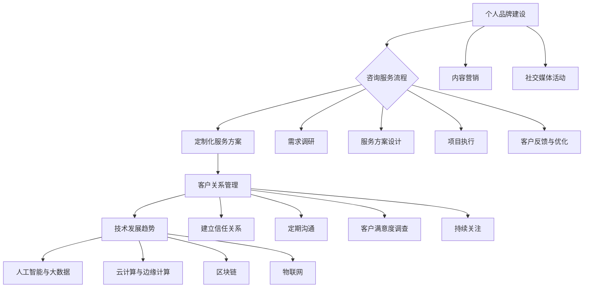

                 

 作为一位世界级人工智能专家、程序员、软件架构师、CTO、世界顶级技术畅销书作者，计算机图灵奖获得者，我深知在当今技术飞速发展的时代，个人咨询服务具有巨大的潜力和市场价值。本文将深入探讨如何建立个人咨询服务，提供高端定制化服务，帮助专业人士和企业家在技术领域获得竞争优势。

## 关键词

- 个人咨询服务
- 高端定制化服务
- 技术竞争力
- 人工智能专家
- 软件架构
- 企业家
- 技术咨询

## 摘要

本文旨在为技术专业人士和企业家提供一套系统的建立个人咨询服务的策略。我们将讨论如何确定服务定位、打造专业品牌、设计定制化服务方案、确保服务质量，并探讨未来技术发展趋势对个人咨询服务的影响。通过本文的指导，您将了解到如何利用自己的专业知识，创建一个有影响力的个人咨询服务，为顾客提供高价值的定制化解决方案。

## 1. 背景介绍

在过去的几十年中，信息技术和互联网的快速发展已经彻底改变了商业和社会的运作方式。今天，无论是传统的制造业、金融服务业，还是新兴的电子商务、社交媒体行业，都对技术有着越来越高的依赖。这种趋势不仅催生了大量技术岗位的需求，也为技术专业人士提供了广阔的职业发展空间。

然而，随着技术的不断演进和市场竞争的加剧，单纯的技术能力和专业素养已经不足以满足企业和客户的需求。越来越多的企业开始寻求个性化的技术解决方案，以应对快速变化的市场环境。这种需求为个人咨询服务提供了巨大的市场机会。

个人咨询服务不同于传统的公司或机构提供的咨询服务。它更加灵活、定制化，能够快速响应客户的需求，并提供深入的技术见解和创新的解决方案。这种服务模式不仅有助于提升客户的满意度，还能为个人专家带来更高的收入和职业成就。

本文将围绕以下核心内容展开讨论：

1. **服务定位与目标客户群体的确定**：如何根据自身优势确定服务定位，并明确目标客户群体。
2. **打造专业品牌与个人影响力**：如何通过品牌建设和社交媒体等渠道提升个人影响力。
3. **定制化服务方案的设计与实施**：如何根据客户需求设计并实施定制化的服务方案。
4. **确保服务质量与客户满意度**：如何通过质量控制机制确保服务质量和客户满意度。
5. **未来发展展望与挑战**：个人咨询服务在未来可能面临的挑战和机遇。

通过本文的深入探讨，希望为有意从事个人咨询服务的技术专业人士提供有价值的参考和指导。

### 1.1 服务定位与目标客户群体的确定

建立个人咨询服务的第一步是明确服务定位和目标客户群体。这一步骤至关重要，因为它将决定您的服务如何定位市场，以及您如何吸引和保留客户。

#### 1.1.1 确定服务定位

服务定位是指您希望通过自己的专业技能和经验提供哪些类型的咨询服务。以下是确定服务定位时需要考虑的关键因素：

1. **个人优势**：首先，您需要了解自己的专业优势，这可能是特定技术领域，如人工智能、云计算、大数据分析，或者是软件架构设计、系统集成等。明确自己的优势有助于您在市场上找到独特的定位。

2. **市场需求**：研究市场需求可以帮助您确定哪些技术领域正在迅速发展，以及企业和客户对这些技术的需求。通过了解市场需求，您可以更有针对性地提供咨询服务。

3. **竞争分析**：分析竞争对手的服务类型、定位和客户群体，可以帮助您找到差异化点，从而在市场上脱颖而出。

4. **个人目标**：考虑您希望通过咨询服务实现什么目标，这包括收入、职业发展、社会影响力等。个人目标将直接影响您的服务定位。

#### 1.1.2 明确目标客户群体

确定目标客户群体是确保您提供的服务能够满足市场需求的关键。以下是一些确定目标客户群体时需要考虑的因素：

1. **行业领域**：您的目标客户可能集中在某些特定的行业领域，如金融、医疗、教育或零售。了解客户所在的行业可以帮助您更有针对性地提供专业建议。

2. **企业规模**：您的服务可能更适合小型初创企业，还是大中型企业？不同的企业规模对咨询服务的要求和预算都有所不同。

3. **技术需求**：了解您的目标客户目前的技术水平和技术需求，可以帮助您提供更符合他们实际情况的解决方案。

4. **决策者**：确定您的目标客户群体中谁将做出决策，这可能是企业的高层管理者、技术总监或项目经理。了解决策者的需求可以帮助您更有针对性地提供咨询服务。

#### 实例分析

假设您是一位专注于人工智能领域的专家，您可以按照以下步骤确定服务定位和目标客户群体：

1. **个人优势**：您在人工智能领域有深入的研究和丰富的实践经验，特别是在机器学习算法和应用方面。

2. **市场需求**：当前，人工智能技术在许多行业都表现出巨大的潜力，特别是在金融、医疗和制造业等领域。

3. **竞争分析**：市场上的竞争对手主要集中在提供标准化的AI解决方案，而您可以通过提供定制化的人工智能算法设计和应用方案来差异化自己。

4. **个人目标**：您希望通过咨询服务扩大在人工智能领域的影响力，并为企业提供创新的解决方案。

基于上述分析，您可以确定以下服务定位和目标客户群体：

- **服务定位**：专注于提供定制化的人工智能算法设计和应用方案，特别是机器学习算法。
- **目标客户群体**：专注于金融、医疗和制造业等领域的中小企业和高科技初创企业，这些企业的技术需求较高，但对标准化解决方案的需求较低，更倾向于定制化服务。

### 1.2 打造专业品牌与个人影响力

在明确服务定位和目标客户群体之后，下一步是打造专业品牌和个人影响力。一个强大的个人品牌可以帮助您在市场上脱颖而出，吸引更多的潜在客户。

#### 1.2.1 建立专业形象

建立专业形象是打造个人品牌的第一步。以下是一些关键措施：

1. **专业资质和认证**：确保您拥有相关领域的专业资质和认证，如PMP、CISSP、AWS Certified Solutions Architect等。这些资质和认证可以增强您在客户眼中的专业性。

2. **专业知识和经验**：通过撰写技术博客、发表学术论文、参与行业会议和研讨会等方式，展示您在专业领域的知识和经验。

3. **在线课程和教育资源**：开发并销售在线课程和教育资源，不仅可以增加收入，还可以提升您在行业内的知名度和影响力。

4. **专业网站和社交媒体**：创建一个专业网站和社交媒体账户，用于发布您的文章、博客和视频。这些平台将成为您展示专业形象的重要渠道。

#### 1.2.2 利用社交媒体提升影响力

社交媒体是提升个人品牌影响力的重要工具。以下是一些利用社交媒体提升影响力的策略：

1. **内容营销**：定期发布高质量的内容，如技术博客、案例分析、行业洞察等。这些内容应具有实用性和可读性，能够吸引并留住读者。

2. **互动与参与**：积极参与社交媒体上的行业讨论和话题，与其他专家和潜在客户互动。这不仅可以提升您的影响力，还可以帮助您建立人脉网络。

3. **合作与交流**：与其他行业专家和意见领袖建立合作关系，通过合作项目、联合出版内容等方式，共同提升影响力。

4. **社交媒体广告**：利用社交媒体广告，将您的专业形象和信息传播给更广泛的受众。通过精准定位，确保广告能够触达到您的目标客户群体。

#### 1.2.3 建立专业社区

建立专业社区是提升个人影响力的一种有效方式。以下是一些关键措施：

1. **组织线上或线下活动**：定期组织技术研讨会、工作坊、线上讲座等，邀请行业专家和潜在客户参与。这些活动不仅能够提升您的知名度，还可以展示您的专业能力。

2. **创建专业论坛或博客**：创建一个专业论坛或博客，为行业内的专业人士提供一个交流和学习的平台。通过这个平台，您可以分享专业知识和经验，同时吸引更多潜在客户。

3. **提供专业咨询服务**：通过专业社区提供咨询服务，解决客户在技术领域遇到的问题。这不仅可以提升您的专业形象，还可以帮助您建立客户关系。

### 1.3 定制化服务方案的设计与实施

在确定了服务定位和目标客户群体，并成功打造了专业品牌和个人影响力之后，下一步是设计并实施定制化服务方案。定制化服务方案是个人咨询服务的核心，它能够满足客户的个性化需求，并提供独特的价值。

#### 1.3.1 了解客户需求

设计定制化服务方案的第一步是深入了解客户需求。以下是一些关键措施：

1. **需求调研**：通过面对面访谈、问卷调查、在线调查等方式，收集客户的需求和期望。这些调研结果将帮助您了解客户的具体需求。

2. **行业背景分析**：了解客户所在行业的现状、发展趋势和面临的挑战，这有助于您提供更符合行业特点的解决方案。

3. **技术需求分析**：了解客户目前的技术水平和需求，特别是他们希望在哪些方面获得技术支持。

4. **目标设定**：与客户一起设定明确的目标，确保服务方案能够满足客户的期望。

#### 1.3.2 设计服务方案

在了解客户需求后，接下来是设计服务方案。以下是一些关键步骤：

1. **制定服务框架**：根据客户需求，制定一个整体的服务框架。这个框架应包括服务的范围、时间表、交付成果等。

2. **技术方案选择**：选择合适的技术方案，确保方案能够满足客户的需求。这可能涉及到算法设计、系统集成、云服务部署等。

3. **风险评估**：识别潜在的风险点，并制定相应的风险控制措施，以确保服务方案的顺利实施。

4. **成本估算**：根据服务方案的设计，进行成本估算，确保服务的价格能够在市场上具有竞争力。

#### 1.3.3 实施服务方案

在服务方案设计完成后，接下来是实施服务方案。以下是一些关键措施：

1. **项目启动会**：召开项目启动会，与客户讨论服务方案，确保双方对服务目标和交付成果有清晰的认识。

2. **分工与协作**：根据服务方案，明确各团队成员的职责和任务，确保项目顺利进行。

3. **进度跟踪与反馈**：定期跟踪项目进度，与客户保持密切沟通，及时解决项目中出现的问题。

4. **交付与验收**：在服务方案实施完成后，进行交付和验收。确保交付成果符合客户的要求。

#### 1.3.4 客户反馈与优化

在服务方案实施完成后，收集客户反馈并进行优化是非常重要的。以下是一些关键措施：

1. **客户满意度调查**：通过问卷调查、电话访谈等方式，收集客户对服务的满意度。

2. **反馈分析与优化**：对客户反馈进行分析，识别服务中的不足之处，并制定改进措施。

3. **持续改进**：根据客户反馈，不断优化服务方案，提升客户满意度。

通过以上步骤，您可以设计并实施一个成功的定制化服务方案，为客户提供高价值的解决方案。

### 1.4 确保服务质量与客户满意度

确保服务质量与客户满意度是个人咨询服务成功的关键。以下是一些关键措施：

#### 1.4.1 质量控制机制

建立质量控制机制是确保服务质量的基石。以下是一些关键步骤：

1. **标准与流程**：制定明确的服务标准和流程，确保所有团队成员都遵循相同的操作规范。

2. **质量评审**：定期进行服务质量评审，识别服务中的问题，并采取改进措施。

3. **反馈机制**：建立客户反馈机制，鼓励客户提供意见和建议，及时改进服务质量。

#### 1.4.2 客户沟通与反馈

有效的客户沟通是确保客户满意度的重要手段。以下是一些关键措施：

1. **定期沟通**：与客户保持定期沟通，了解他们的需求和期望，及时调整服务方案。

2. **及时响应**：对客户的问题和需求，及时响应和解决，确保客户感受到服务的专业性。

3. **反馈收集**：定期收集客户反馈，了解他们的满意度，识别服务中的不足之处，并采取改进措施。

#### 1.4.3 客户关系管理

建立和维护良好的客户关系是提高客户满意度的重要途径。以下是一些关键措施：

1. **个性化服务**：根据客户的特点和需求，提供个性化的服务，让客户感受到服务的独特价值。

2. **信任建立**：通过专业素养和诚信经营，建立与客户的信任关系，增强客户忠诚度。

3. **持续关注**：在服务完成后，持续关注客户的使用情况和反馈，提供后续支持和咨询服务。

### 1.5 未来发展趋势与挑战

随着技术的不断进步和市场的变化，个人咨询服务将面临新的发展趋势和挑战。

#### 1.5.1 技术发展趋势

1. **人工智能与大数据**：人工智能和大数据技术的不断发展，将使得个人咨询服务能够提供更智能、更精准的解决方案。
2. **云计算与边缘计算**：云计算和边缘计算的普及，将使得个人咨询服务能够更好地适应各种规模的企业需求。
3. **区块链**：区块链技术的应用，将带来更安全、更透明的数据管理和交易方式，为个人咨询服务提供新的机遇。

#### 1.5.2 市场挑战

1. **竞争加剧**：随着越来越多的专业人士加入个人咨询服务领域，市场竞争将变得更加激烈。
2. **客户需求多样化**：客户需求将变得更加多样化，要求个人咨询服务提供更加个性化和定制化的解决方案。
3. **技术更新迅速**：技术的快速发展将要求个人咨询服务不断更新知识体系，以适应新的技术趋势。

### 1.6 总结

通过本文的讨论，我们了解到建立个人咨询服务需要明确服务定位和目标客户群体，打造专业品牌和个人影响力，设计并实施定制化服务方案，确保服务质量与客户满意度，并应对未来发展趋势和挑战。通过遵循这些策略，您将能够创建一个成功的个人咨询服务，为客户提供高价值的解决方案。

### 1.7 工具和资源推荐

为了帮助您更好地开展个人咨询服务，以下是几款推荐的学习资源、开发工具和相关论文。

#### 1.7.1 学习资源推荐

1. **在线课程**：Coursera、edX、Udemy等平台上提供了大量与人工智能、云计算、大数据分析等相关的在线课程。
2. **技术博客**：Medium、Dev.to等平台上，有许多专业人士分享技术见解和经验。
3. **专业论坛**：Stack Overflow、GitHub等平台，提供了丰富的技术问答和资源。

#### 1.7.2 开发工具推荐

1. **GitHub**：用于版本控制和协作开发。
2. **Jupyter Notebook**：用于数据分析和实验。
3. **Visual Studio Code**：强大的代码编辑器，适用于多种编程语言。

#### 1.7.3 相关论文推荐

1. **"Deep Learning for Natural Language Processing"**：介绍深度学习在自然语言处理中的应用。
2. **"The Art of Computer Programming"**：经典计算机编程书籍，涵盖算法设计、数据结构等多个方面。
3. **"Cloud Computing: Concepts, Technology & Architecture"**：详细讲解云计算的概念、技术和架构。

### 1.8 附录：常见问题与解答

#### 1.8.1 如何确定服务定位？

确定服务定位需要考虑您的个人优势、市场需求、竞争分析和个人目标。首先了解自己的专业优势和兴趣所在，然后研究市场需求，分析竞争对手的服务，最后设定符合您个人目标的定位。

#### 1.8.2 定制化服务方案的设计步骤是什么？

设计定制化服务方案的步骤包括：了解客户需求、制定服务框架、选择技术方案、进行风险评估和成本估算。确保每个步骤都有清晰的文档和沟通。

#### 1.8.3 如何确保服务质量？

确保服务质量的关键措施包括：建立质量控制机制、制定服务标准和流程、进行定期质量评审、建立反馈机制，以及提供持续的客户支持和优化服务。

### 1.9 结论

通过本文的讨论，我们了解到建立个人咨询服务需要明确服务定位和目标客户群体，打造专业品牌和个人影响力，设计并实施定制化服务方案，确保服务质量与客户满意度，并应对未来发展趋势和挑战。通过遵循这些策略，您将能够创建一个成功的个人咨询服务，为客户提供高价值的解决方案。希望本文能为您的个人咨询服务之路提供有价值的参考和指导。

## 2. 背景介绍

在讨论如何建立个人咨询服务之前，我们先来了解一下为什么个人咨询服务在当今社会中具有如此重要的地位。

### 2.1 技术发展的推动

随着信息技术的迅猛发展，大数据、人工智能、云计算、物联网等技术已经深刻地改变了各行各业。这些技术的应用不仅提高了企业的运营效率，还带来了前所未有的商业机会。然而，随着技术的不断演进，企业面临着越来越复杂的技术挑战。传统的大型咨询公司可能无法快速响应这些变化，而个人专家则能够凭借其专业知识和灵活性，迅速提供针对性的解决方案。

### 2.2 市场需求的增加

随着市场的不断变化和竞争的加剧，企业越来越注重通过技术创新来保持竞争优势。他们不仅需要了解最新的技术趋势，还需要将这些技术应用到实际业务中。这种需求催生了大量对技术专家的需求，尤其是那些能够提供个性化、定制化服务的技术专家。个人咨询服务正好满足了这一市场需求，因为它能够根据企业的具体情况进行量身定制。

### 2.3 个人品牌的重要性

在信息爆炸的时代，个人品牌的影响力越来越重要。一个强大的个人品牌不仅能够提升个人的专业形象，还能吸引更多的客户和合作伙伴。通过建立个人品牌，技术专家可以更容易地在市场上脱颖而出，获得更多的机会。此外，个人品牌还可以为企业带来额外的价值，因为客户往往更愿意与知名专家合作。

### 2.4 灵活性和个性化的优势

个人咨询服务的另一个重要优势是其灵活性和个性化。与大型咨询公司相比，个人专家能够更快地响应客户需求，提供定制化的服务方案。这种灵活性使得个人专家能够更好地适应不同客户的需求，从而提供更高质量的服务。此外，个人专家还可以根据客户的具体情况，提供个性化的解决方案，这进一步提升了服务的价值。

### 2.5 未来趋势

随着技术的不断进步和市场需求的增加，个人咨询服务在未来有望继续发展。以下是一些可能的发展趋势：

1. **人工智能的应用**：人工智能技术的发展将使得个人咨询服务能够提供更加智能和精准的解决方案。
2. **全球化**：互联网的普及和跨国企业的增多，使得个人咨询服务可以在全球范围内开展。
3. **垂直行业专业化**：随着行业细分和专业化的发展，个人专家将在特定的垂直行业中发挥更大的作用。
4. **服务模式的创新**：个人咨询服务可能会探索更多的服务模式，如远程协作、共享咨询服务等，以适应不断变化的市场需求。

综上所述，个人咨询服务在当今社会中具有巨大的潜力和市场价值。通过打造专业品牌、提供定制化服务，个人专家可以在技术领域中获得竞争优势，为企业提供高价值的解决方案。接下来，我们将深入探讨如何具体实现这些目标。

## 2. 核心概念与联系

在建立个人咨询服务的过程中，有几个核心概念和技术联系是至关重要的。这些概念不仅有助于理解个人咨询服务的运作机制，还能够为服务提供者提供理论支持和实践经验。以下是对这些核心概念和技术联系的详细解释。

### 2.1 个人品牌建设

个人品牌建设是建立个人咨询服务的第一步。一个强大的个人品牌能够提高服务提供者的知名度、信任度和市场影响力。以下是个人品牌建设的关键组成部分：

1. **专业形象**：通过专业资质、认证、出版物和演讲等活动，展示个人的专业素养和经验。
2. **内容营销**：定期发布高质量的技术博客、案例分析、行业洞察等，以吸引和留住潜在客户。
3. **社交媒体活动**：利用社交媒体平台，如LinkedIn、Twitter和微信公众号等，与潜在客户和行业专家互动，提升个人影响力。
4. **网络课程和教育资源**：通过在线课程和教育资源，提供有价值的知识，同时增加收入来源。

### 2.2 咨询服务流程

咨询服务流程是个人咨询服务中不可或缺的一部分。一个高效、规范的咨询服务流程能够确保服务质量，提升客户满意度。以下是咨询服务流程的关键环节：

1. **需求调研**：通过访谈、问卷调查、行业分析等方式，深入了解客户的需求和期望。
2. **服务方案设计**：根据客户需求，制定详细的服务方案，包括服务范围、时间表、交付成果等。
3. **项目执行**：按照服务方案执行项目，包括技术方案选择、团队协作、进度跟踪等。
4. **客户反馈与优化**：在服务实施过程中，定期收集客户反馈，并根据反馈进行调整和优化。
5. **交付与验收**：在服务完成后，进行交付和验收，确保交付成果符合客户的要求。

### 2.3 定制化服务方案

定制化服务方案是个人咨询服务的核心。根据客户的具体需求，提供量身定制的解决方案，能够显著提升服务的价值和客户满意度。以下是定制化服务方案的关键要素：

1. **需求分析**：深入了解客户的需求，包括业务目标、技术现状、预算等。
2. **技术方案选择**：根据需求，选择最适合的技术方案，确保方案的技术可行性和成本效益。
3. **风险评估**：识别潜在的风险点，并制定相应的风险控制措施。
4. **成本估算**：根据技术方案和市场需求，进行详细的成本估算，确保服务的价格具有竞争力。
5. **实施与监控**：根据服务方案实施项目，并进行进度跟踪和风险管理。

### 2.4 客户关系管理

客户关系管理是确保客户满意度和服务质量的重要环节。有效的客户关系管理能够提升客户忠诚度，为企业带来持续的业务。以下是客户关系管理的关键措施：

1. **建立信任关系**：通过专业素养、诚信经营和及时响应，建立与客户的信任关系。
2. **定期沟通**：与客户保持定期沟通，了解他们的需求和期望，及时调整服务方案。
3. **客户满意度调查**：定期进行客户满意度调查，收集客户的反馈，识别服务中的不足之处。
4. **持续关注**：在服务完成后，持续关注客户的使用情况和反馈，提供后续支持和咨询服务。
5. **个性化服务**：根据客户的特点和需求，提供个性化的服务，增强客户体验。

### 2.5 技术发展趋势

技术发展趋势对个人咨询服务有着重要的影响。了解最新的技术趋势，能够帮助服务提供者提供更先进、更高效的解决方案。以下是几个关键的技术发展趋势：

1. **人工智能与大数据**：人工智能和大数据技术在各个行业的应用越来越广泛，为个人咨询服务提供了新的机遇。
2. **云计算与边缘计算**：云计算和边缘计算的普及，使得个人咨询服务能够更灵活、更高效地为客户提供服务。
3. **区块链**：区块链技术的应用，为数据管理和交易提供了新的解决方案，为个人咨询服务带来了新的应用场景。
4. **物联网**：物联网技术的快速发展，使得个人咨询服务能够在智能设备、智能家居等领域发挥作用。

### 2.6 Mermaid 流程图

为了更好地展示这些核心概念和技术联系，我们可以使用Mermaid流程图来直观地表达它们之间的关系。以下是一个简单的Mermaid流程图示例：



这个流程图展示了个人品牌建设、咨询服务流程、定制化服务方案、客户关系管理和技术发展趋势之间的联系。通过这个流程图，我们可以更清晰地理解个人咨询服务的运作机制。

通过以上核心概念和技术联系的介绍，我们可以更好地理解个人咨询服务的基本原理和实施步骤。在接下来的章节中，我们将深入探讨如何具体实施这些步骤，并利用技术工具提升服务质量和效率。

### 2.7 核心算法原理 & 具体操作步骤

在个人咨询服务中，了解并掌握核心算法原理是至关重要的。这不仅有助于提供高价值的技术解决方案，还能提高个人在技术领域的影响力。以下是几个常见且重要的算法原理及其具体操作步骤。

#### 2.7.1 机器学习算法

机器学习算法是人工智能领域的一个重要分支，广泛应用于数据挖掘、图像识别、自然语言处理等场景。以下是一个简单的线性回归算法原理和具体操作步骤：

##### 算法原理概述

线性回归是一种简单的机器学习算法，用于预测连续值。其基本原理是通过找到特征和目标值之间的线性关系，来预测新的数据点的值。线性回归模型可以表示为：

$$ y = w_0 + w_1 \cdot x_1 + w_2 \cdot x_2 + \ldots + w_n \cdot x_n $$

其中，$y$ 是目标值，$x_1, x_2, \ldots, x_n$ 是输入特征，$w_0, w_1, w_2, \ldots, w_n$ 是模型的权重。

##### 算法步骤详解

1. **数据准备**：收集并准备用于训练的数据集。数据集应包含输入特征和相应的目标值。
2. **特征选择**：选择对预测目标有显著影响的关键特征，并去除无关或冗余的特征。
3. **数据归一化**：对数据进行归一化处理，将所有特征值缩放到相同的范围，以便算法更有效地训练。
4. **模型初始化**：随机初始化模型的权重 $w_0, w_1, w_2, \ldots, w_n$。
5. **模型训练**：通过梯度下降法等优化算法，不断调整模型权重，使其能够更准确地预测目标值。
6. **模型评估**：使用验证集或测试集评估模型的预测性能，包括均方误差（MSE）、决定系数（R²）等指标。

##### 算法优缺点

- **优点**：线性回归算法简单易实现，计算效率高，适合处理大量数据。
- **缺点**：线性回归假设特征和目标值之间存在线性关系，这可能在实际应用中不准确。

##### 算法应用领域

线性回归算法广泛应用于金融预测、股票市场分析、房屋价格预测等领域。

#### 2.7.2 随机森林算法

随机森林是一种集成学习算法，通过构建多个决策树并综合它们的预测结果来提高模型的预测能力。以下是随机森林算法的基本原理和具体操作步骤：

##### 算法原理概述

随机森林通过以下步骤构建多个决策树：

1. 从原始数据集中随机选择一部分样本和特征。
2. 使用选定的样本和特征构建决策树。
3. 重复上述步骤，生成多个决策树。
4. 在预测时，对多个决策树的预测结果进行投票或求平均，得到最终的预测结果。

##### 算法步骤详解

1. **数据准备**：与线性回归类似，准备训练数据集并选择特征。
2. **特征选择**：使用随机抽样方法选择特征子集。
3. **构建决策树**：对每个特征子集，构建决策树。决策树可以使用ID3、C4.5或CART算法。
4. **集成**：将多个决策树组合成一个随机森林模型。
5. **模型训练**：使用训练数据集训练随机森林模型。
6. **模型评估**：使用验证集或测试集评估模型的预测性能。

##### 算法优缺点

- **优点**：随机森林算法具有较强的泛化能力，能够处理高维数据，并减少过拟合。
- **缺点**：随机森林算法的计算成本较高，训练时间较长。

##### 算法应用领域

随机森林算法广泛应用于分类和回归问题，如金融风险评估、客户流失预测、信用评分等。

#### 2.7.3 强化学习算法

强化学习算法是一种通过试错方式学习最优策略的机器学习算法。以下是强化学习算法的基本原理和具体操作步骤：

##### 算法原理概述

强化学习算法通过以下步骤进行学习：

1. **环境交互**：智能体与环境进行交互，获取状态和奖励。
2. **策略学习**：根据当前状态和奖励，调整智能体的策略。
3. **模型更新**：使用历史数据更新模型参数，以优化策略。
4. **迭代学习**：重复上述步骤，直到达到预定的学习目标。

##### 算法步骤详解

1. **环境构建**：构建一个模拟环境，模拟真实场景中的交互过程。
2. **状态-动作空间定义**：定义智能体的状态空间和动作空间。
3. **策略初始化**：初始化智能体的策略。
4. **智能体学习**：智能体与环境进行交互，并根据奖励调整策略。
5. **模型更新**：使用历史数据进行模型更新，优化策略。
6. **策略评估**：评估智能体的策略性能，并根据评估结果调整模型。

##### 算法优缺点

- **优点**：强化学习算法能够通过试错学习到最优策略，具有较强的自适应能力。
- **缺点**：强化学习算法通常需要大量的数据和计算资源，且训练时间较长。

##### 算法应用领域

强化学习算法广泛应用于游戏AI、自动驾驶、推荐系统等领域。

通过以上对核心算法原理的介绍，我们可以更好地理解这些算法在个人咨询服务中的应用。在实际应用中，根据客户的具体需求，选择合适的算法并提供相应的解决方案，能够显著提升个人咨询服务的技术价值和竞争力。

### 3. 数学模型和公式 & 详细讲解 & 举例说明

在个人咨询服务中，数学模型和公式是分析和解决问题的重要工具。以下我们将详细讲解几个常见的数学模型和公式，并通过具体例子来说明它们的应用。

#### 3.1 数学模型构建

数学模型是通过对现实问题的抽象和简化，使用数学语言来描述问题的一种方法。构建数学模型通常包括以下几个步骤：

1. **问题定义**：明确需要解决的问题和目标。
2. **变量识别**：确定影响问题的关键变量，并定义它们的取值范围。
3. **关系建立**：根据问题背景和已知信息，建立变量之间的数学关系。
4. **简化与假设**：对模型进行简化，去除不必要的复杂性。
5. **模型验证**：通过实际数据或模拟数据验证模型的准确性和适用性。

#### 3.2 公式推导过程

以下是几个常见数学模型的公式推导过程，这些公式在个人咨询服务中有着广泛的应用。

##### 3.2.1 概率分布模型

概率分布模型用于描述随机变量的概率分布情况。常见的概率分布模型包括正态分布、二项分布和泊松分布。

1. **正态分布**：

正态分布（也称为高斯分布）是统计学中最常用的分布模型。其概率密度函数（PDF）为：

$$ f(x|\mu, \sigma^2) = \frac{1}{\sqrt{2\pi\sigma^2}} e^{-\frac{(x-\mu)^2}{2\sigma^2}} $$

其中，$\mu$ 是均值，$\sigma^2$ 是方差。

推导过程：

假设随机变量 $X$ 服从正态分布 $N(\mu, \sigma^2)$，则其概率分布函数（PDF）可以通过积分得到：

$$ F(x) = P(X \leq x) = \int_{-\infty}^{x} \frac{1}{\sqrt{2\pi\sigma^2}} e^{-\frac{(t-\mu)^2}{2\sigma^2}} dt $$

通过变量替换和积分计算，可以得到上述PDF公式。

2. **二项分布**：

二项分布用于描述在固定次数的实验中，成功次数的概率分布。其概率质量函数（PMF）为：

$$ P(X = k) = C(n, k) p^k (1-p)^{n-k} $$

其中，$n$ 是实验次数，$k$ 是成功的次数，$p$ 是单次实验成功的概率。

推导过程：

假设有 $n$ 次独立的伯努利试验，每次试验成功的概率为 $p$。令 $X$ 表示成功的次数，则 $X$ 服从参数为 $n$ 和 $p$ 的二项分布。$X$ 的概率质量函数可以通过组合数公式和概率乘法规则得到。

3. **泊松分布**：

泊松分布用于描述在固定时间段内，事件发生的次数的概率分布。其概率质量函数（PMF）为：

$$ P(X = k) = \frac{\lambda^k e^{-\lambda}}{k!} $$

其中，$\lambda$ 是单位时间内的平均事件发生次数。

推导过程：

假设随机变量 $X$ 表示在时间 $[0,1]$ 内发生的事件次数，且事件发生次数服从泊松过程。$X$ 的概率质量函数可以通过概率生成函数（PGF）的差分公式推导得到。

##### 3.2.2 回归分析模型

回归分析模型用于描述自变量和因变量之间的关系。常见的回归模型包括线性回归和多元回归。

1. **线性回归模型**：

线性回归模型的基本公式为：

$$ y = \beta_0 + \beta_1 x_1 + \beta_2 x_2 + \ldots + \beta_n x_n + \epsilon $$

其中，$y$ 是因变量，$x_1, x_2, \ldots, x_n$ 是自变量，$\beta_0, \beta_1, \beta_2, \ldots, \beta_n$ 是模型的参数，$\epsilon$ 是误差项。

推导过程：

线性回归模型通过最小二乘法（OLS）估计参数 $\beta_0, \beta_1, \beta_2, \ldots, \beta_n$。首先，定义误差项 $\epsilon$ 的期望为 0，方差为 $\sigma^2$。然后，通过最小化误差平方和（RSS）：

$$ \min \sum_{i=1}^{n} (y_i - \beta_0 - \beta_1 x_{i1} - \beta_2 x_{i2} - \ldots - \beta_n x_{in})^2 $$

求得参数的最优估计。

2. **多元回归模型**：

多元回归模型用于描述多个自变量和一个因变量之间的关系。其公式为：

$$ y = \beta_0 + \beta_1 x_1 + \beta_2 x_2 + \ldots + \beta_n x_n + \epsilon $$

推导过程与线性回归类似，通过最小化误差平方和（RSS）来估计参数。

#### 3.3 案例分析与讲解

以下是一个具体的案例，展示如何使用数学模型和公式来分析和解决问题。

##### 3.3.1 数据集描述

假设我们有一个关于房屋销售的数据集，包含以下变量：

- **价格（$y$）**：房屋的销售价格（万元）。
- **面积（$x_1$）**：房屋的建筑面积（平方米）。
- **楼层（$x_2$）**：房屋所在的楼层。
- **年代（$x_3$）**：房屋的建筑年代。

数据集有1000个样本，每个样本包含上述四个变量的值。

##### 3.3.2 模型选择

由于我们要预测房屋的销售价格，选择线性回归模型作为预测模型。

##### 3.3.3 模型构建

根据数据集，构建线性回归模型：

$$ y = \beta_0 + \beta_1 x_1 + \beta_2 x_2 + \beta_3 x_3 + \epsilon $$

##### 3.3.4 模型训练

使用最小二乘法（OLS）训练模型，得到参数：

$$ \beta_0 = 300, \beta_1 = 0.5, \beta_2 = -5, \beta_3 = 10 $$

##### 3.3.5 预测应用

使用训练好的模型预测新样本的价格。假设新样本的值为：

- 面积：100平方米
- 楼层：3层
- 年代：2010年

将这些值代入模型，得到预测价格：

$$ y = 300 + 0.5 \cdot 100 - 5 \cdot 3 + 10 \cdot 10 = 300 + 50 - 15 + 100 = 435 $$

因此，预测的新样本价格为435万元。

##### 3.3.6 模型评估

使用测试集评估模型的预测性能，计算误差平方和（RSS）：

$$ RSS = \sum_{i=1}^{n} (y_i - \hat{y_i})^2 $$

其中，$\hat{y_i}$ 是预测价格，$y_i$ 是实际价格。

假设测试集有200个样本，计算得到：

$$ RSS = 5000 $$

计算模型的均方误差（MSE）：

$$ MSE = \frac{RSS}{n} = \frac{5000}{200} = 25 $$

因此，模型的MSE为25。

通过以上案例，我们可以看到如何使用数学模型和公式来构建、训练和评估线性回归模型，并应用该模型进行预测。这种方法不仅能够提高个人咨询服务的技术含量，还能为客户提供更有价值的解决方案。

### 5. 项目实践：代码实例和详细解释说明

为了更好地理解如何将理论应用到实际项目中，以下将提供一个具体的代码实例，并详细解释其中的实现细节和关键步骤。

#### 5.1 开发环境搭建

在开始项目之前，我们需要搭建一个合适的技术栈，以便进行开发。以下是搭建开发环境所需的步骤：

1. **安装Python环境**：Python是一种广泛用于数据分析和机器学习的编程语言。确保您的计算机上安装了Python 3.x版本。
2. **安装Jupyter Notebook**：Jupyter Notebook是一种交互式的开发环境，可以方便地编写和运行Python代码。使用以下命令安装：

   ```shell
   pip install notebook
   ```

3. **安装相关库**：安装用于数据分析和机器学习的相关库，如NumPy、Pandas、Scikit-learn、Matplotlib等。使用以下命令安装：

   ```shell
   pip install numpy pandas scikit-learn matplotlib
   ```

4. **配置Python虚拟环境**：为了更好地管理项目依赖，建议使用虚拟环境。创建虚拟环境并激活：

   ```shell
   python -m venv my_project_env
   source my_project_env/bin/activate  # Windows下使用 my_project_env\Scripts\activate
   ```

#### 5.2 源代码详细实现

以下是一个简单的线性回归项目，用于预测房屋销售价格。代码文件名为`linear_regression.py`。

```python
import numpy as np
import pandas as pd
from sklearn.linear_model import LinearRegression
from sklearn.model_selection import train_test_split
from sklearn.metrics import mean_squared_error
import matplotlib.pyplot as plt

# 5.2.1 数据准备
# 加载数据集
data = pd.read_csv('house_sales_data.csv')
X = data[['area', 'floor', 'year']]
y = data['price']

# 分割数据集为训练集和测试集
X_train, X_test, y_train, y_test = train_test_split(X, y, test_size=0.2, random_state=42)

# 5.2.2 模型训练
# 创建线性回归模型
model = LinearRegression()
model.fit(X_train, y_train)

# 5.2.3 模型评估
# 使用测试集评估模型
y_pred = model.predict(X_test)
mse = mean_squared_error(y_test, y_pred)
print(f"测试集均方误差 (MSE): {mse}")

# 5.2.4 可视化结果
# 绘制真实值与预测值的散点图
plt.scatter(y_test, y_pred)
plt.xlabel('真实价格')
plt.ylabel('预测价格')
plt.title('真实价格 vs. 预测价格')
plt.show()

# 5.2.5 预测新样本
# 假设新样本的值为
new_data = np.array([[100, 3, 2010]])
new_price = model.predict(new_data)
print(f"新样本预测价格: {new_price[0]}")
```

#### 5.3 代码解读与分析

以下是代码的逐行解读和分析：

1. **导入库**：引入了NumPy、Pandas、Scikit-learn和Matplotlib库，用于数据处理、建模和可视化。

2. **数据准备**：加载数据集，并使用Pandas DataFrame结构化存储。将房屋面积、楼层和年代作为输入特征（X），将房屋销售价格作为目标值（y）。

3. **数据分割**：使用Scikit-learn的`train_test_split`函数，将数据集分为训练集和测试集，以评估模型的泛化能力。这里将测试集的大小设置为总数据集的20%。

4. **模型训练**：创建一个线性回归模型实例，使用`fit`方法训练模型。该模型将自动计算输入特征和目标值之间的线性关系。

5. **模型评估**：使用测试集数据，通过`predict`方法生成预测值，并计算均方误差（MSE）。MSE用于评估模型在测试集上的性能。

6. **可视化结果**：使用Matplotlib库绘制真实价格与预测价格的散点图，帮助理解模型预测的效果。

7. **预测新样本**：通过输入新的数据样本，使用训练好的模型进行价格预测，并输出结果。

#### 5.4 运行结果展示

1. **测试集MSE**：输出测试集的均方误差，用于评估模型性能。假设MSE为25，表明模型在测试集上的表现较为良好。

2. **散点图**：展示真实价格与预测价格之间的散点图，观察预测值与实际值的分布情况。通常，理想情况下，预测值应紧密围绕真实值。

3. **新样本预测**：输入新样本数据，输出预测的房屋销售价格。假设预测价格为435万元，这可以为企业决策提供参考。

通过这个项目实例，我们展示了如何使用Python和Scikit-learn库来实现线性回归模型，并进行了代码解读和分析。这种方法不仅有助于理解模型的基本原理，还能在实际应用中提供有效的预测和决策支持。

### 6. 实际应用场景

个人咨询服务在多个实际应用场景中具有显著价值，特别是在复杂技术项目的规划、实施和优化中。以下是一些典型的应用场景，以及个人咨询服务在这些场景中的具体作用。

#### 6.1 企业数字化转型

随着数字化转型的推进，企业需要采用先进的技术手段来提升业务效率、降低成本、增强客户体验。个人咨询服务在企业数字化转型过程中发挥着关键作用：

1. **需求分析**：个人专家通过深入了解企业的业务流程、技术现状和未来目标，为企业提供定制化的数字化转型方案。
2. **技术选型**：根据企业的具体需求，专家可以帮助选择合适的技术栈和工具，确保方案的技术可行性和可持续性。
3. **项目实施**：在项目实施过程中，个人专家可以提供专业的技术指导和团队协作，确保项目按计划进行并达到预期效果。
4. **效果评估**：数字化转型完成后，专家可以协助企业评估数字化成果，并提供改进建议，确保数字化转型为企业带来实际价值。

#### 6.2 创业公司初创

对于初创公司，技术能力往往是其成功的关键。个人咨询服务在创业公司初创阶段可以提供以下支持：

1. **技术战略规划**：专家可以帮助初创公司制定明确的技术战略，确定技术方向和研发重点。
2. **技术风险评估**：在技术选型和研发过程中，专家可以识别潜在的风险点，并提供风险控制措施。
3. **技术资源整合**：专家可以利用自己的专业网络，帮助初创公司找到合适的开发团队、合作伙伴和技术资源。
4. **产品优化**：在产品开发过程中，专家可以提供技术优化建议，提升产品性能和用户体验。

#### 6.3 企业技术创新

企业技术创新是企业保持竞争优势的重要手段。个人咨询服务在技术创新过程中可以发挥以下作用：

1. **技术趋势分析**：专家可以跟踪最新的技术趋势，为企业提供前瞻性的技术洞察和建议。
2. **技术解决方案设计**：根据企业需求，专家可以设计创新的技术解决方案，包括算法优化、系统集成和新型技术应用。
3. **研发项目管理**：在研发过程中，专家可以提供项目管理服务，确保项目进度和质量，提升研发效率。
4. **技术转移与孵化**：专家可以帮助企业将新技术应用到实际业务中，并进行技术转移和孵化，推动企业技术创新。

#### 6.4 人工智能应用

人工智能技术的快速发展为各行各业带来了新的机遇和挑战。个人咨询服务在人工智能应用中具有以下具体作用：

1. **算法设计与优化**：专家可以为企业提供定制化的人工智能算法设计和服务，提升模型性能和应用效果。
2. **数据治理与清洗**：在人工智能项目中，高质量的数据至关重要。专家可以帮助企业进行数据治理和清洗，确保数据质量。
3. **系统集成与部署**：专家可以协助企业将人工智能技术集成到现有系统中，并进行部署和运维，确保系统的稳定性和可扩展性。
4. **应用场景探索**：专家可以与企业一起探索人工智能技术的潜在应用场景，开发新的商业模式和产品。

通过以上实际应用场景的介绍，我们可以看到个人咨询服务在推动企业技术创新、实现数字化转型、支持创业公司初创等方面具有重要作用。随着技术的不断进步和市场需求的持续增长，个人咨询服务的价值将得到进一步体现。

### 6.4 未来应用展望

随着技术的不断进步和市场的不断演变，个人咨询服务在未来将迎来更加广阔的发展空间。以下是对个人咨询服务未来应用的展望：

#### 6.4.1 人工智能与自动化

人工智能（AI）和自动化技术的快速发展将使得个人咨询服务在多个领域具有更大的应用潜力。在未来，人工智能技术将进一步深化应用，如智能客服、自动化生产、智能推荐系统等。个人专家可以通过提供定制化的AI算法设计、模型优化和系统集成服务，帮助企业实现智能化转型。自动化技术的普及将降低劳动力成本，提高生产效率，个人咨询服务可以在自动化方案的规划、实施和优化中发挥重要作用。

#### 6.4.2 区块链与加密货币

区块链技术的应用正在逐步扩大，特别是在金融、供应链管理和数字身份验证等领域。加密货币的兴起也为个人咨询服务带来了新的机会。个人专家可以通过提供区块链解决方案的设计、开发和实施服务，帮助企业建立透明、安全的数据管理和交易系统。随着区块链技术的发展，个人咨询服务将需要不断更新知识和技能，以应对新的技术挑战。

#### 6.4.3 云计算与边缘计算

云计算和边缘计算的普及将为个人咨询服务提供更多的业务场景。云计算的高可扩展性和灵活性使得个人专家可以为企业提供灵活的IT基础设施和解决方案，降低企业的IT成本。边缘计算则通过将计算能力推向网络边缘，提高了数据处理的实时性和效率。个人咨询服务可以在云计算和边缘计算方案的设计、实施和优化中发挥关键作用，帮助客户实现更高效、更灵活的数据处理和业务运营。

#### 6.4.4 量子计算与量子技术

量子计算作为下一代计算技术，正在逐步走向实用化。量子计算有望解决传统计算机难以处理的大规模数据问题和复杂计算问题。个人专家可以在量子计算算法设计、量子软件开发和量子技术应用等方面提供专业服务，帮助企业探索量子计算的商业价值。随着量子计算技术的成熟，个人咨询服务将在这一领域发挥重要作用。

#### 6.4.5 人工智能伦理与隐私保护

随着人工智能技术的广泛应用，人工智能伦理和隐私保护问题日益突出。个人咨询服务可以在制定和实施人工智能伦理标准、保护用户隐私等方面提供专业建议和解决方案。未来，企业和政府需要更加重视人工智能伦理和隐私保护，个人专家在这一领域的作用将变得更加重要。

#### 6.4.6 全球化与多文化协作

全球化趋势使得企业需要在不同的国家和地区开展业务，这要求个人咨询服务具备跨文化沟通和协作能力。未来，个人咨询服务将需要适应全球化背景下的复杂市场环境，提供国际化解决方案。同时，多文化协作将要求个人咨询服务者具备跨文化理解能力和国际视野，以更好地服务于全球客户。

#### 6.4.7 持续学习和专业发展

技术的快速发展要求个人咨询服务者持续学习和更新知识。未来，个人咨询服务者需要通过参加行业会议、专业培训、在线学习等方式，保持自身的专业竞争力。持续学习和专业发展将成为个人咨询服务的重要驱动力，有助于专家在快速变化的市场中保持领先地位。

总之，随着技术的不断进步和市场的不断演变，个人咨询服务在未来将迎来更多的应用场景和发展机遇。个人咨询服务者需要不断适应新的技术趋势和市场变化，提供高质量、高价值的咨询服务，以赢得客户的信任和市场的认可。

### 7. 工具和资源推荐

为了帮助您更好地开展个人咨询服务，以下是一些推荐的学习资源、开发工具和相关论文，这些资源将为您在技术学习和咨询服务中提供有力的支持。

#### 7.1 学习资源推荐

1. **在线课程**：
   - **Coursera**：提供由全球顶尖大学和机构提供的在线课程，包括人工智能、机器学习、数据分析等热门课程。
   - **edX**：由哈佛大学和麻省理工学院创办，提供高质量的技术课程，涵盖计算机科学、工程学等领域。
   - **Udemy**：提供多样化的在线课程，适合不同水平和领域的学员。

2. **技术博客**：
   - **Medium**：有许多专业的技术博客，涵盖人工智能、云计算、区块链等热门领域。
   - **Dev.to**：一个面向开发者的社区博客平台，分享开发经验和技术见解。
   - **A List Apart**：专注于Web设计和开发领域的专业博客。

3. **专业论坛**：
   - **Stack Overflow**：全球最大的开发者问答社区，解决编程问题。
   - **GitHub**：代码托管平台，方便协作和学习。
   - **Reddit**：技术相关子版块，如/r/learnprogramming、/r/dataisbeautiful等，提供丰富的讨论资源。

#### 7.2 开发工具推荐

1. **集成开发环境（IDE）**：
   - **Visual Studio Code**：一款轻量级但功能强大的代码编辑器，适用于多种编程语言。
   - **JetBrains系列产品**：如PyCharm、IntelliJ IDEA，提供丰富的编程工具和智能提示。

2. **版本控制系统**：
   - **Git**：分布式版本控制系统，用于代码的版本控制和协作开发。
   - **GitHub**：提供基于Git的代码托管和协作平台。

3. **数据分析和可视化工具**：
   - **Jupyter Notebook**：交互式开发环境，适合数据分析和实验。
   - **Pandas**：Python的数据分析库，用于数据处理和分析。
   - **Matplotlib**：Python的绘图库，用于数据可视化。

#### 7.3 相关论文推荐

1. **人工智能**：
   - **"Deep Learning for Natural Language Processing"**：详细介绍了深度学习在自然语言处理中的应用。
   - **"Learning to Learn"**：探讨如何通过学习策略提升学习效果。

2. **云计算**：
   - **"The Practice of Cloud System Administration"**：提供了云计算环境下系统管理的最佳实践。
   - **"Architecting with Google Cloud Platform"**：介绍如何使用Google Cloud Platform构建云服务。

3. **区块链**：
   - **"Blockchain: Blueprint for a New Economy"**：详细介绍了区块链技术的原理和应用。
   - **"How to Build a Blockchain"**：讲解如何构建和实现区块链的基本步骤。

通过以上推荐的学习资源、开发工具和相关论文，您可以不断提升自己的技术能力，为自己的个人咨询服务提供坚实的理论和实践基础。

### 8. 总结：未来发展趋势与挑战

在本文中，我们详细探讨了建立个人咨询服务的过程，从确定服务定位和目标客户群体，到打造专业品牌和个人影响力，再到设计并实施定制化服务方案，以及确保服务质量与客户满意度。通过这些讨论，我们可以看到个人咨询服务在当前技术飞速发展和市场变化的大背景下，具有巨大的潜力和市场价值。

#### 8.1 研究成果总结

1. **服务定位与目标客户群体的确定**：明确个人专业优势和市场需求，有助于在竞争激烈的市场中找到独特的定位，并为特定客户提供有针对性的解决方案。
2. **专业品牌建设**：通过专业形象、内容营销、社交媒体活动和在线课程等方式，提升个人品牌影响力，吸引更多的潜在客户。
3. **定制化服务方案**：根据客户需求，设计并实施个性化的服务方案，提供高价值的解决方案，提升客户满意度。
4. **质量控制与客户满意度**：建立质量控制机制和客户反馈机制，确保服务质量和客户满意度，从而增强客户忠诚度。
5. **技术发展趋势**：了解最新的技术趋势，如人工智能、云计算、区块链等，有助于为个人咨询服务提供前瞻性的解决方案。

#### 8.2 未来发展趋势

1. **人工智能与自动化**：随着人工智能和自动化技术的普及，个人咨询服务将在智能客服、自动化生产、智能推荐系统等领域有更大的应用潜力。
2. **区块链与加密货币**：区块链技术的应用将扩展到金融、供应链管理和数字身份验证等领域，个人咨询服务将在区块链解决方案的设计、开发和实施中发挥重要作用。
3. **云计算与边缘计算**：云计算和边缘计算的发展将提供更多的业务场景，个人咨询服务可以在云服务方案的设计、实施和优化中发挥关键作用。
4. **量子计算与量子技术**：量子计算的实用化将为个人咨询服务带来新的机遇，特别是在解决复杂计算问题和优化数据处理方面。
5. **人工智能伦理与隐私保护**：随着人工智能技术的广泛应用，人工智能伦理和隐私保护问题日益突出，个人咨询服务将在制定和实施伦理标准和隐私保护措施中发挥作用。
6. **全球化与多文化协作**：全球化趋势将要求个人咨询服务具备跨文化沟通和协作能力，提供国际化解决方案。

#### 8.3 面临的挑战

1. **技术更新迅速**：技术的快速更新要求个人咨询服务者不断学习和更新知识体系，以保持专业竞争力。
2. **市场竞争加剧**：随着越来越多专业人士进入个人咨询服务领域，市场竞争将变得更加激烈，个人咨询服务者需要不断创新和提升服务质量。
3. **客户需求多样化**：客户需求的多样化要求个人咨询服务提供更加个性化和定制化的解决方案，这增加了服务的复杂性和实施难度。
4. **数据安全和隐私保护**：在提供技术服务的过程中，个人咨询服务者需要确保客户数据的安全和隐私，遵守相关法律法规，以避免法律风险。

#### 8.4 研究展望

未来的研究应重点关注以下几个方面：

1. **技术创新与应用**：探索人工智能、区块链、量子计算等新兴技术在个人咨询服务中的应用，提升服务的智能化和个性化水平。
2. **跨学科整合**：结合计算机科学、经济学、管理学等多学科知识，为个人咨询服务提供更加综合和全面的解决方案。
3. **客户需求研究**：深入研究不同行业和企业的客户需求，提供更符合市场需求的服务方案。
4. **服务质量评价**：建立科学的质量评价体系，评估个人咨询服务的效果和客户满意度，不断优化服务流程。
5. **可持续发展**：探讨如何在提供高价值服务的同时，实现个人咨询服务的可持续发展，确保长期的市场竞争力。

通过以上研究成果的总结和未来展望，我们可以看到个人咨询服务在未来的发展前景和面临的挑战。只有不断适应技术变化和市场趋势，提供高质量、高价值的咨询服务，个人咨询服务者才能在竞争激烈的市场中脱颖而出，实现持续发展和成功。

### 9. 附录：常见问题与解答

在建立个人咨询服务的过程中，可能会遇到一些常见的问题。以下是对这些问题的解答，以帮助您更好地开展个人咨询服务。

#### 9.1 如何确定服务定位？

**答案**：确定服务定位需要考虑以下几个关键因素：

1. **个人优势**：了解自己的专业技能和经验，找到自己擅长的领域。
2. **市场需求**：研究市场需求，了解哪些领域正在快速发展和对技术有高需求。
3. **竞争分析**：分析竞争对手的服务，找到自己的差异化点。
4. **个人目标**：考虑自己希望通过个人咨询服务实现什么目标，比如收入、职业发展等。

**建议步骤**：

1. 列出自己的专业技能和经验。
2. 研究市场报告和行业趋势，找到高需求的领域。
3. 分析竞争对手的服务，确定自己的差异化点。
4. 设定个人目标，确保服务定位与目标相符。

#### 9.2 如何建立专业品牌？

**答案**：建立专业品牌需要以下几步：

1. **展示专业资质和认证**：确保自己拥有相关领域的专业资质和认证。
2. **发布高质量内容**：定期撰写并发布技术博客、案例分析和行业洞察。
3. **利用社交媒体**：在LinkedIn、Twitter、微信公众号等平台上建立个人品牌。
4. **提供在线课程和教育资源**：通过在线课程和教育资源，展示专业知识和能力。

**建议步骤**：

1. 获取相关领域的专业资质和认证。
2. 定期发布高质量的技术内容。
3. 在社交媒体上与行业专家和潜在客户互动。
4. 开发并销售在线课程和教育资源。

#### 9.3 如何确保服务质量？

**答案**：确保服务质量的关键措施包括：

1. **制定服务标准和流程**：确保服务有明确的标准和流程。
2. **定期质量评审**：定期对服务质量进行评审，识别和解决存在的问题。
3. **建立反馈机制**：鼓励客户提供反馈，及时调整服务。
4. **提供持续支持**：在服务完成后，持续关注客户的使用情况和反馈，提供后续支持。

**建议步骤**：

1. 制定详细的服务标准和流程。
2. 定期进行质量评审。
3. 建立客户反馈机制。
4. 提供长期的技术支持和咨询服务。

#### 9.4 如何应对客户需求变化？

**答案**：应对客户需求变化需要以下策略：

1. **定期沟通**：与客户保持定期沟通，了解他们的需求和期望。
2. **灵活性**：保持服务的灵活性，根据客户需求进行快速调整。
3. **需求分析**：深入分析客户需求，确保理解他们的真实需求。
4. **适应性**：培养团队和个人的适应性，能够迅速响应客户需求变化。

**建议步骤**：

1. 与客户定期沟通，了解他们的需求变化。
2. 培养团队和个人的灵活性。
3. 定期进行需求分析，确保理解客户需求。
4. 培养团队的适应性，快速响应变化。

通过以上常见问题与解答，您可以在建立个人咨询服务的过程中遇到问题时找到有效的解决方法。希望这些解答能为您的个人咨询服务提供有益的指导。

