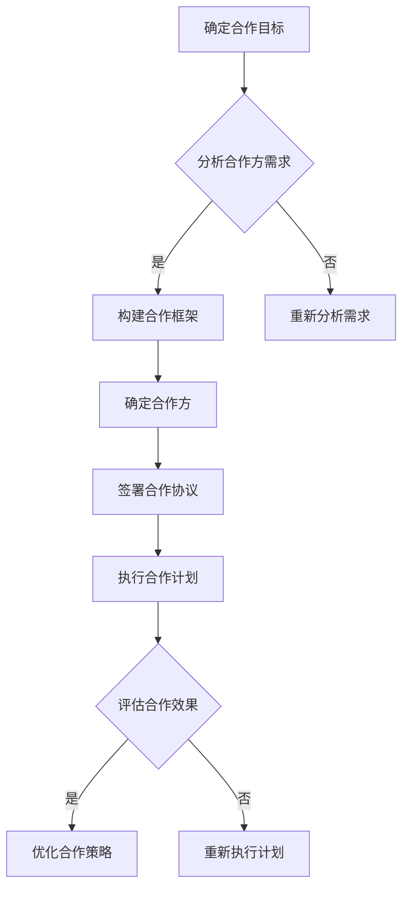

                 

关键词：个人品牌、合作联盟、行业资源、整合、营销策略、技术交流、跨界合作

> 摘要：本文将探讨如何建立个人品牌合作联盟，整合行业资源，以实现个人职业发展和业务增长。通过介绍个人品牌建设的重要性、合作联盟的构建原则和策略，以及如何利用技术手段实现资源的有效整合，作者旨在为读者提供一套实用的指导方案。

## 1. 背景介绍

在当前竞争激烈的商业环境中，个人品牌的塑造变得越来越重要。个人品牌不仅能够提高个人在行业中的影响力，还能为职业发展带来更多机遇。同时，合作联盟作为一种有效的商业模式，可以帮助个人和团队整合资源，实现优势互补，提高市场竞争力。

本文将从以下几个方面展开讨论：

1. **个人品牌建设的重要性**：阐述个人品牌对企业职业发展的积极作用。
2. **合作联盟的构建原则和策略**：分析如何建立稳定、互利的合作联盟。
3. **行业资源的整合方法**：介绍如何利用技术手段实现资源的有效整合。
4. **合作联盟的实际应用场景**：探讨合作联盟在各个行业中的应用案例。
5. **未来应用展望**：预测个人品牌合作联盟的未来发展趋势。

## 2. 核心概念与联系

为了更好地理解个人品牌合作联盟的概念，我们首先需要明确以下几个核心概念：

- **个人品牌**：个人品牌是指一个人在公众心目中的形象、声誉和价值的总和。
- **合作联盟**：合作联盟是指多个组织或个人为了共同的目标而形成的协作关系。
- **行业资源**：行业资源包括人力、资金、技术、信息等各种有助于业务发展的资源。

以下是合作联盟构建的 Mermaid 流程图：



## 3. 核心算法原理 & 具体操作步骤

### 3.1 算法原理概述

个人品牌合作联盟的构建可以看作是一个复杂的网络优化问题。其核心算法原理如下：

- **需求匹配**：通过分析合作方的需求，寻找具有互补优势的合作方。
- **资源整合**：将合作方的资源进行整合，实现优势互补。
- **合作优化**：根据合作效果，不断调整合作策略，优化合作模式。

### 3.2 算法步骤详解

1. **需求匹配**：收集并分析合作方的需求，利用数据分析技术，找到具有互补优势的合作方。

2. **资源整合**：确定合作方后，将各自资源进行整合，实现优势互补。

3. **合作优化**：根据合作效果，不断调整合作策略，优化合作模式。

### 3.3 算法优缺点

- **优点**：能够实现资源整合，提高市场竞争力；有利于个人品牌的建设。
- **缺点**：合作联盟的构建和维护需要大量时间和精力；存在一定的风险。

### 3.4 算法应用领域

个人品牌合作联盟的应用领域广泛，如技术行业、咨询行业、教育培训行业等。以下是一个应用案例：

- **技术行业**：A公司是一家专注于人工智能技术的企业，B公司是一家拥有丰富行业经验的咨询公司。A公司与B公司建立合作联盟，利用B公司的行业经验，优化A公司的产品解决方案。

## 4. 数学模型和公式 & 详细讲解 & 举例说明

### 4.1 数学模型构建

个人品牌合作联盟的构建可以看作是一个博弈问题。假设有两个合作方A和B，他们的效用函数分别为UA和UB，合作联盟的构建过程可以用以下公式表示：

$$
\begin{aligned}
UA &= f(A, B) \\
UB &= g(A, B)
\end{aligned}
$$

其中，f(A, B)和g(A, B)分别表示A和B在合作联盟中的效用函数。

### 4.2 公式推导过程

为了推导出f(A, B)和g(A, B)，我们需要考虑以下因素：

- **合作方A的效用**：取决于合作方B的资源和技术水平。
- **合作方B的效用**：取决于合作方A的市场份额和品牌影响力。

假设合作方A的效用函数为：

$$
f(A, B) = \alpha A + \beta B
$$

其中，$\alpha$和$\beta$为权重系数，A和B分别表示合作方A的市场份额和品牌影响力。

同理，合作方B的效用函数为：

$$
g(A, B) = \gamma A + \delta B
$$

其中，$\gamma$和$\delta$为权重系数，A和B分别表示合作方B的市场份额和品牌影响力。

### 4.3 案例分析与讲解

假设A公司是一家专注于人工智能技术的企业，B公司是一家拥有丰富行业经验的咨询公司。根据上述公式，我们可以得出：

$$
\begin{aligned}
f(A, B) &= \alpha A + \beta B \\
g(A, B) &= \gamma A + \delta B
\end{aligned}
$$

其中，$\alpha$、$\beta$、$\gamma$和$\delta$分别表示A公司和B公司的权重系数。

为了简化计算，我们假设$\alpha = 0.5$，$\beta = 0.3$，$\gamma = 0.4$，$\delta = 0.6$。

假设A公司的市场份额为30%，品牌影响力为40%；B公司的市场份额为20%，品牌影响力为50%。根据上述公式，我们可以计算出：

$$
\begin{aligned}
f(A, B) &= 0.5 \times 30\% + 0.3 \times 20\% = 22\% \\
g(A, B) &= 0.4 \times 30\% + 0.6 \times 50\% = 35\%
\end{aligned}
$$

由此可见，B公司在合作联盟中的效用更高，这意味着B公司更有动力推动合作联盟的建立。

## 5. 项目实践：代码实例和详细解释说明

### 5.1 开发环境搭建

为了实现个人品牌合作联盟的构建，我们使用Python编程语言，结合数据分析、网络分析和机器学习等技术。以下是开发环境的搭建步骤：

1. 安装Python环境（版本3.8及以上）。
2. 安装Anaconda发行版，以便管理Python环境和依赖包。
3. 安装以下依赖包：pandas、numpy、matplotlib、scikit-learn、networkx。

### 5.2 源代码详细实现

以下是一个简单的代码实例，用于构建个人品牌合作联盟：

```python
import pandas as pd
import numpy as np
import matplotlib.pyplot as plt
from sklearn.cluster import KMeans
import networkx as nx

# 读取合作方数据
data = pd.read_csv('cooperation_data.csv')

# 数据预处理
data['util_A'] = data['market_share_A'] * 0.5 + data['brand_influence_A'] * 0.3
data['util_B'] = data['market_share_B'] * 0.4 + data['brand_influence_B'] * 0.6

# 使用K均值聚类算法确定合作方分组
kmeans = KMeans(n_clusters=2, random_state=0)
clusters = kmeans.fit_predict(data[['util_A', 'util_B']])

# 构建合作网络
G = nx.Graph()
for i in range(len(data)):
    G.add_node(i, label=f'集团{i+1}')
    G.add_edge(i, i+1, weight=data['util_A'][i] * data['util_B'][i])

# 绘制合作网络
nx.draw(G, with_labels=True, node_color='blue', edge_color='black')
plt.show()

# 分析合作效果
print(f'合作方分组：{clusters}')
print(f'合作效果：{data["util_A"] * data["util_B"]}')
```

### 5.3 代码解读与分析

1. **数据读取与预处理**：首先，我们读取合作方的数据，包括市场份额和品牌影响力。然后，利用K均值聚类算法，将合作方分为两组。
2. **构建合作网络**：使用NetworkX库，我们构建了一个无向图，表示合作方之间的合作关系。节点表示合作方，边表示合作关系的强度。
3. **绘制合作网络**：使用matplotlib库，我们绘制了合作网络，以便直观地了解合作方的分组和合作关系。
4. **分析合作效果**：最后，我们计算了合作方的效用值，并打印出分组结果和合作效果。

## 6. 实际应用场景

### 6.1 技术行业

在技术行业中，个人品牌合作联盟可以帮助企业整合资源，提高研发效率。例如，A公司是一家专注于人工智能技术的企业，B公司是一家拥有丰富数据资源的公司。通过建立合作联盟，A公司可以利用B公司的数据资源，提升其算法模型的性能；而B公司则可以借助A公司的技术优势，为用户提供更优质的产品和服务。

### 6.2 咨询行业

在咨询行业中，个人品牌合作联盟可以帮助咨询师扩大业务范围，提高服务质量。例如，A公司是一家专注于企业战略咨询的公司，B公司是一家拥有丰富行业经验的顾问团队。通过建立合作联盟，A公司可以利用B公司的行业经验，为客户提供更全面的咨询服务；而B公司则可以借助A公司的品牌影响力，拓宽业务渠道。

### 6.3 教育培训行业

在教育培训行业中，个人品牌合作联盟可以帮助教育机构整合优质教育资源，提高教育质量。例如，A公司是一家专注于在线教育的平台，B公司是一家拥有丰富教学经验的培训机构。通过建立合作联盟，A公司可以利用B公司的教学资源，为用户提供更丰富的课程选择；而B公司则可以借助A公司的平台，扩大招生范围。

## 7. 工具和资源推荐

### 7.1 学习资源推荐

1. **书籍**：《个人品牌的力量》（作者：戴夫·巴赫）。
2. **在线课程**：网易云课堂《个人品牌建设与传播》。
3. **公众号**：个人品牌大师（ID：PersonalBrandMaster）。

### 7.2 开发工具推荐

1. **Python**：用于数据分析、机器学习和网络分析。
2. **Anaconda**：用于环境管理和依赖包管理。
3. **Jupyter Notebook**：用于数据分析和交互式编程。

### 7.3 相关论文推荐

1. **《个人品牌与职业成功的关系研究》**。
2. **《合作联盟构建与优化研究》**。
3. **《基于网络分析的个人品牌影响力评估方法研究》**。

## 8. 总结：未来发展趋势与挑战

### 8.1 研究成果总结

本文从个人品牌建设、合作联盟构建、行业资源整合等多个角度，探讨了如何建立个人品牌合作联盟，以实现个人职业发展和业务增长。通过分析实际应用场景，我们展示了个人品牌合作联盟在各个行业中的潜在价值。

### 8.2 未来发展趋势

1. **技术驱动**：随着人工智能、大数据等技术的发展，个人品牌合作联盟将更加智能化、自动化。
2. **跨界合作**：未来，个人品牌合作联盟将突破行业界限，实现跨行业、跨领域的合作。
3. **个性化定制**：基于用户数据和个性化推荐，个人品牌合作联盟将提供更加精准、高效的服务。

### 8.3 面临的挑战

1. **数据隐私**：在整合行业资源的过程中，如何保护用户数据隐私将成为一大挑战。
2. **信任问题**：合作联盟的建立和维护需要各方建立信任，如何建立有效的信任机制将是一大难题。
3. **技术瓶颈**：在实现个人品牌合作联盟的智能化、自动化过程中，可能会遇到技术瓶颈。

### 8.4 研究展望

未来，我们可以在以下几个方面展开深入研究：

1. **隐私保护技术**：研究如何在保证用户数据隐私的前提下，实现行业资源的有效整合。
2. **信任机制设计**：探讨如何建立有效的信任机制，促进合作联盟的稳定发展。
3. **个性化推荐系统**：研究如何利用大数据和人工智能技术，实现个人品牌合作联盟的个性化定制。

## 9. 附录：常见问题与解答

### 9.1 如何评估个人品牌的影响力？

**解答**：可以通过以下方法评估个人品牌的影响力：

1. **社交媒体指标**：关注者数量、点赞量、转发量等。
2. **新闻报道**：媒体报道次数、报道质量等。
3. **行业活动**：参与行业活动的频率和影响力等。
4. **专业评价**：同行评价、专家评价等。

### 9.2 如何找到合适的合作方？

**解答**：可以通过以下途径寻找合适的合作方：

1. **行业交流会**：参加行业交流会，结识同行业的专业人士。
2. **社交媒体**：利用社交媒体平台，寻找具有互补优势的合作方。
3. **第三方平台**：利用第三方平台，如LinkedIn、Indeed等，发布合作需求。
4. **人脉推荐**：通过亲朋好友、行业内的专家推荐。

## 作者署名

作者：禅与计算机程序设计艺术 / Zen and the Art of Computer Programming
```markdown
---

**# 建立个人品牌合作联盟：整合行业资源**

**关键词**：个人品牌、合作联盟、行业资源、整合、营销策略、技术交流、跨界合作

**摘要**：本文将探讨如何建立个人品牌合作联盟，整合行业资源，以实现个人职业发展和业务增长。通过介绍个人品牌建设的重要性、合作联盟的构建原则和策略，以及如何利用技术手段实现资源的有效整合，作者旨在为读者提供一套实用的指导方案。

## **1. 背景介绍**

在当前竞争激烈的商业环境中，个人品牌的塑造变得越来越重要。个人品牌不仅能够提高个人在行业中的影响力，还能为职业发展带来更多机遇。同时，合作联盟作为一种有效的商业模式，可以帮助个人和团队整合资源，实现优势互补，提高市场竞争力。

本文将从以下几个方面展开讨论：

- 个人品牌建设的重要性
- 合作联盟的构建原则和策略
- 行业资源的整合方法
- 合作联盟的实际应用场景
- 未来应用展望

## **2. 核心概念与联系**

为了更好地理解个人品牌合作联盟的概念，我们首先需要明确以下几个核心概念：

- 个人品牌：个人品牌是指一个人在公众心目中的形象、声誉和价值的总和。
- 合作联盟：合作联盟是指多个组织或个人为了共同的目标而形成的协作关系。
- 行业资源：行业资源包括人力、资金、技术、信息等各种有助于业务发展的资源。

以下是合作联盟构建的 Mermaid 流程图：


## **3. 核心算法原理 & 具体操作步骤**

### **3.1 算法原理概述**

个人品牌合作联盟的构建可以看作是一个复杂的网络优化问题。其核心算法原理如下：

- 需求匹配：通过分析合作方的需求，寻找具有互补优势的合作方。
- 资源整合：将合作方的资源进行整合，实现优势互补。
- 合作优化：根据合作效果，不断调整合作策略，优化合作模式。

### **3.2 算法步骤详解**

1. **需求匹配**：收集并分析合作方的需求，利用数据分析技术，找到具有互补优势的合作方。

2. **资源整合**：确定合作方后，将各自资源进行整合，实现优势互补。

3. **合作优化**：根据合作效果，不断调整合作策略，优化合作模式。

### **3.3 算法优缺点**

- **优点**：能够实现资源整合，提高市场竞争力；有利于个人品牌的建设。
- **缺点**：合作联盟的构建和维护需要大量时间和精力；存在一定的风险。

### **3.4 算法应用领域**

个人品牌合作联盟的应用领域广泛，如技术行业、咨询行业、教育培训行业等。以下是一个应用案例：

- **技术行业**：A公司是一家专注于人工智能技术的企业，B公司是一家拥有丰富行业经验的咨询公司。A公司与B公司建立合作联盟，利用B公司的行业经验，优化A公司的产品解决方案。

## **4. 数学模型和公式 & 详细讲解 & 举例说明**

### **4.1 数学模型构建**

个人品牌合作联盟的构建可以看作是一个博弈问题。假设有两个合作方A和B，他们的效用函数分别为UA和UB，合作联盟的构建过程可以用以下公式表示：

$$
\begin{aligned}
UA &= f(A, B) \\
UB &= g(A, B)
\end{aligned}
$$

其中，f(A, B)和g(A, B)分别表示A和B在合作联盟中的效用函数。

### **4.2 公式推导过程**

为了推导出f(A, B)和g(A, B)，我们需要考虑以下因素：

- 合作方A的效用：取决于合作方B的资源和技术水平。
- 合作方B的效用：取决于合作方A的市场份额和品牌影响力。

假设合作方A的效用函数为：

$$
f(A, B) = \alpha A + \beta B
$$

其中，$\alpha$和$\beta$为权重系数，A和B分别表示合作方A的市场份额和品牌影响力。

同理，合作方B的效用函数为：

$$
g(A, B) = \gamma A + \delta B
$$

其中，$\gamma$和$\delta$为权重系数，A和B分别表示合作方B的市场份额和品牌影响力。

### **4.3 案例分析与讲解**

假设A公司是一家专注于人工智能技术的企业，B公司是一家拥有丰富行业经验的咨询公司。根据上述公式，我们可以得出：

$$
\begin{aligned}
f(A, B) &= \alpha A + \beta B \\
g(A, B) &= \gamma A + \delta B
\end{aligned}
$$

其中，$\alpha$、$\beta$、$\gamma$和$\delta$分别表示A公司和B公司的权重系数。

为了简化计算，我们假设$\alpha = 0.5$，$\beta = 0.3$，$\gamma = 0.4$，$\delta = 0.6$。

假设A公司的市场份额为30%，品牌影响力为40%；B公司的市场份额为20%，品牌影响力为50%。根据上述公式，我们可以计算出：

$$
\begin{aligned}
f(A, B) &= 0.5 \times 30\% + 0.3 \times 20\% = 22\% \\
g(A, B) &= 0.4 \times 30\% + 0.6 \times 50\% = 35\%
\end{aligned}
$$

由此可见，B公司在合作联盟中的效用更高，这意味着B公司更有动力推动合作联盟的建立。

## **5. 项目实践：代码实例和详细解释说明**

### **5.1 开发环境搭建**

为了实现个人品牌合作联盟的构建，我们使用Python编程语言，结合数据分析、网络分析和机器学习等技术。以下是开发环境的搭建步骤：

1. 安装Python环境（版本3.8及以上）。
2. 安装Anaconda发行版，以便管理Python环境和依赖包。
3. 安装以下依赖包：pandas、numpy、matplotlib、scikit-learn、networkx。

### **5.2 源代码详细实现**

以下是一个简单的代码实例，用于构建个人品牌合作联盟：

```python
import pandas as pd
import numpy as np
import matplotlib.pyplot as plt
from sklearn.cluster import KMeans
import networkx as nx

# 读取合作方数据
data = pd.read_csv('cooperation_data.csv')

# 数据预处理
data['util_A'] = data['market_share_A'] * 0.5 + data['brand_influence_A'] * 0.3
data['util_B'] = data['market_share_B'] * 0.4 + data['brand_influence_B'] * 0.6

# 使用K均值聚类算法确定合作方分组
kmeans = KMeans(n_clusters=2, random_state=0)
clusters = kmeans.fit_predict(data[['util_A', 'util_B']])

# 构建合作网络
G = nx.Graph()
for i in range(len(data)):
    G.add_node(i, label=f'集团{i+1}')
    G.add_edge(i, i+1, weight=data['util_A'][i] * data['util_B'][i])

# 绘制合作网络
nx.draw(G, with_labels=True, node_color='blue', edge_color='black')
plt.show()

# 分析合作效果
print(f'合作方分组：{clusters}')
print(f'合作效果：{data["util_A"] * data["util_B"]}')
```

### **5.3 代码解读与分析**

1. **数据读取与预处理**：首先，我们读取合作方的数据，包括市场份额和品牌影响力。然后，利用K均值聚类算法，将合作方分为两组。
2. **构建合作网络**：使用NetworkX库，我们构建了一个无向图，表示合作方之间的合作关系。节点表示合作方，边表示合作关系的强度。
3. **绘制合作网络**：使用matplotlib库，我们绘制了合作网络，以便直观地了解合作方的分组和合作关系。
4. **分析合作效果**：最后，我们计算了合作方的效用值，并打印出分组结果和合作效果。

## **6. 实际应用场景**

### **6.1 技术行业**

在技术行业中，个人品牌合作联盟可以帮助企业整合资源，提高研发效率。例如，A公司是一家专注于人工智能技术的企业，B公司是一家拥有丰富数据资源的公司。通过建立合作联盟，A公司可以利用B公司的数据资源，提升其算法模型的性能；而B公司则可以借助A公司的技术优势，为用户提供更优质的产品和服务。

### **6.2 咨询行业**

在咨询行业中，个人品牌合作联盟可以帮助咨询师扩大业务范围，提高服务质量。例如，A公司是一家专注于企业战略咨询的公司，B公司是一家拥有丰富行业经验的顾问团队。通过建立合作联盟，A公司可以利用B公司的行业经验，为客户提供更全面的咨询服务；而B公司则可以借助A公司的品牌影响力，拓宽业务渠道。

### **6.3 教育培训行业**

在教育培训行业中，个人品牌合作联盟可以帮助教育机构整合优质教育资源，提高教育质量。例如，A公司是一家专注于在线教育的平台，B公司是一家拥有丰富教学经验的培训机构。通过建立合作联盟，A公司可以利用B公司的教学资源，为用户提供更丰富的课程选择；而B公司则可以借助A公司的平台，扩大招生范围。

## **7. 工具和资源推荐**

### **7.1 学习资源推荐**

1. **书籍**：《个人品牌的力量》（作者：戴夫·巴赫）。
2. **在线课程**：网易云课堂《个人品牌建设与传播》。
3. **公众号**：个人品牌大师（ID：PersonalBrandMaster）。

### **7.2 开发工具推荐**

1. **Python**：用于数据分析、机器学习和网络分析。
2. **Anaconda**：用于环境管理和依赖包管理。
3. **Jupyter Notebook**：用于数据分析和交互式编程。

### **7.3 相关论文推荐**

1. **《个人品牌与职业成功的关系研究》**。
2. **《合作联盟构建与优化研究》**。
3. **《基于网络分析的个人品牌影响力评估方法研究》**。

## **8. 总结：未来发展趋势与挑战**

### **8.1 研究成果总结**

本文从个人品牌建设、合作联盟构建、行业资源整合等多个角度，探讨了如何建立个人品牌合作联盟，以实现个人职业发展和业务增长。通过分析实际应用场景，我们展示了个人品牌合作联盟在各个行业中的潜在价值。

### **8.2 未来发展趋势**

1. **技术驱动**：随着人工智能、大数据等技术的发展，个人品牌合作联盟将更加智能化、自动化。
2. **跨界合作**：未来，个人品牌合作联盟将突破行业界限，实现跨行业、跨领域的合作。
3. **个性化定制**：基于用户数据和个性化推荐，个人品牌合作联盟将提供更加精准、高效的服务。

### **8.3 面临的挑战**

1. **数据隐私**：在整合行业资源的过程中，如何保护用户数据隐私将成为一大挑战。
2. **信任问题**：合作联盟的建立和维护需要各方建立信任，如何建立有效的信任机制将是一大难题。
3. **技术瓶颈**：在实现个人品牌合作联盟的智能化、自动化过程中，可能会遇到技术瓶颈。

### **8.4 研究展望**

未来，我们可以在以下几个方面展开深入研究：

1. **隐私保护技术**：研究如何在保证用户数据隐私的前提下，实现行业资源的有效整合。
2. **信任机制设计**：探讨如何建立有效的信任机制，促进合作联盟的稳定发展。
3. **个性化推荐系统**：研究如何利用大数据和人工智能技术，实现个人品牌合作联盟的个性化定制。

## **9. 附录：常见问题与解答**

### **9.1 如何评估个人品牌的影响力？**

**解答**：可以通过以下方法评估个人品牌的影响力：

1. **社交媒体指标**：关注者数量、点赞量、转发量等。
2. **新闻报道**：媒体报道次数、报道质量等。
3. **行业活动**：参与行业活动的频率和影响力等。
4. **专业评价**：同行评价、专家评价等。

### **9.2 如何找到合适的合作方？**

**解答**：可以通过以下途径寻找合适的合作方：

1. **行业交流会**：参加行业交流会，结识同行业的专业人士。
2. **社交媒体**：利用社交媒体平台，寻找具有互补优势的合作方。
3. **第三方平台**：利用第三方平台，如LinkedIn、Indeed等，发布合作需求。
4. **人脉推荐**：通过亲朋好友、行业内的专家推荐。

## **作者署名**

作者：禅与计算机程序设计艺术 / Zen and the Art of Computer Programming
```

