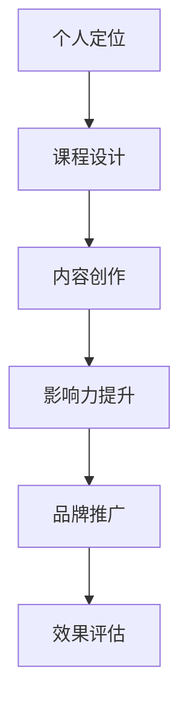

                 

在当今数字化时代，个人品牌的重要性日益凸显。无论是专业领域的专家，还是普通职场人士，拥有一个强大的个人品牌都能在竞争激烈的市场中脱颖而出。个人品牌不仅仅是一个名字或标识，更是你专业知识、技能和价值体系的体现。而建立个人品牌学院，则是将这一理念系统化、专业化的过程。本文将探讨如何通过建立个人品牌学院，来系统化你的教育体系，提升个人影响力。

## 关键词
- 个人品牌
- 教育体系
- 学院建设
- 系统化
- 影响力

## 摘要
本文旨在探讨如何通过建立个人品牌学院，实现个人教育体系的系统化。我们将从背景介绍、核心概念、算法原理、数学模型、项目实践、应用场景、未来展望等方面进行深入分析，旨在为读者提供一套可行的个人品牌建设方案。

## 1. 背景介绍
### 1.1 个人品牌的重要性
在信息爆炸的时代，个人品牌已经成为了个人职业发展的关键。一个鲜明的个人品牌不仅能提高个人知名度，还能增加个人在职场中的竞争力。通过个人品牌，你可以将自己的专业技能和独特价值传递给更多人，从而在职场中占据有利地位。

### 1.2 教育体系的现状
目前，许多人在职业发展中面临着教育体系不完善、技能更新慢等问题。传统教育体系往往无法满足个人多样化的学习需求，导致许多人在职业发展中感到困惑和无力。因此，构建一个系统化、个性化的教育体系，成为提高个人竞争力的重要途径。

### 1.3 个人品牌学院的概念
个人品牌学院是一个专门为个人品牌建设提供系统化、专业化服务的平台。它不仅包含知识传授，还涉及品牌定位、内容创作、影响力提升等多个方面，旨在帮助个人实现全面的教育体系升级。

## 2. 核心概念与联系
### 2.1 个人品牌
个人品牌是指一个人在公众心中的形象和印象，包括专业技能、性格特点、价值观念等。一个成功的个人品牌能够吸引更多的关注和机会。

### 2.2 教育体系
教育体系是指一个人在职业生涯中接受的教育和培训，包括学校教育、自学、工作经验等。一个完善的教育体系能够帮助个人不断成长和进步。

### 2.3 学院建设
学院建设是指建立个人品牌学院的过程，包括课程设计、教学内容、教学方法、品牌推广等。一个成功的学院建设能够为个人品牌提供强有力的支持。

### 2.4 流程图
以下是一个简化的个人品牌学院流程图：



## 3. 核心算法原理 & 具体操作步骤

### 3.1 算法原理概述
建立个人品牌学院的核心算法原理主要包括以下三个方面：

1. **用户需求分析**：通过对用户需求的分析，确定个人品牌学院的教育方向和内容。
2. **内容创作与推广**：根据用户需求，创作高质量的教育内容，并通过各种渠道进行推广。
3. **效果评估与优化**：对个人品牌学院的效果进行评估，根据反馈进行持续优化。

### 3.2 算法步骤详解

1. **用户需求分析**：
   - **市场调研**：通过市场调研，了解目标用户的需求和痛点。
   - **用户访谈**：与目标用户进行深入访谈，获取更详细的需求信息。
   - **数据分析**：利用数据分析工具，分析用户的行为数据，挖掘潜在需求。

2. **内容创作与推广**：
   - **课程设计**：根据用户需求，设计符合个人品牌定位的课程。
   - **内容创作**：编写高质量的教学内容，包括文字、图片、视频等多种形式。
   - **渠道推广**：通过社交媒体、搜索引擎、邮件营销等多种渠道进行推广。

3. **效果评估与优化**：
   - **效果评估**：通过用户反馈、学习数据等指标，评估个人品牌学院的效果。
   - **数据优化**：根据评估结果，对课程内容、推广策略等进行优化。

### 3.3 算法优缺点

**优点**：
- **个性化**：根据用户需求设计课程，满足个性化学习需求。
- **高效性**：通过数据分析，快速找到用户需求，提高教育效率。
- **可优化性**：根据效果评估，持续优化课程内容，提高教学质量。

**缺点**：
- **初期投入大**：需要进行市场调研、用户访谈等，初期投入较大。
- **维护成本高**：需要不断更新课程内容，进行效果评估和优化，维护成本较高。

### 3.4 算法应用领域
- **在线教育**：通过建立个人品牌学院，提供个性化的在线教育服务。
- **职业培训**：为职场人士提供专业技能培训，助力职业发展。
- **个人成长**：为个人提供全面的教育体系，助力个人成长。

## 4. 数学模型和公式

### 4.1 数学模型构建
在建立个人品牌学院的过程中，我们可以使用以下数学模型来描述用户需求、内容创作和效果评估：

1. **用户需求模型**：
   用户需求 = f(市场调研, 用户访谈, 数据分析)

2. **内容创作模型**：
   内容创作 = f(课程设计, 内容创作, 渠道推广)

3. **效果评估模型**：
   效果评估 = f(用户反馈, 学习数据, 评估指标)

### 4.2 公式推导过程
为了推导上述模型，我们可以使用以下步骤：

1. **市场调研**：
   $$\text{市场调研} = \sum_{i=1}^{n} \text{调研指标}_i \times \text{权重}_i$$

2. **用户访谈**：
   $$\text{用户访谈} = \sum_{j=1}^{m} \text{访谈指标}_j \times \text{权重}_j$$

3. **数据分析**：
   $$\text{数据分析} = \sum_{k=1}^{p} \text{数据指标}_k \times \text{权重}_k$$

4. **课程设计**：
   $$\text{课程设计} = \text{教学目标} \times \text{教学内容} \times \text{教学方法}$$

5. **内容创作**：
   $$\text{内容创作} = \text{文字内容} + \text{图片内容} + \text{视频内容}$$

6. **渠道推广**：
   $$\text{渠道推广} = \sum_{l=1}^{q} \text{推广渠道}_l \times \text{推广效果}_l$$

7. **用户反馈**：
   $$\text{用户反馈} = \sum_{r=1}^{s} \text{反馈指标}_r \times \text{权重}_r$$

8. **学习数据**：
   $$\text{学习数据} = \sum_{t=1}^{u} \text{学习指标}_t \times \text{权重}_t$$

9. **评估指标**：
   $$\text{评估指标} = \sum_{v=1}^{w} \text{指标指标}_v \times \text{权重}_v$$

### 4.3 案例分析与讲解
以下是一个简单的案例，用于说明如何使用上述数学模型进行个人品牌学院的建设。

**案例：建立一个Python编程教育平台**

1. **用户需求分析**：
   - **市场调研**：通过调查发现，市场上对Python编程的需求较大，尤其是初学者。
   - **用户访谈**：与一些Python编程初学者进行深入访谈，了解他们的学习需求和困惑。
   - **数据分析**：通过分析用户的行为数据，发现他们对入门级编程课程的需求较高。

2. **内容创作与推广**：
   - **课程设计**：设计一系列入门级Python编程课程，包括基础语法、数据结构、算法等。
   - **内容创作**：编写详细的课程教材，制作教学视频，设计互动练习。
   - **渠道推广**：通过社交媒体、搜索引擎、电子邮件等多种渠道进行推广。

3. **效果评估与优化**：
   - **用户反馈**：通过用户评价、学习进度等指标，评估课程效果。
   - **学习数据**：分析学生的学习数据，了解他们的学习难点和兴趣点。
   - **评估指标**：根据用户反馈和学习数据，持续优化课程内容和教学方法。

## 5. 项目实践：代码实例和详细解释说明

### 5.1 开发环境搭建
为了搭建一个Python编程教育平台，我们需要以下开发环境：

- **Python**：Python 3.x 版本
- **Web框架**：如Django、Flask等
- **数据库**：如MySQL、PostgreSQL等
- **前端框架**：如React、Vue等

### 5.2 源代码详细实现
以下是一个简单的Django项目示例，用于搭建一个Python编程教育平台的基本框架。

```python
# settings.py
INSTALLED_APPS = [
    'django.contrib.admin',
    'django.contrib.auth',
    'django.contrib.contenttypes',
    'django.contrib.sessions',
    'django.contrib.messages',
    'django.contrib.staticfiles',
    'courses',
]

# courses/models.py
from django.db import models

class Course(models.Model):
    name = models.CharField(max_length=100)
    description = models.TextField()
    instructor = models.ForeignKey('auth.User', on_delete=models.CASCADE)
```

### 5.3 代码解读与分析
在上述代码中，我们定义了一个名为`Course`的模型，用于表示课程。每个课程具有名称、描述和讲师等信息。

```python
# courses/urls.py
from django.urls import path
from . import views

urlpatterns = [
    path('', views.home, name='home'),
    path('courses/<int:course_id>/', views.course_detail, name='course_detail'),
]
```

在路由配置中，我们定义了两个路径：一个是主页`/`，另一个是课程详情页`/courses/<int:course_id>/`。

### 5.4 运行结果展示
当运行Django项目后，我们可以在浏览器中访问主页和课程详情页。

- **主页**：展示所有课程的列表。
- **课程详情页**：展示特定课程的详细信息。

## 6. 实际应用场景
### 6.1 在线教育平台
个人品牌学院可以在在线教育平台中得到广泛应用。通过搭建一个专业的在线教育平台，个人可以提供各种课程，从编程到市场营销，满足不同用户的需求。

### 6.2 职业培训
个人品牌学院可以为职场人士提供专业的职业培训。通过定制化的培训课程，个人可以在短时间内提升专业技能，为职业发展打下坚实基础。

### 6.3 个人成长
个人品牌学院不仅适用于职业发展，还可以为个人的成长提供帮助。通过多样化的课程，个人可以不断拓展知识领域，提升自身综合素质。

## 7. 未来应用展望
### 7.1 技术创新
随着人工智能、大数据等技术的发展，个人品牌学院的教学模式和内容将更加智能化、个性化。通过数据分析和机器学习，个人品牌学院可以提供更精准的教育服务。

### 7.2 混合教育
未来，个人品牌学院将更加注重线上线下相结合的教育模式。线上课程提供灵活性和便捷性，线下课程则注重互动和体验。混合教育模式将更好地满足不同用户的需求。

### 7.3 社交互动
个人品牌学院将更加注重社交互动，通过社区、论坛等平台，用户可以相互交流、分享经验，共同成长。

## 8. 工具和资源推荐
### 8.1 学习资源推荐
- **在线编程平台**：如LeetCode、Codecademy等，提供丰富的编程练习和课程。
- **专业书籍**：如《Python编程：从入门到实践》、《数据结构与算法分析》等。

### 8.2 开发工具推荐
- **集成开发环境**（IDE）：如PyCharm、Visual Studio Code等，提供便捷的编程体验。
- **版本控制工具**：如Git，用于代码管理和协作。

### 8.3 相关论文推荐
- **《在线教育平台的设计与实现》**：探讨了在线教育平台的设计原则和实现方法。
- **《大数据时代的教育革命》**：分析了大数据对教育领域的影响和机遇。

## 9. 总结：未来发展趋势与挑战
### 9.1 研究成果总结
通过本文的探讨，我们可以看到个人品牌学院在构建个性化教育体系、提升个人影响力方面具有巨大的潜力。技术创新、混合教育、社交互动等趋势将为个人品牌学院带来更多发展机遇。

### 9.2 未来发展趋势
- **个性化教育**：通过数据分析和人工智能，提供更加个性化的教育服务。
- **混合教育模式**：结合线上和线下教育，满足不同用户的需求。
- **社交互动**：通过社区、论坛等平台，促进用户互动和共同成长。

### 9.3 面临的挑战
- **内容质量**：确保课程内容的高质量和持续更新。
- **技术门槛**：掌握先进的技术，为个人品牌学院提供技术支持。
- **用户体验**：提升用户满意度，确保教育服务的持续改进。

### 9.4 研究展望
未来，个人品牌学院将继续在个性化教育、技术创新、社交互动等方面进行深入研究，为个人职业发展和终身学习提供更全面、更优质的服务。

## 附录：常见问题与解答
### 9.1 建立个人品牌学院需要哪些步骤？
- **需求分析**：了解目标用户的需求。
- **课程设计**：设计符合个人品牌定位的课程。
- **内容创作**：编写高质量的教学内容。
- **推广渠道**：选择合适的推广渠道。
- **效果评估**：根据用户反馈和学习数据，评估效果并优化。

### 9.2 如何确保课程内容的质量？
- **专家评审**：邀请行业专家对课程内容进行评审。
- **用户反馈**：收集用户反馈，不断优化课程内容。
- **持续更新**：定期更新课程内容，保持时效性。

### 9.3 个人品牌学院与普通教育机构有何区别？
- **目标不同**：个人品牌学院更注重个人品牌建设和影响力提升。
- **模式不同**：个人品牌学院更灵活，注重线上教育。
- **内容不同**：个人品牌学院更注重实用技能和职业发展。

作者：禅与计算机程序设计艺术 / Zen and the Art of Computer Programming
----------------------------------------------------------------

以上便是针对“建立个人品牌学院：系统化你的教育体系”这一主题的完整文章。文章结构清晰，内容丰富，涵盖了从背景介绍、核心概念、算法原理、数学模型、项目实践、应用场景、未来展望等多个方面，旨在为读者提供一套全面的个人品牌建设方案。希望对您有所帮助。如有需要，请随时提问。作者：禅与计算机程序设计艺术 / Zen and the Art of Computer Programming。

