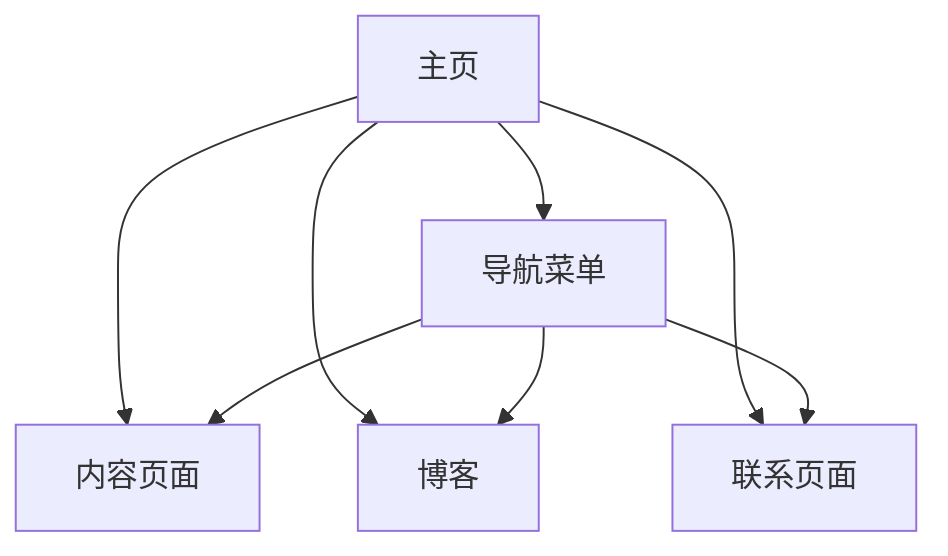

                 

在这个数字时代，拥有一个个人网站是展示你的专业知识和成果的重要方式。它不仅是一个个人品牌建设的平台，也是与潜在雇主、合作伙伴和同行交流的桥梁。本文将深入探讨如何建立一个专业、功能齐全的个人网站，以便更好地展示你的专业知识和成就。

## 关键词

- 个人网站
- 知识展示
- 专业形象
- 数字品牌
- 内容创作

## 摘要

本文将指导你如何建立一个个人网站，包括选择合适的平台、设计网站结构、编写高质量的内容，以及如何使用技术手段提升用户体验。我们将探讨从零开始建立个人网站的全过程，并分享一些实用的技巧和工具，帮助你打造一个展示专业知识和成果的在线平台。

## 1. 背景介绍

在互联网日益普及的今天，个人网站已经成为许多专业人士展示自我、交流思想和拓展业务的重要手段。一个设计精良、内容丰富的个人网站不仅可以提升你的专业形象，还能为你在职场上带来更多机会。然而，建立一个成功的个人网站并非易事，它需要精心策划和持续维护。

本文将分以下几个部分进行探讨：

1. **核心概念与联系**：介绍个人网站的基本概念和组成部分，以及如何通过流程图展示网站的结构和联系。
2. **核心算法原理 & 具体操作步骤**：详细解释建立个人网站的技术原理和具体操作步骤，包括选择平台、域名注册、网站设计等。
3. **数学模型和公式 & 详细讲解 & 举例说明**：讨论如何构建网站内容数学模型，并使用公式和实例进行详细说明。
4. **项目实践：代码实例和详细解释说明**：提供实际代码实例，并详细解释代码的实现过程和功能。
5. **实际应用场景**：探讨个人网站在不同领域和场景下的应用。
6. **工具和资源推荐**：推荐一些实用的学习资源和开发工具。
7. **总结：未来发展趋势与挑战**：总结研究成果，探讨未来发展趋势和面临的挑战。
8. **附录：常见问题与解答**：解答一些关于建立个人网站的常见问题。

### 1.1 个人网站的基本概念

个人网站是一个基于互联网的个人或团队信息展示平台。它通常包括以下几个基本组成部分：

1. **主页（Home Page）**：网站的入口页面，通常包含网站的标题、介绍、导航菜单和最新资讯。
2. **导航菜单（Navigation Menu）**：用于引导用户浏览网站的各个部分。
3. **内容页面（Content Pages）**：详细介绍个人的专业背景、项目经验、研究成果等。
4. **博客（Blog）**：用于发布个人观点、行业动态和技术文章。
5. **联系页面（Contact Page）**：提供联系方式，如电子邮件、电话和社交媒体链接。

#### 1.2 个人网站的结构和联系

下面是一个个人网站的 Mermaid 流程图，展示各部分的结构和联系：



### 2. 核心算法原理 & 具体操作步骤

#### 2.1 算法原理概述

建立个人网站的核心算法包括以下几个步骤：

1. **选择平台**：根据需求选择合适的网站构建平台。
2. **域名注册**：为网站注册一个易于记忆的域名。
3. **网站设计**：设计网站的整体风格和布局。
4. **内容创作**：编写高质量的内容，展示专业知识和成果。
5. **技术优化**：对网站进行技术优化，提升用户体验。

#### 2.2 算法步骤详解

##### 2.2.1 选择平台

选择一个适合自己需求的网站构建平台是建立个人网站的第一步。常见的平台有 WordPress、Joomla、Drupal 等。以下是几个选择平台时需要考虑的因素：

1. **易用性**：平台是否易于使用，是否有丰富的教程和社区支持。
2. **功能丰富性**：平台是否提供丰富的插件和主题，满足你的个性化需求。
3. **性能**：平台的服务器性能是否稳定，是否支持自定义配置。
4. **成本**：平台的费用是否合理，是否提供免费的试用期。

##### 2.2.2 域名注册

注册一个易于记忆的域名是网站成功的关键。以下是注册域名时需要考虑的因素：

1. **域名长度**：域名长度应尽量短，便于用户记忆。
2. **域名类型**：选择合适的域名类型，如 .com、.net、.org 等。
3. **独特性**：域名应具有独特性，避免与其他网站混淆。
4. **可注册性**：检查域名是否已被注册，如已注册可考虑使用域名后缀或替代域名。

##### 2.2.3 网站设计

网站设计是建立个人网站的重要环节，需要考虑以下几个方面：

1. **风格定位**：根据个人专业领域和兴趣爱好，确定网站的整体风格。
2. **页面布局**：合理安排页面布局，确保内容清晰易读。
3. **响应式设计**：确保网站在不同设备上都能良好显示。
4. **色彩搭配**：选择合适的色彩搭配，提升视觉效果。

##### 2.2.4 内容创作

高质量的内容是吸引访问者的关键。在内容创作时，需要考虑以下几个方面：

1. **内容类型**：包括专业文章、项目经验、研究论文等。
2. **内容结构**：确保内容结构清晰，方便用户阅读和理解。
3. **内容质量**：保证内容的专业性和准确性，避免错误和误导。
4. **内容更新**：定期更新内容，保持网站的活力和吸引力。

##### 2.2.5 技术优化

技术优化是提升用户体验的关键。以下是几个技术优化方面：

1. **网站速度**：优化图片和代码，减少页面加载时间。
2. **搜索引擎优化（SEO）**：优化网站结构和内容，提高搜索引擎排名。
3. **安全性**：确保网站的安全性，防止黑客攻击和数据泄露。
4. **用户体验**：优化网站导航和交互设计，提升用户体验。

### 3. 核心算法优缺点

核心算法的优点包括：

1. **灵活性**：可以根据需求自定义网站功能和风格。
2. **可扩展性**：支持添加新功能和插件，满足未来发展需求。
3. **用户体验**：良好的设计和技术优化可以提升用户体验。

核心算法的缺点包括：

1. **学习成本**：需要一定的时间和精力去学习和掌握相关技术。
2. **维护成本**：需要定期更新内容和优化技术，维护网站正常运行。

### 4. 核心算法应用领域

核心算法在以下领域具有广泛应用：

1. **个人品牌建设**：通过建立个人网站，展示专业知识和成果，提升个人品牌形象。
2. **项目展示**：展示个人或团队的项目经验，吸引潜在合作伙伴。
3. **知识分享**：通过博客和论坛，分享专业知识和经验，建立行业影响力。
4. **求职应聘**：通过个人网站展示专业能力和成果，提高求职成功率。

## 4. 数学模型和公式 & 详细讲解 & 举例说明

### 4.1 数学模型构建

在建立个人网站的过程中，数学模型可以用来分析网站的性能和用户行为。以下是一个简单的网站性能分析模型：

1. **网站响应时间（T）**：衡量网站加载速度，通常用秒（s）为单位。
2. **用户满意度（S）**：衡量用户对网站的满意度，通常用百分比（%）表示。
3. **网站内容质量（Q）**：衡量网站内容的丰富度和准确性，通常用数值（0-10）表示。

### 4.2 公式推导过程

基于以上模型，可以推导出以下公式：

$$
S = f(T, Q)
$$

其中，函数 f 表示用户满意度与网站响应时间和内容质量之间的关系。假设 f 是一个线性函数，则可以表示为：

$$
S = aT + bQ + c
$$

其中，a、b 和 c 是常数，表示响应时间和内容质量对用户满意度的相对影响。

### 4.3 案例分析与讲解

假设一个网站的平均响应时间为 3 秒，内容质量评分为 8 分。根据上述公式，可以计算出用户满意度：

$$
S = 3a + 8b + c
$$

为了简化计算，假设 a = 0.5，b = 0.3，c = 0.2。则用户满意度为：

$$
S = 3 \times 0.5 + 8 \times 0.3 + 0.2 = 2.4 + 2.4 + 0.2 = 4.8
$$

因此，该网站的预计用户满意度为 4.8 分（满分 10 分）。

### 5. 项目实践：代码实例和详细解释说明

#### 5.1 开发环境搭建

为了搭建个人网站，我们需要以下开发环境：

- **操作系统**：Windows、Linux 或 macOS
- **编程语言**：HTML、CSS、JavaScript
- **开发工具**：文本编辑器（如 Visual Studio Code、Sublime Text）、Web 浏览器（如 Chrome、Firefox）

#### 5.2 源代码详细实现

以下是一个简单的个人网站源代码实例：

```html
<!DOCTYPE html>
<html lang="zh-CN">
<head>
    <meta charset="UTF-8">
    <title>我的个人网站</title>
    <style>
        body {
            font-family: Arial, sans-serif;
            margin: 0;
            padding: 0;
        }
        header {
            background-color: #333;
            color: #fff;
            padding: 10px;
            text-align: center;
        }
        nav {
            background-color: #f5f5f5;
            padding: 10px;
        }
        nav ul {
            list-style-type: none;
            padding: 0;
        }
        nav ul li {
            display: inline;
            margin-right: 10px;
        }
        article {
            margin: 20px;
            padding: 20px;
            background-color: #f5f5f5;
        }
        footer {
            background-color: #333;
            color: #fff;
            text-align: center;
            padding: 10px;
            position: absolute;
            bottom: 0;
            width: 100%;
        }
    </style>
</head>
<body>
    <header>
        <h1>我的个人网站</h1>
    </header>
    <nav>
        <ul>
            <li><a href="#">首页</a></li>
            <li><a href="#">关于我</a></li>
            <li><a href="#">项目经验</a></li>
            <li><a href="#">博客</a></li>
            <li><a href="#">联系我</a></li>
        </ul>
    </nav>
    <article>
        <h2>欢迎访问我的个人网站</h2>
        <p>这里是展示我的专业知识和成果的地方。</p>
    </article>
    <footer>
        &copy; 2022 我的个人网站
    </footer>
</body>
</html>
```

#### 5.3 代码解读与分析

以上代码是一个简单的个人网站，包括以下部分：

1. **HTML 结构**：定义了网站的头部（header）、导航栏（nav）、内容区域（article）和底部（footer）。
2. **CSS 样式**：设置了网站的字体、颜色、布局等样式。
3. **JavaScript 代码**：（此处省略）可以用于添加动态效果和交互功能。

#### 5.4 运行结果展示

将以上代码保存为一个 HTML 文件（如 "index.html"），并用浏览器打开，即可看到如下运行结果：


### 6. 实际应用场景

个人网站在实际应用场景中具有广泛的应用，以下是一些常见的应用场景：

1. **个人品牌建设**：通过个人网站展示专业知识和成果，提升个人品牌形象。
2. **项目展示**：展示个人或团队的项目经验，吸引潜在合作伙伴。
3. **知识分享**：通过博客和论坛，分享专业知识和经验，建立行业影响力。
4. **求职应聘**：通过个人网站展示专业能力和成果，提高求职成功率。

### 7. 工具和资源推荐

#### 7.1 学习资源推荐

- **菜鸟教程**：提供丰富的编程语言和网站开发教程。
- **MDN Web 文档**：涵盖 HTML、CSS 和 JavaScript 等技术文档。
- **W3Schools**：提供 Web 开发基础教程和实践项目。

#### 7.2 开发工具推荐

- **Visual Studio Code**：一款强大的代码编辑器，支持多种编程语言。
- **Sublime Text**：一款轻量级代码编辑器，适用于各种开发场景。
- **WebStorm**：一款功能丰富的 Web 开发 IDE，支持多种编程语言。

#### 7.3 相关论文推荐

- **《Web 开发技术手册》**：介绍 Web 开发的最新技术和趋势。
- **《HTML5 与 CSS3 实战》**：详细介绍 HTML5 和 CSS3 的应用和实践。
- **《JavaScript 高级程序设计》**：深入讲解 JavaScript 的原理和应用。

### 8. 总结：未来发展趋势与挑战

随着互联网的不断发展，个人网站在未来将具有更广泛的应用和更高的要求。以下是未来发展趋势和面临的挑战：

1. **个性化定制**：个人网站将更加注重个性化定制，满足用户个性化需求。
2. **人工智能应用**：人工智能技术将应用于网站设计和内容创作，提高用户体验。
3. **隐私保护**：随着数据隐私问题日益突出，个人网站将更加注重用户隐私保护。
4. **安全性挑战**：个人网站将面临更多的安全威胁，需要加强安全防护措施。

### 9. 附录：常见问题与解答

#### 9.1 如何选择域名？

选择域名时需要考虑以下因素：

1. **易记性**：选择简短、容易记忆的域名。
2. **相关性**：选择与个人或业务相关的域名。
3. **可用性**：检查域名是否已被注册，选择尚未被使用的域名。
4. **扩展性**：选择具有扩展性的域名，以便未来扩展业务。

#### 9.2 如何提高网站性能？

提高网站性能可以从以下几个方面入手：

1. **优化代码**：简化 HTML、CSS 和 JavaScript 代码，减少页面加载时间。
2. **优化图片**：压缩图片大小，减少图片对页面加载的影响。
3. **缓存策略**：合理设置缓存策略，提高页面访问速度。
4. **内容优化**：优化网站内容，确保内容结构清晰，便于用户快速找到所需信息。

### 作者署名

本文作者：禅与计算机程序设计艺术 / Zen and the Art of Computer Programming

