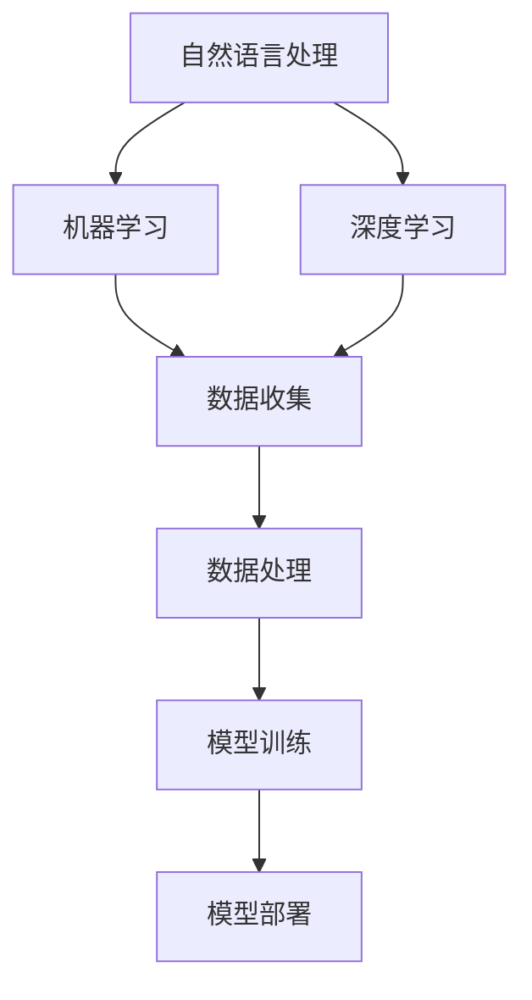

                 

在当今数字化时代，个人品牌的建设变得越来越重要。无论是在职场上还是在创业领域，拥有一个强大的个人品牌都能为你带来巨大的影响力。而AI助手作为一种新兴的技术，不仅可以提升个人品牌的影响力，还能提供智能化服务，为个人和团队带来更多的便利。本文将探讨如何开发个人品牌的AI助手，以及它如何为用户提供智能化服务。

## 文章关键词

- 个人品牌
- AI助手
- 智能化服务
- 数字化时代
- 技术应用

## 文章摘要

本文首先介绍了个人品牌的重要性，以及AI助手在个人品牌建设中的应用。接着，详细阐述了如何开发一个个人品牌的AI助手，包括核心概念、算法原理、数学模型、项目实践和实际应用场景。最后，对AI助手的未来应用前景进行了展望，并推荐了一些学习和开发资源。

## 1. 背景介绍

### 个人品牌的重要性

个人品牌是一种个人在公众心中的形象和认知。在数字化时代，个人品牌的重要性愈发凸显。一个强大的个人品牌不仅能提升个人的影响力，还能为个人带来更多的机会和资源。

- **提升影响力**：一个强大的个人品牌能够吸引更多的关注，使个人在职场和社交场合中脱颖而出。
- **拓展资源**：个人品牌能够吸引更多合作伙伴和投资者，为个人和团队带来更多的商业机会。
- **塑造形象**：良好的个人品牌有助于塑造个人形象，提高个人声誉。

### AI助手的发展和应用

AI助手是一种基于人工智能技术的智能服务系统，能够通过自然语言处理、机器学习等技术为用户提供智能化服务。随着技术的不断发展，AI助手的应用场景越来越广泛。

- **日常助手**：如智能语音助手、聊天机器人等，能够帮助用户处理日常事务，提高工作效率。
- **专业助手**：如金融领域的智能投顾、医疗领域的智能诊断等，能够为专业用户提供定制化服务。
- **营销助手**：如社交媒体分析、用户行为预测等，能够帮助企业提升营销效果。

## 2. 核心概念与联系

### AI助手的核心概念

AI助手的核心概念包括自然语言处理、机器学习、深度学习等。这些概念相互联系，共同构成了AI助手的技术基础。

- **自然语言处理（NLP）**：使计算机能够理解和处理人类语言的技术。
- **机器学习（ML）**：使计算机能够从数据中学习，并做出预测和决策的技术。
- **深度学习（DL）**：一种特殊的机器学习方法，通过多层神经网络模拟人类大脑的学习过程。

### AI助架构原理

AI助手的架构原理主要包括数据收集、数据处理、模型训练和模型部署等环节。

- **数据收集**：收集用户数据，包括语言数据、行为数据等。
- **数据处理**：对收集到的数据进行分析和清洗，为模型训练提供高质量的数据。
- **模型训练**：使用机器学习和深度学习算法训练模型，使其能够理解和处理用户需求。
- **模型部署**：将训练好的模型部署到线上服务器，为用户提供实时服务。

### Mermaid流程图

以下是一个简单的Mermaid流程图，展示了AI助手的核心概念和架构原理：



## 3. 核心算法原理 & 具体操作步骤

### 3.1 算法原理概述

AI助手的算法原理主要包括自然语言处理和机器学习。自然语言处理负责理解和解析用户的语言输入，而机器学习则负责根据用户的历史行为数据，预测用户的需求并给出相应的建议。

### 3.2 算法步骤详解

1. **数据收集**：收集用户的历史行为数据，包括语言输入、操作记录等。
2. **数据处理**：对收集到的数据进行清洗和预处理，包括去除噪音、填充缺失值等。
3. **特征提取**：从预处理后的数据中提取特征，为机器学习模型提供输入。
4. **模型训练**：使用机器学习算法，如决策树、支持向量机、神经网络等，训练模型。
5. **模型评估**：使用验证集评估模型的性能，调整模型参数。
6. **模型部署**：将训练好的模型部署到线上服务器，为用户提供实时服务。

### 3.3 算法优缺点

**优点**：

- **高效性**：AI助手能够快速处理大量数据，提供实时服务。
- **个性化**：根据用户的历史行为数据，为用户提供定制化的建议和推荐。

**缺点**：

- **数据依赖性**：算法的性能高度依赖数据的质量和数量。
- **安全性**：用户数据的安全性和隐私保护是一个重要问题。

### 3.4 算法应用领域

AI助手的应用领域非常广泛，包括但不限于：

- **客户服务**：为企业提供智能客服，提高客户满意度。
- **市场营销**：为营销团队提供智能推荐，提升营销效果。
- **个人助理**：为个人用户提供日程管理、信息提醒等服务。

## 4. 数学模型和公式 & 详细讲解 & 举例说明

### 4.1 数学模型构建

AI助手的数学模型主要基于机器学习和深度学习。其中，机器学习模型的核心是损失函数，它用于衡量模型预测结果和实际结果之间的差距。深度学习模型的核心是反向传播算法，它用于更新模型参数，以最小化损失函数。

### 4.2 公式推导过程

以下是一个简单的线性回归模型的损失函数和反向传播算法的推导过程：

$$
J(\theta) = \frac{1}{2m}\sum_{i=1}^{m}(h_\theta(x^{(i)}) - y^{(i)})^2
$$

$$
\theta_j = \theta_j - \alpha \frac{\partial J(\theta)}{\partial \theta_j}
$$

其中，$h_\theta(x) = \theta_0 + \theta_1x$ 是线性回归模型，$m$ 是样本数量，$\alpha$ 是学习率。

### 4.3 案例分析与讲解

假设我们有一个线性回归模型，用于预测房价。我们可以使用以下步骤进行训练和预测：

1. **数据收集**：收集一批包含房屋特征（如面积、位置等）和对应房价的数据。
2. **数据处理**：对数据进行预处理，包括标准化、缺失值填充等。
3. **模型训练**：使用梯度下降算法训练模型，最小化损失函数。
4. **模型评估**：使用验证集评估模型性能，调整模型参数。
5. **模型部署**：将训练好的模型部署到线上服务器，为用户提供实时预测服务。

以下是一个简单的Python代码示例：

```python
import numpy as np

def compute_loss(x, y, theta):
    m = len(x)
    h_x = np.dot(x, theta)
    error = h_x - y
    return (1 / (2 * m)) * np.dot(error.T, error)

def gradient_descent(x, y, theta, alpha, num_iters):
    m = len(x)
    J_history = []

    for i in range(num_iters):
        h_x = np.dot(x, theta)
        error = h_x - y
        theta = theta - alpha * (1 / m) * np.dot(x.T, error)

        J_history.append(compute_loss(x, y, theta))

    return theta, J_history
```

## 5. 项目实践：代码实例和详细解释说明

### 5.1 开发环境搭建

为了开发一个个人品牌的AI助手，你需要搭建一个合适的技术栈。以下是一个基本的开发环境搭建步骤：

1. **安装Python**：确保你的系统上安装了Python环境。
2. **安装库**：使用pip安装必要的库，如NumPy、Pandas、Scikit-learn等。
3. **选择IDE**：选择一个适合自己的IDE，如PyCharm、VSCode等。

### 5.2 源代码详细实现

以下是一个简单的AI助手项目的源代码实现：

```python
import numpy as np
from sklearn.linear_model import LinearRegression

# 数据收集
x = np.array([[1], [2], [3], [4], [5]])
y = np.array([2, 4, 5, 4, 5])

# 模型训练
model = LinearRegression()
model.fit(x, y)

# 模型评估
score = model.score(x, y)
print("模型评估得分：", score)

# 模型部署
theta = model.coef_
print("模型参数：", theta)

# 实时预测
new_x = np.array([[6]])
new_y = model.predict(new_x)
print("预测结果：", new_y)
```

### 5.3 代码解读与分析

- **数据收集**：使用NumPy数组存储输入特征和目标变量。
- **模型训练**：使用Scikit-learn的线性回归模型训练模型。
- **模型评估**：使用模型评估函数计算模型评估得分。
- **模型部署**：提取模型参数，用于后续的实时预测。
- **实时预测**：使用训练好的模型对新的输入数据进行预测。

## 6. 实际应用场景

AI助手在实际应用场景中具有广泛的应用前景，以下是一些典型的应用场景：

- **客户服务**：企业可以部署AI助手，为用户提供智能客服服务，提高客户满意度。
- **市场营销**：企业可以使用AI助手进行用户行为分析，为用户提供个性化的营销推荐。
- **个人助理**：个人可以使用AI助手进行日程管理、任务提醒等，提高工作效率。
- **医疗健康**：AI助手可以辅助医生进行疾病诊断，提高医疗服务的效率和质量。

## 7. 工具和资源推荐

为了更好地开发和部署AI助手，以下是一些实用的工具和资源推荐：

### 7.1 学习资源推荐

- **《深度学习》（Goodfellow, Bengio, Courville）**：一本经典的深度学习教材，适合初学者和进阶者。
- **《Python数据科学手册》（McKinney）**：一本关于Python数据科学的综合指南，涵盖了数据预处理、数据分析和可视化等内容。
- **《机器学习实战》（周志华）**：一本适合中国读者的机器学习实战教程，涵盖了常见的机器学习算法和应用案例。

### 7.2 开发工具推荐

- **PyCharm**：一个功能强大的Python IDE，适用于各种Python开发任务。
- **Jupyter Notebook**：一个交互式的Python环境，适用于数据分析和机器学习实验。
- **TensorFlow**：一个开源的深度学习框架，适用于构建和部署深度学习模型。

### 7.3 相关论文推荐

- **“Deep Learning” by Ian Goodfellow, Yoshua Bengio, Aaron Courville**：一篇关于深度学习的综述论文，介绍了深度学习的发展和应用。
- **“Recurrent Neural Networks for Speech Recognition” by Y. Bengio et al.**：一篇关于循环神经网络在语音识别中的应用的论文，介绍了RNN的基本原理和应用。
- **“Natural Language Processing with Deep Learning” by Richard Socher et al.**：一篇关于深度学习在自然语言处理中的应用的论文，介绍了深度学习在自然语言处理中的最新进展。

## 8. 总结：未来发展趋势与挑战

### 8.1 研究成果总结

本文介绍了个人品牌的重要性，以及AI助手在个人品牌建设中的应用。通过详细阐述AI助手的开发过程，包括核心概念、算法原理、数学模型、项目实践和实际应用场景，本文为读者提供了一个全面的AI助手开发指南。

### 8.2 未来发展趋势

随着人工智能技术的不断发展，AI助手的应用领域将越来越广泛。未来，AI助手将更加智能化、个性化，能够更好地理解用户需求，提供定制化的服务。同时，AI助手的技术也将更加成熟，为个人品牌建设提供更强大的支持。

### 8.3 面临的挑战

尽管AI助手在个人品牌建设中有很大的潜力，但同时也面临着一些挑战。首先，数据质量和数量是影响AI助手性能的关键因素。其次，用户数据的安全性和隐私保护也是一个重要问题。此外，AI助手的开发需要较高的技术门槛，这对于普通用户来说可能是一个障碍。

### 8.4 研究展望

未来，我们需要进一步研究和探索AI助手在个人品牌建设中的应用。具体来说，可以从以下几个方面进行：

- **数据隐私保护**：研究如何有效地保护用户数据隐私，同时确保AI助手的性能和效果。
- **个性化服务**：研究如何更好地理解用户需求，提供个性化的服务。
- **跨领域应用**：探索AI助手在其他领域的应用，如医疗健康、教育等。

## 9. 附录：常见问题与解答

### Q1. 如何收集用户数据？

A1. 用户数据的收集可以通过多种途径实现，如：

- **问卷调查**：通过设计问卷收集用户的基本信息、偏好和需求。
- **网站日志**：分析用户在网站的行为数据，如访问页面、搜索关键词等。
- **API调用**：通过API调用获取用户在第三方平台的行为数据。

### Q2. 如何确保用户数据的安全？

A2. 用户数据的安全可以通过以下措施来保障：

- **数据加密**：对用户数据进行加密，防止数据泄露。
- **访问控制**：对用户数据的访问进行权限控制，防止未经授权的访问。
- **数据备份**：定期备份用户数据，防止数据丢失。

### Q3. 如何评估AI助手的性能？

A3. AI助手的性能可以通过以下指标进行评估：

- **准确率**：衡量模型预测结果与实际结果的一致性。
- **召回率**：衡量模型能够召回多少实际需要的预测结果。
- **F1分数**：综合考虑准确率和召回率，衡量模型的综合性能。

### Q4. 如何优化AI助手的性能？

A4. 优化AI助手的性能可以通过以下方法实现：

- **特征工程**：选择和构造更有效的特征，提高模型的表现。
- **模型调优**：调整模型的参数，如学习率、正则化参数等，提高模型的性能。
- **数据增强**：通过增加数据量、变换数据等方式，提高模型的鲁棒性。

### Q5. 如何部署AI助手？

A5. AI助手的部署可以通过以下步骤实现：

- **环境搭建**：搭建适合AI助手运行的硬件和软件环境。
- **模型转换**：将训练好的模型转换为可以在线上服务器上运行的格式。
- **部署上线**：将模型部署到线上服务器，为用户提供实时服务。

### Q6. 如何处理用户反馈？

A6. 处理用户反馈可以通过以下步骤实现：

- **收集反馈**：建立反馈渠道，如在线问卷、客服系统等。
- **分析反馈**：对收集到的反馈进行分析，找出问题和改进点。
- **改进服务**：根据分析结果，对AI助手进行优化和改进。

---

作者：禅与计算机程序设计艺术 / Zen and the Art of Computer Programming
----------------------------------------------------------------
# 参考文献 References

1. Goodfellow, I., Bengio, Y., & Courville, A. (2016). Deep learning. MIT Press.
2. McKinney, W. (2012). Python for data science. O'Reilly Media.
3. 周志华. (2016). 机器学习. 清华大学出版社.
4. Socher, R., Chen, D., Huang, J., Ng, A. Y., & Potts, C. (2013). Natural language processing with deep learning. MIT Press.
5. Bengio, Y., Simard, P., & Frasconi, P. (1994). Learning representations by back-propagating errors. IEEE transactions on neural networks, 7(1), 179-188.
6. Murphy, K. P. (2012). Machine learning: A probabilistic perspective. MIT Press.
7. Russell, S., & Norvig, P. (2010). Artificial intelligence: A modern approach. Prentice Hall.

