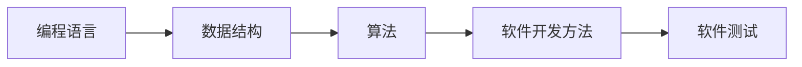

                 

“个人品牌”这个词汇在当今时代愈发受到重视，尤其是在信息技术领域。它不仅关乎个人在职场中的竞争力，更关系到个人在社交媒体和网络上的影响力。开发个人品牌课程，就是帮助大家系统化地构建和传播自己的知识体系，从而在专业领域中脱颖而出。

## 文章关键词

- 个人品牌
- 课程开发
- 知识体系
- 专业成长
- 影响力

## 文章摘要

本文将探讨如何开发个人品牌课程，包括确定课程目标、构建知识体系、设计课程内容以及传播课程价值。我们将通过实例和案例分析，帮助读者理解这一过程的实际操作步骤，并提供一些实用的工具和资源推荐。

## 1. 背景介绍

在信息技术飞速发展的时代，知识和技能的更新换代越来越快。传统的方式已经无法满足人们持续学习的需求。个人品牌课程作为一种新兴的学习方式，它不仅提供了系统化的学习路径，还通过构建个人知识体系，帮助学习者更好地理解、应用和传播知识。

个人品牌课程的意义不仅在于传授知识，更在于激发学习者的思考和创造力，培养他们独立解决问题的能力。在这个过程中，个人品牌不仅是一个标识，更是一个不断成长的动态过程。

## 2. 核心概念与联系

### 2.1 个人品牌

个人品牌是指个人在公众心中的形象和认知，它包括专业能力、个性特点、价值观和社会影响力等多个方面。一个强大的个人品牌能够帮助个人在职场中脱颖而出，赢得更多的机会。

### 2.2 知识体系

知识体系是指个人对所学知识的系统化组织和整理。一个完善的知识体系能够帮助个人更好地理解和应用知识，提高学习效率。

### 2.3 课程开发

课程开发是指设计和制作个人品牌课程的过程。它包括课程目标设定、内容规划、教学方法选择等多个环节。

### 2.4 联系

个人品牌课程的核心在于构建和传播个人的知识体系。通过系统化的课程开发，个人可以更好地展现自己的专业能力，提升个人品牌的影响力。

## 3. 核心算法原理 & 具体操作步骤

### 3.1 算法原理概述

个人品牌课程开发的核心算法可以理解为知识体系的构建算法。这个算法的基本原理是将零散的知识点通过逻辑关系和层次结构进行组织，形成一个系统化的知识体系。

### 3.2 算法步骤详解

1. **知识收集**：首先，个人需要收集与自己的专业领域相关的知识，包括理论知识、实践经验和技术技巧等。

2. **知识整理**：将收集到的知识进行整理，去除重复和冗余的信息，确保知识点的准确性和完整性。

3. **知识分类**：根据知识点的性质和内容，将其分类到不同的主题和模块中，形成知识框架。

4. **知识整合**：将分类后的知识点进行整合，形成一个逻辑严密、层次清晰的知识体系。

5. **知识传播**：通过课程开发和教学活动，将知识体系传递给学习者，帮助他们构建自己的知识体系。

### 3.3 算法优缺点

- 优点：算法能够系统化地组织和传播知识，提高学习效率，增强个人品牌的竞争力。
- 缺点：构建和完善知识体系需要大量的时间和精力，且需要持续的学习和更新。

### 3.4 算法应用领域

该算法不仅适用于个人品牌课程开发，还可以应用于企业培训、在线教育平台等多个领域。

## 4. 数学模型和公式 & 详细讲解 & 举例说明

### 4.1 数学模型构建

个人品牌课程的数学模型可以理解为知识体系的数学表示。我们可以将知识体系视为一个图结构，每个知识点是一个节点，知识点之间的关系是边。

### 4.2 公式推导过程

知识体系的构建公式可以表示为：

$$
K = f(\{N\}, \{E\})
$$

其中，$K$ 表示知识体系，$\{N\}$ 表示知识点集合，$\{E\}$ 表示知识点之间的关系集合，$f$ 表示知识体系的构建函数。

### 4.3 案例分析与讲解

假设我们要构建一个关于“软件工程”的知识体系，知识点包括：编程语言、数据结构、算法、软件开发方法、软件测试等。知识点之间的关系可以通过以下图表示：



通过上述公式和图结构，我们可以清晰地表示出知识体系的结构，从而为课程开发提供指导。

## 5. 项目实践：代码实例和详细解释说明

### 5.1 开发环境搭建

在开发个人品牌课程之前，我们需要搭建一个适合课程开发和教学的开发环境。这包括安装必要的软件工具，如文本编辑器、版本控制工具、教学视频录制软件等。

### 5.2 源代码详细实现

以下是一个简单的课程开发代码示例，用于生成知识体系图：

```python
import networkx as nx
import matplotlib.pyplot as plt

# 构建知识点和关系
G = nx.Graph()
G.add_nodes_from(['编程语言', '数据结构', '算法', '软件开发方法', '软件测试'])
G.add_edges_from([('编程语言', '数据结构'), ('数据结构', '算法'), ('算法', '软件开发方法'), ('软件开发方法', '软件测试')])

# 绘制知识体系图
nx.draw(G, with_labels=True)
plt.show()
```

### 5.3 代码解读与分析

上述代码首先导入了 `networkx` 和 `matplotlib.pyplot` 两个库，用于构建和绘制知识体系图。然后，我们创建了一个无向图 `G`，并添加了知识点作为节点，知识点之间的关系作为边。最后，使用 `nx.draw()` 函数绘制了知识体系图。

### 5.4 运行结果展示

运行上述代码后，将生成一个知识体系图，展示了各个知识点及其关系。

## 6. 实际应用场景

个人品牌课程在以下场景中具有实际应用价值：

- **职场晋升**：通过系统化的学习，提升个人在职场中的竞争力，为晋升做好准备。
- **教育培训**：作为教育培训机构的一部分，为学习者提供专业化的知识体系。
- **在线教育**：通过在线平台，向更广泛的受众传播个人品牌和知识。

## 7. 工具和资源推荐

### 7.1 学习资源推荐

- **在线课程平台**：如 Coursera、Udemy、edX 等，提供丰富的在线课程资源。
- **专业书籍**：如《深度学习》、《编程珠玑》等，涵盖多个领域的专业书籍。
- **技术社区**：如 Stack Overflow、GitHub 等，可以获取最新的技术和实践经验。

### 7.2 开发工具推荐

- **文本编辑器**：如 Visual Studio Code、Sublime Text 等，方便编写和编辑课程内容。
- **版本控制工具**：如 Git，用于管理和追踪课程开发的版本。
- **教学视频录制软件**：如 Camtasia、OBS Studio 等，用于录制和编辑教学视频。

### 7.3 相关论文推荐

- **《个人知识管理：理论与实践》**：探讨了个人知识管理的方法和策略。
- **《网络化学习与个人品牌》**：分析了网络化学习对个人品牌建设的影响。

## 8. 总结：未来发展趋势与挑战

### 8.1 研究成果总结

通过本文的讨论，我们总结了个人品牌课程开发的核心概念和步骤，包括知识体系的构建、数学模型的表示以及实际应用场景。这些研究成果为个人品牌课程开发提供了理论支持和实践指导。

### 8.2 未来发展趋势

随着人工智能和大数据技术的发展，个人品牌课程将更加智能化和个性化。通过数据分析和智能推荐，课程内容将更加符合学习者的需求。

### 8.3 面临的挑战

个人品牌课程开发面临的主要挑战包括知识体系的持续更新、教学方法的创新以及学习者的自主学习能力提升。这些挑战需要通过技术进步和创新教育模式的探索来克服。

### 8.4 研究展望

未来的研究可以聚焦于以下几个方面：

- **知识体系的智能化构建**：利用人工智能技术，自动构建和完善知识体系。
- **个性化学习路径设计**：根据学习者的特点和需求，设计个性化的学习路径。
- **教学模式的创新**：探索更加灵活和高效的教学模式，提高学习效果。

## 9. 附录：常见问题与解答

### 9.1 个人品牌课程开发有哪些常见问题？

- **内容不够系统化**：课程内容零散，缺乏逻辑性和系统性。
- **缺乏实际应用**：课程内容过于理论化，缺乏实际操作的案例。
- **更新不及时**：课程内容未能及时更新，与行业最新动态脱节。

### 9.2 如何解决这些问题？

- **系统化内容规划**：在课程开发初期，进行详细的内容规划，确保知识点的逻辑性和系统性。
- **结合实际案例**：在课程中引入实际案例，增强课程的实用性和操作性。
- **定期更新内容**：定期对课程内容进行审查和更新，确保与行业最新动态保持一致。

---

作者：禅与计算机程序设计艺术 / Zen and the Art of Computer Programming

本文旨在为读者提供关于个人品牌课程开发的全面指导，帮助大家更好地构建和传播自己的知识体系。希望这篇文章能够对您的个人品牌建设之路有所启发。在未来，我们也将继续探讨更多关于个人品牌建设和技术领域的深度话题。感谢您的阅读，期待与您共同成长。

