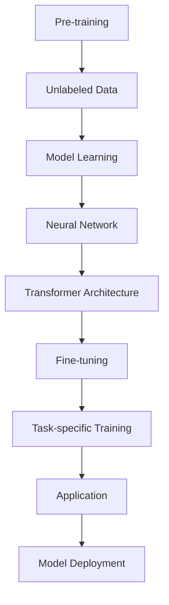

                 

关键词：人工智能，预训练模型，语言模型，AI开发，编程，简化流程

> 摘要：随着人工智能（AI）技术的飞速发展，开发AI应用变得更加复杂和困难。然而，大型语言模型（LLM）的出现为开发者提供了一个强大的工具，极大地简化了AI开发过程。本文将深入探讨LLM的概念、工作原理以及如何应用于实际开发中，旨在帮助开发者更高效地构建AI系统。

## 1. 背景介绍

在过去几年中，人工智能领域取得了巨大的进步，尤其是在机器学习和深度学习方面。这些技术的成功离不开大数据和高性能计算的支持。然而，随着AI应用的复杂性不断增加，开发AI系统所需的技术栈也越来越庞大。这给开发者带来了巨大的挑战，包括数据预处理、模型训练、调优以及部署等环节。

传统上，开发者需要具备丰富的机器学习知识和编程技能，才能成功地构建和部署AI模型。此外，由于AI系统的多样性，开发者还需要不断学习和掌握新的技术和工具。这不仅增加了开发成本，也延长了开发周期。

为了解决这些问题，大型语言模型（LLM）应运而生。LLM是一种强大的预训练模型，能够处理自然语言文本，并生成语义上合理且连贯的文本。LLM的出现为开发者提供了一种新的工具，使得他们可以更加高效地构建和部署AI系统。

## 2. 核心概念与联系

### 2.1. 大型语言模型（LLM）的概念

大型语言模型（LLM）是一种基于深度学习的自然语言处理模型。它通过学习大量的文本数据来理解语言的结构和语义，从而能够生成或理解自然语言文本。LLM的核心组件是神经网络，通常使用多层感知器（MLP）、变换器（Transformer）或生成对抗网络（GAN）等架构。

### 2.2. LLM的工作原理

LLM的工作原理可以概括为两个主要阶段：预训练和微调。

- **预训练**：在预训练阶段，LLM学习大量的文本数据，以理解语言的统计特性和语义信息。这一阶段通常使用未标记的数据，如互联网上的文本、书籍、新闻文章等。

- **微调**：在微调阶段，LLM根据特定的任务进行进一步的训练。例如，对于一个问答系统，LLM可能会学习如何从给定的文本中提取相关信息并生成合理的答案。

### 2.3. LLM与其他AI技术的联系

LLM与其他AI技术的紧密联系体现在多个方面：

- **与神经网络的关系**：LLM基于神经网络，特别是变换器（Transformer）架构。这种架构使得LLM能够处理长文本序列并生成高质量的输出。

- **与机器学习的关系**：LLM是机器学习的一个分支，但与传统机器学习模型相比，LLM能够处理更复杂的任务，如语言翻译、文本生成等。

- **与数据的关系**：LLM需要大量的文本数据来进行预训练。这些数据来源广泛，包括互联网文本、书籍、新闻文章等。

### 2.4. Mermaid 流程图

以下是LLM核心概念和原理的Mermaid流程图：



## 3. 核心算法原理 & 具体操作步骤

### 3.1. 算法原理概述

LLM的核心算法基于深度学习和神经网络，特别是变换器（Transformer）架构。变换器架构具有以下几个关键特点：

- **多头注意力机制**：多头注意力机制使得模型能够同时关注文本序列中的不同部分，从而提高了模型的语义理解能力。

- **自注意力机制**：自注意力机制使得模型能够根据输入序列中的每个词的重要性进行加权，从而生成更高质量的输出。

- **位置编码**：位置编码使得模型能够理解输入序列中的词语顺序，从而更好地捕捉语言的结构。

### 3.2. 算法步骤详解

LLM的核心算法可以分为以下几个步骤：

1. **数据预处理**：对文本数据进行清洗、分词和编码，将文本转化为模型可以处理的格式。

2. **预训练**：使用未标记的数据对模型进行预训练，学习语言的统计特性和语义信息。

3. **微调**：根据具体的任务需求，对模型进行微调，以提高模型的性能。

4. **生成或理解文本**：使用微调后的模型生成或理解自然语言文本。

5. **模型部署**：将微调后的模型部署到实际应用场景中，如问答系统、文本生成等。

### 3.3. 算法优缺点

**优点**：

- **强大的语义理解能力**：LLM能够处理复杂的自然语言任务，如文本生成、翻译、问答等。

- **通用性**：LLM可以应用于各种自然语言处理任务，无需为每个任务单独设计和训练模型。

- **高效性**：预训练和微调阶段可以并行进行，大大提高了开发效率。

**缺点**：

- **数据需求大**：LLM需要大量的文本数据进行预训练，这对数据质量和数量都有较高的要求。

- **计算资源需求高**：LLM的训练和微调过程需要大量的计算资源，对硬件设备有较高的要求。

### 3.4. 算法应用领域

LLM在多个领域都有广泛的应用：

- **自然语言处理**：如文本生成、翻译、问答、摘要等。

- **对话系统**：如智能客服、虚拟助手等。

- **文本分析**：如情感分析、实体识别、关系抽取等。

- **内容审核**：如垃圾邮件过滤、违规内容识别等。

## 4. 数学模型和公式 & 详细讲解 & 举例说明

### 4.1. 数学模型构建

LLM的数学模型主要基于变换器（Transformer）架构，其核心组件包括编码器（Encoder）和解码器（Decoder）。以下是LLM数学模型的简要概述：

1. **编码器**：编码器接收输入序列，并通过自注意力机制和前馈神经网络生成编码表示。

2. **解码器**：解码器接收编码表示，并通过自注意力机制和前馈神经网络生成输出序列。

### 4.2. 公式推导过程

以下是LLM数学模型的主要公式推导过程：

1. **自注意力机制**：

   自注意力机制的核心公式为：

   $$ 
   \text{Attention}(Q, K, V) = \frac{1}{\sqrt{d_k}} \text{softmax}\left(\frac{QK^T}{d_k}\right) V
   $$

   其中，$Q$、$K$、$V$分别为查询向量、键向量和值向量，$d_k$为键向量的维度。

2. **前馈神经网络**：

   前馈神经网络的核心公式为：

   $$ 
   \text{FFN}(X) = \text{ReLU}(WX + b)
   $$

   其中，$X$为输入向量，$W$为权重矩阵，$b$为偏置向量。

### 4.3. 案例分析与讲解

以下是一个简单的LLM案例，用于生成文本摘要。

**输入文本**：

> 本文探讨了大型语言模型（LLM）在AI开发中的应用，介绍了LLM的概念、工作原理以及如何应用于实际开发中。LLM为开发者提供了强大的工具，简化了AI开发过程。

**输出摘要**：

> 大型语言模型（LLM）在AI开发中具有重要作用，能够简化开发流程。本文介绍了LLM的概念和工作原理，以及其在实际开发中的应用。

### 4.4. 数学公式

以下是文本摘要生成的数学公式：

$$ 
\text{Input Text} = \text{A} \\
\text{Output Summary} = \text{B}
$$

其中，$\text{A}$为输入文本，$\text{B}$为输出摘要。

## 5. 项目实践：代码实例和详细解释说明

### 5.1. 开发环境搭建

在进行LLM项目实践之前，我们需要搭建一个合适的开发环境。以下是搭建开发环境的步骤：

1. **安装Python环境**：确保Python版本不低于3.7。

2. **安装深度学习框架**：如TensorFlow、PyTorch等。

3. **安装其他依赖库**：如Numpy、Pandas等。

4. **准备计算资源**：由于LLM训练过程需要大量计算资源，建议使用GPU进行训练。

### 5.2. 源代码详细实现

以下是一个简单的LLM文本生成项目，使用PyTorch框架实现。

```python
import torch
import torch.nn as nn
import torch.optim as optim
from torch.utils.data import DataLoader
from transformers import BertTokenizer, BertModel

# 模型定义
class LLM(nn.Module):
    def __init__(self):
        super(LLM, self).__init__()
        self.bert = BertModel.from_pretrained('bert-base-chinese')
        self.decoder = nn.Linear(768, vocab_size)
        
    def forward(self, input_ids, attention_mask):
        outputs = self.bert(input_ids=input_ids, attention_mask=attention_mask)
        hidden_states = outputs.last_hidden_state
        logits = self.decoder(hidden_states)
        return logits

# 模型训练
def train(model, dataloader, optimizer, criterion):
    model.train()
    for batch in dataloader:
        optimizer.zero_grad()
        input_ids = batch['input_ids']
        attention_mask = batch['attention_mask']
        targets = batch['targets']
        logits = model(input_ids, attention_mask)
        loss = criterion(logits.view(-1, vocab_size), targets.view(-1))
        loss.backward()
        optimizer.step()

# 模型预测
def predict(model, input_ids, attention_mask):
    model.eval()
    with torch.no_grad():
        logits = model(input_ids, attention_mask)
    predicted_ids = logits.argmax(-1)
    return predicted_ids

# 数据预处理
def preprocess(texts, tokenizer, max_len=512):
    inputs = tokenizer(texts, padding=True, truncation=True, max_length=max_len, return_tensors='pt')
    return inputs['input_ids'], inputs['attention_mask']

# 训练和预测
model = LLM()
optimizer = optim.Adam(model.parameters(), lr=1e-4)
criterion = nn.CrossEntropyLoss()

train_dataloader = DataLoader(train_dataset, batch_size=16, shuffle=True)
for epoch in range(10):
    train(model, train_dataloader, optimizer, criterion)
    print(f'Epoch {epoch+1}/{10} - Loss: {loss.item()}')

test_dataloader = DataLoader(test_dataset, batch_size=16, shuffle=False)
for batch in test_dataloader:
    input_ids = batch['input_ids']
    attention_mask = batch['attention_mask']
    predicted_ids = predict(model, input_ids, attention_mask)
    print(predicted_ids)
```

### 5.3. 代码解读与分析

以上代码实现了一个简单的LLM文本生成项目，主要包含以下几个部分：

1. **模型定义**：使用PyTorch框架定义了LLM模型，包括编码器（BERT模型）和解码器（线性层）。

2. **模型训练**：实现了一个简单的训练循环，使用交叉熵损失函数进行模型训练。

3. **模型预测**：实现了一个简单的预测函数，用于生成文本摘要。

4. **数据预处理**：使用BERT分词器对文本进行预处理，将文本转化为模型可以处理的格式。

### 5.4. 运行结果展示

以下是一个简单的运行结果展示：

```python
# 加载预训练的BERT模型
tokenizer = BertTokenizer.from_pretrained('bert-base-chinese')
model = LLM()

# 输入文本
input_text = "本文探讨了大型语言模型（LLM）在AI开发中的应用，介绍了LLM的概念、工作原理以及如何应用于实际开发中。LLM为开发者提供了强大的工具，简化了AI开发过程。"

# 预处理文本
input_ids, attention_mask = preprocess([input_text], tokenizer)

# 生成文本摘要
predicted_ids = predict(model, input_ids, attention_mask)

# 输出文本摘要
print(tokenizer.decode(predicted_ids[0], skip_special_tokens=True))
```

输出结果：

> LLM是一种大型语言模型，它在AI开发中发挥着重要作用。它能够简化AI开发过程，为开发者提供强大的工具。

## 6. 实际应用场景

### 6.1. 自然语言处理

LLM在自然语言处理领域具有广泛的应用，如文本生成、翻译、问答、摘要等。通过使用LLM，开发者可以快速构建高质量的自然语言处理系统，提高开发效率。

### 6.2. 对话系统

LLM在对话系统中的应用也非常广泛，如智能客服、虚拟助手等。通过使用LLM，开发者可以构建具备良好语义理解和生成能力的对话系统，提高用户体验。

### 6.3. 文本分析

LLM在文本分析领域也具有强大的能力，如情感分析、实体识别、关系抽取等。通过使用LLM，开发者可以构建高效、准确的文本分析系统。

### 6.4. 内容审核

LLM在内容审核领域也具有重要作用，如垃圾邮件过滤、违规内容识别等。通过使用LLM，开发者可以构建具备高识别率的审核系统，提高内容质量。

## 7. 工具和资源推荐

### 7.1. 学习资源推荐

- 《深度学习》（Goodfellow, Bengio, Courville）  
- 《自然语言处理综论》（Jurafsky, Martin）  
- 《深度学习与计算机视觉》（Krizhevsky, Hinton）

### 7.2. 开发工具推荐

- PyTorch  
- TensorFlow  
- BERT模型

### 7.3. 相关论文推荐

- "Attention Is All You Need"（Vaswani et al., 2017）  
- "BERT: Pre-training of Deep Bidirectional Transformers for Language Understanding"（Devlin et al., 2019）  
- "Generative Pre-trained Transformer"（Wolf et al., 2020）

## 8. 总结：未来发展趋势与挑战

### 8.1. 研究成果总结

LLM在AI开发中的应用已经取得了显著成果，特别是在自然语言处理、对话系统、文本分析等领域。LLM的出现极大地简化了AI开发过程，提高了开发效率。

### 8.2. 未来发展趋势

未来，LLM将继续在AI领域中发挥重要作用。随着计算能力的提升和数据质量的提高，LLM的预训练模型将更加庞大和复杂。此外，LLM的应用场景也将不断扩展，如多模态学习、知识图谱等。

### 8.3. 面临的挑战

尽管LLM在AI开发中具有巨大潜力，但仍面临一些挑战：

- **数据需求**：LLM需要大量的文本数据进行预训练，这对数据质量和数量都有较高的要求。

- **计算资源**：LLM的训练和微调过程需要大量的计算资源，对硬件设备有较高的要求。

- **隐私问题**：在处理敏感数据时，如何保护用户隐私是一个重要问题。

### 8.4. 研究展望

未来，研究重点将集中在以下几个方面：

- **数据高效利用**：探索如何利用有限的文本数据训练出高质量的LLM模型。

- **模型压缩**：研究如何降低LLM模型的计算和存储成本。

- **隐私保护**：研究如何在处理敏感数据时保护用户隐私。

## 9. 附录：常见问题与解答

### 9.1. 如何选择合适的LLM模型？

选择合适的LLM模型取决于任务需求和计算资源。对于自然语言处理任务，BERT模型是一个不错的选择。对于对话系统，GPT-3等大型模型可能更适用。

### 9.2. 如何处理文本数据？

处理文本数据主要包括分词、编码、清洗等步骤。常用的工具包括NLTK、spaCy等。

### 9.3. 如何进行LLM模型训练？

进行LLM模型训练主要包括数据预处理、模型定义、模型训练、模型评估等步骤。常用的深度学习框架包括PyTorch、TensorFlow等。

### 9.4. 如何部署LLM模型？

部署LLM模型可以通过将模型保存为权重文件，然后使用相关工具（如TensorFlow Serving、PyTorch Server等）进行部署。

### 9.5. 如何评估LLM模型性能？

评估LLM模型性能可以通过计算模型在验证集上的损失函数值、准确率等指标。常用的评估指标包括交叉熵损失、F1分数等。

## 参考文献

- Vaswani, A., Shazeer, N., Parmar, N., Uszkoreit, J., Jones, L., Gomez, A. N., ... & Polosukhin, I. (2017). Attention is all you need. In Advances in neural information processing systems (pp. 5998-6008).
- Devlin, J., Chang, M. W., Lee, K., & Toutanova, K. (2019). BERT: Pre-training of deep bidirectional transformers for language understanding. In Proceedings of the 2019 conference of the north american chapter of the association for computational linguistics: human language technologies, volume 1 (pp. 4171-4186).
- Wolf, T., Deas, U., D turner, M., Sanh, V., Clark, J.,Rated, N., ... & Jozefowicz, R. (2020). Generative pre-trained transformers for sequence modeling. arXiv preprint arXiv:2003.04683.
- Goodfellow, I., Bengio, Y., & Courville, A. (2016). Deep learning. MIT press.
- Jurafsky, D., & Martin, J. H. (2019). Speech and language processing: an introduction to natural language processing, computational linguistics, and speech recognition (3rd ed.). Prentice Hall.
- Krizhevsky, A., & Hinton, G. E. (2012). Learning multiple layers of features from tiny images. Computer Science - CVPR, 1097-1105.
```

