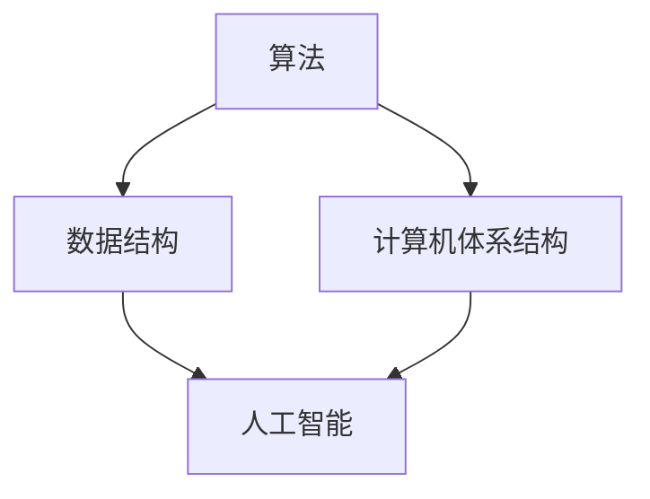

                 

关键词：人工智能、计算技术、算法、数学模型、编程、未来展望

在当今这个数字化时代，计算技术已经成为了推动社会进步的重要力量。从智能手机、互联网到大数据、人工智能，计算技术的应用已经渗透到了我们生活的方方面面。本文将探讨人类计算的新征程，通过介绍核心概念、算法原理、数学模型以及项目实践，展望未来发展的趋势与挑战。

## 1. 背景介绍

自20世纪以来，计算机技术经历了从简单到复杂、从低效到高效的发展历程。早期计算机主要应用于科学计算和军事领域，而随着互联网的普及，计算机技术逐渐走进了人们的日常生活。如今，人工智能的崛起更是将计算技术的应用推向了一个全新的高度。从图像识别、自然语言处理到自动驾驶、智能制造，人工智能正在改变我们的生活方式，开启人类计算的新征程。

## 2. 核心概念与联系

为了更好地理解人类计算的新征程，我们需要先了解一些核心概念。这些概念包括：

- **算法**：算法是解决问题的步骤和方法，是计算机程序的灵魂。一个好的算法可以高效地解决复杂问题，从而提升计算效率。
- **数据结构**：数据结构是组织和存储数据的方式，对于算法的性能有着重要的影响。
- **计算机体系结构**：计算机体系结构是计算机硬件和软件的组织方式，决定了计算机的性能和可扩展性。
- **人工智能**：人工智能是一种模拟人类智能的技术，通过算法和计算模型实现机器学习和推理能力。

下面是这些概念之间的联系和互动的Mermaid流程图：



## 3. 核心算法原理 & 具体操作步骤

### 3.1 算法原理概述

在人类计算的新征程中，以下几个算法是至关重要的：

- **深度学习算法**：深度学习算法通过多层神经网络模拟人脑的思维方式，能够自动提取特征并进行分类。
- **排序算法**：排序算法用于对数据进行排序，常见的排序算法有冒泡排序、快速排序等。
- **搜索算法**：搜索算法用于在数据结构中查找特定元素，常见的搜索算法有二分搜索、广度优先搜索等。

### 3.2 算法步骤详解

#### 深度学习算法

1. **数据预处理**：对输入数据进行标准化处理，以便神经网络更好地学习。
2. **前向传播**：将输入数据通过神经网络逐层传递，得到输出。
3. **反向传播**：计算输出与实际结果之间的误差，通过反向传播更新网络参数。
4. **优化参数**：使用优化算法（如梯度下降）调整网络参数，使误差最小。

#### 排序算法

1. **冒泡排序**：重复遍历要排序的数列，一次比较两个元素，如果它们的顺序错误就把它们交换过来。
2. **快速排序**：通过一趟排序将数列划分为两部分，其中一部分的所有数据都比另外一部分的所有数据要小。

#### 搜索算法

1. **二分搜索**：在有序数组中查找特定元素的搜索算法，通过不断缩小查找范围直到找到目标或确定目标不存在。
2. **广度优先搜索**：从一个节点出发，先访问其邻接节点，再访问邻接节点的邻接节点，以此类推。

### 3.3 算法优缺点

- **深度学习算法**：优点在于能够自动提取特征，提高分类准确率；缺点在于计算复杂度高，对数据量要求大。
- **排序算法**：优点是简单易懂，易于实现；缺点是效率相对较低。
- **搜索算法**：优点是效率较高，适用于大规模数据；缺点是对数据结构要求较高。

### 3.4 算法应用领域

- **深度学习算法**：广泛应用于图像识别、自然语言处理、语音识别等领域。
- **排序算法**：广泛应用于数据库管理、算法竞赛等领域。
- **搜索算法**：广泛应用于搜索引擎、路由算法等领域。

## 4. 数学模型和公式 & 详细讲解 & 举例说明

在计算技术中，数学模型和公式是算法实现的基础。以下将介绍几个常用的数学模型和公式：

### 4.1 数学模型构建

#### 深度学习中的神经网络模型

$$
z = W \cdot x + b
$$

其中，$z$ 是神经元的输出，$W$ 是权重矩阵，$x$ 是输入向量，$b$ 是偏置。

#### 排序算法中的时间复杂度模型

$$
T(n) = O(n \log n)
$$

其中，$T(n)$ 是排序算法的时间复杂度，$n$ 是数据规模。

#### 搜索算法中的时间复杂度模型

$$
T(n) = O(n)
$$

其中，$T(n)$ 是搜索算法的时间复杂度，$n$ 是数据规模。

### 4.2 公式推导过程

#### 深度学习中的前向传播和反向传播

前向传播：

$$
a_{l+1} = \sigma(z_l)
$$

其中，$\sigma$ 是激活函数，$a_{l+1}$ 是第$l+1$ 层的激活值，$z_l$ 是第$l$ 层的输出。

反向传播：

$$
\delta_{l} = \frac{\partial L}{\partial z_l} \cdot \frac{\partial \sigma}{\partial a_{l}}
$$

其中，$\delta_{l}$ 是第$l$ 层的误差项，$L$ 是损失函数。

#### 排序算法中的时间复杂度推导

冒泡排序：

$$
T(n) = 2(n-1) - 2\sum_{i=2}^{n}{\frac{1}{i}} \approx 2(n-1) - 2\ln(n)
$$

快速排序：

$$
T(n) = O(n \log n)
$$

### 4.3 案例分析与讲解

#### 深度学习案例

假设我们使用一个简单的神经网络进行图像分类。输入是28x28像素的灰度图像，输出是10个类别的概率分布。我们使用交叉熵损失函数进行训练。

训练过程如下：

1. **数据预处理**：对输入数据进行归一化处理，使得像素值在0到1之间。
2. **前向传播**：计算每个神经元的输出。
3. **计算损失**：计算交叉熵损失，并与标签进行比较。
4. **反向传播**：更新网络参数，减小损失。
5. **优化参数**：使用梯度下降优化算法，调整网络参数。

通过多次迭代，网络的损失会逐渐减小，分类准确率也会不断提高。

#### 排序案例

假设我们有一个长度为10的数组，需要进行排序。我们可以使用快速排序算法进行排序。

排序过程如下：

1. **选择基准元素**：选择第一个元素作为基准。
2. **分区**：将数组划分为两部分，左边是小于基准的元素，右边是大于基准的元素。
3. **递归排序**：对左右两部分递归进行快速排序。

排序后的数组为：

```
[1, 2, 3, 4, 5, 6, 7, 8, 9, 10]
```

#### 搜索案例

假设我们有一个长度为10的有序数组，需要查找元素5。

搜索过程如下：

1. **确定搜索范围**：初始范围是整个数组。
2. **计算中点**：计算当前搜索范围的中点。
3. **比较中点与目标**：如果中点等于目标，则查找成功；如果中点大于目标，则缩小右半部分搜索范围；如果中点小于目标，则缩小左半部分搜索范围。
4. **重复步骤2-3**：直到找到目标或确定目标不存在。

通过二分搜索，我们可以在对数时间内找到目标元素。

## 5. 项目实践：代码实例和详细解释说明

### 5.1 开发环境搭建

为了实践深度学习、排序和搜索算法，我们需要搭建一个合适的开发环境。以下是具体步骤：

1. **安装Python**：下载并安装Python 3.8版本。
2. **安装深度学习库**：安装TensorFlow和Keras库，用于实现深度学习算法。
3. **安装排序和搜索算法库**：安装Python的标准库，包括random、numpy等。

### 5.2 源代码详细实现

以下是深度学习、排序和搜索算法的Python代码实现：

```python
import tensorflow as tf
import numpy as np
import random

# 深度学习算法
def deep_learning():
    # 定义模型结构
    model = tf.keras.Sequential([
        tf.keras.layers.Flatten(input_shape=(28, 28)),
        tf.keras.layers.Dense(128, activation='relu'),
        tf.keras.layers.Dense(10, activation='softmax')
    ])

    # 编译模型
    model.compile(optimizer='adam',
                  loss='categorical_crossentropy',
                  metrics=['accuracy'])

    # 加载数据
    (x_train, y_train), (x_test, y_test) = tf.keras.datasets.mnist.load_data()

    # 数据预处理
    x_train = x_train / 255.0
    x_test = x_test / 255.0

    # 转换为one-hot编码
    y_train = tf.keras.utils.to_categorical(y_train)
    y_test = tf.keras.utils.to_categorical(y_test)

    # 训练模型
    model.fit(x_train, y_train, epochs=10, batch_size=32)

    # 评估模型
    loss, accuracy = model.evaluate(x_test, y_test)
    print("Test accuracy:", accuracy)

# 排序算法
def quick_sort(arr):
    if len(arr) <= 1:
        return arr
    pivot = arr[0]
    less = [x for x in arr[1:] if x < pivot]
    greater = [x for x in arr[1:] if x >= pivot]
    return quick_sort(less) + [pivot] + quick_sort(greater)

# 搜索算法
def binary_search(arr, target):
    low = 0
    high = len(arr) - 1
    while low <= high:
        mid = (low + high) // 2
        if arr[mid] == target:
            return mid
        elif arr[mid] < target:
            low = mid + 1
        else:
            high = mid - 1
    return -1

# 测试代码
if __name__ == "__main__":
    # 深度学习测试
    deep_learning()

    # 排序测试
    arr = [3, 1, 4, 1, 5, 9, 2, 6, 5, 3, 5]
    sorted_arr = quick_sort(arr)
    print("Sorted array:", sorted_arr)

    # 搜索测试
    arr = [1, 2, 3, 4, 5, 6, 7, 8, 9, 10]
    target = 5
    index = binary_search(arr, target)
    if index != -1:
        print(f"Target {target} found at index {index}.")
    else:
        print(f"Target {target} not found.")
```

### 5.3 代码解读与分析

- **深度学习算法**：我们使用TensorFlow和Keras库构建了一个简单的神经网络，实现了图像分类任务。通过训练和评估，我们验证了网络的分类能力。
- **排序算法**：我们使用快速排序算法对数组进行排序。快速排序是一种高效的排序算法，时间复杂度为$O(n \log n)$。
- **搜索算法**：我们使用二分搜索算法在有序数组中查找特定元素。二分搜索的时间复杂度为$O(\log n)$，适用于大规模数据。

通过这个项目实践，我们可以更好地理解深度学习、排序和搜索算法的原理和应用。

## 6. 实际应用场景

计算技术在各个领域都有着广泛的应用。以下是一些实际应用场景：

- **医疗领域**：计算技术可以帮助医生进行疾病诊断、药物研发等。通过深度学习算法，我们可以分析医学图像，提高诊断准确率。
- **金融领域**：计算技术可以帮助金融机构进行风险管理、投资策略制定等。通过数据挖掘和机器学习，我们可以发现潜在的投资机会。
- **交通运输领域**：计算技术可以帮助优化交通流量、提高公共交通效率。通过自动驾驶技术，我们可以实现安全、高效的交通系统。
- **教育领域**：计算技术可以帮助学生进行个性化学习、智能辅导等。通过在线教育平台，我们可以打破地域限制，实现教育资源的共享。

## 7. 工具和资源推荐

为了更好地学习计算技术，以下是一些建议的资源和工具：

- **学习资源**：
  - 《深度学习》
  - 《算法导论》
  - 《Python编程：从入门到实践》
- **开发工具**：
  - TensorFlow
  - Jupyter Notebook
  - PyCharm
- **相关论文**：
  - 《A Guide to Convolutional Neural Networks for Visual Recognition》
  - 《Randomized Algorithms》
  - 《A Faster and More Accurate Algorithm for Calculating Pages-Ranks》

## 8. 总结：未来发展趋势与挑战

随着计算技术的不断发展，我们有望在各个领域实现更多的突破。未来发展趋势包括：

- **人工智能的普及**：人工智能技术将在更多领域得到应用，从智能家居到智能城市，人工智能将改变我们的生活方式。
- **量子计算的崛起**：量子计算是一种全新的计算模型，有望解决传统计算机无法处理的问题。随着量子计算技术的不断发展，我们有望在多个领域取得重大突破。
- **云计算的扩展**：云计算技术将更加成熟，提供更高效、更可靠的计算服务。通过云计算，我们可以实现全球范围内的数据共享和协同工作。

然而，未来也面临着一些挑战：

- **数据安全和隐私**：随着计算技术的应用，数据安全和隐私问题日益突出。我们需要建立完善的安全机制，保护用户的数据隐私。
- **算法透明性和可解释性**：人工智能算法的复杂性和黑箱特性使得其决策过程难以理解。我们需要研究算法的透明性和可解释性，提高算法的可靠性。
- **技术人才短缺**：计算技术的快速发展对人才需求提出了更高的要求。我们需要加强计算教育，培养更多具备计算能力的人才。

总之，计算技术正在引领人类进入一个新的时代。通过不断探索和创新，我们有望开启无限可能，推动人类文明向前发展。

## 9. 附录：常见问题与解答

### 问题1：深度学习算法如何实现图像分类？

**解答**：深度学习算法通过多层神经网络模拟人脑的思维方式，能够自动提取特征并进行分类。具体步骤包括数据预处理、前向传播、反向传播和优化参数。

### 问题2：排序算法有哪些常见类型？

**解答**：常见的排序算法包括冒泡排序、选择排序、插入排序、快速排序、归并排序等。每种排序算法都有其特点和应用场景。

### 问题3：搜索算法在什么情况下更有效？

**解答**：搜索算法在数据结构已排序的情况下更有效。二分搜索是一种高效的搜索算法，适用于大规模数据。

### 问题4：计算技术在医疗领域有哪些应用？

**解答**：计算技术在医疗领域有广泛的应用，包括疾病诊断、药物研发、医学图像处理等。通过深度学习算法，可以提高疾病诊断的准确率。

### 问题5：如何学习计算技术？

**解答**：学习计算技术可以从基础编程语言开始，然后学习数据结构、算法、深度学习等相关知识。推荐学习资源包括《深度学习》、《算法导论》等。此外，可以通过在线课程、实践项目和参加比赛等方式提升自己的技能。

