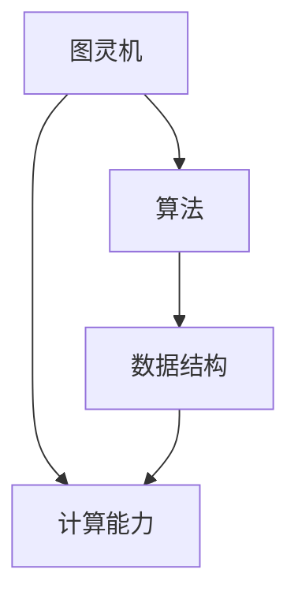

                 

关键词：人工智能、计算能力、算法原理、数学模型、应用场景、未来展望、技术发展

> 摘要：本文将探讨人类计算的新征程，从背景介绍到核心概念，再到算法原理与数学模型，以及项目实践和应用展望，全面解析人类在计算领域所取得的成就与未来的挑战。通过这篇文章，希望能够开启无限可能，推动计算机科学的发展。

## 1. 背景介绍

自20世纪以来，计算机科学作为一门新兴学科，经历了飞速的发展。从最初的电子管计算机到今天的量子计算机，计算能力的提升带来了各行各业的变革。随着大数据、云计算、人工智能等技术的崛起，人类在计算领域取得了巨大的成就，同时也面临着新的挑战。

在这个新时代，人类计算不再仅仅是为了解决传统的问题，更是为了开启无限可能。从无人驾驶汽车到智能医疗，从金融科技到智能城市，计算技术正以前所未有的速度影响着我们的生活。因此，深入探讨人类计算的新征程，对于推动计算机科学的发展具有重要意义。

## 2. 核心概念与联系

为了更好地理解人类计算的新征程，我们首先需要明确一些核心概念，如图灵机、算法、数据结构等。

### 2.1 图灵机

图灵机是计算机科学中一个理想化的模型，它由一个无限长的带子和一组规则组成。通过读取和写入带子上的符号，图灵机能够模拟任何计算过程。图灵机的提出为计算机科学奠定了理论基础，也为我们理解计算的本质提供了启示。

### 2.2 算法

算法是一组定义明确的操作步骤，用于解决特定问题。算法的效率直接影响计算速度。随着计算能力的提升，我们能够设计和实现更加高效的算法，从而解决更加复杂的问题。

### 2.3 数据结构

数据结构是存储和组织数据的方式。合理的数据结构能够提高算法的效率，降低计算复杂度。常见的有数组、链表、树、图等。

下面是一个Mermaid流程图，展示了这些核心概念之间的联系。



## 3. 核心算法原理 & 具体操作步骤

### 3.1 算法原理概述

在本章节中，我们将介绍一些核心算法的原理，如深度学习、图算法、排序算法等。

### 3.2 算法步骤详解

以深度学习算法为例，它是一种基于多层神经网络的计算模型，能够通过学习大量数据自动提取特征并进行分类、回归等任务。

1. **初始化参数**：定义神经网络的结构，包括输入层、隐藏层和输出层，以及各层的权重和偏置。
2. **前向传播**：输入数据经过神经网络各层计算，得到输出结果。
3. **反向传播**：计算输出结果与实际结果之间的误差，并更新各层的权重和偏置。
4. **优化目标**：通过迭代优化目标函数，使得模型能够更好地拟合训练数据。

### 3.3 算法优缺点

深度学习算法的优点在于能够自动提取特征，从而实现高效的分类和回归任务。然而，它也存在一些缺点，如对数据量的依赖、过拟合问题等。

### 3.4 算法应用领域

深度学习算法广泛应用于图像识别、语音识别、自然语言处理等领域，取得了显著的成果。例如，在图像识别任务中，深度学习算法已经超过了人类的表现。

## 4. 数学模型和公式 & 详细讲解 & 举例说明

在本章节中，我们将介绍一些核心数学模型和公式，如线性代数、概率统计、优化算法等。

### 4.1 数学模型构建

以线性回归模型为例，它是一种用来预测数值的数学模型。其公式如下：

$$
y = \beta_0 + \beta_1 \cdot x
$$

其中，$y$ 是预测值，$x$ 是输入特征，$\beta_0$ 和 $\beta_1$ 是模型的参数。

### 4.2 公式推导过程

线性回归模型的推导过程基于最小二乘法，目的是使得预测值与实际值之间的误差最小。

### 4.3 案例分析与讲解

以房价预测为例，我们可以使用线性回归模型来预测房屋的价格。具体步骤如下：

1. **收集数据**：收集房屋的面积、位置、建造年代等特征数据，以及实际售价。
2. **数据预处理**：对数据进行清洗和归一化处理。
3. **建立模型**：使用线性回归公式建立模型。
4. **训练模型**：使用训练数据对模型进行训练。
5. **测试模型**：使用测试数据对模型进行评估。

## 5. 项目实践：代码实例和详细解释说明

在本章节中，我们将通过一个实际项目来展示如何使用计算机科学知识解决实际问题。

### 5.1 开发环境搭建

首先，我们需要搭建一个合适的开发环境。这里我们选择Python作为编程语言，并使用Jupyter Notebook进行代码编写。

### 5.2 源代码详细实现

下面是一个简单的线性回归模型的实现代码：

```python
import numpy as np
from sklearn.linear_model import LinearRegression

# 收集数据
X = np.array([[1], [2], [3], [4], [5]])
y = np.array([1, 2, 2.5, 4, 5])

# 建立模型
model = LinearRegression()

# 训练模型
model.fit(X, y)

# 输出模型参数
print("模型参数：", model.coef_, model.intercept_)

# 预测结果
predictions = model.predict([[6]])
print("预测结果：", predictions)
```

### 5.3 代码解读与分析

在这个例子中，我们使用了scikit-learn库中的LinearRegression类来建立线性回归模型。首先，我们收集了数据，然后使用fit方法对模型进行训练，最后使用predict方法进行预测。代码简洁易懂，适合初学者上手。

### 5.4 运行结果展示

运行代码后，我们得到了模型参数和预测结果。模型参数表示了输入特征和输出特征之间的关系，预测结果则是对新数据的预测。

## 6. 实际应用场景

计算机科学在各个领域都有广泛的应用，下面列举几个实际应用场景。

### 6.1 医疗

计算机科学在医疗领域发挥了重要作用，如医学图像分析、疾病预测、个性化治疗等。通过深度学习算法，我们可以对医疗图像进行自动识别和分析，从而提高诊断的准确性。

### 6.2 金融

计算机科学在金融领域也有广泛的应用，如风险管理、算法交易、信用评分等。通过数据分析技术，我们可以对金融市场的波动进行预测，从而为投资者提供决策依据。

### 6.3 教育

计算机科学在教育领域也有很大的潜力，如在线教育、智能评测、学习分析等。通过大数据技术，我们可以对学生的学习情况进行实时分析，从而提供个性化的学习建议。

## 7. 工具和资源推荐

为了更好地学习计算机科学，我们推荐以下工具和资源：

### 7.1 学习资源推荐

- Coursera、edX等在线课程平台
- 《深度学习》、《统计学习方法》等经典教材

### 7.2 开发工具推荐

- Jupyter Notebook、VS Code等代码编辑器
- TensorFlow、PyTorch等深度学习框架

### 7.3 相关论文推荐

- "Deep Learning for Image Recognition"
- "Recurrent Neural Networks for Language Modeling"
- "A Theoretical Analysis of Deep Learning"

## 8. 总结：未来发展趋势与挑战

在未来，计算机科学将继续发展，并带来更多的变革。然而，我们也面临着一些挑战，如数据隐私、人工智能伦理等。只有积极应对这些挑战，我们才能开启无限可能，推动人类计算的新征程。

### 8.1 研究成果总结

通过本文的探讨，我们总结了计算机科学在核心算法原理、数学模型、实际应用场景等方面的研究成果，展示了人类计算的新征程。

### 8.2 未来发展趋势

未来，计算机科学将继续向深度学习、量子计算、人工智能等领域发展，为我们的生活带来更多的便利。

### 8.3 面临的挑战

然而，我们也面临着一些挑战，如数据隐私、人工智能伦理等。如何应对这些挑战，将是我们未来研究的重点。

### 8.4 研究展望

在未来的研究中，我们期待能够取得更多的突破，为人类计算的新征程注入新的活力。

## 9. 附录：常见问题与解答

### 9.1 什么是深度学习？

深度学习是一种基于多层神经网络的计算模型，通过学习大量数据自动提取特征，从而实现分类、回归等任务。

### 9.2 什么是线性回归？

线性回归是一种用来预测数值的数学模型，其公式为 $y = \beta_0 + \beta_1 \cdot x$。

### 9.3 如何搭建开发环境？

搭建开发环境通常需要安装Python、Jupyter Notebook等工具，具体步骤可以参考相关教程。

---

作者：禅与计算机程序设计艺术 / Zen and the Art of Computer Programming
```

