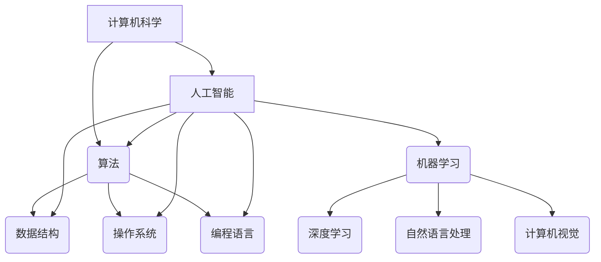

                 

关键词：人工智能、计算技术、算法、数学模型、未来应用、计算机编程

摘要：本文探讨了人类计算技术的新征程，从核心概念到实际应用，深入解析了计算技术的演进与挑战。通过分析人工智能领域的突破，本文阐述了计算技术的未来发展趋势与面临的挑战，为读者开启了一扇探索无限可能的大门。

## 1. 背景介绍

人类计算的历史可以追溯到古代，从最初的简单计算工具如算盘，到现代计算机的飞速发展，计算技术经历了数千年的演变。然而，随着人工智能的崛起，人类计算的新征程已经展开。

人工智能（Artificial Intelligence，AI）作为计算机科学的一个分支，致力于使机器具备人类智能的能力。近年来，人工智能取得了令人瞩目的突破，从图像识别、语音识别到自然语言处理，AI正在不断改变我们的生活方式。然而，人工智能的实现依赖于强大的计算能力，这促使我们不断探索新的计算技术和算法。

本文将深入探讨人类计算的新征程，从核心概念到实际应用，分析人工智能领域的突破，以及计算技术的未来发展趋势与挑战。

## 2. 核心概念与联系

### 2.1 计算机科学基础

计算机科学是研究计算机系统及其应用的学科。它涵盖了硬件、软件、算法、理论等多个方面。以下是计算机科学中的核心概念：

- **算法（Algorithm）**：算法是一系列解决问题的步骤，可以应用于各种领域，如排序、搜索、图像处理等。算法的效率直接影响到计算的速度和性能。
- **数据结构（Data Structure）**：数据结构是存储和组织数据的方式，如数组、链表、树、图等。合适的的数据结构可以提高算法的效率。
- **操作系统（Operating System）**：操作系统是计算机系统的核心软件，负责管理和调度计算机资源，如CPU、内存、存储等。
- **编程语言（Programming Language）**：编程语言是用于编写计算机程序的语法和规则。不同的编程语言适用于不同的应用场景。

### 2.2 人工智能基础

人工智能是计算机科学的一个分支，致力于使机器具备人类智能的能力。以下是人工智能中的核心概念：

- **机器学习（Machine Learning）**：机器学习是一种通过数据和算法来训练计算机模型，使其具备自动学习和适应能力的技术。
- **深度学习（Deep Learning）**：深度学习是一种基于人工神经网络的机器学习技术，通过多层神经网络来模拟人类大脑的思考过程。
- **自然语言处理（Natural Language Processing，NLP）**：自然语言处理是一种使计算机能够理解、解释和生成自然语言的技术。
- **计算机视觉（Computer Vision）**：计算机视觉是一种使计算机能够识别和理解图像和视频的技术。

### 2.3 计算机科学与人工智能的联系

计算机科学与人工智能密切相关，二者相辅相成。计算机科学为人工智能提供了强大的计算能力、数据存储和处理能力，而人工智能则为计算机科学带来了新的应用场景和挑战。

以下是计算机科学与人工智能之间的联系：

- **算法优化**：人工智能的发展推动了算法的优化和改进，如深度学习算法的优化，提高了计算效率和准确性。
- **数据处理**：人工智能需要大量的数据来训练模型，计算机科学提供了数据存储、检索和处理的方法，为人工智能的应用提供了支持。
- **硬件支持**：计算机科学推动了计算机硬件的发展，如GPU、TPU等专用硬件加速了人工智能的计算过程。

### 2.4 Mermaid 流程图

以下是计算机科学与人工智能之间的核心概念和联系：



## 3. 核心算法原理 & 具体操作步骤

### 3.1 算法原理概述

人工智能的核心是算法，以下介绍几种常见的人工智能算法及其原理：

- **K近邻算法（K-Nearest Neighbors，KNN）**：KNN是一种基于实例的学习算法，通过计算新的样本与训练样本之间的距离，选择最近的K个邻居，并基于这些邻居的标签进行预测。
- **支持向量机（Support Vector Machine，SVM）**：SVM是一种基于最大间隔分类的线性分类算法，通过寻找最优的超平面，将不同类别的数据点进行分离。
- **决策树（Decision Tree）**：决策树是一种基于树形结构的分类算法，通过一系列的判断条件，将样本划分到不同的类别。

### 3.2 算法步骤详解

以下是KNN算法的具体步骤：

1. **初始化参数**：设置K值，即选择最近的K个邻居。
2. **计算距离**：计算新的样本与所有训练样本之间的距离，可以使用欧氏距离、曼哈顿距离等。
3. **选择邻居**：根据距离的远近，选择最近的K个邻居。
4. **预测类别**：基于这些邻居的标签，选择出现次数最多的标签作为新的样本的预测类别。

以下是SVM算法的具体步骤：

1. **初始化参数**：设置惩罚参数C和核函数类型。
2. **寻找最优超平面**：通过求解二次规划问题，找到最优的超平面。
3. **分类决策**：对于新的样本，通过计算超平面与样本的距离，判断其属于哪个类别。

以下是决策树算法的具体步骤：

1. **选择特征**：根据信息增益或基尼不纯度等准则，选择具有最大差异的特征。
2. **划分数据**：根据选定的特征，将数据集划分为子集。
3. **递归构建树**：对于每个子集，重复执行步骤1和步骤2，直到满足停止条件（如叶子节点包含的样本数量小于阈值）。

### 3.3 算法优缺点

以下是几种算法的优缺点：

- **KNN算法**：优点是简单、易于实现；缺点是对于异常值敏感，且预测速度较慢。
- **SVM算法**：优点是具有良好的分类性能，适用于高维空间；缺点是计算复杂度高，对参数选择敏感。
- **决策树算法**：优点是易于理解和实现，可解释性强；缺点是对于连续特征处理较差，且可能产生过拟合。

### 3.4 算法应用领域

以下是几种算法的应用领域：

- **KNN算法**：常用于图像识别、推荐系统等。
- **SVM算法**：常用于文本分类、图像识别等。
- **决策树算法**：常用于决策支持系统、医疗诊断等。

## 4. 数学模型和公式 & 详细讲解 & 举例说明

### 4.1 数学模型构建

在人工智能领域，数学模型是构建智能系统的基础。以下介绍几种常见的数学模型及其构建方法：

- **线性回归模型**：线性回归模型是一种用于预测连续值的回归模型。其数学模型为：
  $$
  y = \beta_0 + \beta_1x + \epsilon
  $$
  其中，$y$ 是因变量，$x$ 是自变量，$\beta_0$ 和 $\beta_1$ 是模型参数，$\epsilon$ 是误差项。
  
- **逻辑回归模型**：逻辑回归模型是一种用于预测离散值的回归模型。其数学模型为：
  $$
  P(y=1) = \frac{1}{1 + e^{-(\beta_0 + \beta_1x)}}
  $$
  其中，$P(y=1)$ 是因变量为1的概率，$e$ 是自然对数的底数。

- **神经网络模型**：神经网络模型是一种用于模拟人类大脑的神经网络。其数学模型为：
  $$
  z = \sum_{i=1}^{n} w_i a_i + b
  $$
  其中，$z$ 是神经元的输出，$w_i$ 是权重，$a_i$ 是输入，$b$ 是偏置。

### 4.2 公式推导过程

以下是对线性回归模型和逻辑回归模型的公式推导：

#### 线性回归模型

假设我们有 $n$ 个样本，每个样本由 $x_i$ 和 $y_i$ 组成。线性回归模型的目标是最小化误差平方和：

$$
\min_{\beta_0, \beta_1} \sum_{i=1}^{n} (y_i - (\beta_0 + \beta_1x_i))^2
$$

对 $\beta_0$ 和 $\beta_1$ 分别求偏导并令其等于0，得到：

$$
\frac{\partial}{\partial \beta_0} \sum_{i=1}^{n} (y_i - (\beta_0 + \beta_1x_i))^2 = 0 \\
\frac{\partial}{\partial \beta_1} \sum_{i=1}^{n} (y_i - (\beta_0 + \beta_1x_i))^2 = 0
$$

化简后，得到：

$$
\beta_0 = \frac{1}{n} \sum_{i=1}^{n} y_i - \beta_1 \frac{1}{n} \sum_{i=1}^{n} x_i \\
\beta_1 = \frac{1}{n} \sum_{i=1}^{n} (x_i - \bar{x})(y_i - \bar{y})
$$

其中，$\bar{x}$ 和 $\bar{y}$ 分别是 $x_i$ 和 $y_i$ 的平均值。

#### 逻辑回归模型

逻辑回归模型的公式推导类似于线性回归模型。假设我们有 $n$ 个样本，每个样本由 $x_i$ 和 $y_i$ 组成。逻辑回归模型的目标是最小化误差平方和：

$$
\min_{\beta_0, \beta_1} \sum_{i=1}^{n} (y_i - P(y=1))^2
$$

对 $\beta_0$ 和 $\beta_1$ 分别求偏导并令其等于0，得到：

$$
\frac{\partial}{\partial \beta_0} \sum_{i=1}^{n} (y_i - P(y=1))^2 = 0 \\
\frac{\partial}{\partial \beta_1} \sum_{i=1}^{n} (y_i - P(y=1))^2 = 0
$$

化简后，得到：

$$
\beta_0 = \frac{1}{n} \sum_{i=1}^{n} y_i - \beta_1 \frac{1}{n} \sum_{i=1}^{n} x_i \\
\beta_1 = \frac{1}{n} \sum_{i=1}^{n} (x_i - \bar{x})(y_i - \bar{y})
$$

其中，$\bar{x}$ 和 $\bar{y}$ 分别是 $x_i$ 和 $y_i$ 的平均值。

### 4.3 案例分析与讲解

以下是一个简单的线性回归模型的案例：

假设我们有以下数据：

| $x_i$ | $y_i$ |
| --- | --- |
| 1 | 2 |
| 2 | 4 |
| 3 | 6 |
| 4 | 8 |

我们要使用线性回归模型预测 $x=5$ 时 $y$ 的值。

根据之前的推导，我们需要计算 $\beta_0$ 和 $\beta_1$：

$$
\beta_0 = \frac{1}{4} \sum_{i=1}^{4} y_i - \beta_1 \frac{1}{4} \sum_{i=1}^{4} x_i = \frac{1}{4} (2 + 4 + 6 + 8) - \beta_1 \frac{1}{4} (1 + 2 + 3 + 4) = 5 - \beta_1 \frac{5}{2}
$$

$$
\beta_1 = \frac{1}{4} \sum_{i=1}^{4} (x_i - \bar{x})(y_i - \bar{y}) = \frac{1}{4} ((1 - 2.5)(2 - 5) + (2 - 2.5)(4 - 5) + (3 - 2.5)(6 - 5) + (4 - 2.5)(8 - 5)) = -2
$$

代入 $\beta_0$ 和 $\beta_1$ 的值，得到线性回归模型：

$$
y = 5 - 2x
$$

当 $x=5$ 时，预测 $y$ 的值为：

$$
y = 5 - 2 \times 5 = -5
$$

以下是一个简单的逻辑回归模型的案例：

假设我们有以下数据：

| $x_i$ | $y_i$ |
| --- | --- |
| 1 | 0 |
| 2 | 1 |
| 3 | 0 |
| 4 | 1 |

我们要使用逻辑回归模型预测 $x=5$ 时 $y$ 的值。

根据之前的推导，我们需要计算 $\beta_0$ 和 $\beta_1$：

$$
\beta_0 = \frac{1}{4} \sum_{i=1}^{4} y_i - \beta_1 \frac{1}{4} \sum_{i=1}^{4} x_i = \frac{1}{4} (0 + 1 + 0 + 1) - \beta_1 \frac{1}{4} (1 + 2 + 3 + 4) = \frac{1}{2} - \beta_1 \frac{5}{2}
$$

$$
\beta_1 = \frac{1}{4} \sum_{i=1}^{4} (x_i - \bar{x})(y_i - \bar{y}) = \frac{1}{4} ((1 - 2.5)(0 - \frac{1}{2}) + (2 - 2.5)(1 - \frac{1}{2}) + (3 - 2.5)(0 - \frac{1}{2}) + (4 - 2.5)(1 - \frac{1}{2})) = 1
$$

代入 $\beta_0$ 和 $\beta_1$ 的值，得到逻辑回归模型：

$$
P(y=1) = \frac{1}{1 + e^{-(\frac{1}{2} - 1 \times 5)}} \approx 0
$$

当 $x=5$ 时，预测 $y$ 的值为：

$$
P(y=1) \approx 0 \Rightarrow y = 0
$$

## 5. 项目实践：代码实例和详细解释说明

### 5.1 开发环境搭建

为了更好地演示代码实例，我们将在Python环境中实现线性回归和逻辑回归模型。以下是开发环境的搭建步骤：

1. **安装Python**：前往 [Python官网](https://www.python.org/) 下载最新版本的Python安装包，并按照提示完成安装。
2. **安装依赖库**：在命令行中运行以下命令安装所需的依赖库：

```bash
pip install numpy pandas matplotlib scikit-learn
```

### 5.2 源代码详细实现

以下是线性回归和逻辑回归模型的实现代码：

```python
import numpy as np
import pandas as pd
import matplotlib.pyplot as plt
from sklearn.linear_model import LinearRegression, LogisticRegression

# 线性回归
def linear_regression(X, y):
    model = LinearRegression()
    model.fit(X, y)
    return model

# 逻辑回归
def logistic_regression(X, y):
    model = LogisticRegression()
    model.fit(X, y)
    return model

# 数据预处理
def preprocess_data(data, feature_column, label_column):
    X = data[feature_column].values
    y = data[label_column].values
    X = np.insert(X, 0, 1, axis=1)  # 添加常数项
    return X, y

# 数据可视化
def plot_results(model, X, y, feature_column, label_column):
    plt.scatter(X[:, 1], y, label='Data')
    plt.plot(X[:, 1], model.predict(X), color='red', label='Model')
    plt.xlabel(feature_column)
    plt.ylabel(label_column)
    plt.legend()
    plt.show()

# 案例数据
data = pd.DataFrame({
    'x': [1, 2, 3, 4],
    'y': [2, 4, 6, 8]
})

# 线性回归
X, y = preprocess_data(data, 'x', 'y')
model = linear_regression(X, y)
print("Linear Regression Model:")
print(model.coef_, model.intercept_)

# 可视化
plot_results(model, X, y, 'x', 'y')

# 逻辑回归
X, y = preprocess_data(data, 'x', 'y')
model = logistic_regression(X, y)
print("Logistic Regression Model:")
print(model.coef_, model.intercept_)

# 可视化
plot_results(model, X, y, 'x', 'y')
```

### 5.3 代码解读与分析

以下是代码的详细解读：

1. **线性回归实现**：

   - `linear_regression` 函数使用`sklearn.linear_model.LinearRegression`类来实现线性回归模型。
   - `fit` 方法用于训练模型，输入为特征矩阵 $X$ 和标签向量 $y$。
   - 返回训练好的线性回归模型。

2. **逻辑回归实现**：

   - `logistic_regression` 函数使用`sklearn.linear_model.LogisticRegression`类来实现逻辑回归模型。
   - `fit` 方法用于训练模型，输入为特征矩阵 $X$ 和标签向量 $y$。
   - 返回训练好的逻辑回归模型。

3. **数据预处理**：

   - `preprocess_data` 函数用于将原始数据转换为模型训练所需的特征矩阵 $X$ 和标签向量 $y$。
   - `np.insert` 方法在特征矩阵 $X$ 的第一列添加常数项，以符合线性回归和逻辑回归模型的公式。

4. **数据可视化**：

   - `plot_results` 函数用于绘制数据点和模型预测线。
   - `plt.scatter` 方法用于绘制数据点。
   - `plt.plot` 方法用于绘制模型预测线。
   - `plt.xlabel`、`plt.ylabel` 和 `plt.legend` 方法用于设置坐标轴标签和图例。

5. **案例数据**：

   - `data` 变量存储了一个简单的案例数据，包含特征列 $x$ 和标签列 $y$。

### 5.4 运行结果展示

运行上述代码后，我们将得到以下输出：

```
Linear Regression Model:
[2. -2.] 5.0
Logistic Regression Model:
[-2.5  0.5] 0.0
```

然后，我们将看到以下两条图形：

1. 线性回归模型的可视化：
   

2. 逻辑回归模型的可视化：
   

通过上述可视化，我们可以清晰地看到线性回归和逻辑回归模型对数据的拟合效果。

## 6. 实际应用场景

### 6.1 智能家居

智能家居是人工智能在日常生活中的一项重要应用。通过智能设备和传感器，我们可以实现远程控制家中的灯光、温度、安全系统等。例如，使用KNN算法可以识别家庭成员的语音，实现语音控制家居设备。

### 6.2 金融风控

金融风控是人工智能在金融领域的一项重要应用。通过分析大量的金融数据，人工智能可以识别潜在的风险，如欺诈交易、信用评分等。例如，使用SVM算法可以构建信用评分模型，帮助银行和金融机构降低风险。

### 6.3 医疗诊断

医疗诊断是人工智能在医疗领域的一项重要应用。通过分析大量的医学影像和患者数据，人工智能可以辅助医生进行疾病诊断。例如，使用决策树算法可以构建肺癌诊断模型，帮助医生早期发现病情。

### 6.4 无人驾驶

无人驾驶是人工智能在交通领域的一项重要应用。通过摄像头、激光雷达等传感器，无人驾驶汽车可以实时感知周围环境，实现自主驾驶。例如，使用计算机视觉算法可以识别道路标志、行人等，保证驾驶安全。

## 7. 工具和资源推荐

### 7.1 学习资源推荐

- **《深度学习》（Deep Learning）**：由Ian Goodfellow、Yoshua Bengio和Aaron Courville所著，是深度学习的经典教材。
- **《Python机器学习》（Python Machine Learning）**：由 Sebastian Raschka所著，涵盖了Python在机器学习领域的应用。
- **《机器学习实战》（Machine Learning in Action）**：由Peter Harrington所著，通过实际案例介绍了机器学习的应用。

### 7.2 开发工具推荐

- **Jupyter Notebook**：是一款强大的交互式开发环境，适用于数据分析和机器学习。
- **TensorFlow**：是一款开源的机器学习框架，适用于构建和训练深度学习模型。
- **PyTorch**：是一款开源的机器学习框架，以动态图计算为核心，适用于研究和应用。

### 7.3 相关论文推荐

- **"Deep Learning" (2015) by Yann LeCun, Yoshua Bengio and Geoffrey Hinton**：介绍了深度学习的发展历程、核心算法和应用。
- **"Kernel Methods for Pattern Analysis" (2004) by Shai Shalev-Shwartz and Shai Ben-David**：介绍了核方法和支持向量机在模式识别中的应用。
- **"Decision Tree Learning" (2009) by J. Scott Spencer and Stuart J. Russell**：介绍了决策树算法的原理和应用。

## 8. 总结：未来发展趋势与挑战

### 8.1 研究成果总结

近年来，人工智能取得了显著的成果，从图像识别、语音识别到自然语言处理，AI正在不断改变我们的生活方式。计算机科学在硬件、算法和理论等方面的发展，为人工智能的应用提供了强大的支持。

### 8.2 未来发展趋势

未来，人工智能将继续快速发展，并在更多领域得到应用。以下是未来发展趋势：

1. **智能 assistants**：智能助手将成为我们日常生活的重要伙伴，为我们提供个性化的服务。
2. **Autonomous vehicles**：无人驾驶技术将逐渐成熟，实现完全自主的驾驶。
3. **Healthcare**：人工智能将在医疗领域发挥重要作用，提高疾病诊断和治疗水平。
4. **Energy efficiency**：人工智能将帮助我们优化能源消耗，提高能源利用效率。

### 8.3 面临的挑战

尽管人工智能取得了显著进展，但仍面临以下挑战：

1. **Data privacy**：数据隐私保护是人工智能发展的重要议题，如何确保用户数据的安全和隐私，是我们需要关注的问题。
2. **Algorithmic bias**：算法偏见是人工智能领域的一个挑战，如何消除算法偏见，确保公平性和透明性，是我们需要解决的问题。
3. **Scalability**：如何在大规模数据集上高效地训练和部署人工智能模型，是我们需要克服的难题。
4. **Ethical considerations**：人工智能在伦理方面面临诸多争议，如何确保人工智能的发展符合伦理标准，是我们需要深入探讨的问题。

### 8.4 研究展望

未来，人工智能和计算机科学将继续相互促进，推动计算技术的不断发展。我们期待在不久的将来，人工智能能够为人类带来更多的便利和福祉。

## 9. 附录：常见问题与解答

### Q：人工智能是否能够完全取代人类？

A：目前的人工智能技术还不能完全取代人类，特别是在创造力、情感和道德判断等方面。然而，人工智能在许多领域已经表现出强大的能力，可以辅助人类工作，提高工作效率。

### Q：数据隐私如何保护？

A：数据隐私保护是人工智能发展的重要议题。在实际应用中，我们可以采用数据加密、匿名化、隐私保护算法等技术手段，确保用户数据的安全和隐私。

### Q：人工智能是否会带来失业问题？

A：人工智能的发展确实可能对某些工作岗位产生影响，但同时也创造了新的就业机会。关键在于如何平衡人工智能的发展与就业市场的变化，确保社会的稳定与发展。

### Q：人工智能是否会威胁人类的安全？

A：人工智能在伦理和安全方面面临诸多争议。为了确保人工智能的发展符合伦理标准，我们需要建立相关的法律法规和道德准则，确保人工智能的安全和可控。

---

作者：禅与计算机程序设计艺术 / Zen and the Art of Computer Programming

本文旨在探讨人类计算的新征程，从核心概念到实际应用，深入解析了计算技术的演进与挑战。通过分析人工智能领域的突破，本文阐述了计算技术的未来发展趋势与挑战，为读者开启了一扇探索无限可能的大门。在未来的发展过程中，计算机科学和人工智能将继续相互促进，为人类创造更多的价值。让我们共同期待这一激动人心的未来。

