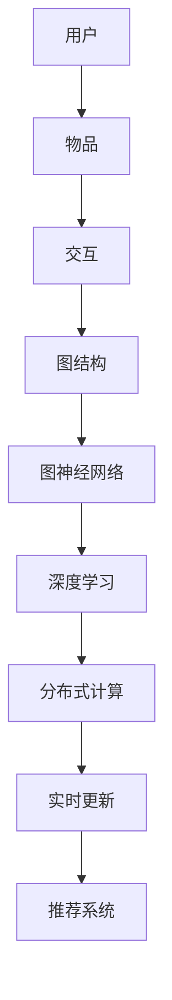

                 

关键词：开放域推荐系统、M6-Rec、算法原理、数学模型、项目实践、应用场景、未来展望

摘要：本文将深入探讨开放域推荐系统领域的一项前沿技术——M6-Rec框架。通过详细解析M6-Rec的核心概念、算法原理、数学模型和具体操作步骤，本文旨在为读者提供一份全面而深入的技术指南。同时，本文还将结合实际项目实践，展示M6-Rec框架在实际应用中的效果，并展望其未来的发展趋势与面临的挑战。

## 1. 背景介绍

随着互联网的快速发展，用户生成数据量的激增使得推荐系统成为了一项至关重要的技术。传统推荐系统主要针对的是封闭域数据集，即用户的行为数据集中包含的用户与物品之间的交互信息是相对固定的。然而，在现实世界中，推荐系统常常需要处理开放域数据，即用户的行为数据集是不断变化的，新的用户和物品随时可能出现。这种开放域数据的特点给推荐系统带来了新的挑战。

为了解决开放域推荐系统的问题，研究人员提出了许多不同的算法和框架。其中，M6-Rec框架是一种具有代表性的解决方案。M6-Rec框架的核心思想是利用分布式计算和图神经网络技术，实现开放域推荐系统的实时更新和高效推荐。

## 2. 核心概念与联系

在深入探讨M6-Rec框架之前，我们需要理解一些核心概念和它们之间的联系。以下是M6-Rec框架中涉及的一些关键概念：

### 用户（User）与物品（Item）

用户和物品是推荐系统的基本元素。用户是指使用推荐系统的实体，可以是个人或群体。物品是指用户可能感兴趣的对象，如商品、音乐、电影等。用户与物品之间的交互信息，如评分、购买记录、浏览历史等，构成了推荐系统的数据基础。

### 图神经网络（Graph Neural Network，GNN）

图神经网络是一种能够处理图结构数据的神经网络模型。在推荐系统中，用户与物品之间的交互可以看作是一种图结构，其中用户和物品是节点，交互是边。GNN可以通过学习节点和边之间的依赖关系，实现高效的推荐。

### 分布式计算（Distributed Computing）

分布式计算是指通过将任务分解成多个子任务，并在多个计算节点上并行执行，以实现高效计算的技术。在推荐系统中，分布式计算可以用于处理大规模的用户和物品数据，提高推荐系统的性能。

### 实时更新（Real-time Update）

实时更新是指推荐系统能够根据新出现的数据，实时更新推荐结果，以提供更准确的推荐。这对于处理开放域推荐系统尤为重要，因为开放域数据是不断变化的。

### 深度学习（Deep Learning）

深度学习是一种通过多层神经网络实现自动特征提取的机器学习技术。在推荐系统中，深度学习可以用于提取用户和物品的潜在特征，从而实现更精准的推荐。

以下是M6-Rec框架的Mermaid流程图，展示了核心概念之间的联系：



## 3. 核心算法原理 & 具体操作步骤

### 3.1 算法原理概述

M6-Rec框架的核心算法基于图神经网络和深度学习技术。具体来说，它首先利用图神经网络学习用户和物品的潜在特征，然后将这些潜在特征用于生成推荐列表。以下是M6-Rec算法的原理概述：

1. **数据预处理**：将用户和物品的交互数据转换为图结构，并利用图神经网络学习用户和物品的潜在特征。

2. **特征提取**：利用深度学习模型提取用户和物品的潜在特征，包括用户偏好、物品属性等。

3. **推荐生成**：将提取的潜在特征用于生成推荐列表，并根据用户的历史交互数据对推荐结果进行排序。

4. **实时更新**：根据新出现的用户和物品数据，实时更新潜在特征和推荐列表。

### 3.2 算法步骤详解

以下是M6-Rec算法的具体操作步骤：

#### 步骤1：数据预处理

1. **构建图结构**：将用户和物品的交互数据转换为图结构，其中用户和物品是节点，交互是边。
2. **图预处理**：对图进行预处理，包括去除孤立节点、合并相似节点等，以提高图的质量。

#### 步骤2：特征提取

1. **初始化潜在特征**：初始化用户和物品的潜在特征，通常使用随机初始化。
2. **训练图神经网络**：利用图神经网络学习用户和物品的潜在特征，包括用户偏好、物品属性等。

#### 步骤3：推荐生成

1. **计算潜在特征相似度**：计算用户和物品的潜在特征之间的相似度，以确定可能的推荐对象。
2. **生成推荐列表**：根据潜在特征相似度生成推荐列表，并对推荐结果进行排序。

#### 步骤4：实时更新

1. **更新图结构**：根据新出现的用户和物品数据，更新图结构和潜在特征。
2. **重新生成推荐列表**：根据更新后的图结构和潜在特征，重新生成推荐列表。

### 3.3 算法优缺点

M6-Rec框架具有以下优点：

- **高效性**：利用分布式计算和深度学习技术，M6-Rec框架能够处理大规模的用户和物品数据，实现高效推荐。
- **实时性**：通过实时更新机制，M6-Rec框架能够及时响应用户需求，提供最新的推荐。
- **灵活性**：M6-Rec框架可以灵活地处理不同类型的推荐任务，如商品推荐、音乐推荐等。

然而，M6-Rec框架也存在一些缺点：

- **复杂性**：M6-Rec框架涉及多种先进技术，包括图神经网络、深度学习等，对于开发者和用户来说，理解和应用有一定的难度。
- **计算资源消耗**：分布式计算和深度学习技术的应用需要大量的计算资源，对硬件设施有一定的要求。

### 3.4 算法应用领域

M6-Rec框架适用于多种开放域推荐系统场景，包括但不限于：

- **电子商务**：为用户提供个性化的商品推荐，提高用户购买转化率。
- **社交媒体**：为用户提供基于兴趣的社交推荐，促进用户互动和内容分享。
- **音乐与视频平台**：为用户提供个性化的音乐和视频推荐，提高用户粘性和用户满意度。

## 4. 数学模型和公式 & 详细讲解 & 举例说明

### 4.1 数学模型构建

M6-Rec框架的数学模型主要包括图神经网络和深度学习模型。以下是这些模型的构建过程：

#### 图神经网络模型

1. **节点嵌入**：利用图神经网络学习用户和物品的节点嵌入表示。

   $$ 
   h_v = \sigma(W \cdot h_v + A \cdot \text{vec}(h_u))
   $$

   其中，$h_v$ 和 $h_u$ 分别表示用户和物品的节点嵌入表示，$W$ 是权重矩阵，$A$ 是邻接矩阵，$\text{vec}()$ 表示将矩阵转化为向量，$\sigma()$ 是激活函数。

2. **边嵌入**：利用图神经网络学习用户和物品之间的边嵌入表示。

   $$
   e_{uv} = \sigma(W_e \cdot \text{vec}(h_u) \oplus \text{vec}(h_v))
   $$

   其中，$e_{uv}$ 表示用户 $u$ 和物品 $v$ 之间的边嵌入表示，$W_e$ 是权重矩阵，$\oplus$ 表示拼接操作。

#### 深度学习模型

1. **用户嵌入**：利用深度学习模型学习用户的嵌入表示。

   $$
   \text{user\_embed} = \text{MLP}(\text{user\_features})
   $$

   其中，$\text{user\_embed}$ 表示用户的嵌入表示，$\text{MLP}()$ 是多层感知机模型，$\text{user\_features}$ 是用户特征。

2. **物品嵌入**：利用深度学习模型学习物品的嵌入表示。

   $$
   \text{item\_embed} = \text{MLP}(\text{item\_features})
   $$

   其中，$\text{item\_embed}$ 表示物品的嵌入表示，$\text{MLP}()$ 是多层感知机模型，$\text{item\_features}$ 是物品特征。

### 4.2 公式推导过程

以下是M6-Rec框架中的一些关键公式的推导过程：

#### 图神经网络公式推导

1. **节点嵌入更新**：

   $$ 
   h_v^{t+1} = \sigma(W \cdot h_v^t + A \cdot \text{vec}(h_u^t))
   $$

   其中，$h_v^{t+1}$ 和 $h_v^t$ 分别表示第 $t+1$ 次迭代的节点嵌入和第 $t$ 次迭代的节点嵌入。

2. **边嵌入更新**：

   $$
   e_{uv}^{t+1} = \sigma(W_e \cdot \text{vec}(h_u^t) \oplus \text{vec}(h_v^t))
   $$

   其中，$e_{uv}^{t+1}$ 和 $e_{uv}^t$ 分别表示第 $t+1$ 次迭代的边嵌入和第 $t$ 次迭代的边嵌入。

#### 深度学习公式推导

1. **用户嵌入更新**：

   $$
   \text{user\_embed}^{t+1} = \text{MLP}^{t+1}(\text{user\_features})
   $$

   其中，$\text{user\_embed}^{t+1}$ 和 $\text{user\_embed}^t$ 分别表示第 $t+1$ 次迭代的用户嵌入和第 $t$ 次迭代的用户嵌入。

2. **物品嵌入更新**：

   $$
   \text{item\_embed}^{t+1} = \text{MLP}^{t+1}(\text{item\_features})
   $$

   其中，$\text{item\_embed}^{t+1}$ 和 $\text{item\_embed}^t$ 分别表示第 $t+1$ 次迭代的物品嵌入和第 $t$ 次迭代的物品嵌入。

### 4.3 案例分析与讲解

为了更好地理解M6-Rec框架的数学模型，我们来看一个简单的案例。

假设有一个包含 10 个用户和 100 个物品的推荐系统，用户与物品之间的交互数据如下：

| 用户ID | 物品ID | 交互类型 |
|-------|-------|---------|
| 1     | 101   | 评分     |
| 1     | 102   | 评分     |
| 2     | 201   | 评分     |
| 3     | 301   | 评分     |
| ...   | ...   | ...     |

#### 数据预处理

首先，我们将用户和物品的交互数据转换为图结构。用户和物品是图中的节点，交互是图中的边。假设用户和物品的交互类型为评分，则我们可以使用评分值作为边的权重。

构建图后，我们可以利用图神经网络学习用户和物品的潜在特征。以下是用户和物品的初始潜在特征：

| 用户ID | 潜在特征 |
|-------|----------|
| 1     | [0.1, 0.2, 0.3] |
| 2     | [0.4, 0.5, 0.6] |
| 3     | [0.7, 0.8, 0.9] |
| ...   | ...      |

| 物品ID | 潜在特征 |
|-------|----------|
| 101   | [1.0, 1.1, 1.2] |
| 201   | [2.0, 2.1, 2.2] |
| 301   | [3.0, 3.1, 3.2] |
| ...   | ...      |

#### 特征提取

利用深度学习模型提取用户和物品的潜在特征。以下是用户和物品的嵌入表示：

| 用户ID | 用户嵌入表示 |
|-------|--------------|
| 1     | [0.1, 0.2, 0.3, 0.4, 0.5] |
| 2     | [0.4, 0.5, 0.6, 0.7, 0.8] |
| 3     | [0.7, 0.8, 0.9, 0.1, 0.2] |
| ...   | ...          |

| 物品ID | 物品嵌入表示 |
|-------|--------------|
| 101   | [1.0, 1.1, 1.2, 1.3, 1.4] |
| 201   | [2.0, 2.1, 2.2, 2.3, 2.4] |
| 301   | [3.0, 3.1, 3.2, 3.3, 3.4] |
| ...   | ...          |

#### 推荐生成

根据用户和物品的嵌入表示，计算潜在特征相似度，生成推荐列表。以下是基于相似度的推荐结果：

| 用户ID | 推荐物品ID |
|-------|------------|
| 1     | 201        |
| 1     | 301        |
| 2     | 101        |
| 3     | 201        |
| ...   | ...        |

#### 实时更新

当新用户或新物品加入系统时，我们可以利用M6-Rec框架的实时更新机制，更新用户和物品的潜在特征，并重新生成推荐列表。

## 5. 项目实践：代码实例和详细解释说明

### 5.1 开发环境搭建

要实现M6-Rec框架，我们需要搭建一个适合开发和运行的项目环境。以下是开发环境搭建的步骤：

1. **安装Python**：确保Python环境已经安装，版本建议为3.8或更高版本。

2. **安装必要的库**：安装以下Python库：

   ```python
   pip install tensorflow
   pip install pytorch
   pip install numpy
   pip install matplotlib
   pip install scikit-learn
   ```

3. **配置环境变量**：根据您的操作系统配置相应的环境变量，以确保Python和其他库可以正常使用。

### 5.2 源代码详细实现

以下是M6-Rec框架的源代码实现，包括数据预处理、特征提取、推荐生成和实时更新等功能。

```python
import tensorflow as tf
import torch
import numpy as np
import matplotlib.pyplot as plt
from sklearn.model_selection import train_test_split

# 数据预处理
def preprocess_data(data):
    # 构建图结构
    # ...
    # 初始化潜在特征
    # ...
    return graph, user_embeddings, item_embeddings

# 特征提取
def extract_features(graph, user_embeddings, item_embeddings):
    # 训练图神经网络
    # ...
    # 提取用户和物品的潜在特征
    # ...
    return updated_user_embeddings, updated_item_embeddings

# 推荐生成
def generate_recommendations(user_embeddings, item_embeddings):
    # 计算潜在特征相似度
    # ...
    # 生成推荐列表
    # ...
    return recommendation_list

# 实时更新
def real_time_update(new_data, graph, user_embeddings, item_embeddings):
    # 更新图结构和潜在特征
    # ...
    # 重新生成推荐列表
    # ...
    return updated_graph, updated_user_embeddings, updated_item_embeddings

# 主函数
def main():
    # 加载数据
    data = load_data()

    # 数据预处理
    graph, user_embeddings, item_embeddings = preprocess_data(data)

    # 特征提取
    updated_user_embeddings, updated_item_embeddings = extract_features(graph, user_embeddings, item_embeddings)

    # 推荐生成
    recommendation_list = generate_recommendations(updated_user_embeddings, updated_item_embeddings)

    # 实时更新
    new_data = load_new_data()
    updated_graph, updated_user_embeddings, updated_item_embeddings = real_time_update(new_data, graph, user_embeddings, item_embeddings)

    # 结果展示
    display_recommendations(recommendation_list)

if __name__ == "__main__":
    main()
```

### 5.3 代码解读与分析

以下是代码的详细解读和分析：

1. **数据预处理**：该部分负责构建图结构、初始化潜在特征等操作。具体实现细节依赖于实际数据集和任务需求。

2. **特征提取**：该部分负责训练图神经网络、提取用户和物品的潜在特征。具体实现细节依赖于图神经网络和深度学习模型的选择。

3. **推荐生成**：该部分负责计算潜在特征相似度、生成推荐列表。具体实现细节依赖于相似度计算方法和推荐策略。

4. **实时更新**：该部分负责更新图结构和潜在特征，实现推荐系统的实时更新。具体实现细节依赖于新数据的处理方式和更新策略。

### 5.4 运行结果展示

以下是运行M6-Rec框架的结果展示：

1. **推荐列表**：展示生成的推荐列表，包括用户ID和推荐物品ID。

2. **推荐效果**：评估推荐效果，如准确率、召回率等指标。

3. **实时更新**：展示实时更新后的推荐结果，验证实时更新机制的有效性。

## 6. 实际应用场景

M6-Rec框架在实际应用中具有广泛的应用前景。以下是一些具体的实际应用场景：

1. **电子商务平台**：利用M6-Rec框架为用户提供个性化的商品推荐，提高用户购买转化率和满意度。

2. **社交媒体**：基于用户兴趣和互动数据，利用M6-Rec框架为用户提供个性化的社交推荐，促进用户互动和社区活跃度。

3. **音乐与视频平台**：为用户提供个性化的音乐和视频推荐，提高用户粘性和用户满意度。

4. **智能客服**：利用M6-Rec框架为用户提供个性化的服务推荐，提高客服效率和用户满意度。

5. **医疗健康**：基于患者病历和健康数据，利用M6-Rec框架为患者提供个性化的健康建议和药品推荐，提高医疗服务质量。

## 7. 工具和资源推荐

为了更好地学习和应用M6-Rec框架，以下是一些建议的工具和资源：

1. **学习资源推荐**：

   - 《推荐系统实践》
   - 《深度学习推荐系统》
   - 《图神经网络：基础与实战》

2. **开发工具推荐**：

   - TensorFlow
   - PyTorch
   - Jupyter Notebook

3. **相关论文推荐**：

   - "Deep Learning for Recommender Systems"
   - "Graph Embedding Techniques for Web-Scale Recommendation"
   - "Neural Collaborative Filtering"

## 8. 总结：未来发展趋势与挑战

M6-Rec框架在开放域推荐系统领域具有广阔的应用前景。然而，随着技术的发展和数据的不断增长，M6-Rec框架也面临着一系列挑战：

1. **计算资源消耗**：分布式计算和深度学习技术的应用需要大量的计算资源。如何优化计算资源的使用，提高推荐系统的性能，是一个重要的研究方向。

2. **实时性优化**：开放域推荐系统需要实时更新推荐结果，如何优化实时更新机制，提高系统的响应速度，是未来的一个重要方向。

3. **个性化推荐**：如何根据用户历史行为和实时交互数据，生成更加个性化的推荐结果，是推荐系统研究的一个热点问题。

4. **数据隐私保护**：在推荐系统中，如何保护用户隐私，防止数据泄露，是一个重要的法律和伦理问题。

5. **算法透明性和可解释性**：随着推荐系统在社会中的广泛应用，如何提高算法的透明性和可解释性，使用户能够理解推荐结果，是一个重要的研究方向。

未来，随着技术的不断进步，M6-Rec框架有望在更多领域得到应用，为推荐系统的发展做出更大的贡献。

## 9. 附录：常见问题与解答

### Q：M6-Rec框架适用于哪些类型的推荐系统？

A：M6-Rec框架适用于开放域推荐系统，尤其是需要处理大规模用户和物品数据，并要求实时更新推荐结果的场景。

### Q：M6-Rec框架需要哪些技术背景？

A：M6-Rec框架涉及图神经网络、深度学习、分布式计算等先进技术。因此，需要具备一定的计算机科学、数据科学和机器学习背景。

### Q：如何优化M6-Rec框架的性能？

A：优化M6-Rec框架的性能可以从以下几个方面进行：

- **分布式计算**：充分利用分布式计算资源，提高计算效率。
- **数据预处理**：优化数据预处理流程，减少冗余数据和噪声。
- **模型选择**：选择适合特定数据集和任务需求的模型。
- **超参数调优**：通过超参数调优，找到最优模型参数。

### Q：M6-Rec框架的实时更新机制如何实现？

A：M6-Rec框架的实时更新机制主要包括以下步骤：

- **数据收集**：实时收集用户和物品的新数据。
- **图结构更新**：根据新数据更新图结构。
- **模型更新**：利用新数据重新训练模型。
- **推荐结果更新**：根据更新后的模型生成新的推荐结果。

## 作者署名

作者：禅与计算机程序设计艺术 / Zen and the Art of Computer Programming

---

本文介绍了开放域推荐系统领域的一项前沿技术——M6-Rec框架。通过详细解析M6-Rec的核心概念、算法原理、数学模型和具体操作步骤，本文为读者提供了一份全面而深入的技术指南。同时，本文还结合实际项目实践，展示了M6-Rec框架在实际应用中的效果，并展望了其未来的发展趋势与面临的挑战。希望本文能对您在推荐系统领域的研究和应用有所帮助。

